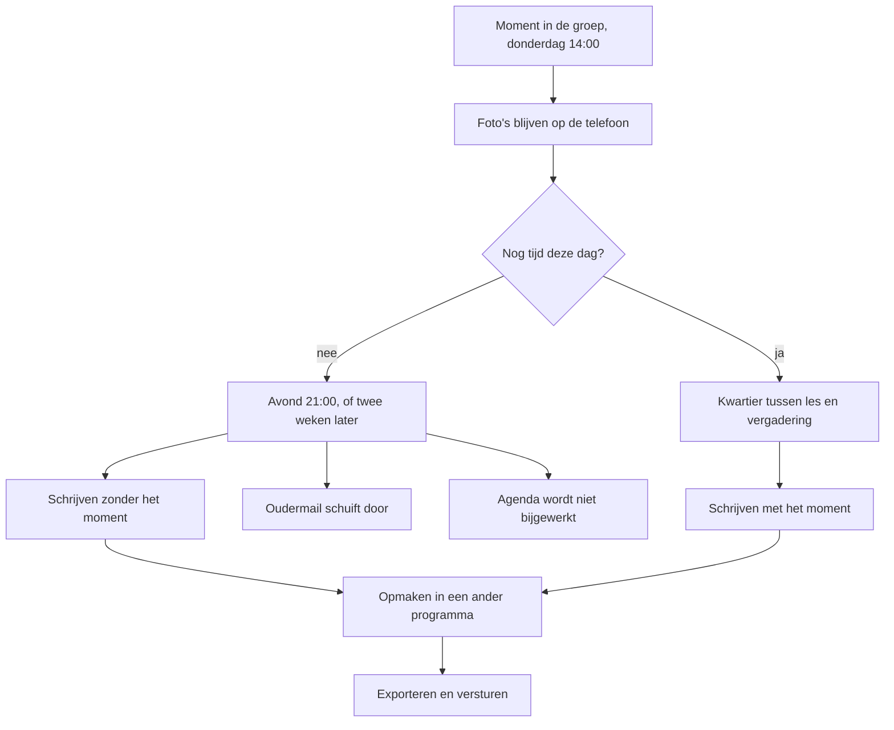

<!-- Onderdeel van de EduFlow Product Bible v1.0 (7 augustus 2026).
     Bindend. Volledig document: docs/product-bible-volledig.md
     Wijzigingen lopen via docs/19-besluitenregister.md -->

## 1. Missie en visie

### 1.1 Het probleem

Pedagogisch documenteren is geen schrijftaak. Het is een kijktaak met een schrijfstaart, en die staart kost meer dan de kop. De getallen hieronder komen uit de praktijk van de maker: schattingen, geen metingen, nauwkeurig genoeg om het probleem te beschrijven en te onnauwkeurig om er een belofte op te bouwen. Daarom staat er een nulmeting tegenover (zie §1.6).

#### 1.1.1 De avond

Een documentatie met zes foto's kost nu vijfendertig tot vijftig minuten, van de eerste handeling tot het bestand dat naar ouders kan. Die minuten vallen in de avond, tussen half negen en tien — het enige aaneengesloten uur van de dag waarin niemand iets van je wil.

| Fase | Wat je doet | Geschatte tijd |
|---|---|---|
| Overzetten | Foto's van de telefoon naar de laptop, of via een clouddienst | 6 tot 10 minuten |
| Kiezen | Uit vijftien foto's de zes kiezen die iets laten zien | 3 tot 5 minuten |
| Schrijven | De tekst, inclusief twee keer overlezen en herformuleren | 15 tot 25 minuten |
| Opmaken | Foto's en tekst in een tekstverwerker of ontwerpprogramma zetten | 8 tot 12 minuten |
| Uitleveren | Naar PDF, naar een afbeelding, in een mail, versturen | 4 tot 6 minuten |

Drie van de vijf fasen hebben niets met pedagogiek te maken: overzetten, opmaken en uitleveren zijn samen achttien tot achtentwintig minuten waarin je geen enkele keuze maakt over een kind. Bij twee documentaties per week en veertig schoolweken is dat vijftig tot zestig uur per schooljaar — anderhalve werkweek, in je eigen tijd.

#### 1.1.2 De foto's die blijven staan

Je maakt op donderdagmiddag vijftien foto's van het bouwwerk van Kjeld en Roos. Ze staan vrijdag nog op je telefoon, en maandag ook. De reden is niet luiheid: de telefoon is het apparaat waarmee je fotografeert, de laptop het apparaat waarop je schrijft, en de brug daartussen moet elke keer opnieuw gebouwd worden. Kabel, clouddienst, jezelf mailen — elke route kost een handeling die je om kwart over drie niet gaat doen. Ergens in november staan er zeshonderd foto's op je telefoon waarvan je van driekwart niet meer weet waarom je ze maakte.

#### 1.1.3 Het moment dat je kwijt bent

Dit is de duurste post en hij staat in geen enkele tijdregistratie.

Schrijf je op donderdag om kwart over drie, dan weet je nog dat Kjeld drie keer opnieuw begon en bij de derde keer zei dat het "toch anders moest", en dat Hanae er tien minuten zwijgend bij stond en toen precies één ding aanwees. Schrijf je twee weken later, dan heb je de foto's en verder niets. Je ziet een bouwwerk en je schrijft: "De kinderen werkten samen aan een constructie en toonden doorzettingsvermogen." Dat is niet onwaar, het is een bijschrift.

Het verlies is dubbel: je bent de inhoud kwijt en de zekerheid. Was het Kjeld die het zei of Jasper, en dus schrijf je "een kind". Een documentatie die veertien dagen na het moment ontstaat, is een andere documentatie dan dezelfde na twee uur. Niet minder netjes, wel minder waar.

#### 1.1.4 De mail die je drie keer schrijft

Een ouder mailt op dinsdagavond een vraag die tussen zorg en verwijt in hangt. Woensdag schrijf je een antwoord dat te kort is en afgemeten klinkt. Je schrijft het opnieuw, nu te lang, met een zin erin die je terugleest als een verontschuldiging voor iets waarvoor je je niet hoeft te verontschuldigen. De derde versie klopt. Verstuurd om kwart over elf.

Twaalf tot twintig minuten per zorgvuldige mail, en bij drie per week is dat vijfenveertig minuten. Het zwaarste deel is niet het typen maar het kiezen van de toon, en dat doe je door te schrijven en weg te gooien. Daar komt bij dat een ontvangen oudermail vol staat met gegevens die nergens heen mogen: de achternaam van het kind, de naam van de ouder, een handtekening met een telefoonnummer, soms de naam van een arts. Daarom is het plakken van zo'n mail in een willekeurige chatbot geen kleine overtreding maar de kern van het probleem (zie hoofdstuk 15).

#### 1.1.5 Het schooljaar dat je overtypt

In augustus komt er een PDF van het bestuur met de vakanties, de studiedagen en de margedagen. Die PDF is geen agenda. Overtypen kost drie kwartier tot een uur; niet overtypen kost vijf tot tien minuten per week aan "wanneer was die studiedag ook alweer" en één keer per jaar een afspraak op een dag die er niet is. Wat je in augustus wilt zien is geen maand maar het hele jaar op één scherm, en dat overzicht bestaat nu op papier of nergens.

#### 1.1.6 Waarom dit één probleem is

Documenteren, agenda en mail lijken drie taken, maar ze putten uit dezelfde bron, en die bron is niet tijd in het algemeen: het is aaneengesloten aandacht buiten de groep. Een leerkracht heeft daar per week twee tot vier uur van, en dat is het volledige budget waaruit alle drie betaald worden.

Daarom helpt het niet om één van de drie sneller te maken. Gebruik je de twintig gewonnen minuten om de mail van dinsdag eindelijk te beantwoorden, dan is er tijdwinst die je niet voelt; de winst wordt pas merkbaar als de drie samen onder het budget blijven. Bovendien raken ze elkaar inhoudelijk: de documentatie van donderdag is het antwoord op de oudermail van vrijdag, en de studiedag is de reden dat die documentatie op woensdag niet lukte. Wie de drie in drie losse programma's zet, verplaatst het knippen en plakken naar de gebruiker.

Het probleem is dus niet dat documenteren lang duurt, maar dat het budget te klein is voor drie taken die elkaar nodig hebben — waardoor alle drie te laat gebeuren en de duurste bovendien in kwaliteit achteruitgaat naarmate hij later gebeurt.

### 1.2 Missie

EduFlow geeft pedagogische professionals in het Nederlandse funderend onderwijs en de kinderopvang de tijd terug die nu opgaat aan het opschrijven, opmaken en uitleveren van wat zij al weten, zodat een documentatie kan ontstaan op de dag van het moment in plaats van twee weken erna. De app neemt het schrijfwerk over rond drie terugkerende taken — pedagogische documentatie, de schooljaaragenda en oudercommunicatie per mail — en laat de professional de regie houden over elk woord dat naar buiten gaat. De missie is gehaald wanneer de mediaan van de documentatieketen ten hoogste 60% is van de nulmeting uit §1.6, gemeten met hetzelfde protocol, terwijl er geen enkele naam, foto of bestandsnaam de school heeft verlaten die daar niet uit mocht.

Die zin is zo gebouwd dat je hem kunt afkeuren.

**"de tijd terug"** is een claim over minuten, niet over gevoel: een app die het werk aangenamer maakt maar niet korter, haalt de missie niet.

**"op de dag van het moment"** is de kwalitatieve helft. Tijdwinst die je gebruikt om nog steeds 's avonds te schrijven, verandert de documentatie niet; de winst moet groot genoeg zijn om het schrijfmoment te verplaatsen naar het kwartier tussen de les en de vergadering (zie §2.1.4).

**"drie terugkerende taken"** is een grens, geen opsomming. Er komt geen vierde bij in versie 1.0 (zie §2.3).

**"de regie houden over elk woord"** is de harde ondergrens: elk AI-resultaat is een voorstel en niets verlaat het apparaat zonder dat een mens op dat moment een knop indrukt. Die eis wint van elke andere eis in dit document (zie §2.2).

**"geen enkele naam, foto of bestandsnaam"** is meetbaar via het logboek: één aantoonbaar geval is genoeg om deze helft als niet gehaald te noteren.

De missie zegt met opzet niets over betere documentaties, want of een documentatie goed is hangt af van hoe goed er gekeken is. Wat de app wel kan, is het schrijven dicht genoeg bij het kijken houden om de details te bewaren.

### 1.3 Visie op vijf jaar

In schooljaar 2031-2032 ziet pedagogisch documenteren er zo uit voor wie met EduFlow werkt zoals bedoeld.

Het schrijven gebeurt op de dag zelf. Niet omdat de professional gedisciplineerder is geworden, maar omdat een keten van veertig minuten is teruggebracht tot een kwartier, en dat past tussen de les en de vergadering. De avond is weer avond.

De foto's staan niet meer stil op de telefoon; ze zijn de aanleiding geworden. De app toont ze één voor één met een vraag erbij, en het antwoord is de documentatie in ruwe vorm. De foto zelf blijft op het apparaat: in 2026 was dat een beperking, nu is het een werkwijze.

De reeks is normaal geworden. Een documentatie staat in een lijn — vier over hetzelfde kunstwerkproject, drie over hetzelfde onderzoek — en de app kent die lijn, zodat niemand bij de vierde hoeft terug te bladeren. Dat is de functie die het verschil maakt met een losse chatbot, en de reden dat mensen blijven.

Wat er naar buiten gaat is zichtbaar geworden: op het scherm, vlak voor verzending, in volledige vorm — de plek waar je merkt dat er een naam in je tekst staat die niet in je lijst stond. De schrijfstijl in de app is die van de gebruiker, niet omdat er een model getraind is maar omdat de app heeft gemeten hoe jij schrijft. En het schooljaar past op één scherm.

#### 1.3.1 Wat niet verandert

Deze lijst hoort bij de visie en is even bindend.

Het kijken blijft mensenwerk en wordt geen minuut korter. Een activiteit van vijfenveertig minuten duurt over vijf jaar nog steeds vijfenveertig minuten; de winst zit uitsluitend in de staart.

De keuze wát je vastlegt blijft een pedagogisch oordeel. De app stelt geen onderwerpen voor, signaleert geen achterstanden en wijst geen kinderen aan. Wie besluit dat het bouwwerk van Kjeld een documentatie waard is en de tekening van Pippa niet, is de professional — en daar blijft ook de verantwoordelijkheid voor wat er staat. Een tekst die de AI voorstelde en die jij overnam, is jouw tekst.

Het nalezen blijft: elke AI-tekst wordt gelezen voordat hij ergens heen gaat, en die minuten tellen mee in de meting. De AVG wordt evenmin eenvoudiger; het gesprek met het bestuur, de gegevensbeschermingseffectbeoordeling, de verwerkersovereenkomst en de FRIA-toets blijven bestaan en kosten doorlooptijd (zie hoofdstuk 15).

En het belangrijkste: een dunne observatie blijft een dunne observatie. AI maakt van drie slordige zinnen een gladde alinea, en dat is een risico en geen winst. Een documentatie die er goed uitziet en niets zegt, is schadelijker dan een documentatie die er slecht uitziet en iets zegt, want de eerste wordt geloofd. Daarom wordt de app niet beoordeeld op hoe mooi de uitvoer klinkt (zie hoofdstuk 20).

### 1.4 Wat EduFlow uitdrukkelijk niet is

Vier grenzen. Ze staan er niet uit bescheidenheid, maar omdat achter elke grens een verplichting ligt die het product zou breken.

| Grens | Waarom die grens er is | Wat er breekt als je hem overschrijdt |
|---|---|---|
| Geen leerlingvolgsysteem | Het dossier van een kind kent bewaartermijnen, overdrachtsregels en een verantwoordingsketen | De school gaat erop leunen; verwijderen wordt onmogelijk; je wordt schakel in een keten die je niet beheerst |
| Geen beoordelingsinstrument | Leerresultaten beoordelen en onderwijsniveau bepalen vallen onder hoog risico in de AI-verordening | Conformiteitsbeoordeling, kwaliteitsmanagementsysteem en formeel menselijk toezicht: werk voor een organisatie, niet voor één persoon |
| Geen communicatieplatform | Versturen betekent verantwoordelijk zijn voor bezorging, archief en bewijs | De belofte dat de app niets verstuurt wordt oncontroleerbaar, want het verzendrecht is dan aangevraagd |
| Geen chatbot | Een leeg invoerveld legt de last bij de gebruiker en levert generieke tekst | Zonder taakstructuur geen stabiele pseudonimisering, geen volledig controlescherm, geen toetsbare kwaliteit |

#### 1.4.1 Geen leerlingvolgsysteem

Een leerlingvolgsysteem is het dossier van een kind: toetsresultaten, ontwikkelingsperspectieven, handelingsplannen en de verantwoording daarvan, met wettelijke bewaartermijnen en een overdracht bij een overstap. EduFlow is dat niet en vervangt ParnasSys niet. De grens ligt niet bij wat technisch kan — een documentatie aan een leerling koppelen gebeurt al — maar bij de rol. Zodra de school EduFlow gaat zien als de plek waar het over een kind staat, wordt verwijderen onmogelijk, wordt de maker aansprakelijk voor volledigheid, en breekt het lokale-eerst-model, want een dossier dat op één laptop staat is geen dossier.

#### 1.4.2 Geen beoordelingsinstrument

EduFlow geeft geen cijfers, bepaalt geen niveaus, doet geen voorspellingen en bewaakt geen toetsen.

De juridische reden is de scherpste. Hoog risico in het onderwijs betreft vier dingen: toelating en plaatsing, het beoordelen van leerresultaten, het bepalen van onderwijsniveau, en het bewaken van gedrag tijdens toetsen. Wie één van die vier doet, valt onder bijlage III van de AI-verordening, met een risicomanagementsysteem, technische documentatie, logging, formeel geregeld menselijk toezicht en een conformiteitsbeoordeling als gevolg (zie hoofdstuk 15). Dat is werk voor een organisatie, niet voor één persoon met drie petten.

De pedagogische reden weegt even zwaar. Documentatie die beoordeelt, verandert wat je opschrijft: staat er een veld dat een niveau uitdrukt, dan wordt "Kjeld begon drie keer opnieuw" geen observatie meer maar een aanwijzing voor een score. Daarom sluit de grens ook de zachte varianten uit: geen sterretjes, geen voortgangsbalken, geen automatische samenvatting per leerling. Een signaal is een oordeel met een ander lettertype.

#### 1.4.3 Geen communicatieplatform

EduFlow leest je postbus en stelt een antwoord op; versturen doe je zelf. De app vraagt bij Microsoft en Google geen enkel verzendrecht aan, en dat is het hele punt: een belofte in een privacyverklaring is een belofte, maar een aanvraag waarin het verzendrecht ontbreekt is een feit dat Karin kan controleren in het toestemmingsscherm van de aanbieder, zonder de code te lezen.

Wat er breekt bij overschrijding is meer dan die controleerbaarheid. Versturen betekent verantwoordelijk zijn voor bezorging en archief, en het betekent een tweede plek waar mailgeschiedenis staat — wat botst met één bron van waarheid (zie §2.1.2). En het betekent een verzendknop: de plek waar op een druk moment een concept naar de verkeerde ouder gaat. De prijs staat in §2.1.1 en wordt niet weggemoffeld.

#### 1.4.4 Geen chatbot

Er is geen gespreksvenster met een knipperende cursor, geen algemene vraagfunctie en geen doorlopend gesprek. Niet omdat een gesprek onhandig is, maar omdat het drie dingen onmogelijk maakt. Pseudonimisering: codes met een stabiele nummering werken alleen binnen een afgebakende eenheid als één documentatie of één mail. Het controlescherm: "Bekijk wat er verstuurd wordt" toont de volledige opdracht, en bij een gesprek is dat de hele geschiedenis en daarmee onleesbaar. Toetsbaarheid: de kwaliteit wordt gemeten met een vaste set van invoer en verwachte uitkomst (zie hoofdstuk 20), en een open gesprek heeft geen verwachte uitkomst.

En in de praktijk het zwaarst: een chatbot lekt via de gebruiker. Een leeg invoerveld nodigt uit tot plakken, en wat er geplakt wordt is een oudermail met een achternaam, een telefoonnummer en de naam van een behandelaar. Precies daar gaat het nu mis, en een app die datzelfde invoerveld aanbiedt met een geruststellende naam erboven, maakt het probleem groter.

### 1.5 Doelgroep en context

Zes mensen bepalen of dit product werkt. Vier gebruiken het, twee laten het toe. Per persoon staat hieronder het moment in de week waarop EduFlow bestaat, want een app die niet in een bestaand moment past, wordt niet gebruikt.

| Persona | Apparaat | Het moment | Wat telt |
|---|---|---|---|
| Ilse (36) | Laptop | Donderdag 15:15-15:45 | `DOC`, schrijfmodus |
| Bram (52) | Laptop | Maandag 08:10-08:25 | `DAS` en `AGE` |
| Fatima (29) | Telefoon | Dagelijks 16:20-16:35 | `DOC`, gespreksmodus |
| Joost (44) | Laptop | Dinsdag 11:00-11:20 | Zoeken |
| Karin (58) | Laptop | Eén middag in september | Privacy |
| Maarten (41) | Laptop | Twee dagdelen per schooljaar | `INS` |

#### 1.5.1 Ilse — leerkracht groep 4, vier dagen

Om kwart voor drie is de les klaar, om kwart over drie begint de bouwvergadering. In dat half uur zet Ilse zes foto's om in één documentatie. Ze kiest de reeks Kunstwerk Dok, en de app weet dat dit de vierde is en wat er in de eerste drie stond. Ze typt vier zinnen zoals ze die altijd typt: kort, in de tegenwoordige tijd, met wat een kind letterlijk zei tussen aanhalingstekens. Ze laat de AI meeschrijven, neemt het voorstel over met aanvullen en wijzigt twee woorden. Ze bekijkt wat er verstuurd wordt, want dat is de tweede keer deze week dat er een naam in staat die niet in haar lijst stond. Daarna kiest ze een opmaak uit vier miniaturen, maakt een deelbare afbeelding, bevestigt één keer dat het beeld gedeeld mag worden, en kopieert hem in een mail.

Ilse is de maatstaf: past het bij haar niet in een half uur, dan klopt er iets niet.

#### 1.5.2 Bram — leerkracht groep 7, duobaan

Maandag tien over acht, vijftien minuten voor de kinderen komen. Bram wil twee dingen weten: wat heeft zijn duo donderdag en vrijdag gedaan, en wanneer valt de studiedag. Hij opent het Dashboard, ziet de laatste documentaties en de komende dagen, en klikt door naar de jaarweergave omdat het september is en die dan de standaard is. Binnen dertig seconden weet hij dat de studiedag op 6 oktober valt en dat de oudergesprekken een week naar voren moeten.

Bram schrijft weinig; hij leest. Eén beperking is voor hem echt: in versie 1.0 ziet hij alleen wat op zijn eigen apparaat staat, en wat zijn duo documenteerde komt via een exportbestand bij hem of niet.

#### 1.5.3 Fatima — pedagogisch medewerker BSO

Twintig over vier, buiten, kinderen nog aan het spelen, telefoon in de ene hand en een beker in de andere. Fatima komt niet aan een laptop toe; haar apparaat is de telefoon, en die staat op het beginscherm, want dat is de enige manier waarop haar werk een vakantie overleeft.

Ze opent gespreksmodus en kiest de vier foto's die ze net maakte. De app toont ze één voor één met een vraag erbij, en zij dicteert twee regels per foto met de microfoonknop van haar toetsenbord, want typen met één hand gaat niet. De foto's blijven op haar telefoon; alleen haar antwoorden gaan weg. Aan het eind bouwt de app daar een documentatie van die zo al goed genoeg is.

Bij Fatima staat de app in het Nederlands van de opvang: waar Ilse "Leerling" ziet, ziet zij "Kind". Dat is één instelling die alle schermteksten omzet, geen aparte versie van het product.

#### 1.5.4 Joost — intern begeleider

Dinsdag elf uur, twintig minuten voor het gesprek met de ouders van Kjeld. Joost wil weten wat er dit jaar over Kjeld is vastgelegd, en dat kan in drie groepen staan: zijn stamgroep, de projectgroep van het onderzoek en de zorggroep waar hij sinds november in zit. Hij zoekt op de naam, filtert op leerling en periode, krijgt zeven documentaties uit drie groepen en twee reeksen, leest ze en sluit de laptop.

Joost is de reden dat lidmaatschap een eigen entiteit met een looptijd is (zie §2.1.7) en dat zoeken ook door tekst, citaten, reeksnaam en gekoppelde namen gaat.

#### 1.5.5 Karin — functionaris gegevensbescherming

Karin gebruikt EduFlow niet. Haar moment is één middag in september 2026, met een werkende app op het scherm. Ze wil vier dingen zien: het controlescherm met een echte tekst erin, de lijst met rechten die de app aanvraagt zodat ze kan vaststellen dat het verzendrecht ontbreekt, het logboek, en de knop waarmee alles gewist wordt. Karin is daarmee geen obstakel maar een ontwerpeis: alles wat zij moet kunnen zien, bestaat als scherm. Haar akkoord staat in de Definition of Done, en de gegevensbeschermingseffectbeoordeling, de FRIA-toets en de verwerkersovereenkomst gaan vooraf aan het eerste echte kind in de app (zie hoofdstuk 15).

#### 1.5.6 Maarten — ICT-coördinator bij het bestuur

Maarten heeft twee dagdelen per schooljaar voor dit product, inclusief het moment waarop iemand belt dat het niet werkt. Zijn eisen zijn kort: geen app store, geen installatiebestand, geen beheeromgeving die hij onderhoudt, geen accounts die hij aanmaakt en reset. Wat hij wel doet: een toegangscode per apparaat uitgeven, de provider vastzetten op verwerking binnen de EU, en één keer per kwartaal in het logboek kijken.

#### 1.5.7 De bredere markt

De zes hierboven vormen de eerste kring: de eigen groep, het eigen team, de eigen school. Daarbuiten liggen drie kringen, in deze volgorde.

Het funderend onderwijs is de tweede kring: ruim zesduizend scholen in het primair onderwijs met in de orde van grootte van honderdvijftigduizend personeelsleden. Pedagogisch documenteren is daar geen verplichting maar wel een groeiende praktijk, sterk aanwezig bij scholen met een Reggio-, Jenaplan- of ontwikkelingsgerichte inslag; deze groep herkent het probleem uit §1.1 zonder uitleg.

De kinderopvang en de buitenschoolse opvang vormen de derde kring en passen inhoudelijk het beste: daar is documenteren wél onderdeel van de opdracht en gebeurt het vrijwel altijd met een telefoon in de hand. De taalinstelling van "Leerling" naar "Kind" is voor die markt de enige productwijziging die nodig is; Fatima is daar de maatstaf, niet Ilse.

De vierde kring is het bestuursniveau: uitrol over meerdere scholen, één providerkeuze, één verwerkersovereenkomst — de kring waarin `SyncService` van interface naar implementatie moet gaan. Die volgorde is niet omkeerbaar: een product dat begint bij het bestuur wordt ontworpen voor uitrol en niet voor het half uur van Ilse, en dan wint verantwoording van bruikbaarheid.

### 1.6 De belofte in getallen

De belofte is dat de mediaan van de documentatieketen met 40% daalt. Om die belofte te kunnen breken, moet er eerst een getal zijn dat niet meer te verplaatsen is.

#### 1.6.1 De nulmeting

De nulmeting bestaat uit twaalf documentaties die de maker met de hand tijdt, in de eerste vier schoolweken van 2026-2027, van 24 augustus tot en met 18 september 2026. Pas als die twaalf metingen compleet zijn, begint sprint 1. Dat kost vier weken bouwtijd en dat is de prijs van een getal dat je achteraf niet kunt wegredeneren.

Per documentatie worden vijf fasen apart geklokt: overzetten, kiezen, schrijven, opmaken en uitleveren. De klok start bij de eerste handeling na het moment in de groep en stopt bij het bestand dat verstuurd kan worden. Genoteerd worden de tijd per fase, het aantal foto's, het aantal woorden en of er een reeks in het spel was. De uitkomst is één getal: de mediaan over twaalf documentaties, niet het gemiddelde, want één avond waarin de laptop vastliep verpest een gemiddelde. De ruwe metingen worden bewaard en gepubliceerd, ook als ze onwelgevallig zijn.

De nameting gebruikt hetzelfde protocol, dezelfde fasen en dezelfde persoon, over twaalf documentaties in vier opeenvolgende schoolweken na oplevering van de documentatiemodule. De doelwaarde is een mediaan van ten hoogste 60% van de nulmediaan. Agenda en mail krijgen elk een eigen nulmeting vóór hun sprint; alleen documentatie heeft een contractuele doelwaarde in versie 1.0.

#### 1.6.2 Meten zonder zelfbedrog

**Meet de hele keten, niet de leukste schakel.** Alleen de schrijffase meten is verleidelijk, want daar is de winst het duidelijkst. Die fase is de kleinste helft van het probleem (zie §1.1.1); wie alleen die meet, meet zijn eigen gelijk.

**Tel de nieuwe kosten mee.** Het controlescherm lezen kost tijd die in de nulmeting niet bestond, en de keuze aanvullen of vervangen kost een handeling. Die seconden staan in de nameting en worden niet weggeboekt als "went vanzelf".

**Tel de mislukkingen mee.** Een AI-voorstel dat je weggooit en waarna je opnieuw begint, is geen mislukte meting maar een meting. Alleen de geslaagde gevallen meten is de meest voorkomende vorm van zelfbedrog.

**Boek de inrichting apart en rapporteer hem.** De leerlingenlijst, de reeksen en het stijlvoorbeeld kosten samen twintig tot veertig minuten. Dat is eenmalig en hoort niet in de mediaan, maar wel in het verslag: anders wordt de belofte gedaan aan iemand die die veertig minuten nog voor zich heeft.

**Winst is niet hetzelfde als weglating.** Gaat het opmaken sneller omdat de app minder kan dan een tekstverwerker, dan is dat scopeverlies. De vraag is niet of het sneller ging, maar of het resultaat hetzelfde deed. En laat de meting nalezen: één persoon met drie petten controleert zichzelf alleen goed als die controle een aparte handeling is met een eigen, latere datum.

### 1.7 Succes en falen

#### 1.7.1 Waaraan je na een schooljaar ziet dat het werkt

Acht criteria, gemeten aan het eind van schooljaar 2026-2027, elk te beantwoorden met een getal of een gebeurtenis.

| # | Criterium | Norm |
|---|---|---|
| 1 | Tijd per documentatie | Mediaan van de nameting ten hoogste 60% van de nulmediaan |
| 2 | Volume bij gelijke tijd | Minstens 60 documentaties in het schooljaar, in minder totale tijd dan het jaar ervoor |
| 3 | Moment van schrijven | Minstens de helft ontstaat op de dag van het moment |
| 4 | Bruikbaarheid van de AI | Van de laatste 30 voorstellen wordt minstens 20 overgenomen zonder volledige herschrijving |
| 5 | Regie is echt gebruikt | Het stijlprofiel is minstens één keer door de gebruiker zelf gewijzigd |
| 6 | Privacy | Nul aantoonbare gevallen waarin een naam, foto of bestandsnaam de school verliet die er niet uit mocht |
| 7 | Back-up | Elke maand minstens één geslaagde export, en minstens één keer aantoonbaar teruggezet op een tweede apparaat |
| 8 | Overdraagbaarheid | Twee collega's gebruiken de app een maand lang zonder dat de maker erbij zit |

Criterium 8 is de zwaarste: zolang de maker de enige gebruiker is, is elke onduidelijkheid oplosbaar door de maker te vragen. Pas bij de tweede gebruiker blijkt of eenvoud een eigenschap van het product is of van de kennis in het hoofd van de bouwer.

#### 1.7.2 Faalscenario 1 — de AI schrijft niet zoals jij

Dit is het meest waarschijnlijke faalscenario en het is dodelijk, want een tekst die je volledig herschrijft kost meer tijd dan een tekst die je zelf typt.

Het vroege signaal is meetbaar vanaf de eerste week: elke interactie legt vast wat eruit kwam — overnemen, opnieuw of weggooien. Blijft de verhouding overnemen onder 50% over de laatste twintig interacties, dan is het mis. Een tweede signaal komt eerder en is subtieler: je merkt dat je het voorstel niet leest maar overslaat.

De tegenmaatregel heeft drie lagen: de gouden testset met drie tot vier paren van een ruwe notitie en de documentatie zoals die eruit hoort te zien (zie hoofdstuk 20), de drie leermechanismen, en een vooraf vastgelegde uitweg. Die uitweg luidt: blijft de overnameverhouding na tien werkweken onder 50%, dan gaat de AI-knop uit via de functieschakelaar. Wat overblijft is een documentatiegereedschap met opmaak, pagina's, export, agenda en zoeken, en dat bespaart nog steeds de achttien tot achtentwintig minuten uit §1.1.1 die niets met schrijven te maken hebben.

#### 1.7.3 Faalscenario 2 — de privacygesprekken lopen vast

Het vroege signaal komt in september 2026, in het eerste gesprek met Karin — niet dat zij bezwaren heeft, want dat hoort erbij, maar dat zij een vraag stelt die niet met een scherm te beantwoorden is. Een tweede signaal komt van het bestuur: het weigert een verwerkersovereenkomst met een AI-aanbieder te tekenen, of het antwoord blijft na zes weken uit.

De tegenmaatregelen liggen alle vier vóór het gesprek. Er wordt gebouwd en getest met een verzonnen groep van twintig kinderen, zodat een vastgelopen gesprek de bouw niet stopt. Het gesprek wordt gevoerd met een werkende app, want een controlescherm dat je kunt aanwijzen doet meer dan tien pagina's toelichting. De standaardprovider verwerkt binnen de EU, meestal het punt waarop het gesprek doorgaat of stopt. En loopt het toch vast: AI is een functieschakelaar per module, dus een bestuur dat AI niet toestaat krijgt EduFlow zonder AI, waarbij documentaties, opmaak, export, agenda en zoeken offline blijven werken.

#### 1.7.4 Faalscenario 3 — de app wordt een tweede administratielast

Dit scenario is het gemeenste, want tijdens de bouw ziet het eruit als succes: elke toegevoegde functie voelt als vooruitgang en de optelsom is een formulier.

Drie vroege signalen. Het gebruik daalt: in week zes maak je minder documentaties dan in week twee, terwijl er niets veranderd is aan je werk. Het aantal handelingen per documentatie stijgt terwijl de tijd niet daalt. En het derde is het duidelijkst en het minst meetbaar: je vult iets in omdat het veld er staat.

De tegenmaatregelen zitten in het ontwerp en niet in de discipline. Een documentatie ontstaat pas bij de eerste inhoud, dus leeg openen en weggaan laat geen lege regels achter. Er zijn geen statussen die je zelf moet zetten: de overgang van concept naar gedeeld volgt uit de eerste geslaagde export. Buiten de inhoud zijn er geen verplichte velden; titel, reeks en koppeling aan een leerling zijn alle drie optioneel, en het enige verplichte veld is verplicht omdat het zonder niet werkt: een mailconcept heeft een onderwerp. Elk nieuw veld gaat door de kostentoets uit §2.4 voordat het beschreven wordt.

En de harde regel: kost een scherm in de eerste maand meer dan één minuut per documentatie ten opzichte van de fase die het vervangt, dan gaat het scherm eruit. Niet vereenvoudigd, eruit.

### 1.8 Waarom nu

Dit product kon in 2022 niet gebouwd worden. Vier dingen zijn sindsdien veranderd, en alle vier zijn ze noodzakelijk.

| Wat veranderde | Waarom het doorslaggevend is |
|---|---|
| De schrijfkwaliteit in het Nederlands | Tot ongeveer 2024 herschreef je elk voorstel volledig, en dat kost meer tijd dan een leeg vel. De drempel is criterium 4 uit §1.7.1: twee van de drie voorstellen bruikbaar zonder herschrijving |
| Verwerking binnen de EU | In 2022 ging elke aanroep naar de Verenigde Staten, waarmee het gesprek met een functionaris gegevensbescherming op voorhand verloren was. Er zijn nu meerdere aanbieders met verwerking én opslag in een EU-regio |
| Er is een kader om je aan te houden | AI-verordening, digitale omnibus, SIVON Toetsingskader, AP-handreiking en Normenkader IBP zijn alle vijf van de laatste twee jaar. In 2022 was er geen lijst om af te vinken en dus geen manier om aan te tonen dat je het goed deed |
| De browser kan genoeg | IndexedDB met blobs, een betrouwbare schatting van het opslagverbruik, het deelmenu van de telefoon, dicteren via het toetsenbord en PDF-generatie in de app maken een lokaal-eerst product mogelijk zonder server voor de gegevens |

Het kader is hier geen belemmering maar een route: het beschrijft precies waar de grens tussen aanvaardbaar en hoog risico ligt, en dat is de grens waarlangs dit product ontworpen is.

#### 1.8.1 Waarom het niet kan wachten

De praktijk loopt vooruit op de regels. Collega's plakken nu al oudermails in een publieke chatbot, niet uit onverschilligheid maar omdat het werkt en er niets anders is. Elke maand zonder veilig alternatief is een maand waarin die gewoonte vaster wordt: een verbod verliest van een gewoonte, een alternatief dat er is wint ervan.

De transparantieverplichtingen uit artikel 50 gelden sinds 2 augustus 2026 en de markering van AI-uitvoer volgt op 2 december 2026. Wie nu bouwt, bouwt die verplichtingen in vanaf de eerste regel code; wie later bouwt, verbouwt ze erin, en dat is duurder en slechter.

De gegevensbeschermingseffectbeoordeling, de FRIA-toets en de verwerkersovereenkomst kosten doorlooptijd in maanden, en die begint pas als er iets te beoordelen valt: een werkende app. En 2026-2027 is de enige meetperiode van dit jaar, want de nulmeting kan alleen in de eerste weken van een schooljaar. Wie die weken laat lopen, meet pas in augustus 2027, en tot die tijd is elke uitspraak over tijdwinst een mening.
