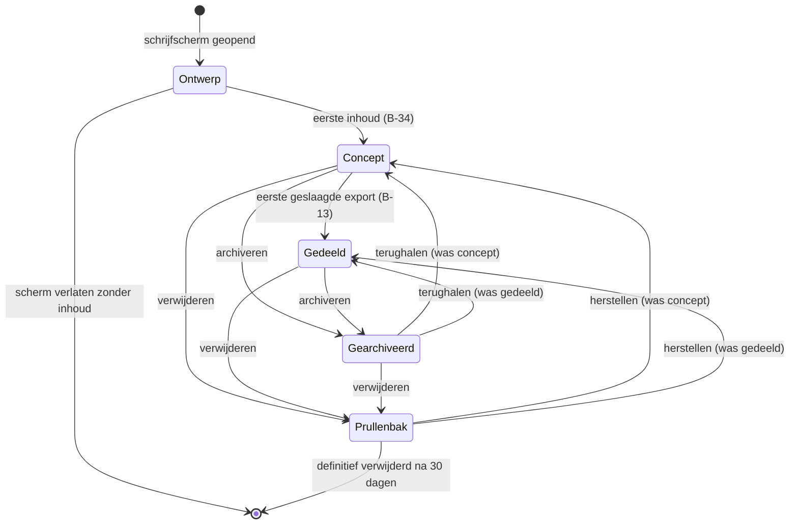
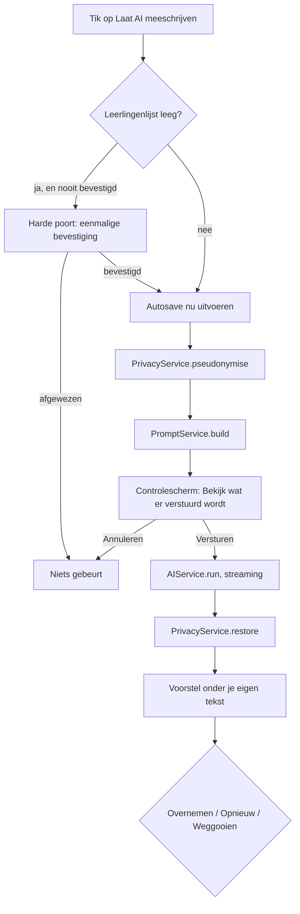

<!-- Onderdeel van de EduFlow Product Bible v1.0 (7 augustus 2026).
     Bindend. Volledig document: docs/product-bible-volledig.md
     Wijzigingen lopen via docs/19-besluitenregister.md -->

# Hoofdstuk 6.1 — Documentaties

### 6.1 Documentaties

De module Documentaties (`DOC`) is de kern van EduFlow. Hier wordt van een handvol foto's en een paar losse zinnen een pedagogische documentatie gemaakt die naar ouders kan. Alle andere modules zijn eromheen gebouwd: de agenda levert de context van het schooljaar (zie §6.2), de mail levert het kanaal waarlangs een documentatie bij ouders komt (zie §6.3), het dashboard toont wat er open staat (zie §6.4) en Instellingen levert de leerlingen, groepen, reeksen en het stijlprofiel waar deze module op leunt (zie §6.5).

De module bestaat uit vier schermen: het overzicht, het schrijfscherm, gespreksmodus en de reeksweergave. Het exportpaneel en het controlescherm "Bekijk wat er verstuurd wordt" zijn panelen over het schrijfscherm, geen eigen schermen (B-06). De schermnummers staan in hoofdstuk 11.

#### 6.1.1 Wat een documentatie is

Een **documentatie** is één afgeronde beschrijving van één moment of één activiteit, bestaande uit tekst, foto's en citaten, verdeeld over één of meer pagina's, gekoppeld aan nul of meer leerlingen en nul of meer groepen, en optioneel onderdeel van een reeks. Een documentatie is geen dagboek, geen logboek en geen dossier: hij hoort bij een moment, niet bij een kind. Wil je alles over één kind terugvinden, dan doe je dat met een filter (zie §6.1.3), niet met een dossierscherm.

Een documentatie is de eenheid van export, de eenheid van delen en de eenheid van verwijderen. Wat in één documentatie zit, gaat samen de deur uit of helemaal niet.

**Levenscyclus.** Een documentatie kent vier toestanden en drie merkers. De twee statussen heten **concept** en **gedeeld** (B-13). Archivering en verwijdering zijn geen statussen maar aparte merkers (`archivedAt` en `deletedAt`), zodat een gearchiveerde documentatie zijn status behoudt en je na herstel weet of hij ooit gedeeld is.



De toestand **Ontwerp** bestaat alleen in het geheugen. Er is geen record, er staat niets in het overzicht en er staat niets in IndexedDB. Pas bij de eerste inhoud schrijft `DocumentationService` het record weg (B-34). Onder inhoud verstaat de app: een titel van minstens één teken, tekst van minstens één teken, een toegevoegde foto, een toegevoegd citaat, of een koppeling aan een leerling, een groep of een reeks. Het wijzigen van de datum alleen telt niet als inhoud, want de datum staat er al vanaf het openen.

**Velden.** Alle velden staan hieronder. `DocumentationService` is de enige plek waar ze geschreven worden (U-03); schermen roepen de service aan en schrijven nooit rechtstreeks naar `StorageService`.

| Veld | Type | Verplicht | Standaardwaarde | Validatie | Maximum |
|---|---|---|---|---|---|
| `id` | `string` (UUIDv7) | ja | door de app gezet | UUIDv7-vorm, onveranderlijk | 36 tekens |
| `title` | `string` | nee | lege tekst | getrimd, geen regeleinden, geen reeksnaam als voorvoegsel (B-35) | 120 tekens |
| `date` | `string` (`YYYY-MM-DD`) | ja | vandaag volgens de apparaatklok | geldige kalenderdatum, niet vóór 2015-08-01, niet later dan vandaag plus 365 dagen | 10 tekens |
| `seriesId` | `string \| null` | nee | `null` | verwijst naar een bestaande `Series` zonder `deletedAt` | 36 tekens |
| `studentIds` | `string[]` | nee | `[]` of de standaardgroep uit Instellingen | bestaande `Student`-records, geen dubbelen, volgorde is invoervolgorde | 60 verwijzingen |
| `groupIds` | `string[]` | nee | `[]` | bestaande `Group`-records, geen dubbelen (B-17) | 10 verwijzingen |
| `privateNote` | `string` | nee | lege tekst | vrije tekst; gaat nooit mee in een export en nooit naar de AI | 2.000 tekens |
| `status` | `'concept' \| 'gedeeld'` | ja | `'concept'` | alleen deze twee waarden; alleen `DocumentationService` zet hem (B-13) | — |
| `pageIds` | `string[]` | ja | één pagina met layout `A-fotoraster` | minimaal 1, volgnummers aaneengesloten vanaf 1 (U-06, B-15) | 20 pagina's |
| `imageConsentAt` | `string \| null` | nee | `null` | tijdstip van de bevestiging beeldgebruik (B-08) | — |
| `conversationAnswers` | `ConversationAnswer[]` | nee | `[]` | alleen gevuld door gespreksmodus (B-03) | 7 antwoorden |
| `aiUndoSnapshot` | `AiUndoSnapshot \| null` | nee | `null` | één stap; overschreven bij de volgende overname (T-07) | 1 |
| `archivedAt` | `string \| null` | nee | `null` | ISO-tijdstip of leeg | — |
| `createdAt` | `string` | ja | tijdstip van ontstaan | ISO-tijdstip (T-11) | — |
| `updatedAt` | `string` | ja | tijdstip van laatste wijziging | ISO-tijdstip (T-11) | — |
| `deletedAt` | `string \| null` | nee | `null` | verwijderen is markeren (T-11) | — |
| `rev` | `number` | ja | `1` | verhoogt bij elke geslaagde schrijfactie (T-11) | — |
| `origin` | `string` | ja | apparaat-id | herkomst voor latere synchronisatie (T-11, B-24) | 36 tekens |
| `schemaVersion` | `number` | ja | huidige versie | wordt gecontroleerd bij lezen (T-12) | — |

In code:

```typescript
export interface Documentation {
  id: string;
  title: string;
  date: string;                    // YYYY-MM-DD, inhoudelijke datum
  seriesId: string | null;
  studentIds: string[];
  groupIds: string[];
  privateNote: string;
  status: 'concept' | 'gedeeld';
  pageIds: string[];
  imageConsentAt: string | null;
  conversationAnswers: ConversationAnswer[];
  aiUndoSnapshot: AiUndoSnapshot | null;
  archivedAt: string | null;
  createdAt: string;
  updatedAt: string;
  deletedAt: string | null;
  rev: number;
  origin: string;
  schemaVersion: number;
}
```

Het schema wordt aan beide kanten van de opslag door Zod gecontroleerd, bij lezen en bij schrijven (T-12). Een record dat de controle niet doorstaat wordt niet stilzwijgend gerepareerd: het overzicht toont die rij als "Deze documentatie kan niet gelezen worden" met een knop om hem te exporteren als ruw bestand voor onderzoek.

**FR-DOC-01 — Ontstaan bij eerste inhoud.** Een documentatie wordt pas als record opgeslagen zodra je titel, tekst, een foto, een citaat of een koppeling toevoegt.

- *Gegeven* een geopend, leeg schrijfscherm
- *Wanneer* je het scherm verlaat zonder iets in te vullen
- *Dan* staat er geen documentatie in het overzicht, is er geen record in IndexedDB en is er geen `AuditEvent` geschreven

*Volgt uit B-34.*

**FR-DOC-02 — Datum is verplicht en staat standaard op vandaag.** Elke documentatie heeft een inhoudelijke datum, die bij het openen van het schrijfscherm op de dag van vandaag staat.

- *Gegeven* je opent een nieuw schrijfscherm op 7 augustus 2026
- *Wanneer* het scherm verschijnt
- *Dan* staat in het datumveld `07-08-2026` en is dat veld bewerkbaar

**FR-DOC-03 — Titel is optioneel.** Een documentatie mag zonder titel bestaan en krijgt in dat geval een afgeleide aanduiding in de lijst.

- *Gegeven* een documentatie zonder titel met de tekst "Kjeld en Roos bouwden vanmiddag een brug van blokken"
- *Wanneer* je het overzicht opent
- *Dan* toont de rij "Kjeld en Roos bouwden vanmiddag een brug van blokken" ingekort tot 60 tekens, en niet de tekst "Zonder titel"

**FR-DOC-04 — Zonder tekst en zonder titel.** Een documentatie die alleen foto's bevat, toont in de lijst "Zonder titel" met het aantal foto's erachter.

- *Gegeven* een documentatie met drie foto's, geen titel en geen tekst
- *Wanneer* je het overzicht opent
- *Dan* toont de rij "Zonder titel · 3 foto's"

**FR-DOC-05 — De reeks is een verwijzing.** De reeksnaam wordt nooit in de opgeslagen titel geschreven, maar als aparte verwijzing bewaard en apart getoond.

- *Gegeven* een documentatie met titel "De brug" in de reeks "Kunstwerk Dok"
- *Wanneer* je het record uitleest
- *Dan* bevat `title` exact `De brug` en `seriesId` de sleutel van de reeks, en toont het scherm de reeksnaam als apart etiket met de reekskleur

*Volgt uit B-35.*

**FR-DOC-06 — Meerdere leerlingen en meerdere groepen.** Een documentatie kan aan nul of meer leerlingen en aan nul of meer groepen tegelijk gekoppeld zijn.

- *Gegeven* een documentatie gekoppeld aan Aya, Bram en Cato, en aan de groepen "Groep 4 – De Regenboog" en "Projectgroep Dok"
- *Wanneer* je opslaat en het record opnieuw leest
- *Dan* bevat `studentIds` drie sleutels en `groupIds` twee sleutels, en is er geen `groupId` op een `Student` gezet

*Volgt uit B-17 en U-07.*

**FR-DOC-07 — Afgeleide groepskoppeling is een suggestie.** Zitten alle gekoppelde leerlingen in dezelfde groep, dan stelt de app die groep voor, maar koppelt hem niet zelf.

- *Gegeven* een documentatie met Aya, Bram en Cato, die alle drie lid zijn van "Groep 4 – De Regenboog", en geen enkele gekoppelde groep
- *Wanneer* je de derde leerling toevoegt
- *Dan* verschijnt onder het groepsveld de regel "Alle drie zitten in Groep 4 – De Regenboog. Koppelen." en gebeurt er zonder die tik niets

*Volgt uit B-17.*

**FR-DOC-08 — Notitie voor jezelf blijft binnen.** Het veld "Notitie voor jezelf" verschijnt niet in een export en gaat niet mee in een AI-aanroep.

- *Gegeven* een documentatie met in de notitie "nog even navragen bij de intern begeleider"
- *Wanneer* je een Print-PDF maakt en daarna "Laat AI meeschrijven" gebruikt
- *Dan* bevat de PDF die tekst niet, en toont het controlescherm "Bekijk wat er verstuurd wordt" die tekst niet

**FR-DOC-09 — Status verandert alleen door export.** De status gaat van concept naar gedeeld bij de eerste geslaagde export, en nooit door een handmatige knop.

- *Gegeven* een documentatie met status concept
- *Wanneer* je een Print-PDF genereert die zonder fout wordt opgeleverd
- *Dan* staat de status op gedeeld, is `updatedAt` bijgewerkt en is er geen knop in de app die de status terugzet naar concept

*Volgt uit B-13.*

**FR-DOC-10 — Elke documentatie heeft minstens één pagina.** Zodra een documentatie ontstaat, bestaat er precies één `Page` met volgnummer 1 en layout `A-fotoraster`.

- *Gegeven* een nieuw schrijfscherm
- *Wanneer* je het eerste teken typt
- *Dan* bestaan er één `Documentation`-record en één `Page`-record, en verwijst `pageIds` naar die pagina

*Volgt uit U-06 en B-15.*

#### 6.1.2 Het overzicht

Het overzicht is het startscherm van de module. Het toont alle documentaties die niet gearchiveerd en niet verwijderd zijn, met bovenaan het zoekveld, de filterknop en de sorteerschakelaar, en daaronder de lijst.

**Op de laptop** (vanaf 1024 px, ontworpen op 1280 px, B-14) is de lijst een tabel met zes kolommen:

| Kolom | Breedte | Inhoud | Sorteerbaar |
|---|---|---|---|
| Datum | 110 px | de inhoudelijke datum als `di 4 aug` binnen het huidige jaar, anders `4 aug 2025` | ja |
| Titel | flexibel, minimaal 260 px | de titel, of de eerste 60 tekens van de tekst, of "Zonder titel" | ja, alfabetisch |
| Reeks | 160 px | het reeksetiket met kleurstip, leeg als er geen reeks is | ja, op reeksnaam |
| Betrokkenen | 200 px | tot drie namen, daarna "en 4 meer"; groepen krijgen een vierkant etiket, leerlingen een rond | nee |
| Inhoud | 110 px | het aantal pagina's, foto's en citaten als drie kleine tellers met tekstlabel | nee |
| Status | 90 px | "Concept" of "Gedeeld" | ja |

Achter de laatste kolom staat de knop met drie punten (B-33). De hele rij is klikbaar en opent de documentatie; de knop met drie punten opent het rij-menu en opent de documentatie niet.

**Op de telefoon** (tot 1024 px) is dezelfde lijst een stapel rijen van elk 88 px hoog. Elke rij toont links een vierkante miniatuur van de eerste foto (of een grijs vlak met het aantal pagina's als er geen foto is), en rechts drie regels: de titel, daaronder de datum met de reekskleur als stip, en daaronder de betrokkenen ingekort tot één regel. De statusaanduiding staat als klein etiket rechtsboven in de rij. De knop met drie punten staat rechtsonder in de rij en is minstens 44 × 44 px groot.

**Sorteren.** De lijst sorteert standaard op de **inhoudelijke datum**, nieuwste eerst. Dat is de datum die jij invult en met terugwerkende kracht kunt zetten, niet het moment van bewerken. Naast de sorteerkop staat een schakelaar met twee standen: "Op datum" en "Laatst bewerkt". Kies je "Laatst bewerkt", dan sorteert de lijst op `updatedAt`, nieuwste eerst, en verschijnt in de datumkolom een tweede regel met de bewerkdatum in grijs. De keuze wordt onthouden in `localStorage` onder de laatst gekozen weergave (T-01) en geldt per apparaat, niet per documentatie. Bij gelijke datum is de tweede sorteersleutel `updatedAt`, en daarna `id`, zodat de volgorde altijd stabiel is.

**Laden.** Het overzicht gebruikt geen paginering met nummers. Het laadt de eerste 50 rijen, en daarna telkens 50 rijen bij. Onderaan de lijst staat een knop "Meer laden" die ook automatisch wordt uitgevoerd zodra hij in beeld komt. De knop blijft altijd zichtbaar en bedienbaar, zodat de lijst met alleen het toetsenbord volledig te doorlopen is. Onder de laatste rij staat de regel "Alle 137 documentaties geladen", zodat je weet dat je aan het einde bent.

**Rij-acties.** De knop met drie punten opent een menu met vijf regels in deze volgorde: Openen, Dupliceren, Exporteren, Archiveren, Verwijderen. Verwijderen staat onderaan, gescheiden door een lijn, en heeft rode tekst. Het menu opent met `Enter` of `Spatie`, sluit met `Escape` en is met pijltoetsen te doorlopen.

- **Openen** brengt je naar het schrijfscherm.
- **Dupliceren** maakt een nieuwe documentatie met dezelfde inhoudelijke datum, dezelfde koppelingen, dezelfde pagina's, blokken en foto's, en de titel met " (kopie)" erachter. De kopie krijgt status concept, een lege `imageConsentAt` en een lege `aiUndoSnapshot`. Foto's worden niet gekopieerd maar gedeeld: de blob houdt één opslagrecord en een teller van het aantal verwijzingen.
- **Exporteren** opent het schrijfscherm met het exportpaneel al open (zie §6.1.12).
- **Archiveren** zet `archivedAt` en haalt de rij uit de lijst, met een melding "Gearchiveerd" en een knop "Ongedaan maken" die tien seconden blijft staan.
- **Verwijderen** vraagt bevestiging en zet `deletedAt`.

**De bevestiging bij verwijderen** is een venster met de titel "Documentatie verwijderen", de naam van de documentatie, en de tekst: "Deze documentatie gaat naar de prullenbak. Daar blijft hij 30 dagen staan en daarna wordt hij definitief verwijderd, samen met de 4 foto's die erin staan." Het aantal foto's is het werkelijke aantal, en telt alleen foto's waar geen andere documentatie meer naar verwijst. De knoppen heten "Verwijderen" en "Annuleren"; "Annuleren" heeft de focus bij het openen.

**Wat er met de foto's gebeurt.** Bij het verwijderen wordt de documentatie gemarkeerd, niet gewist (T-11). De foto's blijven staan zolang de documentatie in de prullenbak zit, want herstellen moet het geheel terugbrengen. Bij het definitief verwijderen — na 30 dagen, of eerder als jij dat in de prullenbak kiest — verlaagt `PhotoService` de verwijzingsteller van elke betrokken `Photo`. Staat die teller op nul, dan worden de `Photo` en alle drie de `PhotoVariant`-blobs uit IndexedDB verwijderd (T-09). Foto's die door een duplicaat gedeeld worden blijven dus bestaan, en foto's waar niets meer naar verwijst blijven niet achter.

**FR-DOC-11 — Standaardsortering op inhoudelijke datum.** Het overzicht sorteert standaard op de inhoudelijke datum, nieuwste eerst.

- *Gegeven* een documentatie met datum 3 juli 2026 die vandaag bewerkt is, en een documentatie met datum 6 augustus 2026 die vorige week bewerkt is
- *Wanneer* je het overzicht opent zonder de sorteerschakelaar aan te raken
- *Dan* staat de documentatie van 6 augustus boven die van 3 juli

**FR-DOC-12 — Schakelaar naar laatst bewerkt.** Met één schakelaar sorteer je op het moment van laatste bewerking in plaats van op de inhoudelijke datum.

- *Gegeven* dezelfde twee documentaties
- *Wanneer* je de schakelaar op "Laatst bewerkt" zet
- *Dan* staat de documentatie van 3 juli bovenaan, toont de datumkolom een tweede regel met de bewerkdatum, en staat de schakelaar na herladen van de app nog steeds op "Laatst bewerkt"

**FR-DOC-13 — Stabiele volgorde bij gelijke datum.** Twee documentaties met dezelfde datum krijgen altijd dezelfde onderlinge volgorde.

- *Gegeven* drie documentaties met dezelfde inhoudelijke datum
- *Wanneer* je het overzicht vijf keer achter elkaar herlaadt
- *Dan* is de onderlinge volgorde alle vijf de keren identiek, gesorteerd op `updatedAt` aflopend en daarna op `id`

**FR-DOC-14 — Doorlopend laden in blokken van 50.** Het overzicht laadt 50 rijen tegelijk, met een zichtbare knop om de volgende 50 te laden.

- *Gegeven* 137 documentaties
- *Wanneer* je het overzicht opent en niet scrolt
- *Dan* staan er 50 rijen in de lijst, staat onderaan de knop "Meer laden" en is die knop met `Tab` bereikbaar

**FR-DOC-15 — Rij-acties achter de knop met drie punten.** Elke rij heeft een zichtbare knop met drie punten met vijf acties; lang indrukken doet niets.

- *Gegeven* een rij in het overzicht op de telefoon
- *Wanneer* je de rij één seconde ingedrukt houdt
- *Dan* gebeurt er niets bijzonders, en zijn de acties uitsluitend te bereiken via de knop met drie punten

*Volgt uit B-33.*

**FR-DOC-16 — Dupliceren behoudt de inhoud en niet de status.** Een duplicaat bevat dezelfde inhoud maar begint als concept.

- *Gegeven* een gedeelde documentatie met vier foto's, twee citaten en twee pagina's
- *Wanneer* je "Dupliceren" kiest
- *Dan* verschijnt bovenaan de lijst een nieuwe documentatie met dezelfde datum, dezelfde vier foto's, dezelfde twee citaten, dezelfde twee pagina's, titel met " (kopie)", status concept en een lege bevestiging beeldgebruik

**FR-DOC-17 — Gedeelde foto's worden niet gekopieerd.** Een duplicaat verwijst naar dezelfde fotorecords in plaats van ze te kopiëren.

- *Gegeven* een documentatie van 4 foto's van samen 12 MB
- *Wanneer* je hem dupliceert
- *Dan* groeit het opslaggebruik met minder dan 50 kB, en staat de verwijzingsteller van elke `Photo` op 2

**FR-DOC-18 — Archiveren is omkeerbaar.** Archiveren haalt de documentatie uit de lijst zonder iets te verwijderen en is direct terug te draaien.

- *Gegeven* een gedeelde documentatie in het overzicht
- *Wanneer* je "Archiveren" kiest en daarna binnen tien seconden "Ongedaan maken"
- *Dan* staat de rij weer op zijn oorspronkelijke plek met status gedeeld en is `archivedAt` weer leeg

**FR-DOC-19 — De bevestiging bij verwijderen noemt het aantal foto's.** Het bevestigingsvenster noemt de titel, de bewaartermijn en het aantal foto's dat meegaat.

- *Gegeven* een documentatie "De brug" met vier foto's waarvan er één ook in een duplicaat zit
- *Wanneer* je "Verwijderen" kiest
- *Dan* staat er "samen met de 3 foto's die erin staan", heeft de knop "Annuleren" de focus, en sluit `Escape` het venster zonder te verwijderen

**FR-DOC-20 — Foto's verdwijnen pas bij de laatste verwijzing.** Bij het definitief verwijderen worden alleen de foto's gewist waar niets meer naar verwijst.

- *Gegeven* een documentatie en een duplicaat die dezelfde vier foto's delen
- *Wanneer* je het origineel definitief verwijdert
- *Dan* zijn alle vier de foto's nog leesbaar in het duplicaat en staat elke verwijzingsteller op 1

*Volgt uit T-09.*
#### 6.1.3 Zoeken en filteren

Zoeken en filteren zijn twee aparte dingen die samenwerken. Zoeken is één tekstveld; filteren is een paneel met vijf keuzes. Ze staan naast elkaar boven de lijst en werken altijd samengevoegd: het zoekveld bepaalt welke documentaties inhoudelijk passen, de filters bepalen welke daarvan overblijven.

**Wat doorzocht wordt.** `SearchService` doorzoekt vijf velden: de titel, alle tekst uit alle `TextBlock`- en `HeadingBlock`-blokken, alle citaten uit alle `QuoteBlock`-blokken, de naam van de reeks, en de namen van de gekoppelde leerlingen en groepen. Doorzocht wordt niet: de notitie voor jezelf, de alternatieve tekst bij foto's, de bestandsnamen van foto's en de antwoorden uit gespreksmodus die nog niet in tekst zijn omgezet. De notitie voor jezelf blijft bewust buiten de zoekresultaten, omdat een treffer op een privénotitie in een gedeeld scherm zichtbaar zou worden.

De index staat in het geheugen en wordt bij het opstarten van de module gevuld (T-09, T-16). Bij elke opslag van een documentatie wordt alleen dat ene record opnieuw geïndexeerd. Zoeken is hoofdletterongevoelig en diakrietongevoelig: "hanae" vindt "Hanae", "kunstwerk" vindt "Kunstwerk". Bij nul treffers valt de zoekactie terug op trigrammen, zodat "kuntswerk" alsnog "Kunstwerk Dok" vindt; die treffers krijgen de aanduiding "Bedoelde je: kunstwerk" boven de lijst.

**Hoe een treffer getoond wordt.** Een rij die op titel matcht, toont de titel met de gevonden woorden vetgedrukt. Een rij die op tekst of citaat matcht, toont onder de titel één extra regel: het fragment van 120 tekens rond de eerste treffer, met de gevonden woorden vetgedrukt en een liggend streepje voor en na als het fragment midden in een zin begint. Bij een treffer in een citaat staat er een aanhalingsteken voor het fragment. Een rij die alleen op een gekoppelde naam of op de reeksnaam matcht, krijgt geen fragment maar een gemarkeerd etiket. Er is nooit meer dan één fragment per rij.

**De filters.** De filterknop opent een paneel: op de laptop een uitklap onder de knop, op de telefoon een blad dat van onderen opkomt. Vijf filters (B-32):

| Filter | Keuze | Meerdere tegelijk | Combinatie binnen het filter |
|---|---|---|---|
| Reeks | lijst van alle reeksen plus "Zonder reeks" | ja | of |
| Groep | lijst van alle groepen van het huidige schooljaar plus oudere jaren achter "Toon oudere jaren" | ja | of |
| Leerling | zoekend keuzeveld over alle leerlingen | ja | of |
| Periode | vrije datumrange met snelkeuzes | nee | — |
| Status | Concept, Gedeeld, Gearchiveerd, Prullenbak | ja | of |

**Hoe filters combineren.** Binnen één filter geldt *of*: kies je de reeksen "Kunstwerk Dok" en "ONDERZOEK Natuur", dan zie je documentaties uit beide. Tussen filters geldt *en*: kies je daarbovenop de leerling Kjeld, dan zie je alleen documentaties uit één van die twee reeksen waar Kjeld aan gekoppeld is. Het zoekveld werkt ook als *en*: de zoekterm wordt toegepast op wat de filters overlaten. Deze regel staat als één zin boven het filterpaneel: "Binnen een filter geldt of, tussen filters geldt en."

De statusfilters Gearchiveerd en Prullenbak zijn de enige manier om gearchiveerde en verwijderde documentaties te zien. Kies je er één, dan verschijnt boven de lijst een gekleurde balk met de tekst "Je bekijkt de prullenbak" of "Je bekijkt het archief", zodat je nooit per ongeluk denkt dat je de gewone lijst ziet.

**Wat "periode" is.** Periode is een vrije datumrange over de **inhoudelijke datum**, ook als de lijst op laatst bewerkt gesorteerd staat. Je vult een begindatum en een einddatum in; beide zijn inclusief. Eén van de twee leeg laten mag: alleen een begindatum betekent "vanaf", alleen een einddatum betekent "tot en met". Boven de twee velden staan drie snelkeuzes:

- **Deze week** — maandag tot en met zondag van de week waarin vandaag valt.
- **Deze maand** — de eerste tot en met de laatste dag van de huidige kalendermaand.
- **Dit schooljaar** — 1 augustus tot en met 31 juli van het schooljaar waarin vandaag valt. Op 7 augustus 2026 is dat 1 augustus 2026 tot en met 31 juli 2027.

Een snelkeuze vult de twee velden in en laat ze bewerkbaar. Wijzig je daarna een datum, dan verliest de snelkeuze zijn markering maar blijft de range staan.

**Filters wissen.** Naast elk actief filter staat een kruisje. Boven de lijst staat een rij met alle actieve filters als etiketten, elk met een kruisje, en helemaal rechts de knop "Alles wissen". Die wist de filters én de zoekterm en zet de sortering niet terug — de sortering is een weergavekeuze, geen filter. `Escape` in het zoekveld wist alleen de zoekterm.

**FR-DOC-21 — Zoeken doorzoekt vijf soorten inhoud.** Het zoekveld doorzoekt titel, tekst, citaten, reeksnaam en gekoppelde namen.

- *Gegeven* een documentatie zonder de term "dok" in de titel of tekst, maar in de reeks "Kunstwerk Dok"
- *Wanneer* je "dok" typt
- *Dan* staat die documentatie in de resultaten met het reeksetiket gemarkeerd

*Volgt uit B-32.*

**FR-DOC-22 — De notitie voor jezelf wordt niet doorzocht.** Een term die alleen in de notitie voor jezelf staat, levert geen treffer op.

- *Gegeven* een documentatie met in de notitie "navragen bij de intern begeleider" en nergens anders het woord "navragen"
- *Wanneer* je "navragen" zoekt
- *Dan* is het resultaat leeg en toont het scherm "Geen documentaties gevonden voor navragen"

**FR-DOC-23 — Een treffer toont één fragment.** Bij een treffer in tekst of citaat toont de rij één fragment van 120 tekens met de gevonden woorden vetgedrukt.

- *Gegeven* een documentatie waarin het woord "brug" vier keer voorkomt
- *Wanneer* je "brug" zoekt
- *Dan* toont de rij precies één fragment rond de eerste treffer, en niet vier

**FR-DOC-24 — Typefout wordt opgevangen.** Levert een zoekterm nul treffers op, dan zoekt de app opnieuw op trigrammen.

- *Gegeven* de reeks "Kunstwerk Dok"
- *Wanneer* je "kuntswerk" zoekt
- *Dan* verschijnen de documentaties van die reeks met daarboven de regel "Bedoelde je: kunstwerk"

*Volgt uit T-16.*

**FR-DOC-25 — Binnen een filter of, tussen filters en.** Meerdere waarden binnen één filter zijn een of-keuze; verschillende filters versmallen elkaar.

- *Gegeven* documentatie X in "Kunstwerk Dok" met Kjeld, documentatie Y in "ONDERZOEK Natuur" met Roos en documentatie Z in "Kunstwerk Dok" zonder Kjeld
- *Wanneer* je de reeksen "Kunstwerk Dok" en "ONDERZOEK Natuur" kiest en daarbij de leerling Kjeld
- *Dan* zie je alleen documentatie X

**FR-DOC-26 — Periode is een vrije datumrange met drie snelkeuzes.** Het periodefilter werkt op de inhoudelijke datum en heeft snelkeuzes voor deze week, deze maand en dit schooljaar.

- *Gegeven* vandaag is 7 augustus 2026
- *Wanneer* je "Dit schooljaar" kiest
- *Dan* staat er `01-08-2026` in het beginveld en `31-07-2027` in het eindveld, en zijn beide velden bewerkbaar

**FR-DOC-27 — Archief en prullenbak zijn zichtbaar gemarkeerd.** Kies je het statusfilter Gearchiveerd of Prullenbak, dan toont het scherm dat onmiskenbaar.

- *Gegeven* het overzicht
- *Wanneer* je het statusfilter op "Prullenbak" zet
- *Dan* verschijnt boven de lijst een balk met "Je bekijkt de prullenbak" en toont elke rij de resterende bewaartermijn in dagen

**FR-DOC-28 — Alles wissen.** Eén knop wist alle filters en de zoekterm tegelijk.

- *Gegeven* drie actieve filters en een zoekterm
- *Wanneer* je "Alles wissen" kiest
- *Dan* is de lijst weer volledig, staan er geen filteretiketten meer boven de lijst, is het zoekveld leeg en is de gekozen sortering ongewijzigd

#### 6.1.4 Een documentatie maken: schrijfmodus

Schrijfmodus is het hart van de module. Je opent hem met de knop "Nieuwe documentatie" in het overzicht, met de sneltoets `n`, of door een bestaande documentatie te openen. Het scherm is ontworpen op 1280 px breed (U-04, B-14); de telefoonweergave is daarvan afgeleid en laat niets weg.

**De kolomindeling op de laptop.** Drie kolommen onder een vaste kop van 56 px hoog.

| Deel | Breedte | Inhoud |
|---|---|---|
| Kop | volle breedte | terugknop, de titel als klein etiket, de opslagindicator, de knoppen "Laat AI meeschrijven", "Print-PDF" en "Deelbare afbeelding" |
| Linkerkolom | 260 px, vast | de paginanavigator met een miniatuur per pagina, de knop "Pagina toevoegen" en de layoutkeuze van de huidige pagina |
| Middenkolom | flexibel, minimaal 640 px | titelveld, tekstvlak, citaten, foto's en de AI-resultaten; dit is de enige kolom die scrolt met de inhoud |
| Rechterkolom | 300 px, vast | datum, reeks, leerlingen, groepen, notitie voor jezelf, en onderaan het aantal woorden en foto's |

AI-resultaten verschijnen in de middenkolom, onder je eigen tekst. Er is geen apart AI-paneel aan de zijkant: wat de AI voorstelt staat op de plek waar het terecht zou komen.

**De opbouw op de telefoon.** Eén kolom, in deze volgorde van boven naar beneden: de vaste kop met terugknop en opslagindicator, het titelveld, het datumveld, een samengevouwen blok "Koppelingen" dat reeks, leerlingen en groepen bevat en dicht begint als er al iets gekoppeld is, het tekstvlak, de fotostrook, de citaten, en de notitie voor jezelf helemaal onderaan achter een uitklap. De knoppen "Laat AI meeschrijven", "Print-PDF" en "Deelbare afbeelding" staan in een vaste balk onderaan het scherm, boven het toetsenbord. De paginanavigator is op de telefoon een horizontale strook onder de kop.

**Titel.** Eén regel, maximaal 120 tekens, met rechts een teller die pas vanaf 100 tekens verschijnt. Naast het veld staat de knop "Stel een titel voor" (zie §6.1.9). De titel is optioneel en het veld toont als aanwijzing "Titel (mag leeg blijven)".

**Datum.** Een datumveld met een kalenderknop. Het veld accepteert getypte invoer in de vormen `7-8-2026`, `07-08-2026` en `2026-08-07` en normaliseert die. Naast het veld staan twee snelknoppen: "Vandaag" en "Gisteren". Heeft een van de toegevoegde foto's een opnamedatum die afwijkt van de ingevulde datum, dan verschijnt onder het veld de regel "De foto's zijn gemaakt op 5 augustus. Datum overnemen." Die regel verschijnt één keer per documentatie en verdwijnt zodra je hem gebruikt of wegklikt.

**Koppelingen.** Drie velden. **Reeks** is een keuzeveld met zoeken, met onderaan altijd de regel "Nieuwe reeks maken…". **Leerlingen** is een keuzeveld met meerdere waarden; getypte letters filteren de lijst, `Enter` voegt de bovenste toe, `Backspace` in een leeg veld haalt de laatste weg. Elke gekozen leerling verschijnt als etiket met een kruisje. Is er in Instellingen een standaardgroep ingesteld, dan staan die leerlingen er bij een nieuwe documentatie al in. **Groepen** werkt hetzelfde, met vierkante etiketten.

**Tekstvlak.** Eén tekstvlak dat meegroeit met de inhoud, zonder opmaakbalk. Geen vet, geen cursief, geen lijsten: een documentatie is lopende tekst. Een lege regel maakt een nieuwe alinea. Het vlak is een gewoon tekstveld en geen bewerkte invoercomponent, omdat dictaat op de telefoon anders onbetrouwbaar wordt. Onderaan de middenkolom staat het aantal woorden. Bij 20.000 tekens verschijnt de regel "Dit wordt een lange documentatie. Overweeg hem te splitsen." Bij 50.000 tekens accepteert het veld geen nieuwe tekens meer en verschijnt "De grens van 50.000 tekens is bereikt."

**Foto's en citaten** staan onder het tekstvlak en zijn beschreven in §6.1.5 en §6.1.6.

**Autosave.** Er is geen opslaanknop. Elke wijziging start een teller van 1.000 ms; ben je een seconde stil, dan schrijft `DocumentationService` het record weg (T-09, C10). Typ je langer dan tien seconden onafgebroken door, dan wordt er tussentijds opgeslagen, zodat lang doorschrijven nooit onbeschermd is. Daarnaast wordt er altijd opgeslagen bij `visibilitychange` naar verborgen, bij `pagehide`, bij het wisselen van pagina in de paginanavigator, vóór elke AI-aanroep en vóór het openen van het exportpaneel.

**De opslagindicator** staat in de kop en heeft vier standen, elk met tekst en niet alleen met een pictogram:

| Stand | Tekst | Wanneer |
|---|---|---|
| Rust | "Alle wijzigingen opgeslagen" | de laatste schrijfactie is geslaagd en er staat niets open |
| Bezig | "Opslaan…" | er is een schrijfactie onderweg |
| Wachtend | "Niet opgeslagen" | er zijn wijzigingen die nog binnen de wachttijd van 1.000 ms vallen |
| Mislukt | "Opslaan mislukt — probeer opnieuw" | de laatste schrijfactie gaf een fout, met een knop "Nu opslaan" ernaast |

De stand Mislukt is rood, blijft staan tot een schrijfactie slaagt, en blokkeert het exportpaneel.

**Het tabblad sluiten.** Sluit je het tabblad of navigeer je weg, dan schrijft de app eerst synchroon weg via de `pagehide`-afhandeling. Zijn er op dat moment wijzigingen die nog niet zijn weggeschreven én is de laatste schrijfactie mislukt, dan toont de browser de standaardwaarschuwing dat er niet-opgeslagen werk is. Is alles opgeslagen, dan verschijnt die waarschuwing niet: een waarschuwing die altijd komt, wordt genegeerd. Kom je terug, dan opent het schrijfscherm op dezelfde pagina en met dezelfde cursorpositie in het tekstvlak, want die worden bij elke opslag meegeschreven in de schermtoestand.

**FR-DOC-29 — Drie kolommen op de laptop.** Het schrijfscherm heeft op 1280 px drie kolommen met een vaste linker- en rechterkolom.

- *Gegeven* een venster van 1280 px breed
- *Wanneer* je het schrijfscherm opent
- *Dan* is de linkerkolom 260 px, de rechterkolom 300 px en de middenkolom minstens 640 px, en scrollt alleen de middenkolom mee met de inhoud

*Volgt uit U-04 en B-14.*

**FR-DOC-30 — Eén kolom op de telefoon zonder verlies.** De telefoonweergave toont elk veld dat de laptopweergave ook toont.

- *Gegeven* een venster van 390 px breed
- *Wanneer* je het schrijfscherm opent
- *Dan* zijn titel, datum, reeks, leerlingen, groepen, tekstvlak, foto's, citaten, pagina's en notitie voor jezelf alle tien bereikbaar zonder de app te verlaten

**FR-DOC-31 — Autosave na één seconde stilte.** Wijzigingen worden opgeslagen zodra je een seconde niets doet.

- *Gegeven* een geopend schrijfscherm
- *Wanneer* je een zin typt en daarna 1.100 ms niets doet
- *Dan* is er precies één schrijfactie naar IndexedDB uitgevoerd en staat de indicator op "Alle wijzigingen opgeslagen"

*Volgt uit T-09 en C10.*

**FR-DOC-32 — Tussentijds opslaan bij doortypen.** Onafgebroken typen leidt niet tot uitgesteld opslaan.

- *Gegeven* een geopend schrijfscherm
- *Wanneer* je 30 seconden onafgebroken typt zonder pauze van een seconde
- *Dan* zijn er in die 30 seconden minstens twee schrijfacties uitgevoerd

**FR-DOC-33 — Opslaan bij het verlaten van het scherm.** Het scherm verlaten slaat altijd eerst op.

- *Gegeven* een wijziging van 200 ms oud
- *Wanneer* je het tabblad naar de achtergrond zet
- *Dan* is die wijziging weggeschreven voordat het tabblad verborgen is

**FR-DOC-34 — De opslagindicator toont tekst.** De indicator gebruikt woorden, niet alleen een pictogram of een kleur.

- *Gegeven* een schrijfactie die mislukt
- *Wanneer* de fout binnenkomt
- *Dan* staat er letterlijk "Opslaan mislukt — probeer opnieuw" met een knop "Nu opslaan", en is het exportpaneel niet te openen

**FR-DOC-35 — Geen loze waarschuwing bij sluiten.** De browserwaarschuwing verschijnt alleen als er werkelijk werk open staat.

- *Gegeven* een documentatie waarvan alles is opgeslagen
- *Wanneer* je het tabblad sluit
- *Dan* verschijnt er geen waarschuwing

**FR-DOC-36 — Terugkeren op dezelfde plek.** Een heropende documentatie staat op dezelfde pagina met dezelfde cursorpositie.

- *Gegeven* een documentatie van drie pagina's waarin je op pagina 2 midden in de tekst stond
- *Wanneer* je het tabblad sluit en de documentatie later opnieuw opent
- *Dan* staat de paginanavigator op pagina 2 en staat de cursor op dezelfde tekenpositie

**FR-DOC-37 — Geen opmaakbalk in het tekstvlak.** Het tekstvlak kent alleen alinea's.

- *Gegeven* het tekstvlak
- *Wanneer* je `Ctrl + B` gebruikt
- *Dan* gebeurt er niets en bevat de opgeslagen tekst geen opmaakcodes

**FR-DOC-38 — Dictaat werkt onaangetast.** Het tekstvlak verstoort de dicteerfunctie van het toetsenbord niet.

- *Gegeven* het tekstvlak op een telefoon
- *Wanneer* je met de microfoonknop van het toetsenbord drie zinnen dicteert
- *Dan* staan die drie zinnen volledig in het veld, zonder omgedraaide woorden of verdwenen leestekens, en is er tijdens het dicteren geen tussentijdse opslag uitgevoerd die de cursor verplaatst

**FR-DOC-39 — Datum overnemen uit de foto's.** Wijkt de opnamedatum van de foto's af van de ingevulde datum, dan biedt de app die datum één keer aan.

- *Gegeven* een documentatie met datum 7 augustus 2026 waaraan je drie foto's toevoegt die op 5 augustus 2026 zijn gemaakt
- *Wanneer* de foto's verwerkt zijn
- *Dan* verschijnt onder het datumveld "De foto's zijn gemaakt op 5 augustus. Datum overnemen." en verdwijnt die regel na gebruik of na wegklikken en komt niet terug

**FR-DOC-40 — Grens aan de tekstlengte.** Het tekstvlak waarschuwt bij 20.000 tekens en stopt bij 50.000.

- *Gegeven* een tekst van 49.998 tekens
- *Wanneer* je vijf tekens typt
- *Dan* staan er 50.000 tekens in het veld, verschijnt "De grens van 50.000 tekens is bereikt." en is de tekst niet stilzwijgend afgekapt bij opslaan

#### 6.1.5 Foto's

Foto's zijn de aanleiding van bijna elke documentatie. Ze staan onder het tekstvlak in een strook: op de laptop een raster van vier per rij, op de telefoon twee per rij. Elke foto is 160 × 120 px in het raster, met de bijschriftregel eronder en een knoppenrij die verschijnt bij aanwijzen en altijd zichtbaar is bij toetsenbordfocus.

**Toevoegen.** Vier routes, alle vier op alle apparaten waar ze bestaan:

- **Bestandskiezer** — de knop "Foto toevoegen" opent de bestandskiezer, met meerdere bestanden tegelijk.
- **Slepen** — je sleept bestanden vanuit de verkenner op het fotoraster of op het tekstvlak; het hele schrijfscherm licht op met de tekst "Laat los om toe te voegen".
- **Plakken** — `Ctrl + V` of `Cmd + V` met een afbeelding op het klembord voegt hem toe, ongeacht waar de focus staat, behalve als er tekst op het klembord staat.
- **Camera** — op de telefoon staat naast "Foto toevoegen" de knop "Camera", die de camera opent en de gemaakte foto direct toevoegt.

Geaccepteerde bestandstypen zijn JPEG, PNG, WebP en HEIC. HEIC wordt alleen geaccepteerd als de browser hem kan decoderen; lukt dat niet, dan verschijnt "Deze foto kan deze browser niet lezen. Sla hem op als JPEG en probeer opnieuw." Een bronbestand mag maximaal 40 MB groot zijn.

**Verkleinen.** Elke foto wordt bij het toevoegen verkleind naar maximaal **3300 px op de lange zijde** (T-02). Het origineel wordt niet bewaard. Van elke foto worden drie varianten weggeschreven als `PhotoVariant`:

| Variant | Lange zijde | Formaat | Waarvoor |
|---|---|---|---|
| `thumb` | 480 px | JPEG, kwaliteit 0,80 | het fotoraster, de rijmi­niatuur in het overzicht, de paginanavigator |
| `screen` | 1280 px | JPEG, kwaliteit 0,85 | het voorbeeld in het schrijfscherm en in het exportpaneel |
| `print` | 3300 px | JPEG, kwaliteit 0,92 | de Print-PDF en de deelbare afbeelding |

Is de bronfoto kleiner dan 3300 px, dan wordt hij niet opgeschaald: de variant `print` is dan gelijk aan de bron. Het verkleinen gebeurt in een `Worker`, zodat het schrijfscherm blijft reageren; tijdens het verwerken staat de foto in het raster met een voortgangsring en de tekst "Verwerken…".

**Maximumaantal.** Een documentatie bevat maximaal **20 foto's**. Vanaf de dertiende foto verschijnt onder het raster de regel "Dit worden veel pagina's. Overweeg de documentatie te splitsen." Bij een poging tot de eenentwintigste verschijnt "Een documentatie bevat maximaal 20 foto's" en worden de overtollige bestanden niet toegevoegd, met vermelding van welke.

**Herordenen.** Twee routes, en beide zijn volwaardig (B-38). Elke foto heeft twee pijlknoppen, "Naar links" en "Naar rechts", die de foto één plaats verschuiven en de focus meenemen. Daarnaast is elke foto met de muis of met de vinger te slepen; tijdens het slepen schuiven de andere foto's mee en verschijnt op de doelplek een streep. De pijlknoppen zijn de toegankelijke route en zijn nooit verborgen. Na elke verplaatsing meldt een schermlezerbericht "Foto 3 van 6 verplaatst naar plaats 2".

**Verwijderen.** Elke foto heeft een knop "Verwijderen" met een bevestiging in de vorm van een tijdelijke melding met "Ongedaan maken", tien seconden lang. Na die tien seconden verlaagt `PhotoService` de verwijzingsteller; staat die op nul, dan verdwijnen de drie varianten uit IndexedDB.

**Alternatieve tekst.** Onder elke foto staat het veld "Beschrijving voor wie de foto niet ziet", maximaal 200 tekens. Het veld is optioneel. Ontbreekt hij bij export, dan staat in het exportpaneel de regel "3 van de 6 foto's hebben geen beschrijving" met een knop die naar de eerste foto zonder beschrijving springt; de export wordt niet geblokkeerd. De alternatieve tekst komt in de Print-PDF als alternatieve tekst van de afbeelding. Hij gaat nooit mee naar de AI.

**Bijsnijden en draaien.** Beide zijn niet-destructief. Draaien gebeurt in stappen van 90 graden met de knoppen "Draai links" en "Draai rechts". Bijsnijden opent een venster met het `screen`-voorbeeld, een sleepbaar kader en vier verhoudingen: Vrij, 4:3, 3:2 en 1:1. De uitsnede wordt opgeslagen als vier getallen tussen 0 en 1 op de `Photo`, samen met de rotatie; de varianten zelf worden niet overschreven. Bij het renderen past `RenderService` eerst de rotatie toe en dan de uitsnede. De knop "Oorspronkelijke uitsnede" zet beide terug.

**Te klein voor 300 dpi.** `LayoutService` weet van elk slot de breedte in millimeters. De benodigde breedte in pixels is `mm ÷ 25,4 × 300`. Is de effectieve breedte van de variant `print` na uitsnede kleiner dan dat, dan verschijnt bij die foto een geel driehoekje met de tekst "Deze foto is niet scherp genoeg voor 300 dpi op deze plek. Kies een andere layout of een andere foto." De melding staat ook in het exportpaneel bij het aantal pagina's. De export wordt niet geblokkeerd: je mag zelf besluiten dat het goed genoeg is.

**EXIF.** Bij het verwerken leest `PhotoService` twee dingen uit de EXIF-gegevens: de oriëntatie en `DateTimeOriginal`. De oriëntatie wordt toegepast op de pixels en daarna weggegooid. `DateTimeOriginal` wordt niet opgeslagen op de foto, maar één keer doorgegeven aan het schrijfscherm als suggestie voor het datumveld (zie FR-DOC-39). Alle overige EXIF-gegevens — en met name locatie, apparaat, serienummer en eigenaarsnaam — worden verwijderd. De weggeschreven varianten bevatten geen enkel EXIF-blok. Bestandsnamen worden niet bewaard.

**FR-DOC-41 — Vier manieren om een foto toe te voegen.** Bestandskiezer, slepen, plakken en camera leiden alle vier tot dezelfde verwerking.

- *Gegeven* het schrijfscherm op een telefoon
- *Wanneer* je met de knop "Camera" een foto maakt
- *Dan* verschijnt die foto in het raster, wordt hij verkleind naar 3300 px en worden er drie varianten weggeschreven

**FR-DOC-42 — Verkleinen naar 3300 px.** Elke toegevoegde foto wordt verkleind tot maximaal 3300 px op de lange zijde en het origineel wordt niet bewaard.

- *Gegeven* een foto van 4032 × 3024 px
- *Wanneer* je hem toevoegt
- *Dan* is de variant `print` 3300 × 2475 px en staat er geen record met de oorspronkelijke afmetingen in IndexedDB

*Volgt uit T-02.*

**FR-DOC-43 — Drie varianten.** Van elke foto bestaan precies de varianten `thumb`, `screen` en `print`.

- *Gegeven* een toegevoegde foto
- *Wanneer* je de opslag inspecteert
- *Dan* staan er drie `PhotoVariant`-records met lange zijden 480, 1280 en 3300 px

**FR-DOC-44 — Kleine foto's worden niet opgeschaald.** Een foto die kleiner is dan 3300 px behoudt zijn afmetingen.

- *Gegeven* een foto van 900 × 600 px
- *Wanneer* je hem toevoegt
- *Dan* is de variant `print` 900 × 600 px en is de bestandsgrootte niet toegenomen

**FR-DOC-45 — Maximaal twintig foto's.** Een documentatie bevat nooit meer dan 20 foto's.

- *Gegeven* een documentatie met 18 foto's
- *Wanneer* je vijf bestanden tegelijk toevoegt
- *Dan* worden er twee toegevoegd en verschijnt "Een documentatie bevat maximaal 20 foto's" met de namen van de drie geweigerde bestanden

**FR-DOC-46 — Herordenen met pijlknoppen.** Elke foto heeft zichtbare pijlknoppen die hem één plaats verschuiven.

- *Gegeven* zes foto's, focus op de derde
- *Wanneer* je "Naar links" gebruikt
- *Dan* staat die foto op plaats twee, houdt hij de focus en meldt de schermlezer "Foto 3 van 6 verplaatst naar plaats 2"

*Volgt uit B-38.*

**FR-DOC-47 — Herordenen met slepen.** Slepen levert dezelfde volgorde op als de pijlknoppen.

- *Gegeven* zes foto's
- *Wanneer* je de zesde foto naar de eerste plek sleept
- *Dan* is de volgorde 6, 1, 2, 3, 4, 5 en is die volgorde na herladen ongewijzigd

**FR-DOC-48 — Verwijderen is tien seconden terug te draaien.** Een verwijderde foto is tien seconden lang terug te halen voordat de blob verdwijnt.

- *Gegeven* een foto in het raster
- *Wanneer* je hem verwijdert en binnen tien seconden "Ongedaan maken" kiest
- *Dan* staat de foto terug op zijn oorspronkelijke plaats en zijn de drie varianten nooit uit IndexedDB verwijderd

**FR-DOC-49 — Alternatieve tekst is optioneel maar zichtbaar gemist.** Ontbrekende beschrijvingen worden geteld in het exportpaneel zonder de export te blokkeren.

- *Gegeven* zes foto's waarvan drie zonder beschrijving
- *Wanneer* je het exportpaneel opent
- *Dan* staat er "3 van de 6 foto's hebben geen beschrijving" met een knop die naar de eerste springt, en is de exportknop gewoon bruikbaar

**FR-DOC-50 — Bijsnijden en draaien zijn niet-destructief.** De uitsnede en de rotatie worden als waarden opgeslagen, niet in de pixels gebrand.

- *Gegeven* een foto die je 90 graden draait en tot de helft bijsnijdt
- *Wanneer* je daarna "Oorspronkelijke uitsnede" kiest
- *Dan* is de foto volledig en ongedraaid terug, en zijn de drie varianten nooit opnieuw weggeschreven

**FR-DOC-51 — Melding bij te lage resolutie.** Een foto die op zijn slot geen 300 dpi haalt, wordt als zodanig gemarkeerd.

- *Gegeven* een foto van 900 px breed in een slot van 180 mm, waarvoor 2126 px nodig is
- *Wanneer* je de layout `C-groot-beeld` kiest
- *Dan* verschijnt bij die foto "Deze foto is niet scherp genoeg voor 300 dpi op deze plek." en staat diezelfde melding in het exportpaneel

**FR-DOC-52 — Locatiegegevens worden verwijderd.** Geen enkele weggeschreven variant bevat EXIF-gegevens.

- *Gegeven* een foto met GPS-coördinaten, cameramodel en eigenaarsnaam in de EXIF
- *Wanneer* je hem toevoegt en de variant `print` uitleest
- *Dan* bevat het bestand geen EXIF-blok, geen GPS-gegevens en geen bestandsnaam van de bron

**FR-DOC-53 — De opnamedatum blijft alleen als suggestie.** `DateTimeOriginal` wordt gebruikt voor de datumsuggestie en verder niet bewaard.

- *Gegeven* een foto met opnamedatum 5 augustus 2026
- *Wanneer* je hem toevoegt
- *Dan* verschijnt de datumsuggestie en staat die opnamedatum in geen enkel opslagrecord

**FR-DOC-54 — Het schrijfscherm blijft reageren tijdens verwerken.** Het verkleinen blokkeert de invoer niet.

- *Gegeven* zes foto's van elk 8 MB die tegelijk worden toegevoegd
- *Wanneer* de verwerking loopt
- *Dan* kun je gewoon doortypen in het tekstvlak, tonen de zes plekken een voortgangsring, en verschijnt er geen bevroren scherm
#### 6.1.6 Citaten

Een **citaat** is een letterlijke uitspraak van een kind, opgeschreven zoals hij gezegd is. Het is geen samenvatting en geen interpretatie: "Kijk, hij staat" is een citaat, "Kjeld was trots" is dat niet. Citaten zijn in pedagogische documentatie het krachtigste onderdeel en tegelijk het gevoeligste, want ze zijn woordelijk en herkenbaar.

Technisch is een citaat een `QuoteBlock`: een eersterangs blok naast `TextBlock`, `PhotoBlock` en `HeadingBlock` (B-37). Het is geen opmaakvorm van gewone tekst, want dan zou het niet apart doorzoekbaar en niet apart plaatsbaar zijn.

**Toevoegen.** Onder het tekstvlak staat de knop "Citaat toevoegen". Die opent een blok met twee velden: de uitspraak zelf en, daaronder, een keuzeveld "Wie zei dit?" met de leerlingen die aan de documentatie gekoppeld zijn, plus alle andere leerlingen achter een zoekveld, plus de optie "Niemand noemen". Het tweede veld is optioneel en staat standaard leeg.

**Aantallen en lengte.** Een documentatie bevat maximaal **acht citaten**. Elk citaat is maximaal **300 tekens** lang. Boven 300 tekens is het geen citaat meer maar een verhaal, en dat hoort in het tekstvlak. Bij de negende poging verschijnt "Een documentatie bevat maximaal acht citaten." Citaten hebben een eigen volgorde, los van de foto's, en zijn te herordenen met dezelfde pijlknoppen als foto's.

**De leerlingverwijzing.** Kies je een leerling, dan wordt de sleutel van die `Student` opgeslagen, niet de naam. De naam wordt bij het tonen opgehaald. Dat heeft drie gevolgen die alle drie bedoeld zijn: hernoem je een leerling in Instellingen, dan verandert het citaat mee; zet je bij export de schakelaar "namen vervangen door initialen" aan, dan verandert ook de naam onder het citaat mee; en verwijder je een leerling, dan blijft het citaat bestaan met de aanduiding "Verwijderde leerling" (zie §6.1.15).

Kies je "Niemand noemen", dan verschijnt het citaat zonder naam. Dat is de aangewezen keuze voor citaten die naar ouders van de hele groep gaan.

**In de opmaak.** Elke layout heeft een aangewezen plek voor citaten:

| Layout | Plek voor citaten | Aantal per pagina |
|---|---|---|
| `A-fotoraster` | een strook onder het fotoraster, boven de tekstband | 1 |
| `B-verhaal` | in de tekstkolom, op de plek waar het blok in de volgorde staat | 3 |
| `C-groot-beeld` | een strook van 277 × 24 mm onderaan | 2 |
| `D-alleen-beeld` | geen plek; citaten schuiven door naar een vervolgpagina (B-28) | 0 |
| `E-vervolg` | in de doorlopende tekstkolom | 4 |

Een citaat wordt gezet in een groter lettertype dan de gewone tekst, tussen aanhalingstekens, met de naam eronder in klein kapitaal, voorafgegaan door een liggend streepje. Past een citaat niet meer in de sloten van de huidige pagina, dan maakt `PageService` een vervolgpagina met layout `E-vervolg` (zie §6.1.7).

**Privacy.** Een citaat is tekst en gaat daarom, net als alle andere tekst, door `PrivacyService` voordat er iets naar een AI-provider vertrekt (zie §12.5 en hoofdstuk 15). De naam onder het citaat gaat mee als code, niet als naam. In het controlescherm "Bekijk wat er verstuurd wordt" staan de citaten als aparte, herkenbare regels, zodat je precies ziet welke woorden van een kind de deur uit gaan.

**FR-DOC-55 — Een citaat is een eigen blok.** Citaten worden opgeslagen als `QuoteBlock` en niet als opgemaakte tekst binnen een `TextBlock`.

- *Gegeven* een documentatie met een citaat
- *Wanneer* je de blokken uitleest
- *Dan* is er een `QuoteBlock` met een eigen sleutel, een eigen volgnummer en een optionele `studentId`

*Volgt uit B-37.*

**FR-DOC-56 — Maximaal acht citaten van 300 tekens.** Een documentatie bevat hoogstens acht citaten, elk van hoogstens 300 tekens.

- *Gegeven* een documentatie met acht citaten
- *Wanneer* je "Citaat toevoegen" gebruikt
- *Dan* verschijnt "Een documentatie bevat maximaal acht citaten." en wordt er geen negende blok aangemaakt

**FR-DOC-57 — De leerlingverwijzing is optioneel.** Een citaat mag zonder naam bestaan.

- *Gegeven* een nieuw citaat
- *Wanneer* je "Niemand noemen" kiest
- *Dan* is `studentId` leeg, toont het voorbeeld het citaat zonder naamregel, en blijft de opmaak verder gelijk

**FR-DOC-58 — De naam wordt opgehaald, niet gekopieerd.** Hernoemen van een leerling werkt door in bestaande citaten.

- *Gegeven* een citaat van Kjeld
- *Wanneer* je die leerling in Instellingen hernoemt naar "Kjeld V."
- *Dan* toont het citaat "Kjeld V." zonder dat de documentatie is bewerkt en zonder dat `updatedAt` is veranderd

*Volgt uit U-02.*

**FR-DOC-59 — Citaten gaan door PrivacyService.** Bij elke AI-aanroep worden citaten gepseudonimiseerd zoals alle andere tekst.

- *Gegeven* een citaat van Kjeld met de tekst "Kijk, Roos, hij staat"
- *Wanneer* je "Laat AI meeschrijven" gebruikt
- *Dan* staat er in het controlescherm `"Kijk, [LEERLING-2], hij staat" — [LEERLING-1]` en gaat de naam Kjeld nergens mee

*Volgt uit B-37 en §10.3.*

**FR-DOC-60 — Citaten hebben een eigen plek per layout.** Elke layout wijst een slot aan voor citaten, of schuift ze door.

- *Gegeven* een documentatie met twee citaten
- *Wanneer* je layout `D-alleen-beeld` kiest
- *Dan* verdwijnen de citaten niet, maar komen ze op een vervolgpagina met layout `E-vervolg` te staan

*Volgt uit B-28.*

#### 6.1.7 Pagina's

Een documentatie bestaat uit pagina's. `Page` is een eigen opslagrecord met een eigen sleutel, een volgnummer en een `layoutId` — geen gevolg van de opmaak, maar een ding op zichzelf (U-06, B-15). Dat betekent dat je een pagina kunt toevoegen voordat er inhoud is, dat een pagina zijn layout houdt als je de inhoud vervangt, en dat een export voorspelbaar is.

**De paginanavigator.** Op de laptop staat hij in de linkerkolom: een verticale strook met per pagina een miniatuur van 200 × 142 px, het volgnummer, de layoutnaam en een knop met drie punten voor "Pagina verwijderen", "Pagina omhoog" en "Pagina omlaag". De actieve pagina heeft een gekleurde rand van 2 px. Onderaan staat "Pagina toevoegen". Op de telefoon is dezelfde navigator een horizontale strook onder de kop, met miniaturen van 96 × 68 px die zijwaarts scrollen; de knop met drie punten zit in de miniatuur.

Klikken op een miniatuur maakt die pagina actief. De middenkolom toont dan de blokken van die pagina. Blokken zijn dus per pagina zichtbaar, niet als één doorlopende stroom: dat is precies waarom `Page` een eersterangs entiteit is.

**Layoutkeuze per pagina.** Onder de navigator staat de layoutkeuze van de actieve pagina als vier miniaturen. `E-vervolg` staat er niet bij: die layout kent de app zelf toe aan vervolgpagina's en is niet handmatig te kiezen. Wel kun je van een vervolgpagina een gewone pagina maken door er een van de vier layouts aan te geven; hij telt dan als volwaardige pagina en wordt niet meer opnieuw ingedeeld bij overloop.

| Layout | Fotosloten | Tekstslot | Citaatslot | Bedoeld voor |
|---|---|---|---|---|
| `A-fotoraster` | 6 van 88 × 66 mm, in 3 × 2 | 277 × 34 mm onderaan | 277 × 14 mm | veel foto's, korte tekst |
| `B-verhaal` | 2 van 88 × 66 mm links | 177 × 138 mm rechts | in de tekstkolom | langere tekst met beeld erbij |
| `C-groot-beeld` | 1 van 180 × 135 mm links | 91 × 135 mm rechts | 277 × 24 mm onderaan | één beeld dat het verhaal draagt |
| `D-alleen-beeld` | 4 van 136 × 85 mm, in 2 × 2 | geen | geen | beeld zonder tekst |
| `E-vervolg` | 2 van 136 × 85 mm bovenaan, optioneel | 277 × 176 mm of het restant | in de tekstkolom | wat niet op de vorige pagina paste |

Alle maten gelden op een A4-liggend canvas van 297 × 210 mm met 10 mm marge rondom (T-13). De titel van de documentatie staat op elke pagina bovenaan in een band van 14 mm en wordt op elke vervolgpagina herhaald (B-07).

**Pagina toevoegen.** De knop maakt een nieuwe pagina achter de actieve pagina, met dezelfde layout als de actieve pagina, en maakt hem actief. Een documentatie bevat maximaal 20 pagina's.

**Pagina verwijderen.** Een pagina met blokken verwijderen vraagt bevestiging: "Pagina 2 verwijderen? De 3 foto's en de tekst op deze pagina gaan mee naar de prullenbak." Blokken van een verwijderde pagina worden niet naar een andere pagina verplaatst — dat zou stilzwijgend de opmaak van een andere pagina overhoop halen. De laatste pagina is niet te verwijderen; die knop is uitgeschakeld met de uitleg "Een documentatie heeft minstens één pagina."

**Herordenen.** "Pagina omhoog" en "Pagina omlaag" verwisselen twee pagina's van volgnummer. Slepen in de navigator doet hetzelfde. Vervolgpagina's die door overloop zijn ontstaan schuiven mee met de pagina waar ze bij horen: verplaats je pagina 1 naar plaats 3, dan gaat zijn vervolgpagina mee. Dat verband staat als `continuesFromPageId` op de vervolgpagina.

**Automatische vervolgpagina's.** `PageService` controleert na elke wijziging of alle blokken van een pagina in de sloten van die layout passen. Past het niet, dan gebeurt dit, in deze volgorde:

1. Blokken worden aan sloten toegewezen in hun eigen volgorde: eerst fotoblokken aan fotosloten, dan citaten aan citaatsloten, dan tekst aan het tekstslot.
2. Blijft er een blok over, of past de tekst niet in de hoogte van het tekstslot, dan maakt `PageService` direct achter deze pagina een pagina met layout `E-vervolg` en `continuesFromPageId` naar deze pagina.
3. De overgebleven blokken gaan naar die vervolgpagina, in dezelfde volgorde.
4. Past het daar ook niet, dan herhaalt stap 2 zich, tot maximaal 20 pagina's.
5. De titel wordt op de vervolgpagina herhaald (B-07).

Een vervolgpagina die door dit mechanisme is ontstaan, is in de navigator herkenbaar aan de tekst "vervolg van pagina 1" onder het volgnummer. Verdwijnt de overloop weer — je haalt een foto weg, of je kort de tekst in — dan trekt `PageService` de blokken terug naar de vorige pagina en verwijdert de dan lege vervolgpagina. Een vervolgpagina waar jij zelf een layout aan hebt gegeven, wordt nooit automatisch verwijderd.

**Een lege pagina door het verwijderen van een foto.** Verwijder je de laatste foto van een pagina met layout `D-alleen-beeld`, dan blijft er een pagina zonder blokken over. Is dat een automatisch ontstane vervolgpagina, dan verdwijnt hij meteen. Is het een pagina die jij zelf hebt toegevoegd, dan blijft hij staan, met in de middenkolom de tekst "Deze pagina is leeg" en twee knoppen: "Foto toevoegen" en "Pagina verwijderen". Een lege pagina wordt niet meegenomen in de export en telt niet mee in het aantal pagina's dat het exportpaneel toont; in de navigator staat bij zo'n pagina "wordt niet geëxporteerd".

**FR-DOC-61 — Een pagina is een eigen record.** Elke pagina heeft een eigen opslagrecord met sleutel, volgnummer en layout.

- *Gegeven* een documentatie van drie pagina's
- *Wanneer* je de opslag uitleest
- *Dan* staan er drie `Page`-records met volgnummers 1, 2 en 3 en elk een eigen `layoutId`

*Volgt uit U-06 en B-15.*

**FR-DOC-62 — Layout is per pagina.** Twee pagina's van dezelfde documentatie mogen verschillende layouts hebben.

- *Gegeven* een documentatie van twee pagina's
- *Wanneer* je pagina 1 op `C-groot-beeld` zet en pagina 2 op `A-fotoraster`
- *Dan* toont het voorbeeld pagina 1 met één groot beeld en pagina 2 met een raster, en blijft dat na herladen zo

**FR-DOC-63 — Pagina toevoegen erft de layout.** Een nieuwe pagina krijgt de layout van de pagina waarachter hij komt.

- *Gegeven* de actieve pagina heeft layout `B-verhaal`
- *Wanneer* je "Pagina toevoegen" gebruikt
- *Dan* verschijnt direct daarachter een lege pagina met layout `B-verhaal`, en is die actief

**FR-DOC-64 — De laatste pagina is niet te verwijderen.** Er blijft altijd minstens één pagina over.

- *Gegeven* een documentatie van één pagina
- *Wanneer* je het paginamenu opent
- *Dan* is "Pagina verwijderen" uitgeschakeld met de uitleg "Een documentatie heeft minstens één pagina."

**FR-DOC-65 — Pagina verwijderen neemt de blokken mee.** Blokken van een verwijderde pagina verhuizen niet naar een andere pagina.

- *Gegeven* pagina 2 met drie foto's en tekst
- *Wanneer* je die pagina verwijdert en bevestigt
- *Dan* staat er niets van pagina 2 op pagina 1 of pagina 3, en meldt het venster vooraf hoeveel foto's en hoeveel tekst meegaan

**FR-DOC-66 — Vervolgpagina bij overloop.** Wat niet in de sloten past, komt op een automatisch aangemaakte vervolgpagina.

- *Gegeven* een pagina met layout `C-groot-beeld`, die één fotoslot heeft, en zes foto's
- *Wanneer* je die layout kiest
- *Dan* staan er vijf foto's op vervolgpagina's met layout `E-vervolg`, staat de titel op elke vervolgpagina, en is `continuesFromPageId` gevuld

*Volgt uit B-07 en B-15.*

**FR-DOC-67 — Vervolgpagina verdwijnt bij het verdwijnen van de overloop.** Wordt de inhoud weer klein genoeg, dan wordt de automatische vervolgpagina opgeruimd.

- *Gegeven* een pagina met een automatische vervolgpagina die één foto bevat
- *Wanneer* je die foto verwijdert
- *Dan* verdwijnt de vervolgpagina, staat het aantal pagina's weer op 1 en meldt de app "Vervolgpagina verwijderd"

**FR-DOC-68 — Een zelf ingedeelde vervolgpagina blijft.** Geef je een vervolgpagina zelf een layout, dan beheert de app hem niet meer.

- *Gegeven* een automatische vervolgpagina waaraan je layout `A-fotoraster` toekent
- *Wanneer* de overloop verdwijnt
- *Dan* blijft die pagina bestaan, ook als hij leeg is, en staat er "wordt niet geëxporteerd" bij zolang hij leeg is

**FR-DOC-69 — Lege pagina door het verwijderen van een foto.** Een pagina die leeg raakt blijft alleen bestaan als jij hem zelf hebt gemaakt.

- *Gegeven* een zelf toegevoegde pagina met layout `D-alleen-beeld` en één foto
- *Wanneer* je die foto verwijdert
- *Dan* blijft de pagina staan met de tekst "Deze pagina is leeg" en de knoppen "Foto toevoegen" en "Pagina verwijderen", en telt hij niet mee in het aantal exportpagina's

**FR-DOC-70 — Pagina's herordenen neemt vervolgpagina's mee.** Een pagina verplaatsen verplaatst zijn vervolgpagina's mee.

- *Gegeven* pagina 1 met vervolgpagina 2, en pagina 3
- *Wanneer* je pagina 1 achter pagina 3 zet
- *Dan* is de volgorde pagina 3, dan de oude pagina 1, dan zijn vervolgpagina, en zijn de volgnummers weer 1, 2, 3

#### 6.1.8 Laat AI meeschrijven

"Laat AI meeschrijven" is de enige AI-knop in het schrijfscherm die de hele tekst betreft. Hij staat in de kop op de laptop en in de vaste balk onderaan op de telefoon. De knop is uitgeschakeld zolang het tekstvlak minder dan 20 tekens bevat; er staat dan als uitleg "Schrijf eerst een paar woorden."

**Wat er gebeurt bij een tik.** In deze volgorde, zonder uitzondering (zie §10.3):



De opdracht die naar de provider gaat, gaat via de eigen server (T-05, T-06). Er gaat nooit een foto, een blob of een bestandsnaam mee (zie §10.3).

**Het controlescherm "Bekijk wat er verstuurd wordt".** Dit is een paneel over het schrijfscherm, niet een uitklapregel. Het toont de volledige opdracht in vijf blokken, elk met een kop en elk uitklapbaar, en alle vijf standaard opengeklapt (B-11):

| Blok | Inhoud | Bewerkbaar |
|---|---|---|
| Systeeminstructie | de volledige instructie zoals hij verstuurd wordt, woord voor woord | nee |
| Stijlprofiel | de gemeten stijlkenmerken uit Instellingen → Schrijfstijl, als leesbare regels | nee, wel een verwijzing naar Instellingen |
| Gekozen voorbeelden | de titels én de volledige tekst van de voorbeelddocumentaties die meegaan, met per voorbeeld waarom hij gekozen is | ja, per voorbeeld uit te vinken voor deze ene aanroep |
| Reekscontext | de eerdere delen uit dezelfde reeks die meegaan, met titel, datum en de meegestuurde tekst | ja, per deel uit te vinken voor deze ene aanroep |
| Je eigen tekst | jouw tekst en je citaten, na pseudonimisering, met de codes gemarkeerd | nee |

Onderaan staat de regel "Dit is alles wat verstuurd wordt. Foto's gaan nooit mee." en daarnaast de teller "3.412 tekens". De twee knoppen heten "Versturen" en "Annuleren"; "Annuleren" sluit het paneel en doet verder niets. Boven de knoppen staat, als er codes zijn vervangen, de regel "7 namen zijn vervangen door codes" met een uitklap die de codes toont zonder de bijbehorende namen.

De maximale omvang van je eigen tekst in één aanroep is 8.000 tekens. Is je tekst langer, dan verschijnt in plaats van de gewone knop de melding "Je tekst is langer dan 8.000 tekens. Selecteer het stuk dat de AI moet bekijken." en werkt de knop alleen op een selectie.

**De harde poort bij een lege leerlingenlijst.** Staat er geen enkele leerling in Instellingen, dan doet de pseudonimisering niets en gaat elke naam die je typt ongefilterd mee. Daarom blokkeert de app de aanroep. Er verschijnt een venster met de kop "Er staan nog geen leerlingen in de lijst", de uitleg dat namen daardoor niet vervangen worden, en drie knoppen: "Leerlingen toevoegen" (die naar Instellingen gaat), "Toch doorgaan" en "Annuleren". Kies je "Toch doorgaan", dan wordt die keuze één keer onthouden in `localStorage` (T-01) en komt het venster niet terug. Die keuze staat in Instellingen → Privacy als "Je hebt toegestaan om AI te gebruiken zonder leerlingenlijst" met een knop om hem in te trekken (T-08).

**Streaming.** Het antwoord verschijnt woord voor woord in een blok onder je eigen tekst, met de kop "Voorstel" en een gestreepte rand. Tijdens het binnenkomen staat er een knop "Stoppen". Stop je, dan blijft wat er binnen is gekomen staan en krijg je dezelfde drie uitkomstknoppen. Het voorstel komt nooit rechtstreeks in je tekstvlak terecht: je eigen tekst blijft onaangeroerd tot je "Overnemen" kiest.

**De drie uitkomstknoppen.** Onder het voorstel staan precies drie knoppen: **Overnemen**, **Opnieuw** en **Weggooien**.

- **Opnieuw** stuurt exact dezelfde opdracht nog een keer, zonder het controlescherm opnieuw te tonen, en vervangt het vorige voorstel. Er is een grens van drie pogingen per aanroep; daarna staat er "Drie voorstellen bekeken. Pas je eigen tekst aan en probeer opnieuw."
- **Weggooien** laat het voorstel verdwijnen en schrijft een `Feedback`-record met de reden "weggegooid", dat meetelt voor de correctieregels (zie §10.4).
- **Overnemen** vraagt eerst wat je wilt (B-39).

**Overnemen: aanvullen of vervangen.** Na een tik op "Overnemen" verschijnt een kleine keuze met twee knoppen: "Onder mijn tekst plakken" en "Mijn tekst vervangen", plus "Annuleren". "Onder mijn tekst plakken" zet het voorstel als nieuwe alinea's achter je bestaande tekst. "Mijn tekst vervangen" zet het voorstel in de plaats van je tekst. In beide gevallen slaat de app eerst een `aiUndoSnapshot` op met je vorige tekst, het tijdstip en de gebruikte opdracht, en verschijnt daarna in de kop tien seconden lang de melding "Overgenomen — Ongedaan maken". De knop "Ongedaan maken" blijft ook ná die tien seconden bereikbaar, in het menu met drie punten van het schrijfscherm, tot de volgende overname. De momentopname staat in het record en overleeft dus het sluiten van het tabblad (T-07).

**De vergelijkingsweergave.** Boven het voorstel staat de schakelaar "Vergelijk met mijn tekst". Aan betekent: op de laptop twee kolommen naast elkaar, links "Jouw tekst" en rechts "Voorstel", met verschillen op woordniveau gemarkeerd — verwijderd in je eigen kolom met doorhaling, toegevoegd in de voorstelkolom met onderstreping. Kleur is nooit het enige verschil. Op de telefoon zijn het twee tabbladen met dezelfde markering, en een knop "Volgende verschil" die door de wijzigingen springt. De vergelijking is er alleen als je tekst niet leeg is.

**FR-DOC-71 — De knop is uit zonder tekst.** "Laat AI meeschrijven" werkt pas als er iets te bewerken is.

- *Gegeven* een tekstvlak met 12 tekens
- *Wanneer* je het schrijfscherm bekijkt
- *Dan* is de knop uitgeschakeld en staat er "Schrijf eerst een paar woorden."

**FR-DOC-72 — Het controlescherm toont vijf blokken.** Het controlescherm bevat systeeminstructie, stijlprofiel, gekozen voorbeelden, reekscontext en je eigen tekst.

- *Gegeven* een documentatie in de reeks "Kunstwerk Dok" met twee eerdere delen en een ingevuld stijlprofiel
- *Wanneer* je "Laat AI meeschrijven" gebruikt
- *Dan* toont het controlescherm alle vijf de blokken opengeklapt, met de volledige tekst van de voorbeelden en van de reeksdelen, en niet alleen hun titels

*Volgt uit B-11 en §10.3.*

**FR-DOC-73 — Niets vertrekt vóór het controlescherm.** Er gaat geen enkel netwerkverzoek uit voordat je "Versturen" kiest.

- *Gegeven* het geopende controlescherm
- *Wanneer* je "Annuleren" kiest
- *Dan* is er geen verzoek naar `/api/ai` gedaan, is er geen `AIRequest` weggeschreven en is de tekst ongewijzigd

*Volgt uit U-01.*

**FR-DOC-74 — Voorbeelden en reeksdelen zijn per aanroep uit te vinken.** Je kunt een voorbeeld of een reeksdeel voor deze ene aanroep weglaten.

- *Gegeven* het controlescherm met drie reeksdelen
- *Wanneer* je er één uitvinkt en "Versturen" kiest
- *Dan* bevat de verstuurde opdracht twee reeksdelen, daalt de tekenteller zichtbaar, en staat bij de volgende aanroep dat deel weer aangevinkt

**FR-DOC-75 — Harde poort bij een lege leerlingenlijst.** Zonder leerlingen in de lijst is er geen AI-aanroep zonder eenmalige bevestiging.

- *Gegeven* een lege leerlingenlijst en geen eerdere bevestiging
- *Wanneer* je "Laat AI meeschrijven" gebruikt
- *Dan* verschijnt het venster "Er staan nog geen leerlingen in de lijst" en gaat er zonder "Toch doorgaan" niets naar de provider

*Volgt uit T-08.*

**FR-DOC-76 — De bevestiging is in te trekken.** De eenmalige bevestiging staat zichtbaar in Instellingen en is te herroepen.

- *Gegeven* een gegeven bevestiging
- *Wanneer* je hem in Instellingen → Privacy intrekt
- *Dan* verschijnt de harde poort bij de volgende aanroep opnieuw

**FR-DOC-77 — Het antwoord komt binnen als stroom.** Het voorstel verschijnt woord voor woord, met een knop om te stoppen.

- *Gegeven* een verstuurde opdracht
- *Wanneer* het antwoord binnenkomt
- *Dan* groeit het blok "Voorstel" zichtbaar aan, staat er een knop "Stoppen", en verandert je eigen tekstvlak niet

**FR-DOC-78 — Stoppen behoudt wat er is.** Onderbreken gooit het gedeeltelijke antwoord niet weg.

- *Gegeven* een half binnengekomen voorstel
- *Wanneer* je "Stoppen" gebruikt
- *Dan* blijft het binnengekomen deel staan en verschijnen de drie uitkomstknoppen

**FR-DOC-79 — Precies drie uitkomstknoppen.** Onder elk voorstel staan Overnemen, Opnieuw en Weggooien.

- *Gegeven* een voltooid voorstel
- *Wanneer* je het scherm bekijkt
- *Dan* staan er precies die drie knoppen, met die woorden, en is er geen vierde route om het voorstel in je tekst te krijgen

**FR-DOC-80 — Overnemen vraagt aanvullen of vervangen.** Overnemen is nooit één tik die je tekst overschrijft.

- *Gegeven* een voorstel en een eigen tekst van drie alinea's
- *Wanneer* je "Overnemen" kiest
- *Dan* verschijnt de keuze "Onder mijn tekst plakken" of "Mijn tekst vervangen", en gebeurt er zonder die keuze niets

*Volgt uit B-39.*

**FR-DOC-81 — Overnemen is ongedaan te maken en overleeft herladen.** De vorige tekst blijft bewaard tot de volgende overname.

- *Gegeven* een overgenomen voorstel dat je tekst heeft vervangen
- *Wanneer* je het tabblad sluit, de app herlaadt en "Ongedaan maken" kiest
- *Dan* staat je oorspronkelijke tekst terug, woord voor woord gelijk aan wat er stond

*Volgt uit T-07.*

**FR-DOC-82 — Opnieuw is beperkt tot drie pogingen.** Na drie voorstellen op dezelfde opdracht stopt de knop.

- *Gegeven* drie gebruikte pogingen
- *Wanneer* je opnieuw "Opnieuw" gebruikt
- *Dan* is die knop uitgeschakeld met de tekst "Drie voorstellen bekeken. Pas je eigen tekst aan en probeer opnieuw."

**FR-DOC-83 — De vergelijking markeert niet alleen met kleur.** Verschillen zijn ook zonder kleurwaarneming te zien.

- *Gegeven* een voorstel dat van je tekst afwijkt
- *Wanneer* je "Vergelijk met mijn tekst" aanzet
- *Dan* zijn verwijderde woorden doorgehaald en toegevoegde woorden onderstreept, naast de kleurmarkering, en springt de knop "Volgende verschil" naar de eerstvolgende afwijking

#### 6.1.9 Titelvoorstel en vervolgzin

Twee AI-functies die alleen bij documentatie bestaan. De eerste is gemak, de tweede is de reden dat EduFlow bestaat.

**Titelvoorstel.** Onder het titelveld staat, zodra er meer dan 200 tekens tekst is en het titelveld leeg is, de knop "Stel een titel voor". Er komen drie voorstellen van maximaal zes woorden. Klikken vult het veld; je kunt daarna gewoon typen. Er is geen automatisch invullen: een titel die je niet gekozen hebt komt later terug in de lijst en je herkent hem niet.

**FR-DOC-91 — Titelvoorstellen komen met z'n drieën.**
*Gegeven* een documentatie met tekst en zonder titel, *wanneer* je "Stel een titel voor" gebruikt, *dan* verschijnen drie voorstellen van elk hoogstens zes woorden, elk aanklikbaar, met daaronder "Geen van deze".

**FR-DOC-92 — Een titel wordt nooit automatisch ingevuld.**
*Gegeven* een AI-aanroep die een titel oplevert, *wanneer* die terugkomt, *dan* blijft het titelveld leeg tot je een voorstel aanklikt. Volgt uit U-10.

**De vervolgzin op basis van de reeks.** Dit is de functie uit B-04 en D2 van de review: de enige functie in de app die een losse chatbot niet kan nadoen, want die kent je vorige documentaties niet.

Zit de documentatie in een reeks waarin al minstens één eerder deel bestaat, dan staat boven het tekstvlak een regel: "Deel 4 van Kunstwerk Dok. Wil je verder waar je gebleven was?" met de knop "Stel een openingszin voor". De AI krijgt de tekst van de eerdere delen in dezelfde reeks mee, gepseudonimiseerd, en stelt één tot drie zinnen voor die aansluiten op wat er de vorige keer gebeurde.

**FR-DOC-93 — De reekscontext is zichtbaar vóór verzending.**
*Gegeven* een vervolgzinverzoek, *wanneer* het controlescherm opent, *dan* staan de meegestuurde eerdere documentaties er als aparte, uitklapbare blokken in, met per blok de titel en de datum, en met een schakelaar per blok om hem alsnog weg te laten. Dit is de eis die B-11 stelt aan het controlescherm.

**FR-DOC-94 — Er gaan hoogstens drie eerdere delen mee.**
*Gegeven* een reeks met zeven eerdere delen, *wanneer* de vervolgzin wordt opgevraagd, *dan* gaan de drie meest recente mee, elk afgekapt op 1.500 tekens. De reden: meer context maakt het antwoord niet beter en verstuurt wel meer tekst over kinderen.

**FR-DOC-95 — De gebruiker ziet dat er meer tekst weggaat dan normaal.**
*Gegeven* een vervolgzinverzoek, *wanneer* het controlescherm opent, *dan* staat bovenaan: "Voor deze functie gaan ook je eerdere documentaties uit deze reeks mee. Dat is meer tekst dan bij gewoon meeschrijven." Volgt uit het gevolg dat B-04 zelf benoemt.

**FR-DOC-96 — De vervolgzin is even makkelijk af te wijzen als aan te nemen.**
*Gegeven* een voorstel, *wanneer* het verschijnt, *dan* staat het boven het tekstvlak als voorstel, niet in het tekstvlak, met "Neem over" en "Nee, dank je" even groot naast elkaar.

#### 6.1.10 Gespreksmodus

Gespreksmodus is de tweede manier om een documentatie te maken, en de uitwerking van B-03: de foto's stellen de vragen.

**Het idee.** Je hebt net zes foto's gemaakt van een half uur werken in de schooltuin. Je gaat zitten, opent EduFlow, kiest die zes foto's, en de app laat ze één voor één zien met een vraag erbij. Jij typt of dicteert twee regels per foto. Aan het eind bouwt de AI daar een documentatie van. De foto's blijven op het apparaat; alleen jouw antwoorden gaan weg.

**FR-DOC-97 — Gespreksmodus begint met foto's kiezen.**
*Gegeven* een nieuwe documentatie in gespreksmodus, *wanneer* je hem start, *dan* is de eerste stap het kiezen van foto's, niet het beantwoorden van een vraag. Zonder foto's is er geen gesprek; de app biedt dan aan om over te stappen naar schrijfmodus.

**FR-DOC-98 — De datum komt uit de foto's.**
*Gegeven* gekozen foto's met een opnamedatum, *wanneer* die allemaal op dezelfde dag zijn genomen, *dan* wordt die dag het datumveld, zichtbaar met de tekst "Datum overgenomen uit je foto's". Verschillen de datums, dan wordt de vroegste genomen en verschijnt "Je foto's komen van meerdere dagen."

**De vragen.** Per foto verschijnt één vraag. De vraag wordt lokaal gekozen uit een vaste set, op basis van de plaats van de foto in de reeks; er gaat voor de vraag zelf niets naar de AI, want er is niets om te versturen behalve de foto en die gaat nooit weg.

| Positie | Vraag |
|---|---|
| Eerste foto | "Wat gebeurde hier? Waar begon het mee?" |
| Middelste foto's | "Wat zie je hier gebeuren?" / "Wat zei of deed iemand hier?" / "Wat viel je op?" (afwisselend) |
| Laatste foto | "Hoe liep het af? Wat wil je onthouden?" |
| Na de laatste | "Is er nog iets wat niet op de foto staat?" (tekstvlak zonder foto) |

**FR-DOC-99 — Er is één vraag per foto, plus één slotvraag.**
*Gegeven* zes gekozen foto's, *wanneer* je het gesprek doorloopt, *dan* krijg je zeven schermen: zes met een foto en een vraag, en één slotvraag zonder foto.

**FR-DOC-100 — Overslaan kan altijd.**
*Gegeven* een vraag, *wanneer* je op "Volgende" tikt zonder te typen, *dan* gaat de app door en telt die foto mee zonder antwoord. Een foto zonder antwoord komt wel in de documentatie maar levert geen tekst.

**FR-DOC-101 — Terug kan altijd.**
*Gegeven* het gesprek, *wanneer* je op "Vorige" tikt, *dan* staat je eerdere antwoord er nog en is het te wijzigen.

**FR-DOC-102 — Stoppen bewaart wat er is.**
*Gegeven* een half doorlopen gesprek, *wanneer* je het scherm verlaat, *dan* bestaat de documentatie met de foto's en de gegeven antwoorden als tekst, in status concept. Er gaat niets verloren (U-10).

**FR-DOC-103 — Wisselen naar schrijfmodus behoudt de antwoorden.**
*Gegeven* vier beantwoorde vragen, *wanneer* je op "Ga verder in schrijfmodus" tikt, *dan* staan je vier antwoorden als vier alinea's in het tekstvlak, in de volgorde van de foto's, en staan de foto's in het fotoblok. Volgt uit B-03 en uit de eis in doc 02 dat halverwege wisselen mogelijk is.

**FR-DOC-104 — Aan het eind bouwt de AI de documentatie.**
*Gegeven* een doorlopen gesprek, *wanneer* je op "Maak er een documentatie van" tikt, *dan* opent het controlescherm met alle antwoorden gepseudonimiseerd, en levert de AI daarna een lopende tekst op die in schrijfmodus verschijnt met Overnemen / Opnieuw / Weggooien.

**FR-DOC-105 — De AI krijgt geen foto en weet dat.**
*Gegeven* de opdracht die weggaat, *wanneer* je hem in het controlescherm bekijkt, *dan* staat er per antwoord alleen de tekst, met de aanduiding "antwoord 3 van 6". Er gaat geen bestandsnaam, geen afmeting, geen hash en geen beeldgegeven mee. De systeeminstructie zegt expliciet dat de AI de beelden niet gezien heeft en er niets over mag beweren.

**Gespreksmodus op de laptop.** Desktop first betekent dat deze modus ook op 1280 px een goede vorm heeft (B-14). Daar staat de foto links op halve breedte en de vraag met het antwoordvlak rechts, met de zes miniaturen als strook onderaan zodat je kunt zien waar je bent en kunt springen. Op de laptop is gespreksmodus nuttig voor het omgekeerde geval: foto's die al een week op je telefoon staan en die je met de camerarol-import binnenhaalt om er alsnog iets van te maken.

**FR-DOC-106 — Op de laptop toont gespreksmodus de hele reeks.**
*Gegeven* een scherm breder dan 1024 px, *wanneer* het gesprek loopt, *dan* staat er een strook met alle gekozen foto's, is de huidige gemarkeerd, en zijn beantwoorde foto's afgevinkt. Klikken op een miniatuur springt erheen.

**FR-DOC-107 — Dicteren wordt niet gehinderd.**
*Gegeven* het antwoordvlak, *wanneer* je de microfoonknop van het toetsenbord gebruikt, *dan* werkt dictaat zonder onderbreking: het veld doet geen automatische correctie, geen automatisch hoofdletter herstellen, geen tekstvervanging en geen herpositionering van de cursor tijdens het typen. Volgt uit D3 van de review.

#### 6.1.11 Reeksen

Een reeks is een verzameling documentaties die bij elkaar horen omdat ze over hetzelfde project of dezelfde lijn gaan. "Kunstwerk Dok" is vier documentaties over acht weken.

**FR-DOC-108 — De reeks is een verwijzing, geen voorvoegsel.**
*Gegeven* een documentatie in de reeks Kunstwerk Dok met de titel "De eerste schets", *wanneer* je de opgeslagen titel bekijkt, *dan* staat er "De eerste schets" en niet "Kunstwerk Dok — De eerste schets". De reeks wordt bij het tonen ervoor gezet. Volgt uit B-35 en lost B11i op.

**FR-DOC-109 — De reeksweergave toont de delen op volgorde.**
*Gegeven* een reeks, *wanneer* je hem opent, *dan* zie je alle delen op inhoudelijke datum oplopend, met per deel de titel, de datum, een miniatuur en het aantal foto's, en met de knop "Volgend deel maken" die een nieuwe documentatie start met de reeks en de groep al ingevuld.

**FR-DOC-110 — Een deel toont zijn positie.**
*Gegeven* het derde deel van vier, *wanneer* je het opent, *dan* staat boven de titel "Deel 3 van Kunstwerk Dok" met pijlen naar het vorige en volgende deel.

#### 6.1.12 Exporteren

Het exportpaneel schuift over het schrijfscherm (B-06). Het bestaat uit vier delen: de layoutkiezer, het voorbeeld, de opties en de twee knoppen.

**FR-DOC-111 — Het paneel toont vijf miniaturen.**
*Gegeven* het exportpaneel, *wanneer* het opent, *dan* staan bovenaan vier miniaturen voor A tot en met D, plus een indicatie van het aantal vervolgpagina's. Je kiest zelf; de app kiest niet automatisch. Volgt uit B-11.

**FR-DOC-112 — Het aantal pagina's staat vooraf vast.**
*Gegeven* een gekozen layout, *wanneer* de miniatuur geselecteerd wordt, *dan* verschijnt onder het voorbeeld "3 pagina's" en verandert dat getal mee bij het wisselen van layout. Volgt uit B-07.

**FR-DOC-113 — Het voorbeeld is het eindresultaat.**
*Gegeven* het voorbeeld in het paneel, *wanneer* je het vergelijkt met de PDF, *dan* is het dezelfde renderlaag met dezelfde layoutdefinitie op een kleinere schaal. Er is geen tweede weergave. Volgt uit B-26.

**FR-DOC-114 — Initialen vervangen namen op verzoek.**
*Gegeven* de schakelaar "Vervang namen door initialen", *wanneer* je hem aanzet, *dan* worden alle namen uit de leerlingenlijst in titel, tekst en citaten vervangen door de eerste letter met een punt, en verschijnt bij botsingen de oplopende letter met een legenda onderaan. Volgt uit B-40.

**FR-DOC-115 — Toestemming beeldgebruik wordt één keer per documentatie gevraagd.**
*Gegeven* een documentatie waarvan je voor het eerst een deelbare afbeelding maakt, *wanneer* je op de knop tikt, *dan* verschijnt: "Op deze foto's staan kinderen. Heb je voor deze kinderen toestemming voor beeldgebruik?" met "Ja, ik heb toestemming" en "Annuleren". Daarna niet meer voor deze documentatie. Volgt uit B-08.

**FR-DOC-116 — Print-PDF levert één bestand.**
*Gegeven* een documentatie van drie pagina's, *wanneer* je Print-PDF kiest, *dan* komt er één PDF met drie A4-liggende pagina's, gegenereerd in de app en niet via de printfunctie van de browser. Volgt uit T-03 en T-14.

**FR-DOC-117 — De deelbare afbeelding gaat het deelmenu in.**
*Gegeven* een telefoon met ondersteuning voor delen van bestanden, *wanneer* je Deelbare afbeelding kiest en bevestigt, *dan* opent het deelmenu van het apparaat met de afbeelding erin. Zonder die ondersteuning wordt hij gedownload. Op de laptop verschijnt daarnaast "Kopieer afbeelding". Volgt uit B-09.

**FR-DOC-118 — Exporteren zet de status op gedeeld.**
*Gegeven* een documentatie met status concept, *wanneer* een export geslaagd is, *dan* wordt de status gedeeld en wordt de datum van de eerste export vastgelegd. Volgt uit B-05 en B-13.

**FR-DOC-119 — Een mislukte export verandert niets.**
*Gegeven* een export die afbreekt, *wanneer* de fout verschijnt, *dan* blijft de status concept en blijft de documentatie ongewijzigd.

#### 6.1.13 Archiveren, verwijderen en herstellen

**FR-DOC-120 — Archiveren haalt uit beeld zonder te verwijderen.**
*Gegeven* een gearchiveerde documentatie, *wanneer* je het overzicht bekijkt, *dan* staat hij er niet bij tenzij je het filter "Toon gearchiveerde" aanzet. Hij telt niet mee in het dashboard en wel in zoeken, met een aanduiding.

**FR-DOC-121 — Verwijderen is markeren.**
*Gegeven* een verwijderde documentatie, *wanneer* je binnen dertig dagen de prullenbak opent, *dan* staat hij er met de resterende dagen en is hij te herstellen met pagina's, foto's en koppelingen. Volgt uit T-11.

**FR-DOC-122 — Na dertig dagen verdwijnt hij echt.**
*Gegeven* een documentatie die langer dan dertig dagen in de prullenbak staat, *wanneer* de opruimronde bij het opstarten draait, *dan* worden het record, de pagina's, en alle fotovarianten waar niets meer naar verwijst definitief verwijderd. Volgt uit T-09.

**FR-DOC-123 — De prullenbak is met één handeling te legen.**
*Gegeven* de prullenbak met inhoud, *wanneer* je "Leeg de prullenbak" kiest, *dan* toont de app het aantal en de vrijkomende ruimte, en vraagt zij één bevestiging.

#### 6.1.14 Toetsenbordbediening

| Toets | Werking | Waar |
|---|---|---|
| `n` | nieuwe documentatie | overzicht |
| `/` | naar het zoekveld | overal |
| `j` / `k` | volgende / vorige rij | overzicht |
| `Enter` | openen | overzicht |
| `Ctrl+S` | nu opslaan (autosave loopt al) | schrijfscherm |
| `Ctrl+Enter` | Laat AI meeschrijven | schrijfscherm |
| `Ctrl+Shift+V` | controlescherm openen | schrijfscherm |
| `Ctrl+Z` / `Ctrl+Shift+Z` | ongedaan maken / opnieuw | schrijfscherm |
| `Ctrl+E` | exportpaneel openen | schrijfscherm |
| `Ctrl+1` t/m `Ctrl+4` | layout A t/m D kiezen | exportpaneel |
| `Alt+↑` / `Alt+↓` | foto omhoog / omlaag | fotoblok |
| `Ctrl+Alt+C` | citaat toevoegen | schrijfscherm |
| `Ctrl+Alt+P` | pagina toevoegen | schrijfscherm |
| `→` / `←` | volgende / vorige vraag | gespreksmodus |
| `Esc` | paneel of dialoog sluiten | overal |
| `?` | toon deze lijst | overal |

**FR-DOC-124 — Elke muishandeling heeft een toetsenbordroute.**
*Gegeven* een handeling die met de muis mogelijk is, *wanneer* je hem zonder muis probeert, *dan* is hij bereikbaar via `Tab`, een sneltoets of een knop. Slepen is nooit de enige weg (B-38).

#### 6.1.15 Foutgevallen en randgevallen

| # | Geval | Wat de app doet |
|---|---|---|
| 1 | Opslag vol tijdens autosave | Tekst wordt in het geheugen bewaard, de app toont een blokkerende melding met "Maak ruimte vrij" en probeert elke tien seconden opnieuw; het scherm blijft bewerkbaar |
| 2 | Foto mislukt bij verkleinen | De foto wordt niet toegevoegd, de melding noemt het bestand, de andere foto's gaan gewoon door |
| 3 | AI onbereikbaar | Eén stille nieuwe poging, daarna "De AI is nu niet bereikbaar. Je tekst staat veilig." met "Opnieuw" en "Verder zonder AI" |
| 4 | Twee tabbladen, dezelfde documentatie | Het tweede tabblad krijgt een balk "Deze documentatie is elders geopend. Wijzigingen kunnen elkaar overschrijven." en werkt in leesmodus tot je "Toch bewerken" kiest |
| 5 | Datum in de toekomst | Toegestaan tot zeven dagen vooruit met een opmerking; daarboven geblokkeerd, want het is bijna altijd een typefout |
| 6 | Documentatie zonder inhoud | Bestaat niet: het record ontstaat pas bij de eerste inhoud (B-34) |
| 7 | Gekoppelde leerling verwijderd | De koppeling blijft met de aanduiding "verwijderde leerling"; de naam blijft in de tekst zoals hij is |
| 8 | Reeks verwijderd | De reeksverwijzing valt weg, de documentatie blijft (FR-INS-12) |
| 9 | Layout gewijzigd waardoor inhoud niet past | `LayoutService` maakt vervolgpagina's; het paneel toont het nieuwe aantal vóór de export |
| 10 | Tekst van 50.000 tekens | Toegestaan; boven 20.000 tekens verschijnt bij AI-gebruik "Dit is veel tekst. De AI krijgt de eerste 20.000 tekens." met de keuze een deel te selecteren |
| 11 | Twintig foto's | Toegestaan; het exportpaneel meldt het aantal pagina's, dat bij layout C oploopt tot twintig |
| 12 | Klok van het apparaat verkeerd | Bij een verschil van meer dan 24 uur met de servertijd verschijnt eenmalig een melding; de ingevoerde datum wordt niet gecorrigeerd |
| 13 | Netwerk valt weg tijdens streaming | De ontvangen tekst blijft staan als voorstel met de aanduiding "onderbroken", en Opnieuw start van voren |
| 14 | Browser sluit tijdens autosave-vertraging | Bij `visibilitychange` en `pagehide` wordt onmiddellijk weggeschreven, zodat het verlies hoogstens de laatste onafgeronde toetsaanslag is |

---
