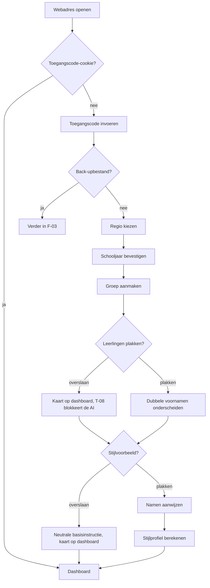
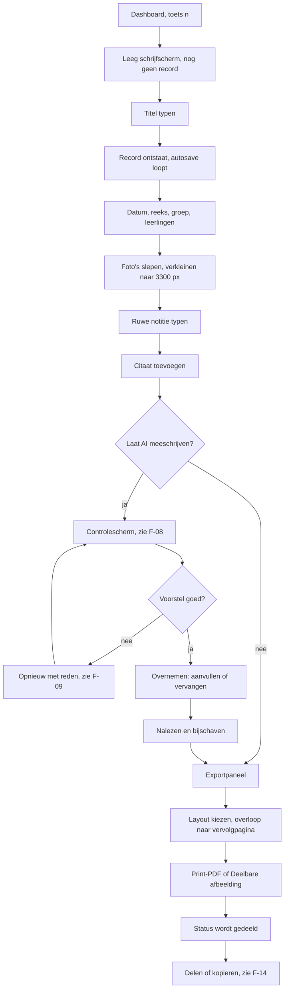
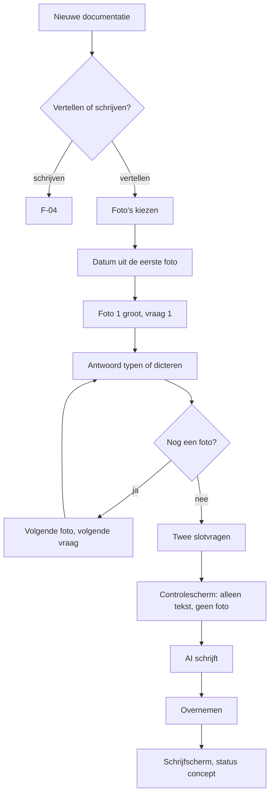
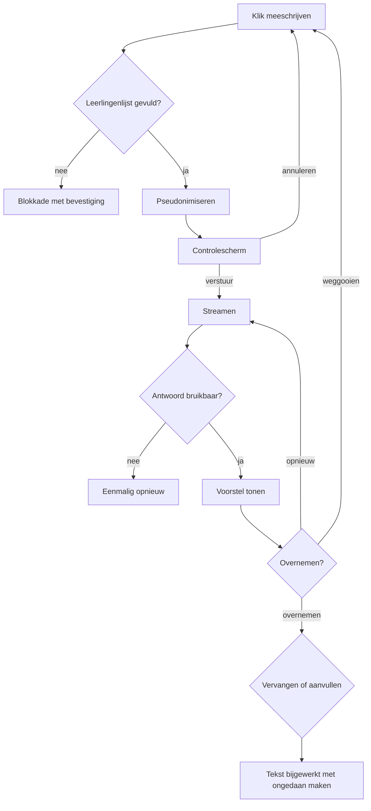

<!-- Onderdeel van de EduFlow Product Bible v1.0 (7 augustus 2026).
     Bindend. Volledig document: docs/product-bible-volledig.md
     Wijzigingen lopen via docs/19-besluitenregister.md -->

## 7. Gebruikersflows

Een flow is een aaneengesloten reeks stappen van één intentie naar één resultaat. Hij begint bij een zin die iemand in zichzelf zegt en hij eindigt bij iets wat bestaat: een documentatie met de status gedeeld, een PDF in de map Downloads, een concept in Outlook, een groep met twintig leerlingen erin. Wat een knop doet, welke velden een scherm heeft en welke regels de servicelaag hanteert, staat in hoofdstuk 6. Hier staat de volgorde, de tijd, de splitsing en de afloop.

Elke flow is beschreven volgens dezelfde vaste indeling: wie, aanleiding, startpunt, resultaat, frequentie, doeltijd, de stappen, de beslispunten, de foutpaden, de afbreekpunten, de toetsenbordroute, het telefoonverschil en het meetpunt. Die indeling is niet decoratief. Een flow zonder foutpad is niet af, en een flow zonder meetpunt is niet toetsbaar.

### De referentieopstelling

Alle doeltijden in dit hoofdstuk gelden op één vaste opstelling. Meet je op iets anders, dan meet je iets anders.

| Onderdeel | Waarde |
|---|---|
| Laptop | 1280 × 800 logische punten, Chrome 130 of Safari 18, vier kernen, 8 GB werkgeheugen |
| Telefoon | 390 × 844 logische punten, Safari op iOS 18, vanaf het beginscherm gestart |
| Netwerk | 20 Mbit/s omlaag, 40 ms omlooptijd, geen pakketverlies |
| Gegevens | Groep 4 – De Regenboog, twintig leerlingen, 250 documentaties, 900 foto's, drie reeksen |
| Opslag | 3,1 GB in gebruik van een `quota` van 12 GB |
| AI-provider | De standaardprovider met verwerking binnen de EU (T-06), gemiddelde antwoordtijd 6,5 s bij 3.000 tekens |

De doeltijd is de **mediaan van tien metingen**, gemeten van de eerste handeling tot het moment waarop het resultaat bestaat. Bij flows waarin de gebruiker nadenkt en typt, staat de doeltijd van de hele flow én de tijd die de app zelf mag opsnoepen; dat tweede getal is het enige waar de bouw invloed op heeft. Meten gebeurt met Playwright-scenario's op de referentieopstelling en met lokale `AuditEvent`-records die de gebruiker in Instellingen kan inzien. Er verlaat geen enkel meetgegeven het apparaat; EduFlow heeft geen gebruiksstatistieken die naar een server gaan (zie hoofdstuk 15).

### Toetsen die in dit hoofdstuk terugkomen

De toetsenbordroutes gebruiken één vaste set sneltoetsen. `Cmd` op macOS, `Ctrl` op Windows en Linux.

| Toets | Werkt in | Doet |
|---|---|---|
| `n` | Dashboard, documentatieoverzicht | Nieuwe documentatie |
| `/` | Overal buiten een invoerveld | Zet de aanwijzer in het zoekveld |
| `g` daarna `d`, `a`, `m`, `i` | Overal buiten een invoerveld | Ga naar Documentaties, Agenda, Mail, Instellingen |
| `Cmd + Enter` | Schrijfscherm | Laat AI meeschrijven |
| `Cmd + Z` | Schrijfscherm | Ongedaan maken, ook na Overnemen (T-07) |
| `Cmd + E` | Schrijfscherm | Opent het exportpaneel |
| `Cmd + S` | Overal | Slaat nu op en toont de bevestiging; autosave deed het al |
| `Alt + ↑` / `Alt + ↓` | Blok- en fotolijsten | Verplaatst het gekozen onderdeel één plek (B-38) |
| `Esc` | Paneel, dialoog, controlescherm | Sluit en zet de aanwijzer terug waar hij vandaan kwam |
| `Enter` op de knop met drie punten | Elke rij | Opent het rijmenu (B-33) |

Elk scherm begint met een overslaanlink naar de hoofdinhoud. Elke dialoog en elk paneel vangt de aanwijzer en geeft hem bij sluiten terug aan het onderdeel dat hem opende. Waar hieronder "tik" staat, lees op de laptop "klik".

---

## Deel A — de eerste keer

### 7.1 F-01 — Eerste start op de laptop

**Wie** Ilse, op de laptop in het lokaal, dinsdag 18 augustus 2026, 13:20, twee weken voor de eerste schooldag

**Aanleiding** "Ik heb het adres gekregen van Maarten. Even kijken of dit iets is voordat de kinderen er zijn."

**Startpunt** Een leeg tabblad met het webadres van EduFlow.

**Resultaat** Een werkend apparaat: toegangscode opgeslagen, regio en schooljaar bekend, Groep 4 – De Regenboog bestaat met twintig leerlingen, en er ligt een stijlvoorbeeld waar de AI mee begint.

**Frequentie** Eén keer per apparaat, en nooit meer.

**Doeltijd** 4 minuten in totaal, waarvan de app maximaal 12 seconden voor zichzelf gebruikt.

Dit is één samenhangende reeks (B-49), geen verzameling losse eerste-keer-vragen die op verschillende momenten opduiken. Je loopt hem van boven naar beneden, je ziet bovenaan hoeveel stappen er nog zijn, en je mag twee stappen overslaan.

| # | Wat de gebruiker doet | Wat de app doet | Wat de gebruiker ziet |
|---|---|---|---|
| 1 | Opent het webadres | Zoekt de toegangscode-cookie, vindt hem niet | Eén scherm met het woordmerk, één invoerveld, de knop Verder en daaronder de regel "Ik heb een back-upbestand" |
| 2 | Typt de toegangscode en drukt `Enter` | Controleert de code op de eigen server, zet bij goedkeuring een versleutelde `httpOnly`-cookie met een looptijd van 180 dagen (T-01, T-05) | Een groen vinkje van een halve seconde, daarna stap 1 van 5 |
| 3 | Kiest de regio Noord, Midden of Zuid | Schrijft de regio naar `localStorage`, laadt het vakantiebestand voor 2026-2027 en controleert het versienummer en de einddatum (B-50) | Drie knoppen naast elkaar met de provincies eronder, plus de zin dat kerst- en zomervakantie vastliggen en dat herfst, voorjaar en mei adviesdata zijn die je later per school aanpast (B-29) |
| 4 | Bevestigt schooljaar 2026-2027 | Maakt één `SchoolYear` met 31 augustus 2026 als eerste schooldag en 17 juli 2027 als laatste, plus zes `HolidayPeriod`-records | De eerste en laatste schooldag groot, de zes vakanties eronder in een rijtje met hun datums |
| 5 | Typt de groepsnaam "Groep 4 – De Regenboog" en kiest het type stamgroep | Maakt één `Group`, gekoppeld aan het schooljaar | Eén invoerveld, een keuzelijst met de zes groepstypen en de regel dat je later meer groepen maakt |
| 6 | Plakt twintig namen uit de klassenlijst in het grote tekstvak | Splitst op regeleinde, komma, puntkomma en tab; maakt twintig `Student`-records en twintig `GroupMembership`-records met `van` = 31 augustus 2026 (U-07, B-16) | De namen als twintig labels met een kruisje, de telling "20 leerlingen", en één gele regel: "Noa komt twee keer voor. Geef ze een onderscheidende naam, anders krijgen ze bij het versturen naar de AI allebei een eigen code" |
| 7 | Maakt er Noa B. en Noa V. van | Werkt beide `Student`-records bij en controleert opnieuw op dubbelen | De gele regel verdwijnt |
| 8 | Plakt een documentatie van vorig jaar als stijlvoorbeeld, of tikt Overslaan | Slaat de tekst op als `StyleExample` in IndexedDB en laat er `PrivacyService.pseudonymise` overheen lopen | De tekst met de gevonden namen geel gemarkeerd en vervangen door `[LEERLING-1]` en verder, plus de vraag om namen die er nog in staan aan te wijzen |
| 9 | Selecteert "Jelle" en tikt Dit is een naam | Voegt Jelle toe aan de vervanglijst, niet aan de groep; de app raadt zelf geen namen (B-11) | Jelle wordt `[LEERLING-4]`, de markering schuift mee |
| 10 | Tikt Klaar | Zet de eenmalige vragen op afgerond, berekent een eerste `StyleProfile` uit het stijlvoorbeeld (zinslengte, alinealengte, aanspreekvorm, werkwoordstijd) en opent het dashboard | Het dashboard met een leeg documentatieblok, het Vandaag-blok met de zomervakantie erin, en één kaart: "Maak je eerste documentatie" |

**Beslispunten**

Na stap 2 splitst de flow: heb je een back-upbestand van een ander apparaat, dan sla je stap 3 tot en met 9 over en ga je verder in F-03. Bij stap 3 is er een vierde knop, "Ik weet het niet"; die kiest Midden en zet één regel in Instellingen → Agenda dat de regio nog nagekeken moet worden. Bij stap 6 en stap 8 mag je Overslaan; dat zijn de enige twee stappen die dat mogen, en beide komen terug.

| Overgeslagen stap | Waar hij terugkomt | Wanneer |
|---|---|---|
| Leerlingen (stap 6) | Kaart op het dashboard, en een blokkerende dialoog bij de eerste AI-aanroep (T-08) | De kaart meteen, de dialoog bij de eerste keer Laat AI meeschrijven |
| Stijlvoorbeeld (stap 8) | Kaart op het dashboard, en één keer een uitlegregel boven het eerste AI-voorstel | De kaart meteen, de uitlegregel bij het eerste voorstel |

De blokkerende dialoog bij een lege leerlingenlijst is geen waarschuwing die je wegklikt: hij heeft twee knoppen, "Leerlingen toevoegen" en "Toch versturen, ik begrijp dat er geen namen vervangen worden". De tweede keuze wordt vastgelegd als `AuditEvent` en is zichtbaar in Instellingen → Privacy.

**Foutpaden**

| Pad | Oorzaak | Wat de app doet | Wat de gebruiker ziet | Hoe zij verder komt |
|---|---|---|---|---|
| F-01.E1 | Toegangscode fout | Telt de pogingen per IP-adres; na drie fouten 60 seconden wachten (T-17) | "Deze code klopt niet. Nog 2 pogingen." en daarna een aftelling | Code opnieuw opvragen bij de beheerder van het bestuur |
| F-01.E2 | Vakantiebestand verlopen of te oud voor 2026-2027 | Laadt het bestand niet, maakt het schooljaar met alleen de eerste en laatste schooldag | "Dit vakantiebestand loopt tot en met 2025-2026. De vakanties zet je zelf in de agenda." plus de knop Agenda openen | Vakanties zelf toevoegen, of wachten op een nieuwe versie van de app |
| F-01.E3 | Namen geplakt als één regel met spaties ertussen | Splitst niet op spaties, want voornamen mogen spaties bevatten | Eén label met de hele regel erin, en de tip "Zet elke naam op een eigen regel" met een voorbeeld van drie regels | Namen opnieuw plakken, of het label openen en handmatig splitsen |
| F-01.E4 | IndexedDB niet beschikbaar, bijvoorbeeld in een privé-venster | Stopt vóór stap 3 en schrijft niets | "EduFlow heeft opslag in de browser nodig. In een privé-venster werkt dat niet." | Een gewoon venster openen |
| F-01.E5 | Geen netwerk bij stap 2 | Stuurt niets, herhaalt niet | "Voor het invoeren van de toegangscode is internet nodig. De rest van EduFlow werkt straks ook offline." (B-47) | Verbinden en opnieuw proberen |
| F-01.E6 | Stijlvoorbeeld is langer dan 6.000 tekens | Slaat de eerste 6.000 tekens op en knipt op een alineagrens | "Dit voorbeeld is ingekort tot de eerste zes alinea's. Dat is genoeg om je stijl uit te lezen." | Niets; eventueel een korter voorbeeld plakken |

**Afbreekpunten**

Sluit je het tabblad na stap 2, dan blijft de cookie staan en hervat de flow bij stap 3. Sluit je na stap 5, dan bestaat de groep zonder leerlingen en hervat de flow bij stap 6. Sluit je na stap 7, dan is de app volledig bruikbaar en verschijnt alleen de kaart voor het stijlvoorbeeld. Er blijft nooit een half record achter: elke stap schrijft pas als hij af is.

**Toetsenbordroute**

`Tab` naar het codeveld, code typen, `Enter`. Regio met `←` en `→`, bevestigen met `Enter`. Schooljaar met `Enter`. Groepsnaam typen, `Tab` naar het type, kiezen met `↑` en `↓`, `Tab` naar Verder, `Enter`. Namen plakken met `Cmd + V`, `Tab` naar het eerste dubbele naamlabel, naam aanvullen, `Enter`. Stijlvoorbeeld plakken; namen aanwijzen doe je met `Shift + →` om te selecteren en `Cmd + K` voor Dit is een naam. Afsluiten met `Tab` naar Klaar en `Enter`. De hele flow loopt zonder muis in 27 aanslagen plus de getypte tekst.

**Telefoonverschil**

Op 390 px staat elke stap op een eigen scherm in plaats van in één doorlopende kolom, met een voortgangsbalk bovenaan en de knop Verder vastgeplakt onderaan. Tussen stap 2 en stap 3 schuift de vraag uit F-02 ertussen. Het tekstvak voor de namen is vier regels hoog en groeit mee; plakken uit een mail werkt, plakken uit een spreadsheet-app levert vaak tabs op en dat is voorzien. Het stijlvoorbeeld mag je op de telefoon overslaan met één tik, want lange tekst plakken op een telefoon is geen redelijk verzoek.

**Meetpunt**

Van de apparaten die stap 2 halen, bereikt minstens 90 procent ook stap 10 in dezelfde sessie. Het aandeel dat stap 6 overslaat is lager dan 20 procent. De tijd tussen stap 2 en stap 10 is mediaan 4 minuten en in het negende deciel korter dan 9 minuten. De app zelf gebruikt in de hele flow minder dan 12 seconden, waarvan het laden van het vakantiebestand minder dan 400 ms.

---

### 7.2 F-02 — Eerste start op de telefoon

**Wie** Fatima, op haar eigen telefoon in de BSO-ruimte, woensdag 30 september 2026, 16:55

**Aanleiding** "Ik wil dit ook op mijn telefoon, want dan kan ik het meteen na het buitenspelen doen."

**Startpunt** Safari met het webadres van EduFlow, net getypt.

**Resultaat** EduFlow staat op het beginscherm en start vanaf daar, waardoor Safari de opslag niet na zeven dagen weggooit. De toegangscode is opgeslagen.

**Frequentie** Eén keer per telefoon.

**Doeltijd** 90 seconden, waarvan de app maximaal 3 seconden.

De reden om dit te vragen is technisch en de app zegt hem hardop: Safari wist de opslag van een website die zeven dagen niet gebruikt is, en een webapp die vanaf het beginscherm start is daarvan uitgezonderd (B-02). Twee weken herfstvakantie zijn genoeg om drie weken documentaties kwijt te raken. Dat is geen randgeval, dat is oktober.

| # | Wat de gebruiker doet | Wat de app doet | Wat de gebruiker ziet |
|---|---|---|---|
| 1 | Opent het webadres in Safari | Stelt vast dat de weergavestand niet `standalone` is en dat het om iOS gaat | Het scherm met de toegangscode |
| 2 | Typt de toegangscode | Zet de cookie zoals in F-01 | Een vinkje |
| 3 | Leest de kaart "Zet EduFlow op je beginscherm" | Toont drie stappen met een afbeelding van de deelknop, en daaronder in twee zinnen waarom | Een kaart met de tekst: "Safari gooit de opslag van een website weg als je er zeven dagen niet komt. Staat EduFlow op je beginscherm, dan gebeurt dat niet." Onderaan twee knoppen: Ik doe het nu en Later |
| 4 | Tikt op de deelknop van Safari en kiest Zet op beginscherm | Kan dit niet zien en doet niets | Het standaardvenster van iOS met de naam EduFlow al ingevuld |
| 5 | Opent EduFlow vanaf het beginscherm | Meet `(display-mode: standalone)` en zet de vraag op afgerond | Eén regel bovenin: "Goed. EduFlow staat nu op je beginscherm en je werk blijft bewaard." Die regel verdwijnt na vijf seconden |
| 6 | Loopt de rest van F-01 door, of tikt Ik heb een back-upbestand | Zie F-01 stap 3 en verder, of F-03 | De stappen uit F-01, één per scherm |
| 7 | Werkt een maand door | Telt de dagen sinds de laatste back-up in `localStorage` | Na 30 dagen zonder back-up één kaart op het dashboard: "Je laatste back-up is van 30 september. Maak er nu een." met de knop Back-up maken (F-23) |

**Beslispunten**

Bij stap 3 kies je Later. Dat mag; de kaart is geen slot. De vraag komt dan terug aan het begin van de eerstvolgende sessie, en daarna hoogstens één keer per zeven dagen. Zolang de app niet vanaf het beginscherm draait, staat er in Instellingen → Opslag een blijvende regel met de datum waarop de opslag volgens Safari's regel zou kunnen vervallen, en toont het dashboard de knop Back-up maken op een prominentere plek. Op Android ziet stap 3 er anders uit: daar heet het "App installeren" in het browsermenu, en daar is de zevendagenregel niet aan de orde. De uitleg past zich aan het besturingssysteem aan; de vraag zelf blijft.

**Foutpaden**

| Pad | Oorzaak | Wat de app doet | Wat de gebruiker ziet | Hoe zij verder komt |
|---|---|---|---|---|
| F-02.E1 | De gebruiker tikt Ik doe het nu maar zet hem niet op het beginscherm | Meet bij de volgende start dat de weergavestand nog steeds een tabblad is | Bij de volgende start dezelfde kaart, met de zin "Het is nog niet gelukt" erboven | De drie stappen opnieuw volgen, met een uitgeklapte afbeelding erbij |
| F-02.E2 | De telefoon staat in een browser die geen beginscherm-snelkoppeling kan maken | Herkent de browser, slaat de kaart over | Eén kaart: "Deze browser kan EduFlow niet op je beginscherm zetten. Gebruik Safari, of maak elke week een back-up." | Safari openen, of de back-upherinnering op wekelijks zetten |
| F-02.E3 | De opslag is al gewist voordat de app op het beginscherm stond | Vindt bij het starten een lege database maar wel een geldige cookie | "Er staat niets meer in EduFlow op dit apparaat. Heb je een back-upbestand?" met de knop Terugzetten | F-03 lopen met het laatste back-upbestand |
| F-02.E4 | Er is nooit een back-up gemaakt en de opslag is gewist | Zoals E3, maar zonder bestand om terug te zetten | Dezelfde melding, plus de zin "Zonder back-upbestand is dit werk weg. Zet EduFlow nu op je beginscherm zodat het niet nog eens gebeurt." | Opnieuw beginnen met F-01, en de kaart uit stap 3 nu wel volgen |

**Afbreekpunten**

Stop je na stap 2, dan is het apparaat bruikbaar maar kwetsbaar; de app zegt dat en blijft het zeggen. Stop je na stap 4 zonder de app vanaf het beginscherm te openen, dan blijft de vraag openstaan tot de app zelf meet dat het gelukt is. De app vertrouwt daarvoor niet op jouw bevestiging maar op de weergavestand.

**Toetsenbordroute**

Deze flow heeft geen zinnige toetsenbordroute, want stap 4 gebeurt in het besturingssysteem en niet in de app. Met een gekoppeld toetsenbord loopt alles behalve stap 4 via `Tab` en `Enter`; stap 4 is bij die opstelling per definitie een aanraak- of muishandeling. Voor wie de telefoon met VoiceOver bedient, staan de drie stappen als genummerde lijst in de leesvolgorde en is de afbeelding van de deelknop voorzien van een alternatieve tekst die de plek beschrijft, niet het plaatje.

**Telefoonverschil**

Deze flow bestaat alleen op de telefoon. Op de laptop komt hij niet voor en wordt er niets gevraagd.

**Meetpunt**

Minstens 85 procent van de telefoons die stap 2 haalt, draait binnen zeven dagen in de stand `standalone`. Het aantal keren dat foutpad F-02.E4 voorkomt is nul; elk voorkomen is een incident dat in het logboek onderzocht wordt. De tijd tussen stap 3 en stap 5 is mediaan korter dan 45 seconden.

---

### 7.3 F-03 — Tweede apparaat in gebruik nemen met een back-upbestand

**Wie** Ilse, thuis op de eigen laptop, zondagavond 4 oktober 2026, 20:15

**Aanleiding** "Ik wil de foto's van vrijdag thuis afmaken, maar die staan op de schoollaptop."

**Startpunt** De thuislaptop met een leeg EduFlow, en een back-upbestand op een geheugenstick.

**Resultaat** De thuislaptop kent dezelfde leerlingen, groepen, reeksen, instellingen en documentaties als de schoollaptop op het moment van de back-up.

**Frequentie** Bij ingebruikname van een apparaat, en daarna zo vaak als je heen en weer wilt. In de praktijk: twee tot vier keer per jaar.

**Doeltijd** 6 minuten voor een volledig bestand van 1,4 GB, waarvan 4 minuten wachten op de app. Voor een bestand zonder foto's: 40 seconden.

Een documentatie leeft op één apparaat (B-01). Er is geen synchronisatie en er komt er in versie 1.0 geen. Wat er wel is, is één bestand met alles erin, dat je op een ander apparaat terugzet. Dat bestand is tegelijk je back-up (F-23), je verhuisdoos en je uitweg.

| # | Wat de gebruiker doet | Wat de app doet | Wat de gebruiker ziet |
|---|---|---|---|
| 1 | Op de schoollaptop: Instellingen → Back-up maken | Vraagt naar de omvang | Twee knoppen: Alles, inclusief foto's, ongeveer 1,4 GB en Zonder foto's, ongeveer 6 MB, met onder allebei één zin over waar je hem voor gebruikt |
| 2 | Kiest Alles | Schrijft een `.efb`-bestand: een archief met `manifest.json`, `records.ndjson` en een map met de fotobestanden, elk met een controlegetal | Een voortgangsbalk per tabel, met de teller "612 van 1.480 records" |
| 3 | Zet het bestand op de geheugenstick | Doet niets; het bestand is van jou | De download in de browser |
| 4 | Op de thuislaptop: opent het webadres, typt de toegangscode | Zet de cookie | Het scherm uit F-01 stap 1 |
| 5 | Tikt Ik heb een back-upbestand | Slaat de rest van de eerste-keer-ervaring over | Een scherm met één knop: Kies bestand |
| 6 | Kiest `eduflow-backup-2026-10-02.efb` | Leest het `manifest.json`, controleert `schemaVersion` en de controlegetallen, en valideert een steekproef van tien records met Zod voordat er iets wordt weggeschreven | Een overzicht: "Van 2 oktober 2026, 14:12. 250 documentaties, 900 foto's, 20 leerlingen, 2 groepen, 3 reeksen, 41 agenda-items, 1 stijlvoorbeeld, 1,4 GB" |
| 7 | Kiest Terugzetten | Leegt de database en schrijft alle records in de volgorde van het manifest, foto's als laatste | Een voortgangsbalk met de tabelnaam erbij, en de tekst "Sluit dit tabblad niet" |
| 8 | Wacht | Verwerkt ongeveer 6 MB per seconde aan foto's en 1.200 records per seconde aan tekst | De teller loopt door, met een geschatte resterende tijd na de eerste tien seconden |
| 9 | Tikt Klaar | Bouwt de zoekindex in het geheugen op (T-16) en opent het dashboard | Het dashboard met de vijf laatste documentaties, precies zoals op de schoollaptop |

**Beslispunten**

Bij stap 1 kies je de omvang. Zonder foto's is de juiste keuze als je alleen leerlingen, groepen, reeksen, agenda en instellingen wilt overzetten; dat is wat je doet bij een nieuw apparaat waar je vanaf nul wilt documenteren. Bij stap 6 splitst de flow in twee standen:

| Stand | Wat er gebeurt | Wanneer je hem kiest |
|---|---|---|
| Terugzetten | De database wordt geleegd en volledig gevuld met wat er in het bestand zit | Op een leeg apparaat, of als je zeker weet dat het bestand nieuwer is dan wat er staat |
| Toevoegen | Alleen records waarvan het `id` nog niet bestaat worden toegevoegd; botsende `id`'s worden overgeslagen en geteld | Als je op dit apparaat werk hebt staan dat je wilt houden |

Terugzetten op een apparaat waar al gegevens staan, vraagt om een bevestiging waarin je het aantal documentaties overtypt dat je weggooit. Toevoegen voegt nooit samen binnen één record: bij een botsing wint altijd wat er al staat, en de overgeslagen records staan met titel en datum in een rapport dat je kunt bewaren. Dat is bewust bot; regels die per veld samenvoegen zijn niet uit te leggen en niet te controleren.

**Foutpaden**

| Pad | Oorzaak | Wat de app doet | Wat de gebruiker ziet | Hoe zij verder komt |
|---|---|---|---|---|
| F-03.E1 | Het bestand is van een nieuwere `schemaVersion` | Stopt vóór de eerste schrijfhandeling | "Dit bestand komt van een nieuwere versie van EduFlow. Werk deze laptop eerst bij." | De app op het andere apparaat en dit apparaat op dezelfde versie brengen |
| F-03.E2 | Het bestand is van een oudere `schemaVersion` | Draait de migraties in volgorde op de records in het geheugen, en pas daarna wegschrijven | "Dit bestand komt van versie 1.0.3. EduFlow werkt het bij tijdens het terugzetten." | Niets |
| F-03.E3 | Een controlegetal van een foto klopt niet | Zet alle andere records terug en slaat deze foto over | "Terugzetten gelukt. 1 van de 900 foto's was beschadigd en is overgeslagen: Kunstwerk Dok, 12 september, foto 3." | De documentatie openen en de foto opnieuw toevoegen vanaf het andere apparaat |
| F-03.E4 | De opslag op het nieuwe apparaat is te klein | Meet vóór stap 7 het benodigde aantal bytes tegen `navigator.storage.estimate()` | "Dit bestand is 1,4 GB en er is 0,9 GB vrij. Kies Zonder foto's, of maak ruimte." | Een back-up zonder foto's maken, of opruimen volgens F-24 |
| F-03.E5 | Het tabblad wordt gesloten tijdens stap 8 | Merkt bij de volgende start dat de vlag `restoreInProgress` aanstaat | "Het terugzetten is halverwege afgebroken. EduFlow zet de database leeg en begint opnieuw." met de knop Bestand opnieuw kiezen | Het bestand opnieuw kiezen |
| F-03.E6 | Het bestand is geen `.efb` of het archief is stuk | Leest het manifest niet | "Dit bestand kan EduFlow niet lezen. Kies een bestand dat eindigt op `.efb`." | Het juiste bestand zoeken |

**Afbreekpunten**

Tussen stap 2 en stap 4 kan er weken zitten; het bestand veroudert dan, en dat is zichtbaar in de datum op het overzicht in stap 6. Breekt het terugzetten af, dan is de database gegarandeerd leeg en niet half gevuld: dat is de reden dat stap 7 begint met legen en niet met samenvoegen. Een half teruggezette database is erger dan een lege.

**Toetsenbordroute**

`g` `i` naar Instellingen, `Tab` naar Back-up maken, `Enter`, omvang kiezen met `←` en `→`, `Enter`. Op het tweede apparaat: code typen, `Enter`, `Tab` naar Ik heb een back-upbestand, `Enter`, `Enter` op Kies bestand opent het systeemvenster, bestand kiezen met de pijltjes, `Enter`, `Tab` naar Terugzetten, `Enter`, bevestiging overtypen, `Enter`.

**Telefoonverschil**

Op de telefoon werkt terugzetten hetzelfde, maar een bestand van 1,4 GB kiezen uit Bestanden op iOS is traag en het geheugengebruik ligt hoger. Daarom leest de app op de telefoon het archief in blokken van 20 MB in plaats van in één keer, en waarschuwt hij bij bestanden boven 800 MB dat de telefoon aan de lader moet. De omvang Zonder foto's is op de telefoon de voorgeselecteerde keuze bij het maken van een back-up.

**Meetpunt**

Terugzetten van een bestand van 1,4 GB duurt op de referentieopstelling korter dan 5 minuten en gebruikt nooit meer dan 400 MB werkgeheugen. Na stap 9 is het aantal records in de database exact gelijk aan het aantal in het manifest, minus de overgeslagen records uit het rapport. Dat wordt bij elke uitgave getest met een vast back-upbestand in de testset (zie hoofdstuk 17).

---

## Deel B — documenteren

### 7.4 F-04 — Documentatie schrijven in schrijfmodus, van leeg tot gedeeld

**Wie** Ilse, op de laptop in het lokaal, donderdag 24 september 2026, 15:40, de kinderen zijn net weg

**Aanleiding** "Vanmiddag gebeurde er iets goeds bij het dok. Dat wil ik vastleggen voordat ik het kwijt ben, en de ouders mogen het zien."

**Startpunt** Het dashboard, net geopend.

**Resultaat** Eén `Documentation` met een titel, een datum, een reeks, een groep, drie gekoppelde leerlingen, zes foto's, een lopende tekst, één citaat, twee pagina's en de status gedeeld. Er ligt een PDF in Downloads en een afbeelding op het klembord.

**Frequentie** Eén tot drie keer per week per gebruiker, met een piek op donderdag en vrijdag. Dit is de flow die het vaakst gelopen wordt en die het zwaarst weegt.

**Doeltijd** 8 minuten van dashboard tot status gedeeld, waarvan de app maximaal 25 seconden voor zichzelf gebruikt. Het AI-voorstel telt daar voor 7 seconden in mee.

Dit is de flow waar het product op staat of valt. Alles wat er in de app zit, dient deze acht minuten. Als deze flow twaalf minuten kost, kiest Ilse in november weer voor een appbericht met vier foto's zonder tekst.

| # | Wat de gebruiker doet | Wat de app doet | Wat de gebruiker ziet |
|---|---|---|---|
| 1 | Drukt `n` of tikt Nieuwe documentatie | Opent het schrijfscherm zonder een record aan te maken (B-34) | Een leeg schrijfscherm: titelveld met de aanwijzer erin, daaronder een leeg tekstblok, rechts de kolom met datum, reeks, groep en leerlingen, onderaan de balk met Opslaan, Print-PDF en Deelbare afbeelding |
| 2 | Typt de titel "Bouwen aan het dok" | Wacht één seconde stilte en maakt dan de `Documentation` aan met een `id` volgens UUIDv7, `createdAt`, `rev` 1 en de status concept (T-11, T-09) | Rechtsboven verschijnt "Opgeslagen 15:41". De documentatie staat vanaf nu in de lijst |
| 3 | Zet de datum op 24 september | Werkt het datumveld bij; de datum is de gebeurtenisdatum, niet het moment van schrijven | Een datumkiezer die standaard op vandaag staat |
| 4 | Kiest de reeks Kunstwerk Dok | Legt een verwijzing naar de `Series` vast; de reeksnaam komt niet in de opgeslagen titel (B-35) | Een keuzelijst met de drie bestaande reeksen, een zoekveld en de knop Nieuwe reeks. Onder de keuze verschijnt: "Documentatie 4 van deze reeks" |
| 5 | Kiest de groep Groep 4 – De Regenboog | Legt de expliciete koppeling vast in `documentation_groups` (B-17) | De groepsnaam als label, met een kruisje om hem los te maken |
| 6 | Kiest de leerlingen Aya, Kjeld en Noa B. | Legt drie rijen in `documentation_students` vast | Een lijst met de twintig leerlingen van de groep, met een zoekveld erboven; gekozen namen komen bovenaan te staan |
| 7 | Sleept zes foto's uit een map het scherm op | Verkleint elke foto naar 3300 px op de lange zijde, maakt de varianten thumb 480, screen 1280 en print 3300, en maakt zes `PhotoBlock`-blokken in de volgorde van het slepen (T-02) | Zes miniaturen die één voor één scherp worden, met een teller "3 van 6" en per foto een voortgangsring |
| 8 | Typt haar ruwe notitie in het tekstblok | Slaat op na één seconde stilte en bij elk verlies van de aanwijzer | Ongeveer 120 woorden losse zinnen: "kjeld idee met de kraan / aya bang dat het omvalt / uiteindelijk met z'n drieën steunbalk gemaakt / noa b heeft de container erin gehesen" |
| 9 | Tikt Citaat toevoegen en typt wat Kjeld zei | Maakt een `QuoteBlock` met een verwijzing naar Kjeld; het citaat gaat straks door `PrivacyService` net als alle andere tekst (B-37) | Een blok met een aanhalingsteken, een tekstveld en een keuzelijst met de drie gekoppelde leerlingen |
| 10 | Drukt `Cmd + Enter` of tikt Laat AI meeschrijven | Start de keten uit F-08: pseudonimiseren, opdracht opbouwen, controlescherm | Het controlescherm schuift over het scherm (zie F-08) |
| 11 | Leest het controlescherm en tikt Versturen | Roept `AIService.run()` aan via de eigen server en zet de codes daarna terug om in namen | Een wachtindicator met de verstreken tijd in hele seconden, en de knop Annuleren |
| 12 | Leest het voorstel | Toont het voorstel onder haar eigen tekst, niet in een apart paneel | Ongeveer 160 woorden lopende tekst met haar eigen woorden erin, en drie knoppen: Overnemen, Opnieuw, Weggooien |
| 13 | Tikt Overnemen en kiest Vervangen | Vraagt eerst aanvullen of vervangen (B-39), legt de oude tekst vast als `ChangeLogEntry` en zet dan de nieuwe tekst in het tekstblok | Een dialoog met twee knoppen en één zin uitleg per knop; daarna de nieuwe tekst met een gele rand die na drie seconden vervaagt, en de regel "Ongedaan maken" rechtsboven |
| 14 | Leest de tekst door en past twee woorden aan | Slaat op na één seconde stilte en telt de wijzigingen mee voor de correctieregels (zie §6.5.4) | De tekst met de aanwijzer erin, "Opgeslagen 15:47" rechtsboven |
| 15 | Drukt `Cmd + E` of tikt Print-PDF | Opent het exportpaneel dat over het schrijfscherm schuift (B-06) | Vier miniaturen met de layouts A tot en met D, een voorbeeld van de eerste pagina en de regel "2 pagina's" |
| 16 | Kiest layout A-fotoraster | Laat `LayoutService` de blokken over de sloten verdelen; zes foto's en de tekst passen niet op één A4 liggend, dus maakt `PageService` een tweede `Page` met layout E-vervolg (B-07, B-15) | Het voorbeeld wisselt, en onder het voorbeeld staan twee paginaminiaturen met de titel op allebei |
| 17 | Bladert door de twee pagina's | Rendert het voorbeeld op schermresolutie uit dezelfde layoutdefinitie als de PDF (B-26) | Pagina 1 met het fotoraster en de eerste alinea's, pagina 2 met de rest van de tekst, het citaat en de herhaalde titel |
| 18 | Tikt Print-PDF maken | Genereert de PDF met `pdf-lib` op een canvas van 297 × 210 mm met 10 mm marge (T-03, T-13) | Een voortgangsbalk per pagina en daarna de download |
| 19 | Ziet de status wisselen | Zet de status op gedeeld, want de eerste geslaagde export is de overgang (B-13) | Bovenin het schrijfscherm wisselt het grijze label concept naar het groene label gedeeld |
| 20 | Tikt Deelbare afbeelding | Toont eenmalig per documentatie de bevestiging beeldgebruik (B-08) | Een dialoog: "Van deze foto's maak je iets dat de school verlaat. Heb je van deze kinderen toestemming voor beeldgebruik?" met een vinkje voor namen vervangen door initialen |
| 21 | Zet het vinkje aan en bevestigt | Vervangt de namen door initialen, geeft botsende initialen een oplopende letter (B-40) en rastert de gegenereerde PDF met `pdf.js` (B-27, T-14) | Twee afbeeldingen, één per pagina, met onderaan een legenda: "K. = Kjeld, A. = Aya, N. = Noa B." |
| 22 | Tikt Kopieer afbeelding | Zet de eerste pagina als PNG op het klembord (B-09) | "Gekopieerd" gedurende twee seconden |

**Beslispunten**

De flow splitst zich op zes plekken, en op vijf daarvan is doorlopen zonder keuze de snelste route.

| Waar | Splitsing | Waarom |
|---|---|---|
| Stap 1 | Schrijfmodus of gespreksmodus | Op de laptop is schrijfmodus de standaard; de keuze staat als tweede knop in het scherm, niet als vraag vooraf (B-14) |
| Stap 4 | Wel of geen reeks | Zonder reeks is er geen vervolgzin uit eerdere delen (B-04) en dat scheelt merkbaar aan de kwaliteit van het voorstel |
| Stap 6 | Leerlingen expliciet koppelen of overslaan | De expliciete koppeling gaat boven de afgeleide; koppel je niets, dan toont de app de leerlingen uit de groep als suggestie maar legt niets vast (B-17) |
| Stap 10 | Wel of niet AI laten meeschrijven | Zelf schrijven mag; het exportpad is identiek. De zinslengte-eis geldt alleen voor wat de AI oplevert (B-41) |
| Stap 13 | Aanvullen of vervangen | Aanvullen zet het voorstel onder je eigen tekst en laat beide staan; vervangen ruilt ze om. Beide zijn ongedaan te maken (B-39, T-07) |
| Stap 16 | Layout A, B, C of D | De app kiest niet zelf (B-11). Kies je D bij een documentatie met tekst, dan krijgt die tekst een vervolgpagina in plaats van te verdwijnen (B-28) |

**Foutpaden**

| Pad | Oorzaak | Wat de app doet | Wat de gebruiker ziet | Hoe zij verder komt |
|---|---|---|---|---|
| F-04.E1 | Geen netwerk bij stap 10 | Bouwt de opdracht wel op, verstuurt niets, laat de tekst ongemoeid | Een grijze balk boven het tekstblok: "Je bent offline. Schrijven, foto's toevoegen en exporteren werken gewoon; meeschrijven niet." De knop heet nu Opnieuw proberen (B-47) | Later opnieuw drukken; alles wat ze getypt heeft staat er nog |
| F-04.E2 | De leerlingenlijst is leeg | Blokkeert de aanroep vóór het opbouwen van de opdracht (T-08) | Een dialoog met twee knoppen: Leerlingen toevoegen en Toch versturen, met de gevolgen erbij | Leerlingen toevoegen, of één keer bewust bevestigen; die bevestiging komt in het logboek |
| F-04.E3 | Een foto is een formaat dat de browser niet kan lezen | Slaat die ene foto over en gaat door met de rest | Bij de betreffende miniatuur een rood kruis en de regel "Dit bestand kan de browser niet openen. Sla het op als JPEG of PNG." | De foto omzetten en opnieuw slepen; de andere vijf staan er al |
| F-04.E4 | `QuotaExceededError` tijdens autosave | Houdt de tekst in het scherm, schrijft niets weg, zet de vlag opslag-vol | Een rode balk die blijft staan: "De opslag is vol. Je tekst staat nog op het scherm maar is niet opgeslagen. Ruim eerst op." met de knop Opslag opruimen | F-24 lopen in een tweede tabblad, daarna terugkomen en `Cmd + S` drukken |
| F-04.E5 | Het dagbudget van de snelheidslimiet is op (T-17) | Weigert de aanroep op de server, niet in de browser | "Je hebt vandaag het maximum aan AI-verzoeken bereikt. Morgen om 00:00 kun je weer verder." | Zelf schrijven en morgen het voorstel vragen; de tekst blijft staan |
| F-04.E6 | De provider antwoordt niet binnen 30 seconden | Probeert één keer opnieuw, wacht opnieuw 30 seconden en stopt dan | Na de eerste poging: "Het duurt langer dan normaal. EduFlow probeert het nog één keer." Daarna: "Geen antwoord van de AI-dienst." met de knop Opnieuw | Opnieuw drukken, of doorwerken zonder voorstel |
| F-04.E7 | Het tabblad wordt gesloten tijdens stap 8 | Heeft bij het verlies van de aanwijzer al opgeslagen; hoogstens één seconde typen gaat verloren | Bij het opnieuw openen staat de documentatie in de lijst met de tekst tot de laatste opslag | Verder typen |
| F-04.E8 | De PDF-generatie loopt vast op een foto die niet decodeert | Stopt de export, gooit niets weg | "De PDF is niet gelukt. Foto 4 kon niet worden verwerkt." met de knop Foto vervangen | De foto verwijderen of vervangen en opnieuw exporteren; de status blijft concept |
| F-04.E9 | Twee tabbladen met dezelfde documentatie open | Merkt via een `BroadcastChannel` dat het andere tabblad schrijft | In het oudste tabblad: "Deze documentatie is in een ander tabblad geopend. Hier kun je alleen lezen." | Het andere tabblad gebruiken, of hier vernieuwen |

**Afbreekpunten**

| Waar zij stopt | Wat er achterblijft | Wat zij bij terugkomst ziet |
|---|---|---|
| Vóór stap 2 | Niets. Er is geen record en er staat niets in de lijst (B-34) | Niets |
| Na stap 2 | Een documentatie met alleen een titel, status concept | De regel in de lijst met de titel en de datum |
| Na stap 7 | Een documentatie met foto's zonder tekst; die foto's tellen mee in de opslag | De regel in de lijst met een fotomarkering en de telling "6 foto's" |
| Na stap 11, vóór stap 13 | Alleen een `AIInteraction` met uitkomst "afgebroken". Het voorstel zelf wordt niet bewaard | Haar eigen tekst, ongewijzigd, zonder voorstel |
| Na stap 13, vóór stap 18 | De overgenomen tekst en de `ChangeLogEntry` met de vorige versie | De documentatie met status concept, en 30 dagen lang de mogelijkheid de vorige tekst terug te halen |
| Na stap 18 | Alles, en de status staat op gedeeld | De documentatie in de lijst met het groene label |

Een documentatie die je halverwege verlaat is nooit stuk. Er is geen tussentoestand waarin blokken naar pagina's verwijzen die niet bestaan, want `PageService` maakt pagina's pas bij het openen van het exportpaneel en berekent ze opnieuw bij elke wijziging.

**Toetsenbordroute**

Vanaf het dashboard: `n`. De aanwijzer staat in het titelveld. Titel typen, `Tab` naar de datum, datum met de pijltjes of typen, `Tab` naar de reeks, eerste letters typen en `Enter`, `Tab` naar de groep, `Enter`, `Tab` naar leerlingen, per leerling de eerste letters typen en `Enter`, `Tab` naar het tekstblok, notitie typen. Citaat toevoegen met `Cmd + Shift + C`; die opent een blok en zet de aanwijzer erin. Foto's toevoegen met `Tab` naar Foto toevoegen en `Enter`, wat het systeemvenster opent; meerdere bestanden kiezen met `Shift` en de pijltjes. Volgorde wijzigen met `Alt + ↑` en `Alt + ↓`. Meeschrijven met `Cmd + Enter`. In het controlescherm loopt de aanwijzer langs de vijf onderdelen; `Esc` sluit, `Enter` op Versturen verstuurt. Het voorstel krijgt de aanwijzer zodra het binnen is, met een melding via de leesregel. Overnemen met `Enter`, daarna `←` en `→` tussen Aanvullen en Vervangen, `Enter`. Ongedaan maken met `Cmd + Z`. Exportpaneel met `Cmd + E`, layout kiezen met `←` en `→`, pagina's doorbladeren met `PageUp` en `PageDown`, exporteren met `Enter` op de knop. `Esc` sluit het paneel en zet de aanwijzer terug op Print-PDF.

**Telefoonverschil**

Op 390 px staat de rechterkolom niet naast maar onder de titel, ingeklapt tot één regel: "24 september · Kunstwerk Dok · Groep 4 · 3 leerlingen". Tikken klapt hem uit. De onderbalk met Opslaan, Print-PDF en Deelbare afbeelding wordt een vastgeplakte balk met drie tikdoelen van elk minstens 44 px hoog. Foto's toevoegen gaat via de camera of de fotorollen, niet via slepen; het verkleinen naar 3300 px duurt op de telefoon ongeveer 1,4 seconde per foto in plaats van 0,6, en gebeurt in een `Worker` zodat het typen niet hapert. Het exportpaneel is een vol scherm met een sluitkruis linksboven. Het controlescherm is even compleet als op de laptop; er wordt niets weggelaten omdat het scherm smal is. De standaard op de telefoon is gespreksmodus (F-05), maar schrijfmodus is met één tik bereikbaar en volledig.

**Meetpunt**

De mediane tijd van stap 1 tot stap 19 is 8 minuten en het negende deciel ligt onder 15 minuten. Van de documentaties die stap 2 halen, bereikt minstens 80 procent binnen 24 uur de status gedeeld. Het aandeel AI-voorstellen dat wordt overgenomen is minstens 70 procent, en het gemiddelde aantal keren Opnieuw per documentatie ligt onder 1,0. De app gebruikt van de acht minuten minder dan 25 seconden: zes foto's verkleinen onder 4 seconden, het controlescherm openen onder 300 ms, de PDF van twee pagina's genereren onder 3 seconden, de afbeelding rasteren onder 2 seconden. Het aantal documentaties met status concept dat ouder is dan 14 dagen, is een signaal dat deze flow ergens vastloopt; boven 15 procent van het totaal is dat reden om de foutpaden na te lopen.

---

### 7.5 F-05 — Documentatie maken in gespreksmodus op de telefoon

**Wie** Fatima, op de telefoon in de BSO-ruimte, dinsdag 22 september 2026, 17:10, kinderen zitten aan tafel

**Aanleiding** "Ik heb net zeven foto's gemaakt van de hut. Als ik het nu niet opschrijf, weet ik vanavond niet meer wie wat deed."

**Startpunt** EduFlow vanaf het beginscherm, dashboard.

**Resultaat** Een documentatie met zes foto's, zes beantwoorde vragen omgezet in lopende tekst, en de status concept.

**Frequentie** Twee tot vijf keer per week voor wie voornamelijk op de telefoon werkt.

**Doeltijd** 4 minuten voor zes foto's, waarvan de app maximaal 20 seconden.

De foto's stellen de vragen (B-03). Dat is geen metafoor: de app toont je foto groot en zet er één vraag bij. De foto blijft op het apparaat en gaat nooit naar de AI. Alleen jouw antwoord gaat weg, samen met je stijlprofiel en de reekscontext. De app kijkt niet naar de foto en beschrijft hem niet; de vragen zijn een vaste reeks die meebeweegt met het aantal foto's.

| # | Wat de gebruiker doet | Wat de app doet | Wat de gebruiker ziet |
|---|---|---|---|
| 1 | Tikt Nieuwe documentatie | Toont de keuze tussen twee modi | Twee grote knoppen: Vertellen en Schrijven, met onder elk één zin. Op de telefoon staat Vertellen vooraan |
| 2 | Tikt Vertellen | Opent de fotokiezer van het besturingssysteem | De fotorollen met de nieuwste foto's bovenaan |
| 3 | Kiest zes foto's | Leest de opnamedatum uit elke foto, verkleint naar 3300 px, maakt zes `PhotoBlock`-blokken en zet de gebeurtenisdatum op de datum van de eerste foto | Zes miniaturen op een rij met een teller, en de regel "Datum: 22 september, uit je foto's" met een potloodje |
| 4 | Tikt Beginnen | Zet foto 1 groot in beeld met de eerste vraag eronder | De foto over driekwart van het scherm, daaronder "Wat gebeurde hier?" en een tekstveld van drie regels met de microfoonknop van het toetsenbord beschikbaar |
| 5 | Dicteert twee regels | Slaat het antwoord op als los `TextBlock` gekoppeld aan die foto, zodra het veld de aanwijzer verliest | Haar eigen woorden in het veld, en onderin "1 van 6" met de knop Volgende |
| 6 | Tikt Volgende | Toont foto 2 met de tweede vraag | "Wat deden de kinderen daarna?" |
| 7 | Herhaalt dit voor foto 3 tot en met 6, slaat foto 5 over | Bewaart per foto het antwoord; een overgeslagen foto blijft in de documentatie staan maar krijgt geen tekst | Bij elke foto een andere vraag uit de vaste reeks, en onderaan Overslaan naast Volgende |
| 8 | Beantwoordt de twee slotvragen | Bewaart ze als losse antwoorden met een eigen rol in de opdracht | "Wat wil je dat ouders hieruit meenemen?" en "Heeft een kind iets gezegd dat je wilt vastleggen?" |
| 9 | Tikt Maak er een documentatie van | Voegt de antwoorden samen tot één tekst, laat `PrivacyService` erover lopen en bouwt de opdracht op | Het controlescherm, gevuld met de zes antwoorden en zonder één verwijzing naar een foto (zie F-08) |
| 10 | Tikt Versturen | Roept de AI aan | Een wachtindicator met de verstreken seconden |
| 11 | Leest het voorstel en tikt Overnemen | Vraagt aanvullen of vervangen; bij gespreksmodus staat Vervangen vooraan, want de antwoorden zijn ruwe invoer | Het voorstel onder de antwoorden, met de drie knoppen |
| 12 | Belandt in het schrijfscherm | Vervangt de losse antwoorden door één `TextBlock` met de lopende tekst; de zes `PhotoBlock`-blokken houden hun volgorde | Het gewone schrijfscherm met titelveld, tekst en foto's, status concept |

**Beslispunten**

Bij stap 1 kies je de modus. Die keuze geldt alleen voor deze documentatie en wordt onthouden als voorkeur per apparaat. Bij stap 3 mag je nul foto's kiezen; dan wordt het een gesprek van drie algemene vragen zonder beeld. Bij elke vraag mag je Overslaan; een overgeslagen foto verdwijnt niet uit de documentatie, hij levert alleen geen tekst. Bij stap 7 staat naast Volgende ook de knop Klaar, zodat je na vier van de zes foto's al kunt afronden; de resterende foto's blijven staan. Halverwege wisselen naar schrijfmodus is een aparte flow (F-07). De vaste vragenreeks staat als gegeven in `PromptService` en niet in code; hij is per taalinstelling anders, zodat "Leerling" en "Kind" ook in de vragen kloppen.

**Foutpaden**

| Pad | Oorzaak | Wat de app doet | Wat de gebruiker ziet | Hoe zij verder komt |
|---|---|---|---|---|
| F-05.E1 | De AI is onbereikbaar bij stap 10 | Laat alle antwoorden staan als losse tekstblokken en maakt er een gewone documentatie van | "Geen verbinding met de AI-dienst. Je antwoorden staan er allemaal; je kunt ze zelf tot tekst maken of het later opnieuw proberen." | Later opnieuw drukken vanuit het schrijfscherm, of zelf herschrijven. Er gaat niets verloren |
| F-05.E2 | De app gaat naar de achtergrond tijdens vraag 4 | Slaat het antwoord op bij het verlies van de aanwijzer en bij `visibilitychange` | Bij terugkomst staat het gesprek op vraag 4 met het antwoord erin | Doortikken |
| F-05.E3 | Dicteren wordt geweigerd of levert niets | Doet niets bijzonders; het tekstveld is met opzet een gewoon veld zonder slimme invoer | Het lege veld met het toetsenbord | Typen |
| F-05.E4 | De opnamedatum ontbreekt in de foto's | Zet de gebeurtenisdatum op vandaag | "Datum: 22 september, vandaag" met het potloodje | De datum zelf aanpassen |
| F-05.E5 | De foto's komen uit twee verschillende dagen | Neemt de datum van de oudste foto en meldt het verschil | "Deze foto's komen van twee dagen. EduFlow houdt 21 september aan." | De datum aanpassen of de foto's splitsen over twee documentaties |
| F-05.E6 | Alle vragen overgeslagen, geen tekst | Blokkeert de AI-aanroep, want er is niets te versturen | "Er is nog geen tekst om mee te werken. Beantwoord minstens één vraag." | Terug naar een foto en één antwoord typen |

**Afbreekpunten**

De documentatie ontstaat bij stap 3, want foto's zijn inhoud (B-34). Stop je na vraag 2, dan staan zes foto's en twee tekstblokken in de lijst als concept. De vragen zelf worden niet bewaard als tekst; ze zijn de aanleiding, geen inhoud. Kom je later terug, dan opent de documentatie in schrijfmodus met de antwoorden als losse alinea's, in de volgorde van de foto's. Terug naar het gesprek kan niet (B-58); de antwoorden zijn dan tekst geworden en die opnieuw in vragen persen levert een tweede waarheid op.

**Toetsenbordroute**

Met een gekoppeld toetsenbord: `Tab` naar Vertellen, `Enter`. De fotokiezer is van het besturingssysteem. Daarna staat de aanwijzer in het antwoordveld; `Enter` gaat naar de volgende vraag, `Shift + Enter` maakt een nieuwe regel in het antwoord, `Cmd + ↓` slaat over. `Esc` verlaat het gesprek en vraagt of je naar schrijfmodus wilt. De voortgang wordt bij elke vraag via de leesregel aangekondigd als "Vraag 3 van 6" plus de vraagtekst.

**Telefoonverschil**

Dit is de telefoonflow; F-06 beschrijft dezelfde functie op de laptop. Het verschil zit in de fotokiezer, in de grootte van de foto op het scherm en in het feit dat dicteren hier de normale invoer is en typen de uitzondering.

**Meetpunt**

De mediane tijd van stap 2 tot stap 12 is 4 minuten bij zes foto's, oftewel ongeveer 35 seconden per foto inclusief nadenken. Minstens 70 procent van de gestarte gesprekken haalt stap 9. Het gemiddelde antwoord is langer dan 12 woorden; korter betekent dat de vragen niet werken en dan wordt de vragenreeks herzien. Van de gesprekken die stap 9 halen, eindigt minstens 85 procent met Overnemen.

---

### 7.6 F-06 — Gespreksmodus op de laptop

**Wie** Bram, op de laptop in de personeelskamer, maandag 5 oktober 2026, 16:20

**Aanleiding** "Mijn duo heeft vrijdag met groep 7 het bezoek aan de waterzuivering gedaan en de foto's naar me gestuurd. Ik weet er zelf niets van, dus ik moet ze eerst bekijken."

**Startpunt** Documentatieoverzicht, knop Nieuwe documentatie.

**Resultaat** Dezelfde soort documentatie als in F-05, maar gemaakt achter een groot scherm met alle vragen tegelijk zichtbaar.

**Frequentie** Zelden voor wie vooral op de laptop werkt; vaak voor wie foto's van een collega krijgt.

**Doeltijd** 5 minuten voor zes foto's, waarvan de app maximaal 15 seconden.

Dezelfde motor als F-05, andere schil. Het wezenlijke verschil is dat een breed scherm alle vragen tegelijk kan tonen, en dat verandert de manier waarop je werkt: je springt heen en weer in plaats van door te lopen.

| # | Wat de gebruiker doet | Wat de app doet | Wat de gebruiker ziet |
|---|---|---|---|
| 1 | Tikt Nieuwe documentatie en daarna Vertellen | Opent gespreksmodus in de tweekolomsindeling | Links een kolom met de vragen, rechts het antwoordveld, bovenaan de foto |
| 2 | Kiest zes foto's uit een map, of sleept ze het venster op | Verkleint en maakt de blokken, zoals in F-05 stap 3 | Zes miniaturen als een rij onder de grote foto |
| 3 | Klikt op vraag 1 | Zet foto 1 groot en de aanwijzer in het antwoordveld | De foto op 640 px breed, de vraag als kop boven het veld |
| 4 | Typt drie regels en drukt `Enter` | Bewaart en gaat naar vraag 2 | De vraag in de linkerkolom krijgt een vinkje |
| 5 | Springt naar vraag 5 door erop te klikken | Bewaart wat er stond en toont foto 5 | De linkerkolom laat zien welke vragen af zijn en welke niet |
| 6 | Vult de overige vragen | Bewaart per vraag | Vinkjes in de kolom |
| 7 | Beantwoordt de twee slotvragen onderaan de kolom | Bewaart ze met hun eigen rol | Twee velden onder een streep |
| 8 | Klikt Maak er een documentatie van | Zoals F-05 stap 9 | Het controlescherm |
| 9 | Verstuurt en neemt over | Zoals F-05 stap 10 en 11 | Het voorstel, en daarna het schrijfscherm |
| 10 | Vult de titel, de groep en de leerlingen aan | Legt de koppelingen vast | Het gewone schrijfscherm |

**Beslispunten**

Gespreksmodus is op de laptop niet de standaard maar wel volwaardig aanwezig; de knop staat naast Schrijven en niet in een menu. Bij stap 5 kun je vrij springen, wat op de telefoon niet kan; daar is de volgorde lineair omdat er geen ruimte is voor een tweede kolom. Wisselen naar schrijfmodus gaat op de laptop met dezelfde knop als op de telefoon en heeft dezelfde gevolgen (F-07).

**Foutpaden**

De foutpaden F-05.E1 tot en met F-05.E6 gelden onverkort, met twee verschillen. F-06.E1: sleep je een map in plaats van bestanden, dan leest de app de map één niveau diep uit en negeert submappen, met de melding "12 foto's gevonden, submappen overgeslagen". F-06.E2: sleep je meer dan 24 foto's tegelijk, dan weigert de app en meldt "Meer dan 24 foto's in één documentatie wordt onwerkbaar. Maak er twee van."

**Afbreekpunten**

Gelijk aan F-05. De vragen die je niet beantwoord hebt, laten geen spoor na.

**Toetsenbordroute**

`Tab` wisselt tussen de vragenkolom en het antwoordveld. In de kolom lopen `↑` en `↓` langs de vragen en opent `Enter` de gekozen vraag. In het veld gaat `Enter` naar de volgende onbeantwoorde vraag en maakt `Shift + Enter` een nieuwe regel. `Cmd + Enter` slaat direct door naar Maak er een documentatie van.

**Telefoonverschil**

Op 390 px vervalt de vragenkolom en wordt de flow lineair; dat is F-05. Onder 900 px valt de tweekolomsindeling automatisch terug op de lineaire vorm.

**Meetpunt**

De mediane tijd is 5 minuten bij zes foto's. Het aandeel gebruikers dat op de laptop voor Vertellen kiest, is naar verwachting onder 15 procent; dat is geen probleem en geen reden om de functie te verbergen. Wel geldt: als het aandeel onder 3 procent zakt, verhuist de knop naar het menu met drie punten.

---

### 7.7 F-07 — Halverwege wisselen van gespreksmodus naar schrijfmodus

**Wie** Fatima, op de telefoon, dinsdag 22 september 2026, 17:14, bij vraag 3 van 6

**Aanleiding** "Deze vragen passen niet bij wat er gebeurd is. Ik typ het gewoon zelf."

**Startpunt** Gespreksmodus, foto 3 in beeld, twee antwoorden gegeven.

**Resultaat** Dezelfde documentatie in schrijfmodus, met de gegeven antwoorden als tekst en alle foto's in dezelfde volgorde.

**Frequentie** Bij ongeveer één op de zes gesprekken.

**Doeltijd** 15 seconden, waarvan de app maximaal 1 seconde.

| # | Wat de gebruiker doet | Wat de app doet | Wat de gebruiker ziet |
|---|---|---|---|
| 1 | Tikt de knop met drie punten rechtsboven | Opent het menu | Drie regels: Naar schrijfmodus, Datum aanpassen, Documentatie weggooien |
| 2 | Tikt Naar schrijfmodus | Vraagt om bevestiging, want de stap is niet terug te draaien (B-58) | "Je antwoorden blijven staan als tekst. De vragen verdwijnen en je kunt niet terug naar het gesprek." met de knoppen Wisselen en Blijven |
| 3 | Tikt Wisselen | Zet elk antwoord om in een `TextBlock` in de volgorde van de foto's, laat de `PhotoBlock`-blokken staan, gooit de onbeantwoorde vragen weg en zet de modus van de documentatie op schrijven | Het schrijfscherm, met de twee antwoorden als twee alinea's en de zes foto's eronder |
| 4 | Typt verder in de tekst | Autosave zoals in F-04 | "Opgeslagen 17:15" |
| 5 | Drukt eventueel op Laat AI meeschrijven | Volgt F-08, met de volledige tekst als invoer | Het controlescherm |

**Beslispunten**

De enige splitsing is Wisselen of Blijven. De omgekeerde weg bestaat niet: van schrijfmodus naar gespreksmodus binnen dezelfde documentatie kan niet. Wil je toch een gesprek, dan maak je een nieuwe documentatie. Deze regel is er omdat een gesprek antwoorden op vragen is en een tekst één geheel; terugvertalen betekent gokken welke zin bij welke vraag hoorde, en dat is precies het soort slimmigheid dat U-05 verbiedt.

**Foutpaden**

| Pad | Oorzaak | Wat de app doet | Wat de gebruiker ziet | Hoe zij verder komt |
|---|---|---|---|---|
| F-07.E1 | Wisselen terwijl er nul antwoorden zijn | Wisselt zonder tekst, houdt de foto's | Het schrijfscherm met zes foto's en een leeg tekstblok | Zelf typen |
| F-07.E2 | Het huidige antwoord is nog niet opgeslagen | Slaat het antwoord op vóór het wisselen | Het antwoord staat als laatste alinea in de tekst | Niets |

**Afbreekpunten**

Sluit je de app tussen stap 2 en stap 3, dan is er niets gewisseld en staat het gesprek nog waar het stond. Het wisselen is één schrijfhandeling; er is geen halve toestand.

**Toetsenbordroute**

`Tab` naar de knop met drie punten, `Enter`, `↓` naar Naar schrijfmodus, `Enter`, `Tab` naar Wisselen, `Enter`. Zeven aanslagen. Na het wisselen staat de aanwijzer aan het einde van de laatste alinea.

**Telefoonverschil**

Op de telefoon staat de knop met drie punten rechtsboven in de balk; op de laptop staat hij op dezelfde plek, plus is Naar schrijfmodus daar als tekstlink onder de vragenkolom zichtbaar, omdat er ruimte voor is.

**Meetpunt**

De wissel duurt minder dan 1 seconde bij twaalf foto's en twintig antwoorden. Het aandeel gesprekken dat halverwege wisselt is een signaal over de kwaliteit van de vragenreeks: boven 30 procent wordt de reeks herzien.

---

### 7.8 F-08 — Laat AI meeschrijven

**Wie** Ilse, laptop, in een half geschreven documentatie
**Aanleiding** "Ik heb het opgeschreven, maar het leest als een boodschappenlijstje."
**Startpunt** schrijfscherm, tekstvlak met 180 woorden losse observaties
**Resultaat** een lopende tekst in haar eigen stijl, door haar goedgekeurd
**Frequentie** bij ongeveer acht van de tien documentaties
**Doeltijd** 25 seconden van klik tot besluit

| # | Wat de gebruiker doet | Wat de app doet | Wat de gebruiker ziet |
|---|---|---|---|
| 1 | Klikt "Laat AI meeschrijven" | `PrivacyService.pseudonymise()` over tekst en citaten | Knop wordt "Bezig met controleren" |
| 2 | — | `PromptService.build()` met stijlprofiel, twee voorbeelden, geen reekscontext | — |
| 3 | — | Controlescherm opent | Paneel met vier uitklapbare blokken: systeeminstructie, jouw stijl, voorbeelden, je tekst. Bovenaan "4 namen afgeschermd" |
| 4 | Leest, klikt "Verstuur" | `AIService.run()` met streaming | Voorstel verschijnt woord voor woord onder de eigen tekst |
| 5 | Leest mee | `PrivacyService.restore()` per binnenkomend blok | Codes zijn al namen tijdens het lezen |
| 6 | Klikt "Vergelijk met mijn tekst" | Diff berekenen | Weggehaalde woorden doorgehaald, toegevoegde onderstreept |
| 7 | Klikt "Overnemen" | Vraagt reikwijdte | Twee knoppen: "Vervang mijn tekst" en "Zet eronder" |
| 8 | Kiest "Vervang mijn tekst" | Tekst vervangen, ongedaan-punt zetten, `AIInteraction` bijwerken op `accepted` | Tekstvlak bevat de nieuwe tekst; onderaan "Overgenomen. Ongedaan maken" gedurende 20 seconden |

**Beslispunten.** Bij stap 3 kan zij annuleren zonder dat er iets weggaat. Bij stap 7 bepaalt aanvullen of vervangen wat er met haar eigen woorden gebeurt; dit is nooit impliciet (B-39).

**Foutpaden.**

- **F-08.E1 — leerlingenlijst leeg.** Bij stap 1 blokkeert `PrivacyService`. Scherm: "Je leerlingenlijst is leeg. De afscherming doet dan niets." met "Leerlingen toevoegen" en "Toch doorgaan". De tweede vraagt een eenmalige bevestiging die in het logboek komt (T-08).
- **F-08.E2 — AI onbereikbaar.** Eén stille nieuwe poging na 2 seconden. Daarna: "De AI is nu niet bereikbaar. Je tekst staat veilig." met "Opnieuw" en "Verder zonder AI".
- **F-08.E3 — antwoord onderbroken.** De ontvangen tekst blijft staan met de aanduiding "onderbroken"; Overnemen is beschikbaar, Opnieuw begint van voren.
- **F-08.E4 — leeg of onbruikbaar antwoord.** Automatisch één herhaling met dezelfde opdracht. Blijft het leeg: "De AI gaf geen bruikbaar antwoord. Probeer het met wat meer tekst."
- **F-08.E5 — dagbudget bereikt.** "Je hebt vandaag het maximum aantal AI-aanvragen bereikt (T-17). Morgen kun je weer." Alles blijft bewerkbaar.

**Afbreekpunten.** Sluit zij het tabblad tijdens het streamen, dan staat bij terugkomst haar eigen tekst er ongewijzigd; het voorstel is weg. Dat is bewust: een half voorstel bewaren levert verwarring op bij een tekst die je zelf al hebt.

**Toetsenbordroute.** `Ctrl+Enter` start, `Tab` loopt door de blokken van het controlescherm, `Enter` verstuurt, `Ctrl+Enter` neemt over, `Ctrl+Z` maakt ongedaan.

**Telefoonverschil.** Het controlescherm is een volledig scherm in plaats van een paneel; de blokken staan ingeklapt met alleen het aantal afgeschermde namen zichtbaar.

**Meetpunt.** Het aandeel voorstellen dat wordt overgenomen. Zakt dat onder 50 procent, dan klopt het stijlprofiel niet (§12.9).

### 7.9 F-09 — Een voorstel afwijzen en opnieuw vragen

**Wie** Ilse · **Aanleiding** "Dit is te bloemrijk." · **Startpunt** een getoond voorstel · **Resultaat** een tweede voorstel dat dichter bij haar stijl ligt · **Frequentie** bij een op de vijf voorstellen · **Doeltijd** 20 seconden

| # | Wat de gebruiker doet | Wat de app doet | Wat de gebruiker ziet |
|---|---|---|---|
| 1 | Klikt "Opnieuw" | Toont drie redenen plus een vrij veld | "Te lang", "Te bloemrijk", "Klopt niet met wat er gebeurde", "Anders…" |
| 2 | Kiest "Te bloemrijk" | Voegt een tijdelijke instructie toe aan de opdracht | Controlescherm toont de extra regel gemarkeerd |
| 3 | Verstuurt | Nieuwe aanroep | Nieuw voorstel |
| 4 | Neemt over | `FeedbackService` legt vast: eerste afgewezen met reden, tweede overgenomen | — |

**Beslispunten.** De reden is optioneel maar wordt sterk aangeraden, want dit is het signaal waaruit correctieregels groeien (§3.6).

**Foutpaden.** **F-09.E1** — driemaal achtereen afgewezen: de app stelt voor het stijlprofiel te bekijken, met een verwijzing naar Instellingen → Schrijfstijl.

**Meetpunt.** Hoe vaak "Te bloemrijk" wordt gekozen. Drie keer dezelfde reden binnen een week levert een voorstel voor een correctieregel op (B-22).

### 7.10 F-10 — Vierde deel van een reeks met de vervolgzin

**Wie** Ilse · **Aanleiding** "Waar waren we ook alweer gebleven met dat kunstwerk?" · **Startpunt** reeksweergave Kunstwerk Dok · **Resultaat** deel 4 met een openingszin die aansluit op deel 3 · **Frequentie** wekelijks · **Doeltijd** 4 minuten totaal

| # | Wat de gebruiker doet | Wat de app doet | Wat de gebruiker ziet |
|---|---|---|---|
| 1 | Klikt "Volgend deel maken" | Nieuwe documentatie met reeks, groep en datum ingevuld | Schrijfscherm, "Deel 4 van Kunstwerk Dok" boven de titel |
| 2 | Klikt "Stel een openingszin voor" | Haalt de drie meest recente delen op, kapt af op 1.500 tekens, pseudonimiseert | — |
| 3 | — | Controlescherm met de waarschuwing over extra tekst | "Voor deze functie gaan ook je eerdere documentaties mee." Drie uitklapbare blokken met titel en datum, elk met een schakelaar |
| 4 | Zet deel 1 uit, verstuurt | Twee delen mee | Voorstel van twee zinnen boven het tekstvlak |
| 5 | Klikt "Neem over" | Zinnen in het tekstvlak | Cursor achter de laatste zin |
| 6 | Typt verder, voegt foto's toe | Autosave | — |

**Beslispunten.** Per eerder deel kan zij besluiten het weg te laten (FR-DOC-93). Dat is het antwoord op het gevolg dat B-04 zelf benoemt: er gaat meer tekst over kinderen weg dan bij gewoon meeschrijven, dus de gebruiker moet het kunnen inperken.

**Foutpaden.** **F-10.E1** — geen eerdere delen met tekst: de knop verschijnt niet. **F-10.E2** — eerdere delen samen boven 4.500 tekens: alleen de twee meest recente gaan mee, met een melding.

**Meetpunt.** Het aandeel vervolgzinnen dat wordt overgenomen. Dit is de functie waarop het product zich onderscheidt (D2 uit de review); blijft de acceptatie onder 40 procent, dan is de aanpak fout en niet de uitvoering.

### 7.11 F-11 — Foto's toevoegen, herordenen en bijsnijden

**Wie** Fatima, telefoon, BSO · **Aanleiding** "Ik heb net zes foto's gemaakt." · **Startpunt** schrijfscherm, fotoblok · **Resultaat** zes verkleinde foto's in de juiste volgorde · **Frequentie** bij elke documentatie · **Doeltijd** 45 seconden voor zes foto's

| # | Wat de gebruiker doet | Wat de app doet | Wat de gebruiker ziet |
|---|---|---|---|
| 1 | Tikt op "Foto's" | Opent de bestandskiezer met meervoudige selectie | Systeemkiezer |
| 2 | Kiest zes foto's | Per foto: EXIF lezen, locatie verwijderen, opnamedatum bewaren, verkleinen naar 3300 px, drie varianten maken, hash berekenen | Zes plekken met een voortgangsring |
| 3 | Typt ondertussen door | Verwerking in een aparte draad | Tekstvlak blijft bruikbaar |
| 4 | Sleept foto 4 naar plek 2 | Volgorde bijwerken | Miniaturen schuiven mee |
| 5 | Tikt op een foto, kiest "Bijsnijden" | Toont het slotkader over de foto | Verschuifbaar kader met de verhouding van het gekozen slot |
| 6 | Verschuift, bevestigt | Bijsnijdvenster opslaan bij het `PhotoBlock` (B-65) | Miniatuur toont de nieuwe uitsnede |

**Foutpaden.** **F-11.E1** — bestand geen afbeelding: overgeslagen met de bestandsnaam in de melding. **F-11.E2** — verkleinen mislukt: die foto wordt niet toegevoegd, de rest wel. **F-11.E3** — opslag boven 95 procent: geweigerd met "Er is geen ruimte meer voor foto's. Tekst opslaan werkt nog wel." **F-11.E4** — foto kleiner dan het slot vraagt: toegevoegd, met een dpi-opmerking in het exportpaneel.

**Toetsenbordroute.** `Alt+↑` en `Alt+↓` verplaatsen de geselecteerde foto; dat is de verplichte tegenhanger van slepen (B-38).

**Telefoonverschil.** Naast de bestandskiezer staat "Maak een foto", die de camera opent.

### 7.12 F-12 — Pagina's beheren

**Wie** Bram, laptop · **Aanleiding** "Dit past niet op één blad." · **Startpunt** schrijfscherm met acht foto's en 600 woorden · **Resultaat** drie pagina's met de juiste layouts · **Frequentie** bij een op de vier documentaties · **Doeltijd** 60 seconden

| # | Wat de gebruiker doet | Wat de app doet | Wat de gebruiker ziet |
|---|---|---|---|
| 1 | Opent de paginanavigator | `LayoutService` verdeelt inhoud over sloten | Strook met pagina 1, 2 en 3 als miniaturen |
| 2 | Ziet dat pagina 3 bijna leeg is | — | Pagina 3 met twee regels tekst |
| 3 | Kiest bij pagina 1 layout B | Herverdeling, minder foto's per pagina | Nu vier pagina's |
| 4 | Kiest layout A terug | Herverdeling | Drie pagina's |
| 5 | Sleept pagina 2 naar plek 3 | Volgorde bijwerken, vervolgpagina's herbenoemen | Titels herhaald op 2 en 3 |
| 6 | Klikt "Pagina toevoegen" | Lege pagina in `E-vervolg` achteraan | Vierde miniatuur |

**Beslispunten.** Een handmatig toegevoegde pagina wordt niet automatisch weer verwijderd als hij leeg blijft; een automatisch aangemaakte vervolgpagina wel.

**Foutpaden.** **F-12.E1** — foto verwijderd waardoor een pagina leeg raakt: de pagina wordt verwijderd als hij automatisch was aangemaakt, anders blijft hij met een lege toestand. **F-12.E2** — layout D gekozen bij een documentatie met tekst: het exportpaneel meldt dat de tekst een tweede pagina krijgt (B-28).

### 7.13 F-13 — Exporteren naar Print-PDF

**Wie** Bram · **Aanleiding** "Deze wil ik ophangen in de klas." · **Startpunt** schrijfscherm · **Resultaat** een PDF in de map Downloads · **Frequentie** wekelijks · **Doeltijd** 15 seconden

| # | Wat de gebruiker doet | Wat de app doet | Wat de gebruiker ziet |
|---|---|---|---|
| 1 | Klikt "Print-PDF" | Exportpaneel schuift over het scherm (B-06) | Vier miniaturen, voorbeeld, opties, twee knoppen |
| 2 | Kiest layout A | Voorbeeld herberekenen | "2 pagina's" onder het voorbeeld |
| 3 | Klikt "Maak PDF" | `RenderService` tekent met `pdf-lib` op het millimetercanvas | Voortgang per pagina |
| 4 | — | Bestand aanbieden; status naar gedeeld (B-13) | Downloadmelding van de browser |

**Foutpaden.** **F-13.E1** — een foto's `print`-variant ontbreekt: de `screen`-variant wordt gebruikt met een dpi-opmerking. **F-13.E2** — generatie mislukt: de status blijft concept, de melding noemt de pagina waarop het misging.

**Meetpunt.** Tijd van klik tot bestand. Eis: vier pagina's binnen 4 seconden (NFR).

### 7.14 F-14 — Deelbare afbeelding maken en delen

**Wie** Ilse, telefoon · **Aanleiding** "Dit wil ik vanavond naar de ouders sturen." · **Startpunt** schrijfscherm · **Resultaat** de afbeelding in het deelmenu van de telefoon · **Frequentie** twee keer per week · **Doeltijd** 20 seconden

| # | Wat de gebruiker doet | Wat de app doet | Wat de gebruiker ziet |
|---|---|---|---|
| 1 | Tikt "Deelbare afbeelding" | Exportpaneel als volledig scherm | Miniaturen en voorbeeld |
| 2 | Zet "Vervang namen door initialen" aan | Namen vervangen, botsingen oplopend genummerd | Voorbeeld toont "K." en "K2.", legenda onderaan (B-40) |
| 3 | Tikt "Maak afbeelding" | Toestemmingsvraag beeldgebruik (B-08) | "Op deze foto's staan kinderen. Heb je toestemming?" |
| 4 | Bevestigt | PDF genereren, met `pdf.js` rasteren naar JPEG 2480 × 1754 (B-27) | Voortgang |
| 5 | — | `navigator.share()` met het bestand | Deelmenu van de telefoon |
| 6 | Kiest de app van de oudercommunicatie | — | Bericht met de afbeelding erin |

**Foutpaden.** **F-14.E1** — delen niet ondersteund: het bestand wordt gedownload met de melding "Je browser kan niet rechtstreeks delen. De afbeelding staat in je downloads." **F-14.E2** — meer pagina's: elke pagina wordt een apart bestand, alle bestanden gaan mee in één deelactie waar dat kan.

**Telefoonverschil.** Dit is de flow waarvoor stap 5 bestaat; op de laptop is er in plaats daarvan "Kopieer afbeelding" (B-09).

### 7.15 F-15 — Een documentatie terugvinden over drie maanden

**Wie** Joost, intern begeleider · **Aanleiding** "Wat is er in oktober over Kjeld vastgelegd?" · **Startpunt** overzicht · **Resultaat** drie documentaties op het scherm · **Frequentie** wekelijks · **Doeltijd** 20 seconden

| # | Wat de gebruiker doet | Wat de app doet | Wat de gebruiker ziet |
|---|---|---|---|
| 1 | Typt "kjeld" in het zoekveld | Index in het geheugen doorzoeken op titel, tekst, citaten, reeksnaam en namen (B-32) | 11 treffers, met het trefwoord gemarkeerd |
| 2 | Zet het filter Periode op oktober | Filters combineren met de zoekterm | 3 treffers |
| 3 | Zet het filter Reeks op Kunstwerk Dok | — | 1 treffer |
| 4 | Wist het reeksfilter | — | 3 treffers |
| 5 | Opent de tweede | — | Schrijfscherm in leesstand |

**Foutpaden.** **F-15.E1** — typefout "kjelt": trigram-terugval levert Kjeld als voorstel: "Bedoelde je kjeld?" (T-16). **F-15.E2** — geen treffers: lege toestand met de actieve filters als verwijderbare chips.

**Meetpunt.** Zoeken binnen 150 ms bij 1.000 documentaties (NFR).

### 7.16 F-16 — Het schooljaar klaarzetten in augustus

**Wie** Bram, laptop, tweede week van augustus · **Aanleiding** "Wanneer is de herfstvakantie en wanneer zijn de studiedagen?" · **Startpunt** agenda · **Resultaat** een schooljaar met de juiste vakanties en zes studiedagen · **Frequentie** één keer per jaar · **Doeltijd** 10 minuten

| # | Wat de gebruiker doet | Wat de app doet | Wat de gebruiker ziet |
|---|---|---|---|
| 1 | Opent de agenda | Datum valt tussen 1 juli en 15 september, dus jaarweergave (B-31) | Twaalf maandkolommen, vakanties gekleurd |
| 2 | Ziet dat de herfstvakantie een week afwijkt | — | Legenda rechts met datums |
| 3 | Klikt op het potlood bij Herfstvakantie | `fixed: false`, dus bewerkbaar (B-29) | Twee datumvelden |
| 4 | Zet de datums goed | `HolidayOverride` opslaan | Jaarweergave werkt bij |
| 5 | Klikt op de kerstvakantie | `fixed: true` | Geen potlood, uitleg "Kerst- en zomervakantie liggen landelijk vast" |
| 6 | Klikt zes losse dagen aan, kiest "Studiedag" | Zes items aanmaken | Zes gemarkeerde dagen |
| 7 | Leest de telling onderaan | — | "191 schooldagen · 6 studiedagen · 2 margedagen" |

**Foutpaden.** **F-16.E1** — geen vakantiegegevens voor dit schooljaar: lege legenda met de melding uit FR-AGE-12. **F-16.E2** — vakantiebestand loopt binnen 120 dagen af: eenmalige melding.

**Telefoonverschil.** Geen jaarweergave; in plaats daarvan de lijst "Vakanties" (FR-AGE-08). Het aanpassen van adviesdata kan daar wel.

### 7.17 F-17 — Een oudergesprek inplannen en er een mail bij opstellen

**Wie** Ilse · **Aanleiding** "Ik moet de ouders van Kjeld uitnodigen." · **Startpunt** agenda · **Resultaat** een agenda-item en een concept in Outlook · **Frequentie** tien keer per jaar · **Doeltijd** 3 minuten

| # | Wat de gebruiker doet | Wat de app doet | Wat de gebruiker ziet |
|---|---|---|---|
| 1 | Typt in het snelveld "dinsdag 15u oudergesprek Kjeld" | Lokale ontleding, geen AI (B-58) | Concept-item onder het veld |
| 2 | Bevestigt met Enter | Item aanmaken met soort `oudergesprek` en leerling Kjeld | Item in de week |
| 3 | Klikt "Stel mail op" | Mailmodule opent met een nieuw concept | Ontvangertype `ouder`, onderwerp "Gesprek over Kjeld — dinsdag 13 oktober" |
| 4 | Kiest sjabloon "Uitnodiging oudergesprek" | Instructies plus skelet | Tekstvlak met de opzet |
| 5 | Klikt "Laat AI schrijven" | Pseudonimiseren, controlescherm, aanroep | Voorstel |
| 6 | Neemt over, past twee zinnen aan | Autosave | — |
| 7 | Klikt "Als concept in je mailprogramma" | Server schrijft het concept, veld Aan blijft leeg (B-59) | "Het concept staat in je Concepten-map." |

**Foutpaden.** **F-17.E1** — geen postbus gekoppeld: alleen "Kopieer" is beschikbaar, met een verwijzing naar F-19. **F-17.E2** — token verlopen: stille vernieuwing, anders opnieuw koppelen zonder verlies van het concept.

### 7.18 F-18 — Vanuit een agenda-item een documentatie starten

**Wie** Fatima · **Aanleiding** "Het bosbezoek van vanmiddag ga ik documenteren." · **Startpunt** agenda, item "Bosbezoek" met groep · **Resultaat** een documentatie met datum, groep en leerlingen ingevuld · **Frequentie** twee keer per week · **Doeltijd** 5 seconden tot het schrijfscherm

| # | Wat de gebruiker doet | Wat de app doet | Wat de gebruiker ziet |
|---|---|---|---|
| 1 | Opent het item | — | Itemdetails met knoppen |
| 2 | Tikt "Maak documentatie" | Nieuwe documentatie met datum, groep, leerlingen en titelvoorstel (FR-AGE-17) | Schrijfscherm, drie velden gevuld |
| 3 | Kiest gespreksmodus | — | Fotokiezer |

**Foutpaden.** **F-18.E1** — item zonder groep: de documentatie krijgt alleen de datum en de titel. **F-18.E2** — al een gekoppelde documentatie: de knop heet "Open documentatie" in plaats van "Maak documentatie".

### 7.19 F-19 — Postbus koppelen

**Wie** Maarten, ICT-coördinator, samen met Ilse · **Aanleiding** "Ik wil mijn mail hierin zien." · **Startpunt** Instellingen → Mail · **Resultaat** een gekoppelde postbus zonder verzendrecht · **Frequentie** één keer · **Doeltijd** 2 minuten

| # | Wat de gebruiker doet | Wat de app doet | Wat de gebruiker ziet |
|---|---|---|---|
| 1 | Klikt "Koppel postbus" | — | Keuze Microsoft 365 of Google Workspace |
| 2 | Kiest Microsoft | Toont de rechten in gewone taal (FR-MAI-03) | Vier regels, plus "EduFlow krijgt geen recht om mail te versturen" |
| 3 | Klikt "Doorgaan" | Autorisatie met PKCE starten (T-15) | Inlogpagina van Microsoft |
| 4 | Logt in en geeft toestemming | Server wisselt de code in, versleutelt de tokens in een `httpOnly`-cookie | Terug in EduFlow |
| 5 | — | Naam en adres ophalen | "Gekoppeld als i.bakker@school.nl" |
| 6 | Opent het postvak | Koppen ophalen | Lijst met de laatste dertig dagen |

**Foutpaden.** **F-19.E1** — organisatie vereist beheerdersgoedkeuring: melding met toepassingsnaam, toepassings-id, de vier rechten en het antwoordadres, met een kopieerknop (FR-MAI-04). **F-19.E2** — gebruiker weigert: terug in Instellingen zonder gevolgen. **F-19.E3** — antwoordadres komt niet overeen: technische fout vertaald naar "De koppeling is niet goed ingesteld. Neem contact op met je ICT-beheerder." met het foutnummer.

**Meetpunt.** Of de gebruiker vóór stap 3 de zin over het ontbrekende verzendrecht heeft kunnen lezen. Dit is de zin waar de functionaris gegevensbescherming op zal doorvragen (hoofdstuk 15).

### 7.20 F-20 — Een oudermail lezen, samenvatten en beantwoorden

**Wie** Ilse, laptop, maandagochtend · **Aanleiding** "Er ligt een lange mail van de moeder van Noa." · **Startpunt** postvak · **Resultaat** een concept in Outlook · **Frequentie** drie keer per week · **Doeltijd** 5 minuten in plaats van 20

| # | Wat de gebruiker doet | Wat de app doet | Wat de gebruiker ziet |
|---|---|---|---|
| 1 | Opent het bericht | Ophalen en cachen (FR-MAI-09); bijlagen alleen als naam | Volledige tekst, bijlagenamen |
| 2 | Klikt "Vat samen" | `PrivacyService` over tekst, aanhef, ondertekening en handtekening | — |
| 3 | — | Controlescherm opent verplicht (FR-MAI-12) | Vervangen tekst met codes gemarkeerd, "9 gegevens afgeschermd" |
| 4 | Ziet dat een schoolnaam blijft staan | — | — |
| 5 | Selecteert die, klikt "Scherm af" | Vervangen door `[AFGESCHERMD-1]` | Teller wordt 10 |
| 6 | Klikt "Verstuur" | Aanroep | Vijf punten: onderwerp, vraag, termijn, toon, wat een antwoord moet bevatten |
| 7 | Klikt "Stel antwoord op" | Nieuw concept, ontvangertype `ouder`, sjabloon "Antwoord op een zorgvraag" | Tekstvlak |
| 8 | Kiest toon "warm", laat AI schrijven | Pseudonimiseren, controlescherm, aanroep | Voorstel |
| 9 | Neemt over, past aan | Autosave | — |
| 10 | Klikt "Als concept in je mailprogramma" | Concept wegschrijven zonder ontvanger | "Het concept staat in je Concepten-map." |
| 11 | Opent Outlook, vult de ontvanger in, verstuurt | — | Verzonden door haar, niet door EduFlow |

**Beslispunten.** Stap 5 is de kern van de bescherming: de app biedt afscherming aan, de gebruiker vult aan wat de detectoren missen. Stap 11 gebeurt buiten EduFlow, en dat is de bedoeling (U-01, B-19).

**Foutpaden.** **F-20.E1** — bericht te lang: "Dit bericht is te lang om samen te vatten. Selecteer het deel dat je wilt samenvatten." **F-20.E2** — mail in het Engels: samenvatting in het Nederlands, tenzij anders ingesteld. **F-20.E3** — draad van twaalf berichten: alleen het bovenste wordt verwerkt, met "Neem ook de eerdere berichten mee". **F-20.E4** — overdracht mislukt: automatisch terugvallen op "Kopieer" met uitleg.

**Meetpunt.** Het aantal gegevens dat de gebruiker zelf handmatig afschermt na de automatische ronde. Loopt dat op, dan missen de detectoren iets structureels (§6.3.10).

### 7.21 F-21 — Een groepsbericht met een documentatie erin

**Wie** Ilse · **Aanleiding** "De ouders moeten zien wat we gemaakt hebben." · **Startpunt** mailmodule · **Resultaat** een concept met de afbeelding erin geplakt · **Frequentie** maandelijks · **Doeltijd** 4 minuten

| # | Wat de gebruiker doet | Wat de app doet | Wat de gebruiker ziet |
|---|---|---|---|
| 1 | Klikt "Nieuw bericht" | Leeg concept | Onderwerp verplicht (B-36) |
| 2 | Kiest sjabloon "Deel een documentatie" | Instructies plus skelet | — |
| 3 | Klikt "Voeg documentatie toe", kiest er een | Toestemmingsvraag als die nog niet bevestigd is (FR-MAI-19) | Bevestiging |
| 4 | Bevestigt | `RenderService` maakt de afbeelding, zet hem op het klembord (FR-MAI-18) | "Plak in je mail met Ctrl+V" |
| 5 | Laat AI de tekst schrijven, neemt over | — | — |
| 6 | Klikt "Als concept in je mailprogramma" | Concept met de tekst, zonder afbeelding | "Plak de afbeelding in Outlook" |
| 7 | Plakt in Outlook, vult ontvangers in, verstuurt | — | — |

**Foutpaden.** **F-21.E1** — documentatie nog in status concept: toegestaan, met de opmerking "Deze documentatie heb je nog niet geëxporteerd." **F-21.E2** — klembord geweigerd door de browser: terugval op downloaden met uitleg.

### 7.22 F-22 — Een leerling die er in november bij komt, in twee groepen

**Wie** Ilse · **Aanleiding** "Er komt een nieuwe leerling, en hij doet ook mee met de techniekclub." · **Startpunt** Instellingen → Leerlingen · **Resultaat** één leerling met twee lopende lidmaatschappen · **Frequentie** vijf keer per jaar · **Doeltijd** 90 seconden

| # | Wat de gebruiker doet | Wat de app doet | Wat de gebruiker ziet |
|---|---|---|---|
| 1 | Klikt "Leerling toevoegen" | Formulier | Roepnaam, achternaam-initiaal, geboortedatum, notitie |
| 2 | Typt "Noa" | Controle op dubbele voornamen | "Er is al een Noa. Zet er een achternaam-initiaal bij." (FR-INS-02) |
| 3 | Vult "V." in | — | Leerling wordt Noa V. |
| 4 | Klikt "Voeg toe aan groep" | Lidmaatschapsformulier | Groep, ingangsdatum |
| 5 | Kiest Groep 4, datum 3 november | `GroupMembership` aanmaken | Regel in "Zit in" |
| 6 | Klikt nogmaals "Voeg toe aan groep" | — | — |
| 7 | Kiest Techniekclub, datum 3 november | Tweede lidmaatschap | Twee lopende regels, geen hoofdgroep (B-63) |
| 8 | Opent de leerlingtijdlijn | Afgeleide weergave | Twee balken naast elkaar |

**Beslispunten.** Bij stap 2 mag zij de initiaal weigeren; dan krijgen beide Noa's bij afscherming een eigen code en meldt het controlescherm dat expliciet.

**Foutpaden.** **F-22.E1** — overlappend lidmaatschap in dezelfde groep: geblokkeerd met het voorstel het bestaande te verlengen (FR-INS-08, INV-04). **F-22.E2** — ingangsdatum vóór het begin van het schooljaar: toegestaan met een opmerking.

**Meetpunt.** Of oude documentaties van vóór 3 november ongewijzigd blijven. Lidmaatschap met een looptijd is er precies om dat te garanderen.

### 7.23 F-23 — Back-up maken en terugzetten

**Wie** Ilse, laptop, vrijdagmiddag · **Aanleiding** "Het dashboard zegt dat mijn laatste back-up van 3 juli is." · **Startpunt** dashboard, blok Back-up · **Resultaat** een versleuteld bestand op een externe schijf · **Frequentie** maandelijks · **Doeltijd** 2 minuten voor 200 documentaties

| # | Wat de gebruiker doet | Wat de app doet | Wat de gebruiker ziet |
|---|---|---|---|
| 1 | Klikt "Back-up maken" | Telt per soort | "212 documentaties · 1.240 foto's · 3,8 GB" |
| 2 | Voert een wachtwoord in | Waarschuwing dat er geen herstel is | "Zonder dit wachtwoord is het bestand onbruikbaar." |
| 3 | Bevestigt | Bundelen, versleutelen, in stappen wegschrijven | Voortgang per tabel |
| 4 | Slaat het bestand op | Datum van de laatste back-up bijwerken | Blok Back-up wordt groen |

Terugzetten op een tweede apparaat:

| # | Wat de gebruiker doet | Wat de app doet | Wat de gebruiker ziet |
|---|---|---|---|
| 5 | Kiest "Terugzetten", wijst het bestand aan | Manifest lezen, wachtwoord vragen | Inhoud: aantallen, datum, apparaatnaam |
| 6 | Kiest "Samenvoegen" | Per record de hoogste `updatedAt` (FR-INS-31) | Voortgang |
| 7 | — | Botsingen als kopie bewaren | "3 documentaties bestonden in beide. De nieuwste staat er; de andere versie staat erbij met de aantekening uit back-up van 3 juli." |

**Foutpaden.** **F-23.E1** — wachtwoord verkeerd: "Dit wachtwoord past niet bij dit bestand." zonder pogingenteller. **F-23.E2** — bestand beschadigd: het controlegetal in het manifest klopt niet, terugzetten wordt geweigerd vóór er iets is gewijzigd. **F-23.E3** — te weinig ruimte op het doelapparaat: vooraf gemeld met het benodigde aantal gigabytes. **F-23.E4** — nieuwere schemaversie in het bestand dan de app kent: geweigerd met "Dit bestand komt uit een nieuwere versie van EduFlow. Werk de app bij."

**Meetpunt.** Of terugzetten op een leeg apparaat een werkende installatie oplevert met alle foto's zichtbaar. Dit is de enige garantie tegen verlies op een apparaat (B-01, B-02) en hoort in elke release getest te worden.

### 7.24 F-24 — Opslag bijna vol

**Wie** Bram, na anderhalf jaar gebruik · **Aanleiding** "Er staat een waarschuwing." · **Startpunt** willekeurig scherm · **Resultaat** ruimte vrij, niets kwijt · **Frequentie** één keer per anderhalf jaar · **Doeltijd** 10 minuten

| # | Wat de gebruiker doet | Wat de app doet | Wat de gebruiker ziet |
|---|---|---|---|
| 1 | Slaat iets op boven de 80 procent | Meting bij elke schrijfactie (T-09) | "Je opslag raakt vol. Maak een back-up en ruim op." |
| 2 | Klikt door naar Opslag | Verdeling berekenen | Balk plus uitsplitsing: foto's 3,4 GB, documentaties 40 MB, mailcache 12 MB |
| 3 | Maakt eerst een back-up | Zie F-23 | — |
| 4 | Kiest "Alleen de afdrukvariant weggooien" bij het schooljaar 2024-2025 | `print`-varianten verwijderen, `screen` en `thumb` behouden (B-64) | "Dit maakt 2,3 GB vrij. De documentaties blijven leesbaar; opnieuw afdrukken op 300 dpi kan daarna niet meer." |
| 5 | Bevestigt | Verwijderen in stappen | Balk zakt naar 41 procent |

**Foutpaden.** **F-24.E1** — boven 95 procent: nieuwe foto's worden geweigerd, tekst opslaan blijft werken (FR-INS-35). **F-24.E2** — `QuotaExceededError` tijdens autosave: de tekst blijft in het geheugen, de app probeert elke tien seconden opnieuw en het scherm blijft bewerkbaar (C5 uit de review).

**Meetpunt.** Of er in dit hele pad ooit werk verloren gaat. Het antwoord moet nee zijn, ook bij een volle schijf.

### 7.25 Flow-overzicht

| Flow | Modules | Doeltijd | Stappen | Frequentie |
|---|---|---|---|---|
| F-01 Eerste start laptop | INS, DOC | 12 min | 18 | eenmalig |
| F-02 Eerste start telefoon | INS | 90 s | 6 | eenmalig |
| F-03 Tweede apparaat | INS | 4 min | 8 | zelden |
| F-04 Documentatie schrijven | DOC, AI | 8 min | 22 | dagelijks |
| F-05 Gespreksmodus telefoon | DOC, AI | 6 min | 14 | dagelijks |
| F-06 Gespreksmodus laptop | DOC, AI | 7 min | 14 | wekelijks |
| F-07 Wisselen van modus | DOC | 5 s | 3 | wekelijks |
| F-08 AI meeschrijven | DOC, AI | 25 s | 8 | dagelijks |
| F-09 Afwijzen en opnieuw | DOC, AI | 20 s | 4 | dagelijks |
| F-10 Vervolgzin uit de reeks | DOC, AI | 4 min | 6 | wekelijks |
| F-11 Foto's beheren | DOC | 45 s | 6 | dagelijks |
| F-12 Pagina's beheren | DOC | 60 s | 6 | wekelijks |
| F-13 Print-PDF | DOC | 15 s | 4 | wekelijks |
| F-14 Deelbare afbeelding | DOC | 20 s | 6 | 2× per week |
| F-15 Terugvinden | DOC | 20 s | 5 | wekelijks |
| F-16 Schooljaar klaarzetten | AGE | 10 min | 7 | jaarlijks |
| F-17 Oudergesprek plus mail | AGE, MAI, AI | 3 min | 7 | 10× per jaar |
| F-18 Documentatie uit agenda | AGE, DOC | 5 s | 3 | 2× per week |
| F-19 Postbus koppelen | MAI | 2 min | 6 | eenmalig |
| F-20 Oudermail beantwoorden | MAI, AI | 5 min | 11 | 3× per week |
| F-21 Groepsbericht | MAI, DOC, AI | 4 min | 7 | maandelijks |
| F-22 Leerling in twee groepen | INS | 90 s | 8 | 5× per jaar |
| F-23 Back-up en terugzetten | INS | 2 min | 7 | maandelijks |
| F-24 Opslag opruimen | INS | 10 min | 5 | zelden |

### 7.26 De drie flows waar elke seconde telt

**F-04, F-08 en F-11.** Samen zijn ze de dagelijkse praktijk: schrijven, laten meeschrijven, foto's toevoegen. Wie ze twaalf keer per week loopt, merkt elke halve seconde. Voor deze drie geldt daarom een strengere norm dan voor de rest:

- Geen enkele stap wacht op het netwerk, behalve de AI-aanroep zelf.
- Autosave is nooit zichtbaar als wachten (§4.5).
- Het controlescherm opent binnen 100 ms; de pseudonimisatie draait op de tekst die er al is en hoeft niets op te halen.
- Foto's verwerken blokkeert het typen niet.
- De eerste tekens van een AI-antwoord staan er binnen 2 seconden (streaming), anders is de wachtervaring stuk.

De nulmeting uit §1.6 meet precies deze drie flows. De 40 procent tijdwinst die het product belooft, moet daar vandaan komen; niet uit F-16 of F-23, hoe nuttig die ook zijn.

### 7.27 Flows die bewust niet bestaan

| Wat | Waarom niet | Wat er in plaats daarvan is |
|---|---|---|
| Versturen vanuit EduFlow | U-01 en B-19; de app vraagt technisch geen verzendrecht aan (B-20) | Concept in je eigen mailprogramma, of kopiëren |
| Een documentatie delen met een collega | Vereist een server, accounts en een verwerkersafspraak; die komen pas in fase 2 na akkoord van de functionaris | PDF of afbeelding, of een back-upbestand |
| Samenwerken aan één documentatie | Vraagt om conflictafhandeling en aanwezigheidsweergave; dat is een ander product | Een collega maakt een eigen documentatie in dezelfde reeks |
| Een kind beoordelen | B-25; dit is de grens die EduFlow buiten de hoog-risicocategorie van de AI-verordening houdt (hoofdstuk 15) | Beschrijven wat er gebeurde en wat er gezegd is |
| Aanwezigheid registreren | Hoort in het leerlingvolgsysteem; dubbele registratie is dubbele waarheid (U-02) | Niets |
| Automatisch documentaties genereren uit foto's | Foto's gaan nooit naar de AI (B-03); en een documentatie zonder de blik van de leerkracht is geen documentatie | Gespreksmodus, waarin de foto's de vragen stellen |
| Een AI die zelf een reeks voorstelt | Zou betekenen dat de app inhoudelijke lijnen trekt over kinderen | De gebruiker maakt reeksen; de app gebruikt ze |

---
