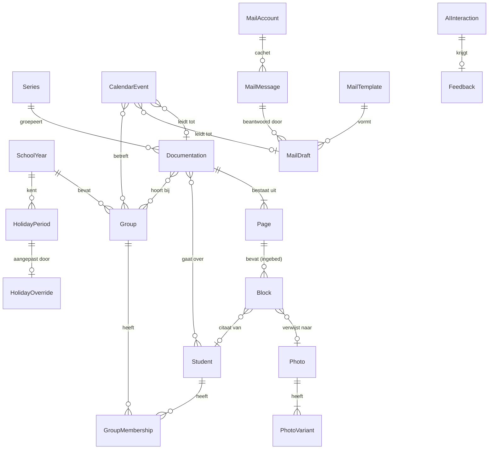

<!-- Onderdeel van de EduFlow Product Bible v1.0 (7 augustus 2026).
     Bindend. Volledig document: docs/product-bible-volledig.md
     Wijzigingen lopen via docs/19-besluitenregister.md -->

## 8. Datamodel

Dit hoofdstuk beschrijft waar gegevens fysiek staan: welke tabellen er zijn, welke velden erin
zitten, welke indexen erop liggen, hoe het schema van versie naar versie meegaat en hoe een
back-upbestand eruitziet. Het gaat over opslag, niet over betekenis. Wat een documentatie
*is*, welke regels erop gelden en welke invarianten altijd waar moeten zijn, staat in
hoofdstuk 9. Waar dit hoofdstuk een veld noemt dat een regel draagt, verwijst het daarheen
en herhaalt het die regel niet.

### 8.1 Uitgangspunten van het datamodel

#### 8.1.1 Lokaal-eerst en server-klaar

Versie 1.0 slaat alles op het apparaat op. Er is geen server die gegevens bewaart, geen
account, geen gedeelde database. Een documentatie leeft op één apparaat en verhuist via een
exportbestand (B-01). Tegelijk is het datamodel vanaf de eerste regel code zo gebouwd dat er
later een server bij kan zonder dat de opslag op de schop gaat. Dat is de kern van B-24:
lokaal-eerst in gedrag, server-klaar in vorm.

Die twee eisen botsen minder dan je zou denken, maar ze botsen wel op één punt: een lokale
database mag alles simpel houden, en een gesynchroniseerde database mag dat niet. Een
automatisch oplopend getal als sleutel is lokaal prima en over twee apparaten een garantie op
botsingen. Een record hard verwijderen is lokaal prima en over twee apparaten een garantie
dat het verwijderde record terugkomt zodra het andere apparaat zijn versie stuurt. Het
verschil tussen een lokaal model en een synchronisatiebestendig model zit niet in de
tabellen, maar in zes velden en één regel. Die zes velden en die ene regel bouw je nu, niet
later.

De prijs is klein en zichtbaar: elk record is ongeveer 130 bytes groter en elke schrijfactie
raakt één extra tabel. De winst is dat fase 2 een uitbreiding is en geen verbouwing
(zie §8.10).

#### 8.1.2 Wat synchronisatiebestendig concreet betekent

Synchronisatiebestendig betekent dat twee kopieën van dezelfde database, die een tijd lang
onafhankelijk van elkaar zijn bewerkt, samengevoegd kunnen worden tot één database zonder dat
er gegevens verdwijnen en zonder dat een mens per record moet beslissen wat er gebeurt. Dat
vraagt vier eigenschappen van elk record. Ze staan hieronder met de vraag die ze beantwoorden
en de velden die ze dragen.

| # | Eigenschap | De vraag die hij beantwoordt | Velden |
|---|---|---|---|
| 1 | **Wereldwijd unieke identiteit** | Is dit record hetzelfde record als dat record? | `id` |
| 2 | **Herkomst** | Welk apparaat heeft dit record gemaakt of als laatste aangeraakt? | `origin` |
| 3 | **Volgorde van wijzigingen** | Welke van twee versies is de nieuwere? | `rev`, `updatedAt`, `createdAt` |
| 4 | **Verwijderen als feit** | Is dit record verwijderd, of heeft het andere apparaat het gewoon nog niet? | `deletedAt` |

Daar komt een vijfde veld bij dat niet over synchronisatie gaat maar over tijd: `schemaVersion`
vertelt volgens welke vorm het record is opgeschreven. Een record dat in een back-up van een
jaar oud zit, moet leesbaar zijn zonder dat je weet uit welke app-versie het komt.

Wat synchronisatiebestendig **niet** betekent: het betekent niet dat er in versie 1.0 iets
synchroniseert. `SyncService` bestaat als interface met een lege implementatie (zie §5.2 van
de architectuur in hoofdstuk 6). Het betekent ook niet dat elke botsing automatisch goed
afloopt. Het betekent dat elke botsing *detecteerbaar* is en dat er per tabel een vastgelegde
regel is die hem oplost (zie §8.7 voor terugzetten en §8.10 voor synchronisatie).

#### 8.1.3 De sleutel is een UUIDv7

Elke primaire sleutel in EduFlow is een UUID versie 7, als kleine letters met streepjes,
36 tekens. Geen oplopende getallen, geen samengestelde natuurlijke sleutels, geen
`crypto.randomUUID()` (dat is versie 4). Drie redenen, in volgorde van gewicht:

1. **Geen coördinatie nodig.** Een apparaat dat offline is, moet een nieuw record kunnen maken
   met een sleutel waarvan het zeker weet dat geen ander apparaat hem ook kiest. Dat kan
   alleen als de sleutel breed genoeg willekeurig is. Een oplopend getal vereist dat er ergens
   één teller is, en die is er niet.
2. **Tijdgesorteerd.** De eerste 48 bits van een UUIDv7 zijn de Unix-tijd in milliseconden.
   Records die na elkaar gemaakt worden, krijgen sleutels die na elkaar sorteren. Dat scheelt
   in IndexedDB een aparte index op `createdAt` voor elke lijst die op aanmaakvolgorde staat,
   het houdt de B-boom van de primaire sleutel compact omdat er altijd rechts wordt
   ingevoegd, en het maakt een sleutel leesbaar: aan het begin van de sleutel zie je wanneer
   het record ontstond.
3. **Botsingsvrij in de praktijk.** Na de tijdstempel volgen 74 willekeurige bits. Twee
   apparaten die in dezelfde milliseconde een record maken, botsen met een kans van ongeveer
   1 op 10²². Bij 200 documentaties per jaar is dat geen risico dat je hoeft af te dekken.

De generator staat op één plek, in `StorageService`, en wordt nooit ergens anders aangeroepen.
Een sleutel die niet aan het patroon voldoet, komt de opslag niet in: Zod controleert het
versienibble en de variantbits, niet alleen de lengte.

```typescript
export const UUID_V7 = /^[0-9a-f]{8}-[0-9a-f]{4}-7[0-9a-f]{3}-[89ab][0-9a-f]{3}-[0-9a-f]{12}$/;

/** Wereldwijd unieke, tijdgesorteerde sleutel. Enige plek waar sleutels ontstaan. */
export function newId(): Uuid {
  const ms = BigInt(Date.now());
  const bytes = crypto.getRandomValues(new Uint8Array(16));
  bytes[0] = Number((ms >> 40n) & 0xffn);
  bytes[1] = Number((ms >> 32n) & 0xffn);
  bytes[2] = Number((ms >> 24n) & 0xffn);
  bytes[3] = Number((ms >> 16n) & 0xffn);
  bytes[4] = Number((ms >> 8n) & 0xffn);
  bytes[5] = Number(ms & 0xffn);
  bytes[6] = (bytes[6]! & 0x0f) | 0x70; // versie 7
  bytes[8] = (bytes[8]! & 0x3f) | 0x80; // variant 10
  const hex = [...bytes].map((b) => b.toString(16).padStart(2, '0')).join('');
  return `${hex.slice(0, 8)}-${hex.slice(8, 12)}-${hex.slice(12, 16)}-${hex.slice(16, 20)}-${hex.slice(20)}`;
}
```

#### 8.1.4 De overige velden van elk record

| Veld | Type | Betekenis | Wie zet hem |
|---|---|---|---|
| `createdAt` | `IsoDateTime` | Moment van ontstaan, in UTC. Verandert nooit meer. | `StorageService.create()` |
| `updatedAt` | `IsoDateTime` | Moment van de laatste inhoudelijke wijziging, in UTC. | `StorageService.update()` |
| `deletedAt` | `IsoDateTime \| null` | Moment van markeren als verwijderd. `null` betekent: bestaat. | `StorageService.softDelete()` |
| `rev` | `number` | Teller die bij elke schrijfactie met één omhoog gaat. Begint op 1. | `StorageService` |
| `origin` | `Uuid` | Apparaat-id van het apparaat dat deze versie schreef. | `StorageService` |
| `schemaVersion` | `number` | Schemaversie waarin dit record is opgeschreven. | `StorageService` |

Drie aandachtspunten die je bij het bouwen tegenkomt.

**Alle tijden zijn UTC.** Elke `IsoDateTime` eindigt op `Z`. Er staat nooit een lokale
tijdzone in de opslag. Omrekenen naar Europe/Amsterdam gebeurt in de weergavelaag, één keer,
met `Intl.DateTimeFormat`. Dat is de enige manier waarop een back-up die in de zomertijd is
gemaakt in de wintertijd nog dezelfde tijden toont. Kalenderdagen zonder tijd (een
vakantiedatum, een geboortedatum, de dag waarop iets gebeurde) zijn een apart type
`IsoDate` van tien tekens en worden nooit als tijdstip opgeslagen, want dan verschuift 1
januari op de helft van de apparaten naar 31 december.

**`rev` en `updatedAt` doen niet hetzelfde.** `updatedAt` is een klok en klokken lopen op
apparaten uit de pas; een telefoon met een verkeerd ingestelde tijd is geen zeldzaamheid.
`rev` is een teller en telt betrouwbaar door. Bij het samenvoegen van twee versies is `rev`
leidend en `updatedAt` de tiebreaker (zie §8.7.5 en §8.10.3).

**`origin` is het apparaat, niet de gebruiker.** EduFlow kent in versie 1.0 geen accounts
(B-21). Het apparaat-id is een UUIDv7 die bij de eerste start wordt gegenereerd en in de
`settings`-tabel staat. Hij is niet herleidbaar tot een persoon en gaat niet naar een
provider.

#### 8.1.5 Het basistype `BaseRecord`

Elke tabel behalve `changeLog` slaat records op die `BaseRecord` uitbreiden. Dat is geen
suggestie maar een typecontrole: `StorageService` accepteert alleen typen die van
`BaseRecord` erven, en de Zod-schema's worden zonder uitzondering met `zBaseRecord.extend()`
gebouwd.

```typescript
/** UUIDv7 als kleine letters met streepjes. */
export type Uuid = string;
/** ISO 8601 in UTC, met milliseconden: 2026-08-07T12:04:55.031Z */
export type IsoDateTime = string;
/** ISO 8601 kalenderdag zonder tijd en zonder zone: 2026-08-07 */
export type IsoDate = string;

export interface BaseRecord {
  id: Uuid;
  createdAt: IsoDateTime;
  updatedAt: IsoDateTime;
  deletedAt: IsoDateTime | null;
  rev: number;
  origin: Uuid;
  schemaVersion: number;
}
```

```typescript
import { z } from 'zod';

export const zUuid = z.string().regex(UUID_V7, 'Geen geldige UUIDv7');
export const zIsoDateTime = z.string().datetime({ offset: false });
export const zIsoDate = z.string().regex(/^\d{4}-\d{2}-\d{2}$/, 'Verwacht JJJJ-MM-DD');

export const CURRENT_SCHEMA_VERSION = 7;

export const zBaseRecord = z.object({
  id: zUuid,
  createdAt: zIsoDateTime,
  updatedAt: zIsoDateTime,
  deletedAt: zIsoDateTime.nullable(),
  rev: z.number().int().min(1),
  origin: zUuid,
  schemaVersion: z.number().int().min(1).max(CURRENT_SCHEMA_VERSION),
});
```

In de schema's hieronder staat `...zBaseRecord.shape` niet telkens uitgeschreven. Elke
`z.object({ ... })` in §8.3 is in werkelijkheid `zBaseRecord.extend({ ... })`. De
zes basisvelden staan ook niet in elke veldtabel; ze gelden overal en betekenen overal
hetzelfde.

#### 8.1.6 Verwijderen is markeren

`StorageService.delete()` bestaat niet. Er is `softDelete()`, die `deletedAt` zet, `rev`
ophoogt en een regel in `changeLog` schrijft. Er is `purge()`, die een record echt uit
IndexedDB haalt, en die wordt alleen aangeroepen door de opruimtaak uit §8.8 en door
"definitief wissen" in Instellingen. Vier redenen:

1. **Anders komt het terug.** Zodra er twee apparaten zijn, is een record dat verdwenen is
   niet te onderscheiden van een record dat het andere apparaat nog nooit gezien heeft. Zonder
   markering herstelt de synchronisatie elk verwijderd record netjes weer. Dit is de reden
   die er in fase 2 toe doet en de reden waarom het nu al moet.
2. **Verwijzingen blijven geldig.** Een documentatie verwijst naar leerlingen. Verwijder je
   een leerling hard, dan wijst die verwijzing nergens meer heen en moet elke leesactie daarop
   voorbereid zijn. Met markeren blijft het record vindbaar en toont het scherm "Kjeld
   (verwijderd)" in plaats van een leeg vakje.
3. **De prullenbak is een gebruikersfunctie.** Dertig dagen terug kunnen halen wat je
   weggooide, is geen technisch detail maar een belofte (zie §8.8).
4. **Het logboek klopt.** Een `auditEvent` dat verwijst naar een record dat er niet meer is,
   is een logboek dat vragen oproept in plaats van beantwoordt.

Wat markeren betekent voor het lezen: **elke leesactie filtert op `deletedAt === null`,
zonder uitzondering.** Dat filter zit in `StorageService`, niet in de aanroepende code. Wie
verwijderde records wil zien, roept expliciet `listDeleted()` aan. Een scherm dat zelf
`db.students.toArray()` doet en dan filtert, is een fout (U-03).

Markeren is geen verwijderen in de zin van de AVG. Een verzoek om verwijdering leidt tot
`purge()`, inclusief de bijbehorende `changeLog`-regels en blobs. Dat pad staat in §8.8.4.

### 8.2 Opslaglagen

EduFlow gebruikt drie opslagplekken in de browser, met een strikte scheiding die niet
onderhandelbaar is.

| Laag | Wat erin staat | Persoonsgegevens | Omvang |
|---|---|---|---|
| IndexedDB (via Dexie) | Alle 24 tabellen uit §8.3, inclusief foto's als blob | Ja | Gigabytes |
| `localStorage` | Precies zes sleutels, allemaal apparaatvoorkeuren | Nee, nooit | Onder 4 KB |
| Cookie | Eén sessiecookie met de toegangscode | Nee | Onder 1 KB |

#### 8.2.1 IndexedDB via Dexie

Alles met persoonsgegevens staat in IndexedDB (T-01, T-12). IndexedDB is de enige
browseropslag die drie dingen tegelijk kan: blobs bewaren zonder ze eerst naar tekst om te
zetten, indexen aanleggen zodat een lijst van 1.000 documentaties niet volledig gelezen hoeft
te worden, en transacties over meerdere tabellen uitvoeren zodat een halve schrijfactie niet
blijft staan.

Dexie is de laag erboven. Hij levert een leesbare schemadeclaratie, een migratieroutine die
versies aan elkaar knoopt (§8.6), en een querytaal die je niet dwingt om met cursors te
werken. Dexie is een hulpmiddel, geen ORM: er is geen objectmapping, geen lazy loading, geen
relatiebeheer. Wat Dexie teruggeeft is een gewoon object, en dat object gaat door Zod voordat
het de servicelaag in gaat.

De regel bij lezen en schrijven (T-12): **elk record wordt bij het schrijven gevalideerd en
bij het lezen opnieuw gevalideerd.** Bij schrijven omdat een fout in de code anders stil in de
opslag terechtkomt en pas maanden later opvalt. Bij lezen omdat de database ouder kan zijn dan
de code, uit een back-up kan komen, of door een mislukte migratie is aangeraakt. De
leesvalidatie is niet gratis: bij 1.000 documentaties kost hij ongeveer 25 ms. Dat is
aanvaardbaar en het alternatief is het niet.

Faalt de validatie bij lezen, dan gooit `StorageService` het record niet weg. Hij zet het
opzij in een quarantainelijst, schrijft een `auditEvent` van het type `validatie-mislukt`, en
laat de rest van de lijst gewoon zien. Eén kapot record maakt geen scherm onbruikbaar.

De database heet `eduflow`. Er is er één per oorsprong. `navigator.storage.persist()` wordt
bij de eerste start aangevraagd; wordt hij geweigerd of genegeerd, dan geldt de
back-upherinnering uit B-02 en het opslagbeleid uit §8.9.

#### 8.2.2 `localStorage`: zeven sleutels, niet meer

`localStorage` is synchroon en leesbaar vóórdat IndexedDB open is. Dat is zijn enige nut en
meteen zijn enige toegestane gebruik: waarden die het eerste scherm nodig heeft om zonder
flikkering te tekenen, en die geen persoonsgegevens zijn. Persoonsgegevens in `localStorage`
zijn expliciet verboden (zie de verbodenlijst in hoofdstuk 6).

Deze zeven sleutels staan erin, en er komt er geen achtste bij zonder dat dit hoofdstuk
wordt gewijzigd. *(Het waren er zes; `eduflow.lastIcsExportAt` is toegevoegd door B-124.)*

| Sleutel | Type | Standaardwaarde | Waarom hij hier mag staan |
|---|---|---|---|
| `eduflow.region` | `'noord' \| 'midden' \| 'zuid'` | `'midden'` | Bepaalt welke vakantiedata de agenda toont. Een regio is een landsdeel, geen persoonsgegeven. De agenda moet bij het eerste frame al de goede kleuren tonen. |
| `eduflow.defaultTone` | `'warm' \| 'zakelijk' \| 'kort'` | `'warm'` | Voorkeur voor de toon van AI-voorstellen. Zegt iets over de gebruiker als schrijver, niet als persoon, en is nodig voordat het schrijfscherm zijn eerste voorstel doet. |
| `eduflow.aiProvider` | `'openai-eu' \| 'vertex-eu' \| 'bedrock-eu'` | `'openai-eu'` | Providerkeuze (T-06). Een technische keuze van de ICT-coördinator. De schil moet hem meesturen bij de eerste aanroep zonder eerst de database te openen. |
| `eduflow.lastView` | `{ module: string; view: string }` als JSON | `{"module":"dashboard","view":"vandaag"}` | Laatst gekozen weergave per module, inclusief de jaar-of-weekkeuze uit B-31. Zonder deze sleutel opent de agenda eerst in de verkeerde weergave en springt hij daarna, wat er kapot uitziet. |
| `eduflow.lastBackupAt` | `IsoDateTime \| null` | `null` | Datum van de laatste geslaagde back-up, voor de herinnering na een maand (B-02). Moet leesbaar zijn ook als IndexedDB net gewist is door Safari, want juist dan is de herinnering relevant. |
| `eduflow.lastIcsExportAt` | `IsoDateTime \| null` | `null` | Moment van de laatste ICS-export, voor de teller uit FR-AGE-27: hoeveel items zijn er sindsdien gewijzigd. Een apparaatvoorkeur, net als `lastBackupAt` — exporteer je op je laptop, dan hoort je telefoon niet te denken dat híj geëxporteerd heeft. Toegevoegd door B-124. |
| `eduflow.onboardingFlags` | `Record<string, IsoDateTime>` als JSON | `{}` | De eenmalige vragen: de vraag om de app op het beginscherm te zetten (B-02), de bevestiging bij een lege leerlingenlijst (T-08), en het afronden van de eerste-keer-ervaring (B-49). Elke vlag is een tijdstip, geen boolean, zodat je weet wanneer iets is bevestigd. |

Drie regels bij deze tabel:

- Deze zes waarden staan **alleen** in `localStorage`. Ze staan niet ook in `settings`. Dat is
  U-02 in de praktijk: één gegeven, één plek. `SettingsService` leest en schrijft ze via een
  smalle wrapper die typen en standaardwaarden afdwingt, zodat de rest van de app nooit
  rechtstreeks `localStorage` aanraakt.
- Elke waarde wordt bij het lezen gevalideerd tegen een Zod-schema. Staat er onzin (een oude
  waarde, een handmatige wijziging, een halve JSON), dan valt de sleutel terug op de
  standaardwaarde en verdwijnt de onzin bij de eerstvolgende schrijfactie.
- Ze gaan **niet** mee in de back-up en **niet** mee in de synchronisatie. Het zijn
  apparaatvoorkeuren. Zet je een back-up terug op een nieuwe laptop, dan houdt die laptop zijn
  eigen weergavevoorkeur.

#### 8.2.3 De cookie voor de toegangscode

EduFlow kent geen accounts (B-21). De toegang tot de app en tot `/api/ai` loopt via een
toegangscode per apparaat (T-05). Die code wordt één keer ingevoerd en daarna bewaard in één
cookie.

| Eigenschap | Waarde | Reden |
|---|---|---|
| Naam | `eduflow_access` | |
| Inhoud | Ondertekend sessiekaartje met het toegangscode-id en een vervaldatum. Niet de code zelf. | De code zelf hoeft nooit terug naar de browser. |
| `httpOnly` | `true` | JavaScript kan er niet bij, dus een fout in de app of een script van derden kan hem niet uitlezen. |
| `Secure` | `true` | Alleen over HTTPS. |
| `SameSite` | `Strict` | De cookie gaat nooit mee bij een verzoek dat van een andere site komt. |
| `Max-Age` | 90 dagen | Lang genoeg om niet te irriteren, kort genoeg om een vergeten apparaat te laten verlopen. |
| `Path` | `/` | |

De reden dat dit een cookie is en geen `localStorage`-sleutel: de server moet hem lezen. De
snelheidslimiet en het dagbudget uit T-17 werken per toegangscode, dus het kaartje moet
automatisch meegaan bij elk verzoek naar `/api/ai` en `/api/mail`. `httpOnly` maakt hem
ontoegankelijk voor scripts, wat precies de bescherming is die `localStorage` niet kan bieden.

De mailtokens uit T-15 zitten in een tweede, aparte, versleutelde `httpOnly`-cookie. Die
staat beschreven in hoofdstuk 13. Er staat **nooit** een token in IndexedDB of in
`localStorage`.

#### 8.2.4 Waarom de leerlingenlijst en het stijlvoorbeeld in IndexedDB horen

Twee gegevens werden in eerdere ontwerpen als "instelling" behandeld en horen dat niet te
zijn. Ze staan in IndexedDB, in een eigen tabel, met een eigen record per rij.

**De leerlingenlijst** (`students`) bestaat uit voornamen, achternamen en soms een
geboortedatum van kinderen. Dat zijn persoonsgegevens van minderjarigen, de zwaarste categorie
die EduFlow aanraakt. `localStorage` is onversleuteld, synchroon leesbaar door elk script op
de pagina, zichtbaar in de ontwikkelaarsconsole en zonder omvangsgarantie boven ongeveer 5 MB.
Bovendien is de lijst geen enkele waarde maar een verzameling records met een eigen
levensloop: een leerling stroomt in, zit in meerdere groepen, gaat over, vertrekt. Daar hoort
een tabel bij met indexen en lidmaatschappen (§8.3.4), geen JSON-blob in een sleutel-waardepaar.
De lijst is bovendien het fundament van de privacylaag: `privacyTerms` wordt eruit afgeleid, en
een lege lijst betekent dat de afscherming stilzwijgend niets doet (T-08).

**Het stijlvoorbeeld** (`styleExamples`) bestaat uit paren van een ruwe notitie en de
documentatie die eruit hoort te komen. Die teksten gaan over echte situaties met echte
kinderen, ook als de namen erin verzonnen zijn. Ze gaan bovendien mee naar de AI-provider als
voorbeeld (§10.4), wat ze precies tot het soort gegeven maakt dat controleerbaar moet zijn:
de gebruiker moet ze kunnen lezen, wijzigen en wissen (B-23), en het controlescherm "Bekijk
wat er verstuurd wordt" moet ze kunnen tonen (B-11). Dat vraagt een tabel met per voorbeeld
een record, een aan-uitschakelaar, een teller voor gebruik en een verwijzing naar de
documentatie waar het voorbeeld uit voortkwam. Ook hier: een verzameling records, geen
instelling.

De vuistregel die hieruit volgt en die de rest van het hoofdstuk stuurt: **als iets een
meervoud is, of over een mens gaat, of ooit naar een provider kan, dan is het een tabel in
IndexedDB.**

### 8.3 Het volledige schema

Elk record erft van `BaseRecord`. Dat is geen gemak maar een voorwaarde: zonder deze zes velden is een latere synchronisatie een verbouwing in plaats van een toevoeging (B-24, T-11).

```typescript
type Uuid = string;                 // UUIDv7, 36 tekens
type IsoDateTime = string;          // "2026-10-13T14:32:11.482Z", altijd UTC
type IsoDate = string;              // "2026-10-13"

interface BaseRecord {
  id: Uuid;
  createdAt: IsoDateTime;
  updatedAt: IsoDateTime;
  deletedAt: IsoDateTime | null;    // niet null = verwijderd (grafsteen)
  rev: number;                      // monotoon per record, +1 bij elke schrijfactie
  origin: string;                   // apparaat-id waar de laatste wijziging vandaan komt
  schemaVersion: number;            // versie van het schema van dít record
}
```

```typescript
const baseRecord = z.object({
  id: z.string().uuid(),
  createdAt: z.string().datetime(),
  updatedAt: z.string().datetime(),
  deletedAt: z.string().datetime().nullable(),
  rev: z.number().int().nonnegative(),
  origin: z.string().min(1).max(64),
  schemaVersion: z.number().int().positive(),
});
```

#### 8.3.1 `students`

Doel: de leerlingen van deze professional. Dit is het gevoeligste bestand van de app en tegelijk de motor van de afscherming.

Primaire sleutel `id`. Indexen: `firstNameLower` (voor de afschermlijst), `deletedAt`.

| Veld | Type | Verplicht | Standaard | Validatie |
|---|---|---|---|---|
| `firstName` | tekst | ja | — | 1-40 tekens, geen cijfers |
| `firstNameLower` | tekst | ja | afgeleid | kleine letters, diakrieten behouden |
| `lastNameInitial` | tekst | nee | leeg | 1-3 tekens, mag punt bevatten |
| `birthDay` | geheel getal | nee | — | 1-31 |
| `birthMonth` | geheel getal | nee | — | 1-12 |
| `birthYear` | geheel getal | nee | — | 1990-huidig jaar |
| `note` | tekst | nee | leeg | ≤ 500 tekens, gaat nooit naar AI |
| `pseudonymSeed` | geheel getal | ja | volgnummer | bepaalt `[LEERLING-n]` |

`birthYear` staat los van dag en maand, zodat een geboortedatum zonder jaar kan (T-21, dataminimalisatie).

```typescript
interface Student extends BaseRecord {
  firstName: string;
  firstNameLower: string;
  lastNameInitial: string;
  birthDay: number | null;
  birthMonth: number | null;
  birthYear: number | null;
  note: string;
  pseudonymSeed: number;
}
```

#### 8.3.2 `groups`

| Veld | Type | Verplicht | Validatie |
|---|---|---|---|
| `name` | tekst | ja | 1-60 tekens |
| `kind` | opsomming | ja | `stamgroep`, `combinatiegroep`, `projectgroep`, `zorggroep`, `instroomgroep`, `overig` |
| `schoolYearId` | verwijzing | ja | bestaand schooljaar |
| `colour` | opsomming | ja | een van acht |

Er is geen `studentIds` op een groep en geen `groupId` op een leerling. Beide richtingen lopen uitsluitend via `groupMemberships` (U-07, B-16, INV-01).

#### 8.3.3 `groupMemberships`

Dit is de tabel die "meerdere groepen per leerling" mogelijk maakt en die de geschiedenis bewaart.

Indexen: `studentId`, `groupId`, `[studentId+groupId]`, `[groupId+from]`.

| Veld | Type | Verplicht | Validatie |
|---|---|---|---|
| `studentId` | verwijzing | ja | bestaande leerling |
| `groupId` | verwijzing | ja | bestaande groep |
| `from` | datum | ja | — |
| `to` | datum | nee | niet vóór `from` |
| `role` | opsomming | nee | `lid` (standaard), `gast` |

```typescript
const groupMembership = baseRecord.extend({
  studentId: z.string().uuid(),
  groupId: z.string().uuid(),
  from: z.string().date(),
  to: z.string().date().nullable(),
  role: z.enum(["lid", "gast"]).default("lid"),
}).refine(m => !m.to || m.to >= m.from, {
  message: "Einddatum ligt vóór de begindatum",
  path: ["to"],
});
```

Overlap binnen dezelfde combinatie leerling-groep is verboden (INV-04). Die controle staat in `GroupService`, niet in Zod, want hij vraagt om andere records.

#### 8.3.4 `series`

| Veld | Type | Verplicht | Validatie |
|---|---|---|---|
| `name` | tekst | ja | 1-60 tekens |
| `colour` | opsomming | ja | een van acht |
| `description` | tekst | nee | ≤ 500 tekens; gaat mee als context bij de vervolgzin (B-04) |

#### 8.3.5 `documentations`

Indexen: `date`, `updatedAt`, `seriesId`, `status`, `*studentIds`, `*groupIds`, `deletedAt`. De sterretjes zijn meerwaardige indexen van Dexie; daarmee is "alle documentaties waarin Kjeld voorkomt" één indexvraag.

| Veld | Type | Verplicht | Standaard | Validatie |
|---|---|---|---|---|
| `title` | tekst | nee | leeg | ≤ 120 tekens |
| `date` | datum | ja | vandaag | ≤ vandaag + 7 dagen (B-70) |
| `seriesId` | verwijzing | nee | — | bestaande reeks |
| `studentIds` | lijst | nee | leeg | bestaande leerlingen |
| `groupIds` | lijst | nee | leeg | bestaande groepen |
| `pageIds` | lijst | ja | één pagina | volgorde is betekenisdragend |
| `privateNote` | tekst | nee | leeg | ≤ 2.000 tekens, nooit in export, nooit naar AI |
| `status` | opsomming | ja | `concept` | `concept`, `gedeeld` |
| `firstExportedAt` | datumtijd | nee | — | gezet bij de eerste geslaagde export (B-13) |
| `archivedAt` | datumtijd | nee | — | — |
| `imageConsentAt` | datumtijd | nee | — | toestemming beeldgebruik, één keer per documentatie (B-08) |

`groupIds` is de **expliciete** koppeling. Daarnaast bestaat een **afgeleide** groepsverzameling: de groepen waarin de gekoppelde leerlingen lid waren op `date`. Die wordt berekend en nooit opgeslagen (U-02). Expliciet gaat boven afgeleid; afgeleid verschijnt in de app als suggestie met de tekst "Ook: Techniekclub (via Kjeld en Mees). Toevoegen?" (B-17).

```typescript
interface Documentation extends BaseRecord {
  title: string;
  date: IsoDate;
  seriesId: Uuid | null;
  studentIds: Uuid[];
  groupIds: Uuid[];
  pageIds: Uuid[];
  privateNote: string;
  status: "concept" | "gedeeld";
  firstExportedAt: IsoDateTime | null;
  archivedAt: IsoDateTime | null;
  imageConsentAt: IsoDateTime | null;
}
```

#### 8.3.6 `pages`

Een pagina is een eigen record (U-06, B-15). Reden: autosave schrijft dan één pagina weg in plaats van een hele documentatie met twintig foto's aan blokken, en een latere synchronisatie botst per pagina in plaats van per documentatie.

Blokken staan **ingebed** in de pagina. Reden: een blok heeft geen eigen levensduur, geen eigen verwijzingen van buiten en geen zin buiten zijn pagina. Een aparte tabel zou alleen extra samenvoegwerk opleveren (§9.4).

| Veld | Type | Verplicht | Validatie |
|---|---|---|---|
| `documentationId` | verwijzing | ja | bestaande documentatie |
| `order` | geheel getal | ja | ≥ 0, uniek binnen de documentatie |
| `layoutId` | opsomming | ja | `A-fotoraster`, `B-verhaal`, `C-groot-beeld`, `D-alleen-beeld`, `E-vervolg` |
| `autoCreated` | ja/nee | ja | vervolgpagina's staan op `true` (B-74) |
| `blocks` | lijst | ja | zie hieronder, ≤ 40 blokken |

```typescript
type Block = TextBlock | PhotoBlock | QuoteBlock | HeadingBlock;

interface BlockBase { id: Uuid; slot: number; order: number; }

interface TextBlock extends BlockBase {
  kind: "text";
  text: string;                       // ≤ 20.000 tekens
}

interface PhotoBlock extends BlockBase {
  kind: "photo";
  photoId: Uuid;
  crop: { x: number; y: number; w: number; h: number } | null;  // 0-1, relatief (B-65)
  altText: string;
}

interface QuoteBlock extends BlockBase {
  kind: "quote";
  text: string;                       // ≤ 400 tekens
  studentId: Uuid | null;             // hoogstens één (INV-09)
  attributionStyle: "roepnaam" | "initiaal" | "geen";
}

interface HeadingBlock extends BlockBase {
  kind: "heading";
  text: string;                       // ≤ 80 tekens
  level: 1 | 2;
}
```

```typescript
const block = z.discriminatedUnion("kind", [
  blockBase.extend({ kind: z.literal("text"),    text: z.string().max(20_000) }),
  blockBase.extend({ kind: z.literal("photo"),   photoId: z.string().uuid(),
                     crop: cropSchema.nullable(), altText: z.string().max(300) }),
  blockBase.extend({ kind: z.literal("quote"),   text: z.string().min(1).max(400),
                     studentId: z.string().uuid().nullable(),
                     attributionStyle: z.enum(["roepnaam","initiaal","geen"]) }),
  blockBase.extend({ kind: z.literal("heading"), text: z.string().min(1).max(80),
                     level: z.union([z.literal(1), z.literal(2)]) }),
]);
```

#### 8.3.7 `photos` en `photoVariants`

Gescheiden om één reden: metagegevens worden vaak gelezen (elke lijst, elke zoekopdracht, elke overloopberekening) en blobs zelden. Staan ze in hetzelfde record, dan trekt elke lijstopvraag megabytes aan beeld door het geheugen.

`photos`:

| Veld | Type | Opmerking |
|---|---|---|
| `width`, `height` | geheel getal | van de `print`-variant |
| `bytes` | geheel getal | som van de drie varianten |
| `hash` | tekst | SHA-256 over de oorspronkelijke bytes; herkent dubbelen bij terugzetten (FR-INS-31) |
| `capturedAt` | datumtijd of null | uit EXIF, vóór het strippen |
| `orientation` | geheel getal | al toegepast bij het verkleinen; hier alleen ter informatie |
| `refCount` | geheel getal | aantal `PhotoBlock`s dat verwijst; 0 betekent verweesd (T-22) |

`photoVariants`:

| Veld | Type | Opmerking |
|---|---|---|
| `photoId` | verwijzing | samengestelde sleutel met `variant` |
| `variant` | opsomming | `thumb` (480 px), `screen` (1280 px), `print` (3300 px) |
| `blob` | Blob | JPEG, kwaliteit 88 |
| `bytes` | geheel getal | — |

Bij het toevoegen worden EXIF-locatiegegevens verwijderd en wordt de opnamedatum bewaard als suggestie voor het datumveld (FR-DOC-98). Het origineel wordt niet bewaard; dat is de afweging uit C3 van de review.

#### 8.3.8 `calendarEvents`, `schoolYears`, `holidayPeriods`, `holidayOverrides`

`calendarEvents` volgt de veldtabel uit §6.2.2. Indexen: `start`, `[start+end]`, `kind`, `*groupIds`, `documentationId`.

`schoolYears`: `name` ("2026-2027"), `firstSchoolDay`, `lastSchoolDay`, `region` (`noord`, `midden`, `zuid`), `isCurrent`.

`holidayPeriods` is een leescache van het meegeleverde bestand, niet de bron. Bij een update van het bestand wordt de tabel leeggemaakt en opnieuw gevuld; `holidayOverrides` blijft staan en wordt eroverheen gelegd (B-50, FR-AGE-11).

`holidayOverrides`: `schoolYearName`, `region`, `holidayKey`, `from`, `to`. De sleutel is de combinatie van de eerste drie, zodat een update van het bronbestand jouw aanpassing niet raakt.

#### 8.3.9 `mailAccounts`, `mailMessages`, `mailDrafts`, `mailTemplates`

`mailAccounts` bevat **geen tokens** (T-15, FR-MAI-06): alleen `provider`, `emailAddress`, `displayName`, `connectedAt`, `scopesGranted` (voor het controlescherm uit FR-MAI-03) en `lastSyncAt`.

`mailMessages` is een cache met een vervaldatum: `externalId`, `subject`, `fromName`, `fromAddress`, `receivedAt`, `bodyText`, `hasAttachments`, `attachmentNames`, `cachedAt`, `expiresAt`. Alleen berichten die je opent (FR-MAI-09). Opruiming bij elke start en elk uur.

`mailDrafts` volgt de veldtabel uit §6.3.8, met `subject` verplicht (B-36).

`mailTemplates`: `name`, `recipientKind`, `instructions`, `skeleton`, `isBuiltIn`, `originalHash` (om "Herstel origineel" mogelijk te maken).

#### 8.3.10 `privacyTerms` en de pseudoniemafbeelding

`privacyTerms`: `term`, `termLower`, `kind` (`achternaam`, `collega`, `school`, `plaats`, `overig`), `enabled`. Dit zijn de extra termen uit FR-INS-19.

De `PseudonymMap` wordt **niet opgeslagen**. Hij bestaat alleen tijdens één AI-aanroep, in het geheugen, en wordt daarna weggegooid. Reden: een opgeslagen afbeelding tussen code en naam is precies de sleutel waarmee gepseudonimiseerde gegevens weer persoonsgegevens worden (§11 van de canon, hoofdstuk 15). Wat we niet bewaren, kan niet lekken.

#### 8.3.11 `styleProfile` en `styleExamples`

`styleProfile` is een enkelvoudig record met de gemeten kenmerken plus per kenmerk of hij handmatig is overschreven (FR-INS-14):

```typescript
interface StyleProfile extends BaseRecord {
  avgSentenceWords: { value: number; manual: boolean };
  avgParagraphSentences: { value: number; manual: boolean };
  tense: { value: "tegenwoordig" | "verleden"; manual: boolean };
  address: { value: "wij" | "ik" | "onpersoonlijk"; manual: boolean };
  quoteFrequency: { value: number; manual: boolean };     // citaten per documentatie
  descriptionRatio: { value: number; manual: boolean };    // 0-1, beschrijven vs. duiden
  preferredWords: string[];
  avoidedWords: string[];
  correctionRules: Array<{ id: Uuid; pattern: string; reason: string; confirmedAt: IsoDateTime }>;
  sampleCount: number;
  lastComputedAt: IsoDateTime;
}
```

`styleExamples`: `rawNote`, `goodResult`, `overshotResult`, `overshotReason`, `isGolden`. De laatste markeert of dit voorbeeld deel uitmaakt van de gouden testset (§12.9).

#### 8.3.12 `aiInteractions` en `feedback`

Dit is het logboek dat de kwaliteitsmeting voedt en dat bij een privacygesprek op tafel komt. Daarom staat er **geen tekstinhoud met persoonsgegevens** in.

| Veld | Type | Opmerking |
|---|---|---|
| `task` | opsomming | `doc.write`, `doc.title`, `doc.followup`, `doc.spelling`, `talk.build`, `mail.summarise`, `mail.write`, `mail.tone` |
| `provider`, `model` | tekst | — |
| `region` | tekst | verwerkingsregio, voor het logboek uit hoofdstuk 16 |
| `charsIn`, `charsOut` | geheel getal | tellingen, geen inhoud |
| `pseudonymCount` | geheel getal | hoeveel gegevens zijn afgeschermd |
| `durationMs` | geheel getal | — |
| `outcome` | opsomming | `accepted`, `partial`, `rejected`, `retried`, `failed` |
| `rejectReason` | opsomming | `te_lang`, `te_bloemrijk`, `klopt_niet`, `anders`, null (B-73) |
| `similarity` | getal | 0-1, overeenkomst tussen voorstel en eindtekst; berekend, de teksten zelf worden niet bewaard |
| `documentationId` | verwijzing | om terug te vinden, niet om te herlezen |

**FR-PRV-08 — Het AI-logboek bevat geen persoonsgegevens.** Er staat geen prompt in, geen antwoord, geen zin uit een documentatie. Wat er wel staat, is genoeg om kwaliteit te meten (§12.9) en verantwoording af te leggen (§16.4).

`feedback` koppelt een expliciet oordeel aan een `aiInteractionId`: `verdict` (`goed`, `matig`, `fout`), `comment` (≤ 500 tekens, mag geen namen bevatten — daar wordt op gecontroleerd), `createdAt`.

#### 8.3.13 `auditEvents` en `changeLog`

`auditEvents` legt handelingen vast die verantwoording behoeven: koppelen en ontkoppelen van een postbus, providerwissel, doorgaan met een lege leerlingenlijst, alles wissen, back-up terugzetten, samenvoegen van leerlingen. Velden: `kind`, `at`, `deviceName`, `detail` (feitelijk, zonder namen), `actorNote`. Zie hoofdstuk 16.

`changeLog` is een ringbuffer van 5.000 regels: `table`, `recordId`, `rev`, `op` (`create`, `update`, `delete`), `at`, `origin`. Geen veldwaarden. Hij wordt vanaf versie 1.0 gevuld zodat een latere eerste synchronisatie weet wat er sinds wanneer gewijzigd is, zonder de hele database te hoeven vergelijken (B-24). Bij overschrijding vervalt de oudste regel; bij een geslaagde back-up wordt hij tot 500 regels ingekort.

#### 8.3.14 `settings`

Eén record met alle instellingen die persoonsgegevens raken of afleiden: standaardgroep, standaardleerlingen, drempel voor het blok Aandacht, of dat blok überhaupt wordt berekend (`showAttention`, B-125), taalkeuze leerling of kind, detectoren aan of uit, en de bevestiging bij een lege leerlingenlijst. Zie §8.2 voor wat er wél in `localStorage` staat.

### 8.4 Relaties



| Van | Naar | Kardinaliteit | Verwijzing bij | Bij verwijderen |
|---|---|---|---|---|
| Documentation | Page | 1 : n | Page (`documentationId`) én Documentation (`pageIds`, volgorde) | meeverwijderen |
| Page | Block | 1 : n | ingebed | meeverwijderen |
| Block | Photo | n : 0..1 | Block (`photoId`) | `refCount` verlagen; op 0 opruimen (T-22) |
| Photo | PhotoVariant | 1 : 3 | PhotoVariant | meeverwijderen |
| Documentation | Student | n : m | Documentation (`studentIds`) | losmaken, aanduiding "verwijderde leerling" |
| Documentation | Group | n : m | Documentation (`groupIds`) | losmaken |
| Documentation | Series | n : 0..1 | Documentation (`seriesId`) | losmaken (FR-INS-12) |
| Student | Group | n : m | GroupMembership | lidmaatschap meeverwijderen |
| CalendarEvent | Documentation | n : 0..1 | CalendarEvent | losmaken met melding (FR-AGE-19) |
| MailDraft | MailMessage | n : 0..1 | MailDraft (`sourceMessageId`) | losmaken |
| MailAccount | MailMessage | 1 : n | MailMessage | meeverwijderen bij ontkoppelen (FR-MAI-05) |

De regel dat `Documentation.pageIds` én `Page.documentationId` allebei bestaan, lijkt dubbel maar is het niet: `pageIds` draagt de **volgorde**, `documentationId` draagt de **eigendom**. `PageService` houdt ze consistent binnen één transactie; buiten die service schrijft niemand rechtstreeks aan een van beide (DR-14).

### 8.5 Indexen en zoekstrategie

| Vraag | Index |
|---|---|
| Overzicht op inhoudelijke datum | `documentations.date` |
| Dashboard "verder werken aan" | `documentations.updatedAt` |
| Alles over Kjeld | `documentations.*studentIds` |
| Alles van Groep 4 | `documentations.*groupIds` |
| Delen van een reeks | `documentations.seriesId` |
| Agenda van deze week | `calendarEvents.[start+end]` |
| Lidmaatschappen van een kind | `groupMemberships.studentId` |
| Bezetting van een groep op een datum | `groupMemberships.[groupId+from]` |
| Verlopen mailcache | `mailMessages.expiresAt` |
| Verweesde foto's | `photos.refCount` |

**Zoeken in tekst.** IndexedDB kan geen tekst doorzoeken. `SearchService` bouwt daarom bij het opstarten een index in het geheugen (T-16, C8 uit de review):

- Gevuld uit: titel, alle `TextBlock.text`, alle `QuoteBlock.text`, reeksnaam, en de roepnamen van gekoppelde leerlingen.
- Tokenisatie: kleine letters, diakrieten behouden, splitsen op niet-letters, woorden korter dan twee tekens weglaten, Nederlandse stopwoorden weglaten.
- Structuur: omgekeerde index van token naar een verzameling documentatie-id's, plus per documentatie de tekenposities voor het markeren van treffers.
- Terugval: trigrammen van elk token voor typefouten, met een drempel van 0,55 op de Jaccard-overeenkomst. Dat levert "kjelt" → "kjeld" (F-15.E1).

Omvang bij 1.000 documentaties van gemiddeld 1.200 tekens: ongeveer 55.000 unieke tokens en 1,2 miljoen verwijzingen, samen circa 18 MB in het geheugen. Dat is aanvaardbaar op een laptop en op een telefoon van na 2020.

**NFR-op-dit-punt.** Opbouw van de index bij 1.000 documentaties binnen 800 ms, uitgevoerd na het eerste schilderen zodat het dashboard niet wacht. Zoeken zelf binnen 150 ms (zie hoofdstuk 17).

### 8.6 Migraties

Elk record draagt zijn eigen `schemaVersion`. De database draagt daarnaast een `dbVersion` die Dexie beheert. De regel: **een migratie wordt altijd omkeerbaar beschreven**, ook als de omkering niet wordt geïmplementeerd, zodat bij een fout duidelijk is wat er moet gebeuren.

Bij het openen:

1. Is `dbVersion` van de database **lager** dan die van de app, dan draaien de migraties op volgorde.
2. Is hij **hoger**, dan weigert de app te openen met: "Deze gegevens komen uit een nieuwere versie van EduFlow. Werk de app bij of gebruik dit apparaat niet met deze versie." Er wordt niets gewijzigd. Zonder deze controle vernielt een oudere versie stilzwijgend velden die zij niet kent.

Voorbeeld: versie 3 naar 4, waarin `Documentation.groupId` verandert in `groupIds` (het besluit uit B-17).

```typescript
db.version(4).stores({
  documentations: "id, date, updatedAt, seriesId, status, *studentIds, *groupIds, deletedAt",
}).upgrade(async tx => {
  await tx.table("documentations").toCollection().modify((d: any) => {
    d.groupIds = d.groupId ? [d.groupId] : [];
    delete d.groupId;
    d.schemaVersion = 4;
  });
});
```

Omkering, beschreven maar niet uitgevoerd: `groupId = groupIds[0] ?? null`, waarbij documentaties met meer dan één groep hun tweede en volgende koppeling verliezen. Dat gegevensverlies is de reden dat terugmigreren niet wordt aangeboden.

Vóór elke migratie die gegevens weggooit, maakt de app automatisch een onversleutelde back-up in het geheugen en biedt hij die als bestand aan als de migratie mislukt.

### 8.7 Het back-upbestand

Eén zip-bestand. Naam: `eduflow-backup-2026-08-07-pc-carlo.zip`, met `-onversleuteld` erachter als er geen wachtwoord is gebruikt.

```
manifest.json
data/students.json
data/groups.json
data/groupMemberships.json
... (één bestand per tabel)
blobs/3f7a1c9e...b2.jpg      (bestandsnaam = hash + variant)
blobs/3f7a1c9e...b2.thumb.jpg
```

```json
{
  "format": "eduflow-backup",
  "formatVersion": 2,
  "createdAt": "2026-08-07T16:20:03.118Z",
  "appVersion": "1.0.0",
  "dbVersion": 7,
  "device": { "id": "d7f1...", "name": "pc-carlo" },
  "encryption": { "algorithm": "AES-GCM", "kdf": "PBKDF2-SHA256", "iterations": 600000 },
  "counts": {
    "students": 20, "groups": 3, "groupMemberships": 26, "series": 3,
    "documentations": 212, "pages": 287, "photos": 1240, "photoVariants": 3720,
    "calendarEvents": 418, "mailDrafts": 34, "styleExamples": 4
  },
  "bytes": { "data": 4180221, "blobs": 3980112004 },
  "checksum": { "algorithm": "SHA-256", "value": "9c1f..." }
}
```

Versleuteling: het wachtwoord gaat door PBKDF2-SHA256 met 600.000 rondes en een willekeurig zout van 16 bytes; de sleutel versleutelt elk bestand afzonderlijk met AES-GCM en een eigen initialisatievector. Elk bestand afzonderlijk, zodat terugzetten in stappen kan zonder alles in het geheugen te laden. Er is geen herstelroute bij een vergeten wachtwoord, en de app zegt dat vóór het aanmaken (FR-INS-29).

Omvang bij 212 documentaties met gemiddeld zes foto's: circa 4 GB, vrijwel geheel beeld. De app meldt dat vooraf en waarschuwt als de doelschijf te klein is.

Terugzetten:

| Tabel | Botsingsregel bij samenvoegen |
|---|---|
| `documentations`, `pages`, `calendarEvents`, `mailDrafts` | hoogste `updatedAt` wint; de andere versie blijft als kopie met de aantekening "uit back-up van <datum>" (FR-INS-31) |
| `photos`, `photoVariants` | gelijke `hash` is hetzelfde bestand; niet dubbel opslaan |
| `students`, `groups`, `series` | gelijke `id` samenvoegen op hoogste `updatedAt`; gelijke naam met andere `id` blijft naast elkaar staan met een melding |
| `groupMemberships` | gelijke combinatie leerling-groep-`from` samenvoegen; overlap opheffen door de langste periode te nemen |
| `styleProfile` | het profiel uit het bestand vervangt het huidige alleen bij "Alles vervangen" |
| `settings` | huidige instellingen blijven bij samenvoegen |
| `mailMessages`, `changeLog`, `aiInteractions` ouder dan een jaar | niet in de back-up, dus geen botsing |

### 8.8 Bewaartermijnen en opruimen

| Tabel | Bewaartermijn | Wie ruimt op |
|---|---|---|
| `mailMessages` | 7 dagen na `cachedAt` | opruimronde bij elke start en elk uur |
| Prullenbak (alle tabellen met `deletedAt`) | 30 dagen | opruimronde bij elke start |
| `photos` met `refCount` 0 | tot en met de eerstvolgende start (T-22) | opruimronde bij elke start |
| `changeLog` | 5.000 regels, ingekort tot 500 na een geslaagde back-up | ringbuffer |
| `aiInteractions` | 365 dagen | opruimronde bij elke start |
| `feedback` | volgt de bijbehorende `aiInteraction` | idem |
| `auditEvents` | 5 jaar | nooit automatisch; wel te exporteren |
| `documentations`, `pages`, `photos`, `students`, `groups`, `series`, `calendarEvents`, `mailDrafts`, `styleExamples` | **nooit automatisch** | alleen de gebruiker |

Dat laatste is een principe: de app gooit geen werk weg. Wat de gebruiker heeft gemaakt, verdwijnt alleen doordat de gebruiker het weggooit.

### 8.9 Opslagbegroting

Uitgangspunt: een gemiddelde documentatie met zes foto's van een moderne telefoon (4032 × 3024, circa 3,5 MB origineel).

| Onderdeel | Per foto | Per documentatie (6 foto's) |
|---|---|---|
| `print` (3300 px lange zijde, JPEG 88) | 1,9 MB | 11,4 MB |
| `screen` (1280 px) | 320 kB | 1,9 MB |
| `thumb` (480 px) | 55 kB | 330 kB |
| Tekst, blokken, metagegevens | — | 12 kB |
| **Totaal** | **2,3 MB** | **13,6 MB** |

| Gebruik | Documentaties | Omvang |
|---|---|---|
| Eén schooljaar, 2 per week | 76 | 1,03 GB |
| Eén schooljaar, intensief (4 per week) | 152 | 2,07 GB |
| Drie schooljaren, intensief | 456 | 6,20 GB |

Browsers geven doorgaans tot 60 procent van de vrije schijfruimte aan één oorsprong, met een harde bovengrens per browser. Op een laptop met 80 GB vrij is dat ruim voldoende voor drie jaar; op een telefoon met 12 GB vrij komt de grens na ongeveer anderhalf jaar intensief gebruik in zicht.

Drempels, gemeten met `navigator.storage.estimate()`:

| Drempel | Gedrag |
|---|---|
| 80 procent van de schatting | Eenmalig per sessie de waarschuwing met een knop naar Opslag (T-09, FR-INS-34) |
| 90 procent | Waarschuwing bij elke start, plus een voorstel om afdrukvarianten van het oudste schooljaar weg te gooien (B-64) |
| 95 procent | Nieuwe foto's geweigerd; tekst opslaan blijft werken (FR-INS-35) |
| `QuotaExceededError` | Tekst in het geheugen houden, elke tien seconden opnieuw proberen, scherm bewerkbaar houden (F-24.E2) |

Het weggooien van alleen de `print`-varianten bespaart 84 procent van de fotoruimte en houdt de documentatie volledig leesbaar op het scherm. Dat is de reden dat die optie bestaat.

### 8.10 De weg naar de server

Fase 2 verplaatst de bron van waarheid naar een database bij een verwerker binnen de EU, na akkoord van de functionaris gegevensbescherming (B-45, hoofdstuk 15). Wat er dan gebeurt:

**Bijkomende tabellen:** `organisations`, `users`, `devices`, `syncState` (per apparaat en tabel de laatst verwerkte `rev`), `shares` (welke documentatie is met welke collega gedeeld) en `sessions`.

**Bijkomende velden:** elk record krijgt `organisationId` en `ownerUserId`. Die twee zijn de reden dat het model nu al met UUID's werkt: bij het samenvoegen van twee lokale databases in één organisatie mogen geen sleutels botsen.

**Synchronisatie:** per record de hoogste `rev` wint, met `origin` als beslisser bij gelijkstand (alfabetisch op apparaat-id, zodat het gedrag voorspelbaar is en niet van de klok afhangt). Drie uitzonderingen:

1. `documentations.pageIds` en `pages.blocks` worden **per veld** samengevoegd, niet per record, omdat twee mensen aan verschillende pagina's van dezelfde documentatie kunnen werken.
2. Grafstenen winnen altijd van wijzigingen: iets wat verwijderd is blijft verwijderd, ook als het elders bewerkt is. De gebruiker krijgt een melding.
3. `photos` worden nooit samengevoegd maar op `hash` ontdubbeld.

**Wat nu al moet gebeuren om dat later niet te hoeven verbouwen** — dit zijn de drie dingen die B-24 concreet maken:

1. **Geen enkele plek in de code leest of schrijft rechtstreeks aan IndexedDB.** Alles loopt via `StorageService` (DR-13). Dat maakt de overstap één vervanging.
2. **Elke schrijfactie verhoogt `rev` en zet `origin`, ook nu er nog niets synchroniseert.** Zonder die geschiedenis heeft de eerste synchronisatie geen enkel aanknopingspunt en moet zij alles vergelijken.
3. **Verwijderen is markeren, nooit wissen** (T-11). Een record dat lokaal wordt gewist zonder grafsteen keert bij de eerste synchronisatie terug vanaf de server — het klassieke geval van herrijzenis dat je achteraf niet meer kunt repareren.

Wat níét vooruitgeschoven wordt: er komt in versie 1.0 geen `SyncService`-implementatie, geen wachtrij die naar een server wijst en geen conflictscherm. Alleen de interface staat er, met één implementatie die niets doet (T-20). Meer bouwen aan een server die er nog niet is, is het tegenovergestelde van U-05.

---
