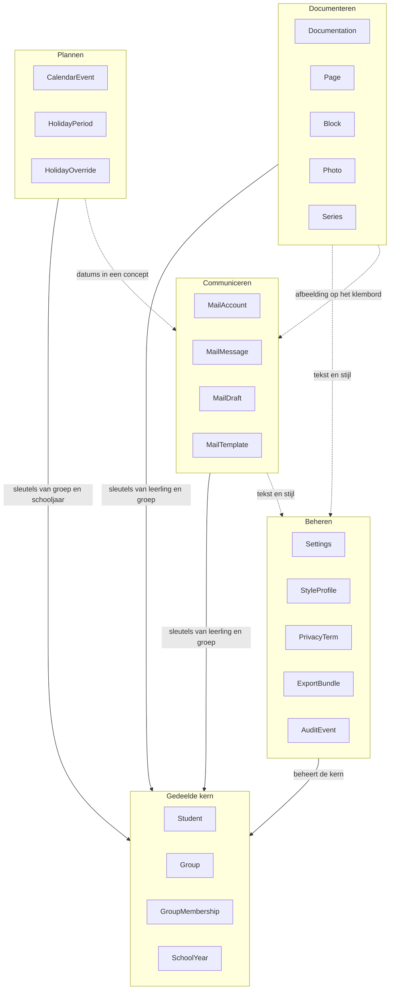
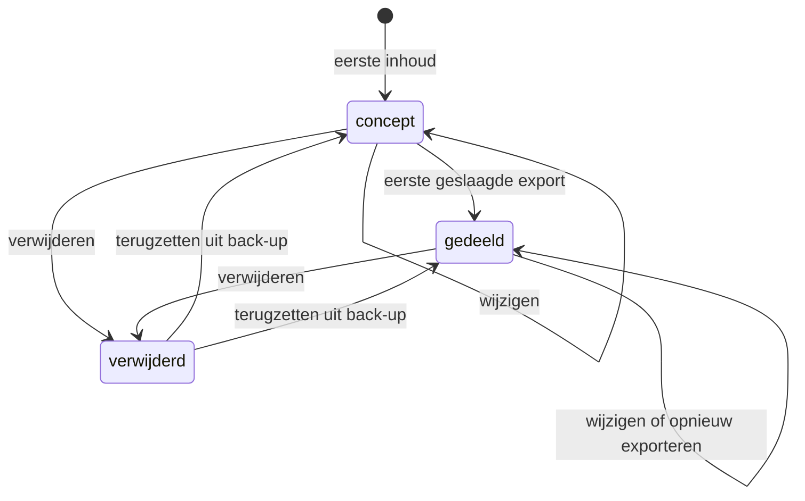
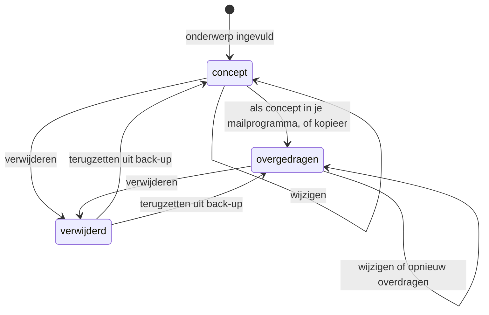
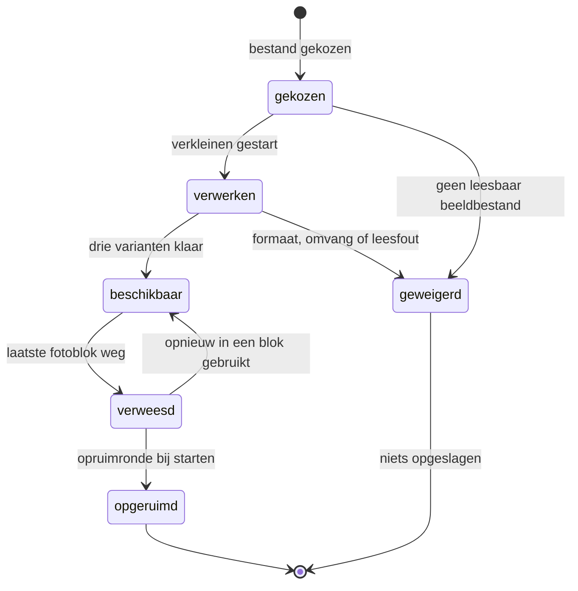
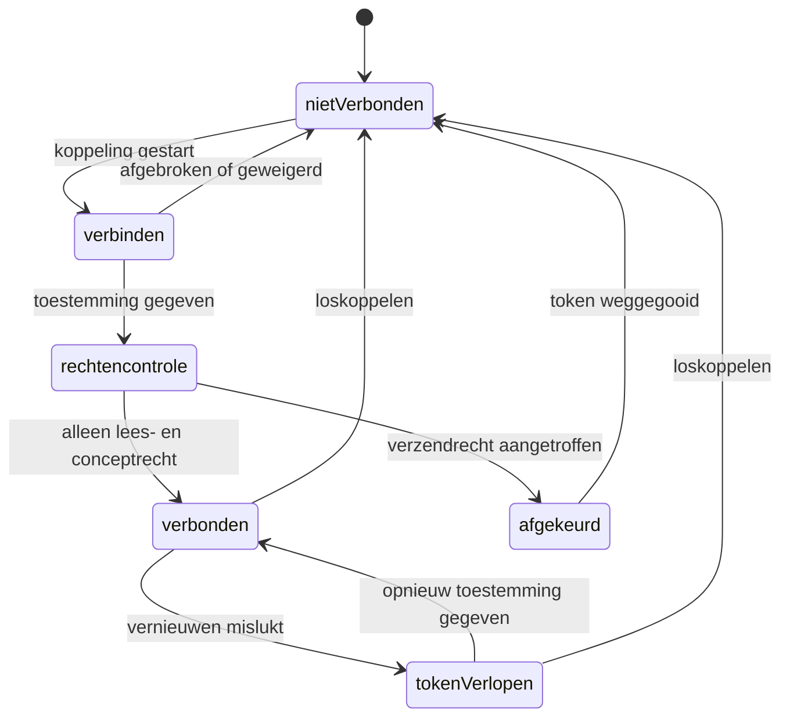
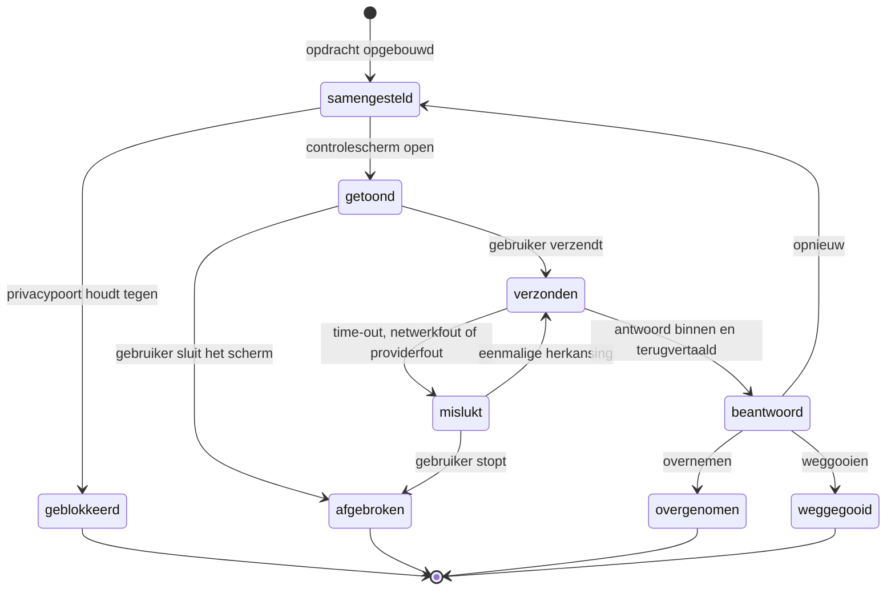

<!-- Onderdeel van de EduFlow Product Bible v1.0 (7 augustus 2026).
     Bindend. Volledig document: docs/product-bible-volledig.md
     Wijzigingen lopen via docs/19-besluitenregister.md -->

## 9. Domeinmodel

### 9.1 Waarom een domeinmodel naast een datamodel

Hoofdstuk 8 beschrijft waar een gegeven staat: in welke tabel, onder welke sleutel, met welke index, in welk formaat. Dit hoofdstuk beschrijft wat dat gegeven betekent: welk begrip uit het werk van een leerkracht het weergeeft, welke regels er altijd voor gelden, welke gebeurtenissen het kan ondergaan en welke toestanden het kan aannemen. Die twee lagen zijn niet twee beschrijvingen van hetzelfde. Ze veranderen op verschillende momenten, om verschillende redenen, en met verschillende gevolgen.

De regel die die scheiding bewaakt luidt: **het datamodel mag veranderen zonder dat het domein verandert.** Je mag een tabel splitsen omdat hij te groot wordt. Je mag een index toevoegen omdat een lijst te traag is. Je mag `blocks` uit `pages` halen en er een eigen tabel van maken, of ze juist samenvoegen. Je mag een veld hernoemen, een blob anders comprimeren, een `PhotoVariant` bijmaken. Geen van die wijzigingen raakt dit hoofdstuk. Wat er in dit hoofdstuk staat, verandert alleen door een productbesluit, en dat besluit staat dan in hoofdstuk 19 met een datum en een reden.

Andersom geldt de omkering net zo hard: **het domein verandert nooit stilzwijgend door een technische ingreep.** Voeg je bij het opschonen van een tabel een veld `groupId` toe aan `Student` omdat dat een join scheelt, dan heb je geen index toegevoegd maar het domein veranderd. Op dat moment heeft een leerling weer één groep, gaat U-07 onderuit, en klopt de helft van dit hoofdstuk niet meer. Dat is geen prestatie-optimalisatie. Dat is een besluit dat niemand genomen heeft.

Dit onderscheid is de praktische bescherming van twee uitgangspunten uit hoofdstuk 2.

**U-02, één bron van waarheid.** Een gegeven dat afgeleid is, hoort niet opgeslagen te worden. Maar of iets afgeleid is, kun je in het datamodel niet zien: een kolom `status` en een kolom `title` zien er in Dexie identiek uit. Alleen het domein weet dat `title` een gegeven is dat de gebruiker invoert en dat `status` een gevolg is van iets anders, namelijk of er ooit een geslaagde export is geweest (B-13). Zonder deze laag ontstaat de fout vanzelf: iemand schrijft `documentation.status = 'gedeeld'` bij het exporteren, iemand anders vergeet dat bij het importeren van een back-up, en er ontstaan twee waarheden over hetzelfde. Paragraaf 9.8 somt op wat berekend wordt en dus nergens opgeslagen staat.

**U-03, geen dubbele businesslogica.** Een regel als "een lidmaatschap mag niet eindigen voordat het begint" moet op precies één plek staan. Zonder domeinlaag staat hij op drie plekken: in het scherm dat de datumkiezer begrenst, in de service die opslaat, en nog een keer in de importroutine van de back-up, waar iemand hem net iets anders formuleert. Paragraaf 9.5 nummert die regels en wijst per regel één plek aan waar hij wordt afgedwongen. Alle andere plekken mogen hem tonen, uitleggen en er een nettere foutmelding van maken, maar mogen hem niet opnieuw bedenken.

Er is een eenvoudige toets om te controleren of de scheiding nog klopt. Neem een geplande technische wijziging en vraag: moet ik hiervoor iets in hoofdstuk 9 aanpassen? Is het antwoord nee, dan is het een datamodelwijziging en hoef je alleen hoofdstuk 8 en de migratie bij te werken. Is het antwoord ja, dan is het geen technische wijziging maar een productwijziging, en dan begint hij met een besluit. Die toets hoort bij elke pull request met een migratie erin.

Het verschil in code ziet er zo uit. Links de opslagvorm, rechts wat het domein erover zegt.

```typescript
// Opslag (hoofdstuk 8): plat, indexeerbaar, één rij per record.
type StoredMembership = {
  id: string;            // UUIDv7
  studentId: string;
  groupId: string;
  from: string;          // ISO-datum
  until: string | null;
  createdAt: string; updatedAt: string; deletedAt: string | null;
  rev: number; origin: string; schemaVersion: number;
};

// Domein (dit hoofdstuk): een lidmaatschap is een looptijd, geen koppelrij.
// De regels INV-22 t/m INV-25 gelden hier, niet in de tabel.
type GroupMembership = {
  id: MembershipId;
  student: StudentId;
  group: GroupId;
  period: ClosedOpenPeriod;   // begin verplicht, einde optioneel, einde >= begin
};
```

De opslagvorm mag morgen anders zijn. `ClosedOpenPeriod` blijft.

### 9.2 De begrippenkaart

Twintig begrippen dragen het hele product. Ze staan hier in de taal waarin een leerkracht erover praat, niet in de taal waarin ze opgeslagen worden. Bij elk begrip staat waar het vandaan komt in het werk, en waarmee het in gesprekken en in code stelselmatig verward wordt. Die tweede regel is geen aardigheidje: bijna elke fout in een datamodel begint met twee begrippen die op elkaar lijken en die iemand op één hoop heeft gegooid.

**Documentatie** — `Documentation`

Een documentatie is het verhaal van één moment of één activiteit, vastgelegd zodat iemand anders het kan lezen: een ouder, een collega, de intern begeleider, of jijzelf over een half jaar. Hij heeft een datum, meestal een titel, tekst, foto's en soms citaten van kinderen. Hij hoort bij nul of meer leerlingen en bij nul of meer groepen. Hij is af als jij hem af vindt, en dat blijkt uit het feit dat je hem hebt geëxporteerd, niet uit een knop die je aanvinkt.

*Herkomst.* Het is de digitale versie van wat er nu op een A4 of in een appgroep terechtkomt: zes foto's van de donderdagmiddag met drie regels eronder.

*Verwarring.* Een documentatie is geen rapport en geen verslag over een kind. Hij beschrijft wat er gebeurde, niet hoe goed het ging. En hij is geen bestand: de PDF en de afbeelding zijn uitvoer van een documentatie, geen documentatie.

**Pagina** — `Page`

Een pagina is één vel dat je uiteindelijk in handen hebt of op het scherm ziet: A4 liggend, 297 bij 210 millimeter, met tien millimeter marge. Elke pagina heeft een eigen layout uit een vaste lijst en een eigen volgnummer binnen de documentatie. Past de inhoud niet, dan komt er een pagina bij en wordt de titel bovenaan herhaald.

*Herkomst.* Uit het feit dat het eindresultaat papier of een afbeelding is. Wie een documentatie maakt, denkt in bladen, niet in scrollhoogte.

*Verwarring.* Een pagina is geen opmaakgevolg dat pas bij het exporteren ontstaat. Hij is een eigen record met een eigen bestaan (U-06, B-15). Een pagina is ook geen scherm: het schrijfscherm toont meerdere pagina's onder elkaar.

**Blok** — `Block`

Een blok is één stukje inhoud dat als geheel ergens op een pagina staat: een stuk tekst, een foto, een citaat of een kop. Blokken staan in een volgorde en worden door de layout aan genummerde sloten toegewezen. Er zijn vier soorten: `TextBlock`, `PhotoBlock`, `QuoteBlock` en `HeadingBlock`. Meer soorten komen er in versie 1.0 niet.

*Herkomst.* Uit de manier waarop je een blad vult: eerst een kop, dan de foto's, dan wat tekst, dan die ene zin die een kind zei.

*Verwarring.* Een blok is geen alinea. Eén tekstblok kan meerdere alinea's bevatten. Een blok is ook geen slot: het slot is de plek op de pagina, het blok is wat erin staat.

**Foto** — `Photo`

Een foto is één afbeelding die je hebt toegevoegd, met alles wat de app ervan afleidt. Van elke foto bestaan drie varianten (`PhotoVariant`): een miniatuur van 480 pixels voor lijstjes, een schermversie van 1280 pixels voor het schrijfscherm en een drukversie van 3300 pixels voor de PDF. De foto blijft op het apparaat. Altijd.

*Herkomst.* Uit je telefoon, direct na de activiteit. Zes tot tien stuks per middag is normaal.

*Verwarring.* Een foto is geen fotoblok. Dezelfde foto kan in meerdere documentaties in een blok staan; verwijder je het blok, dan is de foto niet weg. En een foto is geen bijlage: hij hoort bij de documentatie, niet erbij.

**Citaat** — `QuoteBlock`

Een citaat is iets wat een kind letterlijk gezegd heeft, opgeschreven omdat de woorden zelf de observatie zijn. Het krijgt in elke layout een eigen plek en een eigen opmaak. Een citaat kan aan één leerling gekoppeld zijn, maar hoeft dat niet: soms weet je wel wat er gezegd is en doet het er niet toe wie het zei.

*Herkomst.* Uit het gesprek zelf. "Kijk, de brug houdt", zei Kjeld, en dat is de hele observatie.

*Verwarring.* Een citaat is geen tekstblok met aanhalingstekens; het is een eigen bloksoort met een eigen verwijzing (B-37). En het is geen uitspraak van jou: wat jij vaststelt hoort in de tekst, niet tussen aanhalingstekens.

**Reeks** — `Series`

Een reeks is een verzameling documentaties die bij elkaar horen omdat ze over hetzelfde project of thema gaan: "Kunstwerk Dok", "ONDERZOEK Natuur", "Start van het jaar". Een documentatie hoort bij hoogstens één reeks. De reeks is de reden dat de app bij de vierde documentatie weet wat er in de eerste drie stond, en dat is de enige functie in EduFlow die een losse chatbot niet kan nadoen (B-04).

*Herkomst.* Uit hoe een project loopt: zes weken, acht momenten, één verhaal.

*Verwarring.* Een reeks is geen map en geen tag. Hij is ook geen voorvoegsel in de titel: de titel blijft de titel, de reeks is een verwijzing (B-35). En hij is geen groep: een reeks kan over meerdere groepen lopen.

**Leerling** — `Student`

Een leerling is één kind waarover je documenteert, in de app aanwezig als een naam en verder vrijwel niets. De app slaat geen geboortedatum op, geen adres, geen leerlingnummer, geen dossier. De naam is er om twee redenen: om documentaties terug te vinden, en om te weten welk woord vervangen moet worden voordat er tekst naar een AI-provider gaat. In de kinderopvang heet dit begrip **Kind**; dat is één instelling die alle schermteksten omzet.

*Herkomst.* Uit de groepslijst die aan het begin van het jaar op je bureau ligt.

*Verwarring.* Een leerling heeft geen groep. Hij heeft lidmaatschappen (U-07, B-16). En een leerling is geen dossier: alles wat op een leerlingvolgsysteem lijkt, hoort hier niet.

**Groep** — `Group`

Een groep is een verzameling leerlingen die in een bepaalde periode bij elkaar horen. Een groep hoort bij precies één schooljaar en heeft een type: `stamgroep`, `combinatiegroep`, `projectgroep`, `zorggroep`, `instroomgroep` of `overig`. Groep 4 – De Regenboog is een stamgroep in 2026-2027. De vier kinderen die op dinsdag met de plusgroep meedoen vormen een projectgroep in datzelfde jaar.

*Herkomst.* Uit de schoolorganisatie, maar ook uit de werkelijkheid ernaast: leerkrachten werken de hele dag met verzamelingen kinderen die niet in het schoolschema staan.

*Verwarring.* Een groep is geen klas in de zin van een vast hokje waar een kind in zit. Een kind zit in meerdere groepen tegelijk. En een groep is niet hetzelfde in twee schooljaren: Groep 4 – De Regenboog van 2026-2027 en die van 2027-2028 zijn twee groepen.

**Groepslidmaatschap** — `GroupMembership`

Een lidmaatschap is het feit dat één leerling in één periode bij één groep hoort. Het heeft een begindatum en een optionele einddatum. Zolang de einddatum leeg is, loopt het lidmaatschap door. Bij een jaarovergang wordt een lidmaatschap afgesloten met een einddatum, nooit verwijderd, zodat een documentatie van vorig jaar over de goede groep blijft gaan.

*Herkomst.* Uit instroom en doorstroom. Kinderen komen in november binnen, gaan in maart naar een andere groep, doen zes weken mee met een project.

*Verwarring.* Een lidmaatschap is geen koppeltabel die je in gedachten mag wegdenken. Het draagt de looptijd, en die looptijd is de reden dat de app kan zeggen in welke groep een kind zat op de datum van een documentatie.

**Schooljaar** — `SchoolYear`

Een schooljaar is de periode waarin groepen bestaan, vakanties vallen en de agenda loopt: van eind augustus tot de zomervakantie erna. Het heeft een naam ("2026-2027"), een begindatum, een einddatum en een regio, want de vakanties verschillen per regio. Het schooljaar is de eenheid waarin een leerkracht denkt over alles wat langer duurt dan een week.

*Herkomst.* Uit de jaarplanning die in juni op tafel komt.

*Verwarring.* Een schooljaar is geen kalenderjaar en geen periode die je zelf mag verzinnen. En het is geen filter: het is het kader waar groepen en vakanties aan hangen.

**Vakantie** — `HolidayPeriod`, `HolidayOverride`

Een vakantie is een aaneengesloten periode zonder les. Kerstvakantie en zomervakantie liggen landelijk vast en zijn niet te wijzigen. Herfst-, voorjaars- en meivakantie zijn adviesdata: elke school mag afwijken, en die afwijking leg je vast als een aanpassing (`HolidayOverride`) naast de oorspronkelijke periode, niet eroverheen (B-29). Zo overleeft je eigen aanpassing een update van het vakantiebestand.

*Herkomst.* Uit het overzicht van de rijksoverheid en het besluit van je eigen bestuur, die niet altijd gelijk zijn.

*Verwarring.* Een vakantie is geen agenda-item. Je maakt hem niet zelf aan en je verwijdert hem niet. Een studiedag is dat wél: dat is een agenda-item.

**Agenda-item** — `CalendarEvent`

Een agenda-item is één ding dat op een dag of in een periode gebeurt en dat jij hebt ingevoerd of geïmporteerd: een studiedag, een margedag, een ouderavond, een uitje, een vergadering, een verjaardag. Het heeft een begin en een einde en kan een hele dag beslaan. Het kan aan een groep hangen. Het is te importeren en te exporteren als ICS (B-30).

*Herkomst.* Uit de jaarplanning, de weekbrief en de zes mails waarin een datum staat.

*Verwarring.* Een agenda-item is geen vakantie en geen les. EduFlow kent geen rooster en geen lesuren.

**Mailbericht** — `MailMessage`

Een mailbericht is een bericht dat in jouw postbus staat en dat EduFlow heeft gelezen om je te helpen: de mail van een ouder, de mail van de directie. EduFlow leest, hij verstuurt niet. Een bericht wordt alleen gecachet als je het opent, en die cache vervalt na zeven dagen. Voordat er iets van dat bericht naar een AI-provider gaat, is het door de privacypoort geweest, inclusief afzender en handtekening.

*Herkomst.* Uit Outlook of Gmail, via het account van je eigen werkgever.

*Verwarring.* Een mailbericht is geen mailconcept. Het is inkomend, je bewerkt het niet, en het is niet van jou.

**Mailconcept** — `MailDraft`

Een mailconcept is het antwoord dat jij aan het schrijven bent, met of zonder hulp van AI. Het heeft altijd een onderwerp (B-36) en een tekst, en het eindigt op één van twee manieren: als concept in je eigen mailprogramma, of gekopieerd naar het klembord. Er is geen verzendknop, en er zal er ook geen komen, want de app vraagt bij Microsoft en Google geen verzendrecht aan (B-19, B-20).

*Herkomst.* Uit de vijftien minuten die je op donderdagavond aan drie mails kwijt bent.

*Verwarring.* Een mailconcept is geen verstuurde mail en het is geen concept in je postbus totdat jij het daar hebt neergezet. Tot dat moment staat het alleen in EduFlow.

**Sjabloon** — `MailTemplate`

Een sjabloon is een kant-en-klaar startpunt voor een mailconcept: een onderwerp, een tekstskelet met open plekken, en de toon die erbij hoort. "Uitnodiging ouderavond", "Terugkoppeling na een incident op het plein", "Bevestiging van een afspraak". Je kiest hem zelf; de app kiest nooit voor je (B-11).

*Herkomst.* Uit het feit dat dezelfde mail vier keer per jaar de deur uit gaat met andere data erin.

*Verwarring.* Een sjabloon is geen opdracht aan de AI en geen layout. De layouts van documentaties zijn iets anders en heten anders.

**Stijlprofiel** — `StyleProfile`

Het stijlprofiel is wat de app over jouw schrijfstijl heeft afgeleid uit teksten die je hebt overgenomen of zelf geschreven: gemiddelde zinslengte, alinealengte, aanspreekvorm, werkwoordstijd, de verhouding tussen beschrijven en interpreteren, hoe vaak je citaten gebruikt, je vaktaalniveau, je veelgebruikte en vermeden woorden. Het is één leesbaar geheel dat je in Instellingen kunt bekijken, wijzigen en wissen (B-23).

*Herkomst.* Uit het feit dat generieke AI-tekst er altijd net naast zit, en dat je die dus altijd moet bijschaven.

*Verwarring.* Een stijlprofiel is geen getraind model. Er wordt niets getraind en niets bijgesteld bij de provider (B-22). Het profiel is invoer bij een aanroep, net als je eigen tekst.

**Stijlvoorbeeld** — `StyleExample`

Een stijlvoorbeeld is één paar: een ruwe notitie zoals jij die maakt, en de documentatie zoals die eruit hoort te zien. Bij een AI-aanroep gaan de meest gelijkende voorbeelden mee, zodat het antwoord op jouw werk lijkt en niet op het gemiddelde van het internet. Voorbeelden gaan door dezelfde privacypoort als al het andere, want er staan namen in van kinderen die niet meer in je groep zitten.

*Herkomst.* Uit documentaties die je al gemaakt hebt en goed vond.

*Verwarring.* Een stijlvoorbeeld is geen sjabloon. Een sjabloon vult in, een voorbeeld laat zien. En het is geen instelling die je één keer invult: de verzameling groeit mee.

**Pseudoniem** — `PseudonymMap`, `PrivacyTerm`

Een pseudoniem is de code die in de plaats komt van een naam of een ander persoonsgegeven zodra tekst het apparaat verlaat: `[LEERLING-1]`, `[OUDER-1]`, `[COLLEGA-1]`, `[SCHOOL]`, `[E-MAIL-1]`, `[TELEFOON-1]`, `[ADRES-1]`, `[IBAN-1]`, `[BSN-1]`. De koppeling tussen code en naam heet de pseudoniemkaart en blijft op het apparaat. In het antwoord worden de codes teruggezet naar namen voordat je iets te zien krijgt.

*Herkomst.* Uit de eis dat er geen kindernamen naar een externe partij gaan, en uit het besef dat een namenlijst nooit compleet is.

*Verwarring.* Pseudonimiseren is geen anonimiseren. Voor wie de kaart heeft, blijft `[LEERLING-1]` een persoonsgegeven (zie hoofdstuk 15). De namenlijst is een vangnet, geen garantie.

**Back-up** — `ExportBundle`

Een back-up is één bestand met alles erin: documentaties, pagina's, blokken, foto's, leerlingen, groepen, lidmaatschappen, agenda, mailconcepten, sjablonen, stijlprofiel, voorbeelden en instellingen. Het is tegelijk je vangnet, je verhuisdoos naar een ander apparaat en je uitweg als je ooit met EduFlow stopt. Terugzetten is een aparte handeling en overschrijft nooit stilzwijgend wat er al staat.

*Herkomst.* Uit twee harde beperkingen: opslag zit per apparaat vast (B-01), en Safari wist opslag na zeven dagen zonder gebruik (B-02).

*Verwarring.* Een back-up is geen export van een documentatie. De PDF en de deelbare afbeelding zijn leesbaar voor mensen en niet terug te zetten; de back-up is terug te zetten en niet bedoeld om te lezen.

**Toegangscode** — geen entiteit

De toegangscode is de sleutel waarmee een apparaat de AI- en mailroutes van de eigen server mag gebruiken. Je voert hem één keer per apparaat in en daarna niet meer. Hij is geen account: er is geen gebruikersnaam, geen wachtwoordherstel en geen profiel achter (B-21). Hij bepaalt ook het dagbudget en de snelheidslimiet, per code en per IP-adres.

*Herkomst.* Uit het feit dat een open AI-route op een eigen webadres binnen een week een gratis AI-dienst op andermans rekening is.

*Verwarring.* Een toegangscode is geen wachtwoord en geen licentie, en hij beschermt de gegevens op het apparaat niet: wie het apparaat heeft, heeft de gegevens. Hij beschermt de serverroute.

### 9.3 Begrensde gebieden

Het domein valt uiteen in vier gebieden met een duidelijke grens en een gedeelde kern. Een gebied is niet hetzelfde als een module: `DOC`, `AGE`, `MAI`, `DAS` en `INS` zijn schermgroepen, de gebieden hieronder zijn taalgebieden. Het dashboard heeft geen eigen gebied omdat het niets eigens bezit; het toont uit alle vier.

De grens betekent twee dingen. Ten eerste: binnen een gebied heeft elk woord één betekenis, en die betekenis geldt daar. Ten tweede: een gebied kent de aggregaatwortels van een ander gebied hoogstens bij naam en sleutel, nooit van binnen. `MailService` mag weten dat er een documentatie met een bepaalde sleutel bestaat. Hij mag de pagina's daarvan niet lezen, niet renderen en niet wijzigen.



#### 9.3.1 Documenteren

Entiteiten: `Documentation`, `Page`, `Block` met zijn vier varianten, `Photo`, `PhotoVariant`, `Series`.

De taal die hier geldt is de taal van het blad. Een documentatie *bestaat uit* pagina's, een pagina *heeft* een layout, een layout *heeft* sloten, een blok *staat in* een slot, inhoud die niet past *loopt door*. Het woord "opslaan" komt in dit gebied nauwelijks voor omdat alles vanzelf wordt bewaard; het woord "exporteren" is hier het belangrijkste werkwoord, want daarmee verlaat het werk de app.

Over de grens gaat: sleutels van leerlingen en groepen naar binnen, een geëxporteerd bestand naar buiten, en tekst plus stijlprofiel naar de AI-route via de privacypoort. Naar binnen komt niets uit Plannen of Communiceren. Een documentatie weet niet dat er een ouderavond is.

#### 9.3.2 Plannen

Entiteiten: `CalendarEvent`, `HolidayPeriod`, `HolidayOverride`, plus `SchoolYear` uit de kern.

De taal is die van de kalender: een dag, een week, een jaar, een periode, een hele dag, een vakantie die vastligt of een advies is. Hier bestaat geen concept van "af" en geen concept van "gedeeld". Een agenda-item is er of is er niet.

Over de grens gaat: ICS-bestanden in beide richtingen, en datums die je in een mailconcept overneemt. Er gaat vanuit Plannen nooit iets naar de AI-route; de agenda is de enige module die volledig zonder netwerk werkt.

#### 9.3.3 Communiceren

Entiteiten: `MailAccount`, `MailMessage`, `MailDraft`, `MailTemplate`.

De taal is die van de postbus: lezen, samenvatten, opstellen, overdragen, kopiëren. Twee woorden zijn hier verboden omdat de handeling niet bestaat: **versturen** en **verzenden**. Wat de app doet heet *overdragen*, en de eindhandeling heet "Als concept in je mailprogramma" of "Kopieer".

Over de grens gaat: een deelbare afbeelding uit Documenteren die je in een concept plakt, datums uit Plannen, en tekst naar de AI-route via de privacypoort. Wat er nadrukkelijk niet over de grens gaat, is de inhoud van een documentatie: wil je die in een mail, dan plak je de afbeelding, niet de tekst.

#### 9.3.4 Beheren

Entiteiten: `Settings`, `User`, `StyleProfile`, `StyleExample`, `PrivacyTerm`, `Feedback`, `AIRequest`, `AIInteraction`, `ExportBundle`, `AuditEvent`, `ChangeLogEntry`.

De taal is die van het gereedschap: instellen, aanzetten, bekijken, wissen, terugzetten, bewijzen. Dit is het enige gebied waar de gebruiker naar de app zelf kijkt in plaats van naar zijn werk. Het is ook het gebied dat Karin en Maarten gebruiken: het logboek moet aantoonbaar maken wat er de deur uit ging.

Over de grens gaat vrijwel alles, maar in één richting: Beheren levert instellingen, stijl en privacyregels aan de andere drie gebieden en ontvangt van hen gebeurtenissen om te loggen. Beheren wijzigt nooit inhoud in een ander gebied. De enige uitzondering is terugzetten uit een back-up, en dat is een expliciete handeling met een eigen bevestigingsscherm.

#### 9.3.5 De gedeelde kern

`Student`, `Group`, `GroupMembership` en `SchoolYear` horen bij geen van de vier gebieden en dat is opzettelijk. Ze horen bij alle vier tegelijk, met dezelfde betekenis. Een documentatie hangt aan leerlingen, een mailconcept gaat over een leerling, een agenda-item hangt aan een groep, en het schooljaar begrenst zowel de groepen als de vakanties.

Zou je de kern in één gebied leggen, dan gebeurt er onvermijdelijk één van twee dingen. Of het begrip krijgt daar eigenschappen die alleen dat gebied nodig heeft en die de andere gebieden vervolgens moeten negeren, en dan bestaat er in de praktijk toch een tweede definitie. Of de andere gebieden bouwen hun eigen kopietje, en dan is U-02 weg.

De regel voor de kern is streng en kort: **de kern heeft geen kennis van de vier gebieden.** `StudentService` en `GroupService` weten niet dat er documentaties bestaan. Verwijder je een leerling, dan vraagt de kern niet aan Documenteren of dat mag; Documenteren bewaakt zijn eigen verwijzingen (INV-13). De kern kent alleen zichzelf, en dat is precies waarom hij door alle vier gedeeld kan worden.

### 9.4 Aggregaten en hun grenzen

Een aggregaat is een groepje entiteiten dat je alleen als geheel mag wijzigen, met één entiteit als wortel waarlangs alle wijzigingen lopen. De grens van een aggregaat is de grens van een consistente toestand: binnen de grens gelden de invarianten uit paragraaf 9.5 op elk moment, buiten de grens gelden ze uiteindelijk.

Drie regels gelden voor elk aggregaat in EduFlow.

**Regel A — je slaat een aggregaat in één keer op.** Eén transactie, alle betrokken tabellen tegelijk, één ophoging van `rev` op de wortel, één `ChangeLogEntry`. Een pagina toevoegen en de documentatie bijwerken zijn niet twee schrijfacties die toevallig na elkaar komen; het is één schrijfactie. Mislukt hij, dan is er niets veranderd. Dit is de reden dat er geen enkele service is die rechtstreeks in `pages` of `blocks` schrijft: dat doet `DocumentationService`, via `PageService` binnen dezelfde transactie.

**Regel B — buiten de grens verwijs je met een sleutel, nooit met een object.** Een `PhotoBlock` bevat een `photoId`, geen `Photo`. Een `Documentation` bevat een lijst van `studentId`s, geen leerlingen. Dat maakt het onmogelijk om per ongeluk twee aggregaten in één transactie te wijzigen, en het houdt de aggregaten klein genoeg om in één keer te laden.

**Regel C — één aggregaat per gebruikershandeling.** Wijzigt een handeling twee aggregaten, dan is er precies één de hoofdzaak en volgt de tweede via een gebeurtenis (paragraaf 9.6). "Foto toevoegen" wijzigt het `Photo`-aggregaat en daarna, op `PhotoAdded`, het `Documentation`-aggregaat. Niet andersom en niet allebei tegelijk.

| Aggregaat (wortel) | Binnen de grens | Verwijzingen naar buiten | Bijzonderheid |
|---|---|---|---|
| `Documentation` | `Page`, `Block` en alle varianten, exportregistraties, `PseudonymMap` | `photoId`, `studentId`, `groupId`, `seriesId` | Het grootste aggregaat; laadt volledig in het schrijfscherm |
| `Photo` | `PhotoVariant` (drie stuks) | geen | Kent zijn gebruikers niet; wordt gevonden, niet gezocht |
| `Group` | `GroupMembership` | `studentId`, `schoolYearId` | Lidmaatschap hoort bij de groep, niet bij de leerling |
| `Student` | geen | geen | Bewust leeg: een naam en niets meer |
| `Series` | geen | geen | Documentaties verwijzen naar de reeks, niet omgekeerd |
| `SchoolYear` | `HolidayPeriod`, `HolidayOverride` | geen | Regio en versie van het vakantiebestand horen erbij |
| `CalendarEvent` | geen | `groupId` (optioneel) | Het schooljaar volgt uit de datum, zie §9.8 |
| `MailAccount` | gecachete `MailMessage`s | geen | Loskoppelen wist de cache in dezelfde transactie |
| `MailDraft` | `PseudonymMap`, overdrachtsregistraties | `mailMessageId`, `mailTemplateId`, `studentId` | Staat op zichzelf; overleeft het loskoppelen van het account |
| `MailTemplate` | geen | geen | Alleen door de gebruiker gemaakt en gewijzigd |
| `StyleProfile` | `StyleExample` | `documentationId` per voorbeeld | Precies één record; volledig leesbaar en wisbaar |
| `AIInteraction` | `AIRequest`, het antwoord, de afhandeling | `documentationId` of `mailDraftId` | Alleen-toevoegen na afronding |
| `Feedback` | geen | `aiInteractionId` | Los aggregaat omdat terugkoppeling later kan komen |
| `PrivacyTerm` | geen | geen | De eigen woordenlijst naast de leerlingennamen |
| `Settings` | geen | geen | Precies één record, altijd aanwezig |
| `User` | geen | geen | Precies één record; naam, rol, school, standaardtoon |
| `ExportBundle` | de volledige inhoud van alle andere aggregaten | geen | Bestaat alleen als bestand, niet in de opslag |
| `AuditEvent` | geen | vrije verwijzing als tekst | Alleen-toevoegen, nooit wijzigen, nooit verwijderen |
| `ChangeLogEntry` | geen | wortelsleutel van het gewijzigde aggregaat | Alleen-toevoegen; voedt `SyncService` in fase 2 |

#### 9.4.1 Documentation met zijn pagina's en blokken

De wortel is `Documentation`. Binnen de grens vallen alle `Page`s met hun volgnummers en layouts, alle `Block`s met hun sloten en volgorde, de registratie van geslaagde exports, en de pseudoniemkaart die bij deze documentatie hoort.

Dit is één aggregaat omdat de belangrijkste regels van het product over de combinatie gaan en niet over de delen. Of er een vervolgpagina nodig is, hangt af van hoeveel blokken er zijn en welke layout de pagina heeft. Of de titel herhaald moet worden, hangt af van het volgnummer. Of de status `gedeeld` is, hangt af van de exportregistraties. Geen van die vragen is te beantwoorden met alleen een pagina in de hand.

Naar buiten gaan vier soorten verwijzingen: `photoId` per fotoblok, `studentId` per gekoppelde leerling en per citaat, `groupId` per expliciet gekoppelde groep, en hoogstens één `seriesId`. Alle vier zijn sleutels. Het schrijfscherm laadt de bijbehorende namen en miniaturen erbij, maar het aggregaat bezit ze niet.

#### 9.4.2 Photo staat buiten de documentatie

`Photo` is een eigen aggregaat met zijn drie `PhotoVariant`s erin. Hij staat bewust buiten `Documentation`, om drie redenen. Een foto kan in meer dan één documentatie voorkomen. Een foto is groot: de drukversie alleen al is enkele megabytes, en die wil je niet laden als je een titel wijzigt. En een foto heeft een eigen levensloop die niet gelijkloopt met die van een documentatie: hij wordt gekozen, verwerkt, geweigerd of opgeruimd (zie §9.7.3).

De prijs daarvan is dat de verwijzing tijdelijk kan wijzen naar iets wat er niet meer is. Dat is aanvaard en afgevangen: een fotoblok waarvan de foto ontbreekt toont een lege plek met een melding, en de opruimronde bij het opstarten repareert de administratie (INV-13, INV-17).

#### 9.4.3 Group met zijn lidmaatschappen

De wortel is `Group`, en `GroupMembership` valt binnen die grens. Dat is een keuze met gevolgen, want je zou het lidmaatschap net zo goed bij de leerling kunnen leggen. Het ligt bij de groep omdat de regels die je moet bewaken over de groep gaan: overlappende periodes binnen dezelfde groep, het afsluiten van alle lidmaatschappen bij een jaarovergang, en het aantal leerlingen op een peildatum. `Student` blijft daardoor leeg, en dat is de beste bescherming tegen de terugkeer van `groupId` op een leerling.

Naar buiten gaan twee verwijzingen: `studentId` per lidmaatschap en `schoolYearId` op de groep zelf.

#### 9.4.4 MailDraft staat alleen

Een mailconcept is zijn eigen aggregaat en bevat niets anders dan zichzelf: onderwerp, tekst, ontvangergegevens zoals jij ze hebt ingevuld, de pseudoniemkaart van dit concept en de registratie van overdrachten. Het verwijst naar het bericht waarop je antwoordt, naar een eventueel sjabloon en naar leerlingen waar het over gaat, alle drie met een sleutel.

Het staat alleen omdat het de enige entiteit in Communiceren is die volledig van jou is. Berichten zijn van de postbus en verdwijnen als de cache vervalt of als je het account loskoppelt; het concept blijft. Koppel je je postbus los, dan houd je je concepten. Dat is geen bijkomstigheid maar de kern van B-19: wat je schrijft is van jou, waar je het heen stuurt is jouw handeling.

### 9.5 Invarianten

Een invariant is een uitspraak die op elk moment waar is over een aggregaat in rust. Niet "meestal", niet "als de gebruiker het goed doet", maar altijd. Elke invariant hieronder heeft één plek waar hij wordt afgedwongen. Dat is de enige plek waar de regel als regel is opgeschreven; alle andere plekken tonen hem hooguit.

De vier soorten handhaving in de kolom *Afgedwongen in* betekenen het volgende. **Type** betekent dat het TypeScript-type de fout onmogelijk maakt en dat er dus geen controle nodig is. **Zod** betekent dat het schema de fout tegenhoudt bij lezen en schrijven, aan elke grens. **Service** betekent dat de regel in de servicelaag zit en dat de schrijfactie faalt. **Scherm** betekent dat het scherm de handeling niet aanbiedt; die vorm komt alleen voor als aanvulling op een van de andere drie, nooit als enige waarborg.

#### 9.5.1 Algemene invarianten

| ID | Regel | Waarom | Afgedwongen in | Bij schending |
|---|---|---|---|---|
| INV-01 | Elk record heeft een sleutel die een UUIDv7 is en die nergens anders voorkomt. | Sleutels moeten op twee apparaten los van elkaar kunnen ontstaan zonder te botsen (B-24). | Zod, `StorageService` | Schrijven faalt; het record wordt geweigerd en gelogd. |
| INV-02 | Verwijderen zet `deletedAt` en wist niets. Een record met `deletedAt` komt in geen enkele lijst voor. | Zonder dit kan een verwijdering in fase 2 niet gesynchroniseerd worden, en is terugzetten na een misklik onmogelijk. | `StorageService` | Fysiek wissen is niet aan te roepen: de service kent geen `delete`. |
| INV-03 | `rev` neemt bij elke wijziging van een aggregaat met precies één toe, op de wortel. | Het is de enige manier om te zien of twee kopieën van hetzelfde record uit elkaar lopen. | `StorageService` | Een schrijfactie met een lagere of gelijke `rev` wordt geweigerd. |
| INV-04 | `createdAt` ligt nooit na `updatedAt`, en beide liggen niet in de toekomst. | Sorteren op tijd is de basis van elke lijst in de app. | Zod | Het record wordt bij het lezen afgekeurd en apart gezet. |
| INV-05 | Geen enkel persoonsgegeven staat in `localStorage`. | `localStorage` is leesbaar voor elk script en overleeft geen enkele privacytoets (T-01). | `SettingsService`, controle in de test | De schrijfactie is er niet; een test faalt bij elke poging een nieuw veld toe te voegen. |
| INV-06 | Elk record draagt de `schemaVersion` waarmee het geschreven is. | Zonder versienummer is een back-up van vorig jaar niet terug te zetten. | Zod | Een record zonder versienummer wordt behandeld als versie 1 en gemigreerd. |

#### 9.5.2 Documentatie, pagina en blok

| ID | Regel | Waarom | Afgedwongen in | Bij schending |
|---|---|---|---|---|
| INV-07 | Een documentatie bestaat pas zodra er inhoud is: tekst, een foto, een titel of een koppeling. | Leeg openen en weggaan mag niets achterlaten (B-34). | `DocumentationService` | Er wordt niets geschreven; het scherm sluit zonder record. |
| INV-08 | Zodra een documentatie bestaat, heeft hij minstens één pagina. | Een documentatie zonder pagina is niet te tonen, niet te exporteren en niet te tellen. | `DocumentationService` bij aanmaken, Zod bij lezen | Aanmaken faalt; bij lezen maakt de reparatieronde een lege eerste pagina aan en logt dat. |
| INV-09 | Een pagina hoort bij precies één documentatie. | Een gedeelde pagina zou twee eigenaren geven aan dezelfde inhoud en U-02 breken. | Type, Zod | Een pagina zonder of met een onbekende `documentationId` wordt niet geladen en apart gezet. |
| INV-10 | Een blok hoort bij precies één pagina. | Zelfde reden; bovendien bepaalt de pagina de layout waarin het blok wordt geplaatst. | Type, Zod | Het blok wordt niet geplaatst en verschijnt in het reparatieoverzicht. |
| INV-11 | De volgnummers van de pagina's van één documentatie lopen aaneengesloten vanaf 1, zonder gaten en zonder doublures. | Het volgnummer bepaalt de exportvolgorde en of de titel herhaald wordt (B-07). | `PageService` | Bij invoegen en verwijderen worden de nummers in dezelfde transactie hernummerd. |
| INV-12 | Twee blokken op dezelfde pagina staan nooit in hetzelfde slot, en een blok staat in hoogstens één slot. | Anders tekenen twee blokken over elkaar heen in de PDF. | `LayoutService` | De toewijzing wordt geweigerd; `PageService` maakt een vervolgpagina. |
| INV-13 | Een `PhotoBlock` verwijst naar een `Photo` die bestaat en niet verwijderd is. | Een fotoblok zonder foto levert een lege plek in een geëxporteerde PDF, en dat merk je pas bij de ouder. | `DocumentationService` bij schrijven, `PhotoService` bij de opruimronde | Het blok toont een melding in het scherm; exporteren is geblokkeerd tot je het blok verwijdert of vervangt. |
| INV-14 | Een `QuoteBlock` verwijst naar hoogstens één leerling. | Een citaat is één uitspraak van één kind, of van niemand in het bijzonder (B-37). | Type | Meer dan één verwijzing is niet uit te drukken; het type laat het niet toe. |
| INV-15 | Een documentatie met status `gedeeld` heeft minstens één geslaagde exportregistratie. | De status is afgeleid, niet gezet (B-13). Zonder deze regel kan hij liegen. | `DocumentationService` (de status is een functie, geen veld) | De situatie kan niet ontstaan: de status wordt berekend uit de registraties. |
| INV-16 | De datum van een documentatie ligt niet in de toekomst en niet vóór het begin van het oudste schooljaar in de opslag. | Je documenteert wat gebeurd is. Een datum in de toekomst breekt sortering, filters en de reeksvolgorde. | Zod, `DocumentationService` | Opslaan faalt met de melding dat de datum niet klopt; het veld krijgt de nadruk. |
| INV-17 | Een foto waarnaar geen enkel `PhotoBlock` verwijst, bestaat hoogstens tot en met de eerstvolgende start van de app. | Losse blobs vullen de opslag met materiaal dat niemand meer kan zien en dat er wel toe doet (T-09). | `PhotoService`, opruimronde bij starten | De opruimronde verwijdert de foto en zijn varianten en schrijft één `AuditEvent`. |
| INV-18 | Van elke beschikbare foto bestaan precies drie varianten: 480, 1280 en 3300 pixels op de lange zijde. | Zonder de drukversie is 300 dpi op een A4 liggend niet haalbaar (T-02). | `PhotoService` | De foto komt niet in de toestand `beschikbaar` en is niet te kiezen. |
| INV-19 | Een documentatie hoort bij hoogstens één reeks. | Meerdere reeksen maken de reekscontext bij een AI-aanroep dubbelzinnig en de volgorde onbepaald. | Type, Zod | Niet uit te drukken; het veld is één optionele sleutel. |
| INV-20 | Het verwijderen van een reeks laat de documentaties bestaan; hun verwijzing wordt leeg. | Een reeks is een ordening, geen eigenaar. Werk mag nooit verdwijnen door het opruimen van een label (B-35). | `SeriesService` | Kan niet anders: het verwijderen loopt over de reeks en raakt de documentaties alleen in hun verwijzing. |
| INV-21 | De opgeslagen titel van een documentatie bevat de naam van de reeks niet. | De reeks is een verwijzing; staat hij ook in de titel, dan staat hij er in de lijst dubbel (B-35). | `DocumentationService` bij het koppelen | Bij het koppelen wordt een reeds getypt voorvoegsel niet automatisch verwijderd, maar het scherm meldt de dubbeling. |
| INV-22 | Een pagina met layout `E-vervolg` is nooit de eerste pagina van een documentatie. | Een vervolgpagina zonder voorganger heeft geen inhoud om op te volgen. | `PageService` | De layout wordt geweigerd; de eerste pagina krijgt `B-verhaal`. |

#### 9.5.3 Leerling, groep en schooljaar

| ID | Regel | Waarom | Afgedwongen in | Bij schending |
|---|---|---|---|---|
| INV-23 | Een leerling heeft geen groep. Hij heeft nul of meer lidmaatschappen. | Dit is het hele punt van U-07 en B-16. Eén veld `groupId` maakt tien functies onmogelijk. | Type (`Student` heeft het veld niet), Zod (`strict`, onbekende velden worden geweigerd) | Het veld is niet toe te voegen zonder dit hoofdstuk te wijzigen; het schema weigert het. |
| INV-24 | Een lidmaatschap heeft altijd een begindatum. De einddatum is optioneel en ligt nooit vóór de begindatum. | Een lidmaatschap zonder begin is niet te plaatsen in de tijd; een einde vóór het begin is geen periode. | Zod (verfijning op het paar), `GroupService` | Opslaan faalt; de datumkiezer in het scherm begrenst het veld bovendien vooraf. |
| INV-25 | Twee lidmaatschappen van dezelfde leerling in dezelfde groep overlappen elkaar niet in de tijd. | Overlap maakt "in welke groep zat dit kind op deze datum" dubbelzinnig, en dat is precies de vraag die de app moet beantwoorden. | `GroupService` binnen de transactie van het `Group`-aggregaat | Opslaan faalt met een melding die de botsende periode toont en aanbiedt de vorige af te sluiten. |
| INV-26 | Een lidmaatschap verwijst naar een leerling en een groep die beide bestaan. | Een lidmaatschap zonder leden is administratie zonder betekenis. | Zod, `GroupService` | Opslaan faalt; bij het lezen wordt het lidmaatschap overgeslagen en gelogd. |
| INV-27 | Een groep hoort bij precies één schooljaar. | Groep 4 – De Regenboog van dit jaar is een andere groep dan die van volgend jaar. | Type, Zod | Niet uit te drukken. |
| INV-28 | Een schooljaar heeft een begindatum die vóór de einddatum ligt, en overlapt geen ander schooljaar. | Overlappende schooljaren maken de jaarovergang en de agenda onbepaald. | `AgendaService` | Aanmaken faalt met de overlappende periode in de melding. |
| INV-29 | Een leerling heeft een weergavenaam die binnen de opslag uniek is. | Twee kinderen die Noa heten moeten uit elkaar te houden zijn, in de lijst én in de pseudonimisering (T-04). | `StudentService` | Bij een botsing stelt de app een onderscheidende toevoeging voor; opslaan zonder onderscheid faalt. |

#### 9.5.4 Agenda

| ID | Regel | Waarom | Afgedwongen in | Bij schending |
|---|---|---|---|---|
| INV-30 | Een agenda-item heeft een begin en een einde, en het einde ligt niet vóór het begin. | Een item met een negatieve duur is niet te tekenen in week-, maand- en jaarweergave. | Zod | Opslaan faalt; de tijdkiezer schuift het einde mee. |
| INV-31 | Een agenda-item dat een hele dag beslaat, heeft geen tijden. | Een studiedag van 00:00 tot 00:00 vult de weekweergave met een blok dat niets betekent. | Type (twee varianten in één unie), Zod | Niet uit te drukken: de variant met tijden en de variant zonder sluiten elkaar uit. |
| INV-32 | Kerstvakantie en zomervakantie zijn niet te wijzigen; alleen herfst-, voorjaars- en meivakantie kennen een aanpassing. | Landelijk vastgestelde periodes zijn geen schoolkeuze (B-29). | `HolidayService` | De knop ontbreekt en de service weigert een aanpassing op een vaste periode. |
| INV-33 | Een `HolidayOverride` verwijst naar een bestaande `HolidayPeriod` in hetzelfde schooljaar en dezelfde regio. | Anders overleeft je eigen aanpassing een update van het vakantiebestand niet (B-50). | `HolidayService` | De aanpassing wordt niet toegepast en de app meldt dat het vakantiebestand is vernieuwd. |

#### 9.5.5 Mail

| ID | Regel | Waarom | Afgedwongen in | Bij schending |
|---|---|---|---|---|
| INV-34 | Een mailconcept heeft altijd een onderwerp van minstens één zichtbaar teken. | Zonder onderwerp is er niets te tonen in twee lijsten en in het dashboard (B-36). | Zod, `MailService` | Opslaan faalt; het scherm zet de nadruk op het onderwerpveld en slaat de rest van het concept wel op in het geheugen. |
| INV-35 | De rechten van een `MailAccount` bevatten nooit een verzendrecht. | Dit is de technische garantie achter U-01 en B-20, en het is de eerste vraag die Karin stelt. | `MailService` bij het afronden van de koppeling | De koppeling wordt geweigerd, het token wordt weggegooid, en het scherm legt uit waarom. |
| INV-36 | Een gecachet `MailMessage` is niet ouder dan zeven dagen. | Berichten van ouders zijn het gevoeligste materiaal in de app en horen niet langer te blijven staan dan nodig. | `MailService`, opruimronde bij starten en bij het openen van het postvak | Het bericht wordt verwijderd en opnieuw opgehaald als je het weer opent. |
| INV-37 | Een mailconcept overleeft het loskoppelen van het account waaruit het voortkwam. | Wat jij geschreven hebt is van jou; de postbus is dat niet. | `MailService` | Kan niet anders: het loskoppelen raakt alleen `MailAccount` en zijn cache. |

#### 9.5.6 Privacy en AI

| ID | Regel | Waarom | Afgedwongen in | Bij schending |
|---|---|---|---|---|
| INV-38 | De tekst van een uitgaande AI-aanroep bevat geen enkele naam uit de leerlingenlijst, in geen enkele verbuiging of hoofdlettervorm. | Dit is de belofte waar het hele product op rust. | `PrivacyService`, plus een tweede controle in `AIService` vlak vóór verzending | De aanroep wordt niet gedaan. De gebruiker krijgt te zien welk woord het betreft. Er volgt één `AuditEvent`. |
| INV-39 | Een uitgaande AI-aanroep bevat nooit beeldgegevens: geen blob, geen base64, geen bestandsnaam, geen verwijzing naar een foto. | Foto's verlaten het apparaat niet. Nooit (B-03). | `PromptService` (het opdrachttype kent geen beeldveld), `AIService` (controle op inhoud en omvang) | De aanroep wordt geweigerd vóór het netwerk. Type, controle en logregel wijzen alle drie dezelfde kant op. |
| INV-40 | Het aantal codes in de pseudoniemkaart is gelijk aan het aantal namen dat bij het terugvertalen wordt teruggezet. | Ongelijkheid betekent dat er een code in het antwoord is blijven staan of dat er een naam is verzonnen. Beide moet je zien. | `PrivacyService.restore()` | Het antwoord wordt niet getoond als voorstel; de gebruiker krijgt de melding dat het terugvertalen niet klopte, met de codes die overbleven. |
| INV-41 | Binnen één documentatie of één mailconcept wijst een eenmaal toegekende code altijd naar dezelfde naam, ook bij een volgende aanroep. | Zonder stabiele nummering betekent `[LEERLING-2]` bij de tweede aanroep iemand anders dan bij de eerste, en klopt de reekscontext niet meer. | `PrivacyService`, kaart binnen het aggregaat | Een poging een bestaande code te hergebruiken voor een andere naam faalt; er wordt een nieuwe code toegekend. |
| INV-42 | Bij een lege leerlingenlijst wordt er geen AI-aanroep gedaan zonder een eenmalige, uitdrukkelijke bevestiging. | Anders werkt de bescherming stilzwijgend niet, en dat is het ergste dat een privacyfunctie kan doen (T-08). | `AIService` | De aanroep wordt geblokkeerd en het bevestigingsscherm verschijnt. |
| INV-43 | Wat het controlescherm toont, is exact wat er verstuurd wordt: systeeminstructie, stijlprofiel, gekozen voorbeelden, reekscontext en je eigen tekst. | Een controle die niet compleet is, is geen controle (B-11). | `PromptService` levert één object dat zowel het scherm als de verzending gebruikt | Er is geen tweede opbouwroute; een verschil kan alleen ontstaan door een wijziging die de test op de gouden testset laat vallen. |
| INV-44 | Een stijlvoorbeeld gaat door dezelfde privacypoort als alle andere tekst. | Voorbeelden bevatten namen van kinderen uit vorige jaren die niet in je huidige lijst staan. | `StyleService` levert alleen gepseudonimiseerde voorbeelden aan `PromptService` | Een voorbeeld dat niet door de poort is geweest, wordt niet meegestuurd. |
| INV-45 | Het stijlprofiel bevat geen namen, geen citaten en geen letterlijke zinnen uit documentaties. | Het profiel gaat bij elke aanroep mee; alles wat erin staat gaat dus vaak de deur uit (B-22, B-23). | `StyleService` bij het bijwerken | Een kandidaat-kenmerk dat een naam bevat, wordt niet opgenomen; de gebruiker ziet dat in het profielscherm. |
| INV-46 | Een AI-resultaat wijzigt nooit iets zonder een handeling van de gebruiker. | Elk resultaat is een voorstel (U-10). Dit is de regel die de app onderscheidt van een tekstverwerker met een mening. | `DocumentationService` en `MailService` kennen geen schrijfpad vanuit `AIService` | Bestaat niet: `AIService` levert een voorstel terug en schrijft nergens. |
| INV-47 | Na "Overnemen" is er altijd precies één stap ongedaan te maken die de vorige tekst volledig terugzet. | Autosave overschrijft de vorige versie direct; zonder deze regel wist één tik je werk (T-07, B-39). | `DocumentationService` en `MailService` | Overnemen zonder bewaarde vorige versie is niet aan te roepen: de vorige tekst is een verplicht argument. |
| INV-48 | De eis aan zinslengte en alinealengte geldt alleen voor AI-uitvoer. | Wat jij zelf schrijft is jouw tekst; de app corrigeert je niet (B-41). | `AIService` bij het beoordelen van een antwoord | Op eigen tekst wordt de controle niet uitgevoerd; er is geen scherm dat hem toont. |
| INV-57 | Afschermen en terugvertalen zijn elkaars omgekeerde: `restore(pseudonymise(t)) === t`, voor elke tekst in de toetsset. | Zonder deze gelijkheid komt de tekst niet ongeschonden terug, en dan verliest de gebruiker werk aan een functie die hem hoorde te helpen. Dit is de eigenschap waar §12.5 op rust. | `PrivacyService`, met de volledige toetsset op elk geval uit bijlage A (DR-41) | Het antwoord wordt niet als voorstel getoond; er gaat geen aanroep de deur uit met een afscherming die niet omkeerbaar is. |

INV-57 staat achteraan en niet op numerieke plek: dit hoofdstuk is op onderwerp geordend, en de rondgang is een privacyregel. Hij kreeg zijn nummer pas bij B-118, omdat §12.5 hem tot dan INV-30 noemde — een nummer dat in §9.5.4 al aan de agenda toebehoorde.

#### 9.5.7 Beheer en back-up

| ID | Regel | Waarom | Afgedwongen in | Bij schending |
|---|---|---|---|---|
| INV-49 | Er is precies één `Settings`-record en precies één `User`-record, altijd aanwezig. | Twee instellingenrecords betekenen twee waarheden over de standaardtoon en de regio. | `SettingsService` bij het opstarten | Ontbreekt het record, dan wordt het met standaardwaarden aangemaakt; zijn er meer, dan wint het oudste en wordt de rest gelogd. |
| INV-50 | Een `ExportBundle` draagt een `schemaVersion` en is alleen terug te zetten door dezelfde of een hogere versie van de app. | Een nieuwere back-up terugzetten met een oudere app levert stille gegevensverlies op. | `BackupService` bij het inlezen | Terugzetten wordt geweigerd met de melding welke versie nodig is. |
| INV-51 | Terugzetten uit een back-up overschrijft nooit stilzwijgend: de gebruiker kiest tussen samenvoegen en vervangen, en ziet vooraf de aantallen. | Dit is de enige handeling in de app die in één keer alles kan wissen. | `BackupService`, met een bevestigingsscherm dat de aantallen toont | Terugzetten zonder keuze is niet aan te roepen; de keuze is een verplicht argument. |
| INV-52 | Een `AuditEvent` wordt alleen toegevoegd. Hij is niet te wijzigen en niet te verwijderen. | Karin moet kunnen aantonen wat er de deur uit ging. Een aanpasbaar logboek bewijst niets. | `AuditService` (alleen een `append`-functie) | Er is geen schrijfpad; de tabel is voor de rest van de app alleen-lezen. |
| INV-53 | Bij 80 procent van de beschikbare opslag verschijnt de waarschuwing, en een mislukte schrijfactie laat het werk in het scherm staan. | Safari meldt niets meer bij een volle opslag; je krijgt alleen een fout (T-09). | `StorageService` | De waarschuwing verschijnt met een knop naar back-up maken en opruimen; het scherm behoudt de niet-opgeslagen tekst. |

### 9.6 Domeingebeurtenissen

Een app zonder server heeft op het eerste gezicht geen gebeurtenissen nodig: alles gebeurt in hetzelfde proces, dus je kunt de ene functie de andere gewoon laten aanroepen. Dat gaat drie keer goed en daarna niet meer. Het exporteren van een documentatie moet de zoekindex bijwerken, het stijlprofiel voeden, het logboek vullen en de changeLog aanvullen. Laat je `DocumentationService` die vier zelf aanroepen, dan kent de kernservice van het product ineens vier andere services, en is de afhankelijkheidsrichting omgekeerd: het domein weet van de randvoorzieningen af.

Gebeurtenissen draaien dat om. Een service doet zijn eigen werk en meldt wat er gebeurd is. Wie daarop wil reageren, meldt zich aan. Daarmee blijft de aanroeprichting één kant op en blijft U-03 overeind: de regel over wanneer een documentatie `gedeeld` is, staat in `DocumentationService`, en de zoekindex leest die alleen af.

Er zijn vier bestemmingen waar gebeurtenissen op uitkomen.

- **De zoekindex.** `SearchService` houdt een index in het geheugen bij (T-16) en werkt die bij op elke gebeurtenis die tekst raakt. Zonder gebeurtenissen zou de index of bij elke toetsaanslag herbouwd worden, of achterlopen.
- **Het stijlprofiel.** `StyleService` luistert naar wat je overneemt, weggooit en wijzigt. Dat is de enige voeding van het profiel; er wordt niets getraind (B-22).
- **Het logboek.** `AuditService` schrijft één `AuditEvent` per gebeurtenis die er voor de verantwoording toe doet: alles wat het apparaat verlaat, alles wat geblokkeerd is, en alles wat gegevens wist.
- **De changeLog.** `StorageService` schrijft één `ChangeLogEntry` per gewijzigd aggregaat, met wortelsleutel, `rev` en `origin`. In versie 1.0 wordt die lijst alleen geschreven en niet gelezen. In fase 2 is hij de invoer van `SyncService` (B-24). Dat is de reden dat hij er nu al is.

Gebeurtenissen worden synchroon binnen het proces afgehandeld, direct na de transactie waarin het aggregaat is opgeslagen, en zelf niet opgeslagen. Faalt een luisteraar, dan is de oorspronkelijke wijziging niet ongedaan gemaakt: de documentatie is opgeslagen, alleen de zoekindex loopt tot de volgende start achter. Dat is de goede volgorde. De omgekeerde volgorde zou betekenen dat een fout in de zoekindex je werk kan weggooien.

| Nr | Gebeurtenis | Wanneer | Draagt mee | Reageert erop |
|---|---|---|---|---|
| DE-01 | `DocumentationCreated` | Bij de eerste inhoud in een leeg schrijfscherm (INV-07). | Sleutel, datum, bron (schrijfmodus of gespreksmodus). | `SearchService`, `AuditService`, `StorageService` |
| DE-02 | `DocumentationContentChanged` | Na elke opgeslagen wijziging van tekst, titel, citaat of koppeling. | Sleutel, gewijzigde velden, nieuwe `rev`. | `SearchService`, `StyleService`, `StorageService` |
| DE-03 | `DocumentationDateChanged` | Als de datum wijzigt. | Sleutel, oude en nieuwe datum. | `SearchService`, dashboard |
| DE-04 | `PageAdded` | Bij het handmatig toevoegen van een pagina of bij overloop. | Sleutel documentatie, sleutel pagina, volgnummer, layout, reden. | `LayoutService`, exportpaneel |
| DE-05 | `PageRemoved` | Bij het verwijderen van een pagina. | Sleutel documentatie, sleutel pagina, aantal verplaatste blokken. | `LayoutService`, `SearchService` |
| DE-06 | `PageOverflowed` | Als de blokken van een pagina niet in de sloten van de layout passen. | Sleutel pagina, layout, aantal blokken dat niet past. | `PageService` (maakt de vervolgpagina), exportpaneel |
| DE-07 | `PageLayoutChanged` | Bij het kiezen van een andere layout voor een pagina. | Sleutel pagina, oude en nieuwe layout. | `LayoutService`, exportpaneel |
| DE-08 | `PhotoAdded` | Zodra een foto verwerkt is en beschikbaar komt. | Sleutel foto, afmetingen, omvang van de drie varianten. | `DocumentationService`, `StorageService` |
| DE-09 | `PhotoRejected` | Als een gekozen bestand niet verwerkt kan worden. | Bestandsnaam, reden (formaat, omvang, leesfout), of het een herkansing was. | Scherm, `AuditService` |
| DE-10 | `PhotoOrphaned` | Als het laatste `PhotoBlock` dat naar een foto verwees verdwijnt. | Sleutel foto, moment. | `PhotoService` (opruimronde) |
| DE-11 | `PhotoPurged` | Als de opruimronde een verweesde foto verwijdert. | Sleutel foto, vrijgekomen omvang. | `AuditService`, `StorageService` |
| DE-12 | `AISuggestionRequested` | Zodra je in het controlescherm op verzenden drukt. | Sleutel aanroep, taak, aantal voorbeelden, aantal codes, omvang in tekens. | `AuditService`, scherm (wachttoestand) |
| DE-13 | `AISuggestionReceived` | Als er een antwoord binnen is en het terugvertalen geslaagd is. | Sleutel aanroep, duur, aantal tekens, uitkomst van de kwaliteitscontrole. | Scherm, `AuditService` |
| DE-14 | `AISuggestionAccepted` | Na "Overnemen", met de keuze aanvullen of vervangen. | Sleutel aanroep, keuze, tekst vóór en na. | `StyleService`, `FeedbackService`, `SearchService` |
| DE-15 | `AISuggestionDiscarded` | Na "Weggooien". | Sleutel aanroep, of er eerst bewerkt was. | `StyleService`, `FeedbackService` |
| DE-16 | `AISuggestionRetried` | Na "Opnieuw". | Sleutel oude en nieuwe aanroep, poging. | `AuditService` |
| DE-17 | `AISuggestionFailed` | Bij een time-out, netwerkfout of foutmelding van de provider. | Sleutel aanroep, soort fout, of er opnieuw geprobeerd is. | Scherm, `AuditService` |
| DE-18 | `PrivacyGateBlocked` | Als de privacypoort een aanroep tegenhoudt. | Reden (naam gevonden, beeldgegevens, lege leerlingenlijst), het betrokken woord of veld. | Scherm, `AuditService` |
| DE-19 | `StyleProfileUpdated` | Als een kenmerk, voorbeeld of vermijdregel in het profiel verandert. | Gewijzigd kenmerk, oude en nieuwe waarde, aanleiding. | Instellingenscherm, `AuditService` |
| DE-20 | `StyleRuleProposed` | Als je een woord of wending voor de derde keer weghaalt. | Het woord, aantal keren, voorbeeldzinnen. | Scherm (vraagt bevestiging), `StyleService` |
| DE-21 | `DocumentationExported` | Bij elke geslaagde export naar PDF of afbeelding. | Sleutel documentatie, soort, aantal pagina's, of initialen gebruikt zijn. | `DocumentationService` (status), `AuditService` |
| DE-22 | `DocumentationShared` | Bij de eerste geslaagde export van een documentatie: de overgang naar `gedeeld`. | Sleutel documentatie, soort export, moment. | Overzichtslijst, dashboard, `AuditService` |
| DE-23 | `ImageConsentConfirmed` | Bij de eerste deelbare afbeelding van een documentatie (B-08). | Sleutel documentatie, moment, aantal foto's. | `DocumentationService`, `AuditService` |
| DE-24 | `StudentEnrolled` | Als een lidmaatschap begint. | Sleutel leerling, sleutel groep, begindatum. | `GroupService`, dashboard, `SearchService` |
| DE-25 | `StudentUnenrolled` | Als een lidmaatschap een einddatum krijgt. | Sleutel leerling, sleutel groep, einddatum, reden. | `GroupService`, dashboard |
| DE-26 | `StudentRenamed` | Als de weergavenaam van een leerling wijzigt. | Sleutel, oude en nieuwe naam. | `PrivacyService` (namenlijst), `SearchService` |
| DE-27 | `SchoolYearRolledOver` | Bij de jaarovergang: alle lopende lidmaatschappen krijgen een einddatum en de nieuwe groepen ontstaan. | Oud en nieuw schooljaar, aantal afgesloten lidmaatschappen, aantal nieuwe groepen. | `GroupService`, `AgendaService`, `AuditService` |
| DE-28 | `HolidayFileUpdated` | Als het vakantiebestand een nieuwe versie krijgt. | Oude en nieuwe versie, einddatum, aantal behouden aanpassingen. | `HolidayService`, agenda, dashboard |
| DE-29 | `CalendarImported` | Na een geslaagde ICS-import. | Aantal items, aantal overgeslagen items, bestandsnaam. | Agenda, `AuditService` |
| DE-30 | `MailAccountConnected` | Als een postbuskoppeling voltooid is en de rechten gecontroleerd zijn. | Aanbieder, adres, toegekende rechten. | Postvak, `AuditService` |
| DE-31 | `MailAccountRejected` | Als de koppeling wordt geweigerd omdat er een verzendrecht in de toegekende rechten zit (INV-35). | Aanbieder, het aangetroffen recht. | Scherm, `AuditService` |
| DE-32 | `MailAccountDisconnected` | Bij loskoppelen, handmatig of doordat het token definitief verlopen is. | Aanbieder, reden, aantal gewiste berichten. | Postvak, `AuditService` |
| DE-33 | `MailMessageSummarised` | Als er een samenvatting van een ontvangen bericht klaar is. | Sleutel bericht, aantal codes, lengte van de samenvatting. | Scherm, `AuditService` |
| DE-34 | `MailDraftHandedOff` | Bij "Als concept in je mailprogramma" of "Kopieer". | Sleutel concept, route, onderwerp, moment. | Overzichtslijst, dashboard, `AuditService` |
| DE-35 | `BackupCreated` | Als het back-upbestand is weggeschreven. | Omvang, aantallen per soort, versie, moment. | Dashboard, herinnering, `AuditService` |
| DE-36 | `BackupRestored` | Na een geslaagde terugzetting. | Keuze (samenvoegen of vervangen), aantallen per soort, versie van het bestand. | Alle lijsten, `SearchService`, `AuditService` |
| DE-37 | `StorageThresholdReached` | Als het gebruik boven 80 procent van de beschikbare opslag komt. | Gebruikt, beschikbaar, grootste verbruikers. | Waarschuwing, dashboard, `AuditService` |
| DE-38 | `AccessCodeAccepted` | Als een apparaat een geldige toegangscode invoert. | Vingerafdruk van het apparaat, moment, dagbudget. | Server, `AuditService` |
| DE-39 | `AccessCodeRejected` | Bij een ongeldige of geblokkeerde code, of bij overschrijding van de snelheidslimiet. | Reden, aantal pogingen, wachttijd. | Scherm, server, `AuditService` |

### 9.7 Toestandsmachines

Vijf begrippen hebben een toestand die het gedrag van de app bepaalt. Voor die vijf staat hieronder wat de toestanden zijn, hoe je van de ene in de andere komt, welke voorwaarde daarvoor geldt, en welke overgangen uitdrukkelijk niet bestaan. Die laatste lijst is even belangrijk als de eerste: een overgang die je niet benoemt, bouwt iemand een keer per ongeluk.

#### 9.7.1 Documentation



| Van | Naar | Voorwaarde |
|---|---|---|
| — | `concept` | Er is tekst, een foto, een titel of een koppeling (INV-07). |
| `concept` | `gedeeld` | Een export naar PDF of afbeelding is geslaagd en geregistreerd (B-13). |
| `gedeeld` | `gedeeld` | Elke verdere wijziging of export. De status is een feit over het verleden en verandert niet terug. |
| `concept` of `gedeeld` | `verwijderd` | Handeling van de gebruiker; `deletedAt` wordt gezet, niets wordt gewist (INV-02). |
| `verwijderd` | vorige status | Alleen via terugzetten uit een back-up; de status wordt opnieuw berekend uit de exportregistraties. |

Onmogelijke overgangen: van `gedeeld` terug naar `concept`. Wijzigen na een export maakt het gedeelde niet ongedaan; de lijst toont "gedeeld op 14 november, sindsdien gewijzigd". Ook onmogelijk: van niets rechtstreeks naar `gedeeld` (exporteren kan alleen wat bestaat), en van `verwijderd` naar `verwijderd` (een tweede verwijdering doet niets en wijzigt `deletedAt` niet).

#### 9.7.2 MailDraft



| Van | Naar | Voorwaarde |
|---|---|---|
| — | `concept` | Er is een onderwerp met minstens één zichtbaar teken (INV-34). |
| `concept` | `overgedragen` | Een overdracht naar het mailprogramma of naar het klembord is geslaagd en geregistreerd. |
| `overgedragen` | `overgedragen` | Elke verdere wijziging of overdracht; het scherm toont sinds wanneer het concept gewijzigd is. |
| beide | `verwijderd` | Handeling van de gebruiker. |

Onmogelijke overgangen: van `overgedragen` terug naar `concept`, om dezelfde reden als bij een documentatie. Onmogelijk is ook een toestand `verstuurd`: die bestaat niet en zal niet bestaan, want de app vraagt geen verzendrecht aan (B-20). En het loskoppelen van het postvak verandert de toestand van een concept niet (INV-37).

#### 9.7.3 Photo



| Van | Naar | Voorwaarde |
|---|---|---|
| `gekozen` | `verwerken` | Het bestand is leesbaar en van een ondersteund type. |
| `verwerken` | `beschikbaar` | Alle drie de varianten zijn geschreven (INV-18). |
| `verwerken` of `gekozen` | `geweigerd` | Onleesbaar, verkeerd type, of de omvang past niet in de beschikbare opslag. |
| `beschikbaar` | `verweesd` | Het laatste `PhotoBlock` dat ernaar verwees is verdwenen (DE-10). |
| `verweesd` | `beschikbaar` | De foto wordt opnieuw in een blok gebruikt vóór de opruimronde. |
| `verweesd` | `opgeruimd` | De opruimronde bij de eerstvolgende start (INV-17). |

Onmogelijke overgangen: van `gekozen` of `verwerken` rechtstreeks naar `beschikbaar` zonder alle drie de varianten. Van `geweigerd` naar welke toestand dan ook: een geweigerd bestand levert geen record op en je kiest hem opnieuw als je het opnieuw wilt proberen. Van `opgeruimd` terug: de blobs zijn weg en alleen een back-up brengt ze terug, en dan als nieuw record.

#### 9.7.4 MailAccount



| Van | Naar | Voorwaarde |
|---|---|---|
| `nietVerbonden` | `verbinden` | De gebruiker start de koppeling; OAuth 2.0 met PKCE (T-15). |
| `verbinden` | `rechtencontrole` | De aanbieder heeft toestemming teruggegeven. |
| `rechtencontrole` | `verbonden` | De toegekende rechten bevatten lezen en concept schrijven, en niets anders. |
| `rechtencontrole` | `afgekeurd` | Er zit een verzendrecht bij (INV-35, DE-31). |
| `verbonden` | `tokenVerlopen` | Vernieuwen is mislukt of het token is ingetrokken. |
| elke verbonden toestand | `nietVerbonden` | Loskoppelen; de berichtencache wordt in dezelfde transactie gewist. |

Onmogelijke overgangen: van `verbinden` rechtstreeks naar `verbonden` zonder rechtencontrole. Van `afgekeurd` naar `verbonden`: een afgekeurde koppeling begint helemaal opnieuw, met een nieuw token. En er is geen toestand `mag verzenden`, in geen enkele vorm.

#### 9.7.5 AIRequest



| Van | Naar | Voorwaarde |
|---|---|---|
| — | `samengesteld` | `PrivacyService` en `PromptService` hebben de volledige opdracht opgebouwd. |
| `samengesteld` | `geblokkeerd` | Er is een naam gevonden, er zijn beeldgegevens aangetroffen, of de leerlingenlijst is leeg zonder bevestiging (INV-38, INV-39, INV-42). |
| `samengesteld` | `getoond` | Het controlescherm toont exact wat er verstuurd wordt (INV-43). |
| `getoond` | `verzonden` | Uitdrukkelijke handeling van de gebruiker. Er is geen automatische verzending. |
| `verzonden` | `mislukt` | Time-out, netwerkfout of foutmelding van de provider. |
| `mislukt` | `verzonden` | Eén herkansing, alleen bij een netwerkfout of time-out. |
| `verzonden` | `beantwoord` | Antwoord ontvangen én terugvertaald met kloppende telling (INV-40). |
| `beantwoord` | `overgenomen` | De gebruiker kiest aanvullen of vervangen (B-39). |

Onmogelijke overgangen: van `samengesteld` rechtstreeks naar `verzonden`. Het controlescherm is geen optie die je kunt uitzetten en geen instelling; het staat tussen opbouwen en verzenden in. Ook onmogelijk: van `beantwoord` naar `verzonden` zonder een nieuwe aanroep, van `geblokkeerd` naar `getoond`, en meer dan één herkansing na een mislukking. Een aanroep die op een fout van de provider zelf stuit, wordt niet herhaald.

### 9.8 Afgeleide waarden

Alles in deze paragraaf wordt berekend en nergens opgeslagen. Dat is de praktische invulling van U-02: staat een waarde op twee plekken, dan lopen die twee vroeg of laat uiteen, en dan is er niemand die weet welke van de twee klopt. De prijs is rekenwerk bij het tonen. Die prijs is meetbaar en aanvaardbaar: bij 1.000 documentaties, 20 leerlingen en 5 groepen kost geen enkele berekening hieronder meer dan 30 milliseconden op de referentiemachine uit hoofdstuk 18.

| Waarde | Formule | Berekend in |
|---|---|---|
| Groepen van een documentatie | De expliciet gekoppelde groepen, aangevuld met de groepen waarin een gekoppelde leerling lid was op de datum van de documentatie. Expliciet gaat boven afgeleid; afgeleide groepen worden getoond als suggestie, niet als feit (B-17). | `DocumentationService.groupsOf()` |
| Groep van een leerling op een datum | De groepen waarvoor geldt: `van <= datum` en (`tot` leeg of `tot >= datum`). Nul, één of meer. | `GroupService.groupsAt()` |
| Aantal pagina's | Het aantal `Page`s van de documentatie dat niet verwijderd is. Nooit een teller op de documentatie. | `DocumentationService`, getoond in de lijst en in het exportpaneel |
| Status van een documentatie | `gedeeld` als er minstens één geslaagde exportregistratie is, anders `concept`. Geen veld, een functie (B-13, INV-15). | `DocumentationService.statusOf()` |
| Gewijzigd sinds delen | `updatedAt > tijdstip van de eerste geslaagde export`. Bepaalt de toevoeging "sindsdien gewijzigd" in de lijst. | `DocumentationService` |
| Dagen sinds de laatste back-up | Het aantal hele dagen tussen de opgeslagen back-updatum en vandaag. De datum zelf staat in `localStorage`, want hij is geen persoonsgegeven (T-01). Boven 30 verschijnt de herinnering (B-02). | `BackupService.daysSinceLastBackup()` |
| Leerlingen die lang niet voorkwamen | Per leerling met een lopend lidmaatschap: de datum van de nieuwste documentatie waaraan hij gekoppeld is. Ontbreekt die, of ligt hij meer dan 42 dagen terug, dan komt de leerling in de lijst. Zes weken is een periode tussen twee vakanties. | `StudentService.silentStudents()`, getoond op het dashboard |
| Reeksvolgorde | De documentaties van een reeks, gesorteerd op datum oplopend, bij gelijke datum op `createdAt`. Het volgnummer is de positie in die lijst en staat nergens opgeslagen. | `SeriesService.orderOf()` |
| Reekscontext voor de AI | De laatste drie documentaties in de reeksvolgorde die vóór de huidige liggen, elk ingekort tot de eerste 600 tekens van hun teksblokken, na pseudonimisering. | `SeriesService` levert, `PromptService` gebruikt |
| Aantal foto's van een documentatie | Het aantal unieke `photoId`s in de fotoblokken van alle pagina's. Dezelfde foto twee keer telt één keer. | `DocumentationService` |
| Aantal pagina's in de export | De uitkomst van het plaatsen van alle blokken in de sloten van de gekozen layouts, inclusief de vervolgpagina's die daaruit volgen. Vooraf getoond in het exportpaneel (B-07). | `LayoutService.paginate()` |
| Weergavenaam bij export met initialen | De eerste letter van de weergavenaam, met een punt. Botsen twee leerlingen, dan krijgt de tweede en volgende een oplopend cijfer: K., K2., K3. De legenda onder de export toont de toewijzing (B-40). | `RenderService` |
| Huidig schooljaar | Het schooljaar waarvan de periode de datum van vandaag bevat. Valt vandaag in geen enkel schooljaar, dan het eerstvolgende. | `AgendaService.currentSchoolYear()` |
| Standaardweergave van de agenda | Jaarweergave op de laptop tussen 1 juli en 15 september, daarbuiten de week (B-31). Op de telefoon altijd de lijst. | `AgendaService`, gelezen door het agendascherm |
| Werkdag of vrije dag | Een dag is vrij als hij in een vakantieperiode valt, met de aanpassing van de school erop toegepast, of als er een agenda-item van het type studiedag of margedag op staat. | `HolidayService.isFreeDay()` |
| Opslaggebruik | De som van de omvang van alle blobs plus een schatting voor de records, gedeeld door de beschikbare ruimte die de browser opgeeft. Boven 0,8 volgt DE-37. | `StorageService.usage()` |
| Zoekindex | Opgebouwd uit titel, tekstblokken, citaten, reeksnaam en de namen van gekoppelde leerlingen (B-32), met trigrammen als terugval bij typefouten (T-16). Volledig in het geheugen, herbouwd bij elke start. | `SearchService` |
| Leeftijd van de berichtencache | Het aantal dagen sinds `fetchedAt` van een gecachet bericht. Boven 7 wordt het bericht verwijderd (INV-36). | `MailService` |
| Aantal openstaande mailconcepten | Het aantal `MailDraft`s met status `concept` dat niet verwijderd is. | `MailService`, getoond op het dashboard |

Twee waarden staan hier bewust niet bij, hoewel je ze zou kunnen berekenen. Het aantal documentaties per leerling wordt niet getoond, want dat leest als een prestatiemaat over een kind. En de gemiddelde tijd tussen documentaties per groep wordt niet getoond, want dat leest als een prestatiemaat over een collega. Beide zijn technisch triviaal en pedagogisch verkeerd.

### 9.9 Ubiquitaire taal

Dit is het woordenboek waar de schermen, de code, de tests en de rest van dit document zich aan houden. De linkerkolom is wat de gebruiker leest. De middelste is wat er in de code staat. De rechterkolom is wat nergens voorkomt: niet in een variabelenaam, niet in een schermtekst, niet in een commentaarregel, niet in een gesprek. Een verboden alternatief is niet fout omdat het lelijk is, maar omdat het een tweede naam is voor iets wat al een naam heeft.

| Schermtaal | Code | Verboden alternatief |
|---|---|---|
| Documentatie | `Documentation` | observatie, verslag, rapport, `Doc`, `Post` |
| Pagina | `Page` | vel, blad, `Sheet`, `Slide` |
| Blok | `Block` | element, component, veld, `Item` |
| Tekstblok | `TextBlock` | alinea, paragraaf, `Paragraph` |
| Fotoblok | `PhotoBlock` | afbeeldingsveld, `Image`, `ImageBlock` |
| Citaat | `QuoteBlock` | uitspraak, `Quote` los, `Testimonial` |
| Kop | `HeadingBlock` | titelveld, `Header`, `Title` |
| Foto | `Photo` | afbeelding, plaatje, `Image`, `Picture`, `Media` |
| Fotoformaat | `PhotoVariant` | resolutie, `Size`, `Rendition` |
| Layout | `layoutId` | template, sjabloon, opmaakprofiel, `Theme` |
| Slot | `slot` | vak, cel, plaatshouder, `Placeholder` |
| Vervolgpagina | layout `E-vervolg` | overloop, doorloop, `Spillover` |
| Reeks | `Series` | project, thema, map, `Collection`, `Album`, `Tag` |
| Leerling | `Student` | kind in code, `Pupil`, `Child`, `Kid` |
| Kind | `Student` met taalinstelling `opvang` | een tweede entiteit, `Toddler` |
| Groep | `Group` | klas, `Class`, `Classroom` |
| Groepslidmaatschap | `GroupMembership` | koppeling, inschrijving, `groupId` op `Student` |
| Groepstype | `groupType` | soort klas, categorie |
| Schooljaar | `SchoolYear` | jaar, cursusjaar, `Year` |
| Vakantie | `HolidayPeriod` | vrije week, `Vacation`, `Recess` |
| Aangepaste vakantie | `HolidayOverride` | eigen vakantie, uitzondering, `CustomHoliday` |
| Agenda-item | `CalendarEvent` | afspraak, activiteit, `Event` los, `Appointment` |
| Studiedag | `CalendarEvent` met type `studiedag` | vrije dag, `PD-day` |
| Postvak | `MailAccount` | inbox, account, `Mailbox` |
| Mailbericht | `MailMessage` | mailtje, bericht, `Email` |
| Mailconcept | `MailDraft` | antwoord, concept-mail, `Draft` los, `Reply` |
| Onderwerp | `subject` | titel, kop, `Header` |
| Sjabloon | `MailTemplate` | template, standaardmail, `Snippet` |
| Privacyterm | `PrivacyTerm` | filterwoord, blokkeerwoord, `Blocklist` |
| Pseudoniem | `PseudonymMap` | anonimisering, masker, `Hash`, `Token` |
| Stijlprofiel | `StyleProfile` | model, getraind model, persona, `Fine-tune` |
| Stijlvoorbeeld | `StyleExample` | prompt, voorbeeldprompt, `Few-shot`, `Shot` |
| AI-aanroep | `AIRequest` | prompt, `Call`, `Query`, `Completion` |
| AI-gesprek | `AIInteraction` | chat, sessie, `Conversation`, `Thread` |
| Terugkoppeling | `Feedback` | beoordeling, score, duim, `Rating` |
| Instellingen | `Settings` | voorkeuren, `Config`, `Preferences`, `Options` |
| Logboek | `AuditEvent` | audit trail, geschiedenis, `Log` |
| Wijzigingslijst | `ChangeLogEntry` | versiegeschiedenis, `History`, `Revision` |
| Back-up | `ExportBundle` | export, dump, archief, `Snapshot` |
| Toegangscode | `accessCode` | wachtwoord, pincode, licentie, `Token`, `ApiKey` |
| Schrijfmodus | `writingMode` | editor, handmatige modus, `Manual` |
| Gespreksmodus | `conversationMode` | chat, dialoog, wizard, `Interview` |
| Laat AI meeschrijven | `requestSuggestion` | genereren, schrijf voor mij, `Generate`, `Autowrite` |
| Overnemen | `acceptSuggestion` | accepteren, toepassen, invoegen, `Apply`, `Insert` |
| Opnieuw | `retrySuggestion` | herkansing, `Regenerate`, `Reroll` |
| Weggooien | `discardSuggestion` | annuleren, verwijderen, `Cancel`, `Reject` |
| Bekijk wat er verstuurd wordt | `previewOutgoingRequest` | preview prompt, debugweergave, `Inspect` |
| Print-PDF | `printPdf` | afdruk, `Export PDF`, `Download` |
| Deelbare afbeelding | `shareableImage` | JPG, plaatje, `Social image`, `Card` |
| Concept | `draft` | klad, onafgerond, nieuw, `Unfinished` |
| Gedeeld | `shared` | afgerond, klaar, definitief, `Done`, `Published` |
| Als concept in je mailprogramma | `handOffDraft` | versturen, verzenden, mailen, `Send` |
| Kopieer | `copyToClipboard` | delen, plakken, `Share` in deze betekenis |
| Back-up maken | `createBackup` | exporteren, opslaan als, `Export all` |
| Terugzetten | `restoreBackup` | importeren, herstellen, `Import`, `Recover` |
| Samenvoegen | `mergeRestore` | bijwerken, `Sync`, `Update` |
| Vervangen | `replaceRestore` | overschrijven, `Overwrite`, `Reset` |

Twee woorden verdienen aparte aandacht omdat ze in bijna elk vergelijkbaar product wél voorkomen. **Versturen** komt in EduFlow nergens voor, in geen enkel scherm en in geen enkele functienaam, want de handeling bestaat niet (B-19, B-20). En **anonimiseren** komt nergens voor, want dat is niet wat er gebeurt: er wordt gepseudonimiseerd, en het verschil is juridisch beslissend (zie hoofdstuk 15).

### 9.10 Wat bewust buiten het domein blijft

Zeven begrippen liggen dicht tegen dit domein aan, zijn technisch eenvoudig toe te voegen, en horen er niet in. Ze staan hier opgeschreven zodat de vraag "waarom zit dat er eigenlijk niet in" één keer beantwoord is en niet elk kwartaal opnieuw gesteld hoeft te worden. Bij elk begrip staat ook wat er zou moeten gebeuren voordat het er ooit in mag. Dat is geen belofte dat het ooit gebeurt; het is de drempel.

**Beoordeling.** Een cijfer, een score, een oordeel over hoe goed iets ging. EduFlow beoordeelt niet (B-25). De reden is deels juridisch: het beoordelen van leerresultaten is in bijlage III van de AI-verordening een hoog-risicotoepassing, met alle verplichtingen van dien (zie hoofdstuk 15). De reden is vooral inhoudelijk: pedagogische documentatie beschrijft wat een kind deed, en zodra er een oordeel bij staat leest de ouder alleen nog het oordeel. Voorwaarde vooraf: een volledige conformiteitsbeoordeling als hoog-risicosysteem, een FRIA langs het SIVON-kader, en een aanbieder die de verantwoordelijkheid daarvoor draagt. Dat is geen uitbreiding maar een ander product.

**Niveau.** Waar een kind staat ten opzichte van een norm: A tot E, hoog en laag, boven en onder het gemiddelde. Het bepalen van onderwijsniveau is eveneens hoog risico. Bovendien is een niveau alleen betekenisvol binnen een genormeerd instrument, en EduFlow heeft er geen. Een niveau dat uit vrije tekst wordt afgeleid is een gok met een cijfer erachter. Voorwaarde vooraf: dezelfde als bij beoordeling, plus een genormeerd instrument met een verantwoording van de normering.

**Voortgang.** De ontwikkeling over de tijd, als lijn of als percentage. Dit is de meest verleidelijke van de zeven, omdat de gegevens er al liggen: documentaties hebben datums en zijn aan leerlingen gekoppeld. Precies daarom staat het er niet. Een grafiek van documentaties over de tijd meet niet de ontwikkeling van het kind maar de schrijfactiviteit van de leerkracht, en iedereen die hem ziet leest hem als het eerste. De lijst "leerlingen die lang niet voorkwamen" (§9.8) is bewust het maximum: hij zegt iets over jouw aandacht, niet over het kind. Voorwaarde vooraf: een onderbouwd model van wat je meet, getoetst door iemand die geen belang heeft bij de uitkomst.

**Doelen.** Wat een kind moet bereiken, met een deadline. Doelen zijn geen documentatie maar planning, en ze veranderen de aard van het schrijven: zodra er een doel bij staat, schrijf je naar het doel toe in plaats van op te schrijven wat er gebeurde. Dat is precies het verschil tussen pedagogische documentatie en een handelingsplan, en dat verschil is de bestaansreden van dit product. Voorwaarde vooraf: een aantoonbare vraag uit de praktijk die niet met een agenda-item en een documentatie op te lossen is.

**Leerlijnen.** De vaste opeenvolging van tussendoelen per vakgebied. Leerlijnen horen bij een methode of een leerlingvolgsysteem, en die zijn er al. Ze inbouwen betekent ze bijhouden: per methode, per versie, per herziening van het curriculum. Dat is een redactionele last die niet bij een product van één maker past. Voorwaarde vooraf: een officiële programmeerkoppeling met een leerlijnenbron die de actualiteit garandeert, plus een partij die de redactie draagt.

**Aanwezigheid.** Wie er is en wie er niet is. Aanwezigheid is administratie met een wettelijke grondslag en een wettelijke bewaartermijn, en die administratie voert de school al ergens anders. Een tweede plek waar aanwezigheid staat is per definitie een tweede waarheid, en bij verzuim is dat geen ongemak maar een risico. Voorwaarde vooraf: een koppeling die leest uit de bestaande administratie in plaats van ernaast te schrijven, en een verwerkersovereenkomst die dat dekt.

**Incidenten.** Wat er misging: een ruzie, een ongeluk, een melding. Incidentregistratie kent eigen bewaartermijnen, eigen toegangsrechten en eigen meldplichten, en de gegevens erin zijn gevoeliger dan al het andere in de app. Ze in dezelfde opslag zetten als foto's van een knutselmiddag betekent dat de zwaarste eisen op alles gaan gelden. Bovendien: een incident hoort niet in een AI-aanroep, ook niet gepseudonimiseerd. Voorwaarde vooraf: een gescheiden opslag met eigen toegangsbeheer, een eigen bewaarregime, en een uitdrukkelijk akkoord van de functionaris gegevensbescherming voor dat aparte deel.

De rode draad door de zeven is één zin: **EduFlow beschrijft, hij oordeelt niet.** Zodra een begrip een oordeel, een norm of een verplichting in het domein binnenbrengt, verandert het product van karakter, van risicoklasse en van doelgroep. Dat kan een goed besluit zijn, maar het is dan een besluit over een ander product, en het hoort met die woorden genomen te worden.

---
