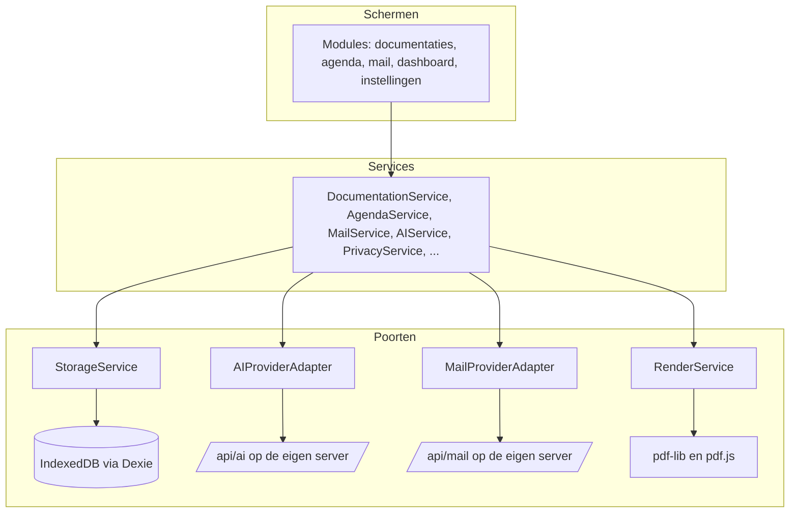

<!-- Onderdeel van de EduFlow Product Bible v1.0 (7 augustus 2026).
     Bindend. Volledig document: docs/product-bible-volledig.md
     Wijzigingen lopen via docs/19-besluitenregister.md -->

## 10. Service-architectuur

### 10.1 De vorm van het systeem

EduFlow heeft drie lagen en één regel die ze uit elkaar houdt.



De regel: **een scherm bevat geen regel die twee keer waar moet zijn.** Een scherm mag weten hoe iets eruitziet en wanneer iets zichtbaar is. Het mag niet weten wanneer een documentatie de status `gedeeld` krijgt, hoeveel eerdere delen van een reeks meegaan naar de AI, of hoe een naam wordt vervangen. Dat is U-03, en het is de belangrijkste architectuurregel van dit document.

De omgekeerde regel geldt ook: **een service weet niets van React.** Geen enkele service importeert een hook, een component of iets uit `next/`. Ze zijn te draaien in Vitest zonder browser en zonder scherm. Dat is niet netheid maar de voorwaarde om ze te kunnen toetsen.

### 10.2 Mappenstructuur

Dit lost B11v uit de review op: services stonden zowel op topniveau als in elke module, en voor `DocumentationService` en `AgendaService` — die het dashboard óók nodig heeft — was er geen regel. Het besluit is B-48: **services staan op topniveau, modules bevatten alleen schermen.**

```
src/
  app/                        Next.js App Router: routes en route handlers
    (app)/
      dashboard/page.tsx
      documentaties/…
      agenda/…
      mail/…
      instellingen/…
    api/
      ai/route.ts
      mail/[...path]/route.ts
      health/route.ts
  modules/                    alleen schermen en schermcomponenten
    documentaties/
      DocumentationList.tsx
      DocumentationEditor.tsx
      ConversationMode.tsx
      ExportPanel.tsx
      hooks/useDocumentationEditor.ts
    agenda/
    mail/
    dashboard/
    instellingen/
  services/                   alle regels, geen React
    storage/StorageService.ts
    documentation/DocumentationService.ts
    documentation/PageService.ts
    documentation/LayoutService.ts
    render/RenderService.ts
    photo/PhotoService.ts
    agenda/AgendaService.ts
    agenda/HolidayService.ts
    mail/MailService.ts
    ai/AIService.ts
    ai/PromptService.ts
    privacy/PrivacyService.ts
    style/StyleService.ts
    feedback/FeedbackService.ts
    search/SearchService.ts
    backup/BackupService.ts
    settings/SettingsService.ts
    audit/AuditService.ts
    sync/SyncService.ts        interface plus een lege implementatie
  domain/                      typen, schema's, invarianten, gebeurtenissen
    types/…
    schemas/…
    events/…
  ui/                          ontwerpsysteem uit hoofdstuk 5
    Button.tsx, Field.tsx, Panel.tsx, …
    tokens.css
  lib/                         gereedschap zonder domeinkennis
    uuid.ts, dates.ts, text.ts, result.ts
  data/
    schoolvakanties.json
```

**De importregels, afdwingbaar met een lintregel (DR-11):**

| Van | Mag importeren uit |
|---|---|
| `modules/` | `services/`, `domain/`, `ui/`, `lib/` |
| `services/` | `domain/`, `lib/`, andere `services/` |
| `domain/` | `lib/` |
| `ui/` | `lib/` |
| `lib/` | niets uit dit project |

`modules/` importeert nooit uit een andere `modules/`-map. Heeft het dashboard iets van documentaties nodig, dan komt dat uit `DocumentationService`, niet uit `modules/documentaties/`.

### 10.3 Het patroon van een service

Elke service is een object met functies, geen klasse en geen singleton met verborgen toestand. Afhankelijkheden komen binnen bij het maken, zodat een test een andere opslag of een andere provider kan meegeven.

```typescript
export function createDocumentationService(deps: {
  storage: StorageService;
  layout: LayoutService;
  photos: PhotoService;
  events: EventBus;
  clock: Clock;
}) {
  async function create(input: NewDocumentation): Promise<Result<Documentation>> { … }
  async function addPhoto(id: Uuid, file: File): Promise<Result<Photo>> { … }
  async function markExported(id: Uuid): Promise<Result<Documentation>> { … }
  return { create, addPhoto, markExported, … };
}

export type DocumentationService = ReturnType<typeof createDocumentationService>;
```

`clock` staat er niet voor de sier: zonder injecteerbare klok is "een documentatie mag hoogstens zeven dagen in de toekomst liggen" (B-70) niet te toetsen zonder de systeemtijd te verzetten.

**Fouten zijn waarden, geen uitzonderingen.** Elke service geeft een `Result` terug:

```typescript
type Result<T> =
  | { ok: true; value: T }
  | { ok: false; error: AppError };

interface AppError {
  code: ErrorCode;              // "STORAGE_FULL", "AI_UNREACHABLE", "PRIVACY_GATE", …
  message: string;              // Nederlandse tekst voor de gebruiker
  detail?: string;              // technisch, alleen voor het logboek
  recoverable: boolean;
  action?: { label: string; kind: "retry" | "navigate" | "dismiss"; target?: string };
}
```

Dat `message` in het Nederlands staat en niet in het Engels, is bewust: er is precies één plek waar een fouttekst wordt bedacht, en dat is de service die de fout kent. Een scherm dat foutcodes vertaalt is een tweede plek waar dezelfde kennis staat (U-03). De teksten volgen de regels uit §4.7.

### 10.4 De diensten, één voor één

| Service | Verantwoordelijk voor | Kent niet |
|---|---|---|
| `StorageService` | lezen, schrijven, transacties, migraties, grafstenen, `rev` en `origin`, `changeLog` | wat een documentatie betekent |
| `DocumentationService` | levenscyclus, koppelingen, status, archiveren, dupliceren | opmaak, opslagdetails |
| `PageService` | pagina's aanmaken, ordenen, vervolgpagina's, blokken plaatsen | hoe een pagina eruitziet in millimeters |
| `LayoutService` | layoutdefinities, sloten, overloopberekening | hoe je tekent |
| `RenderService` | PDF genereren, rasteren naar JPEG, voorbeeld op het scherm | wanneer je exporteert |
| `PhotoService` | inlezen, EXIF strippen, verkleinen naar drie varianten, hash, `refCount`, opruimen | waar een foto in een pagina staat |
| `SeriesService` | reeksen, volgorde, context voor de vervolgzin | AI |
| `StudentService` | leerlingen, dubbele voornamen, samenvoegen, uit dienst | groepen |
| `GroupService` | groepen, lidmaatschappen, overlapcontrole, jaarovergang | documentaties |
| `AgendaService` | items, weergaven, herhalingen, ICS | vakantiegegevens |
| `HolidayService` | vakantiebestand, regio's, overrides, verlooptermijn | agenda-items |
| `MailService` | postbus, cache, concepten, overdracht | hoe een mail geschreven wordt |
| `AIService` | aanroepen, streaming, nieuwe pogingen, budget, logboek | wat er in de opdracht staat |
| `PromptService` | opdrachten samenstellen uit instructie, stijl, voorbeelden, context | netwerk |
| `PrivacyService` | pseudonimiseren, terugvertalen, detectoren, de poort bij een lege lijst | AI |
| `StyleService` | kenmerken meten, voorbeelden kiezen, correctieregels voorstellen | opdrachten samenstellen |
| `FeedbackService` | uitkomsten vastleggen, overeenkomst berekenen, signalen bundelen | stijl aanpassen |
| `SearchService` | index bouwen en doorzoeken, filters combineren | wat een treffer betekent |
| `BackupService` | bundelen, versleutelen, terugzetten, samenvoegen | wat er in een tabel staat |
| `SettingsService` | instellingen lezen en schrijven, verdeling over IndexedDB en `localStorage` | wie ze gebruikt |
| `AuditService` | verantwoordingswaardige handelingen vastleggen | de rest |
| `SyncService` | niets, in versie 1.0 | — |

**Waarom `PromptService` los staat van `AIService`.** Omdat het samenstellen van een opdracht de plek is waar bijna alle kwaliteit zit, en de plek waar de gouden testset op aangrijpt (§12.9). Zit dat verweven met netwerkcode, dan is het niet te toetsen zonder een provider aan te roepen. Nu draait de hele testset zonder netwerk: hij vergelijkt de samengestelde opdracht met de verwachte opdracht, en pas de kleine laatste stap gaat echt naar buiten.

**Waarom `LayoutService` los staat van `RenderService`.** Omdat layout data is en tekenen code (B-26). `LayoutService` beantwoordt "past dit, en waar komt het" met getallen. `RenderService` beantwoordt "hoe ziet dat eruit" op twee doelen: een canvas op het scherm en een PDF. Twee renderers, één bron. Zonder die scheiding krijg je twee layoutimplementaties die uit de pas lopen, precies wat U-03 verbiedt.

### 10.5 Samenwerking tussen services

Services roepen elkaar rechtstreeks aan waar de afhankelijkheid vast is, en gebruiken gebeurtenissen waar hij dat niet is.

**Rechtstreeks** als de ene service de andere nodig heeft om zijn werk af te maken. `DocumentationService.addPhoto()` roept `PhotoService.ingest()` aan; zonder foto is er niets toe te voegen.

**Via gebeurtenissen** als iets anders wíl weten dat er iets gebeurd is, maar de handeling zonder die ander gewoon slaagt. `DocumentationService` weet niet dat `SearchService` de index wil bijwerken, dat `StyleService` een tekst wil meten, en dat `AuditService` iets wil vastleggen. Het stuurt `DocumentationContentChanged` en gaat verder.

```typescript
interface EventBus {
  publish<E extends DomainEvent>(event: E): void;
  subscribe<K extends DomainEventKind>(kind: K, handler: (e: DomainEventOf<K>) => void): () => void;
}
```

De bus is synchroon en in het geheugen; er is geen wachtrij, geen herhaling en geen volgorde-garantie tussen abonnees. Een abonnee die faalt, faalt alleen voor zichzelf en logt dat; de publicerende service merkt er niets van. Dat is precies de bedoeling: het bijwerken van de zoekindex mag nooit een documentatie kunnen laten mislukken.

De gebeurtenissen zelf staan in §9.6.

### 10.6 De serverkant

Er draaien precies drie route handlers. Elke andere functionaliteit draait in de browser.

**`POST /api/ai`.** De reden dat deze bestaat is de sleutel: een AI-sleutel in de browser is een sleutel die iedereen heeft. De handler:

1. Controleert de toegangscode-cookie (T-05).
2. Past de snelheidslimiet toe per toegangscode én per IP-adres, met een dagbudget (T-17).
3. Valideert het verzoek met Zod: taak, opdracht, provider, maximale lengte.
4. **Weigert elk verzoek waarin een beeldgegeven zit** — geen `image`-veld, geen base64-blok, geen bijlage. Dit is een controle op de server en niet alleen in de browser, want een grens die alleen in de browser bestaat, is geen grens.
5. Roept de provider aan met de sleutel uit de omgeving, en streamt het antwoord terug.
6. Legt tellingen vast: taak, provider, aantal tekens, duur. Geen inhoud.

**`GET|POST /api/mail/[...path]`.** Een doorgeefluik naar Microsoft Graph of Gmail. Bestaat om drie redenen: de tokens mogen niet in de browser (T-15), de autorisatiecode moet met een geheim worden ingewisseld, en er is één plek nodig die afdwingt dat er nooit een verzendaanroep vertrekt. De handler heeft een lijst met toegestane paden; alles wat er niet op staat, wordt geweigerd. `/sendMail` en `/messages/send` staan er niet op en kunnen er niet op komen zonder dat iemand die lijst wijzigt (B-20).

**`GET /api/health`.** Antwoordt met de versie, de gekozen standaardprovider en de regio. Geen gegevens.

**Wat er niet op de server staat:** geen documentaties, geen foto's, geen leerlingen, geen concepten, geen zoekindex, geen sessies met inhoud. De server is een sluis, geen opslag. Dat is de zin die in het gesprek met de functionaris gegevensbescherming het meeste werk doet (hoofdstuk 15).

### 10.7 Transacties en autosave

Alle schrijfacties die meer dan één record raken, lopen in één Dexie-transactie. Een documentatie met drie pagina's opslaan is één transactie; slaagt hij half, dan slaagt hij niet.

Autosave (T-09, C10 uit de review):

1. Bij elke wijziging wordt de schermtoestand bijgewerkt en een timer van 1.000 ms opnieuw gestart.
2. Loopt de timer af, dan schrijft `DocumentationService.save()` in één transactie.
3. Bij `visibilitychange` naar verborgen en bij `pagehide` wordt onmiddellijk geschreven, zonder te wachten.
4. Mislukt de schrijfactie door ruimtegebrek, dan blijft de toestand in het geheugen, blijft het scherm bewerkbaar, en probeert de app elke tien seconden opnieuw (F-24.E2).
5. De opslagindicator kent drie standen: "Opgeslagen", "Wijzigingen worden bewaard", "Niet opgeslagen — er is een probleem". Nooit een draaiend rondje zonder tekst.

**Ongedaan maken** (T-07, B-39) is een stapel in het geheugen van hoogstens vijftig stappen, per documentatie, per sessie. Hij overleeft een herlaadactie niet, en dat is een bewuste beperking: een ongedaan-maken-stapel die de opslag in gaat, is een tweede geschiedenis naast `changeLog`.

### 10.8 Gelijktijdigheid en twee tabbladen

Twee tabbladen met dezelfde documentatie is een reëel geval (F-04, B11c). De afspraak:

- Elk tabblad neemt bij het openen van een documentatie een lichte claim via `BroadcastChannel`.
- Ziet het tweede tabblad een bestaande claim, dan opent het in leesstand met de balk "Deze documentatie is elders geopend" en de knop "Toch bewerken".
- Wordt er toch in beide bewerkt, dan wint bij het opslaan de hoogste `rev`; het verliezende tabblad krijgt "Dit is elders gewijzigd. Vernieuwen." en verliest niets, want zijn tekst staat nog op het scherm.
- Er is geen samenvoeging op tekenniveau. Dat hoort bij samenwerken, en samenwerken is fase 2 (§7.27).

### 10.9 Beschikbaarheid en offline

De app werkt volledig offline behalve AI en mail (B-47). Dat wordt zichtbaar gemaakt en niet verzwegen — de review wees terecht op de slordige formulering in doc 03 (B11u).

| Onderdeel | Offline |
|---|---|
| Documentaties schrijven, foto's, pagina's | ja |
| Exporteren naar PDF en afbeelding | ja |
| Agenda, vakanties, ICS-export | ja |
| Zoeken | ja |
| Back-up en terugzetten | ja |
| Instellingen | ja |
| Laat AI meeschrijven, titelvoorstel, vervolgzin, gespreksmodus afronden | nee |
| Postvak, samenvatten, concept overdragen | nee |

Er is een servicewerker, maar hij doet één ding: de app-schil en de statische bestanden in de cache zetten zodat de app zonder netwerk start. Hij cachet geen gegevens en onderschept geen `/api`-verzoeken; die falen gewoon en `AIService` vertaalt dat naar de melding uit §4.7.

Bij verlies van netwerk verandert de AI-knop van "Laat AI meeschrijven" in "Laat AI meeschrijven (geen internet)" en is hij uitgeschakeld met een verklarende hulptekst. Niets anders in het scherm verandert.

### 10.10 Toetsbaarheid als architectuureis

De indeling hierboven is niet gekozen om netjes te zijn maar om drie vragen beantwoordbaar te maken zonder browser en zonder netwerk:

1. **Vervangt `PrivacyService` alle namen?** `PrivacyService` krijgt een lijst en een tekst, en geeft een tekst en een afbeelding terug. De testset uit C2 draait in milliseconden.
2. **Klopt de opdracht die weggaat?** `PromptService` krijgt toestand en geeft een tekenreeks. De gouden testset vergelijkt die met de verwachte opdracht.
3. **Past de inhoud op de pagina?** `LayoutService` krijgt blokken en een layout, en geeft een paginaverdeling. Geen canvas nodig.

Elke service die deze eigenschap verliest — die een `window`, een `document` of een netwerkaanroep nodig heeft om zijn regel uit te voeren — is verkeerd ingedeeld. Dat is de toets bij elke uitbreiding (DR-12).

---
