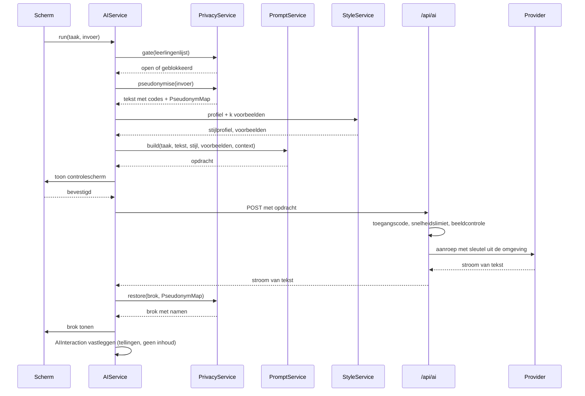

<!-- Onderdeel van de EduFlow Product Bible v1.0 (7 augustus 2026).
     Bindend. Volledig document: docs/product-bible-volledig.md
     Wijzigingen lopen via docs/19-besluitenregister.md -->

## 12. AI-architectuur

Hoofdstuk 3 beschrijft de houding: wat AI mag doen en waarom. Dit hoofdstuk beschrijft het apparaat: welke onderdelen er zijn, wat er precies over de lijn gaat, hoe de kwaliteit gemeten wordt en wat er gebeurt als het misgaat.

### 12.1 De keten in één beeld



De volgorde is vast en er is geen enkele route die hem overslaat. `AIService` is de enige plek in de app die `/api/ai` aanroept; geen enkel scherm, geen enkele andere service doet dat (DR-16).

### 12.2 Taken

Een taak is de eenheid waarop alles is ingericht: de systeeminstructie, de keuze van voorbeelden, de temperatuur, de maximale lengte, het budget en de gouden testgevallen.

| Taak | Module | In v1.0 | Invoer | Uitvoer |
|---|---|---|---|---|
| `doc.write` | DOC | ja | losse observaties | lopende tekst |
| `doc.title` | DOC | ja | tekst van de documentatie | drie titels van ≤ 6 woorden |
| `doc.followup` | DOC | ja | reekscontext + begin | 1-3 openingszinnen |
| `doc.spelling` | DOC | ja | tekst | dezelfde tekst met correcties |
| `talk.build` | DOC | ja | antwoorden uit gespreksmodus | lopende tekst |
| `mail.summarise` | MAI | ja | ontvangen bericht | vijf punten |
| `mail.write` | MAI | ja | sjabloon, toon, aanleiding | conceptmail |
| `mail.tone` | MAI | 1.1 | bestaande tekst + doeltoon | herschreven tekst |
| `mail.shorten` | MAI | 1.1 | bestaande tekst | kortere tekst |
| `mail.expand` | MAI | 1.1 | bestaande tekst | uitgebreidere tekst |

De vijf taken die B-04 naar later zette, staan hier al benoemd met hun versie. Dat is bewust: een taak die pas in 1.1 komt maar nu al een plek in het register heeft, wordt later toegevoegd zonder dat de architectuur verandert.

```typescript
interface TaskDefinition {
  id: TaskId;
  systemPrompt: string;
  temperature: number;
  maxOutputTokens: number;
  exampleCount: number;          // hoeveel stijlvoorbeelden meegaan
  includeStyleProfile: boolean;
  includeSeriesContext: boolean;
  maxInputChars: number;
  reviewRequired: "always" | "default-on" | "never";
  goldenCases: GoldenCase[];
}
```

`reviewRequired` codeert de regel uit FR-MAI-12: bij `mail.*` staat hij op `always` en is het controlescherm niet overslaanbaar; bij `doc.*` op `default-on`.

### 12.3 De opdracht

Een opdracht bestaat uit vijf blokken, altijd in deze volgorde, altijd zichtbaar in het controlescherm (B-11).

```
1. SYSTEEMINSTRUCTIE   wat de assistent is en wat hij niet doet
2. SCHRIJFSTIJL         het stijlprofiel in leesbare regels
3. VOORBEELDEN          k paren van invoer en gewenste uitkomst
4. CONTEXT              reeksdelen, sjabloon, toon — afhankelijk van de taak
5. INVOER               de gepseudonimiseerde tekst van de gebruiker
```

De systeeminstructie voor `doc.write`, letterlijk zoals hij verstuurd wordt:

```
Je bent een schrijfhulp voor een leerkracht in het Nederlandse funderend onderwijs.
Je maakt van losse observaties één lopende tekst voor pedagogische documentatie
die naar ouders gaat.

Wat je doet:
- Je gebruikt uitsluitend wat er in de invoer staat.
- Je maakt van losse zinnen lopende zinnen en zet ze in een logische volgorde.
- Je corrigeert spelling en interpunctie.
- Je behoudt citaten woordelijk, inclusief kindertaal en grammaticafouten.

Wat je niet doet:
- Je voegt geen gebeurtenissen, personen, plaatsen, tijden of gevoelens toe die er niet staan.
- Je schrijft niet wat een kind kan, is, of leert. Je schrijft wat er gebeurde en wat er gezegd is.
- Je gebruikt geen oordelen: niet knap, niet goed, niet trots, niet prachtig.
- Je verandert de codes tussen blokhaken niet. [LEERLING-1] blijft [LEERLING-1].
- Je schrijft geen inleiding, geen titel, geen afsluiting en geen opmerking over jezelf.

Vorm:
- Nederlands.
- Volg de schrijfstijl hieronder. Wijkt die af van wat je zelf zou kiezen, dan volg je de stijl.
- Geef alleen de tekst terug, zonder aanhalingstekens eromheen en zonder toelichting.
```

De regel over de codes staat er omdat een model dat `[LEERLING-1]` netjes vervangt door "de leerling" het terugvertalen onmogelijk maakt. De regel over oordelen is de vertaling van B-25 naar de opdracht zelf: EduFlow beoordeelt niet, ook niet per ongeluk in een bijzin.

Het blok SCHRIJFSTIJL wordt door `StyleService` samengesteld uit het profiel (§8.3.11) en ziet er zo uit:

```
Zinnen: gemiddeld 14 woorden. Langer dan 22 woorden komt bij deze schrijver niet voor.
Alinea's: 3 tot 4 zinnen.
Tijd: tegenwoordige tijd.
Aanspreekvorm: wij.
Citaten: gebruik minstens één letterlijk citaat als de invoer er een bevat.
Verhouding: beschrijven, niet duiden. Ongeveer 4 op de 5 zinnen beschrijft waarneembaar gedrag.
Vermijd deze woorden: prachtig, geweldig, enorm trots, ontzettend, super.
Gebruik gerust: samen, opnieuw, ontdekte, probeerde, merkte.
```

### 12.4 Voorbeeldselectie

De `k` voorbeelden zijn het krachtigste stuurmiddel, sterker dan welke instructie ook. `StyleService.selectExamples(task, input, k)` kiest ze zo:

1. **Grondslag.** De stijlvoorbeelden uit Instellingen (FR-INS-16) staan altijd vooraan; dat zijn de paren die de gebruiker zelf heeft gemaakt en die de norm bepalen.
2. **Aanvulling.** Daarna de geaccepteerde documentaties met de hoogste overeenkomst met de huidige invoer. Overeenkomst wordt bepaald met een goedkope lokale maat: cosinusgelijkenis over woordfrequenties na verwijdering van stopwoorden. Er komt geen inbeddingsmodel aan te pas — dat zou een tweede AI-aanroep betekenen voor elke aanroep.
3. **Spreiding.** Van twee voorbeelden die meer dan 0,85 op elkaar lijken, gaat er één mee. Drie bijna identieke voorbeelden leren het model niets extra's.
4. **Grens.** `k` is 2 voor `doc.write` en `talk.build`, 1 voor `mail.write`, 0 voor `doc.title` en `doc.spelling`.
5. **Afkapping.** Elk voorbeeld wordt afgekapt op 1.200 tekens per kant.

Elk voorbeeld gaat door `PrivacyService`, ook de zelfgemaakte stijlvoorbeelden. Dat lost B6 uit de review op: de stijlrichtlijn is zelf een documentatie met echte namen, en die namen zitten mogelijk in een vorige groep en dus niet in de huidige leerlingenlijst (FR-INS-17).

### 12.5 Pseudonimisatie in detail

`PrivacyService` is een zuivere functie over tekst. Hij kent geen netwerk, geen opslag en geen React, en hij is daarom volledig te toetsen (§10.10).

**De vervangingsvolgorde**, die T-04 concreet maakt:

1. **Termenlijst opbouwen** uit leerlingnamen, extra termen (FR-INS-19) en, bij mail, de detectorpatronen.
2. **Langste eerst sorteren.** Zonder dit wordt "Jan-Peter" gevonden als "Jan" en blijft "-Peter" staan.
3. **Woordgrenzen.** Het patroon is `(?<![\p{L}\p{N}])term(?![\p{L}\p{N}])` met de unicode-vlag. Daarmee blijft "roos" in "rozenstruik" staan en wordt "Roos" in "Roos plukte" wel gevonden.
4. **Hoofdletterongevoelig zoeken, hoofdletters herstellen.** Wordt "sam" gevonden waar de originele tekst "Sam" had, dan onthoudt de afbeelding dat, zodat het terugvertalen "Sam" oplevert en niet "sam".
5. **Nederlandse verbuigingen.** Achtervoegsels `s`, `'s`, `je`, `tje`, `pje`, `ke` worden meegenomen: "Kjelds idee" wordt `[LEERLING-3]s idee`, "Kjeldje" wordt `[LEERLING-3]je`.
6. **Diakrieten.** Zoeken gebeurt op de genormaliseerde vorm (NFD, diakrieten weggelaten), zodat "Hanaë" ook "Hanae" vindt; de vervanging gebeurt op de oorspronkelijke tekenreeks.
7. **Dubbele voornamen.** Twee leerlingen die Noa heten krijgen elk hun eigen `pseudonymSeed` en dus een eigen code. Kan de app niet bepalen welke Noa bedoeld is — de tekst zegt alleen "Noa" — dan krijgt het voorkomen de code van de leerling die aan de documentatie gekoppeld is. Zijn beide gekoppeld, dan krijgt het voorkomen `[LEERLING-AMBIGU-1]` en meldt het controlescherm: "Er staan twee kinderen met de naam Noa in deze documentatie. De app kan niet zien welke bedoeld is."
8. **Terugvertalen op de code.** `restore()` werkt uitsluitend op de codes, nooit op namen. Daardoor blijft het correct ook als het model de tekst herschikt.

**De poort** (T-08). Vóór stap 1 controleert `gate()`:

```typescript
if (students.length === 0 && !settings.emptyListConfirmedAt) {
  return blocked({
    code: "PRIVACY_GATE",
    message: "Je leerlingenlijst is leeg. De afscherming doet dan niets.",
    action: { label: "Leerlingen toevoegen", kind: "navigate", target: "/instellingen/leerlingen" },
  });
}
```

De bevestiging "Toch doorgaan" zet `emptyListConfirmedAt` en schrijft een `AuditEvent` (hoofdstuk 16). Zij vervalt zodra er wél leerlingen zijn en wordt opnieuw gevraagd als de lijst later weer leeg raakt.

**De toetsset.** `PrivacyService` heeft een eigen testset van minimaal 120 gevallen, met de namen uit bijlage A. Verplichte gevallen:

| Geval | Invoer | Verwachte uitkomst |
|---|---|---|
| Gewoon woord | "De rozen in de schooltuin" | ongewijzigd |
| Naam die ook woord is | "Roos plukte een roos" | `[LEERLING-19]` plukte een roos |
| Deelwoord | "samenwerken" met leerling Sam | ongewijzigd |
| Bezitsvorm | "Kjelds idee" | `[LEERLING-11]s idee` |
| Verkleinwoord | "Kjeldje" | `[LEERLING-11]je` |
| Hoofdletters | "KJELD riep" | `[LEERLING-11]` riep, hersteld bij terugvertalen |
| Samenstelling met streepje | "Jan-Peter" met leerlingen Jan en Jan-Peter | `[LEERLING-x]` voor Jan-Peter, niet voor Jan |
| Diakriet | "Hanaë" met leerling Hanae | gevonden |
| Twee gelijke namen | "Noa deed het" met beide Noa's gekoppeld | `[LEERLING-AMBIGU-1]` plus melding |
| Rondgang | pseudonimiseren en terugvertalen | exact de oorspronkelijke tekst |

De laatste is de belangrijkste: `restore(pseudonymise(t)) === t` moet gelden voor elke tekst in de set. Dat is INV-30.

### 12.6 De serverroute

```typescript
export async function POST(request: Request) {
  const gate = await checkAccessCode(request);        // T-05
  if (!gate.ok) return json(401, gate.error);

  const limit = await rateLimit(gate.deviceId, ipOf(request));  // T-17
  if (!limit.ok) return json(429, limit.error);

  const body = aiRequestSchema.safeParse(await request.json());
  if (!body.success) return json(400, invalid(body.error));

  if (containsBinaryOrImage(body.data)) return json(422, imageRefused());  // T-29

  const adapter = adapterFor(body.data.provider);
  return adapter.stream(body.data, { signal: request.signal });
}
```

`containsBinaryOrImage` controleert op een `image`-veld, op een `data:`-URI, op een base64-blok langer dan 512 tekens en op een MIME-aanduiding van een beeldtype. Dat is grover dan nodig en dat is de bedoeling: dit is een grens die eerder te vroeg dan te laat moet dichtklappen.

**Snelheidslimiet** (T-17), per toegangscode en per IP-adres:

| Venster | Grens |
|---|---|
| 10 seconden | 3 aanroepen |
| 1 uur | 60 aanroepen |
| 1 dag | 300 aanroepen |
| 1 dag, tekens uit | 400.000 |

Bij overschrijding: `429` met de melding uit F-08.E5 en het tijdstip waarop de grens weer opengaat.

### 12.7 Providers

```typescript
interface AIProviderAdapter {
  id: "openai-eu" | "vertex-eu" | "bedrock-eu";
  displayName: string;
  region: string;
  stream(request: AIRequest, opts: { signal: AbortSignal }): Response;
  estimateCost(charsIn: number, charsOut: number): number;
  capabilities: { streaming: boolean; systemPrompt: boolean; maxContextChars: number };
}
```

| Adapter | Verwerkingsregio | Standaard |
|---|---|---|
| `openai-eu` | EU | ja (T-06) |
| `vertex-eu` | EU, waaronder een regio in Nederland | nee |
| `bedrock-eu` | EU | nee |

De regel voor het standaard maken van een provider (§3.10): verwerking binnen de EU, geen training op verstuurde gegevens, en een verwerkersovereenkomst die via het schoolbestuur gesloten kan worden. Voldoet een aanbieder daar niet aan, dan mag hij in de lijst staan maar niet als standaard, en krijgt hij bij het kiezen een waarschuwing plus een regel in het logboek (FR-INS-23).

Modelkeuze is een eigenschap van de adapter, niet van de app. De app vraagt om een taak en een kwaliteitsniveau (`snel` of `zorgvuldig`); de adapter kiest het model. Daardoor verandert er in de app niets als een aanbieder een model uitfaseert.

| Taak | Niveau | Reden |
|---|---|---|
| `doc.spelling`, `doc.title` | snel | mechanisch werk, korte uitvoer |
| `doc.write`, `talk.build`, `doc.followup` | zorgvuldig | dit is waar het product op beoordeeld wordt |
| `mail.summarise` | snel | begrijpend lezen, korte uitvoer |
| `mail.write` | zorgvuldig | gaat naar ouders |

### 12.8 Leren zonder trainen

Dit is de uitwerking van U-09, B-22 en B-23. Drie mechanismen, alle drie lokaal, alle drie zichtbaar en terug te draaien.

**Mechanisme 1 — kenmerken meten.** Na elke geaccepteerde of zelfgeschreven tekst berekent `StyleService` de kenmerken uit §8.3.11 opnieuw, als voortschrijdend gemiddelde over de laatste 30 documentaties. Meten begint pas bij 3 documentaties; daarvoor gelden de waarden uit de stijlvoorbeelden.

**Mechanisme 2 — voorbeelden kiezen.** Beschreven in §12.4.

**Mechanisme 3 — correctieregels.** `FeedbackService` houdt bij welke woorden en wendingen de gebruiker structureel weghaalt. De regel: is een woord in drie verschillende documentaties door de AI aangeboden en door de gebruiker verwijderd, dan verschijnt na de derde keer één vraag:

> "Je hebt 'prachtig' nu drie keer weggehaald. Zal ik dat woord voortaan vermijden?"
> **Ja, vermijd het** · **Nee, laat maar**

Bij ja komt het op de vermijdlijst en in de opdracht (§12.3). Bij nee wordt het woord voor drie maanden niet meer voorgesteld als regel. De gebruiker bevestigt altijd; de app besluit nooit zelf (U-10).

**Wat er nadrukkelijk niet gebeurt:**

- Er wordt geen model getraind, bijgesteld of verfijnd.
- Er gaat geen enkel gegeven naar een provider met het doel te leren.
- Er is geen inbedding, geen vectoropslag en geen externe kennisbank.
- Er wordt niets over de gebruiker afgeleid dat niet over schrijfstijl gaat.

Dat is voor de privacybeoordeling belangrijk (hoofdstuk 15) en het is ook eerlijker: wat de app "geleerd" heeft, is een leesbaar bestand van ongeveer twintig regels, dat je in Instellingen kunt openen, wijzigen en wissen.

**Meetbaarheid.** Werkt het leren, dan stijgt het aandeel overgenomen voorstellen in de eerste weken en blijft daarna stabiel. Daalt het, dan is er iets mis met het profiel en niet met het model. `FeedbackService` berekent dit per week en toont het in Instellingen → Schrijfstijl als één regel: "Je nam de afgelopen maand 78 procent van de voorstellen over (vorige maand 71 procent)."

### 12.9 De gouden testset

Dit is het antwoord op D8 uit de review en op B4: zonder toetsbare grens is niet vast te stellen of AI het goed of fout doet, en dan is de Definition of Done niet vast te stellen.

Een gouden testgeval bestaat uit vier delen:

```typescript
interface GoldenCase {
  id: string;
  task: TaskId;
  input: string;              // ruwe notitie, met de namen uit bijlage A
  acceptable: string;         // een goede uitkomst
  overshot: string;           // een te ver doorgeschoten uitkomst
  checks: Check[];            // machinaal toetsbaar
}

type Check =
  | { kind: "maxSentenceWords"; value: number }
  | { kind: "maxSentences"; value: number }
  | { kind: "mustContainQuote" }
  | { kind: "mustNotContain"; words: string[] }
  | { kind: "mustPreserveCodes" }
  | { kind: "noNewNamedEntities" }
  | { kind: "noJudgementWords" }
  | { kind: "tense"; value: "tegenwoordig" | "verleden" };

```

De testset draait in twee standen:

**Zonder netwerk, bij elke wijziging.** Getoetst wordt de samengestelde opdracht: bevat hij de systeeminstructie, het profiel, de juiste voorbeelden, de juiste context, en de gepseudonimiseerde invoer? Dit vangt de meeste fouten, want de meeste fouten zitten in het samenstellen en niet in het model.

**Met netwerk, vóór elke release en wekelijks.** De uitvoer van de provider wordt langs de `checks` gelegd. De drempels:

| Controle | Eis |
|---|---|
| `mustPreserveCodes` | 100 procent — een enkele fout hier maakt terugvertalen onmogelijk |
| `noNewNamedEntities` | 100 procent — de AI mag geen personen, plaatsen of gebeurtenissen toevoegen (§3.8) |
| `noJudgementWords` | 100 procent — volgt uit B-25 |
| `maxSentenceWords` | ≥ 95 procent van de zinnen |
| `mustContainQuote` | ≥ 90 procent van de gevallen waarin de invoer een citaat bevat |
| `tense` | ≥ 90 procent |

`noNewNamedEntities` wordt gecontroleerd door de uitvoer te ontleden op hoofdletters midden in een zin en die te vergelijken met de invoer. Alles wat nieuw is en geen gewoon Nederlands woord is, is een treffer. Dat is grof, maar het vangt precies het geval dat het meeste schaadt: een AI die een kind verzint.

**De minimale set.** Vier gevallen per taak, aangeleverd door de maker (D8 uit de review), plus de vier randgevallen die de app zelf moet aankunnen: een invoer van drie woorden, een invoer van 8.000 tekens, een invoer die alleen uit citaten bestaat, en een invoer met twee kinderen die dezelfde naam hebben.

**Wanneer de set faalt, faalt de release.** Dat is niet onderhandelbaar en het staat in de Definition of Done (§18.6).

### 12.10 Streaming en waargenomen tempo

De eerste tekens moeten binnen 2 seconden staan (NFR-06). Wat daarvoor nodig is:

1. De route handler streamt door in plaats van het hele antwoord af te wachten.
2. `PrivacyService.restore()` werkt op brokken, niet op de volledige tekst. Dat kan omdat codes de vorm `[LEERLING-1]` hebben en een brok een code kan doorsnijden: de service houdt een buffer aan van de langst mogelijke code en geeft pas vrij wat zeker compleet is.
3. Het scherm tekent de binnenkomende tekst in een eigen component (§11.5), zodat het tekstvlak waarin de gebruiker werkt niet opnieuw getekend wordt.
4. Tijdens het streamen is Overnemen uitgeschakeld en Weggooien beschikbaar. Overnemen op een half antwoord levert een halve zin op.

Duurt het langer dan 2 seconden voordat het eerste teken komt, dan verschijnt onder de knop "De AI denkt na" en na 6 seconden "Het duurt langer dan gewoonlijk. Je kunt dit afbreken." Er is geen voortgangsbalk, want er is geen voortgang die je eerlijk kunt tonen (§4.5).

### 12.11 Fouten en nieuwe pogingen

| Situatie | Gedrag |
|---|---|
| Netwerkfout of `5xx` | eenmaal opnieuw na 2 seconden, stil |
| Time-out na 30 seconden | afbreken, melding met "Opnieuw" |
| `429` van de provider | opnieuw na de aangegeven wachttijd, hoogstens één keer |
| `429` van de eigen limiet | geen nieuwe poging; melding met het tijdstip waarop de grens opengaat |
| Leeg antwoord | eenmaal opnieuw met dezelfde opdracht |
| Antwoord met beschadigde codes | niet tonen; melding "De AI gaf een antwoord dat de app niet veilig kan terugvertalen." en één nieuwe poging |
| Antwoord dat de `checks` faalt in de streng-modus | alleen in tests; in productie wordt het getoond, want de gebruiker beslist (U-10) |
| Provider onbereikbaar | melding met de mogelijkheid in Instellingen een andere provider te kiezen |

Er is nooit meer dan één automatische nieuwe poging. Twee stille pogingen maken een trage aanroep drie keer zo traag en verdubbelen de kosten zonder dat de gebruiker weet waarom (§3.7).

**Nooit stil falen.** Elke mislukte aanroep leidt tot een zichtbare melding en een regel in `aiInteractions` met `outcome: "failed"`. Een AI die stil niets doet is erger dan een AI die niet werkt: bij de eerste denkt de gebruiker dat haar tekst goedgekeurd is.

### 12.12 Kosten

| Taak | Tekens in (gem.) | Tekens uit (gem.) | Aanroepen per week (gem.) |
|---|---|---|---|
| `doc.write` | 4.200 | 1.100 | 10 |
| `doc.followup` | 6.500 | 250 | 3 |
| `doc.title` | 1.400 | 80 | 6 |
| `doc.spelling` | 1.400 | 1.400 | 4 |
| `talk.build` | 2.800 | 1.100 | 5 |
| `mail.summarise` | 3.500 | 400 | 6 |
| `mail.write` | 2.600 | 900 | 5 |

Bij benadering 250.000 tekens in en 60.000 uit per gebruiker per week. Bij een tarief in de orde van enkele euro's per miljoen tokens komt dat op enkele tientallen eurocenten per gebruiker per week — enkele tientallen euro's per jaar voor één leerkracht. Dat is de reden dat het dagbudget uit T-17 bestaat: niet omdat de kosten hoog zijn, maar omdat een open `/api/ai` zonder slot een gratis AI-dienst is op rekening van de maker (C7 uit de review).

`AIService` telt het verbruik lokaal en toont het in Instellingen (FR-INS-24). Bij 80 procent van het maandbudget verschijnt een melding; bij 100 procent worden alleen de taken op niveau `zorgvuldig` geblokkeerd, zodat spelling en titels blijven werken.

### 12.13 Wat er nooit naar een provider gaat

Deze lijst is bindend en wordt op drie plekken afgedwongen: in `PromptService` bij het samenstellen, in `AIService` vóór het versturen, en in de route handler op de server (T-29).

| Gegeven | Waarom niet |
|---|---|
| Foto's, in welke vorm dan ook | B-03; de belofte waar het hele ontwerp van gespreksmodus op rust |
| Bestandsnamen en hashes van foto's | kunnen een naam bevatten |
| Achternamen en initialen uit de leerlingenlijst | worden vervangen |
| Geboortedatums | staan nergens in een opdracht |
| De persoonlijke notitie bij een documentatie | is voor de gebruiker zelf (`privateNote`) |
| Notities bij een leerling | idem |
| E-mailadressen, telefoonnummers, adressen, IBAN, BSN | worden vervangen (§6.3.10) |
| Bijlagen van een mail | worden niet eens opgehaald (FR-MAI-11) |
| De inhoud van het logboek | bevat geen inhoud (§8.3.12) |
| De `PseudonymMap` | bestaat alleen in het geheugen (T-23) |

### 12.14 Wat de gebruiker ziet van dit alles

De hele architectuur van dit hoofdstuk komt op één scherm samen: "Bekijk wat er verstuurd wordt". Het toont, uitklapbaar, precies wat er over de lijn gaat:

```
┌────────────────────────────────────────────────────────────┐
│  Dit gaat naar de AI                          7 afgeschermd│
├────────────────────────────────────────────────────────────┤
│ ▸ Instructie aan de AI                            412 woorden│
│ ▸ Jouw schrijfstijl                                 8 regels│
│ ▸ Voorbeelden uit je instellingen                        2  │
│ ▾ Je eigen tekst                                          │
│                                                            │
│   [LEERLING-11] bouwde met [LEERLING-13] aan de brug.      │
│   "Kijk, hij staat!" zei [LEERLING-11].                    │
│                                                            │
│ ▸ Wat er niet meegaat                            4 foto's  │
├────────────────────────────────────────────────────────────┤
│  Verwerking: EU · Deze tekst wordt niet gebruikt om te     │
│  trainen.                                                  │
│                        [ Annuleren ]      [ Verstuur ]     │
└────────────────────────────────────────────────────────────┘
```

Het blok "Wat er niet meegaat" is er bewust. Een controlescherm dat alleen toont wat weggaat, laat de belangrijkste eigenschap van dit product onbenoemd: dat de foto's blijven waar ze zijn.

---
