# EduFlow — Product Bible

**Versie 1.0 · 7 augustus 2026**

Het complete handboek voor het ontwerp, de bouw en het beheer van EduFlow:
een AI-assistent voor pedagogische professionals in het funderend onderwijs
en de kinderopvang.

---

## Over dit document

Dit is de enige bron van waarheid voor EduFlow. Wat hier staat, wordt gebouwd.
Wat hier niet staat, wordt niet gebouwd zonder dat het eerst hier komt te staan.

Het document is geschreven om jarenlang gebruikt te worden: door de maker, door
een latere ontwikkelaar, door een AI-programmeur die er code aan toevoegt, en door
de functionaris gegevensbescherming die wil weten welke gegevens waarheen gaan.
Het bevat daarom geen open vragen en geen brainstormtaal. Waar een keuze nodig was,
is hij gemaakt en met een reden vastgelegd in hoofdstuk 19.

### Leeswijzer

| Wie je bent | Begin bij |
|---|---|
| Nieuw in dit project | hoofdstuk 1 en 2, daarna 6 |
| Je gaat code schrijven | hoofdstuk 20, daarna 8, 9 en 10 |
| Je bouwt aan de AI-kant | hoofdstuk 3, daarna 12 |
| Je ontwerpt schermen | hoofdstuk 4 en 5, daarna 7 en 11 |
| Je beoordeelt de privacy | hoofdstuk 15, daarna 16 en 12.13 |
| Je wilt weten waarom iets zo is | hoofdstuk 19 |

### Nummering en verwijzingen

| Voorvoegsel | Betekenis | Staat in |
|---|---|---|
| `U-` | vast uitgangspunt | hoofdstuk 2 |
| `FR-` | functionele eis, per module | hoofdstuk 6 |
| `NFR-` | niet-functionele eis | hoofdstuk 17 |
| `F-` | gebruikersflow, met foutpaden als `F-08.E1` | hoofdstuk 7 |
| `S-` | scherm | hoofdstuk 11 |
| `INV-` | invariant | hoofdstuk 9 |
| `DE-` | domeingebeurtenis | hoofdstuk 9 |
| `B-` | productbesluit | hoofdstuk 19 |
| `T-` | technisch besluit | hoofdstuk 19 |
| `DR-` | ontwikkelregel | hoofdstuk 20 |
| `R-` | risico | hoofdstuk 16 en 18 |

Kruisverwijzingen wijzen naar hoofdstukken en secties, nooit naar paginanummers of
regelnummers — die verschuiven bij elke bewerking.

### Herkomst

Dit handboek bouwt voort op de documenten 00 tot en met 04 uit de projectmap, op de
review van 4 augustus 2026 (53 bevindingen, waarvan 7 blokkerend) en op het
besluitenregister van diezelfde datum. Alle blokkers uit die review zijn hier
opgelost; waar dit handboek een eerder besluit vervangt, staat dat expliciet in
hoofdstuk 19.

---

## Inhoudsopgave

- [1. Missie en visie](#1-missie-en-visie)
  - [1.1 Het probleem](#11-het-probleem)
    - [1.1.1 De avond](#111-de-avond)
    - [1.1.2 De foto's die blijven staan](#112-de-fotos-die-blijven-staan)
    - [1.1.3 Het moment dat je kwijt bent](#113-het-moment-dat-je-kwijt-bent)
    - [1.1.4 De mail die je drie keer schrijft](#114-de-mail-die-je-drie-keer-schrijft)
    - [1.1.5 Het schooljaar dat je overtypt](#115-het-schooljaar-dat-je-overtypt)
    - [1.1.6 Waarom dit één probleem is](#116-waarom-dit-één-probleem-is)
  - [1.2 Missie](#12-missie)
  - [1.3 Visie op vijf jaar](#13-visie-op-vijf-jaar)
    - [1.3.1 Wat niet verandert](#131-wat-niet-verandert)
  - [1.4 Wat EduFlow uitdrukkelijk niet is](#14-wat-eduflow-uitdrukkelijk-niet-is)
    - [1.4.1 Geen leerlingvolgsysteem](#141-geen-leerlingvolgsysteem)
    - [1.4.2 Geen beoordelingsinstrument](#142-geen-beoordelingsinstrument)
    - [1.4.3 Geen communicatieplatform](#143-geen-communicatieplatform)
    - [1.4.4 Geen chatbot](#144-geen-chatbot)
  - [1.5 Doelgroep en context](#15-doelgroep-en-context)
    - [1.5.1 Ilse — leerkracht groep 4, vier dagen](#151-ilse-leerkracht-groep-4-vier-dagen)
    - [1.5.2 Bram — leerkracht groep 7, duobaan](#152-bram-leerkracht-groep-7-duobaan)
    - [1.5.3 Fatima — pedagogisch medewerker BSO](#153-fatima-pedagogisch-medewerker-bso)
    - [1.5.4 Joost — intern begeleider](#154-joost-intern-begeleider)
    - [1.5.5 Karin — functionaris gegevensbescherming](#155-karin-functionaris-gegevensbescherming)
    - [1.5.6 Maarten — ICT-coördinator bij het bestuur](#156-maarten-ict-coördinator-bij-het-bestuur)
    - [1.5.7 De bredere markt](#157-de-bredere-markt)
  - [1.6 De belofte in getallen](#16-de-belofte-in-getallen)
    - [1.6.1 De nulmeting](#161-de-nulmeting)
    - [1.6.2 Meten zonder zelfbedrog](#162-meten-zonder-zelfbedrog)
  - [1.7 Succes en falen](#17-succes-en-falen)
    - [1.7.1 Waaraan je na een schooljaar ziet dat het werkt](#171-waaraan-je-na-een-schooljaar-ziet-dat-het-werkt)
    - [1.7.2 Faalscenario 1 — de AI schrijft niet zoals jij](#172-faalscenario-1-de-ai-schrijft-niet-zoals-jij)
    - [1.7.3 Faalscenario 2 — de privacygesprekken lopen vast](#173-faalscenario-2-de-privacygesprekken-lopen-vast)
    - [1.7.4 Faalscenario 3 — de app wordt een tweede administratielast](#174-faalscenario-3-de-app-wordt-een-tweede-administratielast)
  - [1.8 Waarom nu](#18-waarom-nu)
    - [1.8.1 Waarom het niet kan wachten](#181-waarom-het-niet-kan-wachten)
- [2. Productfilosofie](#2-productfilosofie)
  - [2.1 De tien uitgangspunten](#21-de-tien-uitgangspunten)
    - [2.1.1 U-01 — AI ondersteunt en verstuurt nooit zelfstandig](#211-u-01-ai-ondersteunt-en-verstuurt-nooit-zelfstandig)
    - [2.1.2 U-02 — Eén bron van waarheid](#212-u-02-eén-bron-van-waarheid)
    - [2.1.3 U-03 — Geen dubbele businesslogica](#213-u-03-geen-dubbele-businesslogica)
    - [2.1.4 U-04 — Desktop first](#214-u-04-desktop-first)
    - [2.1.5 U-05 — Eenvoud boven complexiteit](#215-u-05-eenvoud-boven-complexiteit)
    - [2.1.6 U-06 — Documentaties bestaan uit pagina's](#216-u-06-documentaties-bestaan-uit-paginas)
    - [2.1.7 U-07 — Meerdere groepen per leerling en per documentatie](#217-u-07-meerdere-groepen-per-leerling-en-per-documentatie)
    - [2.1.8 U-08 — Agenda, Documentaties en Mail vormen versie 1.0](#218-u-08-agenda-documentaties-en-mail-vormen-versie-10)
    - [2.1.9 U-09 — AI leert van feedback en schrijfstijl](#219-u-09-ai-leert-van-feedback-en-schrijfstijl)
    - [2.1.10 U-10 — De gebruiker houdt altijd de regie](#2110-u-10-de-gebruiker-houdt-altijd-de-regie)
  - [2.2 De hiërarchie van uitgangspunten](#22-de-hiërarchie-van-uitgangspunten)
    - [2.2.1 Desktop first tegen gespreksmodus op de telefoon](#221-desktop-first-tegen-gespreksmodus-op-de-telefoon)
    - [2.2.2 Eenvoud tegen AI die van feedback leert](#222-eenvoud-tegen-ai-die-van-feedback-leert)
    - [2.2.3 Eén bron van waarheid tegen lokaal-eerst](#223-eén-bron-van-waarheid-tegen-lokaal-eerst)
    - [2.2.4 De gebruiker houdt de regie tegen zo min mogelijk klikken](#224-de-gebruiker-houdt-de-regie-tegen-zo-min-mogelijk-klikken)
    - [2.2.5 AI ondersteunt tegen de postbus lezen](#225-ai-ondersteunt-tegen-de-postbus-lezen)
  - [2.3 Scope-discipline](#23-scope-discipline)
  - [2.4 De kostenkant van een functie](#24-de-kostenkant-van-een-functie)
    - [2.4.1 Automatische opmaakkeuze — afgewezen](#241-automatische-opmaakkeuze-afgewezen)
    - [2.4.2 Naamherkenning — afgewezen](#242-naamherkenning-afgewezen)
    - [2.4.3 Volledige mailclient — afgewezen](#243-volledige-mailclient-afgewezen)
  - [2.5 Bouwvolgorde als filosofie](#25-bouwvolgorde-als-filosofie)
    - [2.5.1 Instellingen vóór documentatie](#251-instellingen-vóór-documentatie)
    - [2.5.2 Back-up vóór de eerste echte gebruiker](#252-back-up-vóór-de-eerste-echte-gebruiker)
  - [2.6 Beslissen bij onzekerheid](#26-beslissen-bij-onzekerheid)
- [3. AI-filosofie](#3-ai-filosofie)
  - [3.1 AI als collega die meeschrijft, niet als schrijver](#31-ai-als-collega-die-meeschrijft-niet-als-schrijver)
  - [3.2 De vijf AI-wetten van EduFlow](#32-de-vijf-ai-wetten-van-eduflow)
    - [3.2.1 AIW-1 — AI stelt voor en voert niet uit](#321-aiw-1-ai-stelt-voor-en-voert-niet-uit)
    - [3.2.2 AIW-2 — AI is transparant over wat het verstuurt](#322-aiw-2-ai-is-transparant-over-wat-het-verstuurt)
    - [3.2.3 AIW-3 — AI verstuurt nooit naar derden](#323-aiw-3-ai-verstuurt-nooit-naar-derden)
    - [3.2.4 AIW-4 — AI beoordeelt geen kinderen](#324-aiw-4-ai-beoordeelt-geen-kinderen)
    - [3.2.5 AIW-5 — AI die stil faalt is erger dan AI die niet werkt](#325-aiw-5-ai-die-stil-faalt-is-erger-dan-ai-die-niet-werkt)
  - [3.3 Wat AI wel en niet mag herschrijven](#33-wat-ai-wel-en-niet-mag-herschrijven)
    - [3.3.1 De vijf grendels](#331-de-vijf-grendels)
    - [3.3.2 Beschrijven of interpreteren, de kernregel](#332-beschrijven-of-interpreteren-de-kernregel)
    - [3.3.3 Drie voorbeeldparen](#333-drie-voorbeeldparen)
  - [3.4 De zinslengte-eis en waarom die alleen voor AI geldt](#34-de-zinslengte-eis-en-waarom-die-alleen-voor-ai-geldt)
  - [3.5 Leren zonder trainen](#35-leren-zonder-trainen)
    - [3.5.1 Mechanisme 1 — stijlkenmerken](#351-mechanisme-1-stijlkenmerken)
    - [3.5.2 Mechanisme 2 — voorbeeldselectie](#352-mechanisme-2-voorbeeldselectie)
    - [3.5.3 Mechanisme 3 — correctieregels](#353-mechanisme-3-correctieregels)
    - [3.5.4 Waarom dit geen modeltraining is, en waarom dat uitmaakt](#354-waarom-dit-geen-modeltraining-is-en-waarom-dat-uitmaakt)
  - [3.6 Feedback als eerste-klas handeling](#36-feedback-als-eerste-klas-handeling)
  - [3.7 Falen met stijl](#37-falen-met-stijl)
  - [3.8 Hallucinatie en verzinsels](#38-hallucinatie-en-verzinsels)
  - [3.9 Kosten en tempo als ontwerpvraagstuk](#39-kosten-en-tempo-als-ontwerpvraagstuk)
  - [3.10 Providerneutraliteit](#310-providerneutraliteit)
  - [3.11 De grens die niet verschuift](#311-de-grens-die-niet-verschuift)
- [4. UX-principes](#4-ux-principes)
  - [4.1 Het uitgangspunt: het werk is niet de app](#41-het-uitgangspunt-het-werk-is-niet-de-app)
  - [4.2 De tien UX-principes van EduFlow](#42-de-tien-ux-principes-van-eduflow)
    - [4.2.1 UXP-01 — Zichtbaarheid boven verbergen](#421-uxp-01-zichtbaarheid-boven-verbergen)
    - [4.2.2 UXP-02 — Eén scherm per taak](#422-uxp-02-eén-scherm-per-taak)
    - [4.2.3 UXP-03 — Niets gaat verloren](#423-uxp-03-niets-gaat-verloren)
    - [4.2.4 UXP-04 — Elke handeling is terug te draaien](#424-uxp-04-elke-handeling-is-terug-te-draaien)
    - [4.2.5 UXP-05 — Standaardwaarden doen het werk](#425-uxp-05-standaardwaarden-doen-het-werk)
    - [4.2.6 UXP-06 — Wachten wordt getoond, niet verzwegen](#426-uxp-06-wachten-wordt-getoond-niet-verzwegen)
    - [4.2.7 UXP-07 — Fouten zijn in gewone taal](#427-uxp-07-fouten-zijn-in-gewone-taal)
    - [4.2.8 UXP-08 — Lege schermen leren je wat je kunt doen](#428-uxp-08-lege-schermen-leren-je-wat-je-kunt-doen)
    - [4.2.9 UXP-09 — De belangrijkste knop is de grootste](#429-uxp-09-de-belangrijkste-knop-is-de-grootste)
    - [4.2.10 UXP-10 — Toetsenbord is een volwaardige route](#4210-uxp-10-toetsenbord-is-een-volwaardige-route)
  - [4.3 Desktop first in de praktijk](#43-desktop-first-in-de-praktijk)
  - [4.4 Zo min mogelijk klikken, maar niet ten koste van regie](#44-zo-min-mogelijk-klikken-maar-niet-ten-koste-van-regie)
  - [4.5 Wachten, laden en tempo](#45-wachten-laden-en-tempo)
  - [4.6 Lege toestanden](#46-lege-toestanden)
  - [4.7 Fouten en waarschuwingen](#47-fouten-en-waarschuwingen)
  - [4.8 Bevestigen en ongedaan maken](#48-bevestigen-en-ongedaan-maken)
  - [4.9 Toegankelijkheid als ontwerpeis](#49-toegankelijkheid-als-ontwerpeis)
  - [4.10 Taal en woordkeuze in de schermen](#410-taal-en-woordkeuze-in-de-schermen)
  - [4.11 Meten of het werkt](#411-meten-of-het-werkt)
- [5. Ontwerpfilosofie](#5-ontwerpfilosofie)
  - [5.1 De ontwerphouding](#51-de-ontwerphouding)
  - [5.2 Het raster](#52-het-raster)
  - [5.3 Ruimte](#53-ruimte)
  - [5.4 Typografie](#54-typografie)
  - [5.5 Kleur](#55-kleur)
  - [5.6 Ontwerptekens](#56-ontwerptekens)
  - [5.7 Componentbibliotheek](#57-componentbibliotheek)
  - [5.8 Beweging](#58-beweging)
  - [5.9 Iconen](#59-iconen)
  - [5.10 Het ontwerp van de documentatiepagina](#510-het-ontwerp-van-de-documentatiepagina)
    - [5.10.1 Typografie van de gedrukte pagina](#5101-typografie-van-de-gedrukte-pagina)
    - [5.10.2 Layout A — fotoraster](#5102-layout-a-fotoraster)
    - [5.10.3 Layout B — verhaal](#5103-layout-b-verhaal)
    - [5.10.4 Layout C — groot beeld](#5104-layout-c-groot-beeld)
    - [5.10.5 Layout D — alleen beeld](#5105-layout-d-alleen-beeld)
    - [5.10.6 Layout E — vervolg](#5106-layout-e-vervolg)
    - [5.10.7 Overloopregels](#5107-overloopregels)
  - [5.11 Foto's in het ontwerp](#511-fotos-in-het-ontwerp)
  - [5.12 De deelbare afbeelding](#512-de-deelbare-afbeelding)
  - [5.13 Merk](#513-merk)
  - [5.14 Ontwerpschulden en bewuste beperkingen](#514-ontwerpschulden-en-bewuste-beperkingen)
- [6. Functionele beschrijving van alle modules](#6-functionele-beschrijving-van-alle-modules)
  - [6.1 Documentaties](#61-documentaties)
    - [6.1.1 Wat een documentatie is](#611-wat-een-documentatie-is)
    - [6.1.2 Het overzicht](#612-het-overzicht)
    - [6.1.3 Zoeken en filteren](#613-zoeken-en-filteren)
    - [6.1.4 Een documentatie maken: schrijfmodus](#614-een-documentatie-maken-schrijfmodus)
    - [6.1.5 Foto's](#615-fotos)
    - [6.1.6 Citaten](#616-citaten)
    - [6.1.7 Pagina's](#617-paginas)
    - [6.1.8 Laat AI meeschrijven](#618-laat-ai-meeschrijven)
    - [6.1.9 Titelvoorstel en vervolgzin](#619-titelvoorstel-en-vervolgzin)
    - [6.1.10 Gespreksmodus](#6110-gespreksmodus)
    - [6.1.11 Reeksen](#6111-reeksen)
    - [6.1.12 Exporteren](#6112-exporteren)
    - [6.1.13 Archiveren, verwijderen en herstellen](#6113-archiveren-verwijderen-en-herstellen)
    - [6.1.14 Toetsenbordbediening](#6114-toetsenbordbediening)
    - [6.1.15 Foutgevallen en randgevallen](#6115-foutgevallen-en-randgevallen)
  - [6.2 Agenda](#62-agenda)
    - [6.2.1 Wat de agenda is en niet is](#621-wat-de-agenda-is-en-niet-is)
    - [6.2.2 Itemsoorten](#622-itemsoorten)
    - [6.2.3 Weergaven](#623-weergaven)
    - [6.2.4 Schoolvakanties](#624-schoolvakanties)
    - [6.2.5 Items maken, wijzigen en verwijderen](#625-items-maken-wijzigen-en-verwijderen)
    - [6.2.6 Koppelingen](#626-koppelingen)
    - [6.2.7 ICS-import en ICS-export](#627-ics-import-en-ics-export)
    - [6.2.8 Verjaardagen en de afweging daarbij](#628-verjaardagen-en-de-afweging-daarbij)
    - [6.2.9 Herinneringen en meldingen](#629-herinneringen-en-meldingen)
    - [6.2.10 Foutgevallen en randgevallen](#6210-foutgevallen-en-randgevallen)
    - [6.2.11 De basisweek](#6211-de-basisweek)
  - [6.3 Mail](#63-mail)
    - [6.3.1 Wat de module is, en de belofte die eronder ligt](#631-wat-de-module-is-en-de-belofte-die-eronder-ligt)
    - [6.3.2 Een postbus koppelen](#632-een-postbus-koppelen)
    - [6.3.3 Het postvak](#633-het-postvak)
    - [6.3.4 De cache](#634-de-cache)
    - [6.3.5 Een bericht samenvatten](#635-een-bericht-samenvatten)
    - [6.3.6 Een antwoord opstellen](#636-een-antwoord-opstellen)
    - [6.3.7 Een documentatie in een mail](#637-een-documentatie-in-een-mail)
    - [6.3.8 Het mailconcept als entiteit](#638-het-mailconcept-als-entiteit)
    - [6.3.9 De overdracht](#639-de-overdracht)
    - [6.3.10 Privacy bij mail](#6310-privacy-bij-mail)
    - [6.3.11 Foutgevallen](#6311-foutgevallen)
  - [6.4 Dashboard](#64-dashboard)
    - [6.4.1 De rol van het startscherm](#641-de-rol-van-het-startscherm)
    - [6.4.2 De blokken](#642-de-blokken)
    - [6.4.3 Deze week in een vakantie en op een studiedag](#643-deze-week-in-een-vakantie-en-op-een-studiedag)
    - [6.4.4 Het blok Aandacht](#644-het-blok-aandacht)
    - [6.4.5 Indeling](#645-indeling)
  - [6.5 Instellingen](#65-instellingen)
    - [6.5.1 Leerlingen](#651-leerlingen)
    - [6.5.2 Groepen en lidmaatschappen](#652-groepen-en-lidmaatschappen)
    - [6.5.3 Reeksen](#653-reeksen)
    - [6.5.4 Schrijfstijl](#654-schrijfstijl)
    - [6.5.5 Privacy](#655-privacy)
    - [6.5.6 AI-provider](#656-ai-provider)
    - [6.5.7 Agenda](#657-agenda)
    - [6.5.8 Taal](#658-taal)
    - [6.5.9 Back-up maken en terugzetten](#659-back-up-maken-en-terugzetten)
    - [6.5.10 Opslag](#6510-opslag)
    - [6.5.11 Toegangscode en apparaten](#6511-toegangscode-en-apparaten)
    - [6.5.12 Alles wissen](#6512-alles-wissen)
    - [6.5.13 Over EduFlow](#6513-over-eduflow)
- [7. Gebruikersflows](#7-gebruikersflows)
  - [De referentieopstelling](#de-referentieopstelling)
  - [Toetsen die in dit hoofdstuk terugkomen](#toetsen-die-in-dit-hoofdstuk-terugkomen)
- [Deel A — de eerste keer](#deel-a-de-eerste-keer)
  - [7.1 F-01 — Eerste start op de laptop](#71-f-01-eerste-start-op-de-laptop)
  - [7.2 F-02 — Eerste start op de telefoon](#72-f-02-eerste-start-op-de-telefoon)
  - [7.3 F-03 — Tweede apparaat in gebruik nemen met een back-upbestand](#73-f-03-tweede-apparaat-in-gebruik-nemen-met-een-back-upbestand)
- [Deel B — documenteren](#deel-b-documenteren)
  - [7.4 F-04 — Documentatie schrijven in schrijfmodus, van leeg tot gedeeld](#74-f-04-documentatie-schrijven-in-schrijfmodus-van-leeg-tot-gedeeld)
  - [7.5 F-05 — Documentatie maken in gespreksmodus op de telefoon](#75-f-05-documentatie-maken-in-gespreksmodus-op-de-telefoon)
  - [7.6 F-06 — Gespreksmodus op de laptop](#76-f-06-gespreksmodus-op-de-laptop)
  - [7.7 F-07 — Halverwege wisselen van gespreksmodus naar schrijfmodus](#77-f-07-halverwege-wisselen-van-gespreksmodus-naar-schrijfmodus)
  - [7.8 F-08 — Laat AI meeschrijven](#78-f-08-laat-ai-meeschrijven)
  - [7.9 F-09 — Een voorstel afwijzen en opnieuw vragen](#79-f-09-een-voorstel-afwijzen-en-opnieuw-vragen)
  - [7.10 F-10 — Vierde deel van een reeks met de vervolgzin](#710-f-10-vierde-deel-van-een-reeks-met-de-vervolgzin)
  - [7.11 F-11 — Foto's toevoegen, herordenen en bijsnijden](#711-f-11-fotos-toevoegen-herordenen-en-bijsnijden)
  - [7.12 F-12 — Pagina's beheren](#712-f-12-paginas-beheren)
  - [7.13 F-13 — Exporteren naar Print-PDF](#713-f-13-exporteren-naar-print-pdf)
  - [7.14 F-14 — Deelbare afbeelding maken en delen](#714-f-14-deelbare-afbeelding-maken-en-delen)
  - [7.15 F-15 — Een documentatie terugvinden over drie maanden](#715-f-15-een-documentatie-terugvinden-over-drie-maanden)
  - [7.16 F-16 — Het schooljaar klaarzetten in augustus](#716-f-16-het-schooljaar-klaarzetten-in-augustus)
  - [7.17 F-17 — Een oudergesprek inplannen en er een mail bij opstellen](#717-f-17-een-oudergesprek-inplannen-en-er-een-mail-bij-opstellen)
  - [7.18 F-18 — Vanuit een agenda-item een documentatie starten](#718-f-18-vanuit-een-agenda-item-een-documentatie-starten)
  - [7.19 F-19 — Postbus koppelen](#719-f-19-postbus-koppelen)
  - [7.20 F-20 — Een oudermail lezen, samenvatten en beantwoorden](#720-f-20-een-oudermail-lezen-samenvatten-en-beantwoorden)
  - [7.21 F-21 — Een groepsbericht met een documentatie erin](#721-f-21-een-groepsbericht-met-een-documentatie-erin)
  - [7.22 F-22 — Een leerling die er in november bij komt, in twee groepen](#722-f-22-een-leerling-die-er-in-november-bij-komt-in-twee-groepen)
  - [7.23 F-23 — Back-up maken en terugzetten](#723-f-23-back-up-maken-en-terugzetten)
  - [7.24 F-24 — Opslag bijna vol](#724-f-24-opslag-bijna-vol)
  - [7.25 Flow-overzicht](#725-flow-overzicht)
  - [7.26 De drie flows waar elke seconde telt](#726-de-drie-flows-waar-elke-seconde-telt)
  - [7.27 Flows die bewust niet bestaan](#727-flows-die-bewust-niet-bestaan)
- [8. Datamodel](#8-datamodel)
  - [8.1 Uitgangspunten van het datamodel](#81-uitgangspunten-van-het-datamodel)
    - [8.1.1 Lokaal-eerst en server-klaar](#811-lokaal-eerst-en-server-klaar)
    - [8.1.2 Wat synchronisatiebestendig concreet betekent](#812-wat-synchronisatiebestendig-concreet-betekent)
    - [8.1.3 De sleutel is een UUIDv7](#813-de-sleutel-is-een-uuidv7)
    - [8.1.4 De overige velden van elk record](#814-de-overige-velden-van-elk-record)
    - [8.1.5 Het basistype `BaseRecord`](#815-het-basistype-baserecord)
    - [8.1.6 Verwijderen is markeren](#816-verwijderen-is-markeren)
  - [8.2 Opslaglagen](#82-opslaglagen)
    - [8.2.1 IndexedDB via Dexie](#821-indexeddb-via-dexie)
    - [8.2.2 `localStorage`: zes sleutels, niet meer](#822-localstorage-zes-sleutels-niet-meer)
    - [8.2.3 De cookie voor de toegangscode](#823-de-cookie-voor-de-toegangscode)
    - [8.2.4 Waarom de leerlingenlijst en het stijlvoorbeeld in IndexedDB horen](#824-waarom-de-leerlingenlijst-en-het-stijlvoorbeeld-in-indexeddb-horen)
  - [8.3 Het volledige schema](#83-het-volledige-schema)
    - [8.3.1 `students`](#831-students)
    - [8.3.2 `groups`](#832-groups)
    - [8.3.3 `groupMemberships`](#833-groupmemberships)
    - [8.3.4 `series`](#834-series)
    - [8.3.5 `documentations`](#835-documentations)
    - [8.3.6 `pages`](#836-pages)
    - [8.3.7 `photos` en `photoVariants`](#837-photos-en-photovariants)
    - [8.3.8 `calendarEvents`, `schoolYears`, `holidayPeriods`, `holidayOverrides`](#838-calendarevents-schoolyears-holidayperiods-holidayoverrides)
    - [8.3.9 `mailAccounts`, `mailMessages`, `mailDrafts`, `mailTemplates`](#839-mailaccounts-mailmessages-maildrafts-mailtemplates)
    - [8.3.10 `privacyTerms` en de pseudoniemafbeelding](#8310-privacyterms-en-de-pseudoniemafbeelding)
    - [8.3.11 `styleProfile` en `styleExamples`](#8311-styleprofile-en-styleexamples)
    - [8.3.12 `aiInteractions` en `feedback`](#8312-aiinteractions-en-feedback)
    - [8.3.13 `auditEvents` en `changeLog`](#8313-auditevents-en-changelog)
    - [8.3.14 `settings`](#8314-settings)
    - [8.3.15 `weekPatterns`](#8315-weekpatterns)
    - [8.3.16 `weekPatternOverrides`](#8316-weekpatternoverrides)
  - [8.4 Relaties](#84-relaties)
  - [8.5 Indexen en zoekstrategie](#85-indexen-en-zoekstrategie)
  - [8.6 Migraties](#86-migraties)
  - [8.7 Het back-upbestand](#87-het-back-upbestand)
  - [8.8 Bewaartermijnen en opruimen](#88-bewaartermijnen-en-opruimen)
  - [8.9 Opslagbegroting](#89-opslagbegroting)
  - [8.10 De weg naar de server](#810-de-weg-naar-de-server)
- [9. Domeinmodel](#9-domeinmodel)
  - [9.1 Waarom een domeinmodel naast een datamodel](#91-waarom-een-domeinmodel-naast-een-datamodel)
  - [9.2 De begrippenkaart](#92-de-begrippenkaart)
  - [9.3 Begrensde gebieden](#93-begrensde-gebieden)
    - [9.3.1 Documenteren](#931-documenteren)
    - [9.3.2 Plannen](#932-plannen)
    - [9.3.3 Communiceren](#933-communiceren)
    - [9.3.4 Beheren](#934-beheren)
    - [9.3.5 De gedeelde kern](#935-de-gedeelde-kern)
  - [9.4 Aggregaten en hun grenzen](#94-aggregaten-en-hun-grenzen)
    - [9.4.1 Documentation met zijn pagina's en blokken](#941-documentation-met-zijn-paginas-en-blokken)
    - [9.4.2 Photo staat buiten de documentatie](#942-photo-staat-buiten-de-documentatie)
    - [9.4.3 Group met zijn lidmaatschappen](#943-group-met-zijn-lidmaatschappen)
    - [9.4.4 MailDraft staat alleen](#944-maildraft-staat-alleen)
  - [9.5 Invarianten](#95-invarianten)
    - [9.5.1 Algemene invarianten](#951-algemene-invarianten)
    - [9.5.2 Documentatie, pagina en blok](#952-documentatie-pagina-en-blok)
    - [9.5.3 Leerling, groep en schooljaar](#953-leerling-groep-en-schooljaar)
    - [9.5.4 Agenda](#954-agenda)
    - [9.5.5 Mail](#955-mail)
    - [9.5.6 Privacy en AI](#956-privacy-en-ai)
    - [9.5.7 Beheer en back-up](#957-beheer-en-back-up)
  - [9.6 Domeingebeurtenissen](#96-domeingebeurtenissen)
  - [9.7 Toestandsmachines](#97-toestandsmachines)
    - [9.7.1 Documentation](#971-documentation)
    - [9.7.2 MailDraft](#972-maildraft)
    - [9.7.3 Photo](#973-photo)
    - [9.7.4 MailAccount](#974-mailaccount)
    - [9.7.5 AIRequest](#975-airequest)
  - [9.8 Afgeleide waarden](#98-afgeleide-waarden)
  - [9.9 Ubiquitaire taal](#99-ubiquitaire-taal)
  - [9.10 Wat bewust buiten het domein blijft](#910-wat-bewust-buiten-het-domein-blijft)
- [10. Service-architectuur](#10-service-architectuur)
  - [10.1 De vorm van het systeem](#101-de-vorm-van-het-systeem)
  - [10.2 Mappenstructuur](#102-mappenstructuur)
  - [10.3 Het patroon van een service](#103-het-patroon-van-een-service)
  - [10.4 De diensten, één voor één](#104-de-diensten-één-voor-één)
  - [10.5 Samenwerking tussen services](#105-samenwerking-tussen-services)
  - [10.6 De serverkant](#106-de-serverkant)
  - [10.7 Transacties en autosave](#107-transacties-en-autosave)
  - [10.8 Gelijktijdigheid en twee tabbladen](#108-gelijktijdigheid-en-twee-tabbladen)
  - [10.9 Beschikbaarheid en offline](#109-beschikbaarheid-en-offline)
  - [10.10 Toetsbaarheid als architectuureis](#1010-toetsbaarheid-als-architectuureis)
- [11. UI-architectuur](#11-ui-architectuur)
  - [11.1 Renderstrategie](#111-renderstrategie)
  - [11.2 Toestand: vier soorten, vier plekken](#112-toestand-vier-soorten-vier-plekken)
  - [11.3 De schil](#113-de-schil)
  - [11.4 Schermenregister](#114-schermenregister)
  - [11.5 Componenthiërarchie van het schrijfscherm](#115-componenthiërarchie-van-het-schrijfscherm)
  - [11.6 Toegankelijkheid in de bouw](#116-toegankelijkheid-in-de-bouw)
  - [11.7 Foutgrenzen en herstel](#117-foutgrenzen-en-herstel)
  - [11.8 Bundelomvang als eis](#118-bundelomvang-als-eis)
  - [11.9 De weg van een gegeven door de lagen](#119-de-weg-van-een-gegeven-door-de-lagen)
- [12. AI-architectuur](#12-ai-architectuur)
  - [12.1 De keten in één beeld](#121-de-keten-in-één-beeld)
  - [12.2 Taken](#122-taken)
  - [12.3 De opdracht](#123-de-opdracht)
  - [12.4 Voorbeeldselectie](#124-voorbeeldselectie)
  - [12.5 Pseudonimisatie in detail](#125-pseudonimisatie-in-detail)
  - [12.6 De serverroute](#126-de-serverroute)
  - [12.7 Providers](#127-providers)
  - [12.8 Leren zonder trainen](#128-leren-zonder-trainen)
  - [12.9 De gouden testset](#129-de-gouden-testset)
  - [12.10 Streaming en waargenomen tempo](#1210-streaming-en-waargenomen-tempo)
  - [12.11 Fouten en nieuwe pogingen](#1211-fouten-en-nieuwe-pogingen)
  - [12.12 Kosten](#1212-kosten)
  - [12.13 Wat er nooit naar een provider gaat](#1213-wat-er-nooit-naar-een-provider-gaat)
  - [12.14 Wat de gebruiker ziet van dit alles](#1214-wat-de-gebruiker-ziet-van-dit-alles)
- [13. Integraties](#13-integraties)
  - [13.1 De houding tegenover koppelingen](#131-de-houding-tegenover-koppelingen)
  - [13.2 Integraties in versie 1.0](#132-integraties-in-versie-10)
  - [13.3 Microsoft Graph en Gmail in detail](#133-microsoft-graph-en-gmail-in-detail)
  - [13.4 Het vakantiebestand](#134-het-vakantiebestand)
  - [13.5 Integraties die overwogen en afgewezen zijn](#135-integraties-die-overwogen-en-afgewezen-zijn)
  - [13.6 Wanneer een afgewezen integratie terugkomt](#136-wanneer-een-afgewezen-integratie-terugkomt)
  - [13.7 Standaarden in het Nederlandse funderend onderwijs](#137-standaarden-in-het-nederlandse-funderend-onderwijs)
  - [13.8 De koppelvlakken die er wél zijn: bestanden](#138-de-koppelvlakken-die-er-wél-zijn-bestanden)
- [14. Rollen en rechten](#14-rollen-en-rechten)
  - [14.1 Projectrollen](#141-projectrollen)
  - [14.2 Applicatierollen in versie 1.0](#142-applicatierollen-in-versie-10)
  - [14.3 Rechtenmatrix](#143-rechtenmatrix)
  - [14.4 Delen in fase 2](#144-delen-in-fase-2)
  - [14.5 De toegangscode](#145-de-toegangscode)
  - [14.6 Rollen en de AI-verordening](#146-rollen-en-de-ai-verordening)
- [15. Privacy en AVG](#15-privacy-en-avg)
  - [15.1 Wie is waarvoor verantwoordelijk](#151-wie-is-waarvoor-verantwoordelijk)
  - [15.2 Welke persoonsgegevens er verwerkt worden](#152-welke-persoonsgegevens-er-verwerkt-worden)
  - [15.3 Dataminimalisatie in het ontwerp](#153-dataminimalisatie-in-het-ontwerp)
  - [15.4 De AI-verwerking](#154-de-ai-verwerking)
  - [15.5 De AI-verordening](#155-de-ai-verordening)
  - [15.6 DPIA en FRIA](#156-dpia-en-fria)
  - [15.7 Rechten van betrokkenen](#157-rechten-van-betrokkenen)
  - [15.8 Toestemming voor beeldgebruik](#158-toestemming-voor-beeldgebruik)
  - [15.9 Beveiliging als privacymaatregel](#159-beveiliging-als-privacymaatregel)
  - [15.10 De privacyverklaring in de app](#1510-de-privacyverklaring-in-de-app)
- [16. Logging en security](#16-logging-en-security)
  - [16.1 Drie soorten registratie, drie doelen](#161-drie-soorten-registratie-drie-doelen)
  - [16.2 Het verantwoordingslogboek](#162-het-verantwoordingslogboek)
  - [16.3 Diagnoseregistratie](#163-diagnoseregistratie)
  - [16.4 Wat er nooit in een logboek komt](#164-wat-er-nooit-in-een-logboek-komt)
  - [16.5 Dreigingsmodel](#165-dreigingsmodel)
  - [16.6 Maatregelen op de client](#166-maatregelen-op-de-client)
  - [16.7 Maatregelen op de server](#167-maatregelen-op-de-server)
  - [16.8 Afhankelijkheden](#168-afhankelijkheden)
  - [16.9 Beveiligingstoetsen in de bouwstraat](#169-beveiligingstoetsen-in-de-bouwstraat)
  - [16.10 Wat te doen bij een incident](#1610-wat-te-doen-bij-een-incident)
- [17. Niet-functionele eisen](#17-niet-functionele-eisen)
  - [17.1 De referentieapparaten](#171-de-referentieapparaten)
  - [17.2 Snelheid](#172-snelheid)
  - [17.3 Betrouwbaarheid](#173-betrouwbaarheid)
  - [17.4 Beschikbaarheid](#174-beschikbaarheid)
  - [17.5 Toegankelijkheid](#175-toegankelijkheid)
  - [17.6 Compatibiliteit](#176-compatibiliteit)
  - [17.7 Onderhoudbaarheid](#177-onderhoudbaarheid)
  - [17.8 Opslag](#178-opslag)
  - [17.9 Bundelomvang](#179-bundelomvang)
  - [17.10 De nulmeting](#1710-de-nulmeting)
  - [17.11 Meten in de praktijk](#1711-meten-in-de-praktijk)
- [18. Roadmap](#18-roadmap)
  - [18.1 Uitgangspunten van de planning](#181-uitgangspunten-van-de-planning)
  - [18.2 Fasen](#182-fasen)
  - [18.3 Wat er in elke sprint zit](#183-wat-er-in-elke-sprint-zit)
  - [18.4 Wat er in versie 1.1 en later komt](#184-wat-er-in-versie-11-en-later-komt)
  - [18.5 Wat er nooit in komt](#185-wat-er-nooit-in-komt)
  - [18.6 Definition of Done](#186-definition-of-done)
  - [18.7 Risico's in de planning](#187-risicos-in-de-planning)
- [19. Besluitenregister](#19-besluitenregister)
  - [19.1 Hoe dit register werkt](#191-hoe-dit-register-werkt)
  - [19.2 Nummerbotsingen, opgelost op 7 augustus 2026](#192-nummerbotsingen-opgelost-op-7-augustus-2026)
  - [19.3 Besluiten van 4 augustus 2026 — review voor sprint 1](#193-besluiten-van-4-augustus-2026-review-voor-sprint-1)
  - [19.4 Besluiten van 7 augustus 2026 — de Product Bible](#194-besluiten-van-7-augustus-2026-de-product-bible)
    - [Fundament en scope](#fundament-en-scope)
    - [Mail](#mail)
    - [AI](#ai)
    - [Vormgeving, opmaak en export](#vormgeving-opmaak-en-export)
    - [Interactie](#interactie)
    - [Agenda, leerlingen en groepen](#agenda-leerlingen-en-groepen)
    - [Proces, rollen en verantwoording](#proces-rollen-en-verantwoording)
    - [Technische besluiten](#technische-besluiten)
  - [19.5 Besluiten van 8 augustus 2026 — architectuurreview](#195-besluiten-van-8-augustus-2026--architectuurreview)
  - [19.6 Openstaand](#196-openstaand)
  - [19.7 Besluiten van 10 augustus 2026 — de basisweek](#197-besluiten-van-10-augustus-2026--de-basisweek)
  - [19.8 Besluiten van 11 augustus 2026 — de vier blokkades voor `StorageService`](#198-besluiten-van-11-augustus-2026--de-vier-blokkades-voor-storageservice)
- [20. Ontwikkelregels voor AI-programmeurs](#20-ontwikkelregels-voor-ai-programmeurs)
  - [20.1 Lees dit eerst](#201-lees-dit-eerst)
  - [20.2 De regels](#202-de-regels)
    - [Grondregels](#grondregels)
    - [Lagen en afhankelijkheden](#lagen-en-afhankelijkheden)
    - [Typen en validatie](#typen-en-validatie)
    - [Privacy en veiligheid](#privacy-en-veiligheid)
    - [Kwaliteit](#kwaliteit)
    - [Vorm](#vorm)
  - [20.3 Commits en oplevering](#203-commits-en-oplevering)
  - [20.4 Werken met dit handboek als AI-programmeur](#204-werken-met-dit-handboek-als-ai-programmeur)
  - [20.5 Het `CLAUDE.md`-bestand](#205-het-claudemd-bestand)
- [Lees dit vóór je code schrijft](#lees-dit-vóór-je-code-schrijft)
- [De vijf regels die je nooit overtreedt](#de-vijf-regels-die-je-nooit-overtreedt)
- [Structuur](#structuur)
- [Commando's](#commandos)
- [Testgegevens](#testgegevens)
  - [20.6 De vijf fouten die dit project het meest zouden schaden](#206-de-vijf-fouten-die-dit-project-het-meest-zouden-schaden)
- [Bijlage A — Testgegevens](#bijlage-a-testgegevens)
  - [A.1 De groep](#a1-de-groep)
  - [A.2 De reeksen](#a2-de-reeksen)
  - [A.3 Groepen naast de stamgroep](#a3-groepen-naast-de-stamgroep)
  - [A.4 Wat er nog aangeleverd moet worden](#a4-wat-er-nog-aangeleverd-moet-worden)

---

## 1. Missie en visie

### 1.1 Het probleem

Pedagogisch documenteren is geen schrijftaak. Het is een kijktaak met een schrijfstaart, en die staart kost meer dan de kop. De getallen hieronder komen uit de praktijk van de maker: schattingen, geen metingen, nauwkeurig genoeg om het probleem te beschrijven en te onnauwkeurig om er een belofte op te bouwen. Daarom staat er een nulmeting tegenover (zie §1.6).

#### 1.1.1 De avond

Een documentatie met zes foto's kost nu vijfendertig tot vijftig minuten, van de eerste handeling tot het bestand dat naar ouders kan. Die minuten vallen in de avond, tussen half negen en tien — het enige aaneengesloten uur van de dag waarin niemand iets van je wil.

| Fase | Wat je doet | Geschatte tijd |
|---|---|---|
| Overzetten | Foto's van de telefoon naar de laptop, of via een clouddienst | 6 tot 10 minuten |
| Kiezen | Uit vijftien foto's de zes kiezen die iets laten zien | 3 tot 5 minuten |
| Schrijven | De tekst, inclusief twee keer overlezen en herformuleren | 15 tot 25 minuten |
| Opmaken | Foto's en tekst in een tekstverwerker of ontwerpprogramma zetten | 8 tot 12 minuten |
| Uitleveren | Naar PDF, naar een afbeelding, in een mail, versturen | 4 tot 6 minuten |

Drie van de vijf fasen hebben niets met pedagogiek te maken: overzetten, opmaken en uitleveren zijn samen achttien tot achtentwintig minuten waarin je geen enkele keuze maakt over een kind. Bij twee documentaties per week en veertig schoolweken is dat vijftig tot zestig uur per schooljaar — anderhalve werkweek, in je eigen tijd.

#### 1.1.2 De foto's die blijven staan

Je maakt op donderdagmiddag vijftien foto's van het bouwwerk van Kjeld en Roos. Ze staan vrijdag nog op je telefoon, en maandag ook. De reden is niet luiheid: de telefoon is het apparaat waarmee je fotografeert, de laptop het apparaat waarop je schrijft, en de brug daartussen moet elke keer opnieuw gebouwd worden. Kabel, clouddienst, jezelf mailen — elke route kost een handeling die je om kwart over drie niet gaat doen. Ergens in november staan er zeshonderd foto's op je telefoon waarvan je van driekwart niet meer weet waarom je ze maakte.

#### 1.1.3 Het moment dat je kwijt bent

Dit is de duurste post en hij staat in geen enkele tijdregistratie.

Schrijf je op donderdag om kwart over drie, dan weet je nog dat Kjeld drie keer opnieuw begon en bij de derde keer zei dat het "toch anders moest", en dat Hanae er tien minuten zwijgend bij stond en toen precies één ding aanwees. Schrijf je twee weken later, dan heb je de foto's en verder niets. Je ziet een bouwwerk en je schrijft: "De kinderen werkten samen aan een constructie en toonden doorzettingsvermogen." Dat is niet onwaar, het is een bijschrift.

Het verlies is dubbel: je bent de inhoud kwijt en de zekerheid. Was het Kjeld die het zei of Jasper, en dus schrijf je "een kind". Een documentatie die veertien dagen na het moment ontstaat, is een andere documentatie dan dezelfde na twee uur. Niet minder netjes, wel minder waar.

#### 1.1.4 De mail die je drie keer schrijft

Een ouder mailt op dinsdagavond een vraag die tussen zorg en verwijt in hangt. Woensdag schrijf je een antwoord dat te kort is en afgemeten klinkt. Je schrijft het opnieuw, nu te lang, met een zin erin die je terugleest als een verontschuldiging voor iets waarvoor je je niet hoeft te verontschuldigen. De derde versie klopt. Verstuurd om kwart over elf.

Twaalf tot twintig minuten per zorgvuldige mail, en bij drie per week is dat vijfenveertig minuten. Het zwaarste deel is niet het typen maar het kiezen van de toon, en dat doe je door te schrijven en weg te gooien. Daar komt bij dat een ontvangen oudermail vol staat met gegevens die nergens heen mogen: de achternaam van het kind, de naam van de ouder, een handtekening met een telefoonnummer, soms de naam van een arts. Daarom is het plakken van zo'n mail in een willekeurige chatbot geen kleine overtreding maar de kern van het probleem (zie hoofdstuk 15).

#### 1.1.5 Het schooljaar dat je overtypt

In augustus komt er een PDF van het bestuur met de vakanties, de studiedagen en de margedagen. Die PDF is geen agenda. Overtypen kost drie kwartier tot een uur; niet overtypen kost vijf tot tien minuten per week aan "wanneer was die studiedag ook alweer" en één keer per jaar een afspraak op een dag die er niet is. Wat je in augustus wilt zien is geen maand maar het hele jaar op één scherm, en dat overzicht bestaat nu op papier of nergens.

#### 1.1.6 Waarom dit één probleem is

Documenteren, agenda en mail lijken drie taken, maar ze putten uit dezelfde bron, en die bron is niet tijd in het algemeen: het is aaneengesloten aandacht buiten de groep. Een leerkracht heeft daar per week twee tot vier uur van, en dat is het volledige budget waaruit alle drie betaald worden.

Daarom helpt het niet om één van de drie sneller te maken. Gebruik je de twintig gewonnen minuten om de mail van dinsdag eindelijk te beantwoorden, dan is er tijdwinst die je niet voelt; de winst wordt pas merkbaar als de drie samen onder het budget blijven. Bovendien raken ze elkaar inhoudelijk: de documentatie van donderdag is het antwoord op de oudermail van vrijdag, en de studiedag is de reden dat die documentatie op woensdag niet lukte. Wie de drie in drie losse programma's zet, verplaatst het knippen en plakken naar de gebruiker.

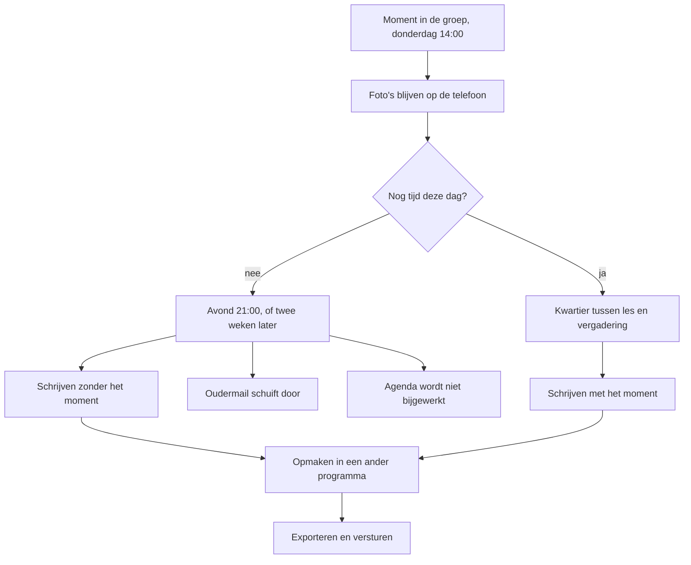

Het probleem is dus niet dat documenteren lang duurt, maar dat het budget te klein is voor drie taken die elkaar nodig hebben — waardoor alle drie te laat gebeuren en de duurste bovendien in kwaliteit achteruitgaat naarmate hij later gebeurt.

### 1.2 Missie

EduFlow geeft pedagogische professionals in het Nederlandse funderend onderwijs en de kinderopvang de tijd terug die nu opgaat aan het opschrijven, opmaken en uitleveren van wat zij al weten, zodat een documentatie kan ontstaan op de dag van het moment in plaats van twee weken erna. De app neemt het schrijfwerk over rond drie terugkerende taken — pedagogische documentatie, de schooljaaragenda en oudercommunicatie per mail — en laat de professional de regie houden over elk woord dat naar buiten gaat. De missie is gehaald wanneer de mediaan van de documentatieketen ten hoogste 60% is van de nulmeting uit §1.6, gemeten met hetzelfde protocol, terwijl er geen enkele naam, foto of bestandsnaam de school heeft verlaten die daar niet uit mocht.

Die zin is zo gebouwd dat je hem kunt afkeuren.

**"de tijd terug"** is een claim over minuten, niet over gevoel: een app die het werk aangenamer maakt maar niet korter, haalt de missie niet.

**"op de dag van het moment"** is de kwalitatieve helft. Tijdwinst die je gebruikt om nog steeds 's avonds te schrijven, verandert de documentatie niet; de winst moet groot genoeg zijn om het schrijfmoment te verplaatsen naar het kwartier tussen de les en de vergadering (zie §2.1.4).

**"drie terugkerende taken"** is een grens, geen opsomming. Er komt geen vierde bij in versie 1.0 (zie §2.3).

**"de regie houden over elk woord"** is de harde ondergrens: elk AI-resultaat is een voorstel en niets verlaat het apparaat zonder dat een mens op dat moment een knop indrukt. Die eis wint van elke andere eis in dit document (zie §2.2).

**"geen enkele naam, foto of bestandsnaam"** is meetbaar via het logboek: één aantoonbaar geval is genoeg om deze helft als niet gehaald te noteren.

De missie zegt met opzet niets over betere documentaties, want of een documentatie goed is hangt af van hoe goed er gekeken is. Wat de app wel kan, is het schrijven dicht genoeg bij het kijken houden om de details te bewaren.

### 1.3 Visie op vijf jaar

In schooljaar 2031-2032 ziet pedagogisch documenteren er zo uit voor wie met EduFlow werkt zoals bedoeld.

Het schrijven gebeurt op de dag zelf. Niet omdat de professional gedisciplineerder is geworden, maar omdat een keten van veertig minuten is teruggebracht tot een kwartier, en dat past tussen de les en de vergadering. De avond is weer avond.

De foto's staan niet meer stil op de telefoon; ze zijn de aanleiding geworden. De app toont ze één voor één met een vraag erbij, en het antwoord is de documentatie in ruwe vorm. De foto zelf blijft op het apparaat: in 2026 was dat een beperking, nu is het een werkwijze.

De reeks is normaal geworden. Een documentatie staat in een lijn — vier over hetzelfde kunstwerkproject, drie over hetzelfde onderzoek — en de app kent die lijn, zodat niemand bij de vierde hoeft terug te bladeren. Dat is de functie die het verschil maakt met een losse chatbot, en de reden dat mensen blijven.

Wat er naar buiten gaat is zichtbaar geworden: op het scherm, vlak voor verzending, in volledige vorm — de plek waar je merkt dat er een naam in je tekst staat die niet in je lijst stond. De schrijfstijl in de app is die van de gebruiker, niet omdat er een model getraind is maar omdat de app heeft gemeten hoe jij schrijft. En het schooljaar past op één scherm.

#### 1.3.1 Wat niet verandert

Deze lijst hoort bij de visie en is even bindend.

Het kijken blijft mensenwerk en wordt geen minuut korter. Een activiteit van vijfenveertig minuten duurt over vijf jaar nog steeds vijfenveertig minuten; de winst zit uitsluitend in de staart.

De keuze wát je vastlegt blijft een pedagogisch oordeel. De app stelt geen onderwerpen voor, signaleert geen achterstanden en wijst geen kinderen aan. Wie besluit dat het bouwwerk van Kjeld een documentatie waard is en de tekening van Pippa niet, is de professional — en daar blijft ook de verantwoordelijkheid voor wat er staat. Een tekst die de AI voorstelde en die jij overnam, is jouw tekst.

Het nalezen blijft: elke AI-tekst wordt gelezen voordat hij ergens heen gaat, en die minuten tellen mee in de meting. De AVG wordt evenmin eenvoudiger; het gesprek met het bestuur, de gegevensbeschermingseffectbeoordeling, de verwerkersovereenkomst en de FRIA-toets blijven bestaan en kosten doorlooptijd (zie hoofdstuk 15).

En het belangrijkste: een dunne observatie blijft een dunne observatie. AI maakt van drie slordige zinnen een gladde alinea, en dat is een risico en geen winst. Een documentatie die er goed uitziet en niets zegt, is schadelijker dan een documentatie die er slecht uitziet en iets zegt, want de eerste wordt geloofd. Daarom wordt de app niet beoordeeld op hoe mooi de uitvoer klinkt (zie hoofdstuk 20).

### 1.4 Wat EduFlow uitdrukkelijk niet is

Vier grenzen. Ze staan er niet uit bescheidenheid, maar omdat achter elke grens een verplichting ligt die het product zou breken.

| Grens | Waarom die grens er is | Wat er breekt als je hem overschrijdt |
|---|---|---|
| Geen leerlingvolgsysteem | Het dossier van een kind kent bewaartermijnen, overdrachtsregels en een verantwoordingsketen | De school gaat erop leunen; verwijderen wordt onmogelijk; je wordt schakel in een keten die je niet beheerst |
| Geen beoordelingsinstrument | Leerresultaten beoordelen en onderwijsniveau bepalen vallen onder hoog risico in de AI-verordening | Conformiteitsbeoordeling, kwaliteitsmanagementsysteem en formeel menselijk toezicht: werk voor een organisatie, niet voor één persoon |
| Geen communicatieplatform | Versturen betekent verantwoordelijk zijn voor bezorging, archief en bewijs | De belofte dat de app niets verstuurt wordt oncontroleerbaar, want het verzendrecht is dan aangevraagd |
| Geen chatbot | Een leeg invoerveld legt de last bij de gebruiker en levert generieke tekst | Zonder taakstructuur geen stabiele pseudonimisering, geen volledig controlescherm, geen toetsbare kwaliteit |

#### 1.4.1 Geen leerlingvolgsysteem

Een leerlingvolgsysteem is het dossier van een kind: toetsresultaten, ontwikkelingsperspectieven, handelingsplannen en de verantwoording daarvan, met wettelijke bewaartermijnen en een overdracht bij een overstap. EduFlow is dat niet en vervangt ParnasSys niet. De grens ligt niet bij wat technisch kan — een documentatie aan een leerling koppelen gebeurt al — maar bij de rol. Zodra de school EduFlow gaat zien als de plek waar het over een kind staat, wordt verwijderen onmogelijk, wordt de maker aansprakelijk voor volledigheid, en breekt het lokale-eerst-model, want een dossier dat op één laptop staat is geen dossier.

#### 1.4.2 Geen beoordelingsinstrument

EduFlow geeft geen cijfers, bepaalt geen niveaus, doet geen voorspellingen en bewaakt geen toetsen.

De juridische reden is de scherpste. Hoog risico in het onderwijs betreft vier dingen: toelating en plaatsing, het beoordelen van leerresultaten, het bepalen van onderwijsniveau, en het bewaken van gedrag tijdens toetsen. Wie één van die vier doet, valt onder bijlage III van de AI-verordening, met een risicomanagementsysteem, technische documentatie, logging, formeel geregeld menselijk toezicht en een conformiteitsbeoordeling als gevolg (zie hoofdstuk 15). Dat is werk voor een organisatie, niet voor één persoon met drie petten.

De pedagogische reden weegt even zwaar. Documentatie die beoordeelt, verandert wat je opschrijft: staat er een veld dat een niveau uitdrukt, dan wordt "Kjeld begon drie keer opnieuw" geen observatie meer maar een aanwijzing voor een score. Daarom sluit de grens ook de zachte varianten uit: geen sterretjes, geen voortgangsbalken, geen automatische samenvatting per leerling. Een signaal is een oordeel met een ander lettertype.

#### 1.4.3 Geen communicatieplatform

EduFlow leest je postbus en stelt een antwoord op; versturen doe je zelf. De app vraagt bij Microsoft en Google geen enkel verzendrecht aan, en dat is het hele punt: een belofte in een privacyverklaring is een belofte, maar een aanvraag waarin het verzendrecht ontbreekt is een feit dat Karin kan controleren in het toestemmingsscherm van de aanbieder, zonder de code te lezen.

Wat er breekt bij overschrijding is meer dan die controleerbaarheid. Versturen betekent verantwoordelijk zijn voor bezorging en archief, en het betekent een tweede plek waar mailgeschiedenis staat — wat botst met één bron van waarheid (zie §2.1.2). En het betekent een verzendknop: de plek waar op een druk moment een concept naar de verkeerde ouder gaat. De prijs staat in §2.1.1 en wordt niet weggemoffeld.

#### 1.4.4 Geen chatbot

Er is geen gespreksvenster met een knipperende cursor, geen algemene vraagfunctie en geen doorlopend gesprek. Niet omdat een gesprek onhandig is, maar omdat het drie dingen onmogelijk maakt. Pseudonimisering: codes met een stabiele nummering werken alleen binnen een afgebakende eenheid als één documentatie of één mail. Het controlescherm: "Bekijk wat er verstuurd wordt" toont de volledige opdracht, en bij een gesprek is dat de hele geschiedenis en daarmee onleesbaar. Toetsbaarheid: de kwaliteit wordt gemeten met een vaste set van invoer en verwachte uitkomst (zie hoofdstuk 20), en een open gesprek heeft geen verwachte uitkomst.

En in de praktijk het zwaarst: een chatbot lekt via de gebruiker. Een leeg invoerveld nodigt uit tot plakken, en wat er geplakt wordt is een oudermail met een achternaam, een telefoonnummer en de naam van een behandelaar. Precies daar gaat het nu mis, en een app die datzelfde invoerveld aanbiedt met een geruststellende naam erboven, maakt het probleem groter.

### 1.5 Doelgroep en context

Zes mensen bepalen of dit product werkt. Vier gebruiken het, twee laten het toe. Per persoon staat hieronder het moment in de week waarop EduFlow bestaat, want een app die niet in een bestaand moment past, wordt niet gebruikt.

| Persona | Apparaat | Het moment | Wat telt |
|---|---|---|---|
| Ilse (36) | Laptop | Donderdag 15:15-15:45 | `DOC`, schrijfmodus |
| Bram (52) | Laptop | Maandag 08:10-08:25 | `DAS` en `AGE` |
| Fatima (29) | Telefoon | Dagelijks 16:20-16:35 | `DOC`, gespreksmodus |
| Joost (44) | Laptop | Dinsdag 11:00-11:20 | Zoeken |
| Karin (58) | Laptop | Eén middag in september | Privacy |
| Maarten (41) | Laptop | Twee dagdelen per schooljaar | `INS` |

#### 1.5.1 Ilse — leerkracht groep 4, vier dagen

Om kwart voor drie is de les klaar, om kwart over drie begint de bouwvergadering. In dat half uur zet Ilse zes foto's om in één documentatie. Ze kiest de reeks Kunstwerk Dok, en de app weet dat dit de vierde is en wat er in de eerste drie stond. Ze typt vier zinnen zoals ze die altijd typt: kort, in de tegenwoordige tijd, met wat een kind letterlijk zei tussen aanhalingstekens. Ze laat de AI meeschrijven, neemt het voorstel over met aanvullen en wijzigt twee woorden. Ze bekijkt wat er verstuurd wordt, want dat is de tweede keer deze week dat er een naam in staat die niet in haar lijst stond. Daarna kiest ze een opmaak uit vier miniaturen, maakt een deelbare afbeelding, bevestigt één keer dat het beeld gedeeld mag worden, en kopieert hem in een mail.

Ilse is de maatstaf: past het bij haar niet in een half uur, dan klopt er iets niet.

#### 1.5.2 Bram — leerkracht groep 7, duobaan

Maandag tien over acht, vijftien minuten voor de kinderen komen. Bram wil twee dingen weten: wat heeft zijn duo donderdag en vrijdag gedaan, en wanneer valt de studiedag. Hij opent het Dashboard, ziet de laatste documentaties en de komende dagen, en klikt door naar de jaarweergave omdat het september is en die dan de standaard is. Binnen dertig seconden weet hij dat de studiedag op 6 oktober valt en dat de oudergesprekken een week naar voren moeten.

Bram schrijft weinig; hij leest. Eén beperking is voor hem echt: in versie 1.0 ziet hij alleen wat op zijn eigen apparaat staat, en wat zijn duo documenteerde komt via een exportbestand bij hem of niet.

#### 1.5.3 Fatima — pedagogisch medewerker BSO

Twintig over vier, buiten, kinderen nog aan het spelen, telefoon in de ene hand en een beker in de andere. Fatima komt niet aan een laptop toe; haar apparaat is de telefoon, en die staat op het beginscherm, want dat is de enige manier waarop haar werk een vakantie overleeft.

Ze opent gespreksmodus en kiest de vier foto's die ze net maakte. De app toont ze één voor één met een vraag erbij, en zij dicteert twee regels per foto met de microfoonknop van haar toetsenbord, want typen met één hand gaat niet. De foto's blijven op haar telefoon; alleen haar antwoorden gaan weg. Aan het eind bouwt de app daar een documentatie van die zo al goed genoeg is.

Bij Fatima staat de app in het Nederlands van de opvang: waar Ilse "Leerling" ziet, ziet zij "Kind". Dat is één instelling die alle schermteksten omzet, geen aparte versie van het product.

#### 1.5.4 Joost — intern begeleider

Dinsdag elf uur, twintig minuten voor het gesprek met de ouders van Kjeld. Joost wil weten wat er dit jaar over Kjeld is vastgelegd, en dat kan in drie groepen staan: zijn stamgroep, de projectgroep van het onderzoek en de zorggroep waar hij sinds november in zit. Hij zoekt op de naam, filtert op leerling en periode, krijgt zeven documentaties uit drie groepen en twee reeksen, leest ze en sluit de laptop.

Joost is de reden dat lidmaatschap een eigen entiteit met een looptijd is (zie §2.1.7) en dat zoeken ook door tekst, citaten, reeksnaam en gekoppelde namen gaat.

#### 1.5.5 Karin — functionaris gegevensbescherming

Karin gebruikt EduFlow niet. Haar moment is één middag in september 2026, met een werkende app op het scherm. Ze wil vier dingen zien: het controlescherm met een echte tekst erin, de lijst met rechten die de app aanvraagt zodat ze kan vaststellen dat het verzendrecht ontbreekt, het logboek, en de knop waarmee alles gewist wordt. Karin is daarmee geen obstakel maar een ontwerpeis: alles wat zij moet kunnen zien, bestaat als scherm. Haar akkoord staat in de Definition of Done, en de gegevensbeschermingseffectbeoordeling, de FRIA-toets en de verwerkersovereenkomst gaan vooraf aan het eerste echte kind in de app (zie hoofdstuk 15).

#### 1.5.6 Maarten — ICT-coördinator bij het bestuur

Maarten heeft twee dagdelen per schooljaar voor dit product, inclusief het moment waarop iemand belt dat het niet werkt. Zijn eisen zijn kort: geen app store, geen installatiebestand, geen beheeromgeving die hij onderhoudt, geen accounts die hij aanmaakt en reset. Wat hij wel doet: een toegangscode per apparaat uitgeven, de provider vastzetten op verwerking binnen de EU, en één keer per kwartaal in het logboek kijken.

#### 1.5.7 De bredere markt

De zes hierboven vormen de eerste kring: de eigen groep, het eigen team, de eigen school. Daarbuiten liggen drie kringen, in deze volgorde.

Het funderend onderwijs is de tweede kring: ruim zesduizend scholen in het primair onderwijs met in de orde van grootte van honderdvijftigduizend personeelsleden. Pedagogisch documenteren is daar geen verplichting maar wel een groeiende praktijk, sterk aanwezig bij scholen met een Reggio-, Jenaplan- of ontwikkelingsgerichte inslag; deze groep herkent het probleem uit §1.1 zonder uitleg.

De kinderopvang en de buitenschoolse opvang vormen de derde kring en passen inhoudelijk het beste: daar is documenteren wél onderdeel van de opdracht en gebeurt het vrijwel altijd met een telefoon in de hand. De taalinstelling van "Leerling" naar "Kind" is voor die markt de enige productwijziging die nodig is; Fatima is daar de maatstaf, niet Ilse.

De vierde kring is het bestuursniveau: uitrol over meerdere scholen, één providerkeuze, één verwerkersovereenkomst — de kring waarin `SyncService` van interface naar implementatie moet gaan. Die volgorde is niet omkeerbaar: een product dat begint bij het bestuur wordt ontworpen voor uitrol en niet voor het half uur van Ilse, en dan wint verantwoording van bruikbaarheid.

### 1.6 De belofte in getallen

De belofte is dat de mediaan van de documentatieketen met 40% daalt. Om die belofte te kunnen breken, moet er eerst een getal zijn dat niet meer te verplaatsen is.

#### 1.6.1 De nulmeting

De nulmeting bestaat uit twaalf documentaties die de maker met de hand tijdt, in de eerste vier schoolweken van 2026-2027, van 24 augustus tot en met 18 september 2026.

**De meting loopt parallel aan de eerste bouwstappen en houdt sprint 1 niet tegen** (T-44). Dat kan omdat de stappen 0 tot en met 9 van de implementatievolgorde — governance, bouwstraat, `lib/`, domeintypen, `StorageService`, de gebeurtenissenbus, `AuditService` en `SettingsService`, de leerlingen- en groepenservices, `PrivacyService` en `BackupService` — geen enkel bruikbaar documentatiescherm opleveren. De maker documenteert in die weken dus nog volledig op de oude manier, en de meting wordt niet beïnvloed door wat er gebouwd wordt. Vanaf stap 11, waar `DocumentationService` en `PageService` een werkend schrijfscherm mogelijk maken, moeten de twaalf metingen compleet en vastgelegd zijn.

De doelwaarde van veertig procent blijft onveranderd, en de nulmeting moet volledig zijn vastgelegd vóór de nameting begint. Een nulmeting die je aanpast nadat je het resultaat kent, is geen meting.

Per documentatie worden vijf fasen apart geklokt: overzetten, kiezen, schrijven, opmaken en uitleveren. De klok start bij de eerste handeling na het moment in de groep en stopt bij het bestand dat verstuurd kan worden. Genoteerd worden de tijd per fase, het aantal foto's, het aantal woorden en of er een reeks in het spel was. De uitkomst is één getal: de mediaan over twaalf documentaties, niet het gemiddelde, want één avond waarin de laptop vastliep verpest een gemiddelde. De ruwe metingen worden bewaard en gepubliceerd, ook als ze onwelgevallig zijn.

De nameting gebruikt hetzelfde protocol, dezelfde fasen en dezelfde persoon, over twaalf documentaties in vier opeenvolgende schoolweken na oplevering van de documentatiemodule. De doelwaarde is een mediaan van ten hoogste 60% van de nulmediaan. Agenda en mail krijgen elk een eigen nulmeting vóór hun sprint; alleen documentatie heeft een contractuele doelwaarde in versie 1.0.

#### 1.6.2 Meten zonder zelfbedrog

**Meet de hele keten, niet de leukste schakel.** Alleen de schrijffase meten is verleidelijk, want daar is de winst het duidelijkst. Die fase is de kleinste helft van het probleem (zie §1.1.1); wie alleen die meet, meet zijn eigen gelijk.

**Tel de nieuwe kosten mee.** Het controlescherm lezen kost tijd die in de nulmeting niet bestond, en de keuze aanvullen of vervangen kost een handeling. Die seconden staan in de nameting en worden niet weggeboekt als "went vanzelf".

**Tel de mislukkingen mee.** Een AI-voorstel dat je weggooit en waarna je opnieuw begint, is geen mislukte meting maar een meting. Alleen de geslaagde gevallen meten is de meest voorkomende vorm van zelfbedrog.

**Boek de inrichting apart en rapporteer hem.** De leerlingenlijst, de reeksen en het stijlvoorbeeld kosten samen twintig tot veertig minuten. Dat is eenmalig en hoort niet in de mediaan, maar wel in het verslag: anders wordt de belofte gedaan aan iemand die die veertig minuten nog voor zich heeft.

**Winst is niet hetzelfde als weglating.** Gaat het opmaken sneller omdat de app minder kan dan een tekstverwerker, dan is dat scopeverlies. De vraag is niet of het sneller ging, maar of het resultaat hetzelfde deed. En laat de meting nalezen: één persoon met drie petten controleert zichzelf alleen goed als die controle een aparte handeling is met een eigen, latere datum.

### 1.7 Succes en falen

#### 1.7.1 Waaraan je na een schooljaar ziet dat het werkt

Acht criteria, gemeten aan het eind van schooljaar 2026-2027, elk te beantwoorden met een getal of een gebeurtenis.

| # | Criterium | Norm |
|---|---|---|
| 1 | Tijd per documentatie | Mediaan van de nameting ten hoogste 60% van de nulmediaan |
| 2 | Volume bij gelijke tijd | Minstens 60 documentaties in het schooljaar, in minder totale tijd dan het jaar ervoor |
| 3 | Moment van schrijven | Minstens de helft ontstaat op de dag van het moment |
| 4 | Bruikbaarheid van de AI | Van de laatste 30 voorstellen wordt minstens 20 overgenomen zonder volledige herschrijving |
| 5 | Regie is echt gebruikt | Het stijlprofiel is minstens één keer door de gebruiker zelf gewijzigd |
| 6 | Privacy | Nul aantoonbare gevallen waarin een naam, foto of bestandsnaam de school verliet die er niet uit mocht |
| 7 | Back-up | Elke maand minstens één geslaagde export, en minstens één keer aantoonbaar teruggezet op een tweede apparaat |
| 8 | Overdraagbaarheid | Twee collega's gebruiken de app een maand lang zonder dat de maker erbij zit |

Criterium 8 is de zwaarste: zolang de maker de enige gebruiker is, is elke onduidelijkheid oplosbaar door de maker te vragen. Pas bij de tweede gebruiker blijkt of eenvoud een eigenschap van het product is of van de kennis in het hoofd van de bouwer.

#### 1.7.2 Faalscenario 1 — de AI schrijft niet zoals jij

Dit is het meest waarschijnlijke faalscenario en het is dodelijk, want een tekst die je volledig herschrijft kost meer tijd dan een tekst die je zelf typt.

Het vroege signaal is meetbaar vanaf de eerste week: elke interactie legt vast wat eruit kwam — overnemen, opnieuw of weggooien. Blijft de verhouding overnemen onder 50% over de laatste twintig interacties, dan is het mis. Een tweede signaal komt eerder en is subtieler: je merkt dat je het voorstel niet leest maar overslaat.

De tegenmaatregel heeft drie lagen: de gouden testset met drie tot vier paren van een ruwe notitie en de documentatie zoals die eruit hoort te zien (zie hoofdstuk 20), de drie leermechanismen, en een vooraf vastgelegde uitweg. Die uitweg luidt: blijft de overnameverhouding na tien werkweken onder 50%, dan gaat de AI-knop uit via de functieschakelaar. Wat overblijft is een documentatiegereedschap met opmaak, pagina's, export, agenda en zoeken, en dat bespaart nog steeds de achttien tot achtentwintig minuten uit §1.1.1 die niets met schrijven te maken hebben.

#### 1.7.3 Faalscenario 2 — de privacygesprekken lopen vast

Het vroege signaal komt in september 2026, in het eerste gesprek met Karin — niet dat zij bezwaren heeft, want dat hoort erbij, maar dat zij een vraag stelt die niet met een scherm te beantwoorden is. Een tweede signaal komt van het bestuur: het weigert een verwerkersovereenkomst met een AI-aanbieder te tekenen, of het antwoord blijft na zes weken uit.

De tegenmaatregelen liggen alle vier vóór het gesprek. Er wordt gebouwd en getest met een verzonnen groep van twintig kinderen, zodat een vastgelopen gesprek de bouw niet stopt. Het gesprek wordt gevoerd met een werkende app, want een controlescherm dat je kunt aanwijzen doet meer dan tien pagina's toelichting. De standaardprovider verwerkt binnen de EU, meestal het punt waarop het gesprek doorgaat of stopt. En loopt het toch vast: AI is een functieschakelaar per module, dus een bestuur dat AI niet toestaat krijgt EduFlow zonder AI, waarbij documentaties, opmaak, export, agenda en zoeken offline blijven werken.

#### 1.7.4 Faalscenario 3 — de app wordt een tweede administratielast

Dit scenario is het gemeenste, want tijdens de bouw ziet het eruit als succes: elke toegevoegde functie voelt als vooruitgang en de optelsom is een formulier.

Drie vroege signalen. Het gebruik daalt: in week zes maak je minder documentaties dan in week twee, terwijl er niets veranderd is aan je werk. Het aantal handelingen per documentatie stijgt terwijl de tijd niet daalt. En het derde is het duidelijkst en het minst meetbaar: je vult iets in omdat het veld er staat.

De tegenmaatregelen zitten in het ontwerp en niet in de discipline. Een documentatie ontstaat pas bij de eerste inhoud, dus leeg openen en weggaan laat geen lege regels achter. Er zijn geen statussen die je zelf moet zetten: de overgang van concept naar gedeeld volgt uit de eerste geslaagde export. Buiten de inhoud zijn er geen verplichte velden; titel, reeks en koppeling aan een leerling zijn alle drie optioneel, en het enige verplichte veld is verplicht omdat het zonder niet werkt: een mailconcept heeft een onderwerp. Elk nieuw veld gaat door de kostentoets uit §2.4 voordat het beschreven wordt.

En de harde regel: kost een scherm in de eerste maand meer dan één minuut per documentatie ten opzichte van de fase die het vervangt, dan gaat het scherm eruit. Niet vereenvoudigd, eruit.

### 1.8 Waarom nu

Dit product kon in 2022 niet gebouwd worden. Vier dingen zijn sindsdien veranderd, en alle vier zijn ze noodzakelijk.

| Wat veranderde | Waarom het doorslaggevend is |
|---|---|
| De schrijfkwaliteit in het Nederlands | Tot ongeveer 2024 herschreef je elk voorstel volledig, en dat kost meer tijd dan een leeg vel. De drempel is criterium 4 uit §1.7.1: twee van de drie voorstellen bruikbaar zonder herschrijving |
| Verwerking binnen de EU | In 2022 ging elke aanroep naar de Verenigde Staten, waarmee het gesprek met een functionaris gegevensbescherming op voorhand verloren was. Er zijn nu meerdere aanbieders met verwerking én opslag in een EU-regio |
| Er is een kader om je aan te houden | AI-verordening, digitale omnibus, SIVON Toetsingskader, AP-handreiking en Normenkader IBP zijn alle vijf van de laatste twee jaar. In 2022 was er geen lijst om af te vinken en dus geen manier om aan te tonen dat je het goed deed |
| De browser kan genoeg | IndexedDB met blobs, een betrouwbare schatting van het opslagverbruik, het deelmenu van de telefoon, dicteren via het toetsenbord en PDF-generatie in de app maken een lokaal-eerst product mogelijk zonder server voor de gegevens |

Het kader is hier geen belemmering maar een route: het beschrijft precies waar de grens tussen aanvaardbaar en hoog risico ligt, en dat is de grens waarlangs dit product ontworpen is.

#### 1.8.1 Waarom het niet kan wachten

De praktijk loopt vooruit op de regels. Collega's plakken nu al oudermails in een publieke chatbot, niet uit onverschilligheid maar omdat het werkt en er niets anders is. Elke maand zonder veilig alternatief is een maand waarin die gewoonte vaster wordt: een verbod verliest van een gewoonte, een alternatief dat er is wint ervan.

De transparantieverplichtingen uit artikel 50 gelden sinds 2 augustus 2026 en de markering van AI-uitvoer volgt op 2 december 2026. Wie nu bouwt, bouwt die verplichtingen in vanaf de eerste regel code; wie later bouwt, verbouwt ze erin, en dat is duurder en slechter.

De gegevensbeschermingseffectbeoordeling, de FRIA-toets en de verwerkersovereenkomst kosten doorlooptijd in maanden, en die begint pas als er iets te beoordelen valt: een werkende app. En 2026-2027 is de enige meetperiode van dit jaar, want de nulmeting kan alleen in de eerste weken van een schooljaar. Wie die weken laat lopen, meet pas in augustus 2027, en tot die tijd is elke uitspraak over tijdwinst een mening.

## 2. Productfilosofie

### 2.1 De tien uitgangspunten

Deze tien staan vast. Ze zijn geen richtlijn en geen streven, maar de toets waarlangs elk voorstel gaat: een idee dat er niet doorheen komt, wordt niet beschreven en dus niet gebouwd (zie §2.3).

| # | Uitgangspunt | Wat het in de praktijk betekent |
|---|---|---|
| U-01 | AI ondersteunt, en verstuurt nooit zelfstandig informatie naar derden | Elke uitgaande handeling is een menselijke handeling. De app vraagt technisch geen verzendrechten aan. |
| U-02 | Eén bron van waarheid | Elk gegeven staat op precies één plek. Afgeleide waarden worden berekend, niet gekopieerd. |
| U-03 | Geen dubbele businesslogica | Regels staan in de servicelaag, nooit in een scherm, nooit twee keer, nooit ook in een renderer. |
| U-04 | Desktop first | Het ontwerp begint bij 1280 px breed. De telefoon is een volwaardige, maar afgeleide weergave. |
| U-05 | Eenvoud boven complexiteit | Bij twijfel: de kleinere oplossing. Een functie die uitleg nodig heeft, is verkeerd ontworpen. |
| U-06 | Documentaties bestaan uit pagina's | `Page` is een eerste-klas entiteit met een eigen opslagrecord, geen opmaakgevolg. |
| U-07 | Meerdere groepen per leerling en per documentatie | Lidmaatschap is een eigen entiteit met een looptijd. Geen `groupId` op een leerling. |
| U-08 | Agenda, Documentaties en Mail vormen versie 1.0 | Plus Dashboard en Instellingen als dienende modules. Meer niet. |
| U-09 | AI leert van feedback en schrijfstijl | Lokaal, zonder modeltraining, zichtbaar en bewerkbaar voor de gebruiker. |
| U-10 | De gebruiker houdt altijd de regie | Elk AI-resultaat is een voorstel. Overnemen is een handeling. Alles is terug te draaien. |

#### 2.1.1 U-01 — AI ondersteunt en verstuurt nooit zelfstandig

**Betekenis.** Niets verlaat het apparaat zonder dat een mens op dat moment een knop indrukt. Geen instelling, geen belofte in een verklaring: het verzendrecht wordt technisch niet aangevraagd.

**Dwingt af.** De mailmodule vraagt alleen het recht om berichten te lezen en een concept in je eigen postbus te schrijven; `Mail.Send` en `gmail.send` staan niet in de aanvraag en dus ook niet in het toestemmingsscherm dat de gebruiker ziet. Er is geen verzendknop, en ook geen uitgestelde variant met een annuleerknop — dat is versturen met een pauze.

**Doet pijn.** Je hebt een concept af en moet dan naar Outlook, het openen en zelf verzenden: drie handelingen waar er één had gekund.

**Toets.** Kan dit idee informatie buiten het apparaat brengen zonder menselijke handeling op dat moment, of staat er een recht in de aanvraaglijst dat de app niet strikt nodig heeft? Eén keer ja is genoeg om af te wijzen.

#### 2.1.2 U-02 — Eén bron van waarheid

**Betekenis.** Elk gegeven staat op precies één plek. Wat je kunt afleiden, leid je af en sla je niet op.

**Dwingt af.** De status van een documentatie is geen veld dat iemand zet: concept en gedeeld volgen uit het bestaan van een geslaagde export. De reeksnaam is een verwijzing en geen voorvoegsel in de opgeslagen titel, zodat het hernoemen van een reeks negen documentaties tegelijk bijwerkt. Wat uit de lidmaatschappen volgt, wordt getoond als suggestie en niet weggeschreven.

**Doet pijn.** Het overzicht moet bij elk laden de afgeleide koppelingen uitrekenen; bij 1.000 documentaties is dat werk dat één gekopieerd veld had voorkomen. Dat los je op met een index in het geheugen, niet met een tweede opslagplek.

**Toets.** Als ik dit gegeven op twee plekken wijzig, kunnen ze dan uit elkaar lopen? Zo ja: welke is de waarheid, en waarom bestaat de andere nog?

#### 2.1.3 U-03 — Geen dubbele businesslogica

**Betekenis.** Een regel bestaat één keer, in een service. Niet in een scherm, niet in een component, niet ook nog in de renderlaag.

**Dwingt af.** Layout is data: één set layoutdefinities in millimeters op een A4-liggend canvas van 297 × 210 mm voedt zowel het scherm als de PDF, en de deelbare afbeelding wordt uit die PDF gerasterd. Daarmee bestaat de vraag "past dit blok nog op deze pagina" op precies één plek — `PageService` beslist, `RenderService` tekent.

**Doet pijn.** Het scherm mag de opmaak niet "even mooier" maken. Millimeters op een liggend A4 zien er op een breed scherm anders uit dan een ontwerper zou kiezen, en dat blijft zo.

**Toets.** Bestaat deze regel al ergens? Roep die aan. Zo niet: in welke service hoort hij thuis? Een regel in een React-component is per definitie fout, want modules bevatten alleen schermen en schermcomponenten.

#### 2.1.4 U-04 — Desktop first

**Betekenis.** Elk scherm wordt eerst ontworpen op 1280 px breed. De telefoon is volwaardig maar afgeleid: dezelfde gegevens, dezelfde services, één layout-implementatie.

**Dwingt af.** De jaarweergave bestaat alleen op de laptop en is daar tussen 1 juli en 15 september de standaardweergave. Rij-acties zitten achter een zichtbare knop met drie punten en niet achter lang indrukken, want lang indrukken bestaat niet op een laptop.

**Doet pijn.** Voor Fatima is het afgeleide scherm het enige scherm dat zij ooit ziet: haar belangrijkste route wordt ontworpen vanaf een apparaat dat zij niet gebruikt. Tegenmaatregel: vrijgeven na een test op een telefoon, nooit in een versmald venster.

**Toets.** Is dit scherm eerst op 1280 px ontworpen, en werkt het daarna op 390 px zonder een tweede layout-implementatie? Een tweede implementatie is verboden, ook als hij mooier is.

#### 2.1.5 U-05 — Eenvoud boven complexiteit

**Betekenis.** Bij twijfel de kleinere oplossing. Een functie die uitleg nodig heeft is verkeerd ontworpen, en een instelling is meestal een beslissing die iemand niet durfde te nemen.

**Dwingt af.** Geen automatische opmaakkeuze: je kiest zelf uit vier miniaturen. Geen naamherkenning: de leerlingenlijst houd je zelf bij. Beide waren goede ideeën die een uitlegtekst nodig hadden om vertrouwd te worden, en dat is precies het signaal.

**Doet pijn.** Zelf de lijst bijhouden kost werk in september en wordt in maart vergeten, en een naam die er niet in staat wordt niet vervangen. De prijs is dat het controlescherm het enige vangnet is en daarom compleet moet zijn: systeeminstructie, stijlprofiel, voorbeelden, reekscontext en je eigen tekst.

**Toets.** Kun je de functie in één zin uitleggen aan iemand die de app niet kent, zonder "en dan moet je"? Heeft hij een eigen instelling nodig om acceptabel te zijn? Dan is hij niet af.

#### 2.1.6 U-06 — Documentaties bestaan uit pagina's

**Betekenis.** `Page` is een eerste-klas entiteit met een eigen opslagrecord, een volgnummer en een `layoutId` — geen gevolg van opmaak, maar een ding dat je kunt toevoegen, verplaatsen en verwijderen.

**Dwingt af.** Kies je de layout met alleen beeld bij een documentatie die tekst bevat, dan verdwijnt die tekst niet maar krijgt hij een vervolgpagina, en dat kan alleen als een pagina een record is. De titel wordt op elke vervolgpagina herhaald: een eigenschap van de pagina, niet van de tekst.

**Doet pijn.** Het schrijfscherm is geen doorlopend tekstvak: je schrijft blokken die aan genummerde sloten worden toegewezen. Dit is de plek waar dit uitgangspunt het hardst tegen U-05 aan schuurt.

**Toets.** Kan de gebruiker dit terugvinden als "pagina 2 van 3"? Verandert het aantal pagina's als de opmaak verandert, en blijft de inhoud dan volledig?

#### 2.1.7 U-07 — Meerdere groepen per leerling en per documentatie

**Betekenis.** Lidmaatschap is een eigen entiteit met een begin- en een einddatum; een leerling heeft geen `groupId`. Een documentatie kan aan meerdere groepen hangen, en een expliciete koppeling wint van een afgeleide.

**Dwingt af.** Bij de jaarovergang worden lidmaatschappen afgesloten met een einddatum en niet verwijderd. Daardoor kan Joost in maart 2027 nog terugvinden wat er in september 2026 over Kjeld is vastgelegd; zonder looptijd is die vraag alleen te beantwoorden door de geschiedenis te vervalsen.

**Doet pijn.** Elk scherm dat "de groep van deze leerling" toont, moet een peildatum kiezen, en soms zijn er twee antwoorden. Ook de invoer is duurder: iemand aan een groep toevoegen is een lidmaatschap maken met een datum.

**Toets.** Gaat dit scherm uit van één groep per leerling? Dan is het fout. Welke peildatum hanteert het, en staat die zichtbaar op het scherm?

#### 2.1.8 U-08 — Agenda, Documentaties en Mail vormen versie 1.0

**Betekenis.** Drie kernmodules plus Dashboard en Instellingen als dienende modules. Wat in geen van de vijf past, is geen versie-1.0-functie.

**Dwingt af.** Geen koppeling met Momento zolang er geen officiële programmeerkoppeling is, want de enige alternatieve route zou browserautomatisering zijn en die is verboden. Geen synchronisatie met een externe agenda; wel ICS-import en ICS-export, want dat is een bestand en geen koppeling.

**Doet pijn.** De meest gevraagde functies liggen vrijwel altijd net buiten de lijn. Delen met een duo-collega valt onder `SyncService` en dus onder fase 2: Bram krijgt in versie 1.0 alleen wat op zijn eigen apparaat staat, en dat wordt niet weggeschreven als "later beter".

**Toets.** In welke van de vijf modules valt dit? In geen enkele: buiten versie 1.0. In twee of meer: dan is het waarschijnlijk een doorsnijdend onderdeel en hoort het bij Privacy, AI, Zoeken, Back-up of de eerste-keer-ervaring.

#### 2.1.9 U-09 — AI leert van feedback en schrijfstijl

**Betekenis.** Drie mechanismen, alle drie lokaal en zichtbaar: gemeten stijlkenmerken, selectie van gelijkende eerdere teksten als voorbeeld, en correctieregels. Er wordt geen model getraind en ook niet bijgesteld.

**Dwingt af.** Het stijlprofiel is een leesbaar bestand in Instellingen dat je kunt lezen, wijzigen en wissen. Een correctieregel ontstaat pas nadat jij hem bevestigt: haal je hetzelfde woord drie keer weg, dan stelt de app voor het op de vermijdlijst te zetten. De app zet er zelf niets op.

**Doet pijn.** Leren gaat traag: de eerste twintig documentaties leveren een dun profiel op, en juist dan moet je het meeste herschrijven. Bovendien maakt elk geleerd kenmerk het controlescherm langer.

**Toets.** Kan de gebruiker zien wat de app geleerd heeft, en het wijzigen en wissen? Gaat er iets naar een provider met het doel te trainen? Dan is het fout, ongeacht wat die provider belooft.

#### 2.1.10 U-10 — De gebruiker houdt altijd de regie

**Betekenis.** Elk AI-resultaat is een voorstel, overnemen is een handeling, en alles is terug te draaien.

**Dwingt af.** "Overnemen" vraagt aanvullen of vervangen en zet een herstelpunt vóór de wijziging; autosave met vertraging mag dat herstelpunt niet overschrijven. Verwijderen is markeren en nooit wissen. Het controlescherm toont de volledige opdracht en geen samenvatting, want een samenvatting is een oordeel van de app over wat jij mag zien.

**Doet pijn.** Regie kost handelingen, en handelingen kosten seconden die tegen de belofte uit §1.6 in werken. Het controlescherm lezen kost tijd die in de nulmeting niet bestond, en die tijd wordt meegeteld in de nameting.

**Toets.** Kan de gebruiker deze handeling terugdraaien, en zo nee, is dat vooraf expliciet gemaakt? Gebeurt er iets zonder dat de gebruiker het heeft aangeraakt? Dan is het fout, ook als het handig is.

### 2.2 De hiërarchie van uitgangspunten

Uitgangspunten botsen. Zonder rangorde wint bij elke botsing het uitgangspunt waar de bouwer op dat moment het meest voor voelt, en dan is er geen kader maar een stemming. De rangorde staat daarom vast.

| Rang | Uitgangspunten | Waarom hier |
|---|---|---|
| 1 | U-01, U-10 | Onomkeerbare schade. Een verkeerd verstuurde tekst haal je niet terug. |
| 2 | U-02, U-03 | Gegevens en regels die uit elkaar lopen leveren fouten op die je maanden later ontdekt. |
| 3 | U-06, U-07 | Het datamodel is het duurst om achteraf te veranderen. |
| 4 | U-08 | Scope beschermt de oplevering tegen goede ideeën. |
| 5 | U-09 | Waardevol, maar de app werkt zonder. |
| 6 | U-04 | Een startpunt voor het ontwerp, geen belofte aan de gebruiker. |
| 7 | U-05 | De scheidsrechter als niets hierboven beslist. |

U-05 staat onderaan, en dat betekent niet dat eenvoud onbelangrijk is. Het betekent dat eenvoud bijna nooit als enige in het geding is. Beslist geen enkel hoger uitgangspunt, dan beslist U-05, en dan is hij absoluut.

#### 2.2.1 Desktop first tegen gespreksmodus op de telefoon

U-04 zegt dat het ontwerp begint op 1280 px, maar gespreksmodus bestaat alleen op 390 px, in de hand van iemand die buiten staat. Ontwerp je die vanaf de laptop, dan krijg je een gespreksvenster in een kolom — precies het patroon dat met één hand niet werkt.

U-04 wint voor de plaats in de navigatie, de gegevensstructuur en de layout-implementatie. De interactie wint voor de telefoon: één foto tegelijk, groot, met het antwoordveld eronder, en op de laptop dezelfde opbouw gecentreerd in een kolom van 640 px. De acceptatietest draait op een telefoon, want U-04 beschermt tegen twee layout-implementaties en niet tegen een interactie die van één apparaat komt. **De regel is: een telefoonspecifieke interactie mag, een tweede layout-implementatie nooit.**

#### 2.2.2 Eenvoud tegen AI die van feedback leert

U-09 brengt vier begrippen mee die de gebruiker in principe moet snappen: stijlprofiel, vermijdlijst, voorbeeldselectie en correctievoorstel. U-05 zegt dat een functie die uitleg nodig heeft verkeerd ontworpen is. U-09 wint op het bestaan, U-05 op de vorm. Het profiel bestaat, maar niemand hoeft ervan te weten om de app te gebruiken: het staat op één scherm in gewone zinnen — "Je schrijft gemiddeld 14 woorden per zin" — met drie knoppen, en met één schakelaar voor alle drie de mechanismen samen. Dat kost fijnregeling, want voorbeeldselectie is niet apart uit te zetten. **De regel is: heeft een lerend mechanisme een eigen instelling nodig om acceptabel te zijn, dan is het mechanisme niet goed genoeg.**

#### 2.2.3 Eén bron van waarheid tegen lokaal-eerst

Lokaal-eerst betekent dat dezelfde documentatie via export en import op twee apparaten kan staan. Dan zijn er twee exemplaren, en U-02 zegt dat elk gegeven op precies één plek staat. U-02 wint, maar op recordniveau en niet op apparaatniveau. Elk record heeft een sleutel als UUIDv7 plus `rev`, `origin`, `updatedAt` en `deletedAt`, en een geïmporteerd record met dezelfde sleutel is hetzelfde record en geen kopie. Bij import beslist één vaste regel welke versie wint: de hoogste `rev`, bij gelijke `rev` de hoogste `updatedAt`, bij gelijke `updatedAt` het record met het `origin` van het importerende apparaat. De verliezer wordt zichtbaar bewaard als conflictkopie. Dat kost iets: importeren is nooit "gewoon toevoegen" maar altijd een samenvoeging met een zichtbare uitkomst. **De regel is: twee apparaten mogen dezelfde gegevens hebben; twee records met verschillende sleutels mogen nooit hetzelfde ding beschrijven.**

#### 2.2.4 De gebruiker houdt de regie tegen zo min mogelijk klikken

"Zo min mogelijk klikken" is geen uitgangspunt, maar wel de belofte uit §1.6, en elke bevestiging kost een handeling. U-10 wint altijd, maar met een grens aan hoe vaak hij zich laat gelden. **De regel is: bevestig alleen wat onomkeerbaar is of wat informatie naar buiten brengt; al het andere draai je terug in plaats van het vooraf te bevestigen.**

Toegepast: "Overnemen" houdt de vraag aanvullen of vervangen, want dat is een inhoudelijke keuze en geen bevestiging. Weggooien krijgt géén bevestigingsvenster, want verwijderen is markeren. De toestemming voor beeldgebruik komt één keer per documentatie bij de eerste deelbare afbeelding en niet nog eens bij de tweede, want die voegt geen afweging toe. Autosave vraagt nooit iets.

#### 2.2.5 AI ondersteunt tegen de postbus lezen

Dit is de scherpste botsing in het product. U-01 zegt dat de app geen informatie naar derden brengt, maar om een oudermail samen te vatten gaat de inhoud van een bericht naar een AI-provider — geschreven door iemand die nooit met EduFlow heeft ingestemd en die niet weet dat het gebeurt. U-01 wint, en dat maakt het lezen duur. Een bericht wordt alleen opgehaald als je het opent, nooit vooruit en nooit in de achtergrond, en de cache vervalt na 7 dagen. Elke ontvangen mail gaat door `PrivacyService` vóór het samenvatten, inclusief afzendergegevens en handtekening, en het controlescherm toont de gepseudonimiseerde tekst voordat er iets weggaat. Samenvatten start nooit vanzelf bij het openen; het is een knop die je indrukt, per bericht. Dat kost het overzicht: je kunt niet je hele postvak laten samenvatten en je krijgt geen dagelijkse samenvatting. **De regel is: gegevens van iemand die niet je gebruiker is, gaan alleen naar een derde na een handeling van je gebruiker, op één bericht tegelijk, gepseudonimiseerd en zichtbaar.**

### 2.3 Scope-discipline

Wat niet beschreven staat, wordt niet gebouwd. Die regel geldt ook omgekeerd: wat beschreven staat, wordt gebouwd, anders is de beschrijving een wenslijst en verliest de eerste regel zijn kracht.

De reden dat deze regel hier zwaarder weegt: één persoon draagt drie petten. Er is geen product owner die nee zegt tegen de ontwikkelaar, want dat is dezelfde persoon op een andere dag. De beschrijving ís de nee.

Een goed idee dat buiten scope valt, doorloopt vijf stappen.

1. Het gaat in één zin naar het ideeënregister, met datum en aanleiding.
2. Het wordt niet gebouwd. Ook niet "even", ook niet als het tien regels code lijkt: tien regels zijn nooit tien regels, maar tien regels plus een test, plus een schermtekst, plus een regel in de privacyverantwoording, plus onderhoud tot het einde van het product (zie §2.4).
3. Het register wordt op één moment gelezen: bij het vaststellen van de volgende versie-afbakening. Niet tussendoor, en niet op een avond waarop het bouwen tegenzit.
4. Een idee dat drie keer uit de praktijk terugkomt, is geen idee meer maar een gemis, en krijgt voorrang bij de volgende afbakening.
5. Een idee dat een uitgangspunt schendt, gaat naar het besluitenregister met de reden waarom het niet kan (zie hoofdstuk 19). Anders komt het elk halfjaar opnieuw langs.

De uitzondering die geen uitzondering is: een fout in iets dat beschreven staat, repareer je meteen, want een fout is geen nieuwe functie. Het onderscheid is scherp genoeg om alleen te hanteren: staat het gedrag beschreven en doet de app het anders, dan is het een fout; doet de app precies wat er staat en bevalt dat niet, dan is het een gemis en gaat het naar het register.

### 2.4 De kostenkant van een functie

Een functie kost niet wat hij kost om te bouwen. Hij kost vijf dingen, en de bouw is meestal de kleinste.

| As | Wat het is | Hoe je het schat |
|---|---|---|
| Bouw | Ontwerp, code en de eerste tests | Uren, eenmalig |
| Onderhoud | Meebewegen met alles wat verandert zolang het product bestaat | Percentage van de bouwtijd per jaar; reken met 25% |
| Uitleg | Schermtekst, plek in de eerste-keer-ervaring, de vraag van een collega | Aantal zinnen dat iemand moet lezen om de functie te begrijpen |
| Testwerk | Eenheidstests, schermtests, gouden testset, foutpaden | Aantal nieuwe testgevallen, inclusief de gevallen waarin het misgaat |
| Privacyverantwoording | Wat gaat er extra de deur uit en wat moet Karin daarvan kunnen zien | Aantal nieuwe gegevenssoorten richting een derde |

Een functie komt pas in scope als alle vijf de assen zijn ingevuld. Een lege as is geen nul; een lege as betekent dat er niet over nagedacht is. En als één as een uitgangspunt schendt, hoef je de andere vier niet meer in te vullen.

#### 2.4.1 Automatische opmaakkeuze — afgewezen

Het idee: de app kiest de layout uit de inhoud. Veel foto's en weinig tekst wordt een fotoraster, veel tekst wordt de verhaallayout, één foto wordt groot beeld, geen tekst wordt alleen beeld. De miniaturen blijven staan om te overrulen.

Bouw: laag, ongeveer een dagdeel. Onderhoud: hoog, want de regel moet meebewegen met elke wijziging aan een layout en met de vervolgpagina bij alleen beeld. Uitleg: hoog, want als de app kiest en jij kiest anders, moet je begrijpen waarom hij koos, anders vertrouw je hem niet. Testwerk: hoog — vier layouts maal fotoaantal maal tekstlengte maal wel of geen citaten, plus het geval waarin je overrulet en daarna nog een foto toevoegt. Privacy: nul.

Uitkomst: de functie bespaart één tik op een miniatuur die je toch al bekijkt, en daar staan een uitlegtekst, een regel die met elke layoutwijziging meemoet en een testmatrix tegenover. Afgewezen.

#### 2.4.2 Naamherkenning — afgewezen

Het idee: hoofdletters midden in een zin die niet in de leerlingenlijst staan en die geen gewoon Nederlands woord zijn, worden aangeboden met de vraag "Is dit een naam?". Zeg je ja, dan staat hij er voortaan in.

Bouw: middel. Onderhoud: hoog, want je hebt een onderhouden lijst van gewone Nederlandse woorden nodig. Uitleg: hoog, want de gebruiker moet begrijpen dat "nee" niet betekent dat de vraag nooit meer komt. Testwerk: hoog en principieel niet af te ronden, want je kunt niet aantonen dat er geen naam gemist wordt.

De privacy-as is hier de duurste, en dat is contra-intuïtief bij een functie die privacy zegt te verbeteren. Een functie die aankondigt namen te herkennen, verschuift de verantwoordelijkheid van de gebruiker naar de app terwijl de app het niet kan garanderen. Karin vraagt dan terecht naar de foutmarge, en die is niet te geven: Roos en Sam zijn gewone Nederlandse woorden en komen als naam in dezelfde groep voor. Het resultaat is een vangnet dat je niet mag beloven en waar mensen wel op gaan leunen. Afgewezen: de lijst blijft handwerk en het controlescherm blijft het vangnet.

#### 2.4.3 Volledige mailclient — afgewezen

Het idee: als je toch de postbus leest, kun je net zo goed mappen tonen, zoeken, markeren als gelezen, archiveren en versturen.

De privacy-as is meteen fataal: versturen betekent het verzendrecht aanvragen, en dat breekt U-01 en de technische garantie eronder in één beweging. Daarmee is de afweging klaar en hoeven de andere vier assen niet meer geschat te worden — al zouden ze alle vier zeer hoog uitvallen, met twee aanbieders die elk een eigen koppeling hebben die jaarlijks wijzigt. Afgewezen op de eerste as.

### 2.5 Bouwvolgorde als filosofie

De bouwvolgorde is geen planning maar een uitspraak over wat je durft te beloven. De regel eronder: bouw eerst wat een belofte waarmaakt, dan pas wat die belofte doet.

#### 2.5.1 Instellingen vóór documentatie

Instellingen is de saaiste module en hij komt eerst. Niet het geheel, maar precies het deel dat documentatie nodig heeft: leerlingen, groepen, reeksen, het stijlvoorbeeld en de standaardwaarden.

De reden is dat de bescherming zonder die gegevens stilzwijgend niets doet. Is de leerlingenlijst leeg, dan vindt `PrivacyService` niets om te vervangen, gaat de tekst integraal naar de provider, en komt er geen foutmelding. Een beveiliging die geruisloos niet werkt is erger dan geen beveiliging, want je vertrouwt erop. Daarom staat er een zichtbare grendel op: geen AI-aanroep bij een lege lijst zonder dat je dat één keer bewust hebt bevestigd.

Dezelfde redenering geldt voor het stijlvoorbeeld, de richtlijn waarop de AI stuurt. Zonder dat voorbeeld levert de AI generieke tekst, en die herschrijf je volledig — precies faalscenario 1 uit §1.7.2, veroorzaakt door een bouwvolgorde in plaats van door de techniek.

#### 2.5.2 Back-up vóór de eerste echte gebruiker

Export én import zitten in de eerste oplevering en niet in versie 2. Een export die je niet kunt terugzetten is geen back-up maar een afdruk.

De aanleiding is concreet. Een documentatie leeft op één apparaat, en op de iPhone wist de browser de opslag na zeven dagen zonder gebruik van de site tenzij de app op het beginscherm staat — twee weken vakantie is genoeg. De eerste echte gebruiker is de maker zelf, en die krijgt de app niet in handen zonder een geteste terugzetroute.

Dezelfde regel geldt voor de functieschakelaars per module: die komen vóór de tweede module. Zonder schakelaar wordt "het staat er al maar het werkt nog niet" de normale toestand van het product, en dan is er geen moment meer waarop iets af is.

### 2.6 Beslissen bij onzekerheid

De werkwijze bestaat uit drie handelingen die altijd samen gebeuren: neem het besluit, schrijf het op in het besluitenregister, en zet er een herzieningsmoment bij.

Wachten is ook een besluit, maar dan zonder datum en zonder eigenaar. Een open vraag in een specificatie kost bij elke lezing opnieuw aandacht en levert bij elke lezing een net iets ander antwoord, en na drie maanden weet niemand meer welk antwoord er gold toen er code omheen werd geschreven. Daarom staat er in dit document geen enkele open vraag en geen enkel "waarschijnlijk".

Een registratie is compleet als hij zes dingen bevat: het nummer, de datum, het besluit in één zin, het probleem dat eraan voorafging, de reden voor deze richting en niet de andere, en het gevolg voor de rest van het product (zie hoofdstuk 19).

Het herzieningsmoment is een datum of een gebeurtenis, nooit "later". Drie voorbeelden zoals ze in het register staan:

- De providerkeuze wordt herzien zodra een aanbieder rechtstreekse verwerking binnen de EU levert die het bestuur accepteert.
- Het besluit dat een documentatie op één apparaat leeft, wordt herzien bij het vaststellen van fase 2, uiterlijk 1 juli 2027.
- De doelwaarde van 40% wordt herzien na de nameting, uiterlijk 1 juli 2027.

Een herziening vraagt nieuwe informatie. Geen nieuwe informatie, geen herziening — ook niet als het besluit ongemakkelijk uitpakt. Ongemak is geen informatie.

Een besluit dat achteraf fout blijkt, wordt vervangen en niet verwijderd: het oude blijft leesbaar staan met de reden waarom het verviel, want een verwijderd besluit komt na een jaar terug als goed idee.

En omdat één persoon drie petten draagt, is de zelfcontrole een formele stap met een eigen datum. Een besluit dat je alleen neemt, controleer je met een checklijst op een latere dag dan je het nam. Dat is geen gebaar maar een eis: dezelfde dag betekent hetzelfde hoofd.

Elk besluit in dit document is definitief tot het herzien is. Twijfel hoort in het herzieningsmoment, niet in de zin.

---

## 3. AI-filosofie

### 3.1 AI als collega die meeschrijft, niet als schrijver

Er zit een collega naast je. Je hebt zes foto's gemaakt en drie regels getypt, en die collega
leest mee. Ze zegt niet: ik doe het wel. Ze zegt: zal ik er dit van maken. Dan schuift ze een vel
papier naar je toe. Jij leest het, streept door wat er niet klopt en typt het laatste stuk zelf.
Het vel papier is nooit vanzelf jouw tekst geworden.

Dat beeld bepaalt de vorm van elke AI-interactie in EduFlow, tot in de knoplabels. De knop heet
**Laat AI meeschrijven**, niet "Schrijf voor mij". Het resultaat heet een voorstel, niet een tekst
en niet een verbetering, en het komt in een eigen blok onder je eigen tekst, nooit erin.

Uit die houding volgen zes regels voor de toon van elk AI-onderdeel.

- **Geen persoon.** Geen naam, geen gezicht, geen gespreksbubbels, nooit "ik". Een persona nodigt
  uit tot vertrouwen dat de uitvoer niet heeft verdiend en maakt onduidelijk wie verantwoordelijk
  is voor wat er naar ouders gaat. Dat ben jij.
- **Geen voldongen feit.** Nergens staat "AI heeft je tekst verbeterd". Er staat "Voorstel", met
  eronder **Overnemen**, **Opnieuw** en **Weggooien**.
- **Geen complimenten en geen overbodige vragen.** Geen "goed bezig". De AI vraagt alleen wat hij
  voor de taak nodig heeft; in Gespreksmodus is dat één vraag per foto (B-03).
- **Geen zekerheidstaal.** Geen "dit is een sterke documentatie", geen "ik weet zeker". Dat is een
  fout in de uitvoer, geen stijl.
- **Altijd zichtbaar dat het AI is.** Elk voorstel is in het scherm zelf gemarkeerd. Zo vult
  EduFlow de transparantieverplichting in: in de handeling, niet in een kleine letter onderaan
  (zie hoofdstuk 15).

De vergelijking is begrensd. Een collega die meekijkt bij documentatie over kinderen heeft een
geheimhoudingsplicht en een oordeel over wat opgeschreven hoort te worden; een taalmodel heeft dat
niet. De AI mag daarom meeschrijven, maar niet meedenken over het kind (§3.3 en §3.4). Hoe dat
technisch is dichtgezet staat in hoofdstuk 12.

### 3.2 De vijf AI-wetten van EduFlow

Deze vijf wetten gaan boven elke andere AI-keuze. Een functie die ermee botst wordt niet gebouwd,
ook niet als hij handig is. Ze heten `AIW-1` tot en met `AIW-5`.

| Wet | Regel in één zin |
|---|---|
| `AIW-1` | AI stelt voor en voert niet uit. |
| `AIW-2` | AI is transparant over wat het verstuurt. |
| `AIW-3` | AI verstuurt nooit naar derden. |
| `AIW-4` | AI beoordeelt geen kinderen. |
| `AIW-5` | AI die stil faalt is erger dan AI die niet werkt. |

#### 3.2.1 AIW-1 — AI stelt voor en voert niet uit

Elk AI-resultaat is een voorstel dat pas tekst wordt door een menselijke handeling. Er bestaat
in EduFlow geen situatie waarin je documentatie verandert zonder dat jij daarop hebt geklikt of
getikt. Dit is de dagelijkse invulling van U-10.

Ontwerpgevolgen:

- Het voorstel verschijnt in een eigen blok onder je tekst; je tekstveld en je cursor blijven
  onaangeroerd (zie §4.5).
- **Overnemen** is de enige route van het voorstel naar je tekst. Er is geen instelling "altijd
  overnemen" en die komt er ook niet.
- Alleen een knop start een aanroep: niet het openen van een scherm, niet opslaan, niet
  exporteren. Een lopende aanroep is altijd te annuleren en laat dan niets achter.
- Correctie tijdens het typen bestaat niet. Geen woord dat onder je handen verandert, geen
  achtergrondtaak die je tekst bijwerkt.
- Na **Overnemen** volgt altijd ongedaan maken (T-07, zie §4.8).

#### 3.2.2 AIW-2 — AI is transparant over wat het verstuurt

Vóór elke aanroep kun je de volledige opdracht lezen: de systeeminstructie, het stijlprofiel, de
gekozen voorbeelden, de reekscontext en je eigen tekst. Niet samengevat, maar letterlijk, met de
codes uit `PrivacyService` erin. Dat is wat **Bekijk wat er verstuurd wordt** laat zien.

Ontwerpgevolgen:

- De link staat naast elke AI-knop, in beeld, niet in een menu.
- Paneel en aanroep komen uit dezelfde bron: `PromptService.build()` levert één object, het paneel
  toont het en `AIService.run()` verstuurt het. Wat niet in het paneel staat, gaat niet mee; een
  toevoeging op een andere plek is een fout die de bouw blokkeert. Dit is U-03 op de AI-laag.
- Het paneel toont ook provider, model, regio van verwerking en bewaartermijn. Karin, de
  functionaris gegevensbescherming, moet dit scherm kunnen openen en niets hoeven vragen.
- Het paneel is te kopiëren met **Kopieer**.

#### 3.2.3 AIW-3 — AI verstuurt nooit naar derden

De AI in EduFlow heeft precies één route naar buiten: van de eigen server naar de gekozen provider,
met één opdracht, en terug met tekst. Verder niets: geen mail, geen deelactie, geen opslag bij een
derde, geen aanroep van een andere dienst.

Ontwerpgevolgen:

- De aanroep gebruikt geen gereedschappen en geen functieaanroepen; het model kan alleen tekst
  teruggeven.
- De server heeft één toegestane uitgaande bestemming: het adres van de actieve adapter. Al het
  andere uitgaande verkeer is geblokkeerd, en dat is te controleren.
- De app vraagt bij Microsoft of Google geen enkel verzendrecht aan (B-20). De eindhandeling in
  Mail is **Als concept in je mailprogramma** of **Kopieer**. Er is geen verzendknop.
- Foto's, blobs en bestandsnamen gaan nooit mee (zie §3.11).
- Er staan geen scripts van derden in de app en geen meetdienst van buiten (T-18).

#### 3.2.4 AIW-4 — AI beoordeelt geen kinderen

EduFlow beschrijft wat er gebeurde. Hij zegt niet wat een kind kan, is, wordt of nodig heeft.
Geen cijfers, geen niveaus, geen vergelijkingen tussen kinderen, geen voorspellingen, geen
signalen in de trant van "let op dit kind", geen ontwikkelingsconclusies (B-25).

Ontwerpgevolgen:

- De interpretatiegrendel uit §3.3 is een harde controle op de uitvoer, geen verzoek in de
  instructie.
- Er bestaat geen veld waarin een niveau, een score of een vinkje "beheerst" past.
- De reekscontext levert eerdere tekst, geen voortgang: de documentaties uit **Kunstwerk Dok**,
  niet een lijn "hoe gaat het met Kjeld".
- De gouden testset bevat invoer die uitnodigt tot een oordeel, met als verwachte uitkomst dat het
  oordeel er niet komt (zie hoofdstuk 17 en 20).
- Dit is ook de reden dat EduFlow buiten de hoog-risicocategorie blijft (zie hoofdstuk 15).

#### 3.2.5 AIW-5 — AI die stil faalt is erger dan AI die niet werkt

Een assistent die niet werkt kost je een handeling: je schrijft het zelf. Een assistent die
stilletjes iets verkeerds doet, kost je vertrouwen in alles wat hij eerder deed. Stil falen heeft
hier vijf vormen: een leeg antwoord dat als voorstel wordt getoond, een afgekapt antwoord dat er af
uitziet, een naam die niet vervangen bleek, een onopgemerkte terugval naar een ander model, en een
vermijdregel die maar half is toegepast.

Ontwerpgevolgen:

- Elke aanroep krijgt een zichtbare uitkomst. Er bestaat geen knop die niets doet.
- Een antwoord dat een grendel uit §3.3 niet haalt, wordt niet als voorstel getoond maar als
  melding met de reden en met de knop **Opnieuw**.
- Een code in het antwoord die niet in de `PseudonymMap` van deze aanroep voorkomt, blokkeert
  **Overnemen**. Zo'n code betekent dat het model iets heeft verzonnen dat op een naam lijkt.
- Terugval naar een kleiner model wordt boven het voorstel gemeld (zie §3.9).
- Elke aanroep komt met uitkomst en duur in het logboek (`AuditEvent`), lokaal en leesbaar.

### 3.3 Wat AI wel en niet mag herschrijven

Dit is het inhoudelijke hart van EduFlow. Twee eisen die allebei waar moeten zijn spreken elkaar op
het eerste gezicht tegen: de AI maakt van een losse observatie een lopende tekst, én de AI
herschrijft je stijl niet. Structureren ís herschrijven. Zonder toetsbare grens is elke uitspraak
over kwaliteit een mening.

De spanning wordt niet weggepraat maar opgeknipt. Er zijn zes bewerkingen die je op een tekst kunt
uitvoeren: drie mogen altijd, één mag begrensd, twee mogen nooit.

| # | Bewerking | Wat het is | Mag |
|---|---|---|---|
| 1 | Ordenen | Volgorde herstellen, losse regels in alinea's zetten, chronologie rechttrekken | Ja |
| 2 | Verbinden | Voegwoorden, lidwoorden en verwijswoorden toevoegen zodat er zinnen ontstaan | Ja |
| 3 | Corrigeren | Spelling, interpunctie, verbuiging, dubbele woorden | Ja |
| 4 | Herformuleren | Andere woordkeuze of zinsbouw voor hetzelfde feit | Begrensd |
| 5 | Toevoegen | Feiten, oordelen, emoties of conclusies die er niet stonden | Nee |
| 6 | Weglaten | Feiten, citaten, namen of getallen die er wel stonden | Nee |

Bewerking 4 is de enige waar oordeelsvorming bij komt kijken, en dus de enige die een getal
nodig heeft. Dat getal komt uit de grendels hieronder.

#### 3.3.1 De vijf grendels

Elke AI-uitvoer die als voorstel in beeld mag komen, haalt vijf grendels. Ze worden in de
servicelaag op de uitvoer gecontroleerd voordat er iets zichtbaar wordt. Faalt er één, dan zie je
een melding met de reden en niet het voorstel (`AIW-5`).

| Grendel | Regel | Meetbaar als |
|---|---|---|
| `G1` Feitengrendel | Geen inhoudswoord dat niet in de invoer of de reekscontext stond | Nieuwe inhoudswoorden buiten de verbindingslijst: 0 |
| `G2` Behoudsgrendel | De uitvoer laat niets weg | Ten minste 70 procent van de inhoudswoorden komt letterlijk of verbogen terug |
| `G3` Citaatgrendel | Wat tussen aanhalingstekens staat blijft letterlijk | Tekens binnen citaten 100 procent gelijk |
| `G4` Lengtegrendel | De uitvoer blaast niet op en knipt niet in | Woordaantal tussen 0,8 en 1,4 keer de invoer |
| `G5` Interpretatiegrendel | Geen oordeel over een kind | 0 treffers op de interpretatielijst, tenzij het woord in de invoer stond |

De verbindingslijst bij `G1` is een vaste, leesbare lijst met functiewoorden en tijdsaanduidingen
die de AI mag toevoegen: lidwoorden, voorzetsels, voegwoorden, verwijswoorden en woorden als
daarna, vervolgens, terwijl, eerst, samen. Die lijst staat in de broncode als data en is te lezen
in **Bekijk wat er verstuurd wordt**.

De interpretatielijst bij `G5` bevat de formuleringen die van beschrijven interpreteren maken: kan,
beheerst, begrijpt, is goed in, heeft moeite met, ontwikkelt zich, niveau, sterk, zwak, typisch,
altijd, nooit, trots, verlegen, zelfstandig, sociaal, creatief, plus waarderende bijwoorden als
prachtig, knap en maar liefst. De lijst is uitbreidbaar in Instellingen en groeit ook via de
correctieregels (§3.5).

Niet alle grendels gelden voor alle taken. De taken van versie 1.0 en hun grendels:

| Taak | `G1` | `G2` | `G3` | `G4` | `G5` |
|---|---|---|---|---|---|
| Losse observatie tot lopende tekst | Ja | Ja | Ja | Ja | Ja |
| Spelling en interpunctie | Ja | 95 procent | Ja | 0,95 tot 1,05 | Ja |
| Gespreksmodus tot documentatie | Ja | Ja | Ja | Tot 1,5 | Ja |
| Vervolgzin uit de reeks | Ja | Nee | Ja | Hoogstens 40 woorden | Ja |
| Ontvangen bericht samenvatten | Ja | Nee | Ja | Hoogstens 0,4 | Ja |
| Antwoordconcept opstellen | Nee | Nee | Ja | Nee | Ja |

Bij het antwoordconcept staat `G1` uit, want een antwoord bevat per definitie zinnen die niet in de
invoer stonden. Daar geldt een andere bescherming: geen feiten over het kind die niet in het
ontvangen bericht of in je aanwijzing stonden, en het concept gaat pas weg als jij het zelf
verstuurt (B-19).

#### 3.3.2 Beschrijven of interpreteren, de kernregel

De vijf grendels zijn de meting. De regel eronder is één zin: **EduFlow beschrijft wat er gebeurde
en wat een kind zei, en interpreteert niet wat een kind kan of is.**

De toets is simpel. Een zin is een beschrijving als een tweede volwassene die erbij stond het had
kunnen zien of horen; een interpretatie als je er kennis of een oordeel voor nodig hebt. "Guus
probeerde de toren zes keer opnieuw" had je kunnen tellen, "Guus is een doorzetter" niet.

| Interpretatie | Beschrijving |
|---|---|
| Kjeld kan goed samenwerken | Kjeld en Aya verdeelden de plaat in tweeën |
| Noa V. is verlegen | Noa V. keek van een afstand toe en zei niets |
| Aya begrijpt drijven en zinken | Aya zei: "de steen gaat naar beneden want hij is zwaar" |
| Mees was trots | Mees liet zijn bouwwerk aan drie kinderen zien |
| Fenna heeft moeite met de schaar | Fenna knipte langs de lijn en week twee keer af |
| Guus is een doorzetter | Guus probeerde de toren zes keer opnieuw |
| De groep genoot zichtbaar | Er werd gelachen; acht kinderen bleven tot het einde |
| Pippa ontwikkelt zich in taal | Pippa vertelde in vier zinnen wat ze had gebouwd |

De rechterkolom is niet zwakker dan de linker, hij is bruikbaarder. Een ouder die leest dat Fenna
twee keer van de lijn afweek, weet iets. Een ouder die leest dat Fenna moeite heeft met de schaar,
weet alleen wat jij ervan vond. En Joost, die over een half jaar terugleest, heeft aan de
beschrijving iets en aan het oordeel niets, want hij weet niet meer waar het op stoelde.

Deze regel bindt de AI, niet jou. Jij mag opschrijven wat je wilt, ook een oordeel of een zorg.
EduFlow markeert je eigen zinnen niet en verbetert ze niet. De app corrigeert alleen wat de app
zelf produceert; dezelfde lijn als bij de zinslengte-eis (§3.4).

#### 3.3.3 Drie voorbeeldparen

De grendels zijn de norm; deze drie paren zijn de uitleg. Ze staan ook in de gouden testset, met
dezelfde namen (zie hoofdstuk 20).

**Paar 1 — losse notitie tot lopende tekst, reeks Kunstwerk Dok.**

Invoer, zoals Ilse het op donderdagmiddag typt:

```
dok. Kjeld en Aya samen aan de grote plaat. Kjeld wilde blauw, Aya geel.
eerst ruzie. daarna afgesproken: helft-helft. Kjeld zei "dan is het de zee
en de zon". 40 min doorgewerkt.
```

Goede uitkomst:

```
Kjeld en Aya werkten samen aan de grote plaat. Kjeld wilde blauw gebruiken,
Aya geel. Eerst kregen ze ruzie. Daarna spraken ze af om de plaat in tweeën
te delen. Kjeld zei: "dan is het de zee en de zon". Ze werkten veertig
minuten door.
```

Te ver doorgeschoten:

```
Kjeld en Aya lieten prachtig zien hoe goed ze inmiddels kunnen samenwerken.
Waar het in het begin nog wat stroef verliep, vonden ze al snel een creatieve
oplossing: de een nam de zee, de ander de zon. Kjeld toonde zich hierbij een
echte onderhandelaar. Met veel plezier en concentratie werkten ze maar liefst
veertig minuten door aan hun kunstwerk.
```

Wat er misgaat: "kunnen samenwerken" en "een echte onderhandelaar" zijn oordelen over Kjeld (`G5`),
"prachtig" en "maar liefst" zijn waardering (`G5`), "met veel plezier en concentratie" is een niet
waargenomen emotie (`G1` en `G5`), het citaat is verdwenen (`G3`) en de tekst is 1,8 keer zo lang
(`G4`). Dit voorstel komt niet in beeld.

**Paar 2 — Gespreksmodus tot documentatie, reeks ONDERZOEK Natuur.**

Invoer, drie antwoorden van Fatima op drie fotovragen:

```
1. regenwormen gezocht in de moestuin. Hanae vond er 6 onder de plank.
2. Noa V. wilde ze niet aanraken, keek van dichtbij mee met het vergrootglas.
3. Mees vroeg waarom ze zo glad zijn. we hebben het opgezocht in het boek.
```

Goede uitkomst:

```
In de moestuin zochten we naar regenwormen. Hanae vond er zes onder een plank.
Noa V. wilde de wormen niet aanraken en keek van dichtbij mee door het
vergrootglas. Mees vroeg waarom regenwormen zo glad zijn. Dat hebben we samen
opgezocht in het boek.
```

Te ver doorgeschoten:

```
Wat een ontdekkingstocht was het vandaag. De kinderen gingen als echte
onderzoekers op zoek naar regenwormen. Hanae was het meest fanatiek en vond
er maar liefst zes. Noa durfde de wormen nog niet aan te raken, maar keek wel
nieuwsgierig mee, een mooie stap in haar ontwikkeling. Mees stelde een echte
onderzoeksvraag. Samen zochten we het antwoord op, want nieuwsgierigheid mag
hier groeien.
```

Hier zit de gevaarlijkste fout van allemaal: "Noa" in plaats van "Noa V.". In Groep 4 – De
Regenboog zitten twee kinderen die Noa heten. Een AI die de letter erachter weglaat, schrijft een
documentatie over het verkeerde kind, en dat is de tekst die naar een ouder gaat. Daarom is `G2`
geen luxe. Verder: "een mooie stap in haar ontwikkeling" botst frontaal met `AIW-4`, en "durfde nog
niet" maakt van "wilde niet" een uitspraak over angst die Fatima niet deed.

**Paar 3 — vervolgzin uit de reeks, Kunstwerk Dok, documentatie 4.**

Invoer: de drie eerdere documentaties uit de reeks, waarin de kinderen de kade bouwden en de
boten schilderden, plus de nieuwe notitie:

```
vandaag het dok afgemaakt. Roos en Sam hebben de kraan geverfd.
```

Goede uitkomst:

```
In de eerdere documentaties van Kunstwerk Dok bouwden de kinderen de kade en
schilderden ze de boten. Vandaag maakten Roos en Sam de kraan af.
```

Te ver doorgeschoten:

```
Zo komt Kunstwerk Dok tot een mooi einde. In vier weken hebben de kinderen
laten zien dat ze steeds zelfstandiger kunnen samenwerken en dat hun fijne
motoriek zichtbaar vooruit is gegaan.
```

De vervolgzin heeft één taak: de nieuwe documentatie verbinden met wat er al staat. Geen lijn
trekken, geen ontwikkeling vaststellen, geen project afsluiten. De tweede uitkomst laat zien wat de
reeksfunctie aantrekkelijk en gevaarlijk maakt: zodra een AI meerdere momenten naast elkaar ziet,
trekt hij conclusies. `G5`, `AIW-4` en de grens van veertig woorden houden die deur dicht.

Roos en Sam zijn bovendien gewone Nederlandse woorden. Wat dat betekent voor het vervangen van
namen staat in hoofdstuk 12; hier telt alleen dat het model deze twee kinderen als code te zien
krijgt.

### 3.4 De zinslengte-eis en waarom die alleen voor AI geldt

Lange zinnen zijn in dit domein geen stijlkwestie maar de plek waar interpretatie zich verstopt.
"Kjeld, die zichtbaar genoot van het samenwerken, kwam met een oplossing waar Aya ook blij mee was"
is één zin met drie oordelen erin. Kort je hem in, dan vallen die oordelen eruit. Daarom is de
zinslengte-eis een AI-eis en geen schrijfadvies.

De norm voor AI-uitvoer:

| Maat | Waarde |
|---|---|
| Doel voor de gemiddelde zinslengte | Het gemeten gemiddelde uit je stijlprofiel |
| Band waarbinnen dat doel valt | 8 tot 18 woorden |
| Absoluut plafond per zin | 25 woorden |
| Zinnen boven de 20 woorden | Hoogstens één per alinea |
| Alinealengte | Hoogstens 5 zinnen |

Het doel is niet een vast getal maar jouw getal. Schrijft Fatima in zinnen van elf woorden, dan
mikt de AI op elf. Schrijft Bram op negentien, dan mikt de AI op achttien, want daar houdt de band
op. Het plafond van 25 woorden geldt altijd, ook als jouw eigen zinnen langer zijn; een zin
daarboven is een grendelfout en dus een melding, geen voorstel.

B-41 zegt dat deze eis alleen voor AI-uitvoer geldt. Daar zijn drie redenen voor, en ze zijn alle
drie ontwerpredenen, geen beleefdheid.

- **Jouw tekst is auteurschap, niet uitvoer.** Een assistent die je eigen zinnen gaat tellen wordt
  een schoolmeester, en dat is niet de collega uit §3.1.
- **De eis is alleen toetsbaar op uitvoer.** Bij AI is er een invoer en dus een vergelijking. Bij
  jouw tekst is er geen invoer, dus geen norm, alleen een mening.
- **De aanleiding zit in de uitvoer.** Taalmodellen zijn getraind op teksten waarin lange,
  waarderende zinnen als goed schrijven gelden. Dat is precies de stijl die hier fout is.

In het schrijfscherm staat dus nooit een teller, nooit een gekleurde rand om een lange zin, nooit
een tip. Typ je zelf een zin van veertig woorden, dan gebeurt er niets. Vraag je daarna om mee te
schrijven, dan komt het voorstel binnen de norm terug: de AI knipt je zin in twee of drie zinnen
met dezelfde inhoud, en `G4` zorgt dat er niets uit verdwijnt. Dat is ordenen, en dat mag.

### 3.5 Leren zonder trainen

EduFlow leert van jou. Na twintig documentaties schrijft hij merkbaar meer zoals jij schrijft dan
op dag één. Er wordt daarbij geen model getraind, bijgesteld of verfijnd, en er gaat niets naar een
provider om van te leren (B-22). Wat er wél gebeurt zijn drie mechanismen: alle drie lokaal, alle
drie leesbaar, alle drie terug te draaien (U-09, B-23).

#### 3.5.1 Mechanisme 1 — stijlkenmerken

Het `StyleProfile` is een leesbaar bestand met gemeten eigenschappen van jouw teksten. Gemeten
wordt uit twee bronnen: tekst die je zelf hebt geschreven en tekst die je hebt overgenomen en
daarna hebt laten staan.

| Kenmerk | Wat er gemeten wordt | Hoe het in de opdracht terechtkomt |
|---|---|---|
| Gemiddelde zinslengte | Woorden per zin | Doelwaarde binnen de band uit §3.4 |
| Alinealengte | Zinnen per alinea | Doelwaarde |
| Aanspreekvorm | Verhouding wij, ik, de kinderen, losse namen | Voorschrift |
| Werkwoordstijd | Verleden tegenover tegenwoordige tijd | Voorschrift |
| Beschrijving tegenover interpretatie | Aandeel zinnen zonder woord uit de interpretatielijst | Alleen meting |
| Citaatgebruik | Citaten per honderd woorden | Voorschrift, maximaal jouw waarde |
| Vaktaalniveau | Aandeel woorden buiten de 2.000 gangbaarste | Voorschrift |
| Veelgebruikte woorden | De 25 inhoudswoorden die jij vaker gebruikt | Voorkeurslijst |
| Vermeden woorden | De vermijdlijst uit mechanisme 3 | Verbodslijst |

Bijwerken gebeurt op twee momenten en alleen daar: bij de eerste geslaagde export, het moment
waarop de status van concept naar gedeeld gaat (B-13), en bij het verlaten van een tekstveld waarin
sinds de vorige meting veertig woorden of meer zijn bijgekomen. Het profiel rekent over een
voortschrijdend venster van dertig teksten en hoogstens twaalf maanden, zodat het meebeweegt als
jouw schrijven verandert.

Je ziet het profiel in Instellingen → Schrijfstijl: een lijst met kenmerken, gemeten waarden, de
datum van meting en het aantal teksten waarop de meting stoelt. Elk kenmerk heeft drie handelingen:
**vastzetten**, **wijzigen** en **terugzetten**. Eén knop wist het hele profiel. Elke wijziging
komt met datum in de wijzigingsgeschiedenis, zodat je kunt zien waarom je uitvoer sinds vorige week
anders klinkt.


#### 3.5.2 Mechanisme 2 — voorbeeldselectie

Bij elke aanroep gaan er hoogstens drie eerdere documentaties mee als voorbeeld. Ze worden per
aanroep opnieuw gekozen op gelijkenis met je huidige invoer:

| Deel van de score | Gewicht | Wat het meet |
|---|---|---|
| Overlap in inhoudswoorden | 0,5 | Dezelfde zelfstandige naamwoorden en werkwoorden |
| Zelfde reeks | 0,3 | Of de documentatie in dezelfde `Series` zit |
| Recentheid | 0,2 | Halveringstijd van negentig dagen |

De drie hoogste scores gaan mee, samen hoogstens 1.200 woorden. Is er nog niets om uit te kiezen,
dan gaat het voorbeeld mee dat je zelf in Instellingen hebt gezet, en anders geen. Een aanroep
zonder voorbeelden is geen fout, alleen een minder op jou lijkend voorstel.

Je ziet de selectie in **Bekijk wat er verstuurd wordt**, met de titels en de volledige tekst zoals
die meegaat. Daar kun je een voorbeeld voor deze aanroep uitzetten; in Instellingen → Schrijfstijl
markeer je een documentatie als **altijd meesturen** of **nooit meesturen**. Terugdraaien is het
weghalen van die markering.

Eén regel is niet onderhandelbaar. Voorbeelden worden opgeslagen in de vorm waarin ze verstuurd
worden: gepseudonimiseerd, met codes in plaats van namen, en zonder bewaarde `PseudonymMap`. Een
voorbeeld uit de groep van vorig jaar bevat dus geen naam meer die vandaag niet in je
leerlingenlijst staat. Dit sluit het gat dat ontstaat als de leerlingenlijst en het stijlvoorbeeld
uit verschillende jaren komen.

#### 3.5.3 Mechanisme 3 — correctieregels

Dit mechanisme kijkt naar het verschil tussen wat de AI gaf en wat er uiteindelijk stond. Haal je
een woord of een wending drie keer binnen negentig dagen uit een voorstel weg, dan stelt de app
voor het op de vermijdlijst te zetten. Jij bevestigt. Zonder bevestiging gebeurt er niets, ook
niet na de tiende keer.

| Wat er gemeten wordt | Drempel | Wat de app voorstelt |
|---|---|---|
| Woord uit het voorstel dat je verwijderde | 3 keer in 90 dagen | Op de vermijdlijst |
| Woord dat je toevoegde waar de AI iets anders koos | 3 keer in 90 dagen | Op de voorkeurslijst |
| Vaste wending die je verving | 3 keer in 90 dagen | Vervang A voortaan door B |

De voorstellen verschijnen niet als venster midden in je werk. Ze verzamelen zich in Instellingen →
Schrijfstijl onder **Voorstellen**, met het aantal erbij: "je haalde 'maar liefst' drie keer weg".
Aan en uit kost één tik. In het schrijfscherm verschijnt hoogstens een melding in de onderbalk.

Opgeslagen wordt het woord en de teller, niet de zin waar het in stond. Die tekst staat al in je
documentatie; hem tweemaal bewaren levert niets op en kost privacy.

#### 3.5.4 Waarom dit geen modeltraining is, en waarom dat uitmaakt

Een AI-systeem kan zich op drie manieren aan een gebruiker aanpassen: de gewichten veranderen
(trainen of verfijnen), een meegetrainde laag erbovenop leggen, of de opdracht veranderen die je
aan een onveranderd model stelt. EduFlow doet uitsluitend het derde.

Het `StyleProfile`, de voorbeelden en de vermijdlijst zijn tekst die in de opdracht wordt gezet.
Het model dat op maandag antwoordt is bit voor bit hetzelfde model als het model dat op vrijdag
antwoordt. Zet je het profiel terug op de standaard, dan gedraagt het systeem zich weer precies
zoals op dag één. Dat is de toets: wat je terug kunt zetten met één knop, is geen training.

Dat onderscheid is niet academisch. Het heeft drie gevolgen die alle drie in het gesprek met
Karin en met het bestuur terugkomen (zie hoofdstuk 15).

- **Je blijft gebruiker en wordt geen aanbieder.** Wie een AI-systeem wezenlijk aanpast, krijgt de
  verplichtingen van een aanbieder. Een school die verfijnt op leerlingtekst komt daar terecht; een
  school die een leesbaar stijlprofiel meestuurt niet.
- **Er verdwijnt geen persoonsgegeven in een model.** Getrainde gewichten zijn niet te inspecteren,
  corrigeren of wissen. Een leesbaar profiel is dat wel, dus inzage, rectificatie en verwijdering
  zijn uitvoerbaar.
- **De bewaarvraag wordt hanteerbaar.** Wat er bij de provider terechtkomt is één opdracht per
  aanroep. Er is geen tweede stroom van leergegevens.

### 3.6 Feedback als eerste-klas handeling

Een duim omhoog of omlaag is te grof. Hij vertelt dat iemand ontevreden was, niet waarover, en hij
wordt alleen ingevuld door wie toch al iets wilde zeggen. Het echte signaal ligt in wat je met het
voorstel dóét. Dat is gratis, eerlijk en altijd aanwezig.

EduFlow houdt daarom zes handelingssignalen bij per AI-aanroep, opgeslagen in `AIInteraction` en
`Feedback`.

| Signaal | Wanneer het ontstaat | Wat het zegt |
|---|---|---|
| `overgenomen` | Je tikt op **Overnemen** | Het voorstel was bruikbaar |
| `bewerkt` | Je verandert de tekst vóór de eerste export | Het voorstel was bijna goed |
| `weggegooid` | Je tikt op **Weggooien** | Het voorstel was onbruikbaar |
| `opnieuw` | Je tikt op **Opnieuw**, met het aantal keren | De taak lukte niet in één poging |
| `genegeerd` | Het voorstel staat er nog bij de eerste export | Niet eens het weggooien waard |
| `hersteld` | Je maakt **Overnemen** ongedaan | Het leek goed en was het niet |

Het sterkste signaal is geen van deze zes, maar het verschil tussen wat de AI gaf en wat er
uiteindelijk stond: de **eindtekstafstand**. Die wordt precies één keer bepaald, bij de eerste
geslaagde export (B-13), want dan pas is de tekst af.

De afstand is een woordvergelijking tussen voorstel en eindtekst en levert vier getallen plus twee
woordenlijsten op: aandeel behouden woorden, aantal verwijderde en toegevoegde woorden, aantal
verplaatste zinnen, en de inhoudswoorden die je weghaalde of toevoegde. Die lijsten voeden
mechanisme 3 uit §3.5. Meer wordt er niet bewaard: niet de zinnen, niet de context.

Vier regels houden dit eerlijk.

- **Nul extra handelingen.** Geen duim, geen sterren, geen "was dit nuttig". Alles komt uit
  handelingen die je toch al doet.
- **Eén uitzondering, en die is over te slaan.** Gooi je binnen één documentatie drie voorstellen
  achter elkaar weg, dan staat onder het vierde één regel met twee knoppen: **te ver
  doorgeschoten** en **miste iets**. Niet aanraken kost niets. Dit is de enige plek in het product
  waar EduFlow om een mening vraagt.
- **Meten mag nooit vertragen.** De berekening loopt na de export, nooit in de weg van een
  handeling.
- **Alles is in te zien en te wissen.** Instellingen → Schrijfstijl → **Wat de app geleerd heeft**
  toont de tellingen en de woordenlijsten. Eén knop wist ze; de app begint dan opnieuw met leren.

### 3.7 Falen met stijl

Drie regels gelden bij elke storing: **nooit stil falen**, **nooit werk verliezen**, **altijd een
uitweg met de hand**. De derde is de belangrijkste. Geen enkele taak in EduFlow kan alleen met AI.
Valt de AI weg, dan is er werk bij, geen werk onmogelijk.

| Situatie | Wat de app doet | Wat je ziet |
|---|---|---|
| Time-out: geen eerste teken binnen 20 seconden, of langer dan 60 seconden totaal | Afbreken, deeltekst weggooien, geen herhaling | "Meeschrijven duurt te lang. Je tekst staat er nog precies zo. Probeer het opnieuw of schrijf zelf verder." Knop **Opnieuw** |
| Netwerkfout | Eén herhaling na 2 seconden, zichtbaar gemeld | "Er ging iets mis met de verbinding. EduFlow probeert het nog één keer." Daarna de gewone foutmelding |
| Provider onbereikbaar of serverfout | Geen herhaling, storing melden | "Meeschrijven lukt nu niet. De AI-dienst geeft geen antwoord. Probeer het over een paar minuten opnieuw." |
| Quotum of dagbudget op (T-17) | Blokkeren tot middernacht | "Het AI-budget voor vandaag is op. Schrijven, exporteren en de agenda werken door. Morgen kun je weer meeschrijven." Knop **Verder schrijven** |
| Leeg antwoord | Behandelen als mislukte aanroep | "Er kwam geen tekst terug. Probeer het opnieuw." Knop **Opnieuw** |
| Antwoord haalt een grendel niet | Voorstel niet tonen, reden noemen | "Het voorstel klopte niet met wat je schreef. Reden: er stonden feiten in die niet in je tekst staan." Knop **Opnieuw** |
| Onbekende code in het antwoord | **Overnemen** blokkeren | "Er staat een naamcode in het antwoord die EduFlow niet kent. Overnemen is uitgezet, zodat er geen verkeerde naam in je tekst komt." Knop **Opnieuw** |
| Geen internet (B-47) | AI-knoppen uitzetten, rest laten werken | Strook bovenin: "Er is nu geen internet. Schrijven, foto's en de agenda werken door. Meeschrijven en mail komen terug zodra je verbinding hebt." |
| Toegangscode verlopen | Aanroep tegenhouden, code opnieuw vragen | "Voer je toegangscode opnieuw in om meeschrijven te gebruiken." Je tekst blijft onaangeroerd |

Achter elke melding zit dezelfde toezegging: je tekstveld is tijdens de hele aanroep niet
aangeraakt. Dat is geen belofte maar een bouwwijze, want de AI schrijft in een eigen blok en pas
**Overnemen** verplaatst tekst.

Automatische herhaling gebeurt precies één keer en alleen bij een netwerkfout. Een serverfout, een
weigering en een grendelfout worden nooit herhaald: dat kost tijd en geld aan iets wat opnieuw fout
gaat, zonder dat jij het weet.

### 3.8 Hallucinatie en verzinsels

Een taalmodel dat een detail verzint is in de meeste toepassingen vervelend. Hier is het schadelijk
op een manier die niet met een correctie is op te lossen.

De tekst gaat over echte kinderen en hij gaat naar hun ouders. Staat er in de documentatie over
Kunstwerk Dok dat Hanae met de zaag werkte terwijl ze dat niet deed, dan leest een ouder iets dat
niet is gebeurd. Zij weet dat, jij niet meer, en de documentatie blijft jaren staan. Eén verzonnen
detail maakt bovendien elke andere zin verdacht. En de professional is aanspreekbaar, niet de app:
bij Fatima komt de ouder aan de deur, niet bij de leverancier.

Daarom is de maatregel niet "wees voorzichtig met AI", maar een keten van vier grendels waar een
verzinsel niet doorheen komt.

- **De AI mag alleen herschrijven wat er staat.** `G1` uit §3.3 laat geen inhoudswoord toe dat
  niet in de invoer of de reekscontext stond. Een verzonnen zaag is een nieuw inhoudswoord en valt
  daarop, ongeacht hoe aannemelijk hij klinkt.
- **De vergelijkingsweergave.** De schakelaar **Vergelijk met mijn tekst** toont het voorstel met
  toegevoegde woorden gemarkeerd en weggelaten woorden doorgestreept. Je hoeft niet te zoeken naar
  wat er veranderde. Op de telefoon schuift die weergave onder het voorstel in plaats van ernaast.
- **De verplichte lezing vóór export.** Vóór de eerste export toont het exportpaneel de volledige
  tekst nog één keer, met de delen uit een AI-voorstel gemarkeerd, en één vinkje: **Ik heb dit
  gelezen**. Pas daarna worden **Print-PDF** en **Deelbare afbeelding** actief. Dit is dezelfde
  stap als de bevestiging voor beeldgebruik (B-08): één paneel, één moment. Bij volgende exports
  komt de stap niet terug.
- **Geen naam kan worden verzonnen.** De AI ziet codes, geen namen. Zet hij er een code bij die
  niet bestaat, dan blijft die code zichtbaar staan en blokkeert `AIService` het overnemen
  (§3.2.5). Een verzonnen kind kan de tekst dus niet in.

Wat de AI nooit mag toevoegen, ook niet als het klopt: data, tijden, aantallen, namen van
materialen of methodes, bronvermeldingen en verwijzingen naar leerdoelen. De datum van een
documentatie komt uit het veld of uit de foto's, nooit uit het model.

### 3.9 Kosten en tempo als ontwerpvraagstuk

Snelheid en kosten zijn hier geen bedrijfsvoering maar ontwerp. Een voorstel dat na acht seconden
in één keer verschijnt voelt trager dan een voorstel dat na anderhalve seconde begint te lopen en
na tien seconden klaar is. Daarom streamt EduFlow altijd: het eerste teken staat binnen 2 seconden
op het scherm bij ten minste 90 procent van de aanroepen. Lukt dat niet, dan zegt de wachtweergave
waarop je wacht (zie §4.5).

De modelkeuze hoort bij de taak, niet bij de gebruiker.

| Taak | Model | Waarom |
|---|---|---|
| Spelling en interpunctie | Klein | Mechanisch werk met een eenduidig antwoord |
| Vervolgzin uit de reeks | Klein | Eén zin, strak begrensd, weinig vrijheid |
| Ontvangen bericht samenvatten | Klein | Inkorten is de makkelijkste taalkundige taak |
| Losse observatie tot lopende tekst | Groot | De grendels vragen precisie; hier faalt een klein model |
| Gespreksmodus tot documentatie | Groot | Losse antwoorden tot één geheel, met behoud van elk feit |
| Antwoordconcept op een oudermail | Groot | Toon, register en zorgvuldigheid tegelijk |

De gebruiker kiest niet. Er is geen schakelaar tussen snel en goed, en nergens staat welk model er
draaide, behalve bij terugval. Drie redenen: een keuze die je niet kunt beoordelen is een last
(U-05); de kwaliteit wordt geborgd door de gouden testset en niet door een gok over modelnamen; en
modelnamen veranderen elk kwartaal terwijl de taken hetzelfde blijven.

Terugvallen mag, stilzwijgend terugvallen niet. Is het grote model niet beschikbaar, dan draait de
taak op het kleine model en staat er boven het voorstel één regel: "Dit voorstel komt van het
kleine model, omdat het grote model niet bereikbaar was." De grendels blijven identiek.

Kosten worden per aanroep gemeten en per documentatie opgeteld, zichtbaar in Instellingen →
Privacy. De norm: een volledige documentatie in schrijfmodus, inclusief één keer **Opnieuw**,
blijft onder vijf eurocent. Het dagbudget per toegangscode (T-17) staat op honderd aanroepen:
genoeg voor een zware donderdag, te weinig voor misbruik.

### 3.10 Providerneutraliteit

Er zit nooit één provider ingebakken. `AIService` praat met een adapter, en er zijn er drie:
`OpenAiEuAdapter`, `VertexEuAdapter` en `BedrockEuAdapter`. De opdracht van `PromptService` is
gewone tekst zonder providereigen constructies. Wat verschilt staat in de adapter: adres,
authenticatie, modelnaam en de vertaling van foutcodes naar de categorieën uit §3.7.

Dat is geen technische netheid maar een machtsvraag. Een bestuur dat over twee jaar wil overstappen
moet dat binnen een dag kunnen zonder dat er een regel schermcode verandert. Zolang dat waar is, is
de providerkeuze een besluit van het bestuur en niet van de leverancier.

Voordat een provider **standaard** mag worden, geldt onderstaande lijst. Alle negen punten moeten
groen zijn; er is geen weging en er is geen uitzondering.

| # | Voorwaarde | Hoe het is aangetoond |
|---|---|---|
| 1 | Verwerking binnen de EU | Contractueel vastgelegde regio, geen doorgifte buiten de EU (T-06) |
| 2 | Geen training op invoer | Schriftelijk, standaard, niet op aanvraag |
| 3 | Aantoonbaar bewaarbeleid | Nul bewaring, of hoogstens dertig dagen met een reden |
| 4 | Verwerkersovereenkomst via het bestuur | Getekend, niet in behandeling |
| 5 | Score op de gouden testset | Gelijk aan of hoger dan de huidige standaardprovider |
| 6 | Streaming ondersteund | Eerste teken binnen 2 seconden bij 90 procent van de aanroepen |
| 7 | Kosten per duizend documentaties | Gemeten, niet geschat |
| 8 | Uitvalpercentage over dertig dagen | Onder 1 procent |
| 9 | Vervangbaar binnen één dag | Aangetoond door de overstap in een testomgeving te doen |

Voldoet een provider aan zeven van de negen, dan mag hij als keuze in Instellingen staan maar niet
als standaard. Voldoet hij niet aan punt 1 of punt 4, dan staat hij er helemaal niet in.

### 3.11 De grens die niet verschuift

Op één plek is er geen afweging, geen instelling en geen uitzondering.

- **Geen foto's naar de AI.** Niet het origineel, niet de verkleinde versie, geen uitsnede, geen
  afgeleide beschrijving, niet de bestandsnaam. Ook niet als een provider belooft er niets mee te
  doen. In Gespreksmodus blijft de foto op het apparaat; alleen jouw antwoord gaat weg (B-03).
- **Geen beeldherkenning door EduFlow.** Ook niet lokaal, ook niet om behulpzame dingen te doen
  zoals gezichten groeperen. Een model dat kinderen op hun gezicht onderscheidt hoort niet in een
  onderwijsproduct, ongeacht waar het draait.
- **Geen stemherkenning door EduFlow.** Dicteren doet de microfoonknop van je eigen toetsenbord.
  EduFlow neemt geen geluid op en verstuurt geen geluid. De verplichting die daaruit volgt: de
  tekstvelden blijven saai, zonder slimme invoer die dictaat onderbreekt en zonder automatische
  opmaak tijdens het typen.
- **Geen emotieherkenning, in welke vorm dan ook.** Niet uit beeld, niet uit geluid, niet uit
  tekst. "Hoe voelde deze middag" is geen functie en wordt er geen.

Bij het toevoegen van een foto worden de locatiegegevens uit de bestandsgegevens verwijderd; de
opnamedatum blijft, want daar komt de datum van de documentatie uit.

Deze grens verschuift niet in versie 1.1 en niet in fase 2. Komt hij ooit ter discussie, dan is dat
een nieuw product met een nieuwe beoordeling, geen instelling in dit product.

## 4. UX-principes

### 4.1 Het uitgangspunt: het werk is niet de app

Ilse staat op donderdagmiddag om tien voor drie in haar lokaal. Er liggen zes foto's op haar
telefoon, over twintig minuten komen er ouders binnen, en er is een documentatie die af moet. Ze is
niet bezig met EduFlow, ze is bezig met Groep 4 – De Regenboog. Elke seconde die de app voor
zichzelf opeist, is een seconde die zij niet aan haar werk besteedt.

EduFlow wordt daarom niet afgerekend op wat hij kan, maar op wat hij kost. Drie maten:

- **Tijd tot de eerste letter.** Van openen tot een cursor in een tekstveld: hoogstens drie
  handelingen en twee seconden.
- **Aantal handelingen tot een geëxporteerde documentatie.** Hoogstens twaalf in schrijfmodus (zie
  §4.4).
- **Aantal keren dat je aan de app moet denken.** Nul is het doel. Elke melding en elke keuze die
  niet over het kind gaat, telt tegen.

Hieruit volgt ook wat er niet is: geen rondleiding, geen tips van de dag, geen badges, geen
voortgangsbalk, geen aanmoediging om vaker te documenteren. Er is één samenhangende
eerste-keer-ervaring (B-49) die alleen vraagt wat de app nodig heeft om te werken: je groep, je
leerlingen en je toegangscode. Daarna houdt hij zijn mond.

### 4.2 De tien UX-principes van EduFlow

Deze tien principes gelden voor elk scherm in elke module. Bij elk principe staat een goed en een
fout voorbeeld uit dit product, niet uit de theorie.

#### 4.2.1 UXP-01 — Zichtbaarheid boven verbergen

**De regel.** Wat je kunt doen, staat in beeld. Een handeling die alleen bestaat als je hem al
kent, bestaat niet.

**Goed.** Rij-acties achter een zichtbare knop met drie punten (B-33). De hoofdnavigatie altijd in
beeld: zijbalk op de laptop, onderbalk op de telefoon. **Bekijk wat er verstuurd wordt** naast de
AI-knop.

**Fout.** Een hamburgermenu waarin Documentaties, Agenda en Mail verdwijnen. Lang indrukken om te
verwijderen, wat op een laptop niet eens bestaat.

#### 4.2.2 UXP-02 — Eén scherm per taak

**De regel.** Een taak wordt afgemaakt op de plek waar hij begint. Navigeren is geen onderdeel van
werken.

**Goed.** Het exportpaneel schuift over het schrijfscherm (B-06): layout kiezen, voorbeeld zien en
exporteren zonder de documentatie te verlaten. In Mail staan bericht en concept naast elkaar.

**Fout.** Een aparte exportpagina waarna je de weg terug moet zoeken. Instellingen die je door vier
stappen leiden voordat je één leerling kunt toevoegen.

#### 4.2.3 UXP-03 — Niets gaat verloren

**De regel.** Werk verdwijnt niet door een fout, een storing, een gesloten tabblad of een lege
batterij.

**Goed.** Automatisch opslaan na één seconde stilte en bij het verlaten van het scherm.
Waarschuwing bij 80 procent van de opslaglimiet (T-09). De app op het beginscherm zetten op de
telefoon, met een back-upherinnering na een maand (B-02).

**Fout.** Een AI-voorstel dat je tekst overschrijft zonder dat er iets terug te halen valt. Een
opslagfout die je documentatie leeg achterlaat.

#### 4.2.4 UXP-04 — Elke handeling is terug te draaien

**De regel.** Ongedaan maken is de standaard, bevestigen de uitzondering (zie §4.8).

**Goed.** **Overnemen** is altijd ongedaan te maken (T-07, B-39). Verwijderen is markeren (T-11):
dertig dagen prullenbak. Herordenen, verplaatsen en het aanzetten van een correctieregel zijn ook
terug te draaien.

**Fout.** Een venster "Weet je het zeker" als vervanging voor ongedaan maken. Dat verplaatst het
risico naar het moment waarop je het minst oplet.

#### 4.2.5 UXP-05 — Standaardwaarden doen het werk

**De regel.** Elk veld dat de app redelijk kan invullen, is ingevuld. Wat de app niet kan weten,
vraagt hij.

**Goed.** De datum staat op vandaag of komt uit de foto's. Groep en leerlingen komen uit wat je het
laatst gebruikte. De layout is die van vorige keer. Op de laptop is de jaarweergave standaard
tussen 1 juli en 15 september (B-31).

**Fout.** Een leeg datumveld dat je verplicht invult voordat je mag opslaan. Een documentatie die
niet ontstaat zonder dat je eerst een reeks kiest. En de andere kant op: de layout automatisch
kiezen op basis van je inhoud (B-11), want dan verandert de opmaak onder je handen.

#### 4.2.6 UXP-06 — Wachten wordt getoond, niet verzwegen

**De regel.** Bij elke wachttijd boven de seconde weet je waarop je wacht en hoe lang het ongeveer
nog duurt.

**Goed.** AI-tekst streamt binnen twee seconden binnen. De export toont "pagina 2 van 3". Het
postvak toont skeletregels waar de berichten komen te staan.

**Fout.** Een knop die acht seconden niets zichtbaars doet. Een draaiend rondje zonder tekst bij
een export van twaalf seconden.

#### 4.2.7 UXP-07 — Fouten zijn in gewone taal

**De regel.** Een melding zegt wat er gebeurde, wat het voor jouw werk betekent en wat de volgende
stap is. In die volgorde, in hoogstens drie zinnen (zie §4.7 en §4.10).

**Goed.** "Er is nu geen internet. Schrijven, foto's en de agenda werken door. Meeschrijven en
mail komen terug zodra je verbinding hebt."

**Fout.** "Error 429: rate limit exceeded", en net zo fout: "Er is iets misgegaan".

#### 4.2.8 UXP-08 — Lege schermen leren je wat je kunt doen

**De regel.** Een leeg scherm is de beste plek om iets uit te leggen, want er is toch niets anders
te zien. Twee zinnen en één knop (zie §4.6).

**Goed.** "Er staan nog geen leerlingen in de lijst. Zonder namen kan EduFlow ze niet vervangen
voordat tekst naar de AI gaat." Knop: **Leerlingen toevoegen**.

**Fout.** Een grijs vlak met "Geen resultaten": een mededeling over de database, niet over jou.

#### 4.2.9 UXP-09 — De belangrijkste knop is de grootste

**De regel.** Per scherm is er één handeling die je het vaakst wilt doen. Die is gevuld, groter en
staat rechts of onderaan. De rest is omlijnd of een tekstknop.

**Goed.** In het exportpaneel is **Deelbare afbeelding** gevuld en **Print-PDF** omlijnd, want
delen gebeurt vaker. In Mail is **Als concept in je mailprogramma** de gevulde knop.

**Fout.** Drie even grote knoppen naast elkaar. Een gevulde, opvallende **Verwijderen**-knop.

#### 4.2.10 UXP-10 — Toetsenbord is een volwaardige route

**De regel.** Alles wat met de muis of met een vinger kan, kan met het toetsenbord, in dezelfde
volgorde en met zichtbare focus.

**Goed.** Foto's herorden je met pijlknoppen én slepen (B-38). Escape sluit het exportpaneel en zet
de focus terug op de knop die het opende.

**Fout.** Een fotovolgorde die alleen met slepen te wijzigen is. Een menu dat alleen opengaat bij
aanwijzen met de muis.

### 4.3 Desktop first in de praktijk

Desktop first (U-04, B-14) gaat niet over welk apparaat belangrijker is, maar over de volgorde
waarin je beslist. Elke functie wordt eerst ontworpen en gebouwd op 1280 pixels breed. Daar past
alle informatie tegelijk, dus daar worden de moeilijke keuzes zichtbaar: wat hoort bij elkaar, wat
is bijzaak, wat mag weg. Wie op de telefoon begint, verstopt die keuzes achter schermwissels.

De telefoonweergave volgt daaruit en wordt geen tweede ontwerp. Dat is afgedwongen met drie
regels.

- **Dezelfde componenten, servicelaag en layoutdefinities.** Een tweede layout-implementatie is
  verboden. Wat op de laptop een regel is, is op de telefoon dezelfde regel in een andere vorm.
- **Precies drie soorten verschil zijn toegestaan:** de plaats van de navigatie, het aantal kolommen
  (drie wordt één) en of een paneel naast of over de inhoud staat.
- **Een functie mag op de telefoon ontbreken, maar nooit anders werken.**

Breekpunten: onder 640 pixels de telefoonweergave, van 640 tot 1023 dezelfde weergave met een
bredere kolom, vanaf 1024 de laptopweergave, ontworpen op 1280.

Omdat een documentatie op één apparaat leeft (B-01), is de telefoon een volwaardige werkplek en
geen halve. Het verschil tussen de apparaten komt uit de situatie, niet uit het scherm.

| Beter op de telefoon | Waarom |
|---|---|
| Gespreksmodus | Je staat er nog en de foto's zijn net gemaakt (B-03) |
| Foto's toevoegen | De camera zit erin; overzetten kost meer dan het oplevert |
| Snel iets in de agenda zetten | Een studiedag hoor je in de gang, niet aan je bureau |

| Beter op de laptop | Waarom |
|---|---|
| Schrijven en meeschrijven | Een echt toetsenbord; het voorstel past naast je tekst |
| Exporteren en layout kiezen | Vier miniaturen naast elkaar, niet onder elkaar |
| Mail | Bericht en concept naast elkaar; het mailprogramma staat toch al open |
| Jaarweergave | Een schooljaar past niet op een telefoonscherm (B-10, B-31) |
| Instellingen | Leerlingenlijst, schrijfstijl en back-up zijn zittend werk |

Gespreksmodus is de enige plek waar de telefoon een eigen inrichting krijgt, om één navertelbare
reden: de camera is daar. Op de laptop bestaat gespreksmodus wel, maar niet als standaard.

### 4.4 Zo min mogelijk klikken, maar niet ten koste van regie

"Zo min mogelijk klikken" is een goede vuistregel en een slecht principe: in zijn zuiverste vorm
eindigt hij bij een app die alles zelf doet. De rekenregel van EduFlow is scherper:

**Een handeling verwijderen mag. Een besluit wegnemen niet.**

Een handeling is een tik die geen informatie draagt: navigeren, openen, bevestigen wat je net al
zei, opslaan wat je toch wilde opslaan. Een besluit is een tik die informatie toevoegt die de app
niet kan weten: welke kinderen erbij horen, welke tekst naar ouders gaat, of dit beeld de school
uit mag. Handelingen zijn er om te schrappen; besluiten zijn de reden dat jij verantwoordelijk bent
en niet de app.

Wat daarom is geschrapt: geen opslaanknop, geen dialoog "nieuwe documentatie" (een documentatie
ontstaat bij de eerste inhoud, B-34), geen inloggen (B-21), geen bevestiging bij verwijderen, en de
deelbare afbeelding gaat in één tik het deelmenu in (B-09).

Wat er bewust blijft staan:

| Plek | Extra handeling | Waarom hij blijft |
|---|---|---|
| Overnemen | AI-tekst komt niet vanzelf in je tekst | De tekst is van jou (U-10, `AIW-1`) |
| Aanvullen of vervangen | Eén keuze bij **Overnemen** (B-39) | Het verschil is nergens uit af te leiden |
| Layoutkeuze | Vier miniaturen, geen automatische keuze (B-11) | De layout bepaalt wat ouders zien |
| Toestemming beeldgebruik | Eén bevestiging per documentatie (B-08) | De enige plek waar beeld de school verlaat |
| Lezing vóór de eerste export | Eén vinkje in het exportpaneel | Vangnet tegen verzinsels (§3.8) |
| Lege leerlingenlijst | Eenmalige bevestiging (T-08) | Anders werkt de afscherming stilzwijgend niet |
| Als concept in je mailprogramma | Versturen doe je zelf | Uitgaand is een menselijke handeling (B-19, B-20) |
| Groep verwijderen met lidmaatschappen | Bevestiging met het aantal | Het raakt twintig records tegelijk |

De norm hierbij is telbaar. Van zes foto's tot een geëxporteerde documentatie in schrijfmodus:
hoogstens twaalf handelingen, waarvan zes besluiten. In gespreksmodus hoogstens zes plus je
antwoorden. Die telling wordt gemeten in de schermtests (zie hoofdstuk 17), niet geschat.

### 4.5 Wachten, laden en tempo

Wachttijd is ontwerpmateriaal met vier drempels, elk met eigen gedrag.

| Duur | Wat de gebruiker ervaart | Wat de app doet |
|---|---|---|
| Onder 100 ms | Direct, alsof je het zelf deed | Niets tonen, behalve de ingedrukte staat |
| 100 ms tot 1 s | Merkbaar, aandacht blijft bij de taak | Ingedrukte staat, geen rondje |
| 1 s tot 10 s | Wachten | Zichtbare voortgang met tekst die zegt waarop je wacht; scherm blijft bedienbaar en de handeling is te annuleren |
| Boven 10 s | Te lang | Voortgang met stappen en een aantal, annuleren prominent, en bij AI streaming binnen 2 seconden |

De bijbehorende prestatienormen, meetbaar en met een nulmeting vóór sprint 1 (B-46):

| Handeling | Norm |
|---|---|
| Overzicht met 1.000 documentaties | Eerste rij binnen 150 ms |
| Zoeken, per toetsaanslag | Resultaat binnen 100 ms |
| Automatisch opslaan | Binnen 50 ms, nooit blokkerend |
| Print-PDF van één pagina | Binnen 1,5 s |
| Rasteren naar een deelbare afbeelding | Binnen 1 s per pagina |
| Eerste AI-teken | Binnen 2 s bij 90 procent van de aanroepen |

Streaming heeft één eigen regel: **er mag niets schuiven onder de cursor**. Het voorstel verschijnt
in een eigen blok onder je tekstveld, en dat blok krijgt vóór het streamen een gereserveerde
hoogte, berekend uit de lengte van je invoer maal 1,4 maal de regelhoogte. De tekst vult dus een
vak dat er al staat. Groeit het antwoord daarbuiten, dan krijgt het blok een eigen schuifbalk in
plaats van dat de pagina langer wordt.

De schuifpositie verandert nooit automatisch zolang de cursor in een tekstveld staat, en de cursor
wordt nooit verplaatst. Je kunt tijdens het streamen doortypen. Zo klopt het beeld uit §3.1: een
collega die meeschrijft pakt jouw pen niet af.

### 4.6 Lege toestanden

Elke lege toestand heeft dezelfde vorm: hoogstens twee zinnen en precies één knop, geen
illustratie. De eerste zin zegt wat er is, de tweede waarom het uitmaakt, en de knop is de enige
logische volgende stap.

| Scherm | Tekst | De knop |
|---|---|---|
| Dashboard, eerste keer | "Je hebt nog niets vastgelegd. Begin met een documentatie." | Nieuwe documentatie |
| Documentaties, leeg | "Hier komen je documentaties te staan." | Nieuwe documentatie |
| Documentaties, niets gevonden | "Geen documentatie gevonden voor 'regenworm'." | Wis de filters |
| Schrijfscherm, nieuw | "Schrijf op wat je zag. Losse zinnen zijn genoeg." | Laat AI meeschrijven, actief vanaf tien woorden |
| Gespreksmodus, geen foto's | "Kies de foto's die je net maakte. EduFlow stelt er vragen bij; ze blijven op dit apparaat." | Foto's kiezen |
| Foto's in een documentatie | "Nog geen foto's." | Foto's toevoegen |
| Reeksen, leeg | "Nog geen reeksen. Een reeks bundelt documentaties die bij elkaar horen, zoals Kunstwerk Dok." | Nieuwe reeks |
| Groepen, leeg | "Nog geen groepen. Een groep is bijvoorbeeld Groep 4 – De Regenboog." | Nieuwe groep |
| Leerlingen, leeg | "Er staan nog geen leerlingen in de lijst. Zonder namen kan EduFlow ze niet vervangen voordat tekst naar de AI gaat." | Leerlingen toevoegen |
| Agenda week, leeg | "Geen afspraken deze week." | Afspraak toevoegen |
| Agenda week, vakantie | "Herfstvakantie. Deze week zijn er geen schooldagen." | Afspraak toevoegen |
| Agenda jaar, geen schooljaar | "Er is nog geen schooljaar ingesteld, dus de vakanties staan niet op hun plek." | Schooljaar instellen |
| Postvak, niet gekoppeld | "Je postbus is nog niet gekoppeld. EduFlow leest mee en stelt op; versturen doe je zelf." | Postbus koppelen |
| Postvak, gekoppeld en leeg | "Geen ongelezen berichten." | Nieuw concept |
| Mailconcepten, leeg | "Nog geen concepten." | Nieuw concept |
| Schrijfstijl, niets geleerd | "EduFlow heeft nog niets van je schrijfstijl geleerd. Dat gebeurt zodra je een paar documentaties hebt overgenomen of geschreven." | Voorbeeld toevoegen |
| Back-up, nooit gemaakt | "Je hebt nog geen back-up gemaakt. Zonder back-up staat je werk op één apparaat." | Back-up maken |
| Prullenbak, leeg | "Niets verwijderd in de afgelopen dertig dagen." | Terug naar de documentaties |

Twee regels hierbij. Een leeg zoekresultaat is geen leeg scherm: daar is de knop niet "maak iets
nieuws" maar "haal de beperking weg". En een leegte die door een storing ontstaat is een fout en
hoort in §4.7.

### 4.7 Fouten en waarschuwingen

Er zijn drie zwaartes, en de keuze ertussen is een regel en geen smaak.

| Soort | Wanneer | Vorm | Kun je door |
|---|---|---|---|
| Blokkeren | Doorgaan vernietigt werk of doet persoonsgegevens onbedoeld de deur uit | Venster met titel, uitleg en twee knoppen; de veilige is gevuld | Nee |
| Waarschuwen | Doorgaan kan, met een gevolg dat je moet kennen | Strook boven de inhoud, tot het probleem weg is | Ja |
| Melden | Iets wat je moet weten maar niet hoeft op te lossen | Balk onderin, zes seconden, eventueel met **Ongedaan maken** | Ja |

Blokkeren mag in versie 1.0 op precies vier plekken: een AI-aanroep met een lege leerlingenlijst
(T-08), de toestemming voor beeldgebruik (B-08), de lezing vóór de eerste export (§3.8) en het
definitief wissen van alle gegevens. Wie een vijfde wil toevoegen, haalt er eerst een weg.

Vijf voorbeeldteksten, letterlijk zoals ze in het scherm staan.

| Situatie | Tekst | Knoppen | Soort |
|---|---|---|---|
| Opslag bijna vol | "Je opslag is voor 80 procent vol. Maak een back-up en ruim oude documentaties op, dan blijft er ruimte voor foto's." | Back-up maken · Later | Waarschuwen |
| Geen internet | "Er is nu geen internet. Schrijven, foto's en de agenda werken door. Meeschrijven en mail komen terug zodra je verbinding hebt." | Geen | Waarschuwen |
| AI onbereikbaar | "Meeschrijven lukt nu niet. De AI-dienst geeft geen antwoord. Je tekst staat er nog." | Opnieuw proberen · Verder schrijven | Melden |
| Foto te groot | "Deze foto is te groot om te verwerken. EduFlow verkleint foto's, maar deze past niet in het geheugen van je browser." | Andere foto kiezen | Melden |
| Leerlingenlijst leeg | "Er staan geen leerlingen in je lijst. EduFlow kan geen namen vervangen, dus je tekst gaat letterlijk naar de AI." | Leerlingen toevoegen · Toch doorgaan | Blokkeren |

De opbouw is altijd dezelfde drieslag: wat er gebeurde, wat het voor jouw werk betekent, wat de
volgende stap is. Hoogstens drie zinnen, hoogstens twintig woorden per zin, geen foutcode in de
tekst. Voor Maarten staat de technische code achter een uitklapregel **Technische details**, met
het tijdstip en de gebruikte adapter.

### 4.8 Bevestigen en ongedaan maken

Bevestigen kost aandacht en werkt maar één keer: bij de derde keer lees je hem niet meer. Ongedaan
maken kost niets vooraf en werkt elke keer. Daarom is ongedaan maken de standaard en bevestigen de
uitzondering.

Bevestigen mag alleen als aan minstens één van drie voorwaarden is voldaan: de handeling is
technisch niet terug te draaien, de handeling stuurt gegevens de school uit, of de handeling raakt
meer dan tien records tegelijk. In versie 1.0 zijn dat de vier blokkades uit §4.7 plus het
verwijderen van een groep met lopende lidmaatschappen.

Ongedaan maken is er na **Overnemen** (T-07), na **Weggooien**, na het verwijderen van een
documentatie, foto, reeks of afspraak, na het herordenen van foto's, na het verplaatsen van een
afspraak en na het aanzetten van een correctieregel.

**B-39 uitgewerkt.** Tik je op **Overnemen** en staat er al tekst in je veld, dan verschijnt onder
het voorstel één regel met twee knoppen: **Onder mijn tekst plakken** (gevuld, de standaard) en
**Mijn tekst vervangen**. Is je veld leeg, dan komt die vraag niet: een vraag met één zinnig
antwoord is geen vraag. Vóór de wijziging schrijft `DocumentationService` de vorige inhoud weg in
`aiUndoSnapshot` op de documentatie (T-43), zodat automatisch opslaan hem niet overschrijft en de
ongedaanmaakstap een herlaadactie overleeft. Daarna staat er zes seconden
**Overgenomen. Ongedaan maken** in de onderbalk, en de sneltoets blijft werken zolang het scherm
open is.

Verwijderen is markeren (T-11). Een verwijderde documentatie staat dertig dagen in de prullenbak,
met datum. Daarna ruimt de app hem op, samen met de foto's die alleen aan hem hingen. De enige
onomkeerbare handeling is **alles wissen** in Instellingen, en die vraagt om het intypen van het
woord "wissen".

### 4.9 Toegankelijkheid als ontwerpeis

WCAG 2.2 AA is de vloer en een eis vooraf, geen controle achteraf. Een scherm dat pas na oplevering
toetsenbordbedienbaar wordt gemaakt, heeft een focusvolgorde die een reparatie is in plaats van een
ontwerp.

| Onderwerp | Eis in EduFlow |
|---|---|
| Toetsenbordroute | Elke handeling bereikbaar met Tab, Enter, spatie, Escape en pijltoetsen; geen val waar je niet uit komt |
| Focusvolgorde | Volgt de leesvolgorde; een paneel zet de focus op zijn titel en geeft hem bij sluiten terug |
| Focus zichtbaar | Omlijning van 2 px met ten minste 3:1 contrast, ook op gekleurde knoppen |
| Contrast | Tekst 4,5:1, grote tekst en bedieningselementen 3:1. Kleur is nooit de enige drager: concept en gedeeld krijgen een woord |
| Doelgrootte | Vloer 24 × 24 px; EduFlow houdt 44 × 44 px op de telefoon en 32 × 32 px op de laptop |
| Tekstvergroting | Tot 200 procent zonder functieverlies en zonder horizontaal schuiven bij 320 px |
| Bewegingsvoorkeur | Bij `prefers-reduced-motion` geen overgangen; AI-tekst verschijnt per zin |
| Voorlezen | Streamende tekst in een beleefd meldgebied, één keer voorgelezen als hij compleet is |

**B-38 uitgewerkt: slepen is nooit de enige manier.** Elke foto heeft een knop omhoog en een knop
omlaag, altijd zichtbaar en niet pas bij het aanwijzen met de muis, want aanwijzen bestaat niet op
een telefoon. De toegankelijke naam is volledig: "Verplaats foto 2 naar voren". Na het verplaatsen
blijft de focus op de knop en meldt het meldgebied "foto 2 staat nu op plaats 1 van 6". Hetzelfde
geldt in de agenda, waar je een afspraak ook met **Verplaatsen** in de knop met drie punten verzet,
en overal waar iets van plaats kan wisselen. Slepen is een versnelling, nooit de deur.

Toegankelijkheid is een poort in de Definition of Done: per scherm één doorloop met alleen het
toetsenbord, één met een schermlezer, plus een geautomatiseerde controle bij elke bouw (zie
hoofdstuk 17).

### 4.10 Taal en woordkeuze in de schermen

De schermtaal ligt vast: Documentatie, Pagina, Reeks, Groep, Leerling, Citaat, Schrijfmodus,
Gespreksmodus, Laat AI meeschrijven, Overnemen, Opnieuw, Weggooien, Bekijk wat er verstuurd wordt,
Print-PDF, Deelbare afbeelding, Toegangscode, Back-up maken, Terugzetten, Postvak, Als concept in
je mailprogramma, Kopieer. Deze woorden worden nergens gevarieerd. "Overnemen" is niet ergens
anders "Toepassen", en "Weggooien" is niet ergens anders "Verwijderen".

Het woord Leerling is in Instellingen om te zetten naar Kind, voor Fatima en haar collega's in de
opvang. Eén instelling zet alle schermteksten om, ook samenstellingen, via één woordenlijstje:
leerling wordt kind, leerlingen wordt kinderen, leerlingenlijst wordt kinderlijst, leerlingnaam
wordt kindnaam. Schermteksten worden zo geschreven dat de omzetting een lopende zin oplevert.

Vier regels gelden overal. Geen systeemtaal: geen record, geen cache, geen token, geen server. Geen
schuldtoewijzing: het onderwerp van een foutzin is nooit "je". Geen "sorry". En altijd de volgende
stap, ook als die "wacht even" is.

| Niet dit | Maar dit |
|---|---|
| "Er is een onbekende fout opgetreden." | "Meeschrijven lukt nu niet. Je tekst staat er nog. Probeer het zo opnieuw." |
| "Sorry, er ging iets mis." | "Deze foto is te groot. Kies een andere foto." |
| "Ongeldige invoer." | "Vul een datum in tussen 1 augustus 2026 en 31 juli 2027." |
| "Weet je het zeker?" | "Deze groep heeft twintig leerlingen. Verwijderen sluit hun lidmaatschappen af." |
| "Je hebt geen internetverbinding." | "Er is nu geen internet." |
| "Bezig met synchroniseren..." | "Bezig met verkleinen, foto 3 van 6." |
| "Oeps, dat ging niet goed." | "Er kwam geen tekst terug. Probeer het opnieuw." |
| "QuotaExceededError bij opslaan." | "Er is te weinig ruimte. Maak een back-up en ruim op." |
| "Uw documentatie is succesvol opgeslagen." | "Opgeslagen." |
| "Klik hier om verder te gaan." | De handeling op de knop zelf: "Documentatie exporteren" |

Knoplabels zijn werkwoorden die de uitkomst benoemen, niet "OK" of "Ja". En nergens staat "deze
functie is nog niet beschikbaar", want een module die niet af is staat uit en is onzichtbaar
(T-20).

### 4.11 Meten of het werkt

Er zijn twee manieren om te weten of dit product werkt: kijken hoe lang iets duurt en kijken wat er
met de voorstellen gebeurt. Beide kan lokaal. EduFlow houdt daarom een kleine set signalen bij op
het apparaat, en verstuurt er nul.

| Wat wordt bijgehouden | Waarvoor |
|---|---|
| Duur van schrijfscherm tot eerste export | Vaststellen of documenteren sneller gaat |
| Aantal handelingen tot export | Toetsen van de norm uit §4.4 |
| Uitkomst per AI-aanroep en de eindtekstafstand | Voeden van de correctieregels (§3.5, §3.6) |
| Duur en foutcategorie per AI-aanroep | Kiezen en bewaken van een provider (§3.10) |
| Aantal keren dat het controlescherm is geopend | Aantonen dat de controle wordt gebruikt |
| Gekozen layouts en aantal pagina's per export | Weten welke layouts kunnen vervallen |
| Leerlingenlijst gevuld bij een AI-aanroep | Bewaken van de afscherming |
| Opslaggebruik en datum laatste back-up | Op tijd waarschuwen |
| Gebruikte weergave en breedteklasse | Toetsen van de aannames uit §4.3 |

Uitdrukkelijk niet: geen toetsaanslagen, geen muisbewegingen, geen schermopnames, geen inhoud van
documentaties, geen leerlingnamen, geen mailadressen, geen locatie, geen meetdienst van derden en
geen enkel adres waar deze gegevens naartoe kunnen. Dat laatste is de technische garantie, net als
het ontbreken van verzendrechten bij mail (B-20): wat geen bestemming heeft, kan niet weglekken.

Drie regels houden dit binnen de privacybelofte. Duurmetingen worden opgeslagen als duur en niet
als begin- en eindtijd, zodat er geen tijdlijn ontstaat van wat je wanneer deed. Meetgegevens
blijven negentig dagen en worden daarna weektotalen. En één knop in Instellingen → Privacy wist
alles, waarna de app doorwerkt en alleen opnieuw begint met leren.

De laatste regel is de strengste: **een meting mag alleen bestaan als er een besluit aan hangt.**
Twee besluiten zijn belegd. Duurt een documentatie over twintig metingen gemiddeld langer dan
twaalf minuten, dan is dat een ontwerpprobleem en geen gebruikersprobleem. Wordt over twintig
aanroepen meer dan dertig procent van de voorstellen weggegooid, dan deugt de opdracht of het model
niet. Metingen die geen besluit dienen, worden uit de code verwijderd.

---

## 5. Ontwerpfilosofie

### 5.1 De ontwerphouding

EduFlow ziet eruit als een werkblad, niet als een dashboard. Wie het scherm opent op donderdagmiddag om zes foto's om te zetten in een documentatie, hoeft niet eerst een overzicht te lezen om te weten waar hij moet beginnen. Er staat een leeskolom, er staat een tekst, en er staat één knop die verder helpt. Dat is de hele houding.

Die houding is geen smaak. Het product schrijft teksten die naar ouders gaan. Alles wat het oog wegtrekt van de zin die je aan het lezen bent, kost kwaliteit in het eindresultaat. Een tegelraster met gekleurde vlakken, een animatie bij het laden, een voortgangsring die ronddraait: elk daarvan is een uitnodiging om niet te lezen. In een schrijfgereedschap is dat duurder dan in een administratiesysteem.

Drie visuele hoofdregels leggen dat vast. Ze gelden voor elk scherm en voor elke component. Wijk je ervan af, dan is dat een fout, geen variant.

**Hoofdregel 1 — Tekst voert, beeld dient.** Elk scherm heeft precies één leeskolom van maximaal 66 tekens breed, en die kolom is het zwaartepunt van de bladspiegel. Foto's, lijsten en zijpanelen staan ernaast of eronder, nooit erboven. Het startscherm van EduFlow toont geen tegels met getallen; het toont drie leesbare regels: wat je gisteren schreef, wat er vandaag in de agenda staat, en wat er in het postvak wacht. De reden is dat de gebruiker geen cijfers over zijn werk nodig heeft, maar zijn werk zelf.

**Hoofdregel 2 — Eén accent per scherm.** Op elk scherm is precies één element gekleurd met de accentkleur: de handeling die je op dat moment waarschijnlijk wilt doen. Al het andere is wit, grijs of bijna zwart. Semantische kleur (bevestiging, waarschuwing, fout, informatie) telt niet mee als accent, want die is reactief: hij verschijnt als antwoord op iets wat je hebt gedaan. Deze regel is de goedkoopste manier om hiërarchie te maken die ook werkt voor iemand die kleur slecht onderscheidt, want de kleur is nooit de enige drager: de hoofdactie is óók de enige gevulde knop op het scherm.

**Hoofdregel 3 — Ruimte boven rand, rand boven schaduw.** Scheiding maak je eerst met witruimte. Lukt dat niet, dan met een lijn van 1 px. Pas als iets werkelijk boven de pagina zweeft, mag er een schaduw onder. Er zijn precies vier schaduwtekens en drie daarvan zijn gereserveerd voor lagen die over de pagina liggen: menu, inschuifpaneel, dialoogvenster. Een kaart in een lijst krijgt geen schaduw, een kaart onder de muisaanwijzer ook niet. Dit houdt het scherm plat, en plat is rustig.

Wat hieruit volgt en wat niet: dit deel gaat over vorm. Hoe schermen zich gedragen, wat er gebeurt bij een handeling en welke schermen er zijn, staat in hoofdstuk 4. Hoe de componenten technisch in elkaar zitten, waar ze in de mappenstructuur wonen en hoe Base UI en Tailwind zich tot elkaar verhouden, staat in hoofdstuk 11. Hier staan de maten, de kleuren, de letters en de sloten.

### 5.2 Het raster

Het ontwerp begint op de laptop bij 1280 px breed (U-04, B-14). Dat betekent letterlijk: de basisstijl in de code is de stijl voor 1280 px. Smallere schermen krijgen aanpassingen via `max-`-varianten, bredere via `min-`-varianten. Er is geen tweede layout-implementatie en geen aparte telefoonschil; de telefoon is dezelfde boom met andere waarden.

De app heeft een vaste schil: een navigatiebalk links, een werkgebied, en soms een paneel dat van rechts inschuift (B-06). Het twaalfkoloms raster geldt binnen het werkgebied, niet over de hele vensterbreedte. De goot is vast per breekpunt, de kolom is vloeiend.

| Breekpunt | Vanaf (px) | Kolommen | Goot (px) | Zijruimte (px) | Navigatiebalk | Max. werkbreedte (px) | Kolombreedte (px) |
|---|---|---|---|---|---|---|---|
| `xs` | 0 | 4 | 16 | 16 | onderbalk | vloeiend | 77,5 bij 390 |
| `sm` | 480 | 4 | 16 | 20 | onderbalk | vloeiend | 100 bij 480 |
| `md` | 768 | 8 | 20 | 24 | lade achter menuknop | vloeiend | 72,5 bij 768 |
| `lg` | 1024 | 12 | 24 | 24 | pictogrambalk 64 px | 912 | 54,0 |
| `xl` | 1280 | 12 | 24 | 32 | balk 240 px met labels | 976 | 59,3 |
| `2xl` | 1440 | 12 | 24 | 40 | balk 240 px met labels | 1120 | 71,3 |
| `3xl` | 1920 | 12 | 32 | 64 | balk 280 px met labels | 1440 | 90,7 |

De kolombreedte volgt uit `(werkbreedte − 11 × goot) / 12`. Boven 1920 px groeit het werkgebied niet mee: het blijft 1440 px en gaat in het midden staan. Een tekstregel van twee meter breed helpt niemand.

Wat er per breekpunt verandert:

**1280 px — de referentie.** Navigatiebalk 240 px met pictogram en label. Werkgebied 1040 px, binnenruimte 32 px, dus 976 px raster. Het schrijfscherm zet de leeskolom van 528 px op kolom 1 tot 7 en de fotostrook op kolom 8 tot 12. De documentatielijst is een tabel met zes kolommen: titel, reeks, groep, datum, status, acties. De agenda toont de weekweergave met vijf dagkolommen; de jaarweergave (B-10) toont twaalf maanden in drie kolommen van vier. Het exportpaneel schuift over het werkgebied heen, breedte 400 px, en laat de leeskolom zichtbaar.

**1440 px.** Alleen ruimte verandert: zijruimte 40 px, werkbreedte 1120 px. De jaarweergave gaat naar vier kolommen van drie maanden. Het exportpaneel blijft 400 px en dekt daardoor relatief minder af.

**1920 px.** Navigatiebalk 280 px, goot 32 px, werkgebied gecentreerd op 1440 px. Het exportpaneel schuift niet meer óver het werkgebied maar ernaast: er is genoeg breedte om het voorbeeld en de leeskolom naast elkaar te zien. Dit is de enige plek waar een breekpunt gedrag verandert in plaats van maat, en het is de moeite waard omdat de gebruiker bij het exporteren juist wil vergelijken.

**1024 px.** De navigatiebalk klapt in tot een pictogrambalk van 64 px. Elk pictogram houdt een toegankelijke naam en toont het label in een tekstballon na 400 ms. De documentatietabel verliest twee kolommen: reeks en groep verhuizen naar een tweede regel onder de titel, in ondersteunende tekst. Het exportpaneel wordt een volledige overlay van 100% breed met een maximum van 560 px.

**768 px.** De navigatiebalk verdwijnt achter een menuknop linksboven en verschijnt als lade over de inhoud. Er komt een bovenbalk van 56 px met titel en hoofdactie. De tabel wordt een lijst van rijen: titel bovenaan, metagegevens eronder, driepuntsknop rechts (B-33). Het schrijfscherm wordt één kolom; de fotostrook schuift onder de leeskolom. De jaarweergave is niet beschikbaar; de agenda opent in de weekweergave (B-31).

**390 px — de referentietelefoon.** Vier kolommen, goot 16, zijruimte 16, kolombreedte 77,5 px. De navigatie wordt een onderbalk van 56 px met vijf items: Dashboard, Documentaties, Agenda, Mail, Instellingen. Panelen worden schermvullende bladen die van onder komen. Dialoogvensters worden onderbladen met een greep. Elk raakdoel is minstens 44 × 44 px. De leeskolom vult de volle breedte minus zijruimte; hij komt daarmee op ongeveer 46 tekens per regel, wat kort maar leesbaar is en op deze breedte de enige eerlijke keuze.

Tussen 391 en 767 px schaalt alles vloeiend mee zonder eigen ontwerp. Er is geen aparte layout voor een tablet in liggende stand: die valt op `lg` en werkt daar goed.

### 5.3 Ruimte

Alle afstanden komen uit één schaal met stappen van 4 px. De schaal heeft veertien treden en gebruikt de pixelwaarde als naam, zodat je bij het lezen van code niet hoeft te vertalen.

| Teken | Waarde (px) | Wanneer je hem gebruikt |
|---|---|---|
| `space-0` | 0 | Bewust geen ruimte, bijvoorbeeld tussen twee aaneengesloten knoppen in een groep |
| `space-2` | 2 | Alleen binnen een chip of badge, tussen pictogram en tekst |
| `space-4` | 4 | Tussen pictogram en label in een knop; tussen een selectievakje en zijn tekst |
| `space-8` | 8 | Tussen twee direct verwante elementen: label en veld, veld en hulptekst |
| `space-12` | 12 | Binnen een kaart tussen kop en inhoud; verticale binnenruimte van een lijstrij |
| `space-16` | 16 | Tussen twee velden in een formulier; binnenruimte van een kaart op de telefoon |
| `space-20` | 20 | Horizontale binnenruimte van een lijstrij; binnenruimte van een grote knop |
| `space-24` | 24 | Binnenruimte van een kaart op de laptop; afstand tussen twee kaarten; goot van het raster |
| `space-32` | 32 | Tussen twee secties binnen één scherm |
| `space-40` | 40 | Onder een schermkop, boven de eerste inhoud |
| `space-48` | 48 | Tussen twee zware blokken die niets met elkaar te maken hebben |
| `space-64` | 64 | Boven- en ondermarge van een lege toestand |
| `space-80` | 80 | Alleen in de eerste-keer-ervaring, rond een enkele boodschap |
| `space-96` | 96 | Alleen op het welkomstscherm |

De regel voor welke je kiest: **de afstand tussen twee dingen is klein als ze bij elkaar horen en groot als ze dat niet doen, en er zit altijd minstens één trede verschil tussen die twee.** Staat een label 8 px boven zijn veld, dan staan twee velden minstens 16 px uit elkaar. Dat verschil is wat de groepering leesbaar maakt, niet de absolute maat.

Verticaal ritme werkt met een regelvak van 24 px. Broodtekst is 16 px op 24 px regelhoogte, dus een alinea beslaat altijd een geheel aantal van 24 px. Alle verticale marges zijn veelvouden van 4 px en in de leeskolom veelvouden van 8 px, zodat tekstblokken naast elkaar op één lijn blijven. Koppen krijgen een boven- en ondermarge die samen met hun eigen regelhoogte optellen tot een veelvoud van 24 px: een sectiekop van 32 px op 32 px regelhoogte krijgt 40 px boven en 12 px onder, samen 84 px, wat niet klopt met 24 — daarom is de ondermarge 16 px en de bovenmarge 32 px, samen 80 px. Waar het ritme niet uitkomt, wint de leesbaarheid van de kop en niet het raster; het ritme is een hulpmiddel, geen wet.

Randen tellen mee in de afstand. Een lijn van 1 px tussen twee lijstrijen zit binnen de 12 px binnenruimte, niet erbovenop, zodat een lijst met en zonder scheidingslijnen even hoog is.

### 5.4 Typografie

Er zijn twee letters. Eén voor het scherm, één voor de export. Ze zijn allebei schreefloos en ze zijn met opzet verschillend.

**Scherm: Inter.** Variabele versie, gewichten 400, 500 en 600. Inter is getekend voor beeldschermen: grote x-hoogte, open letteropeningen, en cijfers die je in tabelstand kunt zetten. In de agenda staat `font-variant-numeric: tabular-nums` aan, zodat datums en tijden onder elkaar uitlijnen.

**Export: Source Sans 3.** Gewichten 400 en 600, plus een echte cursief. Source Sans 3 is smaller dan Inter en heeft meer modellering in de stokken, wat op 300 dpi rustiger oogt en waardoor er meer tekens in een kolom van 112 mm passen. Beide letters staan onder de SIL Open Font License en worden als OTF ingesloten in de PDF; de WOFF2-versies die de browser gebruikt kun je niet insluiten.

**Codes: de systeemmonospace.** Op het controlescherm "Bekijk wat er verstuurd wordt" staan de pseudonimiseringscodes `[LEERLING-1]` en `[E-MAIL-1]` in de monospace-stapel van het besturingssysteem. Dat is geen derde webletter, want er wordt niets gedownload, en het maakt in één oogopslag zichtbaar wat code is en wat tekst.

De schermschaal:

| Teken | Naam | Grootte | Regelhoogte | Gewicht | Letterspatiëring | Gebruik |
|---|---|---|---|---|---|---|
| `text-3xl` | Paginakop | 32 px | 40 px | 600 | −0,02 em | Titel van een scherm. Precies één per scherm. |
| `text-2xl` | Sectiekop | 24 px | 32 px | 600 | −0,015 em | Kop boven een sectie of boven een paneel |
| `text-xl` | Blokkop | 20 px | 28 px | 600 | −0,01 em | Kop in een kaart, een dialoogvenster of een lege toestand |
| `text-lg` | Leidende tekst | 18 px | 28 px | 400 | 0 | Inleidende zin, uitleg in een lege toestand |
| `text-md` | Broodtekst | 16 px | 24 px | 400 | 0 | Standaard. Het schrijfveld, elk AI-voorstel, elke maildraft. |
| `text-sm` | Ondersteunend | 14 px | 20 px | 400 | 0 | Labels, tabelinhoud, hulptekst, metagegevens |
| `text-xs` | Klein | 12 px | 16 px | 500 | 0,01 em | Chips, tellers, bijschriften onder foto's |
| `text-2xs` | Zeer klein | 11 px | 14 px | 600 | 0,04 em | Uitsluitend de statusbadge, in kleinkapitaalstand |

Gewicht 700 bestaat niet in de schaal. Wil je nadruk, dan gebruik je 600 of een grotere trede, niet zwarter. Cursief op het scherm is voorbehouden aan citaten.

**De regel van 66 tekens.** Een regel broodtekst is nooit breder dan 66 tekens. Op 16 px Inter is de gemiddelde tekenbreedte ongeveer 8 px, dus de leeskolom is 528 px, vastgelegd als `--measure-read: 33rem`. Die maat groeit niet mee met het venster: op 1920 px is de leeskolom nog steeds 528 px en staat de rest van de breedte leeg of gaat naar de fotostrook.

Waarom dat in juist deze app doorslaggevend is. Ten eerste: de gebruiker leest hier niet, hij herleest. Hij vergelijkt zijn eigen zin met het AI-voorstel, verandert een woord, leest terug. Bij elke regelovergang moet het oog terugspringen naar links; hoe langer de regel, hoe vaker die sprong mislukt en hoe vaker je dezelfde regel twee keer leest. Bij een sessie van twintig minuten telt dat op. Ten tweede, en dat is de doorslag: het eindproduct is een gedrukte A4 met tekstkolommen van 112 mm, waarin ongeveer 61 tekens per regel passen. Als het schrijfscherm regels van 120 tekens toont, schrijft de gebruiker in een ritme dat de printer niet kan waarmaken, en valt de alinea-indeling bij het exporteren uit elkaar. De 66 tekens op het scherm zijn een voorspelling van wat er uit de printer komt.

De maximale kolombreedte voor gedrukte tekst volgt uit dezelfde formule: `breedte in mm = 66 × 0,5 × grootte in pt × 0,3528`. Bij 10,5 pt is dat 122 mm; de vuistregel voor het printontwerp is daarom **geen tekstslot breder dan 120 mm**. Is een slot breder, dan zet de renderer de tekst in twee of drie kolommen die elk onder die grens blijven.

### 5.5 Kleur

Het palet is met opzet klein: één neutrale grijsschaal, één accentkleur, vier semantische kleuren. Er is geen tweede accent en geen merkkleur per school.

**Grijs.** Dertien treden, licht koel getint zodat het naast de accentkleur niet vergeelt.

| Teken | Hex | Contrast op wit | Contrast op `#14181D` | Gebruik |
|---|---|---|---|---|
| `gray-0` | `#FFFFFF` | 1,00 | 17,82 | Achtergrond van de pagina |
| `gray-25` | `#FBFCFD` | 1,03 | 17,35 | Achtergrond van een ingezonken vlak |
| `gray-50` | `#F6F7F9` | 1,07 | 16,63 | Achtergrond van een lijstrij onder de muisaanwijzer |
| `gray-100` | `#EDEFF2` | 1,15 | 15,47 | Vulling van een rustige knop, letterbalken bij passende foto's |
| `gray-200` | `#DFE3E8` | 1,29 | 13,83 | Scheidingslijn tussen lijstrijen |
| `gray-300` | `#C9CFD6` | 1,57 | 11,36 | Rand van een kaart; hoofdtekst in donkere modus |
| `gray-400` | `#A3ACB7` | 2,30 | 7,76 | Uitgeschakeld pictogram; ondersteunende tekst in donkere modus |
| `gray-500` | `#7C8794` | 3,65 | 4,88 | Rand van een invoerveld; pictogram op wit |
| `gray-600` | `#5C6672` | 5,84 | 3,05 | Tertiaire tekst, plaatshoudertekst, bijschriften |
| `gray-700` | `#444C57` | 8,69 | 2,05 | Ondersteunende tekst, labels |
| `gray-800` | `#2E353E` | 12,39 | 1,44 | Koppen |
| `gray-900` | `#1D232A` | 15,84 | 1,13 | Hoofdtekst |
| `gray-950` | `#14181D` | 17,82 | 1,00 | Achtergrond in donkere modus |

Twee grenzen die hieruit volgen en die je niet mag overschrijden. Tekst is nooit lichter dan `gray-600` (5,84 op wit), want daaronder haal je de 4,5:1 van WCAG 2.1 AA niet meer. De rand van een invoerveld is `gray-500` en niet lichter, want de begrenzing van een bedieningselement moet 3:1 halen tegen de aangrenzende achtergrond; `gray-300` haalt maar 1,57 en is daarom uitsluitend decoratief.

**Accent.** Een gedempt inktblauw. Tien treden, waarvan er in versie 1.0 vier daadwerkelijk in gebruik zijn.

| Teken | Hex | Contrast op wit | Contrast op `#14181D` | Gebruik |
|---|---|---|---|---|
| `accent-50` | `#EEF3FC` | 1,11 | 16,01 | Achtergrond van de geselecteerde lijstrij |
| `accent-100` | `#D9E4F8` | 1,28 | 13,92 | Achtergrond van een chip die actief is |
| `accent-200` | `#B6CBF0` | 1,64 | 10,86 | Rand van een actieve chip |
| `accent-300` | `#88A9E4` | 2,37 | 7,51 | Accenttekst en focusring in donkere modus |
| `accent-400` | `#5583D3` | 3,77 | 4,73 | Hoofdknop onder de muisaanwijzer in donkere modus |
| `accent-500` | `#2E5FBE` | 6,01 | 2,97 | Hoofdknop, koppeling, focusring |
| `accent-600` | `#1F4CA6` | 7,95 | 2,24 | Hoofdknop onder de muisaanwijzer |
| `accent-700` | `#1A3E86` | 10,11 | 1,76 | Hoofdknop ingedrukt |
| `accent-800` | `#17346D` | 12,01 | 1,48 | Gereserveerd |
| `accent-900` | `#152C5A` | 13,64 | 1,31 | Gereserveerd |

Witte tekst op `accent-500` haalt 6,01:1. De focusring is `accent-500` van 2 px met 2 px afstand tot het element; op wit haalt die 6,01 en op `gray-50` nog altijd ruim boven de 3:1 die voor een focusaanduiding geldt.

**Semantische kleuren.** Vier families van drie treden: een lichte achtergrond, een middentrede voor tekst en rand op wit, en een lichte trede voor tekst op donker.

| Rol | Achtergrond | Tekst op wit | Contrast op wit | Tekst op donker | Contrast op `#14181D` |
|---|---|---|---|---|---|
| Bevestiging | `success-50` `#E9F6EE` | `success-500` `#1E7A4B` | 5,33 | `success-300` `#66B78C` | 7,40 |
| Waarschuwing | `warning-50` `#FDF3E2` | `warning-500` `#9A6300` | 5,05 | `warning-300` `#E0A83C` | 8,35 |
| Fout | `danger-50` `#FDEDEC` | `danger-500` `#B42318` | 6,57 | `danger-300` `#E8837A` | 6,76 |
| Informatie | `info-50` `#E8F4F9` | `info-500` `#0B6E99` | 5,67 | `info-300` `#5FB4D4` | 7,61 |

Kleur draagt nooit alleen een betekenis. Een foutmelding heeft een rood pictogram, een rode rand én de woorden die zeggen wat er mis is. Een chip met een status heeft een tekstlabel, niet alleen een bolletje. Dit is geen extra, dit is de reden dat de semantische treden bestaan.

**Kleur voor reeksen.** Een reeks is een verwijzing (B-35) en heeft een eigen herkenningskleur, want in de lijst met documentaties wil Ilse in één blik zien welke bij "Kunstwerk Dok" horen. Het risico is dat het scherm een kleurenwaaier wordt. Daarom drie beperkingen. Ten eerste: er zijn acht kleuren, niet meer, en de app kent ze automatisch toe op volgorde van aanmaken; je kunt ze in Instellingen wisselen maar niet vrij kiezen. Ten tweede: de kleur verschijnt uitsluitend als een staaf van 3 px links van de rij of als een stip van 8 px voor de reeksnaam. Er is geen enkele plek waar een reekskleur een vlak vult, een knop kleurt of een tekst kleurt. Ten derde: naast de kleur staat altijd de naam van de reeks, zodat de kleur bijzaak is.

| Teken | Hex | Contrast op wit | Voorbeeld uit de testgegevens |
|---|---|---|---|
| `series-1` | `#2E5FBE` | 6,01 | Kunstwerk Dok |
| `series-2` | `#0B6E99` | 5,67 | ONDERZOEK Natuur |
| `series-3` | `#1E7A4B` | 5,33 | Start van het jaar |
| `series-4` | `#6B7A17` | 4,75 | — |
| `series-5` | `#9A6300` | 5,05 | — |
| `series-6` | `#A8452B` | 5,91 | — |
| `series-7` | `#8E3A6B` | 7,08 | — |
| `series-8` | `#5B4BA8` | 6,96 | — |

Alle acht halen minstens 4,5:1 op wit, zodat de reeksnaam desgewenst in zijn eigen kleur gezet kan worden zonder dat de leesbaarheid eronder lijdt. Vanaf de negende reeks begint de toekenning opnieuw bij `series-1`; twee reeksen met dezelfde kleur is minder erg dan een negende kleur die niemand herkent.

**Voorbereiding op donkere modus.** Donkere modus komt in versie 1.1 (B-42). Wat in versie 1.0 al gebouwd wordt, is de tokenlaag die hem mogelijk maakt, en niets meer. Concreet betekent dat drie dingen. Geen component verwijst ooit naar een paletteken; componenten verwijzen naar rolgebonden tekens als `--color-surface`, `--color-text-primary`, `--color-border-input`. De rolgebonden tekens staan twee keer in het tokenbestand: onder `:root` de lichte waarden, onder `[data-theme="dark"]` de donkere. De contrastkolom "op `#14181D`" in de tabellen hierboven is er precies om die tweede set nu al te kunnen invullen en toetsen. En de eenheidstest die contrast controleert (zie hoofdstuk 17) draait over beide sets, ook al is er in versie 1.0 geen manier om de donkere set aan te zetten. Wat er niet komt: een schakelaar in Instellingen, een `prefers-color-scheme`-regel, en visuele controle van de donkere schermen. Het is een voorbereiding, geen halve functie.

### 5.6 Ontwerptekens

Alle waarden staan in één bestand als CSS-eigenschappen. De namen zijn Engels, want het is code. Tailwind leest hetzelfde bestand, zodat er geen tweede waarheid ontstaat.

```css
:root {
  /* --- kleur: palet (nooit rechtstreeks in een component) --- */
  --palette-gray-0:#FFFFFF; --palette-gray-25:#FBFCFD; --palette-gray-50:#F6F7F9;
  --palette-gray-100:#EDEFF2; --palette-gray-200:#DFE3E8; --palette-gray-300:#C9CFD6;
  --palette-gray-400:#A3ACB7; --palette-gray-500:#7C8794; --palette-gray-600:#5C6672;
  --palette-gray-700:#444C57; --palette-gray-800:#2E353E; --palette-gray-900:#1D232A;
  --palette-gray-950:#14181D;
  --palette-accent-50:#EEF3FC; --palette-accent-100:#D9E4F8; --palette-accent-200:#B6CBF0;
  --palette-accent-300:#88A9E4; --palette-accent-400:#5583D3; --palette-accent-500:#2E5FBE;
  --palette-accent-600:#1F4CA6; --palette-accent-700:#1A3E86; --palette-accent-800:#17346D;
  --palette-accent-900:#152C5A;
  --palette-success-50:#E9F6EE; --palette-success-300:#66B78C; --palette-success-500:#1E7A4B; --palette-success-600:#186340;
  --palette-warning-50:#FDF3E2; --palette-warning-300:#E0A83C; --palette-warning-500:#9A6300; --palette-warning-600:#7E5100;
  --palette-danger-50:#FDEDEC;  --palette-danger-300:#E8837A;  --palette-danger-500:#B42318;  --palette-danger-600:#95190F;
  --palette-info-50:#E8F4F9;    --palette-info-300:#5FB4D4;    --palette-info-500:#0B6E99;    --palette-info-600:#095A7E;
  --palette-series-1:#2E5FBE; --palette-series-2:#0B6E99; --palette-series-3:#1E7A4B;
  --palette-series-4:#6B7A17; --palette-series-5:#9A6300; --palette-series-6:#A8452B;
  --palette-series-7:#8E3A6B; --palette-series-8:#5B4BA8;

  /* --- kleur: rollen (dit gebruiken componenten) --- */
  --color-surface:            var(--palette-gray-0);
  --color-surface-sunken:     var(--palette-gray-25);
  --color-surface-hover:      var(--palette-gray-50);
  --color-surface-selected:   var(--palette-accent-50);
  --color-surface-overlay:    var(--palette-gray-0);
  --color-scrim:              rgb(20 24 29 / 0.45);
  --color-text-primary:       var(--palette-gray-900);
  --color-text-heading:       var(--palette-gray-800);
  --color-text-secondary:     var(--palette-gray-700);
  --color-text-tertiary:      var(--palette-gray-600);
  --color-text-placeholder:   var(--palette-gray-600);
  --color-text-disabled:      var(--palette-gray-400);
  --color-text-on-accent:     var(--palette-gray-0);
  --color-border-subtle:      var(--palette-gray-200);
  --color-border-default:     var(--palette-gray-300);
  --color-border-input:       var(--palette-gray-500);
  --color-border-strong:      var(--palette-gray-700);
  --color-accent:             var(--palette-accent-500);
  --color-accent-hover:       var(--palette-accent-600);
  --color-accent-active:      var(--palette-accent-700);
  --color-accent-quiet:       var(--palette-accent-50);
  --color-focus:              var(--palette-accent-500);
  --color-success:            var(--palette-success-500);
  --color-success-bg:         var(--palette-success-50);
  --color-warning:            var(--palette-warning-500);
  --color-warning-bg:         var(--palette-warning-50);
  --color-danger:             var(--palette-danger-500);
  --color-danger-hover:       var(--palette-danger-600);
  --color-danger-bg:          var(--palette-danger-50);
  --color-info:               var(--palette-info-500);
  --color-info-bg:            var(--palette-info-50);

  /* --- ruimte --- */
  --space-0:0; --space-2:2px; --space-4:4px; --space-8:8px; --space-12:12px;
  --space-16:16px; --space-20:20px; --space-24:24px; --space-32:32px; --space-40:40px;
  --space-48:48px; --space-64:64px; --space-80:80px; --space-96:96px;

  /* --- letter --- */
  --font-screen: "Inter var", "Inter", system-ui, -apple-system, "Segoe UI", sans-serif;
  --font-print:  "Source Sans 3", "Source Sans Pro", sans-serif;
  --font-mono:   ui-monospace, "SF Mono", "Cascadia Mono", "Roboto Mono", monospace;
  --text-3xl:32px;  --leading-3xl:40px;  --tracking-3xl:-0.02em;
  --text-2xl:24px;  --leading-2xl:32px;  --tracking-2xl:-0.015em;
  --text-xl:20px;   --leading-xl:28px;   --tracking-xl:-0.01em;
  --text-lg:18px;   --leading-lg:28px;   --tracking-lg:0;
  --text-md:16px;   --leading-md:24px;   --tracking-md:0;
  --text-sm:14px;   --leading-sm:20px;   --tracking-sm:0;
  --text-xs:12px;   --leading-xs:16px;   --tracking-xs:0.01em;
  --text-2xs:11px;  --leading-2xs:14px;  --tracking-2xs:0.04em;
  --weight-regular:400; --weight-medium:500; --weight-semibold:600;
  --measure-read:33rem;

  /* --- straal --- */
  --radius-0:0; --radius-sm:4px; --radius-md:6px; --radius-lg:10px;
  --radius-xl:16px; --radius-full:9999px;

  /* --- schaduw --- */
  --shadow-0:none;
  --shadow-1:0 1px 2px rgb(20 24 29 / 0.06), 0 1px 1px rgb(20 24 29 / 0.04);
  --shadow-2:0 2px 6px rgb(20 24 29 / 0.08), 0 1px 2px rgb(20 24 29 / 0.06);
  --shadow-3:0 8px 24px rgb(20 24 29 / 0.12), 0 2px 6px rgb(20 24 29 / 0.08);
  --shadow-4:0 16px 48px rgb(20 24 29 / 0.18);

  /* --- randen --- */
  --border-thin:1px; --border-thick:2px;
  --focus-width:2px; --focus-offset:2px;

  /* --- maten van de schil --- */
  --size-rail:240px; --size-rail-compact:64px; --size-rail-wide:280px;
  --size-panel:400px; --size-topbar:56px; --size-bottombar:56px;
  --size-control-sm:32px; --size-control-md:40px; --size-control-lg:48px;
  --size-touch-min:44px;
  --size-icon-sm:16px; --size-icon-md:20px; --size-icon-lg:24px;
  --size-content-max:1440px;

  /* --- beweging --- */
  --duration-0:0ms; --duration-1:120ms; --duration-2:180ms; --duration-3:240ms;
  --easing-standard:cubic-bezier(0.2,0,0,1);
  --easing-enter:cubic-bezier(0,0,0.2,1);
  --easing-exit:cubic-bezier(0.4,0,1,1);

  /* --- lagen --- */
  --layer-base:0; --layer-sticky:10; --layer-menu:100;
  --layer-panel:200; --layer-dialog:300; --layer-toast:400;
}

[data-theme="dark"] {
  --color-surface:            var(--palette-gray-950);
  --color-surface-sunken:     #0E1216;
  --color-surface-hover:      var(--palette-gray-900);
  --color-surface-selected:   #1B2536;
  --color-surface-overlay:    var(--palette-gray-900);
  --color-scrim:              rgb(0 0 0 / 0.60);
  --color-text-primary:       var(--palette-gray-300);
  --color-text-heading:       var(--palette-gray-200);
  --color-text-secondary:     var(--palette-gray-400);
  --color-text-tertiary:      var(--palette-gray-500);
  --color-text-placeholder:   var(--palette-gray-500);
  --color-text-disabled:      var(--palette-gray-600);
  --color-border-subtle:      var(--palette-gray-800);
  --color-border-default:     var(--palette-gray-700);
  --color-border-input:       var(--palette-gray-500);
  --color-accent:             var(--palette-accent-300);
  --color-accent-hover:       var(--palette-accent-400);
  --color-focus:              var(--palette-accent-300);
  --color-success:            var(--palette-success-300);
  --color-warning:            var(--palette-warning-300);
  --color-danger:             var(--palette-danger-300);
  --color-info:               var(--palette-info-300);
}

@media (prefers-reduced-motion: reduce) {
  :root { --duration-1:0ms; --duration-2:0ms; --duration-3:0ms; }
}
```

De regel eromheen is hard: **geen enkele component bevat een waarde die niet uit een teken komt.** Geen `padding: 13px`, geen `#3b82f6`, geen `border-radius: 8px`, geen `transition: 200ms`. Twee dingen bewaken dat. Stylelint weigert een letterlijke kleur, een pixelwaarde buiten de schaal en een duur buiten de schaal in elk bestand onder `src/`. En een eenheidstest leest het tokenbestand, berekent voor elk tekstteken het contrast tegen zijn achtergrondrol, en faalt onder 4,5:1 voor tekst en onder 3:1 voor randen en focus, voor beide thema's. De enige uitzondering op de tekenregel is de printlaag: die rekent in millimeters en heeft een eigen tekenset, beschreven in §5.10.

### 5.7 Componentbibliotheek

Versie 1.0 heeft eenentwintig componenten. Ze staan op Base UI waar Base UI een primitief levert (zie hoofdstuk 11, T-39); dit deel beschrijft hun vorm en gedrag, niet hun code. Elke component kent dezelfde zeven toestanden waar ze van toepassing zijn: rust, zweven, focus, actief, uitgeschakeld, laden en fout. Toestanden die voor een component geen betekenis hebben, bestaan niet — een kaart heeft geen foutstand.

Eerst de maten van de bedieningselementen, want die zijn gedeeld:

| Maat | Hoogte | Horizontale binnenruimte | Tekst | Straal | Waar |
|---|---|---|---|---|---|
| Klein | 32 px | 12 px | `text-sm` | `radius-md` | In een tabelrij, in het exportpaneel, in een chipbalk |
| Standaard | 40 px | 16 px | `text-sm` | `radius-md` | Overal op de laptop |
| Groot | 48 px | 20 px | `text-md` | `radius-md` | Hoofdactie van een scherm; alle bedieningselementen onder 768 px |

Op de laptop is het klikbare vlak van elk bedieningselement minstens 24 × 24 px, ook als het pictogram kleiner is. Op een aanraakscherm is het minstens 44 × 44 px. Focus is overal dezelfde ring: 2 px `--color-focus` met 2 px afstand, zichtbaar bij toetsenbordfocus en verborgen bij muisfocus, via `:focus-visible`.

| Component | Varianten | Toestanden en vorm | Toegankelijkheid | Gebruik hem niet voor |
|---|---|---|---|---|
| **Knop** | Hoofd (gevuld accent), tweede (rand `gray-300`, witte vulling), rustig (geen rand, tekst `gray-700`), gevaarlijk (gevuld `danger-500`), alleen-pictogram | Rust `accent-500`; zweven `accent-600`; actief `accent-700` plus 1 px verschuiving omlaag zonder schaduw; focus ring; uitgeschakeld `gray-100` met `gray-400` tekst en geen aanwijzer; laden toont een draaiend pictogram van 16 px links van de tekst en houdt de breedte vast | Echt `<button>`, `aria-busy` bij laden, `aria-disabled` in plaats van `disabled` als de knop nog een uitlegballon moet kunnen tonen | Navigatie naar een ander scherm — dat is een koppeling |
| **Invoerveld** | Tekst, e-mail, getal, met voorvoegsel, met pictogram rechts | Hoogte 40 px, rand 1 px `border-input`, straal `radius-md`; zweven rand `gray-700`; focus rand `accent-500` plus ring; fout rand `danger-500` plus foutregel eronder; uitgeschakeld vulling `gray-50`; laden bestaat niet | Zichtbaar `<label>` boven het veld, nooit alleen een plaatshouder; `aria-describedby` naar hulptekst en foutregel; `aria-invalid` bij fout | Een zoekopdracht — daar is het zoekveld voor |
| **Tekstvlak** | Vast, groeiend, schrijfveld | Minimaal 3 regels, groeit tot 20 regels en gaat dan schuiven; het schrijfveld is een eigen variant zonder rand, breedte `measure-read`, met een tekenteller rechtsonder in `text-xs` | Zelfde als het invoerveld; de tekenteller is `aria-live="polite"` en meldt alleen bij de laatste 50 tekens | Opgemaakte tekst — er is in 1.0 geen vet of cursief in een tekstblok |
| **Keuzelijst** | Enkel, met zoekregel, gegroepeerd | Ziet eruit als een invoerveld met een pijltje van 16 px; open toont een lijst met `shadow-2` en `radius-lg`; de gekozen regel heeft `surface-selected` en een vinkje | Base UI Select: toetsenbordnavigatie, typen om te springen, `aria-expanded`, focus keert terug naar de knop | Meer dan twaalf opties zonder zoekregel, en nooit voor twee opties — dan is het een schakelaar of een radiopaar |
| **Schakelaar** | Standaard, klein | Spoor 40 × 24 px, knop 20 px, straal `radius-full`; uit is `gray-300`, aan is `accent-500`; de knop schuift in `duration-1`; focus ring om het hele spoor | Base UI Switch met `role="switch"` en `aria-checked`; het label staat links en is zelf klikbaar | Iets wat pas werkt na opslaan — een schakelaar belooft directe werking |
| **Selectievakje** | Enkel, onbepaald, in een lijst | 20 × 20 px, straal `radius-sm`, rand `border-input`; aangevinkt is `accent-500` met een wit vinkje; onbepaald toont een streep; fout kleurt de rand `danger-500` | Base UI Checkbox, `aria-checked="mixed"` voor onbepaald, het label is aanklikbaar via `<label>` | Elkaar uitsluitende keuzes — dat is een radiogroep |
| **Kaart** | Rustig (rand `gray-200`, geen schaduw), aanklikbaar, met kop | Straal `radius-lg`, binnenruimte 24 px op de laptop en 16 px op de telefoon; aanklikbaar krijgt bij zweven `surface-hover` en bij focus de ring om de hele kaart | Is de hele kaart klikbaar, dan zit de koppeling op de titel en dekt een onzichtbaar vlak de rest; nooit `onClick` op een `<div>` | Een lijst van gelijksoortige regels — dat is een lijstrij |
| **Lijstrij** | Enkelvoudig, tweeregelig, met miniatuur, met reeksstaaf | Hoogte 56 px enkel, 72 px tweeregelig; binnenruimte 12 px verticaal en 20 px horizontaal; scheidingslijn `gray-200`; zweven `surface-hover`; geselecteerd `surface-selected` met een linkerstaaf van 3 px in `accent-500`; de reeksstaaf van 3 px zit links en gebruikt een `series`-teken | De rij is een `<a>` of `<button>`; de driepuntsknop (B-33) is een aparte knop met de naam "Meer acties voor <titel>" | Meer dan drie gegevens per regel — dan is het een tabel |
| **Tabblad** | Onderstreept, gesegmenteerd | Onderstreept: tekst `gray-700`, actief `gray-900` met een onderstreep van 2 px in `accent-500`; gesegmenteerd: vulling `gray-100` met een witte actieve pil en `shadow-1` | Base UI Tabs: pijltjestoetsen wisselen, `aria-selected`, het paneel heeft `tabindex="0"` als het schuift | Stappen in een proces — dat is een stappenbalk, en die heeft 1.0 niet |
| **Paneel dat inschuift** | Rechts 400 px, schermvullend onder 768 px, onderblad op de telefoon | Schuift in 240 ms met `easing-enter`, met een waas van `color-scrim` eronder; `shadow-3`; een kop van 56 px met titel en sluitknop; de inhoud schuift, de kop niet | Base UI Dialog met `modal`; focus springt naar de kop, Escape sluit, focus keert terug naar de knop die hem opende; achterliggende inhoud krijgt `aria-hidden` | Een bevestiging van één zin — dat is een dialoogvenster |
| **Dialoogvenster** | Bevestiging, invoer, vernietigend | Breedte 480 px, straal `radius-xl`, `shadow-4`, binnenruimte 24 px; knoppen rechtsonder met de bevestigende knop rechts; op de telefoon een onderblad met een greep van 32 × 4 px | Zelfde als het paneel; de vernietigende variant zet de standaardfocus op Annuleren, niet op Verwijderen | Iets wat je ook naast het werk kunt tonen — een dialoogvenster blokkeert |
| **Melding** | Bevestiging, waarschuwing, fout, informatie; als strook of als zwevend bericht | Strook: volle breedte, achtergrond `*-bg`, linkerrand 3 px in de semantische kleur, pictogram 20 px, titel `text-sm` 600, tekst `text-sm` 400. Zwevend: rechtsonder, breedte 360 px, `shadow-3`, verdwijnt na 6 seconden, blijft staan bij zweven of focus | `role="status"` voor bevestiging en informatie, `role="alert"` voor fout; een zwevende melding met een handeling verdwijnt nooit vanzelf | Een fout in een formulierveld — die hoort onder het veld |
| **Voortgangsbalk** | Bepaald, onbepaald | Hoogte 4 px, straal `radius-full`, spoor `gray-200`, vulling `accent-500`; de bepaalde variant toont rechts een percentage in `text-xs`; de onbepaalde variant schuift een blok van 30% heen en weer in 1200 ms | `role="progressbar"` met `aria-valuenow`, `aria-valuemin`, `aria-valuemax`; bij onbepaald alleen `aria-label` | Iets korter dan 500 ms — dan gebeurt er niets zichtbaars |
| **Chip / label** | Statisch, verwijderbaar, aanklikbaar, status | Hoogte 24 px, binnenruimte 8 px, straal `radius-sm`, `text-xs` 500; statisch is `gray-100` met `gray-700`; aanklikbaar en gekozen is `accent-100` met `accent-700` en rand `accent-200`; verwijderbaar heeft een kruis van 16 px | De verwijderknop is een eigen knop met de naam "Verwijder <label>"; een statische chip is geen knop en krijgt geen focus | Een handeling — een chip die iets uitvoert is een knop |
| **Zoekveld** | In de balk, in een paneel | Hoogte 40 px, vergrootglas 20 px links, wisknop rechts zodra er tekst staat; resultaten verschijnen onder het veld met vet gezette treffers; zoeken start na 200 ms stilte | `role="searchbox"`, `aria-controls` naar de resultatenlijst, `aria-activedescendant` bij pijltjesnavigatie; het aantal resultaten wordt beleefd voorgelezen | Filteren op een vaste eigenschap — dat is een chipbalk of een keuzelijst |
| **Datumkiezer** | Enkele datum, periode | Veld van 40 px met een kalenderpictogram; de kalender is 280 px breed met dagcellen van 36 px, weeknummers links in `gray-600`, vakanties met een lichte `warning-50` achtergrond; vandaag heeft een rand, de keuze een gevulde cirkel | Typen in het veld blijft mogelijk in de vorm `dd-mm-jjjj`; de kalender is een dialoogvenster met pijltjesnavigatie, Page Up en Page Down voor maanden, en `aria-label` per dag met de volledige datum | Een tijdstip — tijd is een aparte keuzelijst met stappen van 5 minuten |
| **Fotoraster** | Strook (schrijfscherm), raster (fotokeuze), voorbeeld (exportpaneel) | Miniaturen van 96 px in de strook en 160 px in het raster, straal `radius-md`, altijd bijgesneden naar 3:2 met `object-fit: cover`; elke miniatuur heeft twee pijlknoppen en is sleepbaar (B-38); geselecteerd krijgt een rand van 2 px `accent-500` en een vinkje rechtsboven | De pijlknoppen zijn de toegankelijke route en heten "Verplaats naar voren" en "Verplaats naar achteren"; na verplaatsen meldt een beleefde regio "Foto 3 van 6"; slepen is nooit de enige weg | Een enkele foto — die krijgt gewoon een blok |
| **Avatar / initiaal** | Klein 24 px, standaard 32 px, groot 48 px | Cirkel, `radius-full`, vulling `gray-100`, tekst `gray-700` 600 in `text-xs` of `text-sm`; de inhoud is één of twee letters, nooit een foto van een kind | De initiaal is decoratief en krijgt `aria-hidden`; de naam staat er altijd als tekst naast of de knop heeft een eigen naam | Een kind herkenbaar maken — een avatar met een foto bestaat in EduFlow niet |
| **Lege toestand** | Eerste keer, geen resultaten, alles klaar | Gecentreerd in een kolom van maximaal 400 px, met 64 px ruimte boven en onder; één pictogram van 32 px in `gray-400`, een kop in `text-xl`, een zin in `text-md` `gray-700`, en hooguit één knop | De kop is een echte kop in de koppenhiërarchie; het pictogram is decoratief | Een laadmoment — een leeg scherm tijdens het laden is een skelet, geen lege toestand |
| **Foutblok** | Op het scherm, in een paneel, over de hele pagina | Zelfde bouw als de lege toestand maar met `danger-500` pictogram, de foutzin in gewone taal, wat de gebruiker nu kan doen, en een knop "Opnieuw proberen"; de technische code staat eronder in `text-xs` `gray-600` en is te kopiëren | `role="alert"` bij verschijnen; de focus springt naar de kop van het blok | Een validatiefout in een veld — die hoort bij het veld |
| **Hulptekst** | Uitleg, waarschuwing, teller | `text-sm` `gray-700`, 8 px onder het veld; bij een fout verandert hij niet van plek maar krijgt hij gezelschap van de foutregel in `danger-500` | Altijd gekoppeld met `aria-describedby`; verdwijnt nooit zodra het veld focus krijgt | Iets wat de gebruiker altijd moet weten — dat hoort in het label |

Twee dingen die over alle componenten gelden. Een component heeft nooit een eigen animatieduur, kleur of afstand; alles komt uit §5.6. En elke component die tekst toont, respecteert de leeskolom: staat hij in de leeskolom, dan is hij nooit breder dan `measure-read`.

### 5.8 Beweging

Beweging draagt betekenis of blijft achterwege. Er zijn precies drie dingen die beweging in EduFlow mag doen: laten zien waar iets vandaan komt, laten zien dat er iets is veranderd, en laten zien dat het systeem nog bezig is. Alles daarbuiten wordt niet gebouwd.

| Wat | Duur | Versoepeling | Wat er beweegt |
|---|---|---|---|
| Zweven, focus, aanvinken | 120 ms | `easing-standard` | Alleen kleur, rand en de knop van de schakelaar |
| Melding of tekstballon verschijnt | 180 ms | `easing-enter` | Doorzichtigheid en 4 px verschuiving omhoog |
| Melding of tekstballon verdwijnt | 120 ms | `easing-exit` | Alleen doorzichtigheid |
| Paneel schuift in | 240 ms | `easing-enter` | Positie van rechts, plus de waas van 0 naar 45% |
| Paneel schuift uit | 180 ms | `easing-exit` | Positie en waas |
| Dialoogvenster verschijnt | 240 ms | `easing-enter` | Doorzichtigheid en schaal van 0,98 naar 1 |
| Lijstrij verdwijnt na verwijderen | 180 ms | `easing-exit` | Hoogte naar 0 en doorzichtigheid naar 0 |
| Onbepaalde voortgang | 1200 ms, herhalend | lineair | Een blok van 30% dat heen en weer schuift |

Verdwijnen gaat altijd sneller dan verschijnen. Wat weg moet, moet weg zijn.

Wat niet beweegt: schermen wisselen niet met een overgang, lijsten schuiven niet in bij het laden, getallen tellen niet op, foto's zoomen niet bij het zweven, en er is geen enkele veerbeweging. De reden is hoofdregel 1: beweging trekt het oog en het oog hoort bij de tekst te zijn.

Eén beweging is bewust wél toegestaan omdat hij informatie draagt: als je "Overnemen" kiest en het AI-voorstel de plaats van je eigen tekst inneemt (B-39), vervaagt de oude tekst in 120 ms en verschijnt de nieuwe in 180 ms op dezelfde plek. Zonder die overgang is het onduidelijk of er iets is vervangen of dat er iets is bijgekomen.

`prefers-reduced-motion: reduce` zet alle drie de duurtekens op 0 ms, zoals te zien is in §5.6. Dat betekent: geen verschuiving, geen schaling, geen vervaging — de eindtoestand verschijnt meteen. De onbepaalde voortgangsbalk stopt met schuiven en wordt een statische balk met een beleefde tekstmelding ("Bezig met samenvatten"). Er wordt niets uitgeschakeld waardoor informatie verdwijnt; alleen de weg ernaartoe verdwijnt.

### 5.9 Iconen

Er is één set: Lucide. Lijnstijl, MIT-licentie, getekend op een raster van 24 px. De lijndikte staat op 1,5 px in plaats van de standaard 2 px, omdat 2 px naast Inter op 16 px te zwaar staat. Iconen worden als React-component ingevoegd, per stuk, nooit als volledig pakket en nooit als lettertype.

| Maat | Waarde | Lijndikte | Waar |
|---|---|---|---|
| Klein | 16 px | 1,5 px | In een knop naast tekst, in een chip, in een teller |
| Standaard | 20 px | 1,5 px | In een invoerveld, in de navigatiebalk, in een melding |
| Groot | 24 px | 1,5 px | Als losse knop in een werkbalk, in de pictogrambalk op 1024 px |

Een icoon staat nooit alleen zonder tekst of toegankelijke naam. Twee gevallen. Staat er tekst naast, dan is het icoon decoratief en krijgt het `aria-hidden="true"`; de tekst doet het werk. Staat er geen tekst naast, dan is het een knop met een `aria-label` in het Nederlands die de handeling benoemt ("Verwijder foto", niet "Prullenbak"), plus een tekstballon die na 400 ms hetzelfde zegt voor wie kan zien. Een icoon-knop zonder naam is een fout die de eenheidstest afvangt.

Iconen dragen nooit alleen een status. Een groen vinkje betekent niets zonder het woord ernaast. Iconen worden ook nooit gekleurd om decoratieve redenen: ze zijn `currentColor` en erven dus de kleur van hun tekst.

De set is beperkt tot ongeveer veertig iconen voor versie 1.0. Ontbreekt er een, dan kies je een bestaand icoon met een andere betekenis niet opnieuw; je zoekt in Lucide verder of je gebruikt tekst.

### 5.10 Het ontwerp van de documentatiepagina

De documentatiepagina is een ander ontwerpprobleem dan de rest van de app. Wat op het scherm staat, dient de maker; wat op de pagina staat, gaat naar ouders en wordt afgedrukt. De pagina moet leesbaar zijn op papier van 297 bij 210 millimeter, op een telefoonscherm waar hij als afbeelding in een bericht verschijnt, en op een schoolbord waar hij soms geprojecteerd wordt.

Het canvas is vast: **A4 liggend, 297 × 210 mm, 10 mm marge rondom** (T-13). Alle sloten worden in millimeters beschreven. De renderlaag rekent millimeters om naar punten voor de PDF en naar pixels voor het voorbeeld op het scherm; er is geen tweede layoutdefinitie (B-26).

De werkbare binnenmaat is dus **277 × 190 mm**. Daarbinnen ligt een raster van 12 kolommen van 21,25 mm met 4 mm tussenruimte, en 8 rijen van 21,75 mm met 4 mm tussenruimte. Elk slot valt op rasterlijnen. Dat maakt het mogelijk om later layouts toe te voegen zonder het systeem te herzien.

#### 5.10.1 Typografie van de gedrukte pagina

Dit is niet de schermtypografie uit 5.4. Op papier is de leesafstand groter, is er geen schuiven, en telt contrast met inkt anders dan contrast met licht.

| Rol | Grootte | Regelhoogte | Gewicht | Opmerking |
|---|---|---|---|---|
| Documentatietitel | 24 pt | 28 pt | 600 | maximaal twee regels, daarna afkappen met beletselteken |
| Reeksnaam | 10 pt | 12 pt | 500 | in hoofdletters met 0,08 em spatiëring, boven de titel |
| Datum | 10 pt | 12 pt | 400 | naast de reeksnaam, rechts uitgelijnd |
| Lopende tekst | 11 pt | 16,5 pt | 400 | regellengte nooit boven 90 tekens |
| Citaat | 14 pt | 20 pt | 400 cursief | met een 2 mm brede staaf links in de accentkleur |
| Citaatbron | 9 pt | 12 pt | 500 | roepnaam of initiaal, onder het citaat |
| Bijschrift bij foto | 8,5 pt | 11 pt | 400 | alleen als er een alternatieve tekst is ingevuld |
| Voettekst | 7,5 pt | 9 pt | 400 | neutraal-500 |
| Paginanummer | 7,5 pt | 9 pt | 500 | rechtsonder, vorm "2 van 3" |

De voettekst bevat één regel: de naam van de groep, de datum en de paginaaanduiding. Verder niets. Geen logo van EduFlow op de pagina zelf (zie 5.13).

#### 5.10.2 Layout A — fotoraster

Voor de gewone documentatie: vier tot zes foto's, een korte tekst, een of twee citaten. Dit is de layout die het vaakst gekozen wordt.

| Slot | Soort | x | y | breedte | hoogte |
|---|---|---|---|---|---|
| A0 | kop (reeks, titel, datum) | 10 | 10 | 277 | 26 |
| A1 | foto | 10 | 40 | 88 | 66 |
| A2 | foto | 104,5 | 40 | 88 | 66 |
| A3 | foto | 199 | 40 | 88 | 66 |
| A4 | foto | 10 | 110 | 88 | 66 |
| A5 | foto | 104,5 | 110 | 88 | 66 |
| A6 | tekst + citaten | 199 | 110 | 88 | 66 |
| A7 | voettekst | 10 | 192 | 277 | 8 |

Met vier foto's vervallen A3 en A5, en groeit A6 naar de vrijgekomen ruimte (B-07 en de bestaande regel dat de rest opschuift). Met zes foto's verhuist de tekst naar een vervolgpagina in layout `E-vervolg`.

#### 5.10.3 Layout B — verhaal

Voor de documentatie waarin de tekst het werk doet: één of twee foto's, veel tekst, meerdere citaten. Twee tekstkolommen, want 277 mm in één kolom levert regels van ver boven de 90 tekens.

| Slot | Soort | x | y | breedte | hoogte |
|---|---|---|---|---|---|
| B0 | kop | 10 | 10 | 277 | 26 |
| B1 | foto | 10 | 40 | 133 | 90 |
| B2 | foto | 154 | 40 | 133 | 90 |
| B3 | tekstkolom links | 10 | 136 | 133 | 54 |
| B4 | tekstkolom rechts | 154 | 136 | 133 | 54 |
| B5 | voettekst | 10 | 192 | 277 | 8 |

Met één foto beslaat B1 de volle 277 mm en zakken de tekstkolommen niet. Tekst loopt van B3 naar B4 en daarna naar een vervolgpagina.

#### 5.10.4 Layout C — groot beeld

Eén dominante foto met een kort onderschrift. Dit is de layout waarvoor de fotoresolutie uit T-02 verhoogd is: 277 mm bij 300 dpi vraagt 3272 pixels, en 3300 haalt dat met marge.

| Slot | Soort | x | y | breedte | hoogte |
|---|---|---|---|---|---|
| C0 | kop | 10 | 10 | 277 | 26 |
| C1 | foto | 10 | 40 | 277 | 122 |
| C2 | tekst of citaat | 10 | 168 | 190 | 22 |
| C3 | tweede foto (optioneel, klein) | 206 | 168 | 81 | 22 |
| C4 | voettekst | 10 | 192 | 277 | 8 |

#### 5.10.5 Layout D — alleen beeld

Twee tot vier foto's, geen lopende tekst. Bedoeld voor het moment waarop de beelden voor zichzelf spreken. Citaten zijn wél toegestaan, als bijschrift onder een foto, want een citaat is geen lopende tekst maar een uitspraak.

| Slot | Soort | x | y | breedte | hoogte |
|---|---|---|---|---|---|
| D0 | kop (compact, alleen titel en datum) | 10 | 10 | 277 | 16 |
| D1 | foto | 10 | 30 | 136,5 | 78 |
| D2 | foto | 150,5 | 30 | 136,5 | 78 |
| D3 | foto | 10 | 112 | 136,5 | 78 |
| D4 | foto | 150,5 | 112 | 136,5 | 78 |
| D5 | voettekst | 10 | 192 | 277 | 8 |

Met twee foto's beslaan D1 en D2 de volle hoogte van 160 mm.

**Tekst bij layout D (B-28).** Kies je D voor een documentatie waarin tekst staat, dan verdwijnt die tekst niet. Het exportpaneel meldt: "Layout D toont geen lopende tekst. Je tekst komt op een tweede pagina." en voegt automatisch een pagina in layout `B-verhaal` toe met de titel herhaald. Wil je dat niet, dan zet je in het paneel "Laat de tekst weg" aan; dat is een bewuste handeling met een zichtbaar gevolg, geen stille weglating.

#### 5.10.6 Layout E — vervolg

De layout die `PageService` zelf inzet bij overloop. Hij bestaat niet in de miniaturenkiezer, maar is wel zichtbaar in de paginanavigator en te wijzigen naar een van de andere vier.

| Slot | Soort | x | y | breedte | hoogte |
|---|---|---|---|---|---|
| E0 | herhaalde titel | 10 | 10 | 277 | 14 |
| E1 | tekstkolom links | 10 | 30 | 133 | 160 |
| E2 | tekstkolom rechts | 154 | 30 | 133 | 160 |
| E3 | voettekst | 10 | 192 | 277 | 8 |

De herhaalde titel is kleiner dan op de eerste pagina: 14 pt in plaats van 24 pt, met de toevoeging "(vervolg)" in neutraal-500. Zonder die herhaling is een losse tweede pagina op een bureau niet thuis te brengen — dat is precies waar B-07 voor bedoeld is.

#### 5.10.7 Overloopregels

`LayoutService` bepaalt of de inhoud past. De regels, in deze volgorde:

1. Foto's worden verdeeld over de fotosloten van de gekozen layout, in de volgorde waarin ze staan.
2. Zijn er meer foto's dan sloten, dan komt er een vervolgpagina in dezelfde layout.
3. Tekst wordt in de tekstsloten gezet tot die vol zijn, gemeten op de werkelijke regelhoogte.
4. Blijft er tekst over, dan komt er een vervolgpagina in `E-vervolg`.
5. Citaten blijven bij de tekst waar ze onder staan; een citaat wordt nooit over een paginagrens gebroken. Past het niet meer, dan schuift het geheel door.
6. Een pagina met minder dan 15 mm gevulde hoogte wordt niet aangemaakt; die inhoud gaat terug naar de vorige pagina en de tekst wordt daar iets krapper gezet, tot maximaal 4 procent kleiner. Helpt dat niet, dan komt de pagina er alsnog.

Het aantal pagina's staat vóór de export in het paneel, zodat je niet verrast wordt door een tweede blad (B-07).

### 5.11 Foto's in het ontwerp

Elk fotoslot heeft een vaste verhouding. Een foto wordt **passend gemaakt door bij te snijden vanuit het midden**, niet door te vervormen en niet door witruimte toe te voegen. Dat is de enige keuze die er altijd redelijk uitziet zonder de gebruiker om een beslissing te vragen.

Wie het anders wil, kan per foto het bijsnijdvenster verschuiven; dat wordt opgeslagen bij het `PhotoBlock`, niet bij de `Photo`, want dezelfde foto kan in twee documentaties anders bijgesneden zijn.

| Slotsoort | Verhouding | Voorbeeld |
|---|---|---|
| Fotoraster A1-A5 | 4:3 | 88 × 66 mm |
| Verhaal B1-B2 | 3:2 | 133 × 90 mm |
| Groot beeld C1 | 2,27:1 | 277 × 122 mm |
| Klein beeld C3 | 3,7:1 | 81 × 22 mm |
| Alleen beeld D1-D4 | 1,75:1 | 136,5 × 78 mm |

**Een staande foto in een liggend slot.** De foto wordt gecentreerd bijgesneden op de slotverhouding. Bij een verschil van meer dan een factor 1,8 tussen de verhoudingen verschijnt in het exportpaneel de opmerking "Deze foto is staand en wordt fors bijgesneden" met een knop "Bijsnijden aanpassen". Blokkeren doet de app niet.

**Te lage resolutie.** Voor 300 dpi geldt: benodigde pixels = breedte in mm × 11,81. Een slot van 88 mm vraagt 1040 px, C1 vraagt 3272 px. Is de opgeslagen `print`-variant kleiner dan het benodigde aantal, dan toont het exportpaneel per foto een waarschuwing met de haalbare resolutie: "Deze foto haalt 190 dpi op deze plek. Goed genoeg voor beeldscherm, zichtbaar op papier." De export gaat gewoon door; dit is informatie, geen blokkade.

### 5.12 De deelbare afbeelding

De deelbare afbeelding wordt **uit de gegenereerde PDF gerasterd** (B-27). Daardoor is hij per definitie identiek aan wat er uit de printer komt, en bestaat er geen tweede tekenpad dat uit de pas kan lopen.

| Eigenschap | Waarde | Reden |
|---|---|---|
| Formaat | JPEG | universeel te plakken en te versturen |
| Afmeting | 2480 × 1754 px | 210 dpi op A4 liggend; scherp op elk scherm, klein genoeg voor een mailbijlage |
| Kwaliteit | 88 | grens waaronder tekstranden zichtbaar gaan rafelen |
| Bestandsgrootte | doorgaans 400-900 kB per pagina | past in elke mail |
| Meerdere pagina's | één JPG per pagina, genummerd in de bestandsnaam | volgt uit B-07 |
| Bestandsnaam | `2026-10-13 Kunstwerk Dok 2 - pagina 1 van 3.jpg` | terug te vinden in een fotorol |

**De legenda bij initialen (B-40).** Staat de schakelaar "namen vervangen door initialen" aan, dan komt onderaan de laatste pagina een regel van 7,5 pt: "K. = Kjeld · K2. = Kaya · N. = Noa B. · N2. = Noa V." Zonder die legenda is een documentatie met twee K's niet te volgen, en de botsingsregel zonder uitleg is verwarrender dan de namen zelf. De legenda staat er alleen als er een botsing is.

### 5.13 Merk

De naam is **EduFlow**. Het beeldmerk is een enkele vorm: een afgeronde rechthoek met een doorlopende lijn erin die van links onder naar rechts boven buigt — een pagina met een beweging erin. Eén kleur, de accentkleur, en een variant in zwart voor afdrukken. Geen woordmerk met een aparte letter; de naam wordt gezet in de schermletter met gewicht 600.

De regel die belangrijker is dan het merk zelf: **EduFlow zet zijn naam niet op iets wat naar ouders gaat.** Een documentatie is het werk van de leerkracht en gaat over hun kind; er hoort geen leverancierslogo op. Het enige dat de app achterlaat is één regel in de voettekst in neutraal-500 op 7,5 pt: "Gemaakt met EduFlow". Die regel is uit te zetten in Instellingen, en dat is de standaard voor de deelbare afbeelding maar niet voor de PDF.

In de app zelf is het merk terughoudend aanwezig: het beeldmerk staat in de zijbalk op 24 px, en verder nergens. Er is geen splashscherm.

### 5.14 Ontwerpschulden en bewuste beperkingen

Wat nu niet ontworpen wordt, met de reden en het moment waarop het terugkomt.

| # | Wat | Waarom niet nu | Wanneer wel |
|---|---|---|---|
| 1 | Donkere modus | De tokens liggen klaar, maar elke component moet in twee schema's getest worden en dat is werk zonder nieuwe functionaliteit | versie 1.1 (B-42) |
| 2 | Eigen layouts maken | Een layout-editor is een product op zich; vijf goede layouts dekken de praktijk | niet voorzien |
| 3 | Kleuren of lettertypen per school | Vraagt om een merkbeheerscherm en maakt de export onvoorspelbaar | fase 2, als er meerdere scholen zijn |
| 4 | Illustraties en lege-scherm-tekeningen | Ze verouderen, ze kosten onderhoud, en tekst doet het werk beter | niet voorzien |
| 5 | Animaties bij het laden van AI-tekst | Streaming is al de animatie; extra beweging leidt af van meelezen | niet voorzien |
| 6 | Portretstand voor de exportpagina | Verdubbelt het aantal layouts; liggend past bij foto's en bij ophangen | fase 2, als gebruikers erom vragen |
| 7 | Een componentbibliotheek als los pakket | Er is één toepassing; een pakket kost versiebeheer zonder afnemer | fase 2 |
| 8 | Toegankelijkheidsniveau AAA | AA is de vloer en haalbaar; AAA vraagt om contrast dat de rustige uitstraling breekt | niet voorzien |

---

## 6. Functionele beschrijving van alle modules

Elke functionele eis in dit hoofdstuk heeft een eigen nummer van de vorm `FR-<MODULE>-nn`, waarbij `<MODULE>` de modulecode is (`DOC` voor Documentaties, `AGE` voor Agenda, `MAI` voor Mail, `DAS` voor Dashboard, `INS` voor Instellingen) en `nn` een doorlopend volgnummer binnen die module. Nummers worden nooit hergebruikt: vervalt een eis, dan blijft het nummer leegstaan met de aantekening *vervallen*. Elke eis bestaat uit drie delen: een korte naam en één zin die zegt wat de app doet, een acceptatiecriterium in de vorm *Gegeven / Wanneer / Dan* dat als test te schrijven is, en — waar de eis rechtstreeks uit een vastgelegd besluit volgt — de verwijzing naar dat besluit. Eisen die alleen over snelheid, opslag, toegankelijkheid of beschikbaarheid gaan staan niet hier maar in hoofdstuk 17 als `NFR-nn`. Doorsnijdende eisen over AI en privacy dragen `FR-AI-nn` en `FR-PRV-nn` en staan in hoofdstuk 12 en 15; dit hoofdstuk verwijst ernaar en herhaalt ze niet.

Waar een eis een getal noemt, is dat getal bindend. Waar een eis een schermtekst tussen aanhalingstekens zet, is dat de letterlijke tekst.

### 6.1 Documentaties

De module Documentaties (`DOC`) is de kern van EduFlow. Hier wordt van een handvol foto's en een paar losse zinnen een pedagogische documentatie gemaakt die naar ouders kan. Alle andere modules zijn eromheen gebouwd: de agenda levert de context van het schooljaar (zie §6.2), de mail levert het kanaal waarlangs een documentatie bij ouders komt (zie §6.3), het dashboard toont wat er open staat (zie §6.4) en Instellingen levert de leerlingen, groepen, reeksen en het stijlprofiel waar deze module op leunt (zie §6.5).

De module bestaat uit vier schermen: het overzicht, het schrijfscherm, gespreksmodus en de reeksweergave. Het exportpaneel en het controlescherm "Bekijk wat er verstuurd wordt" zijn panelen over het schrijfscherm, geen eigen schermen (B-06). De schermnummers staan in hoofdstuk 11.

#### 6.1.1 Wat een documentatie is

Een **documentatie** is één afgeronde beschrijving van één moment of één activiteit, bestaande uit tekst, foto's en citaten, verdeeld over één of meer pagina's, gekoppeld aan nul of meer leerlingen en nul of meer groepen, en optioneel onderdeel van een reeks. Een documentatie is geen dagboek, geen logboek en geen dossier: hij hoort bij een moment, niet bij een kind. Wil je alles over één kind terugvinden, dan doe je dat met een filter (zie §6.1.3), niet met een dossierscherm.

Een documentatie is de eenheid van export, de eenheid van delen en de eenheid van verwijderen. Wat in één documentatie zit, gaat samen de deur uit of helemaal niet.

**Levenscyclus.** Een documentatie kent vier toestanden en drie merkers. De twee statussen heten **concept** en **gedeeld** (B-13). Archivering en verwijdering zijn geen statussen maar aparte merkers (`archivedAt` en `deletedAt`), zodat een gearchiveerde documentatie zijn status behoudt en je na herstel weet of hij ooit gedeeld is.

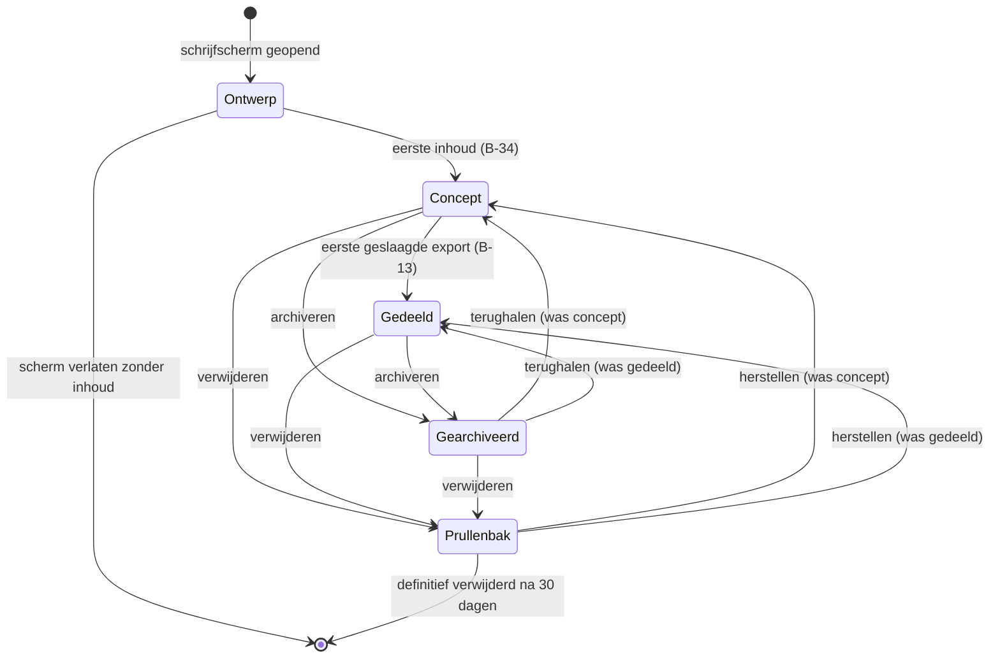

De toestand **Ontwerp** bestaat alleen in het geheugen. Er is geen record, er staat niets in het overzicht en er staat niets in IndexedDB. Pas bij de eerste inhoud schrijft `DocumentationService` het record weg (B-34). Onder inhoud verstaat de app: een titel van minstens één teken, tekst van minstens één teken, een toegevoegde foto, een toegevoegd citaat, of een koppeling aan een leerling, een groep of een reeks. Het wijzigen van de datum alleen telt niet als inhoud, want de datum staat er al vanaf het openen.

**Velden.** Alle velden staan hieronder. `DocumentationService` is de enige plek waar ze geschreven worden (U-03); schermen roepen de service aan en schrijven nooit rechtstreeks naar `StorageService`.

| Veld | Type | Verplicht | Standaardwaarde | Validatie | Maximum |
|---|---|---|---|---|---|
| `id` | `string` (UUIDv7) | ja | door de app gezet | UUIDv7-vorm, onveranderlijk | 36 tekens |
| `title` | `string` | nee | lege tekst | getrimd, geen regeleinden, geen reeksnaam als voorvoegsel (B-35) | 120 tekens |
| `date` | `string` (`YYYY-MM-DD`) | ja | vandaag volgens de apparaatklok | geldige kalenderdatum, niet vóór 2015-08-01, niet later dan vandaag plus zeven dagen (B-70) | 10 tekens |
| `seriesId` | `string \| null` | nee | `null` | verwijst naar een bestaande `Series` zonder `deletedAt` | 36 tekens |
| `studentIds` | `string[]` | nee | `[]` of de standaardgroep uit Instellingen | bestaande `Student`-records, geen dubbelen, volgorde is invoervolgorde | 60 verwijzingen |
| `groupIds` | `string[]` | nee | `[]` | bestaande `Group`-records, geen dubbelen (B-17) | 10 verwijzingen |
| `privateNote` | `string` | nee | lege tekst | vrije tekst; gaat nooit mee in een export en nooit naar de AI | 2.000 tekens |
| `status` | `'concept' \| 'gedeeld'` | ja | `'concept'` | alleen deze twee waarden; alleen `DocumentationService` zet hem (B-13) | — |
| `pageIds` | `string[]` | ja | één pagina met layout `A-fotoraster` | minimaal 1, volgnummers aaneengesloten vanaf 1 (U-06, B-15) | 20 pagina's |
| `imageConsentAt` | `string \| null` | nee | `null` | tijdstip van de bevestiging beeldgebruik (B-08) | — |
| `conversationAnswers` | `ConversationAnswer[]` | nee | `[]` | alleen gevuld door gespreksmodus (B-03) | 7 antwoorden |
| `aiUndoSnapshot` | `AiUndoSnapshot \| null` | nee | `null` | één stap; overschreven bij de volgende overname (T-07) | 1 |
| `archivedAt` | `string \| null` | nee | `null` | ISO-tijdstip of leeg | — |
| `createdAt` | `string` | ja | tijdstip van ontstaan | ISO-tijdstip (T-11) | — |
| `updatedAt` | `string` | ja | tijdstip van laatste wijziging | ISO-tijdstip (T-11) | — |
| `deletedAt` | `string \| null` | nee | `null` | verwijderen is markeren (T-11) | — |
| `rev` | `number` | ja | `1` | verhoogt bij elke geslaagde schrijfactie (T-11) | — |
| `origin` | `string` | ja | apparaat-id | herkomst voor latere synchronisatie (T-11, B-24) | 36 tekens |
| `schemaVersion` | `number` | ja | huidige versie | wordt gecontroleerd bij lezen (T-12) | — |

In code:

```typescript
export interface Documentation {
  id: string;
  title: string;
  date: string;                    // YYYY-MM-DD, inhoudelijke datum
  seriesId: string | null;
  studentIds: string[];
  groupIds: string[];
  privateNote: string;
  status: 'concept' | 'gedeeld';
  pageIds: string[];
  imageConsentAt: string | null;
  conversationAnswers: ConversationAnswer[];
  aiUndoSnapshot: AiUndoSnapshot | null;
  archivedAt: string | null;
  createdAt: string;
  updatedAt: string;
  deletedAt: string | null;
  rev: number;
  origin: string;
  schemaVersion: number;
}
```

Het schema wordt aan beide kanten van de opslag door Zod gecontroleerd, bij lezen en bij schrijven (T-12). Een record dat de controle niet doorstaat wordt niet stilzwijgend gerepareerd: het overzicht toont die rij als "Deze documentatie kan niet gelezen worden" met een knop om hem te exporteren als ruw bestand voor onderzoek.

**FR-DOC-01 — Ontstaan bij eerste inhoud.** Een documentatie wordt pas als record opgeslagen zodra je titel, tekst, een foto, een citaat of een koppeling toevoegt.

- *Gegeven* een geopend, leeg schrijfscherm
- *Wanneer* je het scherm verlaat zonder iets in te vullen
- *Dan* staat er geen documentatie in het overzicht, is er geen record in IndexedDB en is er geen `AuditEvent` geschreven

*Volgt uit B-34.*

**FR-DOC-02 — Datum is verplicht en staat standaard op vandaag.** Elke documentatie heeft een inhoudelijke datum, die bij het openen van het schrijfscherm op de dag van vandaag staat.

- *Gegeven* je opent een nieuw schrijfscherm op 7 augustus 2026
- *Wanneer* het scherm verschijnt
- *Dan* staat in het datumveld `07-08-2026` en is dat veld bewerkbaar

**FR-DOC-03 — Titel is optioneel.** Een documentatie mag zonder titel bestaan en krijgt in dat geval een afgeleide aanduiding in de lijst.

- *Gegeven* een documentatie zonder titel met de tekst "Kjeld en Roos bouwden vanmiddag een brug van blokken"
- *Wanneer* je het overzicht opent
- *Dan* toont de rij "Kjeld en Roos bouwden vanmiddag een brug van blokken" ingekort tot 60 tekens, en niet de tekst "Zonder titel"

**FR-DOC-04 — Zonder tekst en zonder titel.** Een documentatie die alleen foto's bevat, toont in de lijst "Zonder titel" met het aantal foto's erachter.

- *Gegeven* een documentatie met drie foto's, geen titel en geen tekst
- *Wanneer* je het overzicht opent
- *Dan* toont de rij "Zonder titel · 3 foto's"

**FR-DOC-05 — De reeks is een verwijzing.** De reeksnaam wordt nooit in de opgeslagen titel geschreven, maar als aparte verwijzing bewaard en apart getoond.

- *Gegeven* een documentatie met titel "De brug" in de reeks "Kunstwerk Dok"
- *Wanneer* je het record uitleest
- *Dan* bevat `title` exact `De brug` en `seriesId` de sleutel van de reeks, en toont het scherm de reeksnaam als apart etiket met de reekskleur

*Volgt uit B-35.*

**FR-DOC-06 — Meerdere leerlingen en meerdere groepen.** Een documentatie kan aan nul of meer leerlingen en aan nul of meer groepen tegelijk gekoppeld zijn.

- *Gegeven* een documentatie gekoppeld aan Aya, Bram en Cato, en aan de groepen "Groep 4 – De Regenboog" en "Projectgroep Dok"
- *Wanneer* je opslaat en het record opnieuw leest
- *Dan* bevat `studentIds` drie sleutels en `groupIds` twee sleutels, en is er geen `groupId` op een `Student` gezet

*Volgt uit B-17 en U-07.*

**FR-DOC-07 — Afgeleide groepskoppeling is een suggestie.** Zitten alle gekoppelde leerlingen in dezelfde groep, dan stelt de app die groep voor, maar koppelt hem niet zelf.

- *Gegeven* een documentatie met Aya, Bram en Cato, die alle drie lid zijn van "Groep 4 – De Regenboog", en geen enkele gekoppelde groep
- *Wanneer* je de derde leerling toevoegt
- *Dan* verschijnt onder het groepsveld de regel "Alle drie zitten in Groep 4 – De Regenboog. Koppelen." en gebeurt er zonder die tik niets

*Volgt uit B-17.*

**FR-DOC-08 — Notitie voor jezelf blijft binnen.** Het veld "Notitie voor jezelf" verschijnt niet in een export en gaat niet mee in een AI-aanroep.

- *Gegeven* een documentatie met in de notitie "nog even navragen bij de intern begeleider"
- *Wanneer* je een Print-PDF maakt en daarna "Laat AI meeschrijven" gebruikt
- *Dan* bevat de PDF die tekst niet, en toont het controlescherm "Bekijk wat er verstuurd wordt" die tekst niet

**FR-DOC-09 — Status verandert alleen door export.** De status gaat van concept naar gedeeld bij de eerste geslaagde export, en nooit door een handmatige knop.

- *Gegeven* een documentatie met status concept
- *Wanneer* je een Print-PDF genereert die zonder fout wordt opgeleverd
- *Dan* staat de status op gedeeld, is `updatedAt` bijgewerkt en is er geen knop in de app die de status terugzet naar concept

*Volgt uit B-13.*

**FR-DOC-10 — Elke documentatie heeft minstens één pagina.** Zodra een documentatie ontstaat, bestaat er precies één `Page` met volgnummer 1 en layout `A-fotoraster`.

- *Gegeven* een nieuw schrijfscherm
- *Wanneer* je het eerste teken typt
- *Dan* bestaan er één `Documentation`-record en één `Page`-record, en verwijst `pageIds` naar die pagina

*Volgt uit U-06 en B-15.*

#### 6.1.2 Het overzicht

Het overzicht is het startscherm van de module. Het toont alle documentaties die niet gearchiveerd en niet verwijderd zijn, met bovenaan het zoekveld, de filterknop en de sorteerschakelaar, en daaronder de lijst.

**Op de laptop** (vanaf 1024 px, ontworpen op 1280 px, B-14) is de lijst een tabel met zes kolommen:

| Kolom | Breedte | Inhoud | Sorteerbaar |
|---|---|---|---|
| Datum | 110 px | de inhoudelijke datum als `di 4 aug` binnen het huidige jaar, anders `4 aug 2025` | ja |
| Titel | flexibel, minimaal 260 px | de titel, of de eerste 60 tekens van de tekst, of "Zonder titel" | ja, alfabetisch |
| Reeks | 160 px | het reeksetiket met kleurstip, leeg als er geen reeks is | ja, op reeksnaam |
| Betrokkenen | 200 px | tot drie namen, daarna "en 4 meer"; groepen krijgen een vierkant etiket, leerlingen een rond | nee |
| Inhoud | 110 px | het aantal pagina's, foto's en citaten als drie kleine tellers met tekstlabel | nee |
| Status | 90 px | "Concept" of "Gedeeld" | ja |

Achter de laatste kolom staat de knop met drie punten (B-33). De hele rij is klikbaar en opent de documentatie; de knop met drie punten opent het rij-menu en opent de documentatie niet.

**Op de telefoon** (tot 1024 px) is dezelfde lijst een stapel rijen van elk 88 px hoog. Elke rij toont links een vierkante miniatuur van de eerste foto (of een grijs vlak met het aantal pagina's als er geen foto is), en rechts drie regels: de titel, daaronder de datum met de reekskleur als stip, en daaronder de betrokkenen ingekort tot één regel. De statusaanduiding staat als klein etiket rechtsboven in de rij. De knop met drie punten staat rechtsonder in de rij en is minstens 44 × 44 px groot.

**Sorteren.** De lijst sorteert standaard op de **inhoudelijke datum**, nieuwste eerst. Dat is de datum die jij invult en met terugwerkende kracht kunt zetten, niet het moment van bewerken. Naast de sorteerkop staat een schakelaar met twee standen: "Op datum" en "Laatst bewerkt". Kies je "Laatst bewerkt", dan sorteert de lijst op `updatedAt`, nieuwste eerst, en verschijnt in de datumkolom een tweede regel met de bewerkdatum in grijs. De keuze wordt onthouden in `localStorage` onder de laatst gekozen weergave (T-01) en geldt per apparaat, niet per documentatie. Bij gelijke datum is de tweede sorteersleutel `updatedAt`, en daarna `id`, zodat de volgorde altijd stabiel is.

**Laden.** Het overzicht gebruikt geen paginering met nummers. Het laadt de eerste 50 rijen, en daarna telkens 50 rijen bij. Onderaan de lijst staat een knop "Meer laden" die ook automatisch wordt uitgevoerd zodra hij in beeld komt. De knop blijft altijd zichtbaar en bedienbaar, zodat de lijst met alleen het toetsenbord volledig te doorlopen is. Onder de laatste rij staat de regel "Alle 137 documentaties geladen", zodat je weet dat je aan het einde bent.

**Rij-acties.** De knop met drie punten opent een menu met vijf regels in deze volgorde: Openen, Dupliceren, Exporteren, Archiveren, Verwijderen. Verwijderen staat onderaan, gescheiden door een lijn, en heeft rode tekst. Het menu opent met `Enter` of `Spatie`, sluit met `Escape` en is met pijltoetsen te doorlopen.

- **Openen** brengt je naar het schrijfscherm.
- **Dupliceren** maakt een nieuwe documentatie met dezelfde inhoudelijke datum, dezelfde koppelingen, dezelfde pagina's, blokken en foto's, en de titel met " (kopie)" erachter. De kopie krijgt status concept, een lege `imageConsentAt` en een lege `aiUndoSnapshot`. Foto's worden niet gekopieerd maar gedeeld: de blob houdt één opslagrecord en een teller van het aantal verwijzingen.
- **Exporteren** opent het schrijfscherm met het exportpaneel al open (zie §6.1.12).
- **Archiveren** zet `archivedAt` en haalt de rij uit de lijst, met een melding "Gearchiveerd" en een knop "Ongedaan maken" die tien seconden blijft staan.
- **Verwijderen** vraagt bevestiging en zet `deletedAt`.

**De bevestiging bij verwijderen** is een venster met de titel "Documentatie verwijderen", de naam van de documentatie, en de tekst: "Deze documentatie gaat naar de prullenbak. Daar blijft hij 30 dagen staan en daarna wordt hij definitief verwijderd, samen met de 4 foto's die erin staan." Het aantal foto's is het werkelijke aantal, en telt alleen foto's waar geen andere documentatie meer naar verwijst. De knoppen heten "Verwijderen" en "Annuleren"; "Annuleren" heeft de focus bij het openen.

**Wat er met de foto's gebeurt.** Bij het verwijderen wordt de documentatie gemarkeerd, niet gewist (T-11). De foto's blijven staan zolang de documentatie in de prullenbak zit, want herstellen moet het geheel terugbrengen. Bij het definitief verwijderen — na 30 dagen, of eerder als jij dat in de prullenbak kiest — verlaagt `PhotoService` de verwijzingsteller van elke betrokken `Photo`. Staat die teller op nul, dan worden de `Photo` en alle drie de `PhotoVariant`-blobs uit IndexedDB verwijderd (T-09). Foto's die door een duplicaat gedeeld worden blijven dus bestaan, en foto's waar niets meer naar verwijst blijven niet achter.

**FR-DOC-11 — Standaardsortering op inhoudelijke datum.** Het overzicht sorteert standaard op de inhoudelijke datum, nieuwste eerst.

- *Gegeven* een documentatie met datum 3 juli 2026 die vandaag bewerkt is, en een documentatie met datum 6 augustus 2026 die vorige week bewerkt is
- *Wanneer* je het overzicht opent zonder de sorteerschakelaar aan te raken
- *Dan* staat de documentatie van 6 augustus boven die van 3 juli

**FR-DOC-12 — Schakelaar naar laatst bewerkt.** Met één schakelaar sorteer je op het moment van laatste bewerking in plaats van op de inhoudelijke datum.

- *Gegeven* dezelfde twee documentaties
- *Wanneer* je de schakelaar op "Laatst bewerkt" zet
- *Dan* staat de documentatie van 3 juli bovenaan, toont de datumkolom een tweede regel met de bewerkdatum, en staat de schakelaar na herladen van de app nog steeds op "Laatst bewerkt"

**FR-DOC-13 — Stabiele volgorde bij gelijke datum.** Twee documentaties met dezelfde datum krijgen altijd dezelfde onderlinge volgorde.

- *Gegeven* drie documentaties met dezelfde inhoudelijke datum
- *Wanneer* je het overzicht vijf keer achter elkaar herlaadt
- *Dan* is de onderlinge volgorde alle vijf de keren identiek, gesorteerd op `updatedAt` aflopend en daarna op `id`

**FR-DOC-14 — Doorlopend laden in blokken van 50.** Het overzicht laadt 50 rijen tegelijk, met een zichtbare knop om de volgende 50 te laden.

- *Gegeven* 137 documentaties
- *Wanneer* je het overzicht opent en niet scrolt
- *Dan* staan er 50 rijen in de lijst, staat onderaan de knop "Meer laden" en is die knop met `Tab` bereikbaar

**FR-DOC-15 — Rij-acties achter de knop met drie punten.** Elke rij heeft een zichtbare knop met drie punten met vijf acties; lang indrukken doet niets.

- *Gegeven* een rij in het overzicht op de telefoon
- *Wanneer* je de rij één seconde ingedrukt houdt
- *Dan* gebeurt er niets bijzonders, en zijn de acties uitsluitend te bereiken via de knop met drie punten

*Volgt uit B-33.*

**FR-DOC-16 — Dupliceren behoudt de inhoud en niet de status.** Een duplicaat bevat dezelfde inhoud maar begint als concept.

- *Gegeven* een gedeelde documentatie met vier foto's, twee citaten en twee pagina's
- *Wanneer* je "Dupliceren" kiest
- *Dan* verschijnt bovenaan de lijst een nieuwe documentatie met dezelfde datum, dezelfde vier foto's, dezelfde twee citaten, dezelfde twee pagina's, titel met " (kopie)", status concept en een lege bevestiging beeldgebruik

**FR-DOC-17 — Gedeelde foto's worden niet gekopieerd.** Een duplicaat verwijst naar dezelfde fotorecords in plaats van ze te kopiëren.

- *Gegeven* een documentatie van 4 foto's van samen 12 MB
- *Wanneer* je hem dupliceert
- *Dan* groeit het opslaggebruik met minder dan 50 kB, en staat de verwijzingsteller van elke `Photo` op 2

**FR-DOC-18 — Archiveren is omkeerbaar.** Archiveren haalt de documentatie uit de lijst zonder iets te verwijderen en is direct terug te draaien.

- *Gegeven* een gedeelde documentatie in het overzicht
- *Wanneer* je "Archiveren" kiest en daarna binnen tien seconden "Ongedaan maken"
- *Dan* staat de rij weer op zijn oorspronkelijke plek met status gedeeld en is `archivedAt` weer leeg

**FR-DOC-19 — De bevestiging bij verwijderen noemt het aantal foto's.** Het bevestigingsvenster noemt de titel, de bewaartermijn en het aantal foto's dat meegaat.

- *Gegeven* een documentatie "De brug" met vier foto's waarvan er één ook in een duplicaat zit
- *Wanneer* je "Verwijderen" kiest
- *Dan* staat er "samen met de 3 foto's die erin staan", heeft de knop "Annuleren" de focus, en sluit `Escape` het venster zonder te verwijderen

**FR-DOC-20 — Foto's verdwijnen pas bij de laatste verwijzing.** Bij het definitief verwijderen worden alleen de foto's gewist waar niets meer naar verwijst.

- *Gegeven* een documentatie en een duplicaat die dezelfde vier foto's delen
- *Wanneer* je het origineel definitief verwijdert
- *Dan* zijn alle vier de foto's nog leesbaar in het duplicaat en staat elke verwijzingsteller op 1

*Volgt uit T-09.*
#### 6.1.3 Zoeken en filteren

Zoeken en filteren zijn twee aparte dingen die samenwerken. Zoeken is één tekstveld; filteren is een paneel met vijf keuzes. Ze staan naast elkaar boven de lijst en werken altijd samengevoegd: het zoekveld bepaalt welke documentaties inhoudelijk passen, de filters bepalen welke daarvan overblijven.

**Wat doorzocht wordt.** `SearchService` doorzoekt vijf velden: de titel, alle tekst uit alle `TextBlock`- en `HeadingBlock`-blokken, alle citaten uit alle `QuoteBlock`-blokken, de naam van de reeks, en de namen van de gekoppelde leerlingen en groepen. Doorzocht wordt niet: de notitie voor jezelf, de alternatieve tekst bij foto's, de bestandsnamen van foto's en de antwoorden uit gespreksmodus die nog niet in tekst zijn omgezet. De notitie voor jezelf blijft bewust buiten de zoekresultaten, omdat een treffer op een privénotitie in een gedeeld scherm zichtbaar zou worden.

De index staat in het geheugen en wordt bij het opstarten van de module gevuld (T-09, T-16). Bij elke opslag van een documentatie wordt alleen dat ene record opnieuw geïndexeerd. Zoeken is hoofdletterongevoelig en diakrietongevoelig: "hanae" vindt "Hanae", "kunstwerk" vindt "Kunstwerk". Bij nul treffers valt de zoekactie terug op trigrammen, zodat "kuntswerk" alsnog "Kunstwerk Dok" vindt; die treffers krijgen de aanduiding "Bedoelde je: kunstwerk" boven de lijst.

**Hoe een treffer getoond wordt.** Een rij die op titel matcht, toont de titel met de gevonden woorden vetgedrukt. Een rij die op tekst of citaat matcht, toont onder de titel één extra regel: het fragment van 120 tekens rond de eerste treffer, met de gevonden woorden vetgedrukt en een liggend streepje voor en na als het fragment midden in een zin begint. Bij een treffer in een citaat staat er een aanhalingsteken voor het fragment. Een rij die alleen op een gekoppelde naam of op de reeksnaam matcht, krijgt geen fragment maar een gemarkeerd etiket. Er is nooit meer dan één fragment per rij.

**De filters.** De filterknop opent een paneel: op de laptop een uitklap onder de knop, op de telefoon een blad dat van onderen opkomt. Vijf filters (B-32):

| Filter | Keuze | Meerdere tegelijk | Combinatie binnen het filter |
|---|---|---|---|
| Reeks | lijst van alle reeksen plus "Zonder reeks" | ja | of |
| Groep | lijst van alle groepen van het huidige schooljaar plus oudere jaren achter "Toon oudere jaren" | ja | of |
| Leerling | zoekend keuzeveld over alle leerlingen | ja | of |
| Periode | vrije datumrange met snelkeuzes | nee | — |
| Status | Concept, Gedeeld, Gearchiveerd, Prullenbak | ja | of |

**Hoe filters combineren.** Binnen één filter geldt *of*: kies je de reeksen "Kunstwerk Dok" en "ONDERZOEK Natuur", dan zie je documentaties uit beide. Tussen filters geldt *en*: kies je daarbovenop de leerling Kjeld, dan zie je alleen documentaties uit één van die twee reeksen waar Kjeld aan gekoppeld is. Het zoekveld werkt ook als *en*: de zoekterm wordt toegepast op wat de filters overlaten. Deze regel staat als één zin boven het filterpaneel: "Binnen een filter geldt of, tussen filters geldt en."

De statusfilters Gearchiveerd en Prullenbak zijn de enige manier om gearchiveerde en verwijderde documentaties te zien. Kies je er één, dan verschijnt boven de lijst een gekleurde balk met de tekst "Je bekijkt de prullenbak" of "Je bekijkt het archief", zodat je nooit per ongeluk denkt dat je de gewone lijst ziet.

**Wat "periode" is.** Periode is een vrije datumrange over de **inhoudelijke datum**, ook als de lijst op laatst bewerkt gesorteerd staat. Je vult een begindatum en een einddatum in; beide zijn inclusief. Eén van de twee leeg laten mag: alleen een begindatum betekent "vanaf", alleen een einddatum betekent "tot en met". Boven de twee velden staan drie snelkeuzes:

- **Deze week** — maandag tot en met zondag van de week waarin vandaag valt.
- **Deze maand** — de eerste tot en met de laatste dag van de huidige kalendermaand.
- **Dit schooljaar** — 1 augustus tot en met 31 juli van het schooljaar waarin vandaag valt. Op 7 augustus 2026 is dat 1 augustus 2026 tot en met 31 juli 2027.

Een snelkeuze vult de twee velden in en laat ze bewerkbaar. Wijzig je daarna een datum, dan verliest de snelkeuze zijn markering maar blijft de range staan.

**Filters wissen.** Naast elk actief filter staat een kruisje. Boven de lijst staat een rij met alle actieve filters als etiketten, elk met een kruisje, en helemaal rechts de knop "Alles wissen". Die wist de filters én de zoekterm en zet de sortering niet terug — de sortering is een weergavekeuze, geen filter. `Escape` in het zoekveld wist alleen de zoekterm.

**FR-DOC-21 — Zoeken doorzoekt vijf soorten inhoud.** Het zoekveld doorzoekt titel, tekst, citaten, reeksnaam en gekoppelde namen.

- *Gegeven* een documentatie zonder de term "dok" in de titel of tekst, maar in de reeks "Kunstwerk Dok"
- *Wanneer* je "dok" typt
- *Dan* staat die documentatie in de resultaten met het reeksetiket gemarkeerd

*Volgt uit B-32.*

**FR-DOC-22 — De notitie voor jezelf wordt niet doorzocht.** Een term die alleen in de notitie voor jezelf staat, levert geen treffer op.

- *Gegeven* een documentatie met in de notitie "navragen bij de intern begeleider" en nergens anders het woord "navragen"
- *Wanneer* je "navragen" zoekt
- *Dan* is het resultaat leeg en toont het scherm "Geen documentaties gevonden voor navragen"

**FR-DOC-23 — Een treffer toont één fragment.** Bij een treffer in tekst of citaat toont de rij één fragment van 120 tekens met de gevonden woorden vetgedrukt.

- *Gegeven* een documentatie waarin het woord "brug" vier keer voorkomt
- *Wanneer* je "brug" zoekt
- *Dan* toont de rij precies één fragment rond de eerste treffer, en niet vier

**FR-DOC-24 — Typefout wordt opgevangen.** Levert een zoekterm nul treffers op, dan zoekt de app opnieuw op trigrammen.

- *Gegeven* de reeks "Kunstwerk Dok"
- *Wanneer* je "kuntswerk" zoekt
- *Dan* verschijnen de documentaties van die reeks met daarboven de regel "Bedoelde je: kunstwerk"

*Volgt uit T-16.*

**FR-DOC-25 — Binnen een filter of, tussen filters en.** Meerdere waarden binnen één filter zijn een of-keuze; verschillende filters versmallen elkaar.

- *Gegeven* documentatie X in "Kunstwerk Dok" met Kjeld, documentatie Y in "ONDERZOEK Natuur" met Roos en documentatie Z in "Kunstwerk Dok" zonder Kjeld
- *Wanneer* je de reeksen "Kunstwerk Dok" en "ONDERZOEK Natuur" kiest en daarbij de leerling Kjeld
- *Dan* zie je alleen documentatie X

**FR-DOC-26 — Periode is een vrije datumrange met drie snelkeuzes.** Het periodefilter werkt op de inhoudelijke datum en heeft snelkeuzes voor deze week, deze maand en dit schooljaar.

- *Gegeven* vandaag is 7 augustus 2026
- *Wanneer* je "Dit schooljaar" kiest
- *Dan* staat er `01-08-2026` in het beginveld en `31-07-2027` in het eindveld, en zijn beide velden bewerkbaar

**FR-DOC-27 — Archief en prullenbak zijn zichtbaar gemarkeerd.** Kies je het statusfilter Gearchiveerd of Prullenbak, dan toont het scherm dat onmiskenbaar.

- *Gegeven* het overzicht
- *Wanneer* je het statusfilter op "Prullenbak" zet
- *Dan* verschijnt boven de lijst een balk met "Je bekijkt de prullenbak" en toont elke rij de resterende bewaartermijn in dagen

**FR-DOC-28 — Alles wissen.** Eén knop wist alle filters en de zoekterm tegelijk.

- *Gegeven* drie actieve filters en een zoekterm
- *Wanneer* je "Alles wissen" kiest
- *Dan* is de lijst weer volledig, staan er geen filteretiketten meer boven de lijst, is het zoekveld leeg en is de gekozen sortering ongewijzigd

#### 6.1.4 Een documentatie maken: schrijfmodus

Schrijfmodus is het hart van de module. Je opent hem met de knop "Nieuwe documentatie" in het overzicht, met de sneltoets `n`, of door een bestaande documentatie te openen. Het scherm is ontworpen op 1280 px breed (U-04, B-14); de telefoonweergave is daarvan afgeleid en laat niets weg.

**De kolomindeling op de laptop.** Drie kolommen onder een vaste kop van 56 px hoog.

| Deel | Breedte | Inhoud |
|---|---|---|
| Kop | volle breedte | terugknop, de titel als klein etiket, de opslagindicator, de knoppen "Laat AI meeschrijven", "Print-PDF" en "Deelbare afbeelding" |
| Linkerkolom | 260 px, vast | de paginanavigator met een miniatuur per pagina, de knop "Pagina toevoegen" en de layoutkeuze van de huidige pagina |
| Middenkolom | flexibel, minimaal 640 px | titelveld, tekstvlak, citaten, foto's en de AI-resultaten; dit is de enige kolom die scrolt met de inhoud |
| Rechterkolom | 300 px, vast | datum, reeks, leerlingen, groepen, notitie voor jezelf, en onderaan het aantal woorden en foto's |

AI-resultaten verschijnen in de middenkolom, onder je eigen tekst. Er is geen apart AI-paneel aan de zijkant: wat de AI voorstelt staat op de plek waar het terecht zou komen.

**De opbouw op de telefoon.** Eén kolom, in deze volgorde van boven naar beneden: de vaste kop met terugknop en opslagindicator, het titelveld, het datumveld, een samengevouwen blok "Koppelingen" dat reeks, leerlingen en groepen bevat en dicht begint als er al iets gekoppeld is, het tekstvlak, de fotostrook, de citaten, en de notitie voor jezelf helemaal onderaan achter een uitklap. De knoppen "Laat AI meeschrijven", "Print-PDF" en "Deelbare afbeelding" staan in een vaste balk onderaan het scherm, boven het toetsenbord. De paginanavigator is op de telefoon een horizontale strook onder de kop.

**Titel.** Eén regel, maximaal 120 tekens, met rechts een teller die pas vanaf 100 tekens verschijnt. Naast het veld staat de knop "Stel een titel voor" (zie §6.1.9). De titel is optioneel en het veld toont als aanwijzing "Titel (mag leeg blijven)".

**Datum.** Een datumveld met een kalenderknop. Het veld accepteert getypte invoer in de vormen `7-8-2026`, `07-08-2026` en `2026-08-07` en normaliseert die. Naast het veld staan twee snelknoppen: "Vandaag" en "Gisteren". Heeft een van de toegevoegde foto's een opnamedatum die afwijkt van de ingevulde datum, dan verschijnt onder het veld de regel "De foto's zijn gemaakt op 5 augustus. Datum overnemen." Die regel verschijnt één keer per documentatie en verdwijnt zodra je hem gebruikt of wegklikt.

**Koppelingen.** Drie velden. **Reeks** is een keuzeveld met zoeken, met onderaan altijd de regel "Nieuwe reeks maken…". **Leerlingen** is een keuzeveld met meerdere waarden; getypte letters filteren de lijst, `Enter` voegt de bovenste toe, `Backspace` in een leeg veld haalt de laatste weg. Elke gekozen leerling verschijnt als etiket met een kruisje. Is er in Instellingen een standaardgroep ingesteld, dan staan die leerlingen er bij een nieuwe documentatie al in. **Groepen** werkt hetzelfde, met vierkante etiketten.

**Tekstvlak.** Eén tekstvlak dat meegroeit met de inhoud, zonder opmaakbalk. Geen vet, geen cursief, geen lijsten: een documentatie is lopende tekst. Een lege regel maakt een nieuwe alinea. Het vlak is een gewoon tekstveld en geen bewerkte invoercomponent, omdat dictaat op de telefoon anders onbetrouwbaar wordt. Onderaan de middenkolom staat het aantal woorden. Bij 20.000 tekens verschijnt de regel "Dit wordt een lange documentatie. Overweeg hem te splitsen." Bij 50.000 tekens accepteert het veld geen nieuwe tekens meer en verschijnt "De grens van 50.000 tekens is bereikt."

**Foto's en citaten** staan onder het tekstvlak en zijn beschreven in §6.1.5 en §6.1.6.

**Autosave.** Er is geen opslaanknop. Elke wijziging start een teller van 1.000 ms; ben je een seconde stil, dan schrijft `DocumentationService` het record weg (T-09, C10). Typ je langer dan tien seconden onafgebroken door, dan wordt er tussentijds opgeslagen, zodat lang doorschrijven nooit onbeschermd is. Daarnaast wordt er altijd opgeslagen bij `visibilitychange` naar verborgen, bij `pagehide`, bij het wisselen van pagina in de paginanavigator, vóór elke AI-aanroep en vóór het openen van het exportpaneel.

**De opslagindicator** staat in de kop en heeft vier standen, elk met tekst en niet alleen met een pictogram:

| Stand | Tekst | Wanneer |
|---|---|---|
| Rust | "Alle wijzigingen opgeslagen" | de laatste schrijfactie is geslaagd en er staat niets open |
| Bezig | "Opslaan…" | er is een schrijfactie onderweg |
| Wachtend | "Niet opgeslagen" | er zijn wijzigingen die nog binnen de wachttijd van 1.000 ms vallen |
| Mislukt | "Opslaan mislukt — probeer opnieuw" | de laatste schrijfactie gaf een fout, met een knop "Nu opslaan" ernaast |

De stand Mislukt is rood, blijft staan tot een schrijfactie slaagt, en blokkeert het exportpaneel.

**Het tabblad sluiten.** Sluit je het tabblad of navigeer je weg, dan schrijft de app eerst synchroon weg via de `pagehide`-afhandeling. Zijn er op dat moment wijzigingen die nog niet zijn weggeschreven én is de laatste schrijfactie mislukt, dan toont de browser de standaardwaarschuwing dat er niet-opgeslagen werk is. Is alles opgeslagen, dan verschijnt die waarschuwing niet: een waarschuwing die altijd komt, wordt genegeerd. Kom je terug, dan opent het schrijfscherm op dezelfde pagina en met dezelfde cursorpositie in het tekstvlak, want die worden bij elke opslag meegeschreven in de schermtoestand.

**FR-DOC-29 — Drie kolommen op de laptop.** Het schrijfscherm heeft op 1280 px drie kolommen met een vaste linker- en rechterkolom.

- *Gegeven* een venster van 1280 px breed
- *Wanneer* je het schrijfscherm opent
- *Dan* is de linkerkolom 260 px, de rechterkolom 300 px en de middenkolom minstens 640 px, en scrollt alleen de middenkolom mee met de inhoud

*Volgt uit U-04 en B-14.*

**FR-DOC-30 — Eén kolom op de telefoon zonder verlies.** De telefoonweergave toont elk veld dat de laptopweergave ook toont.

- *Gegeven* een venster van 390 px breed
- *Wanneer* je het schrijfscherm opent
- *Dan* zijn titel, datum, reeks, leerlingen, groepen, tekstvlak, foto's, citaten, pagina's en notitie voor jezelf alle tien bereikbaar zonder de app te verlaten

**FR-DOC-31 — Autosave na één seconde stilte.** Wijzigingen worden opgeslagen zodra je een seconde niets doet.

- *Gegeven* een geopend schrijfscherm
- *Wanneer* je een zin typt en daarna 1.100 ms niets doet
- *Dan* is er precies één schrijfactie naar IndexedDB uitgevoerd en staat de indicator op "Alle wijzigingen opgeslagen"

*Volgt uit T-09 en C10.*

**FR-DOC-32 — Tussentijds opslaan bij doortypen.** Onafgebroken typen leidt niet tot uitgesteld opslaan.

- *Gegeven* een geopend schrijfscherm
- *Wanneer* je 30 seconden onafgebroken typt zonder pauze van een seconde
- *Dan* zijn er in die 30 seconden minstens twee schrijfacties uitgevoerd

**FR-DOC-33 — Opslaan bij het verlaten van het scherm.** Het scherm verlaten slaat altijd eerst op.

- *Gegeven* een wijziging van 200 ms oud
- *Wanneer* je het tabblad naar de achtergrond zet
- *Dan* is die wijziging weggeschreven voordat het tabblad verborgen is

**FR-DOC-34 — De opslagindicator toont tekst.** De indicator gebruikt woorden, niet alleen een pictogram of een kleur.

- *Gegeven* een schrijfactie die mislukt
- *Wanneer* de fout binnenkomt
- *Dan* staat er letterlijk "Opslaan mislukt — probeer opnieuw" met een knop "Nu opslaan", en is het exportpaneel niet te openen

**FR-DOC-35 — Geen loze waarschuwing bij sluiten.** De browserwaarschuwing verschijnt alleen als er werkelijk werk open staat.

- *Gegeven* een documentatie waarvan alles is opgeslagen
- *Wanneer* je het tabblad sluit
- *Dan* verschijnt er geen waarschuwing

**FR-DOC-36 — Terugkeren op dezelfde plek.** Een heropende documentatie staat op dezelfde pagina met dezelfde cursorpositie.

- *Gegeven* een documentatie van drie pagina's waarin je op pagina 2 midden in de tekst stond
- *Wanneer* je het tabblad sluit en de documentatie later opnieuw opent
- *Dan* staat de paginanavigator op pagina 2 en staat de cursor op dezelfde tekenpositie

**FR-DOC-37 — Geen opmaakbalk in het tekstvlak.** Het tekstvlak kent alleen alinea's.

- *Gegeven* het tekstvlak
- *Wanneer* je `Ctrl + B` gebruikt
- *Dan* gebeurt er niets en bevat de opgeslagen tekst geen opmaakcodes

**FR-DOC-38 — Dictaat werkt onaangetast.** Het tekstvlak verstoort de dicteerfunctie van het toetsenbord niet.

- *Gegeven* het tekstvlak op een telefoon
- *Wanneer* je met de microfoonknop van het toetsenbord drie zinnen dicteert
- *Dan* staan die drie zinnen volledig in het veld, zonder omgedraaide woorden of verdwenen leestekens, en is er tijdens het dicteren geen tussentijdse opslag uitgevoerd die de cursor verplaatst

**FR-DOC-39 — Datum overnemen uit de foto's.** Wijkt de opnamedatum van de foto's af van de ingevulde datum, dan biedt de app die datum één keer aan.

- *Gegeven* een documentatie met datum 7 augustus 2026 waaraan je drie foto's toevoegt die op 5 augustus 2026 zijn gemaakt
- *Wanneer* de foto's verwerkt zijn
- *Dan* verschijnt onder het datumveld "De foto's zijn gemaakt op 5 augustus. Datum overnemen." en verdwijnt die regel na gebruik of na wegklikken en komt niet terug

**FR-DOC-40 — Grens aan de tekstlengte.** Het tekstvlak waarschuwt bij 20.000 tekens en stopt bij 50.000.

- *Gegeven* een tekst van 49.998 tekens
- *Wanneer* je vijf tekens typt
- *Dan* staan er 50.000 tekens in het veld, verschijnt "De grens van 50.000 tekens is bereikt." en is de tekst niet stilzwijgend afgekapt bij opslaan

#### 6.1.5 Foto's

Foto's zijn de aanleiding van bijna elke documentatie. Ze staan onder het tekstvlak in een strook: op de laptop een raster van vier per rij, op de telefoon twee per rij. Elke foto is 160 × 120 px in het raster, met de bijschriftregel eronder en een knoppenrij die verschijnt bij aanwijzen en altijd zichtbaar is bij toetsenbordfocus.

**Toevoegen.** Vier routes, alle vier op alle apparaten waar ze bestaan:

- **Bestandskiezer** — de knop "Foto toevoegen" opent de bestandskiezer, met meerdere bestanden tegelijk.
- **Slepen** — je sleept bestanden vanuit de verkenner op het fotoraster of op het tekstvlak; het hele schrijfscherm licht op met de tekst "Laat los om toe te voegen".
- **Plakken** — `Ctrl + V` of `Cmd + V` met een afbeelding op het klembord voegt hem toe, ongeacht waar de focus staat, behalve als er tekst op het klembord staat.
- **Camera** — op de telefoon staat naast "Foto toevoegen" de knop "Camera", die de camera opent en de gemaakte foto direct toevoegt.

Geaccepteerde bestandstypen zijn JPEG, PNG, WebP en HEIC. HEIC wordt alleen geaccepteerd als de browser hem kan decoderen; lukt dat niet, dan verschijnt "Deze foto kan deze browser niet lezen. Sla hem op als JPEG en probeer opnieuw." Een bronbestand mag maximaal 40 MB groot zijn.

**Verkleinen.** Elke foto wordt bij het toevoegen verkleind naar maximaal **3300 px op de lange zijde** (T-02). Het origineel wordt niet bewaard. Van elke foto worden drie varianten weggeschreven als `PhotoVariant`:

| Variant | Lange zijde | Formaat | Waarvoor |
|---|---|---|---|
| `thumb` | 480 px | JPEG, kwaliteit 0,80 | het fotoraster, de rijmi­niatuur in het overzicht, de paginanavigator |
| `screen` | 1280 px | JPEG, kwaliteit 0,85 | het voorbeeld in het schrijfscherm en in het exportpaneel |
| `print` | 3300 px | JPEG, kwaliteit 0,92 | de Print-PDF en de deelbare afbeelding |

Is de bronfoto kleiner dan 3300 px, dan wordt hij niet opgeschaald: de variant `print` is dan gelijk aan de bron. Het verkleinen gebeurt in een `Worker`, zodat het schrijfscherm blijft reageren; tijdens het verwerken staat de foto in het raster met een voortgangsring en de tekst "Verwerken…".

**Maximumaantal.** Een documentatie bevat maximaal **20 foto's**. Vanaf de dertiende foto verschijnt onder het raster de regel "Dit worden veel pagina's. Overweeg de documentatie te splitsen." Bij een poging tot de eenentwintigste verschijnt "Een documentatie bevat maximaal 20 foto's" en worden de overtollige bestanden niet toegevoegd, met vermelding van welke.

**Herordenen.** Twee routes, en beide zijn volwaardig (B-38). Elke foto heeft twee pijlknoppen, "Naar links" en "Naar rechts", die de foto één plaats verschuiven en de focus meenemen. Daarnaast is elke foto met de muis of met de vinger te slepen; tijdens het slepen schuiven de andere foto's mee en verschijnt op de doelplek een streep. De pijlknoppen zijn de toegankelijke route en zijn nooit verborgen. Na elke verplaatsing meldt een schermlezerbericht "Foto 3 van 6 verplaatst naar plaats 2".

**Verwijderen.** Elke foto heeft een knop "Verwijderen" met een bevestiging in de vorm van een tijdelijke melding met "Ongedaan maken", tien seconden lang. Na die tien seconden verlaagt `PhotoService` de verwijzingsteller; staat die op nul, dan verdwijnen de drie varianten uit IndexedDB.

**Alternatieve tekst.** Onder elke foto staat het veld "Beschrijving voor wie de foto niet ziet", maximaal 200 tekens. Het veld is optioneel. Ontbreekt hij bij export, dan staat in het exportpaneel de regel "3 van de 6 foto's hebben geen beschrijving" met een knop die naar de eerste foto zonder beschrijving springt; de export wordt niet geblokkeerd. De alternatieve tekst komt in de Print-PDF als alternatieve tekst van de afbeelding. Hij gaat nooit mee naar de AI.

**Bijsnijden en draaien.** Beide zijn niet-destructief. Draaien gebeurt in stappen van 90 graden met de knoppen "Draai links" en "Draai rechts". Bijsnijden opent een venster met het `screen`-voorbeeld, een sleepbaar kader en vier verhoudingen: Vrij, 4:3, 3:2 en 1:1. De uitsnede wordt opgeslagen als vier getallen tussen 0 en 1 op de `Photo`, samen met de rotatie; de varianten zelf worden niet overschreven. Bij het renderen past `RenderService` eerst de rotatie toe en dan de uitsnede. De knop "Oorspronkelijke uitsnede" zet beide terug.

**Te klein voor 300 dpi.** `LayoutService` weet van elk slot de breedte in millimeters. De benodigde breedte in pixels is `mm ÷ 25,4 × 300`. Is de effectieve breedte van de variant `print` na uitsnede kleiner dan dat, dan verschijnt bij die foto een geel driehoekje met de tekst "Deze foto is niet scherp genoeg voor 300 dpi op deze plek. Kies een andere layout of een andere foto." De melding staat ook in het exportpaneel bij het aantal pagina's. De export wordt niet geblokkeerd: je mag zelf besluiten dat het goed genoeg is.

**EXIF.** Bij het verwerken leest `PhotoService` twee dingen uit de EXIF-gegevens: de oriëntatie en `DateTimeOriginal`. De oriëntatie wordt toegepast op de pixels en daarna weggegooid. `DateTimeOriginal` wordt niet opgeslagen op de foto, maar één keer doorgegeven aan het schrijfscherm als suggestie voor het datumveld (zie FR-DOC-39). Alle overige EXIF-gegevens — en met name locatie, apparaat, serienummer en eigenaarsnaam — worden verwijderd. De weggeschreven varianten bevatten geen enkel EXIF-blok. Bestandsnamen worden niet bewaard.

**FR-DOC-41 — Vier manieren om een foto toe te voegen.** Bestandskiezer, slepen, plakken en camera leiden alle vier tot dezelfde verwerking.

- *Gegeven* het schrijfscherm op een telefoon
- *Wanneer* je met de knop "Camera" een foto maakt
- *Dan* verschijnt die foto in het raster, wordt hij verkleind naar 3300 px en worden er drie varianten weggeschreven

**FR-DOC-42 — Verkleinen naar 3300 px.** Elke toegevoegde foto wordt verkleind tot maximaal 3300 px op de lange zijde en het origineel wordt niet bewaard.

- *Gegeven* een foto van 4032 × 3024 px
- *Wanneer* je hem toevoegt
- *Dan* is de variant `print` 3300 × 2475 px en staat er geen record met de oorspronkelijke afmetingen in IndexedDB

*Volgt uit T-02.*

**FR-DOC-43 — Drie varianten.** Van elke foto bestaan precies de varianten `thumb`, `screen` en `print`.

- *Gegeven* een toegevoegde foto
- *Wanneer* je de opslag inspecteert
- *Dan* staan er drie `PhotoVariant`-records met lange zijden 480, 1280 en 3300 px

**FR-DOC-44 — Kleine foto's worden niet opgeschaald.** Een foto die kleiner is dan 3300 px behoudt zijn afmetingen.

- *Gegeven* een foto van 900 × 600 px
- *Wanneer* je hem toevoegt
- *Dan* is de variant `print` 900 × 600 px en is de bestandsgrootte niet toegenomen

**FR-DOC-45 — Maximaal twintig foto's.** Een documentatie bevat nooit meer dan 20 foto's.

- *Gegeven* een documentatie met 18 foto's
- *Wanneer* je vijf bestanden tegelijk toevoegt
- *Dan* worden er twee toegevoegd en verschijnt "Een documentatie bevat maximaal 20 foto's" met de namen van de drie geweigerde bestanden

**FR-DOC-46 — Herordenen met pijlknoppen.** Elke foto heeft zichtbare pijlknoppen die hem één plaats verschuiven.

- *Gegeven* zes foto's, focus op de derde
- *Wanneer* je "Naar links" gebruikt
- *Dan* staat die foto op plaats twee, houdt hij de focus en meldt de schermlezer "Foto 3 van 6 verplaatst naar plaats 2"

*Volgt uit B-38.*

**FR-DOC-47 — Herordenen met slepen.** Slepen levert dezelfde volgorde op als de pijlknoppen.

- *Gegeven* zes foto's
- *Wanneer* je de zesde foto naar de eerste plek sleept
- *Dan* is de volgorde 6, 1, 2, 3, 4, 5 en is die volgorde na herladen ongewijzigd

**FR-DOC-48 — Verwijderen is tien seconden terug te draaien.** Een verwijderde foto is tien seconden lang terug te halen voordat de blob verdwijnt.

- *Gegeven* een foto in het raster
- *Wanneer* je hem verwijdert en binnen tien seconden "Ongedaan maken" kiest
- *Dan* staat de foto terug op zijn oorspronkelijke plaats en zijn de drie varianten nooit uit IndexedDB verwijderd

**FR-DOC-49 — Alternatieve tekst is optioneel maar zichtbaar gemist.** Ontbrekende beschrijvingen worden geteld in het exportpaneel zonder de export te blokkeren.

- *Gegeven* zes foto's waarvan drie zonder beschrijving
- *Wanneer* je het exportpaneel opent
- *Dan* staat er "3 van de 6 foto's hebben geen beschrijving" met een knop die naar de eerste springt, en is de exportknop gewoon bruikbaar

**FR-DOC-50 — Bijsnijden en draaien zijn niet-destructief.** De uitsnede en de rotatie worden als waarden opgeslagen, niet in de pixels gebrand.

- *Gegeven* een foto die je 90 graden draait en tot de helft bijsnijdt
- *Wanneer* je daarna "Oorspronkelijke uitsnede" kiest
- *Dan* is de foto volledig en ongedraaid terug, en zijn de drie varianten nooit opnieuw weggeschreven

**FR-DOC-51 — Melding bij te lage resolutie.** Een foto die op zijn slot geen 300 dpi haalt, wordt als zodanig gemarkeerd.

- *Gegeven* een foto van 900 px breed in een slot van 180 mm, waarvoor 2126 px nodig is
- *Wanneer* je de layout `C-groot-beeld` kiest
- *Dan* verschijnt bij die foto "Deze foto is niet scherp genoeg voor 300 dpi op deze plek." en staat diezelfde melding in het exportpaneel

**FR-DOC-52 — Locatiegegevens worden verwijderd.** Geen enkele weggeschreven variant bevat EXIF-gegevens.

- *Gegeven* een foto met GPS-coördinaten, cameramodel en eigenaarsnaam in de EXIF
- *Wanneer* je hem toevoegt en de variant `print` uitleest
- *Dan* bevat het bestand geen EXIF-blok, geen GPS-gegevens en geen bestandsnaam van de bron

**FR-DOC-53 — De opnamedatum blijft alleen als suggestie.** `DateTimeOriginal` wordt gebruikt voor de datumsuggestie en verder niet bewaard.

- *Gegeven* een foto met opnamedatum 5 augustus 2026
- *Wanneer* je hem toevoegt
- *Dan* verschijnt de datumsuggestie en staat die opnamedatum in geen enkel opslagrecord

**FR-DOC-54 — Het schrijfscherm blijft reageren tijdens verwerken.** Het verkleinen blokkeert de invoer niet.

- *Gegeven* zes foto's van elk 8 MB die tegelijk worden toegevoegd
- *Wanneer* de verwerking loopt
- *Dan* kun je gewoon doortypen in het tekstvlak, tonen de zes plekken een voortgangsring, en verschijnt er geen bevroren scherm
#### 6.1.6 Citaten

Een **citaat** is een letterlijke uitspraak van een kind, opgeschreven zoals hij gezegd is. Het is geen samenvatting en geen interpretatie: "Kijk, hij staat" is een citaat, "Kjeld was trots" is dat niet. Citaten zijn in pedagogische documentatie het krachtigste onderdeel en tegelijk het gevoeligste, want ze zijn woordelijk en herkenbaar.

Technisch is een citaat een `QuoteBlock`: een eersterangs blok naast `TextBlock`, `PhotoBlock` en `HeadingBlock` (B-37). Het is geen opmaakvorm van gewone tekst, want dan zou het niet apart doorzoekbaar en niet apart plaatsbaar zijn.

**Toevoegen.** Onder het tekstvlak staat de knop "Citaat toevoegen". Die opent een blok met twee velden: de uitspraak zelf en, daaronder, een keuzeveld "Wie zei dit?" met de leerlingen die aan de documentatie gekoppeld zijn, plus alle andere leerlingen achter een zoekveld, plus de optie "Niemand noemen". Het tweede veld is optioneel en staat standaard leeg.

**Aantallen en lengte.** Een documentatie bevat maximaal **acht citaten**. Elk citaat is maximaal **300 tekens** lang. Boven 300 tekens is het geen citaat meer maar een verhaal, en dat hoort in het tekstvlak. Bij de negende poging verschijnt "Een documentatie bevat maximaal acht citaten." Citaten hebben een eigen volgorde, los van de foto's, en zijn te herordenen met dezelfde pijlknoppen als foto's.

**De leerlingverwijzing.** Kies je een leerling, dan wordt de sleutel van die `Student` opgeslagen, niet de naam. De naam wordt bij het tonen opgehaald. Dat heeft drie gevolgen die alle drie bedoeld zijn: hernoem je een leerling in Instellingen, dan verandert het citaat mee; zet je bij export de schakelaar "namen vervangen door initialen" aan, dan verandert ook de naam onder het citaat mee; en verwijder je een leerling, dan blijft het citaat bestaan met de aanduiding "Verwijderde leerling" (zie §6.1.15).

Kies je "Niemand noemen", dan verschijnt het citaat zonder naam. Dat is de aangewezen keuze voor citaten die naar ouders van de hele groep gaan.

**In de opmaak.** Elke layout heeft een aangewezen plek voor citaten:

| Layout | Plek voor citaten | Aantal per pagina |
|---|---|---|
| `A-fotoraster` | een strook onder het fotoraster, boven de tekstband | 1 |
| `B-verhaal` | in de tekstkolom, op de plek waar het blok in de volgorde staat | 3 |
| `C-groot-beeld` | een strook van 277 × 24 mm onderaan | 2 |
| `D-alleen-beeld` | geen plek; citaten schuiven door naar een vervolgpagina (B-28) | 0 |
| `E-vervolg` | in de doorlopende tekstkolom | 4 |

Een citaat wordt gezet in een groter lettertype dan de gewone tekst, tussen aanhalingstekens, met de naam eronder in klein kapitaal, voorafgegaan door een liggend streepje. Past een citaat niet meer in de sloten van de huidige pagina, dan maakt `PageService` een vervolgpagina met layout `E-vervolg` (zie §6.1.7).

**Privacy.** Een citaat is tekst en gaat daarom, net als alle andere tekst, door `PrivacyService` voordat er iets naar een AI-provider vertrekt (zie §12.5 en hoofdstuk 15). De naam onder het citaat gaat mee als code, niet als naam. In het controlescherm "Bekijk wat er verstuurd wordt" staan de citaten als aparte, herkenbare regels, zodat je precies ziet welke woorden van een kind de deur uit gaan.

**FR-DOC-55 — Een citaat is een eigen blok.** Citaten worden opgeslagen als `QuoteBlock` en niet als opgemaakte tekst binnen een `TextBlock`.

- *Gegeven* een documentatie met een citaat
- *Wanneer* je de blokken uitleest
- *Dan* is er een `QuoteBlock` met een eigen sleutel, een eigen volgnummer en een optionele `studentId`

*Volgt uit B-37.*

**FR-DOC-56 — Maximaal acht citaten van 300 tekens.** Een documentatie bevat hoogstens acht citaten, elk van hoogstens 300 tekens.

- *Gegeven* een documentatie met acht citaten
- *Wanneer* je "Citaat toevoegen" gebruikt
- *Dan* verschijnt "Een documentatie bevat maximaal acht citaten." en wordt er geen negende blok aangemaakt

**FR-DOC-57 — De leerlingverwijzing is optioneel.** Een citaat mag zonder naam bestaan.

- *Gegeven* een nieuw citaat
- *Wanneer* je "Niemand noemen" kiest
- *Dan* is `studentId` leeg, toont het voorbeeld het citaat zonder naamregel, en blijft de opmaak verder gelijk

**FR-DOC-58 — De naam wordt opgehaald, niet gekopieerd.** Hernoemen van een leerling werkt door in bestaande citaten.

- *Gegeven* een citaat van Kjeld
- *Wanneer* je die leerling in Instellingen hernoemt naar "Kjeld V."
- *Dan* toont het citaat "Kjeld V." zonder dat de documentatie is bewerkt en zonder dat `updatedAt` is veranderd

*Volgt uit U-02.*

**FR-DOC-59 — Citaten gaan door PrivacyService.** Bij elke AI-aanroep worden citaten gepseudonimiseerd zoals alle andere tekst.

- *Gegeven* een citaat van Kjeld met de tekst "Kijk, Roos, hij staat"
- *Wanneer* je "Laat AI meeschrijven" gebruikt
- *Dan* staat er in het controlescherm `"Kijk, [LEERLING-2], hij staat" — [LEERLING-1]` en gaat de naam Kjeld nergens mee

*Volgt uit B-37 en §10.3.*

**FR-DOC-60 — Citaten hebben een eigen plek per layout.** Elke layout wijst een slot aan voor citaten, of schuift ze door.

- *Gegeven* een documentatie met twee citaten
- *Wanneer* je layout `D-alleen-beeld` kiest
- *Dan* verdwijnen de citaten niet, maar komen ze op een vervolgpagina met layout `E-vervolg` te staan

*Volgt uit B-28.*

#### 6.1.7 Pagina's

Een documentatie bestaat uit pagina's. `Page` is een eigen opslagrecord met een eigen sleutel, een volgnummer en een `layoutId` — geen gevolg van de opmaak, maar een ding op zichzelf (U-06, B-15). Dat betekent dat je een pagina kunt toevoegen voordat er inhoud is, dat een pagina zijn layout houdt als je de inhoud vervangt, en dat een export voorspelbaar is.

**De paginanavigator.** Op de laptop staat hij in de linkerkolom: een verticale strook met per pagina een miniatuur van 200 × 142 px, het volgnummer, de layoutnaam en een knop met drie punten voor "Pagina verwijderen", "Pagina omhoog" en "Pagina omlaag". De actieve pagina heeft een gekleurde rand van 2 px. Onderaan staat "Pagina toevoegen". Op de telefoon is dezelfde navigator een horizontale strook onder de kop, met miniaturen van 96 × 68 px die zijwaarts scrollen; de knop met drie punten zit in de miniatuur.

Klikken op een miniatuur maakt die pagina actief. De middenkolom toont dan de blokken van die pagina. Blokken zijn dus per pagina zichtbaar, niet als één doorlopende stroom: dat is precies waarom `Page` een eersterangs entiteit is.

**Layoutkeuze per pagina.** Onder de navigator staat de layoutkeuze van de actieve pagina als vier miniaturen. `E-vervolg` staat er niet bij: die layout kent de app zelf toe aan vervolgpagina's en is niet handmatig te kiezen. Wel kun je van een vervolgpagina een gewone pagina maken door er een van de vier layouts aan te geven; hij telt dan als volwaardige pagina en wordt niet meer opnieuw ingedeeld bij overloop.

| Layout | Fotosloten | Tekstslot | Citaatslot | Bedoeld voor |
|---|---|---|---|---|
| `A-fotoraster` | 6 van 88 × 66 mm, in 3 × 2 | 277 × 34 mm onderaan | 277 × 14 mm | veel foto's, korte tekst |
| `B-verhaal` | 2 van 88 × 66 mm links | 177 × 138 mm rechts | in de tekstkolom | langere tekst met beeld erbij |
| `C-groot-beeld` | 1 van 180 × 135 mm links | 91 × 135 mm rechts | 277 × 24 mm onderaan | één beeld dat het verhaal draagt |
| `D-alleen-beeld` | 4 van 136 × 85 mm, in 2 × 2 | geen | geen | beeld zonder tekst |
| `E-vervolg` | 2 van 136 × 85 mm bovenaan, optioneel | 277 × 176 mm of het restant | in de tekstkolom | wat niet op de vorige pagina paste |

Alle maten gelden op een A4-liggend canvas van 297 × 210 mm met 10 mm marge rondom (T-13). De titel van de documentatie staat op elke pagina bovenaan in een band van 14 mm en wordt op elke vervolgpagina herhaald (B-07).

**Pagina toevoegen.** De knop maakt een nieuwe pagina achter de actieve pagina, met dezelfde layout als de actieve pagina, en maakt hem actief. Een documentatie bevat maximaal 20 pagina's.

**Pagina verwijderen.** Een pagina met blokken verwijderen vraagt bevestiging: "Pagina 2 verwijderen? De 3 foto's en de tekst op deze pagina gaan mee naar de prullenbak." Blokken van een verwijderde pagina worden niet naar een andere pagina verplaatst — dat zou stilzwijgend de opmaak van een andere pagina overhoop halen. De laatste pagina is niet te verwijderen; die knop is uitgeschakeld met de uitleg "Een documentatie heeft minstens één pagina."

**Herordenen.** "Pagina omhoog" en "Pagina omlaag" verwisselen twee pagina's van volgnummer. Slepen in de navigator doet hetzelfde. Vervolgpagina's die door overloop zijn ontstaan schuiven mee met de pagina waar ze bij horen: verplaats je pagina 1 naar plaats 3, dan gaat zijn vervolgpagina mee. Dat verband staat als `continuesFromPageId` op de vervolgpagina.

**Automatische vervolgpagina's.** `PageService` controleert na elke wijziging of alle blokken van een pagina in de sloten van die layout passen. Past het niet, dan gebeurt dit, in deze volgorde:

1. Blokken worden aan sloten toegewezen in hun eigen volgorde: eerst fotoblokken aan fotosloten, dan citaten aan citaatsloten, dan tekst aan het tekstslot.
2. Blijft er een blok over, of past de tekst niet in de hoogte van het tekstslot, dan maakt `PageService` direct achter deze pagina een pagina met layout `E-vervolg` en `continuesFromPageId` naar deze pagina.
3. De overgebleven blokken gaan naar die vervolgpagina, in dezelfde volgorde.
4. Past het daar ook niet, dan herhaalt stap 2 zich, tot maximaal 20 pagina's.
5. De titel wordt op de vervolgpagina herhaald (B-07).

Een vervolgpagina die door dit mechanisme is ontstaan, is in de navigator herkenbaar aan de tekst "vervolg van pagina 1" onder het volgnummer. Verdwijnt de overloop weer — je haalt een foto weg, of je kort de tekst in — dan trekt `PageService` de blokken terug naar de vorige pagina en verwijdert de dan lege vervolgpagina. Een vervolgpagina waar jij zelf een layout aan hebt gegeven, wordt nooit automatisch verwijderd.

**Een lege pagina door het verwijderen van een foto.** Verwijder je de laatste foto van een pagina met layout `D-alleen-beeld`, dan blijft er een pagina zonder blokken over. Is dat een automatisch ontstane vervolgpagina, dan verdwijnt hij meteen. Is het een pagina die jij zelf hebt toegevoegd, dan blijft hij staan, met in de middenkolom de tekst "Deze pagina is leeg" en twee knoppen: "Foto toevoegen" en "Pagina verwijderen". Een lege pagina wordt niet meegenomen in de export en telt niet mee in het aantal pagina's dat het exportpaneel toont; in de navigator staat bij zo'n pagina "wordt niet geëxporteerd".

**FR-DOC-61 — Een pagina is een eigen record.** Elke pagina heeft een eigen opslagrecord met sleutel, volgnummer en layout.

- *Gegeven* een documentatie van drie pagina's
- *Wanneer* je de opslag uitleest
- *Dan* staan er drie `Page`-records met volgnummers 1, 2 en 3 en elk een eigen `layoutId`

*Volgt uit U-06 en B-15.*

**FR-DOC-62 — Layout is per pagina.** Twee pagina's van dezelfde documentatie mogen verschillende layouts hebben.

- *Gegeven* een documentatie van twee pagina's
- *Wanneer* je pagina 1 op `C-groot-beeld` zet en pagina 2 op `A-fotoraster`
- *Dan* toont het voorbeeld pagina 1 met één groot beeld en pagina 2 met een raster, en blijft dat na herladen zo

**FR-DOC-63 — Pagina toevoegen erft de layout.** Een nieuwe pagina krijgt de layout van de pagina waarachter hij komt.

- *Gegeven* de actieve pagina heeft layout `B-verhaal`
- *Wanneer* je "Pagina toevoegen" gebruikt
- *Dan* verschijnt direct daarachter een lege pagina met layout `B-verhaal`, en is die actief

**FR-DOC-64 — De laatste pagina is niet te verwijderen.** Er blijft altijd minstens één pagina over.

- *Gegeven* een documentatie van één pagina
- *Wanneer* je het paginamenu opent
- *Dan* is "Pagina verwijderen" uitgeschakeld met de uitleg "Een documentatie heeft minstens één pagina."

**FR-DOC-65 — Pagina verwijderen neemt de blokken mee.** Blokken van een verwijderde pagina verhuizen niet naar een andere pagina.

- *Gegeven* pagina 2 met drie foto's en tekst
- *Wanneer* je die pagina verwijdert en bevestigt
- *Dan* staat er niets van pagina 2 op pagina 1 of pagina 3, en meldt het venster vooraf hoeveel foto's en hoeveel tekst meegaan

**FR-DOC-66 — Vervolgpagina bij overloop.** Wat niet in de sloten past, komt op een automatisch aangemaakte vervolgpagina.

- *Gegeven* een pagina met layout `C-groot-beeld`, die één fotoslot heeft, en zes foto's
- *Wanneer* je die layout kiest
- *Dan* staan er vijf foto's op vervolgpagina's met layout `E-vervolg`, staat de titel op elke vervolgpagina, en is `continuesFromPageId` gevuld

*Volgt uit B-07 en B-15.*

**FR-DOC-67 — Vervolgpagina verdwijnt bij het verdwijnen van de overloop.** Wordt de inhoud weer klein genoeg, dan wordt de automatische vervolgpagina opgeruimd.

- *Gegeven* een pagina met een automatische vervolgpagina die één foto bevat
- *Wanneer* je die foto verwijdert
- *Dan* verdwijnt de vervolgpagina, staat het aantal pagina's weer op 1 en meldt de app "Vervolgpagina verwijderd"

**FR-DOC-68 — Een zelf ingedeelde vervolgpagina blijft.** Geef je een vervolgpagina zelf een layout, dan beheert de app hem niet meer.

- *Gegeven* een automatische vervolgpagina waaraan je layout `A-fotoraster` toekent
- *Wanneer* de overloop verdwijnt
- *Dan* blijft die pagina bestaan, ook als hij leeg is, en staat er "wordt niet geëxporteerd" bij zolang hij leeg is

**FR-DOC-69 — Lege pagina door het verwijderen van een foto.** Een pagina die leeg raakt blijft alleen bestaan als jij hem zelf hebt gemaakt.

- *Gegeven* een zelf toegevoegde pagina met layout `D-alleen-beeld` en één foto
- *Wanneer* je die foto verwijdert
- *Dan* blijft de pagina staan met de tekst "Deze pagina is leeg" en de knoppen "Foto toevoegen" en "Pagina verwijderen", en telt hij niet mee in het aantal exportpagina's

**FR-DOC-70 — Pagina's herordenen neemt vervolgpagina's mee.** Een pagina verplaatsen verplaatst zijn vervolgpagina's mee.

- *Gegeven* pagina 1 met vervolgpagina 2, en pagina 3
- *Wanneer* je pagina 1 achter pagina 3 zet
- *Dan* is de volgorde pagina 3, dan de oude pagina 1, dan zijn vervolgpagina, en zijn de volgnummers weer 1, 2, 3

#### 6.1.8 Laat AI meeschrijven

"Laat AI meeschrijven" is de enige AI-knop in het schrijfscherm die de hele tekst betreft. Hij staat in de kop op de laptop en in de vaste balk onderaan op de telefoon. De knop is uitgeschakeld zolang het tekstvlak minder dan 20 tekens bevat; er staat dan als uitleg "Schrijf eerst een paar woorden."

**Wat er gebeurt bij een tik.** In deze volgorde, zonder uitzondering (zie §10.3):

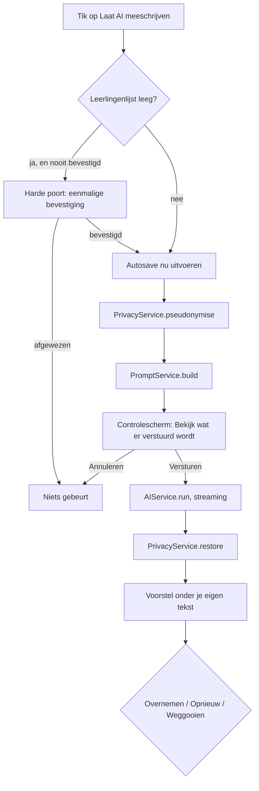

De opdracht die naar de provider gaat, gaat via de eigen server (T-05, T-06). Er gaat nooit een foto, een blob of een bestandsnaam mee (zie §10.3).

**Het controlescherm "Bekijk wat er verstuurd wordt".** Dit is een paneel over het schrijfscherm, niet een uitklapregel. Het toont de volledige opdracht in vijf blokken, elk met een kop en elk uitklapbaar, en alle vijf standaard opengeklapt (B-11):

| Blok | Inhoud | Bewerkbaar |
|---|---|---|
| Systeeminstructie | de volledige instructie zoals hij verstuurd wordt, woord voor woord | nee |
| Stijlprofiel | de gemeten stijlkenmerken uit Instellingen → Schrijfstijl, als leesbare regels | nee, wel een verwijzing naar Instellingen |
| Gekozen voorbeelden | de titels én de volledige tekst van de voorbeelddocumentaties die meegaan, met per voorbeeld waarom hij gekozen is | ja, per voorbeeld uit te vinken voor deze ene aanroep |
| Reekscontext | de eerdere delen uit dezelfde reeks die meegaan, met titel, datum en de meegestuurde tekst | ja, per deel uit te vinken voor deze ene aanroep |
| Je eigen tekst | jouw tekst en je citaten, na pseudonimisering, met de codes gemarkeerd | nee |

Onderaan staat de regel "Dit is alles wat verstuurd wordt. Foto's gaan nooit mee." en daarnaast de teller "3.412 tekens". De twee knoppen heten "Versturen" en "Annuleren"; "Annuleren" sluit het paneel en doet verder niets. Boven de knoppen staat, als er codes zijn vervangen, de regel "7 namen zijn vervangen door codes" met een uitklap die de codes toont zonder de bijbehorende namen.

De maximale omvang van je eigen tekst in één aanroep is 8.000 tekens. Is je tekst langer, dan verschijnt in plaats van de gewone knop de melding "Je tekst is langer dan 8.000 tekens. Selecteer het stuk dat de AI moet bekijken." en werkt de knop alleen op een selectie.

**De harde poort bij een lege leerlingenlijst.** Staat er geen enkele leerling in Instellingen, dan doet de pseudonimisering niets en gaat elke naam die je typt ongefilterd mee. Daarom blokkeert de app de aanroep. Er verschijnt een venster met de kop "Er staan nog geen leerlingen in de lijst", de uitleg dat namen daardoor niet vervangen worden, en drie knoppen: "Leerlingen toevoegen" (die naar Instellingen gaat), "Toch doorgaan" en "Annuleren". Kies je "Toch doorgaan", dan wordt die keuze één keer onthouden in `localStorage` (T-01) en komt het venster niet terug. Die keuze staat in Instellingen → Privacy als "Je hebt toegestaan om AI te gebruiken zonder leerlingenlijst" met een knop om hem in te trekken (T-08).

**Streaming.** Het antwoord verschijnt woord voor woord in een blok onder je eigen tekst, met de kop "Voorstel" en een gestreepte rand. Tijdens het binnenkomen staat er een knop "Stoppen". Stop je, dan blijft wat er binnen is gekomen staan en krijg je dezelfde drie uitkomstknoppen. Het voorstel komt nooit rechtstreeks in je tekstvlak terecht: je eigen tekst blijft onaangeroerd tot je "Overnemen" kiest.

**De drie uitkomstknoppen.** Onder het voorstel staan precies drie knoppen: **Overnemen**, **Opnieuw** en **Weggooien**.

- **Opnieuw** stuurt exact dezelfde opdracht nog een keer, zonder het controlescherm opnieuw te tonen, en vervangt het vorige voorstel. Er is een grens van drie pogingen per aanroep; daarna staat er "Drie voorstellen bekeken. Pas je eigen tekst aan en probeer opnieuw."
- **Weggooien** laat het voorstel verdwijnen en schrijft een `Feedback`-record met de reden "weggegooid", dat meetelt voor de correctieregels (zie §10.4).
- **Overnemen** vraagt eerst wat je wilt (B-39).

**Overnemen: aanvullen of vervangen.** Na een tik op "Overnemen" verschijnt een kleine keuze met twee knoppen: "Onder mijn tekst plakken" en "Mijn tekst vervangen", plus "Annuleren". "Onder mijn tekst plakken" zet het voorstel als nieuwe alinea's achter je bestaande tekst. "Mijn tekst vervangen" zet het voorstel in de plaats van je tekst. In beide gevallen slaat de app eerst een `aiUndoSnapshot` op met je vorige tekst, het tijdstip en de gebruikte opdracht, en verschijnt daarna in de kop tien seconden lang de melding "Overgenomen — Ongedaan maken". De knop "Ongedaan maken" blijft ook ná die tien seconden bereikbaar, in het menu met drie punten van het schrijfscherm, tot de volgende overname. De momentopname staat in het record en overleeft dus het sluiten van het tabblad (T-07).

**De vergelijkingsweergave.** Boven het voorstel staat de schakelaar "Vergelijk met mijn tekst". Aan betekent: op de laptop twee kolommen naast elkaar, links "Jouw tekst" en rechts "Voorstel", met verschillen op woordniveau gemarkeerd — verwijderd in je eigen kolom met doorhaling, toegevoegd in de voorstelkolom met onderstreping. Kleur is nooit het enige verschil. Op de telefoon zijn het twee tabbladen met dezelfde markering, en een knop "Volgende verschil" die door de wijzigingen springt. De vergelijking is er alleen als je tekst niet leeg is.

**FR-DOC-71 — De knop is uit zonder tekst.** "Laat AI meeschrijven" werkt pas als er iets te bewerken is.

- *Gegeven* een tekstvlak met 12 tekens
- *Wanneer* je het schrijfscherm bekijkt
- *Dan* is de knop uitgeschakeld en staat er "Schrijf eerst een paar woorden."

**FR-DOC-72 — Het controlescherm toont vijf blokken.** Het controlescherm bevat systeeminstructie, stijlprofiel, gekozen voorbeelden, reekscontext en je eigen tekst.

- *Gegeven* een documentatie in de reeks "Kunstwerk Dok" met twee eerdere delen en een ingevuld stijlprofiel
- *Wanneer* je "Laat AI meeschrijven" gebruikt
- *Dan* toont het controlescherm alle vijf de blokken opengeklapt, met de volledige tekst van de voorbeelden en van de reeksdelen, en niet alleen hun titels

*Volgt uit B-11 en §10.3.*

**FR-DOC-73 — Niets vertrekt vóór het controlescherm.** Er gaat geen enkel netwerkverzoek uit voordat je "Versturen" kiest.

- *Gegeven* het geopende controlescherm
- *Wanneer* je "Annuleren" kiest
- *Dan* is er geen verzoek naar `/api/ai` gedaan, is er geen `AIRequest` weggeschreven en is de tekst ongewijzigd

*Volgt uit U-01.*

**FR-DOC-74 — Voorbeelden en reeksdelen zijn per aanroep uit te vinken.** Je kunt een voorbeeld of een reeksdeel voor deze ene aanroep weglaten.

- *Gegeven* het controlescherm met drie reeksdelen
- *Wanneer* je er één uitvinkt en "Versturen" kiest
- *Dan* bevat de verstuurde opdracht twee reeksdelen, daalt de tekenteller zichtbaar, en staat bij de volgende aanroep dat deel weer aangevinkt

**FR-DOC-75 — Harde poort bij een lege leerlingenlijst.** Zonder leerlingen in de lijst is er geen AI-aanroep zonder eenmalige bevestiging.

- *Gegeven* een lege leerlingenlijst en geen eerdere bevestiging
- *Wanneer* je "Laat AI meeschrijven" gebruikt
- *Dan* verschijnt het venster "Er staan nog geen leerlingen in de lijst" en gaat er zonder "Toch doorgaan" niets naar de provider

*Volgt uit T-08.*

**FR-DOC-76 — De bevestiging is in te trekken.** De eenmalige bevestiging staat zichtbaar in Instellingen en is te herroepen.

- *Gegeven* een gegeven bevestiging
- *Wanneer* je hem in Instellingen → Privacy intrekt
- *Dan* verschijnt de harde poort bij de volgende aanroep opnieuw

**FR-DOC-77 — Het antwoord komt binnen als stroom.** Het voorstel verschijnt woord voor woord, met een knop om te stoppen.

- *Gegeven* een verstuurde opdracht
- *Wanneer* het antwoord binnenkomt
- *Dan* groeit het blok "Voorstel" zichtbaar aan, staat er een knop "Stoppen", en verandert je eigen tekstvlak niet

**FR-DOC-78 — Stoppen behoudt wat er is.** Onderbreken gooit het gedeeltelijke antwoord niet weg.

- *Gegeven* een half binnengekomen voorstel
- *Wanneer* je "Stoppen" gebruikt
- *Dan* blijft het binnengekomen deel staan en verschijnen de drie uitkomstknoppen

**FR-DOC-79 — Precies drie uitkomstknoppen.** Onder elk voorstel staan Overnemen, Opnieuw en Weggooien.

- *Gegeven* een voltooid voorstel
- *Wanneer* je het scherm bekijkt
- *Dan* staan er precies die drie knoppen, met die woorden, en is er geen vierde route om het voorstel in je tekst te krijgen

**FR-DOC-80 — Overnemen vraagt aanvullen of vervangen.** Overnemen is nooit één tik die je tekst overschrijft.

- *Gegeven* een voorstel en een eigen tekst van drie alinea's
- *Wanneer* je "Overnemen" kiest
- *Dan* verschijnt de keuze "Onder mijn tekst plakken" of "Mijn tekst vervangen", en gebeurt er zonder die keuze niets

*Volgt uit B-39.*

**FR-DOC-81 — Overnemen is ongedaan te maken en overleeft herladen.** De vorige tekst blijft bewaard tot de volgende overname.

- *Gegeven* een overgenomen voorstel dat je tekst heeft vervangen
- *Wanneer* je het tabblad sluit, de app herlaadt en "Ongedaan maken" kiest
- *Dan* staat je oorspronkelijke tekst terug, woord voor woord gelijk aan wat er stond

*Volgt uit T-07.*

**FR-DOC-82 — Opnieuw is beperkt tot drie pogingen.** Na drie voorstellen op dezelfde opdracht stopt de knop.

- *Gegeven* drie gebruikte pogingen
- *Wanneer* je opnieuw "Opnieuw" gebruikt
- *Dan* is die knop uitgeschakeld met de tekst "Drie voorstellen bekeken. Pas je eigen tekst aan en probeer opnieuw."

**FR-DOC-83 — De vergelijking markeert niet alleen met kleur.** Verschillen zijn ook zonder kleurwaarneming te zien.

- *Gegeven* een voorstel dat van je tekst afwijkt
- *Wanneer* je "Vergelijk met mijn tekst" aanzet
- *Dan* zijn verwijderde woorden doorgehaald en toegevoegde woorden onderstreept, naast de kleurmarkering, en springt de knop "Volgende verschil" naar de eerstvolgende afwijking

#### 6.1.9 Titelvoorstel en vervolgzin

Twee AI-functies die alleen bij documentatie bestaan. De eerste is gemak, de tweede is de reden dat EduFlow bestaat.

**Titelvoorstel.** Onder het titelveld staat, zodra er meer dan 200 tekens tekst is en het titelveld leeg is, de knop "Stel een titel voor". Er komen drie voorstellen van maximaal zes woorden. Klikken vult het veld; je kunt daarna gewoon typen. Er is geen automatisch invullen: een titel die je niet gekozen hebt komt later terug in de lijst en je herkent hem niet.

**FR-DOC-91 — Titelvoorstellen komen met z'n drieën.**
*Gegeven* een documentatie met tekst en zonder titel, *wanneer* je "Stel een titel voor" gebruikt, *dan* verschijnen drie voorstellen van elk hoogstens zes woorden, elk aanklikbaar, met daaronder "Geen van deze".

**FR-DOC-92 — Een titel wordt nooit automatisch ingevuld.**
*Gegeven* een AI-aanroep die een titel oplevert, *wanneer* die terugkomt, *dan* blijft het titelveld leeg tot je een voorstel aanklikt. Volgt uit U-10.

**De vervolgzin op basis van de reeks.** Dit is de functie uit B-04 en D2 van de review: de enige functie in de app die een losse chatbot niet kan nadoen, want die kent je vorige documentaties niet.

Zit de documentatie in een reeks waarin al minstens één eerder deel bestaat, dan staat boven het tekstvlak een regel: "Deel 4 van Kunstwerk Dok. Wil je verder waar je gebleven was?" met de knop "Stel een openingszin voor". De AI krijgt de tekst van de eerdere delen in dezelfde reeks mee, gepseudonimiseerd, en stelt één tot drie zinnen voor die aansluiten op wat er de vorige keer gebeurde.

**FR-DOC-93 — De reekscontext is zichtbaar vóór verzending.**
*Gegeven* een vervolgzinverzoek, *wanneer* het controlescherm opent, *dan* staan de meegestuurde eerdere documentaties er als aparte, uitklapbare blokken in, met per blok de titel en de datum, en met een schakelaar per blok om hem alsnog weg te laten. Dit is de eis die B-11 stelt aan het controlescherm.

**FR-DOC-94 — Er gaan hoogstens drie eerdere delen mee.**
*Gegeven* een reeks met zeven eerdere delen, *wanneer* de vervolgzin wordt opgevraagd, *dan* gaan de drie meest recente mee, elk afgekapt op 1.500 tekens. De reden: meer context maakt het antwoord niet beter en verstuurt wel meer tekst over kinderen.

**FR-DOC-95 — De gebruiker ziet dat er meer tekst weggaat dan normaal.**
*Gegeven* een vervolgzinverzoek, *wanneer* het controlescherm opent, *dan* staat bovenaan: "Voor deze functie gaan ook je eerdere documentaties uit deze reeks mee. Dat is meer tekst dan bij gewoon meeschrijven." Volgt uit het gevolg dat B-04 zelf benoemt.

**FR-DOC-96 — De vervolgzin is even makkelijk af te wijzen als aan te nemen.**
*Gegeven* een voorstel, *wanneer* het verschijnt, *dan* staat het boven het tekstvlak als voorstel, niet in het tekstvlak, met "Neem over" en "Nee, dank je" even groot naast elkaar.

#### 6.1.10 Gespreksmodus

Gespreksmodus is de tweede manier om een documentatie te maken, en de uitwerking van B-03: de foto's stellen de vragen.

**Het idee.** Je hebt net zes foto's gemaakt van een half uur werken in de schooltuin. Je gaat zitten, opent EduFlow, kiest die zes foto's, en de app laat ze één voor één zien met een vraag erbij. Jij typt of dicteert twee regels per foto. Aan het eind bouwt de AI daar een documentatie van. De foto's blijven op het apparaat; alleen jouw antwoorden gaan weg.

**FR-DOC-97 — Gespreksmodus begint met foto's kiezen.**
*Gegeven* een nieuwe documentatie in gespreksmodus, *wanneer* je hem start, *dan* is de eerste stap het kiezen van foto's, niet het beantwoorden van een vraag. Zonder foto's is er geen gesprek; de app biedt dan aan om over te stappen naar schrijfmodus.

**FR-DOC-98 — De datum komt uit de foto's.**
*Gegeven* gekozen foto's met een opnamedatum, *wanneer* die allemaal op dezelfde dag zijn genomen, *dan* wordt die dag het datumveld, zichtbaar met de tekst "Datum overgenomen uit je foto's". Verschillen de datums, dan wordt de vroegste genomen en verschijnt "Je foto's komen van meerdere dagen."

**De vragen.** Per foto verschijnt één vraag. De vraag wordt lokaal gekozen uit een vaste set, op basis van de plaats van de foto in de reeks; er gaat voor de vraag zelf niets naar de AI, want er is niets om te versturen behalve de foto en die gaat nooit weg.

| Positie | Vraag |
|---|---|
| Eerste foto | "Wat gebeurde hier? Waar begon het mee?" |
| Middelste foto's | "Wat zie je hier gebeuren?" / "Wat zei of deed iemand hier?" / "Wat viel je op?" (afwisselend) |
| Laatste foto | "Hoe liep het af? Wat wil je onthouden?" |
| Na de laatste | "Is er nog iets wat niet op de foto staat?" (tekstvlak zonder foto) |

**FR-DOC-99 — Er is één vraag per foto, plus één slotvraag.**
*Gegeven* zes gekozen foto's, *wanneer* je het gesprek doorloopt, *dan* krijg je zeven schermen: zes met een foto en een vraag, en één slotvraag zonder foto.

**FR-DOC-100 — Overslaan kan altijd.**
*Gegeven* een vraag, *wanneer* je op "Volgende" tikt zonder te typen, *dan* gaat de app door en telt die foto mee zonder antwoord. Een foto zonder antwoord komt wel in de documentatie maar levert geen tekst.

**FR-DOC-101 — Terug kan altijd.**
*Gegeven* het gesprek, *wanneer* je op "Vorige" tikt, *dan* staat je eerdere antwoord er nog en is het te wijzigen.

**FR-DOC-102 — Stoppen bewaart wat er is.**
*Gegeven* een half doorlopen gesprek, *wanneer* je het scherm verlaat, *dan* bestaat de documentatie met de foto's en de gegeven antwoorden als tekst, in status concept. Er gaat niets verloren (U-10).

**FR-DOC-103 — Wisselen naar schrijfmodus behoudt de antwoorden.**
*Gegeven* vier beantwoorde vragen, *wanneer* je op "Ga verder in schrijfmodus" tikt, *dan* staan je vier antwoorden als vier alinea's in het tekstvlak, in de volgorde van de foto's, en staan de foto's in het fotoblok. Volgt uit B-03 en uit de eis in doc 02 dat halverwege wisselen mogelijk is.

**FR-DOC-104 — Aan het eind bouwt de AI de documentatie.**
*Gegeven* een doorlopen gesprek, *wanneer* je op "Maak er een documentatie van" tikt, *dan* opent het controlescherm met alle antwoorden gepseudonimiseerd, en levert de AI daarna een lopende tekst op die in schrijfmodus verschijnt met Overnemen / Opnieuw / Weggooien.

**FR-DOC-105 — De AI krijgt geen foto en weet dat.**
*Gegeven* de opdracht die weggaat, *wanneer* je hem in het controlescherm bekijkt, *dan* staat er per antwoord alleen de tekst, met de aanduiding "antwoord 3 van 6". Er gaat geen bestandsnaam, geen afmeting, geen hash en geen beeldgegeven mee. De systeeminstructie zegt expliciet dat de AI de beelden niet gezien heeft en er niets over mag beweren.

**Gespreksmodus op de laptop.** Desktop first betekent dat deze modus ook op 1280 px een goede vorm heeft (B-14). Daar staat de foto links op halve breedte en de vraag met het antwoordvlak rechts, met de zes miniaturen als strook onderaan zodat je kunt zien waar je bent en kunt springen. Op de laptop is gespreksmodus nuttig voor het omgekeerde geval: foto's die al een week op je telefoon staan en die je met de camerarol-import binnenhaalt om er alsnog iets van te maken.

**FR-DOC-106 — Op de laptop toont gespreksmodus de hele reeks.**
*Gegeven* een scherm breder dan 1024 px, *wanneer* het gesprek loopt, *dan* staat er een strook met alle gekozen foto's, is de huidige gemarkeerd, en zijn beantwoorde foto's afgevinkt. Klikken op een miniatuur springt erheen.

**FR-DOC-107 — Dicteren wordt niet gehinderd.**
*Gegeven* het antwoordvlak, *wanneer* je de microfoonknop van het toetsenbord gebruikt, *dan* werkt dictaat zonder onderbreking: het veld doet geen automatische correctie, geen automatisch hoofdletter herstellen, geen tekstvervanging en geen herpositionering van de cursor tijdens het typen. Volgt uit D3 van de review.

#### 6.1.11 Reeksen

Een reeks is een verzameling documentaties die bij elkaar horen omdat ze over hetzelfde project of dezelfde lijn gaan. "Kunstwerk Dok" is vier documentaties over acht weken.

**FR-DOC-108 — De reeks is een verwijzing, geen voorvoegsel.**
*Gegeven* een documentatie in de reeks Kunstwerk Dok met de titel "De eerste schets", *wanneer* je de opgeslagen titel bekijkt, *dan* staat er "De eerste schets" en niet "Kunstwerk Dok — De eerste schets". De reeks wordt bij het tonen ervoor gezet. Volgt uit B-35 en lost B11i op.

**FR-DOC-109 — De reeksweergave toont de delen op volgorde.**
*Gegeven* een reeks, *wanneer* je hem opent, *dan* zie je alle delen op inhoudelijke datum oplopend, met per deel de titel, de datum, een miniatuur en het aantal foto's, en met de knop "Volgend deel maken" die een nieuwe documentatie start met de reeks en de groep al ingevuld.

**FR-DOC-110 — Een deel toont zijn positie.**
*Gegeven* het derde deel van vier, *wanneer* je het opent, *dan* staat boven de titel "Deel 3 van Kunstwerk Dok" met pijlen naar het vorige en volgende deel.

#### 6.1.12 Exporteren

Het exportpaneel schuift over het schrijfscherm (B-06). Het bestaat uit vier delen: de layoutkiezer, het voorbeeld, de opties en de twee knoppen.

**FR-DOC-111 — Het paneel toont vijf miniaturen.**
*Gegeven* het exportpaneel, *wanneer* het opent, *dan* staan bovenaan vier miniaturen voor A tot en met D, plus een indicatie van het aantal vervolgpagina's. Je kiest zelf; de app kiest niet automatisch. Volgt uit B-11.

**FR-DOC-112 — Het aantal pagina's staat vooraf vast.**
*Gegeven* een gekozen layout, *wanneer* de miniatuur geselecteerd wordt, *dan* verschijnt onder het voorbeeld "3 pagina's" en verandert dat getal mee bij het wisselen van layout. Volgt uit B-07.

**FR-DOC-113 — Het voorbeeld is het eindresultaat.**
*Gegeven* het voorbeeld in het paneel, *wanneer* je het vergelijkt met de PDF, *dan* is het dezelfde renderlaag met dezelfde layoutdefinitie op een kleinere schaal. Er is geen tweede weergave. Volgt uit B-26.

**FR-DOC-114 — Initialen vervangen namen op verzoek.**
*Gegeven* de schakelaar "Vervang namen door initialen", *wanneer* je hem aanzet, *dan* worden alle namen uit de leerlingenlijst in titel, tekst en citaten vervangen door de eerste letter met een punt, en verschijnt bij botsingen de oplopende letter met een legenda onderaan. Volgt uit B-40.

**FR-DOC-115 — Toestemming beeldgebruik wordt één keer per documentatie gevraagd.**
*Gegeven* een documentatie waarvan je voor het eerst een deelbare afbeelding maakt, *wanneer* je op de knop tikt, *dan* verschijnt: "Op deze foto's staan kinderen. Heb je voor deze kinderen toestemming voor beeldgebruik?" met "Ja, ik heb toestemming" en "Annuleren". Daarna niet meer voor deze documentatie. Volgt uit B-08.

**FR-DOC-116 — Print-PDF levert één bestand.**
*Gegeven* een documentatie van drie pagina's, *wanneer* je Print-PDF kiest, *dan* komt er één PDF met drie A4-liggende pagina's, gegenereerd in de app en niet via de printfunctie van de browser. Volgt uit T-03 en T-14.

**FR-DOC-117 — De deelbare afbeelding gaat het deelmenu in.**
*Gegeven* een telefoon met ondersteuning voor delen van bestanden, *wanneer* je Deelbare afbeelding kiest en bevestigt, *dan* opent het deelmenu van het apparaat met de afbeelding erin. Zonder die ondersteuning wordt hij gedownload. Op de laptop verschijnt daarnaast "Kopieer afbeelding". Volgt uit B-09.

**FR-DOC-118 — Exporteren zet de status op gedeeld.**
*Gegeven* een documentatie met status concept, *wanneer* een export geslaagd is, *dan* wordt de status gedeeld en wordt de datum van de eerste export vastgelegd. Volgt uit B-05 en B-13.

**FR-DOC-119 — Een mislukte export verandert niets.**
*Gegeven* een export die afbreekt, *wanneer* de fout verschijnt, *dan* blijft de status concept en blijft de documentatie ongewijzigd.

#### 6.1.13 Archiveren, verwijderen en herstellen

**FR-DOC-120 — Archiveren haalt uit beeld zonder te verwijderen.**
*Gegeven* een gearchiveerde documentatie, *wanneer* je het overzicht bekijkt, *dan* staat hij er niet bij tenzij je het filter "Toon gearchiveerde" aanzet. Hij telt niet mee in het dashboard en wel in zoeken, met een aanduiding.

**FR-DOC-121 — Verwijderen is markeren.**
*Gegeven* een verwijderde documentatie, *wanneer* je binnen dertig dagen de prullenbak opent, *dan* staat hij er met de resterende dagen en is hij te herstellen met pagina's, foto's en koppelingen. Volgt uit T-11.

**FR-DOC-122 — Na dertig dagen verdwijnt hij echt.**
*Gegeven* een documentatie die langer dan dertig dagen in de prullenbak staat, *wanneer* de opruimronde bij het opstarten draait, *dan* worden het record, de pagina's, en alle fotovarianten waar niets meer naar verwijst definitief verwijderd. Volgt uit T-09.

**FR-DOC-123 — De prullenbak is met één handeling te legen.**
*Gegeven* de prullenbak met inhoud, *wanneer* je "Leeg de prullenbak" kiest, *dan* toont de app het aantal en de vrijkomende ruimte, en vraagt zij één bevestiging.

#### 6.1.14 Toetsenbordbediening

| Toets | Werking | Waar |
|---|---|---|
| `n` | nieuwe documentatie | overzicht |
| `/` | naar het zoekveld | overal |
| `j` / `k` | volgende / vorige rij | overzicht |
| `Enter` | openen | overzicht |
| `Ctrl+S` | nu opslaan (autosave loopt al) | schrijfscherm |
| `Ctrl+Enter` | Laat AI meeschrijven | schrijfscherm |
| `Ctrl+Shift+V` | controlescherm openen | schrijfscherm |
| `Ctrl+Z` / `Ctrl+Shift+Z` | ongedaan maken / opnieuw | schrijfscherm |
| `Ctrl+E` | exportpaneel openen | schrijfscherm |
| `Ctrl+1` t/m `Ctrl+4` | layout A t/m D kiezen | exportpaneel |
| `Alt+↑` / `Alt+↓` | foto omhoog / omlaag | fotoblok |
| `Ctrl+Alt+C` | citaat toevoegen | schrijfscherm |
| `Ctrl+Alt+P` | pagina toevoegen | schrijfscherm |
| `→` / `←` | volgende / vorige vraag | gespreksmodus |
| `Esc` | paneel of dialoog sluiten | overal |
| `?` | toon deze lijst | overal |

**FR-DOC-124 — Elke muishandeling heeft een toetsenbordroute.**
*Gegeven* een handeling die met de muis mogelijk is, *wanneer* je hem zonder muis probeert, *dan* is hij bereikbaar via `Tab`, een sneltoets of een knop. Slepen is nooit de enige weg (B-38).

#### 6.1.15 Foutgevallen en randgevallen

| # | Geval | Wat de app doet |
|---|---|---|
| 1 | Opslag vol tijdens autosave | Tekst wordt in het geheugen bewaard, de app toont een blokkerende melding met "Maak ruimte vrij" en probeert elke tien seconden opnieuw; het scherm blijft bewerkbaar |
| 2 | Foto mislukt bij verkleinen | De foto wordt niet toegevoegd, de melding noemt het bestand, de andere foto's gaan gewoon door |
| 3 | AI onbereikbaar | Eén stille nieuwe poging, daarna "De AI is nu niet bereikbaar. Je tekst staat veilig." met "Opnieuw" en "Verder zonder AI" |
| 4 | Twee tabbladen, dezelfde documentatie | Het tweede tabblad krijgt een balk "Deze documentatie is elders geopend. Wijzigingen kunnen elkaar overschrijven." en werkt in leesmodus tot je "Toch bewerken" kiest |
| 5 | Datum in de toekomst | Toegestaan tot zeven dagen vooruit met een opmerking; daarboven geblokkeerd, want het is bijna altijd een typefout |
| 6 | Documentatie zonder inhoud | Bestaat niet: het record ontstaat pas bij de eerste inhoud (B-34) |
| 7 | Gekoppelde leerling verwijderd | De koppeling blijft met de aanduiding "verwijderde leerling"; de naam blijft in de tekst zoals hij is |
| 8 | Reeks verwijderd | De reeksverwijzing valt weg, de documentatie blijft (FR-INS-12) |
| 9 | Layout gewijzigd waardoor inhoud niet past | `LayoutService` maakt vervolgpagina's; het paneel toont het nieuwe aantal vóór de export |
| 10 | Tekst van 50.000 tekens | Toegestaan; boven 20.000 tekens verschijnt bij AI-gebruik "Dit is veel tekst. De AI krijgt de eerste 20.000 tekens." met de keuze een deel te selecteren |
| 11 | Twintig foto's | Toegestaan; het exportpaneel meldt het aantal pagina's, dat bij layout C oploopt tot twintig |
| 12 | Klok van het apparaat verkeerd | Bij een verschil van meer dan 24 uur met de servertijd verschijnt eenmalig een melding; de ingevoerde datum wordt niet gecorrigeerd |
| 13 | Netwerk valt weg tijdens streaming | De ontvangen tekst blijft staan als voorstel met de aanduiding "onderbroken", en Opnieuw start van voren |
| 14 | Browser sluit tijdens autosave-vertraging | Bij `visibilitychange` en `pagehide` wordt onmiddellijk weggeschreven, zodat het verlies hoogstens de laatste onafgeronde toetsaanslag is |

---

### 6.2 Agenda

#### 6.2.1 Wat de agenda is en niet is

De agenda van EduFlow is het schooljaar van één professional. Hij vervangt de bestuursagenda niet, hij synchroniseert niet met Exchange, en hij is geen roostersysteem. Wat hij wel doet: het schooljaar zichtbaar maken op de vier schaalniveaus waarop een leerkracht erover nadenkt — vandaag, deze week, deze maand, dit jaar — en het aanhaken van agenda-items aan het werk dat eruit voortkomt: een documentatie, een oudergesprek, een mail.

De reden dat de agenda in versie 1.0 zit en niet later, is dat de andere twee modules erop leunen. Een documentatie heeft een datum en die datum betekent iets: het was de dinsdag vóór de herfstvakantie, het was de dag van het schoolreisje. Een oudergesprek is een agenda-item dat een mail veroorzaakt. Zonder agenda zijn documentatie en mail twee losse gereedschappen; met agenda zijn ze één werkweek.

De agenda is bewust arm aan functies. Er zijn geen genodigden, geen beschikbaarheid, geen locatieboekingen, geen herhaalregels op losse items, geen tijdzones anders dan Europe/Amsterdam. Elk van die dingen is een bekende bron van complexiteit die niets oplevert voor iemand die op één school werkt (U-05).

Eén ding heeft de agenda wél, en het is het enige patroon in het product dat zich herhaalt: **de basisweek**. Je vult één keer je normale week in, en de app zet die door naar je schooldagen (§6.2.11, B-98). Dat maakt de agenda geen roostersysteem: er zijn geen lokalen, geen collega's, geen beschikbaarheid en geen schoolbrede planning. Het is jouw week, op jouw schooldagen.

**FR-AGE-01 — De agenda toont het schooljaar op vier niveaus.**
*Gegeven* een gebruiker met een ingesteld schooljaar, *wanneer* zij de agenda opent, *dan* kan zij zonder herladen wisselen tussen dag, week, maand en jaar, en blijft de geselecteerde datum bij elke wisseling het middelpunt.

**FR-AGE-02 — De agenda synchroniseert met niets.**
*Gegeven* een gekoppelde postbus in de module Mail, *wanneer* die postbus een agenda bevat, *dan* leest EduFlow die niet en toont hij die niet. Volgt uit B-30.

#### 6.2.2 Itemsoorten

Er zijn acht soorten. Meer soorten maken de agenda niet rijker maar rommeliger; minder soorten dwingen de gebruiker om betekenis in de titel te stoppen, waar hij niet doorzoekbaar is.

Geen enkele soort heeft een herhaalregel die je zelf instelt (B-101). Wat zich herhaalt is je normale week, en die staat in de basisweek (§6.2.11). De kolom "Herhaalt" hieronder zegt daarom overal `nee`, met één uitzondering die geen instelling is: een `verjaardag` komt jaarlijks terug omdat een geboortedatum dat doet, en hij wordt afgeleid uit de leerlingenlijst en nooit opgeslagen (FR-AGE-05).

| Soort | Hele dag | Herhaalt | Koppelingen | Kleur | Bron |
|---|---|---|---|---|---|
| `afspraak` | nee | nee | groep, leerlingen | accent | eigen |
| `oudergesprek` | nee | nee | leerling (1, verplicht), mailconcept | accent-donker | eigen |
| `studiedag` | ja | nee | — | neutraal-700 | eigen of import |
| `margedag` | ja | nee | — | neutraal-500 | eigen of import |
| `vakantie` | ja | nee | — | neutraal-200 | vakantiebestand |
| `verjaardag` | ja | jaarlijks | leerling (1) | zacht | afgeleid uit leerlingen |
| `herinnering` | nee | nee | documentatie, mailconcept | neutraal-400 | eigen |
| `documentatiemoment` | nee | nee | groep, leerlingen, documentatie | accent-zacht | eigen |

Gemeenschappelijke velden van een `CalendarEvent`. **`allDay` bepaalt het type van `start` en `end`, en dat is één begrip in twee vormen** (T-48). Een hele-dag-item draagt kalenderdagen (`IsoDate`), want §8.1.4 zegt dat een dag zonder tijd nooit als tijdstip wordt opgeslagen — anders verschuift 1 januari op de helft van de apparaten naar 31 december. Een item met tijden draagt tijdstippen (`IsoDateTime`) in UTC. Beide vormen hebben altijd een begin **en** een einde, zoals INV-30 eist; bij een hele-dag-item is het einde de laatste dag, zodat een vakantie van negen dagen één item is. Dat de twee vormen elkaar uitsluiten, is wat INV-31 met "twee varianten in één unie" bedoelt.

| Veld | Type | Verplicht | Standaard | Validatie |
|---|---|---|---|---|
| `title` | tekst | ja | — | 1-120 tekens |
| `kind` | opsomming | ja | `afspraak` | een van de acht |
| `allDay` | ja/nee | ja | volgt uit soort | bepaalt het type van `start` en `end` (T-48) |
| `start` | datum bij een hele dag, anders datumtijd | ja | eerstvolgend half uur | — |
| `end` | datum bij een hele dag, anders datumtijd | ja | start + 30 min | niet vóór `start` |
| `note` | tekst | nee | leeg | ≤ 2.000 tekens |
| `location` | tekst | nee | leeg | ≤ 120 tekens |
| `groupIds` | lijst | nee | leeg | bestaande groepen |
| `studentIds` | lijst | nee | leeg | bestaande leerlingen |
| `documentationId` | verwijzing | nee | leeg | bestaande documentatie |
| `mailDraftId` | verwijzing | nee | leeg | bestaand concept |
| `source` | opsomming | ja | `own` | `own`, `holidayFile`, `imported`, `derived` |

**FR-AGE-03 — Een item eindigt niet vóór het begint.**
*Gegeven* een item met een eindtijd, *wanneer* je de eindtijd vóór de begintijd zet, *dan* schuift de eindtijd mee naar begintijd plus de oorspronkelijke duur, en verschijnt de melding "De eindtijd is meeverschoven."

**FR-AGE-04 — Een oudergesprek heeft precies één leerling.**
*Gegeven* een item van de soort `oudergesprek`, *wanneer* je het opslaat zonder leerling of met twee leerlingen, *dan* blokkeert de app het opslaan en wijst zij het veld aan. De reden: het gesprek gaat over één kind, en de koppeling stuurt de mail en de voorbereiding.

**FR-AGE-05 — Verjaardagen worden afgeleid, niet opgeslagen.**
*Gegeven* leerlingen met een geboortedatum, *wanneer* de agenda een periode toont, *dan* berekent `AgendaService` de verjaardagen van die periode uit de leerlingenlijst. Er staat geen verjaardagsitem in de opslag (U-02).

#### 6.2.3 Weergaven

**Dag.** Alleen op de telefoon de standaard. Een verticale tijdlijn van 07:00 tot 18:00, met hele-dag-items als strook bovenaan. Buiten dat venster liggende items schuiven het venster op. Bij meer dan acht items op één dag wordt de tijdlijn scrollbaar met vaste hoogte per half uur.

**Week.** De standaard op de laptop buiten de zomerperiode. Zeven kolommen, met zaterdag en zondag smaller (een kwart breedte) omdat daar zelden iets staat maar het weekend wel zichtbaar moet blijven. Hele-dag-items staan als balken onder de dagnamen; een vakantie loopt als één doorlopende balk over de dagen heen. De huidige dag heeft een gemarkeerde kolomkop, niet een gekleurde achtergrond — dat laatste vecht met de items.

**Maand.** Zes rijen van zeven cellen, altijd zes rijen zodat de hoogte niet springt bij het bladeren. Per cel maximaal drie items plus "+n meer". Vakanties kleuren de celachtergrond neutraal-200 in plaats van als item te verschijnen; anders is een vakantieweek vol met vijf identieke regels.

**Jaar.** De weergave die B-10 vraagt en die tussen 1 juli en 15 september de standaard is (B-31). Twaalf maandkolommen naast elkaar, elke kolom een verticale strook van 31 dagcellen. Schooldagen zijn wit, weekenden lichtgrijs, vakanties gekleurd per soort, studiedagen en margedagen met een markering. Rechts een legenda met per vakantie de naam en de datums. Onderaan een regel met de tellingen: aantal schooldagen, aantal studiedagen, aantal margedagen, aantal vakantiedagen. Klikken op een dag opent de dag.

**FR-AGE-06 — De jaarweergave past op één scherm.**
*Gegeven* een laptop van 1280 px breed, *wanneer* de jaarweergave opent, *dan* is het hele schooljaar zichtbaar zonder horizontaal of verticaal te schuiven.

**FR-AGE-07 — De jaarweergave is de standaard in de zomer.**
*Gegeven* een datum tussen 1 juli en 15 september, *wanneer* de gebruiker de agenda voor het eerst in die sessie opent op een scherm breder dan 1024 px, *dan* start hij in de jaarweergave. Daarbuiten start hij in de week. Handmatig wisselen wordt onthouden voor de rest van de sessie. Volgt uit B-31.

**FR-AGE-08 — De jaarweergave bestaat niet op de telefoon.**
*Gegeven* een scherm smaller dan 768 px, *wanneer* de gebruiker de weergavekiezer opent, *dan* staat "Jaar" er niet bij. In plaats daarvan staat er "Vakanties", een lijst van alle vakanties van het schooljaar met datums en aantal dagen.

#### 6.2.4 Schoolvakanties

Vakanties komen uit `schoolvakanties.json`, een meegeleverd bestand met een versienummer, een geldigheidsbereik en de gegevens per schooljaar en per regio (Noord, Midden, Zuid).

```json
{
  "schemaVersion": 2,
  "publishedAt": "2026-06-01",
  "validUntil": "2029-08-31",
  "source": "Rijksoverheid, vastgestelde en geadviseerde data",
  "years": [
    {
      "schoolYear": "2026-2027",
      "regions": {
        "midden": [
          { "key": "herfst",     "name": "Herfstvakantie",    "from": "2026-10-17", "to": "2026-10-25", "fixed": false },
          { "key": "kerst",      "name": "Kerstvakantie",     "from": "2026-12-19", "to": "2027-01-03", "fixed": true  },
          { "key": "voorjaar",   "name": "Voorjaarsvakantie", "from": "2027-02-20", "to": "2027-02-28", "fixed": false },
          { "key": "mei",        "name": "Meivakantie",       "from": "2027-04-24", "to": "2027-05-09", "fixed": false },
          { "key": "zomer",      "name": "Zomervakantie",     "from": "2027-07-10", "to": "2027-08-22", "fixed": true  }
        ]
      }
    }
  ]
}
```

Het veld `fixed` maakt het onderscheid dat de review miste (B1, opgelost door B-29): kerst- en zomervakantie zijn wettelijk vastgesteld en niet te bewerken; herfst-, voorjaars- en meivakantie zijn adviesdata die per school afwijken en die je aanpast.

**FR-AGE-09 — Vaste vakanties zijn niet te bewerken.**
*Gegeven* een vakantie met `fixed: true`, *wanneer* je hem opent, *dan* staat er geen potlood en zijn de datumvelden uitgeschakeld, met de uitleg "Kerst- en zomervakantie liggen landelijk vast."

**FR-AGE-10 — Adviesvakanties zijn per school aan te passen.**
*Gegeven* een vakantie met `fixed: false`, *wanneer* je op het potlood tikt en nieuwe datums opgeeft, *dan* wordt een `HolidayOverride` opgeslagen met de sleutel van de vakantie, het schooljaar en de regio. Het bronbestand wordt niet gewijzigd.

**FR-AGE-11 — Aanpassingen overleven een update van het bestand.**
*Gegeven* een `HolidayOverride` voor de herfstvakantie 2026-2027, *wanneer* het vakantiebestand naar een nieuwere versie gaat, *dan* blijft de aanpassing gelden en toont de app eenmalig "De landelijke data voor Herfstvakantie zijn gewijzigd. Jouw aanpassing blijft staan. Bekijken." Volgt uit B-50 en T-11.

**FR-AGE-12 — Een aflopend vakantiebestand meldt zichzelf.**
*Gegeven* een `validUntil` die minder dan 120 dagen in de toekomst ligt, *wanneer* de agenda opent, *dan* verschijnt eenmalig per schooljaar een melding met de tekst "De vakantiegegevens lopen af op 31 augustus 2029. Vanaf dan voer je vakanties zelf in." Daarna blijft de agenda gewoon werken; ontbrekende vakanties zijn lege dagen, geen fout.

#### 6.2.5 Items maken, wijzigen en verwijderen

Een item maak je op vier manieren: de knop "Nieuw", klikken op een lege plek in week of dag, slepen over een tijdvak, of typen in het snelveld.

**Het snelveld.** Eén regel bovenaan de agenda. Je typt "dinsdag 14u oudergesprek Noa V." en de app maakt daar een concept-item van dat je met Enter bevestigt. De ontleding gebeurt lokaal met vaste regels, niet met AI: datumwoorden (vandaag, morgen, overmorgen, weekdagen, `d-m`, `d-m-jjjj`), tijdwoorden (`14u`, `14:00`, `half 3`, `kwart voor 4`), duurwoorden (`30 min`, `1 uur`), soortwoorden (de acht soortnamen en hun gangbare synoniemen), en namen uit de leerlingenlijst. Wat niet herkend wordt, wordt de titel.

**FR-AGE-13 — Het snelveld gebruikt geen AI.**
*Gegeven* invoer in het snelveld, *wanneer* de app die ontleedt, *dan* gebeurt dat volledig lokaal en gaat er niets naar een provider. De reden: de invoer bevat vrijwel altijd een naam, de winst van AI is klein, en een agendaregel is geen tekst die stijl nodig heeft.

**FR-AGE-14 — Het concept-item is zichtbaar vóór bevestiging.**
*Gegeven* herkende invoer, *wanneer* de ontleding klaar is, *dan* toont de app onder het veld het item zoals het wordt: "Oudergesprek · dinsdag 13 oktober 14:00-14:30 · Noa V.", met de niet-herkende woorden gemarkeerd als titel.

**Verplaatsen.** Op de laptop sleep je een item naar een andere dag of tijd. De toegankelijke tegenhanger is verplicht (B-38, 4.9): met het item geselecteerd verschuiven de pijltoetsen hem met een kwartier, `Shift` plus pijl met een dag, en `Ctrl` plus pijl met een week. Dat wordt bij het selecteren als hint getoond.

**Herhalen bestaat niet op een los item.** Een agenda-item staat op één moment en herhaalt niet (B-101). Wat zich wél herhaalt is je normale week, en die staat in de basisweek (§6.2.11). Er is bewust geen `RRULE`-ondersteuning en er komt geen herhaalregel per item: twee mechanismen voor "dit keer anders" is één te veel, en dat is precies de dubbele logica die U-03 verbiedt.

*FR-AGE-15 is vervallen met B-101. Een los item herhaalt niet, dus er is geen reikwijdtevraag. Voor de basisweek is die vraag vervangen door één datum: elke wijziging werkt vanaf een datum en het verleden verandert niet (FR-AGE-28). Het nummer wordt niet hergebruikt (§19.1 regel 1).*

**FR-AGE-16 — Verwijderen is markeren.**
*Gegeven* een verwijderd item, *wanneer* je binnen dertig dagen naar de prullenbak gaat, *dan* staat het er en is het te herstellen met zijn koppelingen. Volgt uit T-11.

#### 6.2.6 Koppelingen

Een agenda-item kan aan een groep hangen, aan leerlingen, aan een documentatie en aan een mailconcept. De koppelingen zijn eenrichtingsverwijzingen vanuit het item; de documentatie weet niet dat er een agenda-item naar wijst, hij vindt dat op door te zoeken (U-02).

**FR-AGE-17 — Vanuit een agenda-item start je een documentatie.**
*Gegeven* een item van de soort `documentatiemoment` of `afspraak` met een groep, *wanneer* je op "Maak documentatie" tikt, *dan* opent het schrijfscherm met de datum van het item, de groep en de leerlingen al ingevuld, en met de titel van het item als voorstel voor de titel. Het item krijgt de verwijzing naar de nieuwe documentatie.

**FR-AGE-18 — Vanuit een oudergesprek start je een mail.**
*Gegeven* een `oudergesprek` met een leerling, *wanneer* je op "Stel mail op" tikt, *dan* opent de module Mail met een nieuw concept, ontvangertype `ouder`, de leerling gekoppeld en het onderwerp voorgesteld als "Gesprek over [roepnaam] — dinsdag 13 oktober".

**FR-AGE-19 — Een verwijderde documentatie laat het item bestaan.**
*Gegeven* een item met een verwijzing naar een verwijderde documentatie, *wanneer* je het item opent, *dan* staat er "De gekoppelde documentatie is verwijderd" met een knop om de verwijzing weg te halen. Het item blijft gewoon bestaan.

#### 6.2.7 ICS-import en ICS-export

**FR-AGE-20 — De agenda exporteert naar ICS.**
*Gegeven* een schooljaar, *wanneer* je "Exporteer agenda" kiest, *dan* levert de app één `.ics`-bestand met alle eigen items en de vakanties, zonder de afgeleide verjaardagen, zonder de weekonderdelen van je basisweek (FR-AGE-34) en zonder de koppelingen. Elk item krijgt een stabiele `UID` op basis van zijn `id`, zodat een tweede export in dezelfde agenda geen dubbelen maakt.

**FR-AGE-21 — De agenda importeert ICS eenmalig.**
*Gegeven* een `.ics`-bestand, *wanneer* je het importeert, *dan* toont de app eerst een overzicht: aantal items, periode, en hoeveel er al bestaan volgens `UID` of volgens de combinatie titel plus begintijd. Je kiest per groep overslaan of toevoegen. Geïmporteerde items krijgen `source: "imported"` en zijn daarna gewone eigen items.

**FR-AGE-22 — Er is geen doorlopende synchronisatie.**
Volgt uit B-30. De reden staat in 6.2.1: tweerichtingssynchronisatie vraagt om conflictafhandeling, tokenbeheer en een verwerkersafspraak per agenda, voor een probleem dat een eenmalige import oplost.

#### 6.2.8 Verjaardagen en de afweging daarbij

Geboortedatums zijn persoonsgegevens die je voor de agenda niet strikt nodig hebt. Daarom:

**FR-AGE-23 — Verjaardagen zijn uit te zetten.**
*Gegeven* Instellingen → Agenda, *wanneer* je "Toon verjaardagen" uitzet, *dan* verdwijnen ze uit alle weergaven en berekent `AgendaService` ze niet meer. De standaard is aan als er geboortedatums zijn ingevuld, en de app vraagt er nooit zelf om.

**FR-AGE-24 — Een geboortedatum is optioneel en mag een dag en maand zijn.**
*Gegeven* het leerlingformulier, *wanneer* je alleen dag en maand invult, *dan* wordt dat opgeslagen zonder jaar en verschijnt de verjaardag zonder leeftijd. Dat is dataminimalisatie in de praktijk (zie hoofdstuk 15).

#### 6.2.9 Herinneringen en meldingen

**FR-AGE-25 — Er zijn geen pushmeldingen in versie 1.0.**
De reden: pushmeldingen vragen om een servicewerker met een pushabonnement, een sleutelpaar op de server, en op iOS om een webapp op het beginscherm die de gebruiker mag hebben overgeslagen. Ze leveren een melding op die de agenda van het apparaat al geeft. Een herinnering in EduFlow is daarom een item dat je in de app ziet en dat via ICS-export in je eigen agenda terechtkomt.

**FR-AGE-26 — Het dashboard is de meldingsplek.**
*Gegeven* een herinnering met een tijd binnen 24 uur, *wanneer* het dashboard opent, *dan* staat hij bovenaan in het blok Deze week met een markering.

#### 6.2.10 Foutgevallen en randgevallen

| # | Geval | Wat de app doet |
|---|---|---|
| 1 | Zomertijd begint in de nacht van een item | Items worden opgeslagen als lokale tijd met tijdzone `Europe/Amsterdam`; de duur wordt herrekend, de begintijd blijft staan zoals ingevoerd |
| 2 | Item loopt over middernacht | Toegestaan; verschijnt in beide dagen met een pijl aan de rand |
| 3 | Item loopt over een vakantiegrens | Toegestaan; de app toont een niet-blokkerende opmerking "Dit valt deels in de Herfstvakantie" |
| 4 | Twee items op exact hetzelfde moment | Naast elkaar, elk halve breedte; bij meer dan drie gestapeld met "+n" |
| 5 | Schooljaar zonder vakantiegegevens | De agenda werkt; het jaaroverzicht toont een lege legenda met "Geen vakantiegegevens voor dit schooljaar" |
| 6 | Klok van het apparaat staat verkeerd | Bij een verschil van meer dan 24 uur met de servertijd bij een AI- of mailaanroep verschijnt eenmalig "De klok van dit apparaat lijkt niet te kloppen" |
| 7 | Regio gewijzigd halverwege het jaar | Vakanties worden herberekend; bestaande overrides op dezelfde sleutel blijven en krijgen de melding uit FR-AGE-11 |
| 8 | Item van vóór het schooljaar | Zichtbaar bij bladeren, niet in het jaaroverzicht van het huidige schooljaar |
| 9 | Weekonderdeel op een dag die vrij blijkt te zijn | De basisweek levert niets; de dag toont de vakantie, studiedag of margedag (FR-AGE-30) |
| 10 | Import van 5.000 items | De app importeert in stappen van 200 met voortgang en een afbreekknop |

---

#### 6.2.11 De basisweek

Een schoolweek lijkt op de vorige. Rekenen begint maandag om half negen, en volgende week weer. Die week één keer invullen en hem daarna terugzien op elke schooldag, is het enige wat de agenda automatiseert (B-98).

De basisweek is **jouw** week: per weekonderdeel een weekdag, een begintijd, een eindtijd, een naam en optioneel een groep. Geen lokaal, geen collega, geen beschikbaarheid, geen A- en B-week. Werk je niet op woensdag, dan zet je er geen onderdelen; dat lege veld ís de afspraak, en de app vraagt er niet naar.

Wat de basisweek op een dag oplevert, wordt **berekend en nooit opgeslagen** (B-100). Dat is dezelfde keuze als bij verjaardagen (FR-AGE-05) en om dezelfde reden: staat een waarde op twee plekken, dan lopen die twee vroeg of laat uiteen en weet niemand welke klopt (U-02).

**FR-AGE-27 — De basisweek vult je schooldagen.**
*Gegeven* een basisweek met vier weekonderdelen op maandag, *wanneer* je maandag 14 september 2026 opent, *dan* staan die vier onderdelen er met hun tijden, zonder dat je iets hebt ingevoerd en zonder dat er een agenda-item is aangemaakt.

**FR-AGE-28 — Een wijziging aan de basisweek geldt vanaf een datum en raakt het verleden niet.**
*Gegeven* een basisweek waarin maandag 08:30 "rekenen" is, *wanneer* je die op 20 oktober wijzigt in "spelling" met ingang van 1 november, *dan* toont maandag 14 september nog steeds "rekenen" en maandag 9 november "spelling". De app vraagt niet "alleen deze of alle volgende": elke wijziging werkt vanaf een datum, standaard vandaag.

**FR-AGE-29 — Per dag afwijken laat de basisweek ongemoeid.**
*Gegeven* maandag 14 september met vier onderdelen uit de basisweek, *wanneer* je "rekenen" vervangt door "gym", "taal" laat vervallen en een gastles toevoegt, *dan* geldt dat alleen voor 14 september, staat de basisweek onveranderd in Instellingen, en ziet maandag 21 september er weer normaal uit. De vervanging en het vervallen worden vastgelegd als een aangepaste dag; de gastles is een gewoon agenda-item.

**FR-AGE-30 — Op een vrije dag levert de basisweek niets.**
*Gegeven* de herfstvakantie, een studiedag of een margedag, *wanneer* je die dag opent, *dan* staan er geen weekonderdelen. De app gebruikt daarvoor hetzelfde begrip als de rest van de agenda: `HolidayService.isFreeDay()` (§9.8), inclusief de aanpassing van je eigen school (B-29).

**FR-AGE-31 — Een nieuw schooljaar neemt de basisweek niet automatisch over.**
*Gegeven* een jaarovergang, *wanneer* het nieuwe schooljaar begint, *dan* is er geen basisweek en biedt de app aan die van vorig jaar over te nemen, met de tekst "Wil je je basisweek van 2026-2027 overnemen?". Neem je hem niet over, dan blijven je schooldagen leeg tot je hem invult (B-102).

**FR-AGE-32 — Wat de basisweek oplevert staat niet in de opslag.**
*Gegeven* een basisweek met vijf onderdelen per dag en een schooljaar van 191 schooldagen, *wanneer* je `calendarEvents` bekijkt, *dan* staan er nul records uit de basisweek. Er is geen enkel opgeslagen agenda-item dat door de basisweek is gemaakt (B-100, INV-56).

**FR-AGE-33 — De basisweek verdringt het dashboard en de maandweergave niet.**
*Gegeven* een basisweek van vijfentwintig onderdelen per week, *wanneer* je het dashboard opent, *dan* toont het blok "Deze week" je agenda-items en niet je weekonderdelen; in de maandweergave verschijnt per dag één samengevatte regel "5 onderdelen" in plaats van vijf regels; en in de jaarweergave verschijnen ze niet. In de dag- en weekweergave staan ze wel.

De reden voor die laatste eis staat elders in dit hoofdstuk: het dashboardblok "Deze week" toont hoogstens acht items (§6.4.2), de dagweergave gaat scrollen boven acht items en een maandcel toont hoogstens drie items plus "+n meer" (§6.2.3). Vijfentwintig weekonderdelen zouden die drie plekken onbruikbaar maken. De weergaven zijn ontworpen op een dunne agenda, en de basisweek verdikt precies de laag die dun moest blijven; FR-AGE-33 is de prijs daarvoor.

**FR-AGE-34 — De basisweek gaat niet mee in de ICS-export.**
*Gegeven* een basisweek en de knop "Exporteer agenda", *wanneer* het `.ics`-bestand klaar is, *dan* staan je eigen agenda-items en de vakanties erin en je weekonderdelen niet. Het scherm zegt dat erbij: "Je basisweek staat niet in het bestand. Wat je per dag hebt aangepast of toegevoegd, staat er wel in."

Die keuze volgt de regel die er al staat. FR-AGE-20 laat de afgeleide verjaardagen ook buiten de export en eist een stabiele `UID` op basis van het `id` van een record; een weekonderdeel is afgeleid en heeft geen record (B-100). Het alternatief zou het bestand tienmaal zo groot maken — duizend voorkomens per schooljaar — en dat is dezelfde verdikking die FR-AGE-33 juist tegenhoudt.

Er zit een prijs aan, en die hoort hier te staan: FR-AGE-25 maakt de ICS-export de enige route naar meldingen op je eigen telefoon, dus je basisweek is buiten EduFlow niet zichtbaar. Wie zijn lesblokken op zijn telefoon wil, zet ze daar als eigen agenda-items neer. Een berekende dag heeft een deterministische sleutel (`weekPatternId`, `lineId`, datum), dus als dit ooit toch geëxporteerd moet worden, is er een stabiele `UID` beschikbaar zonder dat er iets opgeslagen hoeft te worden. Dat is een herziening voor versie 1.1, niet voor nu.

### 6.3 Mail

#### 6.3.1 Wat de module is, en de belofte die eronder ligt

De module Mail leest je werkpostbus, vat berichten samen, helpt antwoorden opstellen, en levert het resultaat af als concept in je eigen mailprogramma of op je klembord. Versturen doe jij (B-19).

Het uitgangspunt "AI verstuurt nooit zelfstandig informatie naar derden" (U-01) is in deze module geen belofte maar een technische eigenschap. EduFlow vraagt bij Microsoft en Google **geen enkel verzendrecht** aan (B-20). Er zit geen verzendcode in de app; als iemand de code zou aanpassen om te versturen, zou de toestemming ontbreken en zou de aanroep worden geweigerd door de identiteitsaanbieder, niet door EduFlow.

Dat is controleerbaar en dat is het punt. In Instellingen → Mail staat de exacte lijst aangevraagde rechten, met de zin: "EduFlow heeft geen recht om mail te versturen. Je kunt dit controleren in je Microsoft-account onder Toepassingen." Voor de functionaris gegevensbescherming is dit het verschil tussen een leverancierbelofte en een aantoonbare grens (zie hoofdstuk 15).

**FR-MAI-01 — De app vraagt geen verzendrecht aan.**
*Gegeven* de koppelstroom, *wanneer* de toestemmingspagina van de aanbieder verschijnt, *dan* staat "Mail verzenden" er niet bij en bevat de aanvraag uitsluitend de rechten uit 6.3.2.

**FR-MAI-02 — Er is geen verzendknop.**
*Gegeven* een afgerond mailconcept, *wanneer* je de onderbalk bekijkt, *dan* staan er twee knoppen: "Als concept in je mailprogramma" en "Kopieer". Er is geen derde.

#### 6.3.2 Een postbus koppelen

Twee aanbieders in versie 1.0: Microsoft 365 (Microsoft Graph) en Google Workspace (Gmail API). Beide via OAuth 2.0 met PKCE (T-15). De autorisatiecode wordt op de server ingewisseld; de tokens komen nooit in de browser.

| Aanbieder | Aangevraagde rechten | Waarvoor |
|---|---|---|
| Microsoft | `offline_access` | vernieuwen zonder opnieuw inloggen |
| Microsoft | `User.Read` | je naam en adres tonen |
| Microsoft | `Mail.Read` | berichten lezen |
| Microsoft | `Mail.ReadWrite` | een concept in je eigen postbus schrijven |
| Google | `openid`, `email`, `profile` | je naam en adres tonen |
| Google | `gmail.readonly` | berichten lezen |
| Google | `gmail.compose` | een concept in je eigen postbus schrijven |

`Mail.ReadWrite` en `gmail.compose` geven schrijfrecht op je eigen postbus, niet het recht om te versturen. Dat onderscheid is in beide platformen expliciet: versturen vraagt `Mail.Send` respectievelijk `gmail.send`, en die staan er niet bij.

**FR-MAI-03 — De rechten staan in gewone taal vóór de koppeling.**
*Gegeven* de knop "Koppel postbus", *wanneer* je erop tikt, *dan* verschijnt eerst een scherm met per recht één zin in gewone taal en de zin over het ontbrekende verzendrecht, en pas daarna de aanbieder.

**FR-MAI-04 — Een beheerder kan nodig zijn.**
*Gegeven* een organisatie die toestemming door de gebruiker heeft uitgeschakeld, *wanneer* de koppeling daarop stukloopt, *dan* toont de app de foutmelding in gewone taal plus de gegevens die de ICT-beheerder nodig heeft: toepassingsnaam, toepassings-id, de vier rechten en het antwoordadres, met een kopieerknop.

**FR-MAI-05 — Ontkoppelen wist alles.**
*Gegeven* een gekoppelde postbus, *wanneer* je "Ontkoppel" kiest, *dan* worden het vernieuwingstoken ingetrokken bij de aanbieder, de cookie gewist, en alle records in `mailMessages` en `mailAccounts` verwijderd. Mailconcepten blijven, want die zijn van jou. De app bevestigt met een telling: "12 gecachte berichten verwijderd."

**FR-MAI-06 — Tokens staan niet in de browseropslag.**
*Gegeven* een geldige koppeling, *wanneer* je `localStorage`, `sessionStorage` en IndexedDB bekijkt, *dan* staat er geen toegangs- of vernieuwingstoken. Ze staan versleuteld in een `httpOnly`-cookie met `SameSite=Lax` en `Secure`. Volgt uit T-15 en T-01.

#### 6.3.3 Het postvak

Het postvak is bewust smal. Eén map tegelijk (Postvak IN standaard, met een kiezer voor andere mappen), de laatste dertig dagen, maximaal 200 berichten, met "meer laden". Kolommen: afzender, onderwerp, eerste regel, datum, markering. Geen conversatieweergave, geen labels, geen slepen, geen verwijderen, geen markeren als gelezen — dat laatste zou de postbus veranderen zonder dat je dat in EduFlow verwacht.

**FR-MAI-07 — EduFlow wijzigt niets aan je berichten.**
*Gegeven* een bericht dat je in EduFlow opent, *wanneer* je terugkijkt in Outlook, *dan* staat het nog steeds als ongelezen als het dat was. EduFlow schrijft alleen concepten.

**FR-MAI-08 — Zoeken gaat naar de aanbieder.**
*Gegeven* een zoekopdracht in het postvak, *wanneer* je hem uitvoert, *dan* wordt hij via de server doorgegeven aan Graph of Gmail en worden alleen de resultaatkoppen getoond. De zoekterm wordt niet opgeslagen.

#### 6.3.4 De cache

**FR-MAI-09 — Alleen wat je opent wordt bewaard.**
*Gegeven* een lijst met 200 koppen, *wanneer* je er drie opent, *dan* staan alleen die drie volledig in `mailMessages`. Koppen worden in het geheugen gehouden en niet weggeschreven.

**FR-MAI-10 — De cache vervalt na zeven dagen.**
*Gegeven* een gecacht bericht van acht dagen oud, *wanneer* de app start, *dan* is het verwijderd. De opruiming draait bij elke start en elk uur.

**FR-MAI-11 — Bijlagen worden nooit opgehaald.**
*Gegeven* een bericht met bijlagen, *wanneer* je het opent, *dan* worden alleen de namen en formaten getoond. De inhoud wordt niet opgehaald, niet opgeslagen en niet naar de AI gestuurd.

#### 6.3.5 Een bericht samenvatten

Dit is de gevaarlijkste handeling van de hele app en hij krijgt daarom de zwaarste beveiliging. Een ontvangen oudermail bevat vrijwel altijd gegevens die niet in je leerlingenlijst staan: de achternaam van het kind, de naam van de ouder, een telefoonnummer, soms een adres of een medische opmerking.

De volgorde is vast:

1. Je opent het bericht. Er gaat nog niets weg.
2. Je tikt op "Vat samen".
3. `PrivacyService` haalt de tekst door de leerlingenlijst **en** door de extra detectoren uit 6.3.10, inclusief de aanhef, de ondertekening en de handtekeningblokken.
4. Het controlescherm "Bekijk wat er verstuurd wordt" opent **verplicht** — hier is het niet overslaanbaar zoals bij documentatie. Je ziet de vervangen tekst met de codes gemarkeerd, en een teller: "7 gegevens afgeschermd."
5. Je bevestigt, of je markeert extra stukken als af te schermen, of je annuleert.
6. Pas dan gaat de tekst weg.

**FR-MAI-12 — Het controlescherm is bij mail niet overslaanbaar.**
*Gegeven* een samenvatverzoek, *wanneer* je op "Vat samen" tikt, *dan* verschijnt het controlescherm altijd, ook als je bij documentatie hebt gekozen het over te slaan. Er is geen instelling die dit uitzet.

**FR-MAI-13 — Je kunt zelf tekst afschermen.**
*Gegeven* het controlescherm, *wanneer* je een stuk tekst selecteert en op "Scherm af" tikt, *dan* wordt het vervangen door `[AFGESCHERMD-n]` en blijft die keuze gelden voor dit bericht.

**FR-MAI-14 — De samenvatting levert punten op, geen proza.**
*Gegeven* een oudermail van 400 woorden, *wanneer* de samenvatting terugkomt, *dan* bestaat hij uit maximaal vijf punten: waar het over gaat, wat er gevraagd wordt, welke datum of termijn erin staat, welke toon de afzender heeft, en wat een antwoord zou moeten bevatten. Namen zijn teruggezet naar de echte namen.

**FR-MAI-15 — De AI voegt niets toe.**
*Gegeven* een samenvatting, *wanneer* die een feit bevat dat niet in het bericht staat, *dan* is dat een fout die de gouden testset moet vangen (zie §12.9). De systeeminstructie verbiedt het toevoegen van feiten expliciet.

#### 6.3.6 Een antwoord opstellen

**Sjablonen.** Een sjabloon is drie dingen bij elkaar: een naam, een set vaste instructies voor de AI (bijvoorbeeld "houd het onder 150 woorden, noem altijd een concreet vervolgmoment, sluit af met een uitnodiging om te reageren"), en een optioneel tekstskelet met invulplekken. Dat is de definitie die de review miste (B11l).

Meegeleverde sjablonen in versie 1.0:

| Sjabloon | Ontvanger | Kern |
|---|---|---|
| Antwoord op een zorgvraag | ouder | erken, geef feiten, bied gesprek aan |
| Uitnodiging oudergesprek | ouder | doel, twee datumopties, duur |
| Verslag van een oudergesprek | ouder | wat besproken, wat afgesproken, wanneer terugkijken |
| Deel een documentatie | ouder | context, wat je ziet, uitnodiging om thuis door te praten |
| Groepsbericht activiteit | ouder | wat, wanneer, wat mee, wie contact |
| Vraag aan een collega | collega | kort, één vraag, deadline |
| Melding aan directie | directie | feit, wat je gedaan hebt, wat je nodig hebt |

**FR-MAI-16 — Sjablonen zijn te wijzigen en toe te voegen.**
*Gegeven* Instellingen → Mail → Sjablonen, *wanneer* je een sjabloon opent, *dan* zie je de naam, de instructies en het skelet als bewerkbare tekst, met "Herstel origineel".

**AI-bewerkingen.** In versie 1.0: schrijven vanaf sjabloon, spelling. In versie 1.1: inkorten, uitbreiden, toon aanpassen, samenvatten van je eigen concept (B-04 zette deze vijf naar later; ze komen terug in 1.1, zie hoofdstuk 18). De toonkeuze bij het schrijven zelf zit wél in 1.0, want dat is een parameter van de opdracht en geen extra bewerking: zakelijk, warm, kort, uitgebreid.

**FR-MAI-17 — Elke AI-bewerking gaat door hetzelfde controlepad.**
*Gegeven* een bewerking op een concept dat namen bevat, *wanneer* je hem start, *dan* geldt dezelfde volgorde als in 6.3.5, met het controlescherm.

#### 6.3.7 Een documentatie in een mail

**FR-MAI-18 — Een deelbare afbeelding gaat via het klembord de mail in.**
*Gegeven* een documentatie met de status gedeeld, *wanneer* je in de mailmodule "Voeg documentatie toe" kiest en er een selecteert, *dan* genereert `RenderService` de deelbare afbeelding, komt hij op het klembord (B-09), en verschijnt de instructie "Plak in je mail met Ctrl+V". De afbeelding gaat niet als bestand mee, want EduFlow schrijft alleen platte tekst in het concept.

**FR-MAI-19 — De toestemmingsbevestiging geldt ook hier.**
*Gegeven* een documentatie waarvoor je nog geen toestemming beeldgebruik hebt bevestigd, *wanneer* je hem in een mail wilt gebruiken, *dan* verschijnt dezelfde bevestiging als bij export (B-08).

#### 6.3.8 Het mailconcept als entiteit

| Veld | Type | Verplicht | Opmerking |
|---|---|---|---|
| `subject` | tekst | ja | 1-150 tekens; volgt uit B-36 |
| `body` | tekst | ja | ≤ 20.000 tekens |
| `recipientKind` | opsomming | ja | `ouder`, `collega`, `directie`, `extern` |
| `tone` | opsomming | ja | `zakelijk`, `warm`, `kort`, `uitgebreid` |
| `studentIds` | lijst | nee | voor terugvinden |
| `groupIds` | lijst | nee | voor terugvinden |
| `sourceMessageId` | verwijzing | nee | het bericht waarop dit een antwoord is |
| `templateId` | verwijzing | nee | het gebruikte sjabloon |
| `status` | opsomming | ja | `concept`, `overgedragen` |

**FR-MAI-20 — Zonder onderwerp geen concept.**
*Gegeven* een leeg onderwerp, *wanneer* je probeert over te dragen of het concept te verlaten, *dan* stelt de app een onderwerp voor op basis van de eerste regel en vraagt om bevestiging. Opslaan zonder onderwerp kan niet. Volgt uit B-36.

**FR-MAI-21 — Concepten staan in de lijst met een leesbare regel.**
*Gegeven* de conceptenlijst, *wanneer* je hem opent, *dan* toont elke regel het onderwerp, het ontvangertype, de gekoppelde leerling of groep en de datum van laatste bewerking.

#### 6.3.9 De overdracht

**"Als concept in je mailprogramma."** De server schrijft via Graph of Gmail een concept in je eigen postbus met het onderwerp, de tekst als platte tekst met regelafbrekingen, en het `In-Reply-To`-veld als het een antwoord is. Geen ontvanger ingevuld — die zet jij erin, bewust. De app zet de status op `overgedragen` en toont "Het concept staat in je Concepten-map. Open Outlook om het af te maken en te versturen."

**FR-MAI-22 — Het concept heeft geen ontvanger.**
*Gegeven* een antwoord op een oudermail, *wanneer* het concept wordt weggeschreven, *dan* is het veld Aan leeg, ook al is de afzender bekend. De reden: het invullen van een ontvanger is de laatste menselijke controle vóór verzending, en die neem je niet weg (U-10).

**FR-MAI-23 — Kopiëren werkt altijd.**
*Gegeven* geen gekoppelde postbus of een mislukte overdracht, *wanneer* je "Kopieer" kiest, *dan* staan onderwerp en tekst op het klembord in één blok, gescheiden door een lege regel.

#### 6.3.10 Privacy bij mail

De leerlingenlijst dekt hier weinig af. Daarom draaien er bij mail extra detectoren, allemaal met vaste regels en zonder AI:

| Detector | Werkwijze | Vervanging |
|---|---|---|
| E-mailadres | patroon met `@` en een geldig topniveaudomein | `[E-MAIL-n]` |
| Telefoonnummer | Nederlandse vaste en mobiele patronen, met en zonder landcode en scheidingstekens | `[TELEFOON-n]` |
| IBAN | landcode, controlegetal, modulus-97-toets | `[IBAN-n]` |
| BSN | negen cijfers met de elfproef | `[BSN-n]` |
| Postcode met huisnummer | `1234 AB 12` en varianten | `[ADRES-n]` |
| Naam na een aanhef | woord met hoofdletter na "Beste", "Hallo", "Geachte", "Hoi", "Dag" | `[OUDER-n]` |
| Ondertekening | woord met hoofdletter na "Groet", "Groeten", "Met vriendelijke groet", "Mvg", "Hartelijke groet" op een eigen regel | `[OUDER-n]` |
| Handtekeningblok | alles na een regel met alleen `--` of na twee lege regels gevolgd door een adrespatroon | verwijderd |
| Kind-achternaam | woord met hoofdletter direct na een roepnaam uit de lijst | `[LEERLING-n]` |

**FR-MAI-24 — De vier gevoeligste detectoren zijn niet uit te zetten.**
*Gegeven* Instellingen → Privacy, *wanneer* je de detectoren bekijkt, *dan* zijn BSN, IBAN, e-mailadres en telefoonnummer vast aan en grijs. De overige zijn uit te zetten met een waarschuwing.

**FR-MAI-25 — De teller is zichtbaar.**
*Gegeven* een verwerkt bericht, *wanneer* het controlescherm opent, *dan* staat er per detector hoeveel treffers er waren.

**FR-MAI-26 — Terugvertalen gaat op de code.**
*Gegeven* een antwoord met `[OUDER-1]`, *wanneer* het terugkomt, *dan* wordt de code vervangen door de oorspronkelijke tekst uit de `PseudonymMap`, niet door een naam die de AI verzint. Volgt uit C2 en §12.5.

#### 6.3.11 Foutgevallen

| # | Geval | Wat de app doet |
|---|---|---|
| 1 | Vernieuwingstoken verlopen | Eén stille poging tot vernieuwen; lukt dat niet, dan "Je postbus is losgeraakt. Opnieuw koppelen." zonder gegevensverlies |
| 2 | Beheerder trekt toestemming in | Zelfde melding, plus de tekst die de beheerder nodig heeft |
| 3 | Postbus leeg | Lege toestand: "Geen berichten in de laatste dertig dagen." met een knop om een andere map te kiezen |
| 4 | Bericht verwijderd terwijl je het bewerkt | Je concept blijft; de bronverwijzing wordt losgemaakt met een melding |
| 5 | HTML-mail met beelden | Beelden worden niet geladen (geen verzoeken naar derden); de tekst wordt uit de HTML gehaald |
| 6 | Mail in een andere taal | De samenvatting komt in het Nederlands, tenzij je in Instellingen anders kiest |
| 7 | Zeer lange draad | Alleen het bovenste bericht wordt verwerkt; de rest staat samengevouwen met "Neem ook de eerdere berichten mee" |
| 8 | Bericht groter dan 200.000 tekens | Wordt geweigerd voor AI met "Dit bericht is te lang om samen te vatten. Selecteer het deel dat je wilt samenvatten." |
| 9 | Aanbieder trager dan 20 seconden | Afbreken met "Je postbus reageert niet. Probeer het opnieuw." |
| 10 | Twee tabbladen met hetzelfde concept | Laatste schrijver wint per veld; de andere tab toont "Dit concept is elders gewijzigd. Vernieuwen." |

---

### 6.4 Dashboard

#### 6.4.1 De rol van het startscherm

Het dashboard brengt de drie modules samen en is zelf geen module: er staat geen enkel gegeven dat alleen hier bestaat. Alles is een verwijzing. De toets: als je het dashboard weghaalt, verlies je geen informatie, alleen tijd.

Het bestaat uit vijf blokken die alle vijf dezelfde vorm hebben: een kop, hoogstens vijf regels, en één knop. Er zijn geen grafieken, geen tellers en geen prestatie-indicatoren. Een leerkracht die om kwart voor acht inlogt wil weten wat er vandaag gebeurt en waar zij gebleven was.

#### 6.4.2 De blokken

| Blok | Inhoud | Sortering | Max | Lege tekst | Enige knop |
|---|---|---|---|---|---|
| Deze week | agenda-items van maandag tot en met zondag, vandaag gemarkeerd | tijd oplopend | 8 | "Deze week staat er niets in je agenda." | Open agenda |
| Verder werken aan | documentaties met status concept | `updatedAt` aflopend | 5 | "Je hebt geen documentaties in bewerking." | Nieuwe documentatie |
| Postvak | ongelezen berichten | datum aflopend | 3 | "Geen nieuwe berichten." of, zonder koppeling, "Koppel je postbus om hier je mail te zien." | Open postvak |
| Aandacht | leerlingen die lang niet voorkwamen | dagen aflopend | 5 | "Alle leerlingen komen recent voor." | Open leerlingen |
| Back-up | datum van de laatste back-up | — | 1 | "Je hebt nog geen back-up gemaakt." | Back-up maken |

**FR-DAS-01 — Verder werken aan toont vijf documentaties en drie mailconcepten.**
*Gegeven* het dashboard, *wanneer* het blok Verder werken aan opbouwt, *dan* toont het vijf documentaties én, als er concepten zijn, daaronder drie mailconcepten onder een tussenkopje. Sortering op `updatedAt`, dus op het moment van bewerken en niet op het datumveld. Dit is de beslissing die B11h openliet.

**FR-DAS-02 — In de lijsten geldt de inhoudelijke datum.**
*Gegeven* het overzicht van documentaties (§6.1.2), *wanneer* het sorteert op "nieuwste eerst", *dan* is dat de door jou ingevulde datum, met een schakelaar naar "laatst bewerkt". Op het dashboard is het altijd `updatedAt`. De reden: het dashboard beantwoordt "waar was ik", de lijst beantwoordt "wanneer gebeurde het".

**FR-DAS-03 — Het blok Back-up wordt dringend na dertig dagen.**
*Gegeven* een laatste back-up van meer dan dertig dagen geleden, *wanneer* het dashboard opent, *dan* krijgt het blok een waarschuwingsrand en de tekst "Je laatste back-up is van 3 juli. Op dit apparaat is dat je enige beveiliging tegen verlies." Volgt uit B-02.

#### 6.4.3 Deze week in een vakantie en op een studiedag

**FR-DAS-04 — In een vakantie toont het blok de vakantie en de eerstvolgende schooldag.**
*Gegeven* een datum binnen een vakantie, *wanneer* het dashboard opent, *dan* toont het blok één regel "Herfstvakantie, tot en met zondag 25 oktober" en daaronder "Eerste schooldag: maandag 26 oktober", plus eventuele eigen items in die periode. Dit is het antwoord op B11g.

**FR-DAS-05 — Op een studiedag staat dat er als eerste regel.**
*Gegeven* een studiedag vandaag, *wanneer* het dashboard opent, *dan* is de eerste regel de studiedag, gemarkeerd, gevolgd door de overige items van de dag.

#### 6.4.4 Het blok Aandacht

De berekening: voor elke leerling met een lopend groepslidmaatschap wordt het aantal dagen bepaald sinds hij voor het laatst aan een documentatie gekoppeld was. Leerlingen boven de drempel (standaard 21 schooldagen, instelbaar tussen 10 en 60) komen in het blok, aflopend gesorteerd. Vakantiedagen tellen niet mee.

**FR-DAS-06 — Aandacht is een geheugensteun, geen signaal over een kind.**
*Gegeven* het blok Aandacht, *wanneer* het getoond wordt, *dan* staat eronder de regel "Dit gaat over jouw documentatie, niet over dit kind." De app trekt geen conclusie, geeft geen score, en bewaart geen geschiedenis van deze berekening. Volgt uit B-25 en hoofdstuk 15.

**FR-DAS-07 — Aandacht is uit te zetten.**
*Gegeven* Instellingen → Dashboard, *wanneer* je het blok uitzet, *dan* verdwijnt het en wordt de berekening niet meer uitgevoerd.

#### 6.4.5 Indeling

Op de laptop: twee kolommen. Links Deze week (dubbele hoogte) en Postvak; rechts Verder werken aan, Aandacht en Back-up. Boven de kolommen één regel met de datum in woorden en de begroeting zonder naam ("Vrijdag 7 augustus") — geen "Goedemorgen Ilse", want dat verouderd slecht en voegt niets toe.

Op de telefoon: één kolom in de volgorde Deze week, Verder werken aan, Postvak, Aandacht, Back-up. Blokken zonder inhoud vallen weg in plaats van een lege toestand te tonen, behalve Back-up.

**FR-DAS-08 — Het dashboard laadt binnen een halve seconde.**
*Gegeven* 1.000 documentaties en 2.000 agenda-items, *wanneer* het dashboard opent, *dan* staan alle vijf de blokken binnen 500 ms gevuld, met uitzondering van Postvak dat apart laadt en zolang een skelet toont. Zie NFR-04.

---

### 6.5 Instellingen

Instellingen zijn dienend, maar ze komen als eerste (A7 uit de review). Zonder leerlingenlijst werkt de afscherming niet, zonder stijlvoorbeeld weet de AI niet hoe jij schrijft, zonder groep kun je niets koppelen.

#### 6.5.1 Leerlingen

| Veld | Type | Verplicht | Validatie |
|---|---|---|---|
| `firstName` | tekst | ja | 1-40 tekens, geen cijfers |
| `lastNameInitial` | tekst | nee | 1-3 tekens |
| `birthDate` | datum of dag-maand | nee | niet in de toekomst |
| `note` | tekst | nee | ≤ 500 tekens, nooit naar AI |

**FR-INS-01 — Leerlingen invoeren gaat met plakken.**
*Gegeven* het veld "Plak een lijst", *wanneer* je twintig namen plakt gescheiden door regeleinden, komma's of tabs, *dan* toont de app ze als bewerkbare regels met een teller, en maakt zij ze pas aan na "Voeg 20 leerlingen toe".

**FR-INS-02 — Dubbele voornamen worden gemeld, niet geweigerd.**
*Gegeven* twee leerlingen met de naam Noa, *wanneer* je de tweede toevoegt, *dan* verschijnt "Er is al een Noa. Zet er een achternaam-initiaal bij, anders kan de app ze niet uit elkaar houden in teksten." met een invulveld ernaast. Je mag weigeren; dan krijgen beiden bij afscherming een eigen code en toont het controlescherm dat expliciet.

**FR-INS-03 — CSV-import herkent de kolommen.**
*Gegeven* een CSV met een kopregel, *wanneer* je hem importeert, *dan* raadt de app de kolommen op basis van de kopnamen en laat je ze bevestigen. Ongebruikte kolommen worden niet ingelezen.

**FR-INS-04 — Uit dienst betekent lidmaatschap beëindigen.**
*Gegeven* een leerling die van school gaat, *wanneer* je "Uit dienst" kiest met een datum, *dan* krijgen alle lopende lidmaatschappen die einddatum en verdwijnt de leerling uit de keuzelijsten, maar blijven alle documentaties waar hij in voorkomt ongewijzigd.

**FR-INS-05 — Samenvoegen bestaat voor dubbel ingevoerde leerlingen.**
*Gegeven* twee records voor hetzelfde kind, *wanneer* je ze samenvoegt, *dan* kies je welk record blijft, worden lidmaatschappen samengevoegd, en worden alle verwijzingen in documentaties, citaten, agenda-items en mailconcepten omgezet. De handeling staat in het logboek en is niet ongedaan te maken; de app zegt dat vooraf.

#### 6.5.2 Groepen en lidmaatschappen

**FR-INS-06 — Een leerling heeft geen groep maar lidmaatschappen.**
*Gegeven* het scherm van een leerling, *wanneer* je het opent, *dan* zie je een lijst "Zit in" met per regel de groep, het type, en de periode. Er is geen enkel veld waarin één groep staat. Volgt uit U-07 en B-16.

**FR-INS-07 — Een leerling kan tegelijk in meerdere groepen zitten.**
*Gegeven* Kjeld in stamgroep Groep 4 en in projectgroep Techniekclub, *wanneer* je beide lidmaatschappen bekijkt, *dan* lopen ze gelijktijdig en is geen van beide de hoofdgroep. Er bestaat geen hoofdgroep.

**FR-INS-08 — Lidmaatschappen overlappen niet binnen dezelfde groep.**
*Gegeven* een lopend lidmaatschap van Aya in Groep 4, *wanneer* je een tweede lidmaatschap van Aya in Groep 4 aanmaakt met een overlappende periode, *dan* blokkeert de app dat en stelt zij voor het bestaande lidmaatschap te verlengen. Zie INV-04 in hoofdstuk 9.

**FR-INS-09 — De jaarovergang sluit af en opent opnieuw.**
*Gegeven* het einde van een schooljaar, *wanneer* je "Nieuw schooljaar" kiest, *dan* toont de app per groep wat er gebeurt: lidmaatschappen krijgen een einddatum op de laatste schooldag, je kiest welke leerlingen meegaan naar welke nieuwe groep, en er worden nieuwe lidmaatschappen aangemaakt met de eerste schooldag als begin. Niets wordt verwijderd.

**FR-INS-10 — Het overzicht per kind toont alle groepen over de jaren.**
*Gegeven* een leerling die drie jaar op school zit, *wanneer* je zijn scherm opent, *dan* staat er een tijdlijn met alle groepen en periodes. Dit is wat een intern begeleider nodig heeft (persona Joost).

#### 6.5.3 Reeksen

**FR-INS-11 — Een reeks heeft een naam, een kleur en een beschrijving.**
*Gegeven* het reeksenscherm, *wanneer* je een reeks aanmaakt, *dan* kies je een naam (1-60 tekens), een kleur uit acht vaste kleuren, en optioneel een beschrijving die als context meegaat naar de AI bij de vervolgzin (B-04).

**FR-INS-12 — Een reeks verwijderen laat documentaties bestaan.**
*Gegeven* een reeks met vier documentaties, *wanneer* je hem verwijdert, *dan* verliezen de vier hun reeksverwijzing en blijven ze verder ongewijzigd. De app zegt vooraf hoeveel documentaties het betreft.

#### 6.5.4 Schrijfstijl

Dit scherm maakt B-23 waar: wat de app over jouw schrijven geleerd heeft, kun je lezen.

**FR-INS-13 — Het stijlprofiel is leesbaar.**
*Gegeven* Instellingen → Schrijfstijl, *wanneer* je het opent, *dan* zie je in gewone taal wat er gemeten is: "Je zinnen zijn gemiddeld 14 woorden. Je schrijft in de tegenwoordige tijd. Je gebruikt bijna altijd minstens één citaat. Je vermijdt: prachtig, geweldig, enorm trots."

**FR-INS-14 — Elk kenmerk is te overschrijven.**
*Gegeven* een gemeten kenmerk, *wanneer* je het aanpast, *dan* geldt jouw waarde en stopt de app met meten op dat kenmerk, met de aantekening "handmatig ingesteld" en een knop "Weer laten meten".

**FR-INS-15 — Het profiel is te wissen.**
*Gegeven* de knop "Begin opnieuw", *wanneer* je die gebruikt, *dan* worden alle gemeten kenmerken, correctieregels en voorbeeldselecties verwijderd. Je stijlvoorbeelden blijven, want die heb je zelf gemaakt.

**FR-INS-16 — Stijlvoorbeelden bestaan uit drie delen.**
*Gegeven* een stijlvoorbeeld, *wanneer* je het bewerkt, *dan* vul je in: de ruwe notitie zoals jij die maakt, de documentatie zoals die zou moeten worden, en optioneel een te ver doorgeschoten versie met de reden waarom die fout is. Het derde deel is wat de gouden testset toetsbaar maakt (§12.9, D8 uit de review).

**FR-INS-17 — Stijlvoorbeelden gaan door PrivacyService.**
*Gegeven* een stijlvoorbeeld met de naam Roos erin, *wanneer* het als voorbeeld meegaat naar de AI, *dan* is die naam vervangen, ook als Roos niet in je huidige leerlingenlijst staat. De app waarschuwt bij het opslaan: "Er staan namen in dit voorbeeld die niet in je leerlingenlijst staan. Voeg ze toe aan Extra termen of vervang ze door verzonnen namen." Dit is het gat dat B6 uit de review aanwees.

#### 6.5.5 Privacy

**FR-INS-18 — De leerlingenlijst is de kern van de afscherming.**
*Gegeven* het privacyscherm, *wanneer* je het opent, *dan* staat bovenaan het aantal leerlingen dat wordt afgeschermd en de zin "Namen die hier niet in staan, worden niet automatisch afgeschermd."

**FR-INS-19 — Extra termen vangen wat de lijst niet dekt.**
*Gegeven* het veld Extra termen, *wanneer* je woorden toevoegt (achternamen, namen van collega's, de naam van de school, een straatnaam), *dan* worden die op dezelfde manier vervangen als leerlingnamen, met een eigen codesoort.

**FR-INS-20 — Zonder leerlingen geen AI, tenzij bevestigd.**
*Gegeven* een lege leerlingenlijst, *wanneer* je een AI-functie start, *dan* blokkeert de app met "Je leerlingenlijst is leeg. De afscherming doet dan niets." en twee knoppen: "Leerlingen toevoegen" en "Toch doorgaan". De tweede vraagt om een eenmalige bevestiging die in het logboek komt. Volgt uit T-08.

**FR-INS-21 — Het controlescherm is instelbaar bij documentatie, niet bij mail.**
*Gegeven* Instellingen → Privacy, *wanneer* je "Toon altijd wat er verstuurd wordt" uitzet, *dan* geldt dat alleen voor documentatie; bij mail blijft het verplicht (FR-MAI-12). De schakelaar staat standaard aan.

#### 6.5.6 AI-provider

**FR-INS-22 — De standaard verwerkt binnen de EU.**
*Gegeven* een verse installatie, *wanneer* je de providerinstelling bekijkt, *dan* staat er een aanbieder met verwerking binnen de EU geselecteerd, met de regio erbij. Volgt uit T-06.

**FR-INS-23 — Bij elke provider staat wat er geldt.**
*Gegeven* de providerlijst, *wanneer* je hem opent, *dan* staat per aanbieder in een tabel: verwerkingsregio, of er op je gegevens getraind wordt, of er zero-retention is, en of er een verwerkersovereenkomst via het bestuur ligt. Een aanbieder zonder die overeenkomst is kiesbaar maar krijgt een waarschuwing en komt in het logboek.

**FR-INS-24 — Het verbruik is zichtbaar.**
*Gegeven* het providerscherm, *wanneer* je het opent, *dan* zie je het aantal aanroepen deze maand, het aantal tekens, en de schatting van de kosten. Zonder inhoud, alleen tellingen.

#### 6.5.7 Agenda

Hier staat wat de agenda van jou moet weten: je basisweek, of verjaardagen meedoen (FR-AGE-23), in welke regio je zit en welk schooljaar loopt.

**FR-INS-46 — De basisweek vul je hier in.**
*Gegeven* Instellingen → Agenda, *wanneer* je de basisweek opent, *dan* zie je een week met vijf kolommen waarin je per dag weekonderdelen toevoegt met een begintijd, een eindtijd en een naam, en staat erboven vanaf welke datum deze versie geldt.

**FR-INS-47 — Een wijziging vraagt vanaf wanneer.**
*Gegeven* een bestaande basisweek, *wanneer* je iets wijzigt, *dan* vult de app "vanaf vandaag" in als datum, met de mogelijkheid een latere datum te kiezen, en staat er onder het veld "Wat er tot die datum in je agenda stond, verandert niet." Volgt uit B-99.

**FR-INS-25 — De regio bepaalt de vakanties.**
*Gegeven* de keuze Noord, Midden of Zuid, *wanneer* je hem wijzigt, *dan* worden de vakanties herberekend en blijven overrides staan (FR-AGE-11). De regio staat in `localStorage` (T-01), want hij zegt niets over een persoon.

**FR-INS-26 — Het schooljaar bepaalt de standaardperiode.**
*Gegeven* een ingesteld schooljaar met een eerste en laatste schooldag, *wanneer* je een filter op periode gebruikt, *dan* is "dit schooljaar" een snelkeuze met die datums.

#### 6.5.8 Taal

**FR-INS-27 — Leerling of Kind is één instelling.**
*Gegeven* Instellingen → Taal, *wanneer* je "Kind" kiest, *dan* wordt in alle schermteksten, knoppen, foutmeldingen, lege toestanden en exports "leerling" vervangen door "kind" en "leerlingen" door "kinderen", inclusief de samenstellingen. De instelling raakt geen opgeslagen gegevens en geen codenamen. Zie §9.9.

#### 6.5.9 Back-up maken en terugzetten

**FR-INS-28 — Een back-up bevat alles.**
*Gegeven* de knop "Back-up maken", *wanneer* je hem gebruikt, *dan* levert de app één bestand met alle documentaties, pagina's, foto's in alle drie de varianten, leerlingen, groepen, lidmaatschappen, reeksen, agenda-items, vakantieaanpassingen, je basisweken met hun aangepaste dagen, mailconcepten, sjablonen, stijlprofiel, stijlvoorbeelden en instellingen. Niet meegenomen: de mailcache, het logboek van AI-aanroepen ouder dan een jaar, en de tokens. Het formaat staat in §8.7.

**FR-INS-29 — Een back-up is te versleutelen.**
*Gegeven* het back-upscherm, *wanneer* je een wachtwoord opgeeft, *dan* wordt het bestand versleuteld en is het zonder dat wachtwoord niet te openen. De app waarschuwt dat een vergeten wachtwoord het bestand onbruikbaar maakt en biedt geen herstel. Zonder wachtwoord kan ook; dan staat er in de bestandsnaam `onversleuteld`.

**FR-INS-30 — Terugzetten vraagt om samenvoegen of vervangen.**
*Gegeven* een back-upbestand, *wanneer* je het terugzet, *dan* toont de app eerst wat erin zit (aantallen per soort, datum, apparaat) en vraagt zij: "Samenvoegen met wat er nu staat" of "Alles vervangen". Bij vervangen is er een tweede bevestiging waarin je het aantal huidige documentaties moet zien staan.

**FR-INS-31 — Bij samenvoegen wint de nieuwste bewerking per record.**
*Gegeven* een documentatie die in beide bestaat, *wanneer* je samenvoegt, *dan* blijft de versie met de hoogste `updatedAt` staan en wordt de andere als kopie bewaard met de aantekening "uit back-up van 3 juli". Je kunt die kopie daarna verwijderen. Voor foto's geldt de hash: gelijke hash is hetzelfde bestand.

**FR-INS-32 — De herinnering komt na dertig dagen.**
*Gegeven* geen back-up in dertig dagen, *wanneer* het dashboard opent, *dan* verschijnt het blok uit FR-DAS-03. Volgt uit B-02.

#### 6.5.10 Opslag

**FR-INS-33 — Het verbruik is uitgesplitst.**
*Gegeven* het opslagscherm, *wanneer* je het opent, *dan* zie je een balk met het gebruikte deel van de beschikbare ruimte, en daaronder de verdeling: foto's, documentaties, mailcache, overig, met per regel het aantal en de omvang.

**FR-INS-34 — Bij 80 procent waarschuwt de app.**
*Gegeven* een verbruik boven 80 procent van de schatting, *wanneer* je iets opslaat, *dan* verschijnt eenmalig per sessie "Je opslag raakt vol. Maak een back-up en ruim op." met een knop naar dit scherm. Volgt uit T-09.

**FR-INS-35 — Bij 95 procent blokkeert de app nieuwe foto's.**
*Gegeven* een verbruik boven 95 procent, *wanneer* je een foto toevoegt, *dan* wordt die geweigerd met "Er is geen ruimte meer voor foto's. Tekst opslaan werkt nog wel." Tekst blijft altijd werken; werk verliezen mag niet (U-10, hoofdstuk 4).

**FR-INS-36 — Opruimen begint bij het grootste.**
*Gegeven* het opruimscherm, *wanneer* je het opent, *dan* staan de documentaties gesorteerd op omvang, met per regel het aantal foto's, en met de acties "Exporteren en verwijderen" en "Alleen de afdrukvariant van de foto's weggooien" (dat laatste bespaart ongeveer 70 procent en houdt de documentatie leesbaar op het scherm).

#### 6.5.11 Toegangscode en apparaten

**FR-INS-37 — De toegangscode wordt per apparaat één keer gevraagd.**
*Gegeven* een nieuw apparaat, *wanneer* je de app opent, *dan* vraagt zij één keer om de toegangscode en zet zij daarna een cookie met een looptijd van een jaar. Geen account, geen wachtwoord dat je moet onthouden. Volgt uit T-05 en B-21.

**FR-INS-38 — De code is te wijzigen en apparaten zijn los in te trekken.**
*Gegeven* het apparatenscherm, *wanneer* je een apparaat intrekt, *dan* moet dat apparaat de code opnieuw invoeren. De lijst toont per apparaat een zelfgekozen naam, de browser, en de datum van het laatste gebruik. Er staan geen IP-adressen in.

#### 6.5.12 Alles wissen

**FR-INS-39 — Alles wissen is één handeling met een harde bevestiging.**
*Gegeven* de knop "Wis alles op dit apparaat", *wanneer* je hem gebruikt, *dan* toont de app wat er verdwijnt met aantallen, biedt zij eerst "Maak eerst een back-up" aan, en vraagt zij om het woord `WISSEN` te typen. Daarna worden IndexedDB, `localStorage` en de cookies gewist en start de app opnieuw op als nieuw.

#### 6.5.13 Over EduFlow

**FR-INS-40 — Het scherm Over vertelt waar alles staat.**
*Gegeven* Instellingen → Over, *wanneer* je het opent, *dan* zie je het versienummer, de datum van de bouw, de gekozen provider met regio, de versie van het vakantiebestand, en een lijst in gewone taal van wat waar staat: wat op dit apparaat blijft, wat naar de AI gaat, wat naar je mailaanbieder gaat en wat nergens heen gaat. Met een verwijzing naar de privacyverklaring en naar het logboek (hoofdstuk 16).

**FR-INS-41 — Er is een knop "Wat weet de app over mij".**
*Gegeven* het scherm Over, *wanneer* je die knop gebruikt, *dan* opent een overzicht met alle gegevens per soort en een telling, met de mogelijkheid alles te exporteren als leesbaar bestand. Dit dient het inzagerecht uit hoofdstuk 15.

**FR-INS-42 — De instellingen zelf staan verdeeld volgens T-01.**
*Gegeven* de opslag, *wanneer* je nagaat waar een instelling staat, *dan* geldt: regio, standaardtoon, provider, laatst gekozen weergave, back-updatum en de eenmalige vragen staan in `localStorage`; al het overige, inclusief leerlingen, groepen, stijlprofiel en stijlvoorbeelden, staat in IndexedDB. Zie §8.2.

**FR-INS-43 — Instellingen zijn doorzoekbaar.**
*Gegeven* meer dan vijftig instellingen over dertien schermen, *wanneer* je in het zoekveld bovenaan Instellingen typt, *dan* krijg je de bijpassende instellingen met hun pad, en springt kiezen ernaartoe met de instelling gemarkeerd.

**FR-INS-44 — Elke instelling zegt wat hij doet.**
*Gegeven* een instelling, *wanneer* je hem bekijkt, *dan* staat er onder de naam één zin die het gevolg beschrijft, niet de werking. Dus "Namen worden vervangen voordat tekst naar de AI gaat", niet "Schakelt PrivacyService in".

**FR-INS-45 — Wijzigingen werken meteen door.**
*Gegeven* een gewijzigde instelling, *wanneer* je het scherm verlaat, *dan* is er geen opslaanknop geweest: elke wijziging is meteen opgeslagen en meteen van kracht, met een korte bevestiging in de statusregel.

---

## 7. Gebruikersflows

Een flow is een aaneengesloten reeks stappen van één intentie naar één resultaat. Hij begint bij een zin die iemand in zichzelf zegt en hij eindigt bij iets wat bestaat: een documentatie met de status gedeeld, een PDF in de map Downloads, een concept in Outlook, een groep met twintig leerlingen erin. Wat een knop doet, welke velden een scherm heeft en welke regels de servicelaag hanteert, staat in hoofdstuk 6. Hier staat de volgorde, de tijd, de splitsing en de afloop.

Elke flow is beschreven volgens dezelfde vaste indeling: wie, aanleiding, startpunt, resultaat, frequentie, doeltijd, de stappen, de beslispunten, de foutpaden, de afbreekpunten, de toetsenbordroute, het telefoonverschil en het meetpunt. Die indeling is niet decoratief. Een flow zonder foutpad is niet af, en een flow zonder meetpunt is niet toetsbaar.

### De referentieopstelling

Alle doeltijden in dit hoofdstuk gelden op één vaste opstelling. Meet je op iets anders, dan meet je iets anders.

| Onderdeel | Waarde |
|---|---|
| Laptop | 1280 × 800 logische punten, Chrome 130 of Safari 18, vier kernen, 8 GB werkgeheugen |
| Telefoon | 390 × 844 logische punten, Safari op iOS 18, vanaf het beginscherm gestart |
| Netwerk | 20 Mbit/s omlaag, 40 ms omlooptijd, geen pakketverlies |
| Gegevens | Groep 4 – De Regenboog, twintig leerlingen, 250 documentaties, 900 foto's, drie reeksen |
| Opslag | 3,1 GB in gebruik van een `quota` van 12 GB |
| AI-provider | De standaardprovider met verwerking binnen de EU (T-06), gemiddelde antwoordtijd 6,5 s bij 3.000 tekens |

De doeltijd is de **mediaan van tien metingen**, gemeten van de eerste handeling tot het moment waarop het resultaat bestaat. Bij flows waarin de gebruiker nadenkt en typt, staat de doeltijd van de hele flow én de tijd die de app zelf mag opsnoepen; dat tweede getal is het enige waar de bouw invloed op heeft. Meten gebeurt met Playwright-scenario's op de referentieopstelling en met lokale `AuditEvent`-records die de gebruiker in Instellingen kan inzien. Er verlaat geen enkel meetgegeven het apparaat; EduFlow heeft geen gebruiksstatistieken die naar een server gaan (zie hoofdstuk 15).

### Toetsen die in dit hoofdstuk terugkomen

De toetsenbordroutes gebruiken één vaste set sneltoetsen. `Cmd` op macOS, `Ctrl` op Windows en Linux.

| Toets | Werkt in | Doet |
|---|---|---|
| `n` | Dashboard, documentatieoverzicht | Nieuwe documentatie |
| `/` | Overal buiten een invoerveld | Zet de aanwijzer in het zoekveld |
| `g` daarna `d`, `a`, `m`, `i` | Overal buiten een invoerveld | Ga naar Documentaties, Agenda, Mail, Instellingen |
| `Cmd + Enter` | Schrijfscherm | Laat AI meeschrijven |
| `Cmd + Z` | Schrijfscherm | Ongedaan maken, ook na Overnemen (T-07) |
| `Cmd + E` | Schrijfscherm | Opent het exportpaneel |
| `Cmd + S` | Overal | Slaat nu op en toont de bevestiging; autosave deed het al |
| `Alt + ↑` / `Alt + ↓` | Blok- en fotolijsten | Verplaatst het gekozen onderdeel één plek (B-38) |
| `Esc` | Paneel, dialoog, controlescherm | Sluit en zet de aanwijzer terug waar hij vandaan kwam |
| `Enter` op de knop met drie punten | Elke rij | Opent het rijmenu (B-33) |

Elk scherm begint met een overslaanlink naar de hoofdinhoud. Elke dialoog en elk paneel vangt de aanwijzer en geeft hem bij sluiten terug aan het onderdeel dat hem opende. Waar hieronder "tik" staat, lees op de laptop "klik".

---

## Deel A — de eerste keer

### 7.1 F-01 — Eerste start op de laptop

**Wie** Ilse, op de laptop in het lokaal, dinsdag 18 augustus 2026, 13:20, twee weken voor de eerste schooldag

**Aanleiding** "Ik heb het adres gekregen van Maarten. Even kijken of dit iets is voordat de kinderen er zijn."

**Startpunt** Een leeg tabblad met het webadres van EduFlow.

**Resultaat** Een werkend apparaat: toegangscode opgeslagen, regio en schooljaar bekend, Groep 4 – De Regenboog bestaat met twintig leerlingen, en er ligt een stijlvoorbeeld waar de AI mee begint.

**Frequentie** Eén keer per apparaat, en nooit meer.

**Doeltijd** 4 minuten in totaal, waarvan de app maximaal 12 seconden voor zichzelf gebruikt.

Dit is één samenhangende reeks (B-49), geen verzameling losse eerste-keer-vragen die op verschillende momenten opduiken. Je loopt hem van boven naar beneden, je ziet bovenaan hoeveel stappen er nog zijn, en je mag twee stappen overslaan.

| # | Wat de gebruiker doet | Wat de app doet | Wat de gebruiker ziet |
|---|---|---|---|
| 1 | Opent het webadres | Zoekt de toegangscode-cookie, vindt hem niet | Eén scherm met het woordmerk, één invoerveld, de knop Verder en daaronder de regel "Ik heb een back-upbestand" |
| 2 | Typt de toegangscode en drukt `Enter` | Controleert de code op de eigen server, zet bij goedkeuring een versleutelde `httpOnly`-cookie met een looptijd van 180 dagen (T-01, T-05) | Een groen vinkje van een halve seconde, daarna stap 1 van 5 |
| 3 | Kiest de regio Noord, Midden of Zuid | Schrijft de regio naar `localStorage`, laadt het vakantiebestand voor 2026-2027 en controleert het versienummer en de einddatum (B-50) | Drie knoppen naast elkaar met de provincies eronder, plus de zin dat kerst- en zomervakantie vastliggen en dat herfst, voorjaar en mei adviesdata zijn die je later per school aanpast (B-29) |
| 4 | Bevestigt schooljaar 2026-2027 | Maakt één `SchoolYear` met 31 augustus 2026 als eerste schooldag en 17 juli 2027 als laatste, plus zes `HolidayPeriod`-records | De eerste en laatste schooldag groot, de zes vakanties eronder in een rijtje met hun datums |
| 5 | Typt de groepsnaam "Groep 4 – De Regenboog" en kiest het type stamgroep | Maakt één `Group`, gekoppeld aan het schooljaar | Eén invoerveld, een keuzelijst met de zes groepstypen en de regel dat je later meer groepen maakt |
| 6 | Plakt twintig namen uit de klassenlijst in het grote tekstvak | Splitst op regeleinde, komma, puntkomma en tab; maakt twintig `Student`-records en twintig `GroupMembership`-records met `van` = 31 augustus 2026 (U-07, B-16) | De namen als twintig labels met een kruisje, de telling "20 leerlingen", en één gele regel: "Noa komt twee keer voor. Geef ze een onderscheidende naam, anders krijgen ze bij het versturen naar de AI allebei een eigen code" |
| 7 | Maakt er Noa B. en Noa V. van | Werkt beide `Student`-records bij en controleert opnieuw op dubbelen | De gele regel verdwijnt |
| 8 | Plakt een documentatie van vorig jaar als stijlvoorbeeld, of tikt Overslaan | Slaat de tekst op als `StyleExample` in IndexedDB en laat er `PrivacyService.pseudonymise` overheen lopen | De tekst met de gevonden namen geel gemarkeerd en vervangen door `[LEERLING-1]` en verder, plus de vraag om namen die er nog in staan aan te wijzen |
| 9 | Selecteert "Jelle" en tikt Dit is een naam | Voegt Jelle toe aan de vervanglijst, niet aan de groep; de app raadt zelf geen namen (B-11) | Jelle wordt `[LEERLING-4]`, de markering schuift mee |
| 10 | Tikt Klaar | Zet de eenmalige vragen op afgerond, berekent een eerste `StyleProfile` uit het stijlvoorbeeld (zinslengte, alinealengte, aanspreekvorm, werkwoordstijd) en opent het dashboard | Het dashboard met een leeg documentatieblok, het Vandaag-blok met de zomervakantie erin, en één kaart: "Maak je eerste documentatie" |

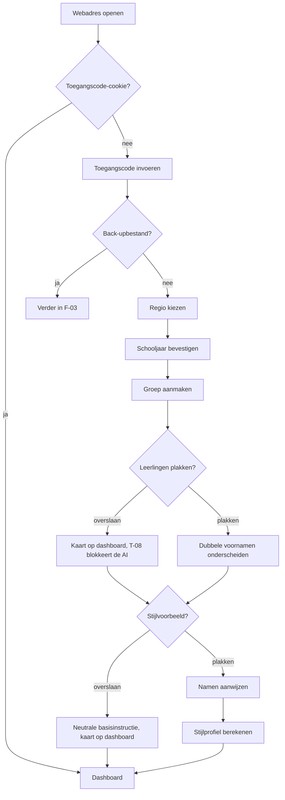

**Beslispunten**

Na stap 2 splitst de flow: heb je een back-upbestand van een ander apparaat, dan sla je stap 3 tot en met 9 over en ga je verder in F-03. Bij stap 3 is er een vierde knop, "Ik weet het niet"; die kiest Midden en zet één regel in Instellingen → Agenda dat de regio nog nagekeken moet worden. Bij stap 6 en stap 8 mag je Overslaan; dat zijn de enige twee stappen die dat mogen, en beide komen terug.

| Overgeslagen stap | Waar hij terugkomt | Wanneer |
|---|---|---|
| Leerlingen (stap 6) | Kaart op het dashboard, en een blokkerende dialoog bij de eerste AI-aanroep (T-08) | De kaart meteen, de dialoog bij de eerste keer Laat AI meeschrijven |
| Stijlvoorbeeld (stap 8) | Kaart op het dashboard, en één keer een uitlegregel boven het eerste AI-voorstel | De kaart meteen, de uitlegregel bij het eerste voorstel |

De blokkerende dialoog bij een lege leerlingenlijst is geen waarschuwing die je wegklikt: hij heeft twee knoppen, "Leerlingen toevoegen" en "Toch versturen, ik begrijp dat er geen namen vervangen worden". De tweede keuze wordt vastgelegd als `AuditEvent` en is zichtbaar in Instellingen → Privacy.

**Foutpaden**

| Pad | Oorzaak | Wat de app doet | Wat de gebruiker ziet | Hoe zij verder komt |
|---|---|---|---|---|
| F-01.E1 | Toegangscode fout | Telt de pogingen per IP-adres; na drie fouten 60 seconden wachten (T-17) | "Deze code klopt niet. Nog 2 pogingen." en daarna een aftelling | Code opnieuw opvragen bij de beheerder van het bestuur |
| F-01.E2 | Vakantiebestand verlopen of te oud voor 2026-2027 | Laadt het bestand niet, maakt het schooljaar met alleen de eerste en laatste schooldag | "Dit vakantiebestand loopt tot en met 2025-2026. De vakanties zet je zelf in de agenda." plus de knop Agenda openen | Vakanties zelf toevoegen, of wachten op een nieuwe versie van de app |
| F-01.E3 | Namen geplakt als één regel met spaties ertussen | Splitst niet op spaties, want voornamen mogen spaties bevatten | Eén label met de hele regel erin, en de tip "Zet elke naam op een eigen regel" met een voorbeeld van drie regels | Namen opnieuw plakken, of het label openen en handmatig splitsen |
| F-01.E4 | IndexedDB niet beschikbaar, bijvoorbeeld in een privé-venster | Stopt vóór stap 3 en schrijft niets | "EduFlow heeft opslag in de browser nodig. In een privé-venster werkt dat niet." | Een gewoon venster openen |
| F-01.E5 | Geen netwerk bij stap 2 | Stuurt niets, herhaalt niet | "Voor het invoeren van de toegangscode is internet nodig. De rest van EduFlow werkt straks ook offline." (B-47) | Verbinden en opnieuw proberen |
| F-01.E6 | Stijlvoorbeeld is langer dan 6.000 tekens | Slaat de eerste 6.000 tekens op en knipt op een alineagrens | "Dit voorbeeld is ingekort tot de eerste zes alinea's. Dat is genoeg om je stijl uit te lezen." | Niets; eventueel een korter voorbeeld plakken |

**Afbreekpunten**

Sluit je het tabblad na stap 2, dan blijft de cookie staan en hervat de flow bij stap 3. Sluit je na stap 5, dan bestaat de groep zonder leerlingen en hervat de flow bij stap 6. Sluit je na stap 7, dan is de app volledig bruikbaar en verschijnt alleen de kaart voor het stijlvoorbeeld. Er blijft nooit een half record achter: elke stap schrijft pas als hij af is.

**Toetsenbordroute**

`Tab` naar het codeveld, code typen, `Enter`. Regio met `←` en `→`, bevestigen met `Enter`. Schooljaar met `Enter`. Groepsnaam typen, `Tab` naar het type, kiezen met `↑` en `↓`, `Tab` naar Verder, `Enter`. Namen plakken met `Cmd + V`, `Tab` naar het eerste dubbele naamlabel, naam aanvullen, `Enter`. Stijlvoorbeeld plakken; namen aanwijzen doe je met `Shift + →` om te selecteren en `Cmd + K` voor Dit is een naam. Afsluiten met `Tab` naar Klaar en `Enter`. De hele flow loopt zonder muis in 27 aanslagen plus de getypte tekst.

**Telefoonverschil**

Op 390 px staat elke stap op een eigen scherm in plaats van in één doorlopende kolom, met een voortgangsbalk bovenaan en de knop Verder vastgeplakt onderaan. Tussen stap 2 en stap 3 schuift de vraag uit F-02 ertussen. Het tekstvak voor de namen is vier regels hoog en groeit mee; plakken uit een mail werkt, plakken uit een spreadsheet-app levert vaak tabs op en dat is voorzien. Het stijlvoorbeeld mag je op de telefoon overslaan met één tik, want lange tekst plakken op een telefoon is geen redelijk verzoek.

**Meetpunt**

Van de apparaten die stap 2 halen, bereikt minstens 90 procent ook stap 10 in dezelfde sessie. Het aandeel dat stap 6 overslaat is lager dan 20 procent. De tijd tussen stap 2 en stap 10 is mediaan 4 minuten en in het negende deciel korter dan 9 minuten. De app zelf gebruikt in de hele flow minder dan 12 seconden, waarvan het laden van het vakantiebestand minder dan 400 ms.

---

### 7.2 F-02 — Eerste start op de telefoon

**Wie** Fatima, op haar eigen telefoon in de BSO-ruimte, woensdag 30 september 2026, 16:55

**Aanleiding** "Ik wil dit ook op mijn telefoon, want dan kan ik het meteen na het buitenspelen doen."

**Startpunt** Safari met het webadres van EduFlow, net getypt.

**Resultaat** EduFlow staat op het beginscherm en start vanaf daar, waardoor Safari de opslag niet na zeven dagen weggooit. De toegangscode is opgeslagen.

**Frequentie** Eén keer per telefoon.

**Doeltijd** 90 seconden, waarvan de app maximaal 3 seconden.

De reden om dit te vragen is technisch en de app zegt hem hardop: Safari wist de opslag van een website die zeven dagen niet gebruikt is, en een webapp die vanaf het beginscherm start is daarvan uitgezonderd (B-02). Twee weken herfstvakantie zijn genoeg om drie weken documentaties kwijt te raken. Dat is geen randgeval, dat is oktober.

| # | Wat de gebruiker doet | Wat de app doet | Wat de gebruiker ziet |
|---|---|---|---|
| 1 | Opent het webadres in Safari | Stelt vast dat de weergavestand niet `standalone` is en dat het om iOS gaat | Het scherm met de toegangscode |
| 2 | Typt de toegangscode | Zet de cookie zoals in F-01 | Een vinkje |
| 3 | Leest de kaart "Zet EduFlow op je beginscherm" | Toont drie stappen met een afbeelding van de deelknop, en daaronder in twee zinnen waarom | Een kaart met de tekst: "Safari gooit de opslag van een website weg als je er zeven dagen niet komt. Staat EduFlow op je beginscherm, dan gebeurt dat niet." Onderaan twee knoppen: Ik doe het nu en Later |
| 4 | Tikt op de deelknop van Safari en kiest Zet op beginscherm | Kan dit niet zien en doet niets | Het standaardvenster van iOS met de naam EduFlow al ingevuld |
| 5 | Opent EduFlow vanaf het beginscherm | Meet `(display-mode: standalone)` en zet de vraag op afgerond | Eén regel bovenin: "Goed. EduFlow staat nu op je beginscherm en je werk blijft bewaard." Die regel verdwijnt na vijf seconden |
| 6 | Loopt de rest van F-01 door, of tikt Ik heb een back-upbestand | Zie F-01 stap 3 en verder, of F-03 | De stappen uit F-01, één per scherm |
| 7 | Werkt een maand door | Telt de dagen sinds de laatste back-up in `localStorage` | Na 30 dagen zonder back-up één kaart op het dashboard: "Je laatste back-up is van 30 september. Maak er nu een." met de knop Back-up maken (F-23) |

**Beslispunten**

Bij stap 3 kies je Later. Dat mag; de kaart is geen slot. De vraag komt dan terug aan het begin van de eerstvolgende sessie, en daarna hoogstens één keer per zeven dagen. Zolang de app niet vanaf het beginscherm draait, staat er in Instellingen → Opslag een blijvende regel met de datum waarop de opslag volgens Safari's regel zou kunnen vervallen, en toont het dashboard de knop Back-up maken op een prominentere plek. Op Android ziet stap 3 er anders uit: daar heet het "App installeren" in het browsermenu, en daar is de zevendagenregel niet aan de orde. De uitleg past zich aan het besturingssysteem aan; de vraag zelf blijft.

**Foutpaden**

| Pad | Oorzaak | Wat de app doet | Wat de gebruiker ziet | Hoe zij verder komt |
|---|---|---|---|---|
| F-02.E1 | De gebruiker tikt Ik doe het nu maar zet hem niet op het beginscherm | Meet bij de volgende start dat de weergavestand nog steeds een tabblad is | Bij de volgende start dezelfde kaart, met de zin "Het is nog niet gelukt" erboven | De drie stappen opnieuw volgen, met een uitgeklapte afbeelding erbij |
| F-02.E2 | De telefoon staat in een browser die geen beginscherm-snelkoppeling kan maken | Herkent de browser, slaat de kaart over | Eén kaart: "Deze browser kan EduFlow niet op je beginscherm zetten. Gebruik Safari, of maak elke week een back-up." | Safari openen, of de back-upherinnering op wekelijks zetten |
| F-02.E3 | De opslag is al gewist voordat de app op het beginscherm stond | Vindt bij het starten een lege database maar wel een geldige cookie | "Er staat niets meer in EduFlow op dit apparaat. Heb je een back-upbestand?" met de knop Terugzetten | F-03 lopen met het laatste back-upbestand |
| F-02.E4 | Er is nooit een back-up gemaakt en de opslag is gewist | Zoals E3, maar zonder bestand om terug te zetten | Dezelfde melding, plus de zin "Zonder back-upbestand is dit werk weg. Zet EduFlow nu op je beginscherm zodat het niet nog eens gebeurt." | Opnieuw beginnen met F-01, en de kaart uit stap 3 nu wel volgen |

**Afbreekpunten**

Stop je na stap 2, dan is het apparaat bruikbaar maar kwetsbaar; de app zegt dat en blijft het zeggen. Stop je na stap 4 zonder de app vanaf het beginscherm te openen, dan blijft de vraag openstaan tot de app zelf meet dat het gelukt is. De app vertrouwt daarvoor niet op jouw bevestiging maar op de weergavestand.

**Toetsenbordroute**

Deze flow heeft geen zinnige toetsenbordroute, want stap 4 gebeurt in het besturingssysteem en niet in de app. Met een gekoppeld toetsenbord loopt alles behalve stap 4 via `Tab` en `Enter`; stap 4 is bij die opstelling per definitie een aanraak- of muishandeling. Voor wie de telefoon met VoiceOver bedient, staan de drie stappen als genummerde lijst in de leesvolgorde en is de afbeelding van de deelknop voorzien van een alternatieve tekst die de plek beschrijft, niet het plaatje.

**Telefoonverschil**

Deze flow bestaat alleen op de telefoon. Op de laptop komt hij niet voor en wordt er niets gevraagd.

**Meetpunt**

Minstens 85 procent van de telefoons die stap 2 haalt, draait binnen zeven dagen in de stand `standalone`. Het aantal keren dat foutpad F-02.E4 voorkomt is nul; elk voorkomen is een incident dat in het logboek onderzocht wordt. De tijd tussen stap 3 en stap 5 is mediaan korter dan 45 seconden.

---

### 7.3 F-03 — Tweede apparaat in gebruik nemen met een back-upbestand

**Wie** Ilse, thuis op de eigen laptop, zondagavond 4 oktober 2026, 20:15

**Aanleiding** "Ik wil de foto's van vrijdag thuis afmaken, maar die staan op de schoollaptop."

**Startpunt** De thuislaptop met een leeg EduFlow, en een back-upbestand op een geheugenstick.

**Resultaat** De thuislaptop kent dezelfde leerlingen, groepen, reeksen, instellingen en documentaties als de schoollaptop op het moment van de back-up.

**Frequentie** Bij ingebruikname van een apparaat, en daarna zo vaak als je heen en weer wilt. In de praktijk: twee tot vier keer per jaar.

**Doeltijd** 6 minuten voor een volledig bestand van 1,4 GB, waarvan 4 minuten wachten op de app. Voor een bestand zonder foto's: 40 seconden.

Een documentatie leeft op één apparaat (B-01). Er is geen synchronisatie en er komt er in versie 1.0 geen. Wat er wel is, is één bestand met alles erin, dat je op een ander apparaat terugzet. Dat bestand is tegelijk je back-up (F-23), je verhuisdoos en je uitweg.

| # | Wat de gebruiker doet | Wat de app doet | Wat de gebruiker ziet |
|---|---|---|---|
| 1 | Op de schoollaptop: Instellingen → Back-up maken | Vraagt naar de omvang | Twee knoppen: Alles, inclusief foto's, ongeveer 1,4 GB en Zonder foto's, ongeveer 6 MB, met onder allebei één zin over waar je hem voor gebruikt |
| 2 | Kiest Alles | Schrijft een `.efb`-bestand met de structuur uit §8.7: `manifest.json`, één `data/<tabel>.json` per tabel en `blobs/<hash>` voor de foto's, elk met een controlegetal | Een voortgangsbalk per tabel, met de teller "612 van 1.480 records" |
| 3 | Zet het bestand op de geheugenstick | Doet niets; het bestand is van jou | De download in de browser |
| 4 | Op de thuislaptop: opent het webadres, typt de toegangscode | Zet de cookie | Het scherm uit F-01 stap 1 |
| 5 | Tikt Ik heb een back-upbestand | Slaat de rest van de eerste-keer-ervaring over | Een scherm met één knop: Kies bestand |
| 6 | Kiest `eduflow-backup-2026-10-02.efb` | Leest het `manifest.json`, controleert `schemaVersion` en de controlegetallen, en valideert een steekproef van tien records met Zod voordat er iets wordt weggeschreven | Een overzicht: "Van 2 oktober 2026, 14:12. 250 documentaties, 900 foto's, 20 leerlingen, 2 groepen, 3 reeksen, 41 agenda-items, 1 stijlvoorbeeld, 1,4 GB" |
| 7 | Kiest Terugzetten | Leegt de database en schrijft alle records in de volgorde van het manifest, foto's als laatste | Een voortgangsbalk met de tabelnaam erbij, en de tekst "Sluit dit tabblad niet" |
| 8 | Wacht | Verwerkt ongeveer 6 MB per seconde aan foto's en 1.200 records per seconde aan tekst | De teller loopt door, met een geschatte resterende tijd na de eerste tien seconden |
| 9 | Tikt Klaar | Bouwt de zoekindex in het geheugen op (T-16) en opent het dashboard | Het dashboard met de vijf laatste documentaties, precies zoals op de schoollaptop |

**Beslispunten**

Bij stap 1 kies je de omvang. Zonder foto's is de juiste keuze als je alleen leerlingen, groepen, reeksen, agenda en instellingen wilt overzetten; dat is wat je doet bij een nieuw apparaat waar je vanaf nul wilt documenteren. Bij stap 6 splitst de flow in twee standen:

| Stand | Wat er gebeurt | Wanneer je hem kiest |
|---|---|---|
| Terugzetten | De database wordt geleegd en volledig gevuld met wat er in het bestand zit | Op een leeg apparaat, of als je zeker weet dat het bestand nieuwer is dan wat er staat |
| Toevoegen | Alleen records waarvan het `id` nog niet bestaat worden toegevoegd; botsende `id`'s worden overgeslagen en geteld | Als je op dit apparaat werk hebt staan dat je wilt houden |

Terugzetten op een apparaat waar al gegevens staan, vraagt om een bevestiging waarin je het aantal documentaties overtypt dat je weggooit. Toevoegen voegt nooit samen binnen één record: bij een botsing wint altijd wat er al staat, en de overgeslagen records staan met titel en datum in een rapport dat je kunt bewaren. Dat is bewust bot; regels die per veld samenvoegen zijn niet uit te leggen en niet te controleren.

**Foutpaden**

| Pad | Oorzaak | Wat de app doet | Wat de gebruiker ziet | Hoe zij verder komt |
|---|---|---|---|---|
| F-03.E1 | Het bestand is van een nieuwere `schemaVersion` | Stopt vóór de eerste schrijfhandeling | "Dit bestand komt van een nieuwere versie van EduFlow. Werk deze laptop eerst bij." | De app op het andere apparaat en dit apparaat op dezelfde versie brengen |
| F-03.E2 | Het bestand is van een oudere `schemaVersion` | Draait de migraties in volgorde op de records in het geheugen, en pas daarna wegschrijven | "Dit bestand komt van versie 1.0.3. EduFlow werkt het bij tijdens het terugzetten." | Niets |
| F-03.E3 | Een controlegetal van een foto klopt niet | Zet alle andere records terug en slaat deze foto over | "Terugzetten gelukt. 1 van de 900 foto's was beschadigd en is overgeslagen: Kunstwerk Dok, 12 september, foto 3." | De documentatie openen en de foto opnieuw toevoegen vanaf het andere apparaat |
| F-03.E4 | De opslag op het nieuwe apparaat is te klein | Meet vóór stap 7 het benodigde aantal bytes tegen `navigator.storage.estimate()` | "Dit bestand is 1,4 GB en er is 0,9 GB vrij. Kies Zonder foto's, of maak ruimte." | Een back-up zonder foto's maken, of opruimen volgens F-24 |
| F-03.E5 | Het tabblad wordt gesloten tijdens stap 8 | Merkt bij de volgende start dat de vlag `restoreInProgress` aanstaat | "Het terugzetten is halverwege afgebroken. EduFlow zet de database leeg en begint opnieuw." met de knop Bestand opnieuw kiezen | Het bestand opnieuw kiezen |
| F-03.E6 | Het bestand is geen `.efb` of het archief is stuk | Leest het manifest niet | "Dit bestand kan EduFlow niet lezen. Kies een bestand dat eindigt op `.efb`." | Het juiste bestand zoeken |

**Afbreekpunten**

Tussen stap 2 en stap 4 kan er weken zitten; het bestand veroudert dan, en dat is zichtbaar in de datum op het overzicht in stap 6. Breekt het terugzetten af, dan is de database gegarandeerd leeg en niet half gevuld: dat is de reden dat stap 7 begint met legen en niet met samenvoegen. Een half teruggezette database is erger dan een lege.

**Toetsenbordroute**

`g` `i` naar Instellingen, `Tab` naar Back-up maken, `Enter`, omvang kiezen met `←` en `→`, `Enter`. Op het tweede apparaat: code typen, `Enter`, `Tab` naar Ik heb een back-upbestand, `Enter`, `Enter` op Kies bestand opent het systeemvenster, bestand kiezen met de pijltjes, `Enter`, `Tab` naar Terugzetten, `Enter`, bevestiging overtypen, `Enter`.

**Telefoonverschil**

Op de telefoon werkt terugzetten hetzelfde, maar een bestand van 1,4 GB kiezen uit Bestanden op iOS is traag en het geheugengebruik ligt hoger. Daarom leest de app op de telefoon het archief in blokken van 20 MB in plaats van in één keer, en waarschuwt hij bij bestanden boven 800 MB dat de telefoon aan de lader moet. De omvang Zonder foto's is op de telefoon de voorgeselecteerde keuze bij het maken van een back-up.

**Meetpunt**

Terugzetten van een bestand van 1,4 GB duurt op de referentieopstelling korter dan 5 minuten en gebruikt nooit meer dan 400 MB werkgeheugen. Na stap 9 is het aantal records in de database exact gelijk aan het aantal in het manifest, minus de overgeslagen records uit het rapport. Dat wordt bij elke uitgave getest met een vast back-upbestand in de testset (zie hoofdstuk 17).

---

## Deel B — documenteren

### 7.4 F-04 — Documentatie schrijven in schrijfmodus, van leeg tot gedeeld

**Wie** Ilse, op de laptop in het lokaal, donderdag 24 september 2026, 15:40, de kinderen zijn net weg

**Aanleiding** "Vanmiddag gebeurde er iets goeds bij het dok. Dat wil ik vastleggen voordat ik het kwijt ben, en de ouders mogen het zien."

**Startpunt** Het dashboard, net geopend.

**Resultaat** Eén `Documentation` met een titel, een datum, een reeks, een groep, drie gekoppelde leerlingen, zes foto's, een lopende tekst, één citaat, twee pagina's en de status gedeeld. Er ligt een PDF in Downloads en een afbeelding op het klembord.

**Frequentie** Eén tot drie keer per week per gebruiker, met een piek op donderdag en vrijdag. Dit is de flow die het vaakst gelopen wordt en die het zwaarst weegt.

**Doeltijd** 8 minuten van dashboard tot status gedeeld, waarvan de app maximaal 25 seconden voor zichzelf gebruikt. Het AI-voorstel telt daar voor 7 seconden in mee.

Dit is de flow waar het product op staat of valt. Alles wat er in de app zit, dient deze acht minuten. Als deze flow twaalf minuten kost, kiest Ilse in november weer voor een appbericht met vier foto's zonder tekst.

| # | Wat de gebruiker doet | Wat de app doet | Wat de gebruiker ziet |
|---|---|---|---|
| 1 | Drukt `n` of tikt Nieuwe documentatie | Opent het schrijfscherm zonder een record aan te maken (B-34) | Een leeg schrijfscherm: titelveld met de aanwijzer erin, daaronder een leeg tekstblok, rechts de kolom met datum, reeks, groep en leerlingen, onderaan de balk met Opslaan, Print-PDF en Deelbare afbeelding |
| 2 | Typt de titel "Bouwen aan het dok" | Wacht één seconde stilte en maakt dan de `Documentation` aan met een `id` volgens UUIDv7, `createdAt`, `rev` 1 en de status concept (T-11, T-09) | Rechtsboven verschijnt "Opgeslagen 15:41". De documentatie staat vanaf nu in de lijst |
| 3 | Zet de datum op 24 september | Werkt het datumveld bij; de datum is de gebeurtenisdatum, niet het moment van schrijven | Een datumkiezer die standaard op vandaag staat |
| 4 | Kiest de reeks Kunstwerk Dok | Legt een verwijzing naar de `Series` vast; de reeksnaam komt niet in de opgeslagen titel (B-35) | Een keuzelijst met de drie bestaande reeksen, een zoekveld en de knop Nieuwe reeks. Onder de keuze verschijnt: "Documentatie 4 van deze reeks" |
| 5 | Kiest de groep Groep 4 – De Regenboog | Legt de expliciete koppeling vast in `documentation_groups` (B-17) | De groepsnaam als label, met een kruisje om hem los te maken |
| 6 | Kiest de leerlingen Aya, Kjeld en Noa B. | Legt drie rijen in `documentation_students` vast | Een lijst met de twintig leerlingen van de groep, met een zoekveld erboven; gekozen namen komen bovenaan te staan |
| 7 | Sleept zes foto's uit een map het scherm op | Verkleint elke foto naar 3300 px op de lange zijde, maakt de varianten thumb 480, screen 1280 en print 3300, en maakt zes `PhotoBlock`-blokken in de volgorde van het slepen (T-02) | Zes miniaturen die één voor één scherp worden, met een teller "3 van 6" en per foto een voortgangsring |
| 8 | Typt haar ruwe notitie in het tekstblok | Slaat op na één seconde stilte en bij elk verlies van de aanwijzer | Ongeveer 120 woorden losse zinnen: "kjeld idee met de kraan / aya bang dat het omvalt / uiteindelijk met z'n drieën steunbalk gemaakt / noa b heeft de container erin gehesen" |
| 9 | Tikt Citaat toevoegen en typt wat Kjeld zei | Maakt een `QuoteBlock` met een verwijzing naar Kjeld; het citaat gaat straks door `PrivacyService` net als alle andere tekst (B-37) | Een blok met een aanhalingsteken, een tekstveld en een keuzelijst met de drie gekoppelde leerlingen |
| 10 | Drukt `Cmd + Enter` of tikt Laat AI meeschrijven | Start de keten uit F-08: pseudonimiseren, opdracht opbouwen, controlescherm | Het controlescherm schuift over het scherm (zie F-08) |
| 11 | Leest het controlescherm en tikt Versturen | Roept `AIService.run()` aan via de eigen server en zet de codes daarna terug om in namen | Een wachtindicator met de verstreken tijd in hele seconden, en de knop Annuleren |
| 12 | Leest het voorstel | Toont het voorstel onder haar eigen tekst, niet in een apart paneel | Ongeveer 160 woorden lopende tekst met haar eigen woorden erin, en drie knoppen: Overnemen, Opnieuw, Weggooien |
| 13 | Tikt Overnemen en kiest Vervangen | Vraagt eerst aanvullen of vervangen (B-39), legt de oude tekst vast in `aiUndoSnapshot` (T-43) en zet dan de nieuwe tekst in het tekstblok | Een dialoog met twee knoppen en één zin uitleg per knop; daarna de nieuwe tekst met een gele rand die na drie seconden vervaagt, en de regel "Ongedaan maken" rechtsboven |
| 14 | Leest de tekst door en past twee woorden aan | Slaat op na één seconde stilte en telt de wijzigingen mee voor de correctieregels (zie §6.5.4) | De tekst met de aanwijzer erin, "Opgeslagen 15:47" rechtsboven |
| 15 | Drukt `Cmd + E` of tikt Print-PDF | Opent het exportpaneel dat over het schrijfscherm schuift (B-06) | Vier miniaturen met de layouts A tot en met D, een voorbeeld van de eerste pagina en de regel "2 pagina's" |
| 16 | Kiest layout A-fotoraster | Laat `LayoutService` de blokken over de sloten verdelen; zes foto's en de tekst passen niet op één A4 liggend, dus maakt `PageService` een tweede `Page` met layout E-vervolg (B-07, B-15) | Het voorbeeld wisselt, en onder het voorbeeld staan twee paginaminiaturen met de titel op allebei |
| 17 | Bladert door de twee pagina's | Rendert het voorbeeld op schermresolutie uit dezelfde layoutdefinitie als de PDF (B-26) | Pagina 1 met het fotoraster en de eerste alinea's, pagina 2 met de rest van de tekst, het citaat en de herhaalde titel |
| 18 | Tikt Print-PDF maken | Genereert de PDF met `pdf-lib` op een canvas van 297 × 210 mm met 10 mm marge (T-03, T-13) | Een voortgangsbalk per pagina en daarna de download |
| 19 | Ziet de status wisselen | Zet de status op gedeeld, want de eerste geslaagde export is de overgang (B-13) | Bovenin het schrijfscherm wisselt het grijze label concept naar het groene label gedeeld |
| 20 | Tikt Deelbare afbeelding | Toont eenmalig per documentatie de bevestiging beeldgebruik (B-08) | Een dialoog: "Van deze foto's maak je iets dat de school verlaat. Heb je van deze kinderen toestemming voor beeldgebruik?" met een vinkje voor namen vervangen door initialen |
| 21 | Zet het vinkje aan en bevestigt | Vervangt de namen door initialen, geeft botsende initialen een oplopende letter (B-40) en rastert de gegenereerde PDF met `pdf.js` (B-27, T-14) | Twee afbeeldingen, één per pagina, met onderaan een legenda: "K. = Kjeld, A. = Aya, N. = Noa B." |
| 22 | Tikt Kopieer afbeelding | Zet de eerste pagina als PNG op het klembord (B-09) | "Gekopieerd" gedurende twee seconden |

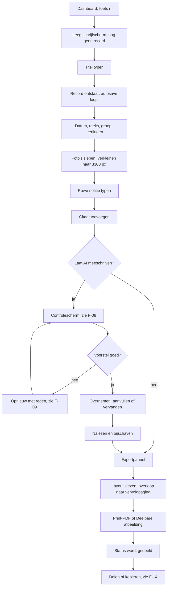

**Beslispunten**

De flow splitst zich op zes plekken, en op vijf daarvan is doorlopen zonder keuze de snelste route.

| Waar | Splitsing | Waarom |
|---|---|---|
| Stap 1 | Schrijfmodus of gespreksmodus | Op de laptop is schrijfmodus de standaard; de keuze staat als tweede knop in het scherm, niet als vraag vooraf (B-14) |
| Stap 4 | Wel of geen reeks | Zonder reeks is er geen vervolgzin uit eerdere delen (B-04) en dat scheelt merkbaar aan de kwaliteit van het voorstel |
| Stap 6 | Leerlingen expliciet koppelen of overslaan | De expliciete koppeling gaat boven de afgeleide; koppel je niets, dan toont de app de leerlingen uit de groep als suggestie maar legt niets vast (B-17) |
| Stap 10 | Wel of niet AI laten meeschrijven | Zelf schrijven mag; het exportpad is identiek. De zinslengte-eis geldt alleen voor wat de AI oplevert (B-41) |
| Stap 13 | Aanvullen of vervangen | Aanvullen zet het voorstel onder je eigen tekst en laat beide staan; vervangen ruilt ze om. Beide zijn ongedaan te maken (B-39, T-07) |
| Stap 16 | Layout A, B, C of D | De app kiest niet zelf (B-11). Kies je D bij een documentatie met tekst, dan krijgt die tekst een vervolgpagina in plaats van te verdwijnen (B-28) |

**Foutpaden**

| Pad | Oorzaak | Wat de app doet | Wat de gebruiker ziet | Hoe zij verder komt |
|---|---|---|---|---|
| F-04.E1 | Geen netwerk bij stap 10 | Bouwt de opdracht wel op, verstuurt niets, laat de tekst ongemoeid | Een grijze balk boven het tekstblok: "Je bent offline. Schrijven, foto's toevoegen en exporteren werken gewoon; meeschrijven niet." De knop heet nu Opnieuw proberen (B-47) | Later opnieuw drukken; alles wat ze getypt heeft staat er nog |
| F-04.E2 | De leerlingenlijst is leeg | Blokkeert de aanroep vóór het opbouwen van de opdracht (T-08) | Een dialoog met twee knoppen: Leerlingen toevoegen en Toch versturen, met de gevolgen erbij | Leerlingen toevoegen, of één keer bewust bevestigen; die bevestiging komt in het logboek |
| F-04.E3 | Een foto is een formaat dat de browser niet kan lezen | Slaat die ene foto over en gaat door met de rest | Bij de betreffende miniatuur een rood kruis en de regel "Dit bestand kan de browser niet openen. Sla het op als JPEG of PNG." | De foto omzetten en opnieuw slepen; de andere vijf staan er al |
| F-04.E4 | `QuotaExceededError` tijdens autosave | Houdt de tekst in het scherm, schrijft niets weg, zet de vlag opslag-vol | Een rode balk die blijft staan: "De opslag is vol. Je tekst staat nog op het scherm maar is niet opgeslagen. Ruim eerst op." met de knop Opslag opruimen | F-24 lopen in een tweede tabblad, daarna terugkomen en `Cmd + S` drukken |
| F-04.E5 | Het dagbudget van de snelheidslimiet is op (T-17) | Weigert de aanroep op de server, niet in de browser | "Je hebt vandaag het maximum aan AI-verzoeken bereikt. Morgen om 00:00 kun je weer verder." | Zelf schrijven en morgen het voorstel vragen; de tekst blijft staan |
| F-04.E6 | De provider antwoordt niet binnen 30 seconden | Probeert één keer opnieuw, wacht opnieuw 30 seconden en stopt dan | Na de eerste poging: "Het duurt langer dan normaal. EduFlow probeert het nog één keer." Daarna: "Geen antwoord van de AI-dienst." met de knop Opnieuw | Opnieuw drukken, of doorwerken zonder voorstel |
| F-04.E7 | Het tabblad wordt gesloten tijdens stap 8 | Heeft bij het verlies van de aanwijzer al opgeslagen; hoogstens één seconde typen gaat verloren | Bij het opnieuw openen staat de documentatie in de lijst met de tekst tot de laatste opslag | Verder typen |
| F-04.E8 | De PDF-generatie loopt vast op een foto die niet decodeert | Stopt de export, gooit niets weg | "De PDF is niet gelukt. Foto 4 kon niet worden verwerkt." met de knop Foto vervangen | De foto verwijderen of vervangen en opnieuw exporteren; de status blijft concept |
| F-04.E9 | Twee tabbladen met dezelfde documentatie open | Merkt via een `BroadcastChannel` dat het andere tabblad schrijft | In het oudste tabblad: "Deze documentatie is in een ander tabblad geopend. Hier kun je alleen lezen." | Het andere tabblad gebruiken, of hier vernieuwen |

**Afbreekpunten**

| Waar zij stopt | Wat er achterblijft | Wat zij bij terugkomst ziet |
|---|---|---|
| Vóór stap 2 | Niets. Er is geen record en er staat niets in de lijst (B-34) | Niets |
| Na stap 2 | Een documentatie met alleen een titel, status concept | De regel in de lijst met de titel en de datum |
| Na stap 7 | Een documentatie met foto's zonder tekst; die foto's tellen mee in de opslag | De regel in de lijst met een fotomarkering en de telling "6 foto's" |
| Na stap 11, vóór stap 13 | Alleen een `AIInteraction` met uitkomst "afgebroken". Het voorstel zelf wordt niet bewaard | Haar eigen tekst, ongewijzigd, zonder voorstel |
| Na stap 13, vóór stap 18 | De overgenomen tekst en de `aiUndoSnapshot` met de vorige versie | De documentatie met status concept, en de mogelijkheid de vorige tekst terug te halen zolang de momentopname er staat |
| Na stap 18 | Alles, en de status staat op gedeeld | De documentatie in de lijst met het groene label |

Een documentatie die je halverwege verlaat is nooit stuk. Er is geen tussentoestand waarin blokken naar pagina's verwijzen die niet bestaan, want `PageService` maakt pagina's pas bij het openen van het exportpaneel en berekent ze opnieuw bij elke wijziging.

**Toetsenbordroute**

Vanaf het dashboard: `n`. De aanwijzer staat in het titelveld. Titel typen, `Tab` naar de datum, datum met de pijltjes of typen, `Tab` naar de reeks, eerste letters typen en `Enter`, `Tab` naar de groep, `Enter`, `Tab` naar leerlingen, per leerling de eerste letters typen en `Enter`, `Tab` naar het tekstblok, notitie typen. Citaat toevoegen met `Cmd + Shift + C`; die opent een blok en zet de aanwijzer erin. Foto's toevoegen met `Tab` naar Foto toevoegen en `Enter`, wat het systeemvenster opent; meerdere bestanden kiezen met `Shift` en de pijltjes. Volgorde wijzigen met `Alt + ↑` en `Alt + ↓`. Meeschrijven met `Cmd + Enter`. In het controlescherm loopt de aanwijzer langs de vijf onderdelen; `Esc` sluit, `Enter` op Versturen verstuurt. Het voorstel krijgt de aanwijzer zodra het binnen is, met een melding via de leesregel. Overnemen met `Enter`, daarna `←` en `→` tussen Aanvullen en Vervangen, `Enter`. Ongedaan maken met `Cmd + Z`. Exportpaneel met `Cmd + E`, layout kiezen met `←` en `→`, pagina's doorbladeren met `PageUp` en `PageDown`, exporteren met `Enter` op de knop. `Esc` sluit het paneel en zet de aanwijzer terug op Print-PDF.

**Telefoonverschil**

Op 390 px staat de rechterkolom niet naast maar onder de titel, ingeklapt tot één regel: "24 september · Kunstwerk Dok · Groep 4 · 3 leerlingen". Tikken klapt hem uit. De onderbalk met Opslaan, Print-PDF en Deelbare afbeelding wordt een vastgeplakte balk met drie tikdoelen van elk minstens 44 px hoog. Foto's toevoegen gaat via de camera of de fotorollen, niet via slepen; het verkleinen naar 3300 px duurt op de telefoon ongeveer 1,4 seconde per foto in plaats van 0,6, en gebeurt in een `Worker` zodat het typen niet hapert. Het exportpaneel is een vol scherm met een sluitkruis linksboven. Het controlescherm is even compleet als op de laptop; er wordt niets weggelaten omdat het scherm smal is. De standaard op de telefoon is gespreksmodus (F-05), maar schrijfmodus is met één tik bereikbaar en volledig.

**Meetpunt**

De mediane tijd van stap 1 tot stap 19 is 8 minuten en het negende deciel ligt onder 15 minuten. Van de documentaties die stap 2 halen, bereikt minstens 80 procent binnen 24 uur de status gedeeld. Het aandeel AI-voorstellen dat wordt overgenomen is minstens 70 procent, en het gemiddelde aantal keren Opnieuw per documentatie ligt onder 1,0. De app gebruikt van de acht minuten minder dan 25 seconden: zes foto's verkleinen onder 4 seconden, het controlescherm openen onder 300 ms, de PDF van twee pagina's genereren onder 3 seconden, de afbeelding rasteren onder 2 seconden. Het aantal documentaties met status concept dat ouder is dan 14 dagen, is een signaal dat deze flow ergens vastloopt; boven 15 procent van het totaal is dat reden om de foutpaden na te lopen.

---

### 7.5 F-05 — Documentatie maken in gespreksmodus op de telefoon

**Wie** Fatima, op de telefoon in de BSO-ruimte, dinsdag 22 september 2026, 17:10, kinderen zitten aan tafel

**Aanleiding** "Ik heb net zeven foto's gemaakt van de hut. Als ik het nu niet opschrijf, weet ik vanavond niet meer wie wat deed."

**Startpunt** EduFlow vanaf het beginscherm, dashboard.

**Resultaat** Een documentatie met zes foto's, zes beantwoorde vragen omgezet in lopende tekst, en de status concept.

**Frequentie** Twee tot vijf keer per week voor wie voornamelijk op de telefoon werkt.

**Doeltijd** 4 minuten voor zes foto's, waarvan de app maximaal 20 seconden.

De foto's stellen de vragen (B-03). Dat is geen metafoor: de app toont je foto groot en zet er één vraag bij. De foto blijft op het apparaat en gaat nooit naar de AI. Alleen jouw antwoord gaat weg, samen met je stijlprofiel en de reekscontext. De app kijkt niet naar de foto en beschrijft hem niet; de vragen zijn een vaste reeks die meebeweegt met het aantal foto's.

| # | Wat de gebruiker doet | Wat de app doet | Wat de gebruiker ziet |
|---|---|---|---|
| 1 | Tikt Nieuwe documentatie | Toont de keuze tussen twee modi | Twee grote knoppen: Vertellen en Schrijven, met onder elk één zin. Op de telefoon staat Vertellen vooraan |
| 2 | Tikt Vertellen | Opent de fotokiezer van het besturingssysteem | De fotorollen met de nieuwste foto's bovenaan |
| 3 | Kiest zes foto's | Leest de opnamedatum uit elke foto, verkleint naar 3300 px, maakt zes `PhotoBlock`-blokken en zet de gebeurtenisdatum op de datum van de eerste foto | Zes miniaturen op een rij met een teller, en de regel "Datum: 22 september, uit je foto's" met een potloodje |
| 4 | Tikt Beginnen | Zet foto 1 groot in beeld met de eerste vraag eronder | De foto over driekwart van het scherm, daaronder "Wat gebeurde hier?" en een tekstveld van drie regels met de microfoonknop van het toetsenbord beschikbaar |
| 5 | Dicteert twee regels | Slaat het antwoord op als los `TextBlock` gekoppeld aan die foto, zodra het veld de aanwijzer verliest | Haar eigen woorden in het veld, en onderin "1 van 6" met de knop Volgende |
| 6 | Tikt Volgende | Toont foto 2 met de tweede vraag | "Wat deden de kinderen daarna?" |
| 7 | Herhaalt dit voor foto 3 tot en met 6, slaat foto 5 over | Bewaart per foto het antwoord; een overgeslagen foto blijft in de documentatie staan maar krijgt geen tekst | Bij elke foto een andere vraag uit de vaste reeks, en onderaan Overslaan naast Volgende |
| 8 | Beantwoordt de twee slotvragen | Bewaart ze als losse antwoorden met een eigen rol in de opdracht | "Wat wil je dat ouders hieruit meenemen?" en "Heeft een kind iets gezegd dat je wilt vastleggen?" |
| 9 | Tikt Maak er een documentatie van | Voegt de antwoorden samen tot één tekst, laat `PrivacyService` erover lopen en bouwt de opdracht op | Het controlescherm, gevuld met de zes antwoorden en zonder één verwijzing naar een foto (zie F-08) |
| 10 | Tikt Versturen | Roept de AI aan | Een wachtindicator met de verstreken seconden |
| 11 | Leest het voorstel en tikt Overnemen | Vraagt aanvullen of vervangen; bij gespreksmodus staat Vervangen vooraan, want de antwoorden zijn ruwe invoer | Het voorstel onder de antwoorden, met de drie knoppen |
| 12 | Belandt in het schrijfscherm | Vervangt de losse antwoorden door één `TextBlock` met de lopende tekst; de zes `PhotoBlock`-blokken houden hun volgorde | Het gewone schrijfscherm met titelveld, tekst en foto's, status concept |

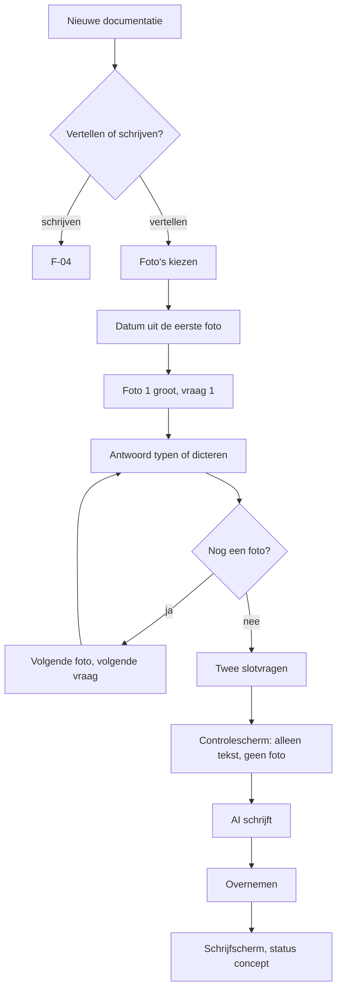

**Beslispunten**

Bij stap 1 kies je de modus. Die keuze geldt alleen voor deze documentatie en wordt onthouden als voorkeur per apparaat. Bij stap 3 mag je nul foto's kiezen; dan wordt het een gesprek van drie algemene vragen zonder beeld. Bij elke vraag mag je Overslaan; een overgeslagen foto verdwijnt niet uit de documentatie, hij levert alleen geen tekst. Bij stap 7 staat naast Volgende ook de knop Klaar, zodat je na vier van de zes foto's al kunt afronden; de resterende foto's blijven staan. Halverwege wisselen naar schrijfmodus is een aparte flow (F-07). De vaste vragenreeks staat als gegeven in `PromptService` en niet in code; hij is per taalinstelling anders, zodat "Leerling" en "Kind" ook in de vragen kloppen.

**Foutpaden**

| Pad | Oorzaak | Wat de app doet | Wat de gebruiker ziet | Hoe zij verder komt |
|---|---|---|---|---|
| F-05.E1 | De AI is onbereikbaar bij stap 10 | Laat alle antwoorden staan als losse tekstblokken en maakt er een gewone documentatie van | "Geen verbinding met de AI-dienst. Je antwoorden staan er allemaal; je kunt ze zelf tot tekst maken of het later opnieuw proberen." | Later opnieuw drukken vanuit het schrijfscherm, of zelf herschrijven. Er gaat niets verloren |
| F-05.E2 | De app gaat naar de achtergrond tijdens vraag 4 | Slaat het antwoord op bij het verlies van de aanwijzer en bij `visibilitychange` | Bij terugkomst staat het gesprek op vraag 4 met het antwoord erin | Doortikken |
| F-05.E3 | Dicteren wordt geweigerd of levert niets | Doet niets bijzonders; het tekstveld is met opzet een gewoon veld zonder slimme invoer | Het lege veld met het toetsenbord | Typen |
| F-05.E4 | De opnamedatum ontbreekt in de foto's | Zet de gebeurtenisdatum op vandaag | "Datum: 22 september, vandaag" met het potloodje | De datum zelf aanpassen |
| F-05.E5 | De foto's komen uit twee verschillende dagen | Neemt de datum van de oudste foto en meldt het verschil | "Deze foto's komen van twee dagen. EduFlow houdt 21 september aan." | De datum aanpassen of de foto's splitsen over twee documentaties |
| F-05.E6 | Alle vragen overgeslagen, geen tekst | Blokkeert de AI-aanroep, want er is niets te versturen | "Er is nog geen tekst om mee te werken. Beantwoord minstens één vraag." | Terug naar een foto en één antwoord typen |

**Afbreekpunten**

De documentatie ontstaat bij stap 3, want foto's zijn inhoud (B-34). Stop je na vraag 2, dan staan zes foto's en twee tekstblokken in de lijst als concept. De vragen zelf worden niet bewaard als tekst; ze zijn de aanleiding, geen inhoud. Kom je later terug, dan opent de documentatie in schrijfmodus met de antwoorden als losse alinea's, in de volgorde van de foto's. Terug naar het gesprek kan niet (B-58); de antwoorden zijn dan tekst geworden en die opnieuw in vragen persen levert een tweede waarheid op.

**Toetsenbordroute**

Met een gekoppeld toetsenbord: `Tab` naar Vertellen, `Enter`. De fotokiezer is van het besturingssysteem. Daarna staat de aanwijzer in het antwoordveld; `Enter` gaat naar de volgende vraag, `Shift + Enter` maakt een nieuwe regel in het antwoord, `Cmd + ↓` slaat over. `Esc` verlaat het gesprek en vraagt of je naar schrijfmodus wilt. De voortgang wordt bij elke vraag via de leesregel aangekondigd als "Vraag 3 van 6" plus de vraagtekst.

**Telefoonverschil**

Dit is de telefoonflow; F-06 beschrijft dezelfde functie op de laptop. Het verschil zit in de fotokiezer, in de grootte van de foto op het scherm en in het feit dat dicteren hier de normale invoer is en typen de uitzondering.

**Meetpunt**

De mediane tijd van stap 2 tot stap 12 is 4 minuten bij zes foto's, oftewel ongeveer 35 seconden per foto inclusief nadenken. Minstens 70 procent van de gestarte gesprekken haalt stap 9. Het gemiddelde antwoord is langer dan 12 woorden; korter betekent dat de vragen niet werken en dan wordt de vragenreeks herzien. Van de gesprekken die stap 9 halen, eindigt minstens 85 procent met Overnemen.

---

### 7.6 F-06 — Gespreksmodus op de laptop

**Wie** Bram, op de laptop in de personeelskamer, maandag 5 oktober 2026, 16:20

**Aanleiding** "Mijn duo heeft vrijdag met groep 7 het bezoek aan de waterzuivering gedaan en de foto's naar me gestuurd. Ik weet er zelf niets van, dus ik moet ze eerst bekijken."

**Startpunt** Documentatieoverzicht, knop Nieuwe documentatie.

**Resultaat** Dezelfde soort documentatie als in F-05, maar gemaakt achter een groot scherm met alle vragen tegelijk zichtbaar.

**Frequentie** Zelden voor wie vooral op de laptop werkt; vaak voor wie foto's van een collega krijgt.

**Doeltijd** 5 minuten voor zes foto's, waarvan de app maximaal 15 seconden.

Dezelfde motor als F-05, andere schil. Het wezenlijke verschil is dat een breed scherm alle vragen tegelijk kan tonen, en dat verandert de manier waarop je werkt: je springt heen en weer in plaats van door te lopen.

| # | Wat de gebruiker doet | Wat de app doet | Wat de gebruiker ziet |
|---|---|---|---|
| 1 | Tikt Nieuwe documentatie en daarna Vertellen | Opent gespreksmodus in de tweekolomsindeling | Links een kolom met de vragen, rechts het antwoordveld, bovenaan de foto |
| 2 | Kiest zes foto's uit een map, of sleept ze het venster op | Verkleint en maakt de blokken, zoals in F-05 stap 3 | Zes miniaturen als een rij onder de grote foto |
| 3 | Klikt op vraag 1 | Zet foto 1 groot en de aanwijzer in het antwoordveld | De foto op 640 px breed, de vraag als kop boven het veld |
| 4 | Typt drie regels en drukt `Enter` | Bewaart en gaat naar vraag 2 | De vraag in de linkerkolom krijgt een vinkje |
| 5 | Springt naar vraag 5 door erop te klikken | Bewaart wat er stond en toont foto 5 | De linkerkolom laat zien welke vragen af zijn en welke niet |
| 6 | Vult de overige vragen | Bewaart per vraag | Vinkjes in de kolom |
| 7 | Beantwoordt de twee slotvragen onderaan de kolom | Bewaart ze met hun eigen rol | Twee velden onder een streep |
| 8 | Klikt Maak er een documentatie van | Zoals F-05 stap 9 | Het controlescherm |
| 9 | Verstuurt en neemt over | Zoals F-05 stap 10 en 11 | Het voorstel, en daarna het schrijfscherm |
| 10 | Vult de titel, de groep en de leerlingen aan | Legt de koppelingen vast | Het gewone schrijfscherm |

**Beslispunten**

Gespreksmodus is op de laptop niet de standaard maar wel volwaardig aanwezig; de knop staat naast Schrijven en niet in een menu. Bij stap 5 kun je vrij springen, wat op de telefoon niet kan; daar is de volgorde lineair omdat er geen ruimte is voor een tweede kolom. Wisselen naar schrijfmodus gaat op de laptop met dezelfde knop als op de telefoon en heeft dezelfde gevolgen (F-07).

**Foutpaden**

De foutpaden F-05.E1 tot en met F-05.E6 gelden onverkort, met twee verschillen. F-06.E1: sleep je een map in plaats van bestanden, dan leest de app de map één niveau diep uit en negeert submappen, met de melding "12 foto's gevonden, submappen overgeslagen". F-06.E2: sleep je meer dan 24 foto's tegelijk, dan weigert de app en meldt "Meer dan 24 foto's in één documentatie wordt onwerkbaar. Maak er twee van."

**Afbreekpunten**

Gelijk aan F-05. De vragen die je niet beantwoord hebt, laten geen spoor na.

**Toetsenbordroute**

`Tab` wisselt tussen de vragenkolom en het antwoordveld. In de kolom lopen `↑` en `↓` langs de vragen en opent `Enter` de gekozen vraag. In het veld gaat `Enter` naar de volgende onbeantwoorde vraag en maakt `Shift + Enter` een nieuwe regel. `Cmd + Enter` slaat direct door naar Maak er een documentatie van.

**Telefoonverschil**

Op 390 px vervalt de vragenkolom en wordt de flow lineair; dat is F-05. Onder 900 px valt de tweekolomsindeling automatisch terug op de lineaire vorm.

**Meetpunt**

De mediane tijd is 5 minuten bij zes foto's. Het aandeel gebruikers dat op de laptop voor Vertellen kiest, is naar verwachting onder 15 procent; dat is geen probleem en geen reden om de functie te verbergen. Wel geldt: als het aandeel onder 3 procent zakt, verhuist de knop naar het menu met drie punten.

---

### 7.7 F-07 — Halverwege wisselen van gespreksmodus naar schrijfmodus

**Wie** Fatima, op de telefoon, dinsdag 22 september 2026, 17:14, bij vraag 3 van 6

**Aanleiding** "Deze vragen passen niet bij wat er gebeurd is. Ik typ het gewoon zelf."

**Startpunt** Gespreksmodus, foto 3 in beeld, twee antwoorden gegeven.

**Resultaat** Dezelfde documentatie in schrijfmodus, met de gegeven antwoorden als tekst en alle foto's in dezelfde volgorde.

**Frequentie** Bij ongeveer één op de zes gesprekken.

**Doeltijd** 15 seconden, waarvan de app maximaal 1 seconde.

| # | Wat de gebruiker doet | Wat de app doet | Wat de gebruiker ziet |
|---|---|---|---|
| 1 | Tikt de knop met drie punten rechtsboven | Opent het menu | Drie regels: Naar schrijfmodus, Datum aanpassen, Documentatie weggooien |
| 2 | Tikt Naar schrijfmodus | Vraagt om bevestiging, want de stap is niet terug te draaien (B-58) | "Je antwoorden blijven staan als tekst. De vragen verdwijnen en je kunt niet terug naar het gesprek." met de knoppen Wisselen en Blijven |
| 3 | Tikt Wisselen | Zet elk antwoord om in een `TextBlock` in de volgorde van de foto's, laat de `PhotoBlock`-blokken staan, gooit de onbeantwoorde vragen weg en zet de modus van de documentatie op schrijven | Het schrijfscherm, met de twee antwoorden als twee alinea's en de zes foto's eronder |
| 4 | Typt verder in de tekst | Autosave zoals in F-04 | "Opgeslagen 17:15" |
| 5 | Drukt eventueel op Laat AI meeschrijven | Volgt F-08, met de volledige tekst als invoer | Het controlescherm |

**Beslispunten**

De enige splitsing is Wisselen of Blijven. De omgekeerde weg bestaat niet: van schrijfmodus naar gespreksmodus binnen dezelfde documentatie kan niet. Wil je toch een gesprek, dan maak je een nieuwe documentatie. Deze regel is er omdat een gesprek antwoorden op vragen is en een tekst één geheel; terugvertalen betekent gokken welke zin bij welke vraag hoorde, en dat is precies het soort slimmigheid dat U-05 verbiedt.

**Foutpaden**

| Pad | Oorzaak | Wat de app doet | Wat de gebruiker ziet | Hoe zij verder komt |
|---|---|---|---|---|
| F-07.E1 | Wisselen terwijl er nul antwoorden zijn | Wisselt zonder tekst, houdt de foto's | Het schrijfscherm met zes foto's en een leeg tekstblok | Zelf typen |
| F-07.E2 | Het huidige antwoord is nog niet opgeslagen | Slaat het antwoord op vóór het wisselen | Het antwoord staat als laatste alinea in de tekst | Niets |

**Afbreekpunten**

Sluit je de app tussen stap 2 en stap 3, dan is er niets gewisseld en staat het gesprek nog waar het stond. Het wisselen is één schrijfhandeling; er is geen halve toestand.

**Toetsenbordroute**

`Tab` naar de knop met drie punten, `Enter`, `↓` naar Naar schrijfmodus, `Enter`, `Tab` naar Wisselen, `Enter`. Zeven aanslagen. Na het wisselen staat de aanwijzer aan het einde van de laatste alinea.

**Telefoonverschil**

Op de telefoon staat de knop met drie punten rechtsboven in de balk; op de laptop staat hij op dezelfde plek, plus is Naar schrijfmodus daar als tekstlink onder de vragenkolom zichtbaar, omdat er ruimte voor is.

**Meetpunt**

De wissel duurt minder dan 1 seconde bij twaalf foto's en twintig antwoorden. Het aandeel gesprekken dat halverwege wisselt is een signaal over de kwaliteit van de vragenreeks: boven 30 procent wordt de reeks herzien.

---


### 7.8 F-08 — Laat AI meeschrijven

**Wie** Ilse, laptop, in een half geschreven documentatie
**Aanleiding** "Ik heb het opgeschreven, maar het leest als een boodschappenlijstje."
**Startpunt** schrijfscherm, tekstvlak met 180 woorden losse observaties
**Resultaat** een lopende tekst in haar eigen stijl, door haar goedgekeurd
**Frequentie** bij ongeveer acht van de tien documentaties
**Doeltijd** 25 seconden van klik tot besluit

| # | Wat de gebruiker doet | Wat de app doet | Wat de gebruiker ziet |
|---|---|---|---|
| 1 | Klikt "Laat AI meeschrijven" | `PrivacyService.pseudonymise()` over tekst en citaten | Knop wordt "Bezig met controleren" |
| 2 | — | `PromptService.build()` met stijlprofiel, twee voorbeelden, geen reekscontext | — |
| 3 | — | Controlescherm opent | Paneel met vier uitklapbare blokken: systeeminstructie, jouw stijl, voorbeelden, je tekst. Bovenaan "4 namen afgeschermd" |
| 4 | Leest, klikt "Verstuur" | `AIService.run()` met streaming | Voorstel verschijnt woord voor woord onder de eigen tekst |
| 5 | Leest mee | `PrivacyService.restore()` per binnenkomend blok | Codes zijn al namen tijdens het lezen |
| 6 | Klikt "Vergelijk met mijn tekst" | Diff berekenen | Weggehaalde woorden doorgehaald, toegevoegde onderstreept |
| 7 | Klikt "Overnemen" | Vraagt reikwijdte | Twee knoppen: "Vervang mijn tekst" en "Zet eronder" |
| 8 | Kiest "Vervang mijn tekst" | Tekst vervangen, ongedaan-punt zetten, `AIInteraction` bijwerken op `accepted` | Tekstvlak bevat de nieuwe tekst; onderaan "Overgenomen. Ongedaan maken" gedurende 20 seconden |

**Beslispunten.** Bij stap 3 kan zij annuleren zonder dat er iets weggaat. Bij stap 7 bepaalt aanvullen of vervangen wat er met haar eigen woorden gebeurt; dit is nooit impliciet (B-39).

**Foutpaden.**

- **F-08.E1 — leerlingenlijst leeg.** Bij stap 1 blokkeert `PrivacyService`. Scherm: "Je leerlingenlijst is leeg. De afscherming doet dan niets." met "Leerlingen toevoegen" en "Toch doorgaan". De tweede vraagt een eenmalige bevestiging die in het logboek komt (T-08).
- **F-08.E2 — AI onbereikbaar.** Eén stille nieuwe poging na 2 seconden. Daarna: "De AI is nu niet bereikbaar. Je tekst staat veilig." met "Opnieuw" en "Verder zonder AI".
- **F-08.E3 — antwoord onderbroken.** De ontvangen tekst blijft staan met de aanduiding "onderbroken"; Overnemen is beschikbaar, Opnieuw begint van voren.
- **F-08.E4 — leeg of onbruikbaar antwoord.** Automatisch één herhaling met dezelfde opdracht. Blijft het leeg: "De AI gaf geen bruikbaar antwoord. Probeer het met wat meer tekst."
- **F-08.E5 — dagbudget bereikt.** "Je hebt vandaag het maximum aantal AI-aanvragen bereikt (T-17). Morgen kun je weer." Alles blijft bewerkbaar.

**Afbreekpunten.** Sluit zij het tabblad tijdens het streamen, dan staat bij terugkomst haar eigen tekst er ongewijzigd; het voorstel is weg. Dat is bewust: een half voorstel bewaren levert verwarring op bij een tekst die je zelf al hebt.

**Toetsenbordroute.** `Ctrl+Enter` start, `Tab` loopt door de blokken van het controlescherm, `Enter` verstuurt, `Ctrl+Enter` neemt over, `Ctrl+Z` maakt ongedaan.

**Telefoonverschil.** Het controlescherm is een volledig scherm in plaats van een paneel; de blokken staan ingeklapt met alleen het aantal afgeschermde namen zichtbaar.

**Meetpunt.** Het aandeel voorstellen dat wordt overgenomen. Zakt dat onder 50 procent, dan klopt het stijlprofiel niet (§12.9).

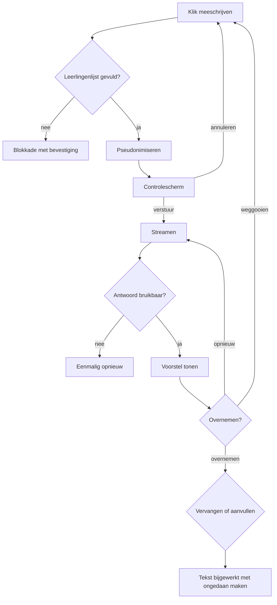

### 7.9 F-09 — Een voorstel afwijzen en opnieuw vragen

**Wie** Ilse · **Aanleiding** "Dit is te bloemrijk." · **Startpunt** een getoond voorstel · **Resultaat** een tweede voorstel dat dichter bij haar stijl ligt · **Frequentie** bij een op de vijf voorstellen · **Doeltijd** 20 seconden

| # | Wat de gebruiker doet | Wat de app doet | Wat de gebruiker ziet |
|---|---|---|---|
| 1 | Klikt "Opnieuw" | Toont drie redenen plus een vrij veld | "Te lang", "Te bloemrijk", "Klopt niet met wat er gebeurde", "Anders…" |
| 2 | Kiest "Te bloemrijk" | Voegt een tijdelijke instructie toe aan de opdracht | Controlescherm toont de extra regel gemarkeerd |
| 3 | Verstuurt | Nieuwe aanroep | Nieuw voorstel |
| 4 | Neemt over | `FeedbackService` legt vast: eerste afgewezen met reden, tweede overgenomen | — |

**Beslispunten.** De reden is optioneel maar wordt sterk aangeraden, want dit is het signaal waaruit correctieregels groeien (§3.6).

**Foutpaden.** **F-09.E1** — driemaal achtereen afgewezen: de app stelt voor het stijlprofiel te bekijken, met een verwijzing naar Instellingen → Schrijfstijl.

**Meetpunt.** Hoe vaak "Te bloemrijk" wordt gekozen. Drie keer dezelfde reden binnen een week levert een voorstel voor een correctieregel op (B-22).

### 7.10 F-10 — Vierde deel van een reeks met de vervolgzin

**Wie** Ilse · **Aanleiding** "Waar waren we ook alweer gebleven met dat kunstwerk?" · **Startpunt** reeksweergave Kunstwerk Dok · **Resultaat** deel 4 met een openingszin die aansluit op deel 3 · **Frequentie** wekelijks · **Doeltijd** 4 minuten totaal

| # | Wat de gebruiker doet | Wat de app doet | Wat de gebruiker ziet |
|---|---|---|---|
| 1 | Klikt "Volgend deel maken" | Nieuwe documentatie met reeks, groep en datum ingevuld | Schrijfscherm, "Deel 4 van Kunstwerk Dok" boven de titel |
| 2 | Klikt "Stel een openingszin voor" | Haalt de drie meest recente delen op, kapt af op 1.500 tekens, pseudonimiseert | — |
| 3 | — | Controlescherm met de waarschuwing over extra tekst | "Voor deze functie gaan ook je eerdere documentaties mee." Drie uitklapbare blokken met titel en datum, elk met een schakelaar |
| 4 | Zet deel 1 uit, verstuurt | Twee delen mee | Voorstel van twee zinnen boven het tekstvlak |
| 5 | Klikt "Neem over" | Zinnen in het tekstvlak | Cursor achter de laatste zin |
| 6 | Typt verder, voegt foto's toe | Autosave | — |

**Beslispunten.** Per eerder deel kan zij besluiten het weg te laten (FR-DOC-93). Dat is het antwoord op het gevolg dat B-04 zelf benoemt: er gaat meer tekst over kinderen weg dan bij gewoon meeschrijven, dus de gebruiker moet het kunnen inperken.

**Foutpaden.** **F-10.E1** — geen eerdere delen met tekst: de knop verschijnt niet. **F-10.E2** — eerdere delen samen boven 4.500 tekens: alleen de twee meest recente gaan mee, met een melding.

**Meetpunt.** Het aandeel vervolgzinnen dat wordt overgenomen. Dit is de functie waarop het product zich onderscheidt (D2 uit de review); blijft de acceptatie onder 40 procent, dan is de aanpak fout en niet de uitvoering.

### 7.11 F-11 — Foto's toevoegen, herordenen en bijsnijden

**Wie** Fatima, telefoon, BSO · **Aanleiding** "Ik heb net zes foto's gemaakt." · **Startpunt** schrijfscherm, fotoblok · **Resultaat** zes verkleinde foto's in de juiste volgorde · **Frequentie** bij elke documentatie · **Doeltijd** 45 seconden voor zes foto's

| # | Wat de gebruiker doet | Wat de app doet | Wat de gebruiker ziet |
|---|---|---|---|
| 1 | Tikt op "Foto's" | Opent de bestandskiezer met meervoudige selectie | Systeemkiezer |
| 2 | Kiest zes foto's | Per foto: EXIF lezen, locatie verwijderen, opnamedatum bewaren, verkleinen naar 3300 px, drie varianten maken, hash berekenen | Zes plekken met een voortgangsring |
| 3 | Typt ondertussen door | Verwerking in een aparte draad | Tekstvlak blijft bruikbaar |
| 4 | Sleept foto 4 naar plek 2 | Volgorde bijwerken | Miniaturen schuiven mee |
| 5 | Tikt op een foto, kiest "Bijsnijden" | Toont het slotkader over de foto | Verschuifbaar kader met de verhouding van het gekozen slot |
| 6 | Verschuift, bevestigt | Bijsnijdvenster opslaan bij het `PhotoBlock` (B-65) | Miniatuur toont de nieuwe uitsnede |

**Foutpaden.** **F-11.E1** — bestand geen afbeelding: overgeslagen met de bestandsnaam in de melding. **F-11.E2** — verkleinen mislukt: die foto wordt niet toegevoegd, de rest wel. **F-11.E3** — opslag boven 95 procent: geweigerd met "Er is geen ruimte meer voor foto's. Tekst opslaan werkt nog wel." **F-11.E4** — foto kleiner dan het slot vraagt: toegevoegd, met een dpi-opmerking in het exportpaneel.

**Toetsenbordroute.** `Alt+↑` en `Alt+↓` verplaatsen de geselecteerde foto; dat is de verplichte tegenhanger van slepen (B-38).

**Telefoonverschil.** Naast de bestandskiezer staat "Maak een foto", die de camera opent.

### 7.12 F-12 — Pagina's beheren

**Wie** Bram, laptop · **Aanleiding** "Dit past niet op één blad." · **Startpunt** schrijfscherm met acht foto's en 600 woorden · **Resultaat** drie pagina's met de juiste layouts · **Frequentie** bij een op de vier documentaties · **Doeltijd** 60 seconden

| # | Wat de gebruiker doet | Wat de app doet | Wat de gebruiker ziet |
|---|---|---|---|
| 1 | Opent de paginanavigator | `LayoutService` verdeelt inhoud over sloten | Strook met pagina 1, 2 en 3 als miniaturen |
| 2 | Ziet dat pagina 3 bijna leeg is | — | Pagina 3 met twee regels tekst |
| 3 | Kiest bij pagina 1 layout B | Herverdeling, minder foto's per pagina | Nu vier pagina's |
| 4 | Kiest layout A terug | Herverdeling | Drie pagina's |
| 5 | Sleept pagina 2 naar plek 3 | Volgorde bijwerken, vervolgpagina's herbenoemen | Titels herhaald op 2 en 3 |
| 6 | Klikt "Pagina toevoegen" | Lege pagina in `E-vervolg` achteraan | Vierde miniatuur |

**Beslispunten.** Een handmatig toegevoegde pagina wordt niet automatisch weer verwijderd als hij leeg blijft; een automatisch aangemaakte vervolgpagina wel.

**Foutpaden.** **F-12.E1** — foto verwijderd waardoor een pagina leeg raakt: de pagina wordt verwijderd als hij automatisch was aangemaakt, anders blijft hij met een lege toestand. **F-12.E2** — layout D gekozen bij een documentatie met tekst: het exportpaneel meldt dat de tekst een tweede pagina krijgt (B-28).

### 7.13 F-13 — Exporteren naar Print-PDF

**Wie** Bram · **Aanleiding** "Deze wil ik ophangen in de klas." · **Startpunt** schrijfscherm · **Resultaat** een PDF in de map Downloads · **Frequentie** wekelijks · **Doeltijd** 15 seconden

| # | Wat de gebruiker doet | Wat de app doet | Wat de gebruiker ziet |
|---|---|---|---|
| 1 | Klikt "Print-PDF" | Exportpaneel schuift over het scherm (B-06) | Vier miniaturen, voorbeeld, opties, twee knoppen |
| 2 | Kiest layout A | Voorbeeld herberekenen | "2 pagina's" onder het voorbeeld |
| 3 | Klikt "Maak PDF" | `RenderService` tekent met `pdf-lib` op het millimetercanvas | Voortgang per pagina |
| 4 | — | Bestand aanbieden; status naar gedeeld (B-13) | Downloadmelding van de browser |

**Foutpaden.** **F-13.E1** — een foto's `print`-variant ontbreekt: de `screen`-variant wordt gebruikt met een dpi-opmerking. **F-13.E2** — generatie mislukt: de status blijft concept, de melding noemt de pagina waarop het misging.

**Meetpunt.** Tijd van klik tot bestand. Eis: vier pagina's binnen 4 seconden (NFR).

### 7.14 F-14 — Deelbare afbeelding maken en delen

**Wie** Ilse, telefoon · **Aanleiding** "Dit wil ik vanavond naar de ouders sturen." · **Startpunt** schrijfscherm · **Resultaat** de afbeelding in het deelmenu van de telefoon · **Frequentie** twee keer per week · **Doeltijd** 20 seconden

| # | Wat de gebruiker doet | Wat de app doet | Wat de gebruiker ziet |
|---|---|---|---|
| 1 | Tikt "Deelbare afbeelding" | Exportpaneel als volledig scherm | Miniaturen en voorbeeld |
| 2 | Zet "Vervang namen door initialen" aan | Namen vervangen, botsingen oplopend genummerd | Voorbeeld toont "K." en "K2.", legenda onderaan (B-40) |
| 3 | Tikt "Maak afbeelding" | Toestemmingsvraag beeldgebruik (B-08) | "Op deze foto's staan kinderen. Heb je toestemming?" |
| 4 | Bevestigt | PDF genereren, met `pdf.js` rasteren naar JPEG 2480 × 1754 (B-27) | Voortgang |
| 5 | — | `navigator.share()` met het bestand | Deelmenu van de telefoon |
| 6 | Kiest de app van de oudercommunicatie | — | Bericht met de afbeelding erin |

**Foutpaden.** **F-14.E1** — delen niet ondersteund: het bestand wordt gedownload met de melding "Je browser kan niet rechtstreeks delen. De afbeelding staat in je downloads." **F-14.E2** — meer pagina's: elke pagina wordt een apart bestand, alle bestanden gaan mee in één deelactie waar dat kan.

**Telefoonverschil.** Dit is de flow waarvoor stap 5 bestaat; op de laptop is er in plaats daarvan "Kopieer afbeelding" (B-09).

### 7.15 F-15 — Een documentatie terugvinden over drie maanden

**Wie** Joost, intern begeleider · **Aanleiding** "Wat is er in oktober over Kjeld vastgelegd?" · **Startpunt** overzicht · **Resultaat** drie documentaties op het scherm · **Frequentie** wekelijks · **Doeltijd** 20 seconden

| # | Wat de gebruiker doet | Wat de app doet | Wat de gebruiker ziet |
|---|---|---|---|
| 1 | Typt "kjeld" in het zoekveld | Index in het geheugen doorzoeken op titel, tekst, citaten, reeksnaam en namen (B-32) | 11 treffers, met het trefwoord gemarkeerd |
| 2 | Zet het filter Periode op oktober | Filters combineren met de zoekterm | 3 treffers |
| 3 | Zet het filter Reeks op Kunstwerk Dok | — | 1 treffer |
| 4 | Wist het reeksfilter | — | 3 treffers |
| 5 | Opent de tweede | — | Schrijfscherm in leesstand |

**Foutpaden.** **F-15.E1** — typefout "kjelt": trigram-terugval levert Kjeld als voorstel: "Bedoelde je kjeld?" (T-16). **F-15.E2** — geen treffers: lege toestand met de actieve filters als verwijderbare chips.

**Meetpunt.** Zoeken binnen 150 ms bij 1.000 documentaties (NFR).

### 7.16 F-16 — Het schooljaar klaarzetten in augustus

**Wie** Bram, laptop, tweede week van augustus · **Aanleiding** "Wanneer is de herfstvakantie en wanneer zijn de studiedagen?" · **Startpunt** agenda · **Resultaat** een schooljaar met de juiste vakanties en zes studiedagen · **Frequentie** één keer per jaar · **Doeltijd** 10 minuten

| # | Wat de gebruiker doet | Wat de app doet | Wat de gebruiker ziet |
|---|---|---|---|
| 1 | Opent de agenda | Datum valt tussen 1 juli en 15 september, dus jaarweergave (B-31) | Twaalf maandkolommen, vakanties gekleurd |
| 2 | Ziet dat de herfstvakantie een week afwijkt | — | Legenda rechts met datums |
| 3 | Klikt op het potlood bij Herfstvakantie | `fixed: false`, dus bewerkbaar (B-29) | Twee datumvelden |
| 4 | Zet de datums goed | `HolidayOverride` opslaan | Jaarweergave werkt bij |
| 5 | Klikt op de kerstvakantie | `fixed: true` | Geen potlood, uitleg "Kerst- en zomervakantie liggen landelijk vast" |
| 6 | Klikt zes losse dagen aan, kiest "Studiedag" | Zes items aanmaken | Zes gemarkeerde dagen |
| 7 | Leest de telling onderaan | — | "191 schooldagen · 6 studiedagen · 2 margedagen" |

**Foutpaden.** **F-16.E1** — geen vakantiegegevens voor dit schooljaar: lege legenda met de melding uit FR-AGE-12. **F-16.E2** — vakantiebestand loopt binnen 120 dagen af: eenmalige melding.

**Telefoonverschil.** Geen jaarweergave; in plaats daarvan de lijst "Vakanties" (FR-AGE-08). Het aanpassen van adviesdata kan daar wel.

### 7.17 F-17 — Een oudergesprek inplannen en er een mail bij opstellen

**Wie** Ilse · **Aanleiding** "Ik moet de ouders van Kjeld uitnodigen." · **Startpunt** agenda · **Resultaat** een agenda-item en een concept in Outlook · **Frequentie** tien keer per jaar · **Doeltijd** 3 minuten

| # | Wat de gebruiker doet | Wat de app doet | Wat de gebruiker ziet |
|---|---|---|---|
| 1 | Typt in het snelveld "dinsdag 15u oudergesprek Kjeld" | Lokale ontleding, geen AI (B-58) | Concept-item onder het veld |
| 2 | Bevestigt met Enter | Item aanmaken met soort `oudergesprek` en leerling Kjeld | Item in de week |
| 3 | Klikt "Stel mail op" | Mailmodule opent met een nieuw concept | Ontvangertype `ouder`, onderwerp "Gesprek over Kjeld — dinsdag 13 oktober" |
| 4 | Kiest sjabloon "Uitnodiging oudergesprek" | Instructies plus skelet | Tekstvlak met de opzet |
| 5 | Klikt "Laat AI schrijven" | Pseudonimiseren, controlescherm, aanroep | Voorstel |
| 6 | Neemt over, past twee zinnen aan | Autosave | — |
| 7 | Klikt "Als concept in je mailprogramma" | Server schrijft het concept, veld Aan blijft leeg (B-59) | "Het concept staat in je Concepten-map." |

**Foutpaden.** **F-17.E1** — geen postbus gekoppeld: alleen "Kopieer" is beschikbaar, met een verwijzing naar F-19. **F-17.E2** — token verlopen: stille vernieuwing, anders opnieuw koppelen zonder verlies van het concept.

### 7.18 F-18 — Vanuit een agenda-item een documentatie starten

**Wie** Fatima · **Aanleiding** "Het bosbezoek van vanmiddag ga ik documenteren." · **Startpunt** agenda, item "Bosbezoek" met groep · **Resultaat** een documentatie met datum, groep en leerlingen ingevuld · **Frequentie** twee keer per week · **Doeltijd** 5 seconden tot het schrijfscherm

| # | Wat de gebruiker doet | Wat de app doet | Wat de gebruiker ziet |
|---|---|---|---|
| 1 | Opent het item | — | Itemdetails met knoppen |
| 2 | Tikt "Maak documentatie" | Nieuwe documentatie met datum, groep, leerlingen en titelvoorstel (FR-AGE-17) | Schrijfscherm, drie velden gevuld |
| 3 | Kiest gespreksmodus | — | Fotokiezer |

**Foutpaden.** **F-18.E1** — item zonder groep: de documentatie krijgt alleen de datum en de titel. **F-18.E2** — al een gekoppelde documentatie: de knop heet "Open documentatie" in plaats van "Maak documentatie".

### 7.19 F-19 — Postbus koppelen

**Wie** Maarten, ICT-coördinator, samen met Ilse · **Aanleiding** "Ik wil mijn mail hierin zien." · **Startpunt** Instellingen → Mail · **Resultaat** een gekoppelde postbus zonder verzendrecht · **Frequentie** één keer · **Doeltijd** 2 minuten

| # | Wat de gebruiker doet | Wat de app doet | Wat de gebruiker ziet |
|---|---|---|---|
| 1 | Klikt "Koppel postbus" | — | Keuze Microsoft 365 of Google Workspace |
| 2 | Kiest Microsoft | Toont de rechten in gewone taal (FR-MAI-03) | Vier regels, plus "EduFlow krijgt geen recht om mail te versturen" |
| 3 | Klikt "Doorgaan" | Autorisatie met PKCE starten (T-15) | Inlogpagina van Microsoft |
| 4 | Logt in en geeft toestemming | Server wisselt de code in, versleutelt de tokens in een `httpOnly`-cookie | Terug in EduFlow |
| 5 | — | Naam en adres ophalen | "Gekoppeld als i.bakker@school.nl" |
| 6 | Opent het postvak | Koppen ophalen | Lijst met de laatste dertig dagen |

**Foutpaden.** **F-19.E1** — organisatie vereist beheerdersgoedkeuring: melding met toepassingsnaam, toepassings-id, de vier rechten en het antwoordadres, met een kopieerknop (FR-MAI-04). **F-19.E2** — gebruiker weigert: terug in Instellingen zonder gevolgen. **F-19.E3** — antwoordadres komt niet overeen: technische fout vertaald naar "De koppeling is niet goed ingesteld. Neem contact op met je ICT-beheerder." met het foutnummer.

**Meetpunt.** Of de gebruiker vóór stap 3 de zin over het ontbrekende verzendrecht heeft kunnen lezen. Dit is de zin waar de functionaris gegevensbescherming op zal doorvragen (hoofdstuk 15).

### 7.20 F-20 — Een oudermail lezen, samenvatten en beantwoorden

**Wie** Ilse, laptop, maandagochtend · **Aanleiding** "Er ligt een lange mail van de moeder van Noa." · **Startpunt** postvak · **Resultaat** een concept in Outlook · **Frequentie** drie keer per week · **Doeltijd** 5 minuten in plaats van 20

| # | Wat de gebruiker doet | Wat de app doet | Wat de gebruiker ziet |
|---|---|---|---|
| 1 | Opent het bericht | Ophalen en cachen (FR-MAI-09); bijlagen alleen als naam | Volledige tekst, bijlagenamen |
| 2 | Klikt "Vat samen" | `PrivacyService` over tekst, aanhef, ondertekening en handtekening | — |
| 3 | — | Controlescherm opent verplicht (FR-MAI-12) | Vervangen tekst met codes gemarkeerd, "9 gegevens afgeschermd" |
| 4 | Ziet dat een schoolnaam blijft staan | — | — |
| 5 | Selecteert die, klikt "Scherm af" | Vervangen door `[AFGESCHERMD-1]` | Teller wordt 10 |
| 6 | Klikt "Verstuur" | Aanroep | Vijf punten: onderwerp, vraag, termijn, toon, wat een antwoord moet bevatten |
| 7 | Klikt "Stel antwoord op" | Nieuw concept, ontvangertype `ouder`, sjabloon "Antwoord op een zorgvraag" | Tekstvlak |
| 8 | Kiest toon "warm", laat AI schrijven | Pseudonimiseren, controlescherm, aanroep | Voorstel |
| 9 | Neemt over, past aan | Autosave | — |
| 10 | Klikt "Als concept in je mailprogramma" | Concept wegschrijven zonder ontvanger | "Het concept staat in je Concepten-map." |
| 11 | Opent Outlook, vult de ontvanger in, verstuurt | — | Verzonden door haar, niet door EduFlow |

**Beslispunten.** Stap 5 is de kern van de bescherming: de app biedt afscherming aan, de gebruiker vult aan wat de detectoren missen. Stap 11 gebeurt buiten EduFlow, en dat is de bedoeling (U-01, B-19).

**Foutpaden.** **F-20.E1** — bericht te lang: "Dit bericht is te lang om samen te vatten. Selecteer het deel dat je wilt samenvatten." **F-20.E2** — mail in het Engels: samenvatting in het Nederlands, tenzij anders ingesteld. **F-20.E3** — draad van twaalf berichten: alleen het bovenste wordt verwerkt, met "Neem ook de eerdere berichten mee". **F-20.E4** — overdracht mislukt: automatisch terugvallen op "Kopieer" met uitleg.

**Meetpunt.** Het aantal gegevens dat de gebruiker zelf handmatig afschermt na de automatische ronde. Loopt dat op, dan missen de detectoren iets structureels (§6.3.10).

### 7.21 F-21 — Een groepsbericht met een documentatie erin

**Wie** Ilse · **Aanleiding** "De ouders moeten zien wat we gemaakt hebben." · **Startpunt** mailmodule · **Resultaat** een concept met de afbeelding erin geplakt · **Frequentie** maandelijks · **Doeltijd** 4 minuten

| # | Wat de gebruiker doet | Wat de app doet | Wat de gebruiker ziet |
|---|---|---|---|
| 1 | Klikt "Nieuw bericht" | Leeg concept | Onderwerp verplicht (B-36) |
| 2 | Kiest sjabloon "Deel een documentatie" | Instructies plus skelet | — |
| 3 | Klikt "Voeg documentatie toe", kiest er een | Toestemmingsvraag als die nog niet bevestigd is (FR-MAI-19) | Bevestiging |
| 4 | Bevestigt | `RenderService` maakt de afbeelding, zet hem op het klembord (FR-MAI-18) | "Plak in je mail met Ctrl+V" |
| 5 | Laat AI de tekst schrijven, neemt over | — | — |
| 6 | Klikt "Als concept in je mailprogramma" | Concept met de tekst, zonder afbeelding | "Plak de afbeelding in Outlook" |
| 7 | Plakt in Outlook, vult ontvangers in, verstuurt | — | — |

**Foutpaden.** **F-21.E1** — documentatie nog in status concept: toegestaan, met de opmerking "Deze documentatie heb je nog niet geëxporteerd." **F-21.E2** — klembord geweigerd door de browser: terugval op downloaden met uitleg.

### 7.22 F-22 — Een leerling die er in november bij komt, in twee groepen

**Wie** Ilse · **Aanleiding** "Er komt een nieuwe leerling, en hij doet ook mee met de techniekclub." · **Startpunt** Instellingen → Leerlingen · **Resultaat** één leerling met twee lopende lidmaatschappen · **Frequentie** vijf keer per jaar · **Doeltijd** 90 seconden

| # | Wat de gebruiker doet | Wat de app doet | Wat de gebruiker ziet |
|---|---|---|---|
| 1 | Klikt "Leerling toevoegen" | Formulier | Roepnaam, achternaam-initiaal, geboortedatum, notitie |
| 2 | Typt "Noa" | Controle op dubbele voornamen | "Er is al een Noa. Zet er een achternaam-initiaal bij." (FR-INS-02) |
| 3 | Vult "V." in | — | Leerling wordt Noa V. |
| 4 | Klikt "Voeg toe aan groep" | Lidmaatschapsformulier | Groep, ingangsdatum |
| 5 | Kiest Groep 4, datum 3 november | `GroupMembership` aanmaken | Regel in "Zit in" |
| 6 | Klikt nogmaals "Voeg toe aan groep" | — | — |
| 7 | Kiest Techniekclub, datum 3 november | Tweede lidmaatschap | Twee lopende regels, geen hoofdgroep (B-63) |
| 8 | Opent de leerlingtijdlijn | Afgeleide weergave | Twee balken naast elkaar |

**Beslispunten.** Bij stap 2 mag zij de initiaal weigeren; dan krijgen beide Noa's bij afscherming een eigen code en meldt het controlescherm dat expliciet.

**Foutpaden.** **F-22.E1** — overlappend lidmaatschap in dezelfde groep: geblokkeerd met het voorstel het bestaande te verlengen (FR-INS-08, INV-25). **F-22.E2** — ingangsdatum vóór het begin van het schooljaar: toegestaan met een opmerking.

**Meetpunt.** Of oude documentaties van vóór 3 november ongewijzigd blijven. Lidmaatschap met een looptijd is er precies om dat te garanderen.

### 7.23 F-23 — Back-up maken en terugzetten

**Wie** Ilse, laptop, vrijdagmiddag · **Aanleiding** "Het dashboard zegt dat mijn laatste back-up van 3 juli is." · **Startpunt** dashboard, blok Back-up · **Resultaat** een versleuteld bestand op een externe schijf · **Frequentie** maandelijks · **Doeltijd** 2 minuten voor 200 documentaties

| # | Wat de gebruiker doet | Wat de app doet | Wat de gebruiker ziet |
|---|---|---|---|
| 1 | Klikt "Back-up maken" | Telt per soort | "212 documentaties · 1.240 foto's · 3,8 GB" |
| 2 | Voert een wachtwoord in | Waarschuwing dat er geen herstel is | "Zonder dit wachtwoord is het bestand onbruikbaar." |
| 3 | Bevestigt | Bundelen, versleutelen, in stappen wegschrijven | Voortgang per tabel |
| 4 | Slaat het bestand op | Datum van de laatste back-up bijwerken | Blok Back-up wordt groen |

Terugzetten op een tweede apparaat:

| # | Wat de gebruiker doet | Wat de app doet | Wat de gebruiker ziet |
|---|---|---|---|
| 5 | Kiest "Terugzetten", wijst het bestand aan | Manifest lezen, wachtwoord vragen | Inhoud: aantallen, datum, apparaatnaam |
| 6 | Kiest "Samenvoegen" | Per record de hoogste `updatedAt` (FR-INS-31) | Voortgang |
| 7 | — | Botsingen als kopie bewaren | "3 documentaties bestonden in beide. De nieuwste staat er; de andere versie staat erbij met de aantekening uit back-up van 3 juli." |

**Foutpaden.** **F-23.E1** — wachtwoord verkeerd: "Dit wachtwoord past niet bij dit bestand." zonder pogingenteller. **F-23.E2** — bestand beschadigd: het controlegetal in het manifest klopt niet, terugzetten wordt geweigerd vóór er iets is gewijzigd. **F-23.E3** — te weinig ruimte op het doelapparaat: vooraf gemeld met het benodigde aantal gigabytes. **F-23.E4** — nieuwere schemaversie in het bestand dan de app kent: geweigerd met "Dit bestand komt uit een nieuwere versie van EduFlow. Werk de app bij."

**Meetpunt.** Of terugzetten op een leeg apparaat een werkende installatie oplevert met alle foto's zichtbaar. Dit is de enige garantie tegen verlies op een apparaat (B-01, B-02) en hoort in elke release getest te worden.

### 7.24 F-24 — Opslag bijna vol

**Wie** Bram, na anderhalf jaar gebruik · **Aanleiding** "Er staat een waarschuwing." · **Startpunt** willekeurig scherm · **Resultaat** ruimte vrij, niets kwijt · **Frequentie** één keer per anderhalf jaar · **Doeltijd** 10 minuten

| # | Wat de gebruiker doet | Wat de app doet | Wat de gebruiker ziet |
|---|---|---|---|
| 1 | Slaat iets op boven de 80 procent | Meting bij elke schrijfactie (T-09) | "Je opslag raakt vol. Maak een back-up en ruim op." |
| 2 | Klikt door naar Opslag | Verdeling berekenen | Balk plus uitsplitsing: foto's 3,4 GB, documentaties 40 MB, mailcache 12 MB |
| 3 | Maakt eerst een back-up | Zie F-23 | — |
| 4 | Kiest "Alleen de afdrukvariant weggooien" bij het schooljaar 2024-2025 | `print`-varianten verwijderen, `screen` en `thumb` behouden (B-64) | "Dit maakt 2,3 GB vrij. De documentaties blijven leesbaar; opnieuw afdrukken op 300 dpi kan daarna niet meer." |
| 5 | Bevestigt | Verwijderen in stappen | Balk zakt naar 41 procent |

**Foutpaden.** **F-24.E1** — boven 95 procent: nieuwe foto's worden geweigerd, tekst opslaan blijft werken (FR-INS-35). **F-24.E2** — `QuotaExceededError` tijdens autosave: de tekst blijft in het geheugen, de app probeert elke tien seconden opnieuw en het scherm blijft bewerkbaar (C5 uit de review).

**Meetpunt.** Of er in dit hele pad ooit werk verloren gaat. Het antwoord moet nee zijn, ook bij een volle schijf.

### 7.25 Flow-overzicht

| Flow | Modules | Doeltijd | Stappen | Frequentie |
|---|---|---|---|---|
| F-01 Eerste start laptop | INS, DOC | 12 min | 18 | eenmalig |
| F-02 Eerste start telefoon | INS | 90 s | 6 | eenmalig |
| F-03 Tweede apparaat | INS | 4 min | 8 | zelden |
| F-04 Documentatie schrijven | DOC, AI | 8 min | 22 | dagelijks |
| F-05 Gespreksmodus telefoon | DOC, AI | 6 min | 14 | dagelijks |
| F-06 Gespreksmodus laptop | DOC, AI | 7 min | 14 | wekelijks |
| F-07 Wisselen van modus | DOC | 5 s | 3 | wekelijks |
| F-08 AI meeschrijven | DOC, AI | 25 s | 8 | dagelijks |
| F-09 Afwijzen en opnieuw | DOC, AI | 20 s | 4 | dagelijks |
| F-10 Vervolgzin uit de reeks | DOC, AI | 4 min | 6 | wekelijks |
| F-11 Foto's beheren | DOC | 45 s | 6 | dagelijks |
| F-12 Pagina's beheren | DOC | 60 s | 6 | wekelijks |
| F-13 Print-PDF | DOC | 15 s | 4 | wekelijks |
| F-14 Deelbare afbeelding | DOC | 20 s | 6 | 2× per week |
| F-15 Terugvinden | DOC | 20 s | 5 | wekelijks |
| F-16 Schooljaar klaarzetten | AGE | 10 min | 7 | jaarlijks |
| F-17 Oudergesprek plus mail | AGE, MAI, AI | 3 min | 7 | 10× per jaar |
| F-18 Documentatie uit agenda | AGE, DOC | 5 s | 3 | 2× per week |
| F-19 Postbus koppelen | MAI | 2 min | 6 | eenmalig |
| F-20 Oudermail beantwoorden | MAI, AI | 5 min | 11 | 3× per week |
| F-21 Groepsbericht | MAI, DOC, AI | 4 min | 7 | maandelijks |
| F-22 Leerling in twee groepen | INS | 90 s | 8 | 5× per jaar |
| F-23 Back-up en terugzetten | INS | 2 min | 7 | maandelijks |
| F-24 Opslag opruimen | INS | 10 min | 5 | zelden |

### 7.26 De drie flows waar elke seconde telt

**F-04, F-08 en F-11.** Samen zijn ze de dagelijkse praktijk: schrijven, laten meeschrijven, foto's toevoegen. Wie ze twaalf keer per week loopt, merkt elke halve seconde. Voor deze drie geldt daarom een strengere norm dan voor de rest:

- Geen enkele stap wacht op het netwerk, behalve de AI-aanroep zelf.
- Autosave is nooit zichtbaar als wachten (§4.5).
- Het controlescherm opent binnen 100 ms; de pseudonimisatie draait op de tekst die er al is en hoeft niets op te halen.
- Foto's verwerken blokkeert het typen niet.
- De eerste tekens van een AI-antwoord staan er binnen 2 seconden (streaming), anders is de wachtervaring stuk.

De nulmeting uit §1.6 meet precies deze drie flows. De 40 procent tijdwinst die het product belooft, moet daar vandaan komen; niet uit F-16 of F-23, hoe nuttig die ook zijn.

### 7.27 Flows die bewust niet bestaan

| Wat | Waarom niet | Wat er in plaats daarvan is |
|---|---|---|
| Versturen vanuit EduFlow | U-01 en B-19; de app vraagt technisch geen verzendrecht aan (B-20) | Concept in je eigen mailprogramma, of kopiëren |
| Een documentatie delen met een collega | Vereist een server, accounts en een verwerkersafspraak; die komen pas in fase 2 na akkoord van de functionaris | PDF of afbeelding, of een back-upbestand |
| Samenwerken aan één documentatie | Vraagt om conflictafhandeling en aanwezigheidsweergave; dat is een ander product | Een collega maakt een eigen documentatie in dezelfde reeks |
| Een kind beoordelen | B-25; dit is de grens die EduFlow buiten de hoog-risicocategorie van de AI-verordening houdt (hoofdstuk 15) | Beschrijven wat er gebeurde en wat er gezegd is |
| Aanwezigheid registreren | Hoort in het leerlingvolgsysteem; dubbele registratie is dubbele waarheid (U-02) | Niets |
| Automatisch documentaties genereren uit foto's | Foto's gaan nooit naar de AI (B-03); en een documentatie zonder de blik van de leerkracht is geen documentatie | Gespreksmodus, waarin de foto's de vragen stellen |
| Een AI die zelf een reeks voorstelt | Zou betekenen dat de app inhoudelijke lijnen trekt over kinderen | De gebruiker maakt reeksen; de app gebruikt ze |

---

## 8. Datamodel

Dit hoofdstuk beschrijft waar gegevens fysiek staan: welke tabellen er zijn, welke velden erin
zitten, welke indexen erop liggen, hoe het schema van versie naar versie meegaat en hoe een
back-upbestand eruitziet. Het gaat over opslag, niet over betekenis. Wat een documentatie
*is*, welke regels erop gelden en welke invarianten altijd waar moeten zijn, staat in
hoofdstuk 9. Waar dit hoofdstuk een veld noemt dat een regel draagt, verwijst het daarheen
en herhaalt het die regel niet.

### 8.1 Uitgangspunten van het datamodel

#### 8.1.1 Lokaal-eerst en server-klaar

Versie 1.0 slaat alles op het apparaat op. Er is geen server die gegevens bewaart, geen
account, geen gedeelde database. Een documentatie leeft op één apparaat en verhuist via een
exportbestand (B-01). Tegelijk is het datamodel vanaf de eerste regel code zo gebouwd dat er
later een server bij kan zonder dat de opslag op de schop gaat. Dat is de kern van B-24:
lokaal-eerst in gedrag, server-klaar in vorm.

Die twee eisen botsen minder dan je zou denken, maar ze botsen wel op één punt: een lokale
database mag alles simpel houden, en een gesynchroniseerde database mag dat niet. Een
automatisch oplopend getal als sleutel is lokaal prima en over twee apparaten een garantie op
botsingen. Een record hard verwijderen is lokaal prima en over twee apparaten een garantie
dat het verwijderde record terugkomt zodra het andere apparaat zijn versie stuurt. Het
verschil tussen een lokaal model en een synchronisatiebestendig model zit niet in de
tabellen, maar in zes velden en één regel. Die zes velden en die ene regel bouw je nu, niet
later.

De prijs is klein en zichtbaar: elk record is ongeveer 130 bytes groter en elke schrijfactie
raakt één extra tabel. De winst is dat fase 2 een uitbreiding is en geen verbouwing
(zie §8.10).

#### 8.1.2 Wat synchronisatiebestendig concreet betekent

Synchronisatiebestendig betekent dat twee kopieën van dezelfde database, die een tijd lang
onafhankelijk van elkaar zijn bewerkt, samengevoegd kunnen worden tot één database zonder dat
er gegevens verdwijnen en zonder dat een mens per record moet beslissen wat er gebeurt. Dat
vraagt vier eigenschappen van elk record. Ze staan hieronder met de vraag die ze beantwoorden
en de velden die ze dragen.

| # | Eigenschap | De vraag die hij beantwoordt | Velden |
|---|---|---|---|
| 1 | **Wereldwijd unieke identiteit** | Is dit record hetzelfde record als dat record? | `id` |
| 2 | **Herkomst** | Welk apparaat heeft dit record gemaakt of als laatste aangeraakt? | `origin` |
| 3 | **Volgorde van wijzigingen** | Welke van twee versies is de nieuwere? | `rev`, `updatedAt`, `createdAt` |
| 4 | **Verwijderen als feit** | Is dit record verwijderd, of heeft het andere apparaat het gewoon nog niet? | `deletedAt` |

Daar komt een vijfde veld bij dat niet over synchronisatie gaat maar over tijd: `schemaVersion`
vertelt volgens welke vorm het record is opgeschreven. Een record dat in een back-up van een
jaar oud zit, moet leesbaar zijn zonder dat je weet uit welke app-versie het komt.

Wat synchronisatiebestendig **niet** betekent: het betekent niet dat er in versie 1.0 iets
synchroniseert. `SyncService` bestaat als interface met een lege implementatie (zie §5.2 van
de architectuur in hoofdstuk 6). Het betekent ook niet dat elke botsing automatisch goed
afloopt. Het betekent dat elke botsing *detecteerbaar* is en dat er per tabel een vastgelegde
regel is die hem oplost (zie §8.7 voor terugzetten en §8.10 voor synchronisatie).

#### 8.1.3 De sleutel is een UUIDv7

Elke primaire sleutel in EduFlow is een UUID versie 7, als kleine letters met streepjes,
36 tekens. Geen oplopende getallen, geen samengestelde natuurlijke sleutels, geen
`crypto.randomUUID()` (dat is versie 4). Drie redenen, in volgorde van gewicht:

1. **Geen coördinatie nodig.** Een apparaat dat offline is, moet een nieuw record kunnen maken
   met een sleutel waarvan het zeker weet dat geen ander apparaat hem ook kiest. Dat kan
   alleen als de sleutel breed genoeg willekeurig is. Een oplopend getal vereist dat er ergens
   één teller is, en die is er niet.
2. **Tijdgesorteerd.** De eerste 48 bits van een UUIDv7 zijn de Unix-tijd in milliseconden.
   Records die na elkaar gemaakt worden, krijgen sleutels die na elkaar sorteren. Dat scheelt
   in IndexedDB een aparte index op `createdAt` voor elke lijst die op aanmaakvolgorde staat,
   het houdt de B-boom van de primaire sleutel compact omdat er altijd rechts wordt
   ingevoegd, en het maakt een sleutel leesbaar: aan het begin van de sleutel zie je wanneer
   het record ontstond.
3. **Botsingsvrij in de praktijk.** Na de tijdstempel volgen 74 willekeurige bits. Twee
   apparaten die in dezelfde milliseconde een record maken, botsen met een kans van ongeveer
   1 op 10²². Bij 200 documentaties per jaar is dat geen risico dat je hoeft af te dekken.

De generator staat op één plek, in `StorageService`, en wordt nooit ergens anders aangeroepen.
Een sleutel die niet aan het patroon voldoet, komt de opslag niet in: Zod controleert het
versienibble en de variantbits, niet alleen de lengte.

```typescript
export const UUID_V7 = /^[0-9a-f]{8}-[0-9a-f]{4}-7[0-9a-f]{3}-[89ab][0-9a-f]{3}-[0-9a-f]{12}$/;

/** Wereldwijd unieke, tijdgesorteerde sleutel. Enige plek waar sleutels ontstaan. */
export function newId(): Uuid {
  const ms = BigInt(Date.now());
  const bytes = crypto.getRandomValues(new Uint8Array(16));
  bytes[0] = Number((ms >> 40n) & 0xffn);
  bytes[1] = Number((ms >> 32n) & 0xffn);
  bytes[2] = Number((ms >> 24n) & 0xffn);
  bytes[3] = Number((ms >> 16n) & 0xffn);
  bytes[4] = Number((ms >> 8n) & 0xffn);
  bytes[5] = Number(ms & 0xffn);
  bytes[6] = (bytes[6]! & 0x0f) | 0x70; // versie 7
  bytes[8] = (bytes[8]! & 0x3f) | 0x80; // variant 10
  const hex = [...bytes].map((b) => b.toString(16).padStart(2, '0')).join('');
  return `${hex.slice(0, 8)}-${hex.slice(8, 12)}-${hex.slice(12, 16)}-${hex.slice(16, 20)}-${hex.slice(20)}`;
}
```

#### 8.1.4 De overige velden van elk record

| Veld | Type | Betekenis | Wie zet hem |
|---|---|---|---|
| `createdAt` | `IsoDateTime` | Moment van ontstaan, in UTC. Verandert nooit meer. | `StorageService.create()` |
| `updatedAt` | `IsoDateTime` | Moment van de laatste inhoudelijke wijziging, in UTC. | `StorageService.update()` |
| `deletedAt` | `IsoDateTime \| null` | Moment van markeren als verwijderd. `null` betekent: bestaat. | `StorageService.softDelete()` |
| `rev` | `number` | Teller die bij elke schrijfactie met één omhoog gaat. Begint op 1. | `StorageService` |
| `origin` | `Uuid` | Apparaat-id van het apparaat dat deze versie schreef. | `StorageService` |
| `schemaVersion` | `number` | Schemaversie waarin dit record is opgeschreven. | `StorageService` |

Drie aandachtspunten die je bij het bouwen tegenkomt.

**Alle tijden zijn UTC.** Elke `IsoDateTime` eindigt op `Z`. Er staat nooit een lokale
tijdzone in de opslag. Omrekenen naar Europe/Amsterdam gebeurt in de weergavelaag, één keer,
met `Intl.DateTimeFormat`. Dat is de enige manier waarop een back-up die in de zomertijd is
gemaakt in de wintertijd nog dezelfde tijden toont. Kalenderdagen zonder tijd (een
vakantiedatum, een geboortedatum, de dag waarop iets gebeurde) zijn een apart type
`IsoDate` van tien tekens en worden nooit als tijdstip opgeslagen, want dan verschuift 1
januari op de helft van de apparaten naar 31 december.

Er is één uitzondering op "alles in UTC", en die heeft een eigen type: een **wandkloktijd**
zonder dag. Een weekonderdeel van de basisweek begint om half negen, en bij het invullen is
nog niet bekend op welke dag dat valt (§6.2.11). Zo'n tijd is `LocalTime`, vijf tekens in de
vorm `HH:MM`, wandkloktijd Europe/Amsterdam (T-46). Half negen blijft half negen aan beide
kanten van de zomertijdgrens; als `IsoDateTime` zou hij twee keer per jaar verschuiven.
Omrekenen naar UTC gebeurt op precies één plek, bij het berekenen van wat er op een dag
staat (§9.8), en dat is dus ook de enige plek die op zomertijd getoetst hoeft te worden.

**`rev` en `updatedAt` doen niet hetzelfde.** `updatedAt` is een klok en klokken lopen op
apparaten uit de pas; een telefoon met een verkeerd ingestelde tijd is geen zeldzaamheid.
`rev` is een teller en telt betrouwbaar door. Bij het samenvoegen van twee versies is `rev`
leidend en `updatedAt` de tiebreaker (zie §8.7.5 en §8.10.3).

**`origin` is het apparaat, niet de gebruiker.** EduFlow kent in versie 1.0 geen accounts
(B-21). Het apparaat-id is een UUIDv7 die bij de eerste start wordt gegenereerd en in de
`settings`-tabel staat. Hij is niet herleidbaar tot een persoon en gaat niet naar een
provider.

#### 8.1.5 Het basistype `BaseRecord`

Elke tabel behalve `changeLog` slaat records op die `BaseRecord` uitbreiden. Dat is geen
suggestie maar een typecontrole: `StorageService` accepteert alleen typen die van
`BaseRecord` erven, en de Zod-schema's worden zonder uitzondering met `zBaseRecord.extend()`
gebouwd.

```typescript
/** UUIDv7 als kleine letters met streepjes. */
export type Uuid = string;
/** ISO 8601 in UTC, met milliseconden: 2026-08-07T12:04:55.031Z */
export type IsoDateTime = string;
/** ISO 8601 kalenderdag zonder tijd en zonder zone: 2026-08-07 */
export type IsoDate = string;
/** Wandkloktijd zonder dag, Europe/Amsterdam: 08:30 (T-46) */
export type LocalTime = string;

export interface BaseRecord {
  id: Uuid;
  createdAt: IsoDateTime;
  updatedAt: IsoDateTime;
  deletedAt: IsoDateTime | null;
  rev: number;
  origin: Uuid;
  schemaVersion: number;
}
```

```typescript
import { z } from 'zod';

export const zUuid = z.string().regex(UUID_V7, 'Geen geldige UUIDv7');
export const zIsoDateTime = z.string().datetime({ offset: false });
export const zIsoDate = z.string().regex(/^\d{4}-\d{2}-\d{2}$/, 'Verwacht JJJJ-MM-DD');
export const zLocalTime = z.string().regex(/^([01]\d|2[0-3]):[0-5]\d$/, 'Verwacht UU:MM');

export const CURRENT_SCHEMA_VERSION = 1; // T-47

export const zBaseRecord = z.object({
  id: zUuid,
  createdAt: zIsoDateTime,
  updatedAt: zIsoDateTime,
  deletedAt: zIsoDateTime.nullable(),
  rev: z.number().int().min(1),
  origin: zUuid,
  schemaVersion: z.number().int().min(1).max(CURRENT_SCHEMA_VERSION),
});
```

In de schema's hieronder staat `...zBaseRecord.shape` niet telkens uitgeschreven. Elke
`z.object({ ... })` in §8.3 is in werkelijkheid `zBaseRecord.extend({ ... })`. De
zes basisvelden staan ook niet in elke veldtabel; ze gelden overal en betekenen overal
hetzelfde.

#### 8.1.6 Verwijderen is markeren

`StorageService.delete()` bestaat niet. Er is `softDelete()`, die `deletedAt` zet, `rev`
ophoogt en een regel in `changeLog` schrijft. Er is `purge()`, die een record echt uit
IndexedDB haalt, en die wordt alleen aangeroepen door de opruimtaak uit §8.8 en door
"definitief wissen" in Instellingen. Vier redenen:

1. **Anders komt het terug.** Zodra er twee apparaten zijn, is een record dat verdwenen is
   niet te onderscheiden van een record dat het andere apparaat nog nooit gezien heeft. Zonder
   markering herstelt de synchronisatie elk verwijderd record netjes weer. Dit is de reden
   die er in fase 2 toe doet en de reden waarom het nu al moet.
2. **Verwijzingen blijven geldig.** Een documentatie verwijst naar leerlingen. Verwijder je
   een leerling hard, dan wijst die verwijzing nergens meer heen en moet elke leesactie daarop
   voorbereid zijn. Met markeren blijft het record vindbaar en toont het scherm "Kjeld
   (verwijderd)" in plaats van een leeg vakje.
3. **De prullenbak is een gebruikersfunctie.** Dertig dagen terug kunnen halen wat je
   weggooide, is geen technisch detail maar een belofte (zie §8.8).
4. **Het logboek klopt.** Een `auditEvent` dat verwijst naar een record dat er niet meer is,
   is een logboek dat vragen oproept in plaats van beantwoordt.

Wat markeren betekent voor het lezen: **elke leesactie filtert op `deletedAt === null`,
zonder uitzondering.** Dat filter zit in `StorageService`, niet in de aanroepende code. Wie
verwijderde records wil zien, roept expliciet `listDeleted()` aan. Een scherm dat zelf
`db.students.toArray()` doet en dan filtert, is een fout (U-03).

Markeren is geen verwijderen in de zin van de AVG. Een verzoek om verwijdering leidt tot
`purge()`, inclusief de bijbehorende `changeLog`-regels en blobs. Dat pad staat in §8.8.4.

### 8.2 Opslaglagen

EduFlow gebruikt drie opslagplekken in de browser, met een strikte scheiding die niet
onderhandelbaar is.

| Laag | Wat erin staat | Persoonsgegevens | Omvang |
|---|---|---|---|
| IndexedDB (via Dexie) | Alle 26 tabellen uit §8.3, inclusief foto's als blob | Ja | Gigabytes |
| `localStorage` | Precies zes sleutels, allemaal apparaatvoorkeuren | Nee, nooit | Onder 4 KB |
| Cookie | Eén sessiecookie met de toegangscode | Nee | Onder 1 KB |

#### 8.2.1 IndexedDB via Dexie

Alles met persoonsgegevens staat in IndexedDB (T-01, T-12). IndexedDB is de enige
browseropslag die drie dingen tegelijk kan: blobs bewaren zonder ze eerst naar tekst om te
zetten, indexen aanleggen zodat een lijst van 1.000 documentaties niet volledig gelezen hoeft
te worden, en transacties over meerdere tabellen uitvoeren zodat een halve schrijfactie niet
blijft staan.

Dexie is de laag erboven. Hij levert een leesbare schemadeclaratie, een migratieroutine die
versies aan elkaar knoopt (§8.6), en een querytaal die je niet dwingt om met cursors te
werken. Dexie is een hulpmiddel, geen ORM: er is geen objectmapping, geen lazy loading, geen
relatiebeheer. Wat Dexie teruggeeft is een gewoon object, en dat object gaat door Zod voordat
het de servicelaag in gaat.

De regel bij lezen en schrijven (T-12): **elk record wordt bij het schrijven gevalideerd en
bij het lezen opnieuw gevalideerd.** Bij schrijven omdat een fout in de code anders stil in de
opslag terechtkomt en pas maanden later opvalt. Bij lezen omdat de database ouder kan zijn dan
de code, uit een back-up kan komen, of door een mislukte migratie is aangeraakt. De
leesvalidatie is niet gratis: bij 1.000 documentaties kost hij ongeveer 25 ms. Dat is
aanvaardbaar en het alternatief is het niet.

Faalt de validatie bij lezen, dan gooit `StorageService` het record niet weg. Hij zet het
opzij in een quarantainelijst, schrijft een `auditEvent` van het type `validatie-mislukt`, en
laat de rest van de lijst gewoon zien. Eén kapot record maakt geen scherm onbruikbaar.

De database heet `eduflow-v1` (T-40). De naam wijkt bewust af van de `eduflow`-database uit de ontwikkelversie van vóór deze Bible: die had een ander recordmodel, en een nieuwe naam is de eenvoudigste manier om ze naast elkaar te laten bestaan zonder migratieketen. De oude database wordt niet gelezen, niet gewijzigd en niet verwijderd; er is één eenmalige uitleesroute die hem als `.efb`-bestand wegschrijft. Er is één database per oorsprong. `navigator.storage.persist()` wordt
bij de eerste start aangevraagd; wordt hij geweigerd of genegeerd, dan geldt de
back-upherinnering uit B-02 en het opslagbeleid uit §8.9.

#### 8.2.2 `localStorage`: zes sleutels, niet meer

`localStorage` is synchroon en leesbaar vóórdat IndexedDB open is. Dat is zijn enige nut en
meteen zijn enige toegestane gebruik: waarden die het eerste scherm nodig heeft om zonder
flikkering te tekenen, en die geen persoonsgegevens zijn. Persoonsgegevens in `localStorage`
zijn expliciet verboden (zie de verbodenlijst in hoofdstuk 6).

Deze zes sleutels staan erin, en er komt er geen zevende bij zonder dat dit hoofdstuk wordt
gewijzigd.

| Sleutel | Type | Standaardwaarde | Waarom hij hier mag staan |
|---|---|---|---|
| `eduflow.region` | `'noord' \| 'midden' \| 'zuid'` | `'midden'` | Bepaalt welke vakantiedata de agenda toont. Een regio is een landsdeel, geen persoonsgegeven. De agenda moet bij het eerste frame al de goede kleuren tonen. |
| `eduflow.defaultTone` | `'warm' \| 'zakelijk' \| 'kort'` | `'warm'` | Voorkeur voor de toon van AI-voorstellen. Zegt iets over de gebruiker als schrijver, niet als persoon, en is nodig voordat het schrijfscherm zijn eerste voorstel doet. |
| `eduflow.aiProvider` | `'openai-eu' \| 'vertex-eu' \| 'bedrock-eu'` | `'openai-eu'` | Providerkeuze (T-06). Een technische keuze van de ICT-coördinator. De schil moet hem meesturen bij de eerste aanroep zonder eerst de database te openen. |
| `eduflow.lastView` | `{ module: string; view: string }` als JSON | `{"module":"dashboard","view":"vandaag"}` | Laatst gekozen weergave per module, inclusief de jaar-of-weekkeuze uit B-31. Zonder deze sleutel opent de agenda eerst in de verkeerde weergave en springt hij daarna, wat er kapot uitziet. |
| `eduflow.lastBackupAt` | `IsoDateTime \| null` | `null` | Datum van de laatste geslaagde back-up, voor de herinnering na een maand (B-02). Moet leesbaar zijn ook als IndexedDB net gewist is door Safari, want juist dan is de herinnering relevant. |
| `eduflow.onboardingFlags` | `Record<string, IsoDateTime>` als JSON | `{}` | De eenmalige vragen: de vraag om de app op het beginscherm te zetten (B-02), de bevestiging bij een lege leerlingenlijst (T-08), en het afronden van de eerste-keer-ervaring (B-49). Elke vlag is een tijdstip, geen boolean, zodat je weet wanneer iets is bevestigd. |

Drie regels bij deze tabel:

- Deze zes waarden staan **alleen** in `localStorage`. Ze staan niet ook in `settings`. Dat is
  U-02 in de praktijk: één gegeven, één plek. `SettingsService` leest en schrijft ze via een
  smalle wrapper die typen en standaardwaarden afdwingt, zodat de rest van de app nooit
  rechtstreeks `localStorage` aanraakt.
- Elke waarde wordt bij het lezen gevalideerd tegen een Zod-schema. Staat er onzin (een oude
  waarde, een handmatige wijziging, een halve JSON), dan valt de sleutel terug op de
  standaardwaarde en verdwijnt de onzin bij de eerstvolgende schrijfactie.
- Ze gaan **niet** mee in de back-up en **niet** mee in de synchronisatie. Het zijn
  apparaatvoorkeuren. Zet je een back-up terug op een nieuwe laptop, dan houdt die laptop zijn
  eigen weergavevoorkeur.

#### 8.2.3 De cookie voor de toegangscode

EduFlow kent geen accounts (B-21). De toegang tot de app en tot `/api/ai` loopt via een
toegangscode per apparaat (T-05). Die code wordt één keer ingevoerd en daarna bewaard in één
cookie.

| Eigenschap | Waarde | Reden |
|---|---|---|
| Naam | `eduflow_access` | |
| Inhoud | Ondertekend sessiekaartje met het toegangscode-id en een vervaldatum. Niet de code zelf. | De code zelf hoeft nooit terug naar de browser. |
| `httpOnly` | `true` | JavaScript kan er niet bij, dus een fout in de app of een script van derden kan hem niet uitlezen. |
| `Secure` | `true` | Alleen over HTTPS. |
| `SameSite` | `Strict` | De cookie gaat nooit mee bij een verzoek dat van een andere site komt. |
| `Max-Age` | 90 dagen | Lang genoeg om niet te irriteren, kort genoeg om een vergeten apparaat te laten verlopen. |
| `Path` | `/` | |

De reden dat dit een cookie is en geen `localStorage`-sleutel: de server moet hem lezen. De
snelheidslimiet en het dagbudget uit T-17 werken per toegangscode, dus het kaartje moet
automatisch meegaan bij elk verzoek naar `/api/ai` en `/api/mail`. `httpOnly` maakt hem
ontoegankelijk voor scripts, wat precies de bescherming is die `localStorage` niet kan bieden.

De mailtokens uit T-15 zitten in een tweede, aparte, versleutelde `httpOnly`-cookie. Die
staat beschreven in hoofdstuk 13. Er staat **nooit** een token in IndexedDB of in
`localStorage`.

#### 8.2.4 Waarom de leerlingenlijst en het stijlvoorbeeld in IndexedDB horen

Twee gegevens werden in eerdere ontwerpen als "instelling" behandeld en horen dat niet te
zijn. Ze staan in IndexedDB, in een eigen tabel, met een eigen record per rij.

**De leerlingenlijst** (`students`) bestaat uit voornamen, achternamen en soms een
geboortedatum van kinderen. Dat zijn persoonsgegevens van minderjarigen, de zwaarste categorie
die EduFlow aanraakt. `localStorage` is onversleuteld, synchroon leesbaar door elk script op
de pagina, zichtbaar in de ontwikkelaarsconsole en zonder omvangsgarantie boven ongeveer 5 MB.
Bovendien is de lijst geen enkele waarde maar een verzameling records met een eigen
levensloop: een leerling stroomt in, zit in meerdere groepen, gaat over, vertrekt. Daar hoort
een tabel bij met indexen en lidmaatschappen (§8.3.4), geen JSON-blob in een sleutel-waardepaar.
De lijst is bovendien het fundament van de privacylaag: `privacyTerms` wordt eruit afgeleid, en
een lege lijst betekent dat de afscherming stilzwijgend niets doet (T-08).

**Het stijlvoorbeeld** (`styleExamples`) bestaat uit paren van een ruwe notitie en de
documentatie die eruit hoort te komen. Die teksten gaan over echte situaties met echte
kinderen, ook als de namen erin verzonnen zijn. Ze gaan bovendien mee naar de AI-provider als
voorbeeld (§10.4), wat ze precies tot het soort gegeven maakt dat controleerbaar moet zijn:
de gebruiker moet ze kunnen lezen, wijzigen en wissen (B-23), en het controlescherm "Bekijk
wat er verstuurd wordt" moet ze kunnen tonen (B-11). Dat vraagt een tabel met per voorbeeld
een record, een aan-uitschakelaar, een teller voor gebruik en een verwijzing naar de
documentatie waar het voorbeeld uit voortkwam. Ook hier: een verzameling records, geen
instelling.

De vuistregel die hieruit volgt en die de rest van het hoofdstuk stuurt: **als iets een
meervoud is, of over een mens gaat, of ooit naar een provider kan, dan is het een tabel in
IndexedDB.**

### 8.3 Het volledige schema

Elk record erft van `BaseRecord`. Dat is geen gemak maar een voorwaarde: zonder deze zes velden is een latere synchronisatie een verbouwing in plaats van een toevoeging (B-24, T-11).

```typescript
type Uuid = string;                 // UUIDv7, 36 tekens
type IsoDateTime = string;          // "2026-10-13T14:32:11.482Z", altijd UTC
type IsoDate = string;              // "2026-10-13"

interface BaseRecord {
  id: Uuid;
  createdAt: IsoDateTime;
  updatedAt: IsoDateTime;
  deletedAt: IsoDateTime | null;    // niet null = verwijderd (grafsteen)
  rev: number;                      // monotoon per record, +1 bij elke schrijfactie
  origin: string;                   // apparaat-id waar de laatste wijziging vandaan komt
  schemaVersion: number;            // versie van het schema van dít record
}
```

```typescript
const baseRecord = z.object({
  id: z.string().uuid(),
  createdAt: z.string().datetime(),
  updatedAt: z.string().datetime(),
  deletedAt: z.string().datetime().nullable(),
  rev: z.number().int().nonnegative(),
  origin: z.string().min(1).max(64),
  schemaVersion: z.number().int().positive(),
});
```

#### 8.3.1 `students`

Doel: de leerlingen van deze professional. Dit is het gevoeligste bestand van de app en tegelijk de motor van de afscherming.

Primaire sleutel `id`. Indexen: `firstNameLower` (voor de afschermlijst), `deletedAt`.

| Veld | Type | Verplicht | Standaard | Validatie |
|---|---|---|---|---|
| `firstName` | tekst | ja | — | 1-40 tekens, geen cijfers |
| `firstNameLower` | tekst | ja | afgeleid | kleine letters, diakrieten behouden |
| `lastNameInitial` | tekst | nee | leeg | 1-3 tekens, mag punt bevatten |
| `birthDay` | geheel getal | nee | — | 1-31 |
| `birthMonth` | geheel getal | nee | — | 1-12 |
| `birthYear` | geheel getal | nee | — | 1990-huidig jaar |
| `note` | tekst | nee | leeg | ≤ 500 tekens, gaat nooit naar AI |
| `pseudonymSeed` | geheel getal | ja | volgnummer | bepaalt `[LEERLING-n]` |

`birthYear` staat los van dag en maand, zodat een geboortedatum zonder jaar kan (T-21, dataminimalisatie).

```typescript
interface Student extends BaseRecord {
  firstName: string;
  firstNameLower: string;
  lastNameInitial: string;
  birthDay: number | null;
  birthMonth: number | null;
  birthYear: number | null;
  note: string;
  pseudonymSeed: number;
}
```

#### 8.3.2 `groups`

| Veld | Type | Verplicht | Validatie |
|---|---|---|---|
| `name` | tekst | ja | 1-60 tekens |
| `kind` | opsomming | ja | `stamgroep`, `combinatiegroep`, `projectgroep`, `zorggroep`, `instroomgroep`, `overig` |
| `schoolYearId` | verwijzing | ja | bestaand schooljaar |
| `colour` | opsomming | ja | een van acht |

Er is geen `studentIds` op een groep en geen `groupId` op een leerling. Beide richtingen lopen uitsluitend via `groupMemberships` (U-07, B-16, INV-23).

#### 8.3.3 `groupMemberships`

Dit is de tabel die "meerdere groepen per leerling" mogelijk maakt en die de geschiedenis bewaart.

Indexen: `studentId`, `groupId`, `[studentId+groupId]`, `[groupId+from]`.

| Veld | Type | Verplicht | Validatie |
|---|---|---|---|
| `studentId` | verwijzing | ja | bestaande leerling |
| `groupId` | verwijzing | ja | bestaande groep |
| `from` | datum | ja | — |
| `to` | datum | nee | niet vóór `from` |
| `role` | opsomming | nee | `lid` (standaard), `gast` |

```typescript
const groupMembership = baseRecord.extend({
  studentId: z.string().uuid(),
  groupId: z.string().uuid(),
  from: z.string().date(),
  to: z.string().date().nullable(),
  role: z.enum(["lid", "gast"]).default("lid"),
}).refine(m => !m.to || m.to >= m.from, {
  message: "Einddatum ligt vóór de begindatum",
  path: ["to"],
});
```

Overlap binnen dezelfde combinatie leerling-groep is verboden (INV-25). Die controle staat in `GroupService`, niet in Zod, want hij vraagt om andere records.

#### 8.3.4 `series`

| Veld | Type | Verplicht | Validatie |
|---|---|---|---|
| `name` | tekst | ja | 1-60 tekens |
| `colour` | opsomming | ja | een van acht |
| `description` | tekst | nee | ≤ 500 tekens; gaat mee als context bij de vervolgzin (B-04) |

#### 8.3.5 `documentations`

Indexen: `date`, `updatedAt`, `seriesId`, `status`, `*studentIds`, `*groupIds`, `deletedAt`. De sterretjes zijn meerwaardige indexen van Dexie; daarmee is "alle documentaties waarin Kjeld voorkomt" één indexvraag.

| Veld | Type | Verplicht | Standaard | Validatie |
|---|---|---|---|---|
| `title` | tekst | nee | leeg | ≤ 120 tekens |
| `date` | datum | ja | vandaag | ≤ vandaag + 7 dagen (B-70) |
| `seriesId` | verwijzing | nee | — | bestaande reeks |
| `studentIds` | lijst | nee | leeg | bestaande leerlingen |
| `groupIds` | lijst | nee | leeg | bestaande groepen |
| `pageIds` | lijst | ja | één pagina | volgorde is betekenisdragend |
| `privateNote` | tekst | nee | leeg | ≤ 2.000 tekens, nooit in export, nooit naar AI |
| `status` | opsomming | ja | `concept` | `concept`, `gedeeld` |
| `firstExportedAt` | datumtijd | nee | — | gezet bij de eerste geslaagde export (B-13) |
| `archivedAt` | datumtijd | nee | — | — |
| `imageConsentAt` | datumtijd | nee | — | toestemming beeldgebruik, één keer per documentatie (B-08) |

`groupIds` is de **expliciete** koppeling. Daarnaast bestaat een **afgeleide** groepsverzameling: de groepen waarin de gekoppelde leerlingen lid waren op `date`. Die wordt berekend en nooit opgeslagen (U-02). Expliciet gaat boven afgeleid; afgeleid verschijnt in de app als suggestie met de tekst "Ook: Techniekclub (via Kjeld en Mees). Toevoegen?" (B-17).

```typescript
interface Documentation extends BaseRecord {
  title: string;
  date: IsoDate;
  seriesId: Uuid | null;
  studentIds: Uuid[];
  groupIds: Uuid[];
  pageIds: Uuid[];
  privateNote: string;
  status: "concept" | "gedeeld";
  firstExportedAt: IsoDateTime | null;
  archivedAt: IsoDateTime | null;
  imageConsentAt: IsoDateTime | null;
}
```

#### 8.3.6 `pages`

Een pagina is een eigen record (U-06, B-15). Reden: autosave schrijft dan één pagina weg in plaats van een hele documentatie met twintig foto's aan blokken, en een latere synchronisatie botst per pagina in plaats van per documentatie.

Blokken staan **ingebed** in de pagina. Reden: een blok heeft geen eigen levensduur, geen eigen verwijzingen van buiten en geen zin buiten zijn pagina. Een aparte tabel zou alleen extra samenvoegwerk opleveren (§9.4).

| Veld | Type | Verplicht | Validatie |
|---|---|---|---|
| `documentationId` | verwijzing | ja | bestaande documentatie |
| `order` | geheel getal | ja | ≥ 0, uniek binnen de documentatie |
| `layoutId` | opsomming | ja | `A-fotoraster`, `B-verhaal`, `C-groot-beeld`, `D-alleen-beeld`, `E-vervolg` |
| `autoCreated` | ja/nee | ja | vervolgpagina's staan op `true` (B-74) |
| `blocks` | lijst | ja | zie hieronder, ≤ 40 blokken |

```typescript
type Block = TextBlock | PhotoBlock | QuoteBlock | HeadingBlock;

interface BlockBase { id: Uuid; slot: number; order: number; }

interface TextBlock extends BlockBase {
  kind: "text";
  text: string;                       // ≤ 20.000 tekens
}

interface PhotoBlock extends BlockBase {
  kind: "photo";
  photoId: Uuid;
  crop: { x: number; y: number; w: number; h: number } | null;  // 0-1, relatief (B-65)
  altText: string;
}

interface QuoteBlock extends BlockBase {
  kind: "quote";
  text: string;                       // ≤ 400 tekens
  studentId: Uuid | null;             // hoogstens één (INV-14)
  attributionStyle: "roepnaam" | "initiaal" | "geen";
}

interface HeadingBlock extends BlockBase {
  kind: "heading";
  text: string;                       // ≤ 80 tekens
  level: 1 | 2;
}
```

```typescript
const block = z.discriminatedUnion("kind", [
  blockBase.extend({ kind: z.literal("text"),    text: z.string().max(20_000) }),
  blockBase.extend({ kind: z.literal("photo"),   photoId: z.string().uuid(),
                     crop: cropSchema.nullable(), altText: z.string().max(300) }),
  blockBase.extend({ kind: z.literal("quote"),   text: z.string().min(1).max(400),
                     studentId: z.string().uuid().nullable(),
                     attributionStyle: z.enum(["roepnaam","initiaal","geen"]) }),
  blockBase.extend({ kind: z.literal("heading"), text: z.string().min(1).max(80),
                     level: z.union([z.literal(1), z.literal(2)]) }),
]);
```

#### 8.3.7 `photos` en `photoVariants`

Gescheiden om één reden: metagegevens worden vaak gelezen (elke lijst, elke zoekopdracht, elke overloopberekening) en blobs zelden. Staan ze in hetzelfde record, dan trekt elke lijstopvraag megabytes aan beeld door het geheugen.

`photos`:

| Veld | Type | Opmerking |
|---|---|---|
| `width`, `height` | geheel getal | van de `print`-variant |
| `bytes` | geheel getal | som van de drie varianten |
| `hash` | tekst | SHA-256 over de oorspronkelijke bytes; herkent dubbelen bij terugzetten (FR-INS-31) |
| `capturedAt` | datumtijd of null | uit EXIF, vóór het strippen |
| `orientation` | geheel getal | al toegepast bij het verkleinen; hier alleen ter informatie |
| `refCount` | geheel getal | aantal `PhotoBlock`s dat verwijst; 0 betekent verweesd (T-38) |

`photoVariants`:

| Veld | Type | Opmerking |
|---|---|---|
| `photoId` | verwijzing | samengestelde sleutel met `variant` |
| `variant` | opsomming | `thumb` (480 px), `screen` (1280 px), `print` (3300 px) |
| `blob` | Blob | JPEG, kwaliteit 88 |
| `bytes` | geheel getal | — |

Bij het toevoegen worden EXIF-locatiegegevens verwijderd en wordt de opnamedatum bewaard als suggestie voor het datumveld (FR-DOC-98). Het origineel wordt niet bewaard; dat is de afweging uit C3 van de review.

#### 8.3.8 `calendarEvents`, `schoolYears`, `holidayPeriods`, `holidayOverrides`

`calendarEvents` volgt de veldtabel uit §6.2.2. Indexen: `start`, `[start+end]`, `kind`, `*groupIds`, `documentationId`.

`schoolYears`: `name` ("2026-2027"), `firstSchoolDay`, `lastSchoolDay`, `region` (`noord`, `midden`, `zuid`), `isCurrent`.

`holidayPeriods` is een leescache van het meegeleverde bestand, niet de bron. Bij een update van het bestand wordt de tabel leeggemaakt en opnieuw gevuld; `holidayOverrides` blijft staan en wordt eroverheen gelegd (B-50, FR-AGE-11). De velden zijn die van één periode uit `schoolvakanties.json` (§6.2.4), met het schooljaar en de regio uit de omhullende structuur erbij, zodat één rij op zichzelf te lezen is (T-49). Indexen: `[schoolYearName+region]`, `holidayKey`.

| Veld | Type | Verplicht | Validatie |
|---|---|---|---|
| `schoolYearName` | tekst | ja | zoals in het bestand, bijvoorbeeld "2026-2027" |
| `region` | opsomming | ja | `noord`, `midden`, `zuid` |
| `holidayKey` | tekst | ja | `herfst`, `kerst`, `voorjaar`, `mei`, `zomer` — dezelfde sleutel als in `holidayOverrides` |
| `name` | tekst | ja | 1-60 tekens, zoals het bestand hem noemt |
| `from` | datum | ja | — |
| `to` | datum | ja | niet vóór `from` |
| `fixed` | ja/nee | ja | `true` bij kerst en zomer; die zijn niet aanpasbaar (B-29, INV-32) |
| `fileVersion` | geheel getal | ja | de `schemaVersion` van het bronbestand |

`fileVersion` staat op elke rij en niet op één centrale plek. Dat is geen dubbeling maar de aard van een leescache: de tabel wordt in één keer leeggemaakt en opnieuw gevuld, dus elke rij draagt dezelfde versie en één rij lezen is genoeg om te weten of het bestand nieuwer is (§13.4). Het alternatief — de versie in `settings` — zou een tweede plek zijn die kan afwijken van de inhoud die erbij hoort.

`holidayOverrides`: `schoolYearName`, `region`, `holidayKey`, `from`, `to`. De sleutel is de combinatie van de eerste drie, zodat een update van het bronbestand jouw aanpassing niet raakt.

#### 8.3.9 `mailAccounts`, `mailMessages`, `mailDrafts`, `mailTemplates`

`mailAccounts` bevat **geen tokens** (T-15, FR-MAI-06): alleen `provider`, `emailAddress`, `displayName`, `connectedAt`, `scopesGranted` (voor het controlescherm uit FR-MAI-03) en `lastSyncAt`.

`mailMessages` is een cache met een vervaldatum: `externalId`, `subject`, `fromName`, `fromAddress`, `receivedAt`, `bodyText`, `hasAttachments`, `attachmentNames`, `cachedAt`, `expiresAt`. Alleen berichten die je opent (FR-MAI-09). Opruiming bij elke start en elk uur.

`mailDrafts` volgt de veldtabel uit §6.3.8, met `subject` verplicht (B-36).

`mailTemplates`: `name`, `recipientKind`, `instructions`, `skeleton`, `isBuiltIn`, `originalHash` (om "Herstel origineel" mogelijk te maken).

#### 8.3.10 `privacyTerms` en de pseudoniemafbeelding

`privacyTerms`: `term`, `termLower`, `kind` (`achternaam`, `collega`, `school`, `plaats`, `overig`), `enabled`. Dit zijn de extra termen uit FR-INS-19.

De `PseudonymMap` wordt **niet opgeslagen**. Hij bestaat alleen tijdens één AI-aanroep, in het geheugen, en wordt daarna weggegooid. Reden: een opgeslagen afbeelding tussen code en naam is precies de sleutel waarmee gepseudonimiseerde gegevens weer persoonsgegevens worden (§11 van de canon, hoofdstuk 15). Wat we niet bewaren, kan niet lekken.

#### 8.3.11 `styleProfile` en `styleExamples`

`styleProfile` is een enkelvoudig record met de gemeten kenmerken plus per kenmerk of hij handmatig is overschreven (FR-INS-14):

```typescript
interface StyleProfile extends BaseRecord {
  avgSentenceWords: { value: number; manual: boolean };
  avgParagraphSentences: { value: number; manual: boolean };
  tense: { value: "tegenwoordig" | "verleden"; manual: boolean };
  address: { value: "wij" | "ik" | "onpersoonlijk"; manual: boolean };
  quoteFrequency: { value: number; manual: boolean };     // citaten per documentatie
  descriptionRatio: { value: number; manual: boolean };    // 0-1, beschrijven vs. duiden
  preferredWords: string[];
  avoidedWords: string[];
  correctionRules: Array<{ id: Uuid; pattern: string; reason: string; confirmedAt: IsoDateTime }>;
  sampleCount: number;
  lastComputedAt: IsoDateTime;
}
```

`styleExamples`: `rawNote`, `goodResult`, `overshotResult`, `overshotReason`, `isGolden`. De laatste markeert of dit voorbeeld deel uitmaakt van de gouden testset (§12.9).

#### 8.3.12 `aiInteractions` en `feedback`

Dit is het logboek dat de kwaliteitsmeting voedt en dat bij een privacygesprek op tafel komt. Daarom staat er **geen tekstinhoud met persoonsgegevens** in.

| Veld | Type | Opmerking |
|---|---|---|
| `task` | opsomming | `doc.write`, `doc.title`, `doc.followup`, `doc.spelling`, `talk.build`, `mail.summarise`, `mail.write`, `mail.tone` |
| `provider`, `model` | tekst | — |
| `region` | tekst | verwerkingsregio, voor het logboek uit hoofdstuk 16 |
| `charsIn`, `charsOut` | geheel getal | tellingen, geen inhoud |
| `pseudonymCount` | geheel getal | hoeveel gegevens zijn afgeschermd |
| `durationMs` | geheel getal | — |
| `outcome` | opsomming | `accepted`, `partial`, `rejected`, `retried`, `failed` |
| `rejectReason` | opsomming | `te_lang`, `te_bloemrijk`, `klopt_niet`, `anders`, null (B-73) |
| `similarity` | getal | 0-1, overeenkomst tussen voorstel en eindtekst; berekend, de teksten zelf worden niet bewaard |
| `documentationId` | verwijzing | om terug te vinden, niet om te herlezen |

**FR-PRV-08 — Het AI-logboek bevat geen persoonsgegevens.** Er staat geen prompt in, geen antwoord, geen zin uit een documentatie. Wat er wel staat, is genoeg om kwaliteit te meten (§12.9) en verantwoording af te leggen (§16.4).

`feedback` koppelt een expliciet oordeel aan een `aiInteractionId`: `verdict` (`goed`, `matig`, `fout`), `comment` (≤ 500 tekens, mag geen namen bevatten — daar wordt op gecontroleerd), `createdAt`.

#### 8.3.13 `auditEvents` en `changeLog`

`auditEvents` legt handelingen vast die verantwoording behoeven: koppelen en ontkoppelen van een postbus, providerwissel, doorgaan met een lege leerlingenlijst, alles wissen, back-up terugzetten, samenvoegen van leerlingen. Velden: `kind`, `at`, `deviceName`, `detail` (feitelijk, zonder namen), `actorNote`. Zie hoofdstuk 16.

`changeLog` is een ringbuffer van 5.000 regels: `table`, `recordId`, `rev`, `op` (`create`, `update`, `delete`), `at`, `origin`. Geen veldwaarden. Hij wordt vanaf versie 1.0 gevuld zodat een latere eerste synchronisatie weet wat er sinds wanneer gewijzigd is, zonder de hele database te hoeven vergelijken (B-24). Bij overschrijding vervalt de oudste regel; bij een geslaagde back-up wordt hij tot 500 regels ingekort.

#### 8.3.14 `settings`

Eén record met de instellingen die persoonsgegevens raken of afleiden (T-50). Er is er altijd precies één (INV-49). Zie §8.2.2 voor wat er in `localStorage` staat en dus **niet** hier: de regio, de standaardtoon, de providerkeuze, de laatste weergave, de back-updatum en de eenmalige bevestigingen. Die zes staan daar alleen, en dat is U-02 in de praktijk.

| Veld | Type | Verplicht | Standaard | Validatie | Waaruit het volgt |
|---|---|---|---|---|---|
| `deviceId` | sleutel | ja | bij de eerste start gezet | UUIDv7 | §8.1.4: het apparaat-id dat elk record als `origin` draagt, staat in de `settings`-tabel |
| `defaultGroupId` | verwijzing | nee | — | bestaande groep | de standaardgroep uit §8.3.5 |
| `defaultStudentIds` | lijst | nee | leeg | bestaande leerlingen, geen dubbelen | de standaardleerlingen uit §8.3.5 |
| `attentionThresholdDays` | geheel getal | ja | 42 | 1-365 | het blok Aandacht, §9.8 en §6.4.4 |
| `pupilNoun` | opsomming | ja | `leerling` | `leerling`, `kind` | FR-INS-27 |
| `disabledDetectors` | lijst | nee | leeg | een deelverzameling van de vijf uitzetbare detectoren | §6.3.10, FR-MAI-24 |
| `showOutgoingRequest` | ja/nee | ja | `true` | — | FR-INS-21 |

**Twee dingen die hier bewust anders zijn dan de vorige beschrijving van deze tabel.** De bevestiging bij een lege leerlingenlijst staat er niet meer in: die woont in `eduflow.onboardingFlags` (§8.2.2, T-08), en §8.2.2 zegt uitdrukkelijk dat die zes waarden alleen daar staan. En "detectoren aan of uit" is geen enkele schakelaar maar een lijst van uitzonderingen, want FR-MAI-24 zegt dat BSN, IBAN, e-mailadres en telefoonnummer **niet** uit te zetten zijn. Die vier mogen dus nooit in `disabledDetectors` staan; de overige vijf uit §6.3.10 wel.

`showOutgoingRequest` is nieuw ten opzichte van de opsomming die hier eerder stond. FR-INS-21 eist de schakelaar en §16.2 eist dat het uitzetten in het logboek komt; een schakelaar die nergens wordt bewaard, kan geen van beide.

**Er is geen `users`-tabel** (T-50). §9.4 noemt `User` als aggregaat met naam, rol, school en standaardtoon, maar alle vier hebben elders al een plek: de standaardtoon is `eduflow.defaultTone` (§8.2.2), de rol is in versie 1.0 één vaste waarde die niet gebouwd wordt (§14.2), en de schoolnaam is een `PrivacyTerm` met soort `school` (§8.3.10, FR-INS-19). Voor de naam van de gebruiker is er in versie 1.0 geen gebruik: het logboek en de back-upnaam gebruiken de **apparaatnaam** (§16.2, §8.7). Een tabel voor één ongebruikt veld is een tabel te veel, en accounts bestaan in 1.0 niet (B-21).

#### 8.3.15 `weekPatterns`

De basisweek (§6.2.11, B-98). Eén record per geldigheidsperiode; meerdere records per schooljaar vormen samen de geschiedenis. Indexen: `[schoolYearId+validFrom]`, `deletedAt`.

| Veld | Type | Verplicht | Standaard | Validatie |
|---|---|---|---|---|
| `schoolYearId` | verwijzing | ja | het huidige schooljaar | bestaand schooljaar |
| `validFrom` | datum | ja | vandaag | — |
| `validTo` | datum | nee | — | niet vóór `validFrom` |
| `lines` | lijst | ja | leeg | ≤ 40 weekonderdelen |

Een weekonderdeel staat **ingebed** in de basisweek, om dezelfde reden als een blok in een pagina (§8.3.6): het heeft geen eigen levensduur, geen verwijzingen van buiten en geen zin buiten zijn week.

| Veld | Type | Verplicht | Validatie |
|---|---|---|---|
| `id` | sleutel | ja | UUIDv7; stabiel binnen deze versie van de basisweek |
| `weekday` | geheel getal | ja | 1-7, ISO-8601 weekdag |
| `startTime` | tijd | ja | `LocalTime`, wandkloktijd Europe/Amsterdam (T-46) |
| `endTime` | tijd | ja | `LocalTime`, ná `startTime`, op dezelfde dag (INV-55) |
| `title` | tekst | ja | 1-120 tekens, dezelfde grens als `CalendarEvent.title` |
| `groupId` | verwijzing | nee | bestaande groep; draagt de knop "Maak documentatie" (FR-AGE-17) |

Een wijziging sluit de lopende periode af en opent een nieuwe (FR-AGE-28). Dat is dezelfde vorm als een `GroupMembership` met `from` en `to` (INV-24), en om dezelfde reden: de vraag "wat gold er op deze datum" moet één antwoord hebben.

#### 8.3.16 `weekPatternOverrides`

Wat er op één concrete dag anders is dan de basisweek zegt (FR-AGE-29). Indexen: `date`, `[date+lineId]`, `deletedAt`.

| Veld | Type | Verplicht | Validatie |
|---|---|---|---|
| `date` | datum | ja | het schooljaar volgt uit de datum, net als bij `CalendarEvent` |
| `kind` | opsomming | ja | `dag-vervalt`, `onderdeel-vervalt`, `onderdeel-anders` |
| `lineId` | sleutel | bij de laatste twee | een weekonderdeel uit de basisweek die op `date` gold |
| `title` | tekst | nee | alleen bij `onderdeel-anders`, 1-120 tekens |
| `startTime`, `endTime` | tijd | nee | alleen bij `onderdeel-anders`, `LocalTime` |
| `groupId` | verwijzing | nee | alleen bij `onderdeel-anders` |

Een eigen tabel en geen veld op `weekPatterns`, om de reden die §8.7 en §8.10 geven: samenvoegen gaat per record, dus een aanpassing op dinsdag en een op donderdag mogen niet op hetzelfde record schrijven, anders verdwijnt er werk. Dat is dezelfde reden waarom `holidayOverrides` een eigen tabel heeft.

**`lineId` verwijst naar een ingebed onderdeel, en dat is een bewuste uitzondering.** Elke andere kruisverwijzing in dit hoofdstuk wijst naar een aggregaatwortel: `photoId` naar een `Photo`, `studentId` naar een `Student`, `seriesId` naar een `Series`. `lineId` wijst naar het `id` van een weekonderdeel binnen `WeekPattern`, en dat onderdeel is geen record. Het blijft ingebed en krijgt geen eigen tabel: het heeft geen eigen levensduur, geen verwijzingen van buiten behalve deze, en geen zin buiten zijn week — precies de drie redenen waarom een blok in §8.3.6 ook ingebed staat. Een derde tabel voor iets zonder eigen levensloop zou alleen samenvoegwerk opleveren.

De prijs is dat de verwijzing kan gaan bungelen: wijzigt de leerkracht de basisweek vanaf een datum die vóór een bestaande aanpassing ligt, dan kan die aanpassing naar een verdwenen onderdeel wijzen. Dat is afgevangen zoals INV-13 een ontbrekende foto afvangt — de aanpassing heeft geen effect en de opruimronde verwijdert hem met één regel in het logboek (§9.5.4). Regel B van §9.4 blijft daarmee overeind: er gaat een sleutel over de grens, nooit een object.

Een hele week die anders verloopt, is vijf keer `dag-vervalt`. Een **extra** activiteit op één dag is géén aangepaste dag maar een gewoon agenda-item (FR-AGE-29): daar bestaat `CalendarEvent` al voor.

### 8.4 Relaties

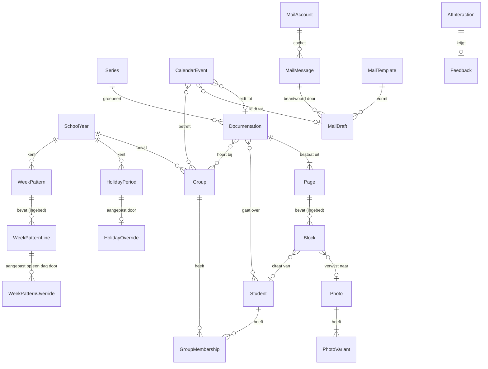

| Van | Naar | Kardinaliteit | Verwijzing bij | Bij verwijderen |
|---|---|---|---|---|
| Documentation | Page | 1 : n | Page (`documentationId`) én Documentation (`pageIds`, volgorde) | meeverwijderen |
| Page | Block | 1 : n | ingebed | meeverwijderen |
| Block | Photo | n : 0..1 | Block (`photoId`) | `refCount` verlagen; op 0 opruimen (T-38) |
| Photo | PhotoVariant | 1 : 3 | PhotoVariant | meeverwijderen |
| Documentation | Student | n : m | Documentation (`studentIds`) | losmaken, aanduiding "verwijderde leerling" |
| Documentation | Group | n : m | Documentation (`groupIds`) | losmaken |
| Documentation | Series | n : 0..1 | Documentation (`seriesId`) | losmaken (FR-INS-12) |
| Student | Group | n : m | GroupMembership | lidmaatschap meeverwijderen |
| CalendarEvent | Documentation | n : 0..1 | CalendarEvent | losmaken met melding (FR-AGE-19) |
| MailDraft | MailMessage | n : 0..1 | MailDraft (`sourceMessageId`) | losmaken |
| MailAccount | MailMessage | 1 : n | MailMessage | meeverwijderen bij ontkoppelen (FR-MAI-05) |
| SchoolYear | WeekPattern | 1 : n | WeekPattern (`schoolYearId`) | meeverwijderen |
| WeekPattern | WeekPatternLine | 1 : n | ingebed | meeverwijderen |
| WeekPatternLine | WeekPatternOverride | 1 : n | WeekPatternOverride (`lineId`) | de aanpassing heeft geen effect meer en wordt bij de opruimronde verwijderd met één logregel |

De regel dat `Documentation.pageIds` én `Page.documentationId` allebei bestaan, lijkt dubbel maar is het niet: `pageIds` draagt de **volgorde**, `documentationId` draagt de **eigendom**. `PageService` houdt ze consistent binnen één transactie; buiten die service schrijft niemand rechtstreeks aan een van beide (DR-14).

### 8.5 Indexen en zoekstrategie

| Vraag | Index |
|---|---|
| Overzicht op inhoudelijke datum | `documentations.date` |
| Dashboard "verder werken aan" | `documentations.updatedAt` |
| Alles over Kjeld | `documentations.*studentIds` |
| Alles van Groep 4 | `documentations.*groupIds` |
| Delen van een reeks | `documentations.seriesId` |
| Agenda van deze week | `calendarEvents.[start+end]` |
| Lidmaatschappen van een kind | `groupMemberships.studentId` |
| Bezetting van een groep op een datum | `groupMemberships.[groupId+from]` |
| Verlopen mailcache | `mailMessages.expiresAt` |
| Verweesde foto's | `photos.refCount` |
| Mijn basisweek op een datum | `weekPatterns.[schoolYearId+validFrom]` |
| Aangepaste dagen in een periode | `weekPatternOverrides.date` |

**Zoeken in tekst.** IndexedDB kan geen tekst doorzoeken. `SearchService` bouwt daarom bij het opstarten een index in het geheugen (T-16, C8 uit de review):

- Gevuld uit: titel, alle `TextBlock.text`, alle `QuoteBlock.text`, reeksnaam, en de roepnamen van gekoppelde leerlingen.
- Tokenisatie: kleine letters, diakrieten behouden, splitsen op niet-letters, woorden korter dan twee tekens weglaten, Nederlandse stopwoorden weglaten.
- Structuur: omgekeerde index van token naar een verzameling documentatie-id's, plus per documentatie de tekenposities voor het markeren van treffers.
- Terugval: trigrammen van elk token voor typefouten, met een drempel van 0,55 op de Jaccard-overeenkomst. Dat levert "kjelt" → "kjeld" (F-15.E1).

Omvang bij 1.000 documentaties van gemiddeld 1.200 tekens: ongeveer 55.000 unieke tokens en 1,2 miljoen verwijzingen, samen circa 18 MB in het geheugen. Dat is aanvaardbaar op een laptop en op een telefoon van na 2020.

**NFR-op-dit-punt.** Opbouw van de index bij 1.000 documentaties binnen 800 ms, uitgevoerd na het eerste schilderen zodat het dashboard niet wacht. Zoeken zelf binnen 150 ms (zie hoofdstuk 17).

### 8.6 Migraties

Elk record draagt zijn eigen `schemaVersion`. De database draagt daarnaast een `dbVersion` die Dexie beheert. De regel: **een migratie wordt altijd omkeerbaar beschreven**, ook als de omkering niet wordt geïmplementeerd, zodat bij een fout duidelijk is wat er moet gebeuren.

Bij het openen:

1. Is `dbVersion` van de database **lager** dan die van de app, dan draaien de migraties op volgorde.
2. Is hij **hoger**, dan weigert de app te openen met: "Deze gegevens komen uit een nieuwere versie van EduFlow. Werk de app bij of gebruik dit apparaat niet met deze versie." Er wordt niets gewijzigd. Zonder deze controle vernielt een oudere versie stilzwijgend velden die zij niet kent.

Voorbeeld: versie 3 naar 4, waarin `Documentation.groupId` verandert in `groupIds` (het besluit uit B-17).

```typescript
db.version(4).stores({
  documentations: "id, date, updatedAt, seriesId, status, *studentIds, *groupIds, deletedAt",
}).upgrade(async tx => {
  await tx.table("documentations").toCollection().modify((d: any) => {
    d.groupIds = d.groupId ? [d.groupId] : [];
    delete d.groupId;
    d.schemaVersion = 4;
  });
});
```

Omkering, beschreven maar niet uitgevoerd: `groupId = groupIds[0] ?? null`, waarbij documentaties met meer dan één groep hun tweede en volgende koppeling verliezen. Dat gegevensverlies is de reden dat terugmigreren niet wordt aangeboden.

Vóór elke migratie die gegevens weggooit, maakt de app automatisch een onversleutelde back-up in het geheugen en biedt hij die als bestand aan als de migratie mislukt.

**Er is geen migratieketen van de ontwikkelversie van vóór deze Bible naar versie 1.0** (T-40). Die versie draaide op de database `eduflow` met een ander recordmodel: sleutels als UUIDv4, geen `deletedAt`, `rev`, `origin` of `schemaVersion`, één tekstveld in plaats van pagina's met blokken, en één groep per leerling. Versie 1.0 begint op `eduflow-v1` en telt vanaf schemaversie 1 van dat schema. De reden is dat er nul echte records bestaan: een migratie die precies één keer draait op nul records, maar daarna jarenlang onderhouden en getoetst moet worden, is complexiteit zonder opbrengst (U-05, DR-02). Wat er wél is: één eenmalige uitleesroute die een bestaande `eduflow`-database als `.efb`-bestand wegschrijft, zodat er niets verdampt. De oude database wordt daarbij niet gewist.

### 8.7 Het back-upbestand

Eén archiefbestand met de extensie `.efb` (T-42). Naam: `eduflow-backup-2026-08-07-pc-carlo.efb`, met `-onversleuteld` erachter als er geen wachtwoord is gebruikt. Het archief is een zip; de eigen extensie bestaat zodat de bestandskiezer en de foutmeldingen één woord hebben voor "een EduFlow-back-up" en niet voor "een willekeurig zipbestand".

```
manifest.json
data/students.json
data/groups.json
data/groupMemberships.json
... (één bestand per tabel)
blobs/3f7a1c9e...b2.jpg      (bestandsnaam = hash + variant)
blobs/3f7a1c9e...b2.thumb.jpg
```

```json
{
  "format": "eduflow-backup",
  "formatVersion": 2,
  "createdAt": "2026-08-07T16:20:03.118Z",
  "appVersion": "1.0.0",
  "dbVersion": 1,
  "device": { "id": "d7f1...", "name": "pc-carlo" },
  "encryption": { "algorithm": "AES-GCM", "kdf": "PBKDF2-SHA256", "iterations": 600000 },
  "counts": {
    "students": 20, "groups": 3, "groupMemberships": 26, "series": 3,
    "documentations": 212, "pages": 287, "photos": 1240, "photoVariants": 3720,
    "calendarEvents": 418, "mailDrafts": 34, "styleExamples": 4,
    "weekPatterns": 3, "weekPatternOverrides": 11
  },
  "bytes": { "data": 4180221, "blobs": 3980112004 },
  "checksum": { "algorithm": "SHA-256", "value": "9c1f..." }
}
```

Versleuteling: het wachtwoord gaat door PBKDF2-SHA256 met 600.000 rondes en een willekeurig zout van 16 bytes; de sleutel versleutelt elk bestand afzonderlijk met AES-GCM en een eigen initialisatievector. Elk bestand afzonderlijk, zodat terugzetten in stappen kan zonder alles in het geheugen te laden. Er is geen herstelroute bij een vergeten wachtwoord, en de app zegt dat vóór het aanmaken (FR-INS-29).

Omvang bij 212 documentaties met gemiddeld zes foto's: circa 4 GB, vrijwel geheel beeld. De app meldt dat vooraf en waarschuwt als de doelschijf te klein is.

Terugzetten:

| Tabel | Botsingsregel bij samenvoegen |
|---|---|
| `documentations`, `pages`, `calendarEvents`, `mailDrafts` | hoogste `updatedAt` wint; de andere versie blijft als kopie met de aantekening "uit back-up van <datum>" (FR-INS-31) |
| `photos`, `photoVariants` | gelijke `hash` is hetzelfde bestand; niet dubbel opslaan |
| `students`, `groups`, `series` | gelijke `id` samenvoegen op hoogste `updatedAt`; gelijke naam met andere `id` blijft naast elkaar staan met een melding |
| `groupMemberships` | gelijke combinatie leerling-groep-`from` samenvoegen; overlap opheffen door de langste periode te nemen |
| `styleProfile` | het profiel uit het bestand vervangt het huidige alleen bij "Alles vervangen" |
| `settings` | huidige instellingen blijven bij samenvoegen |
| `mailMessages`, `changeLog`, `aiInteractions` ouder dan een jaar | niet in de back-up, dus geen botsing |

### 8.8 Bewaartermijnen en opruimen

| Tabel | Bewaartermijn | Wie ruimt op |
|---|---|---|
| `mailMessages` | 7 dagen na `cachedAt` | opruimronde bij elke start en elk uur |
| Prullenbak (alle tabellen met `deletedAt`) | 30 dagen | opruimronde bij elke start |
| `photos` met `refCount` 0 | tot en met de eerstvolgende start (T-38) | opruimronde bij elke start |
| `changeLog` | 5.000 regels, ingekort tot 500 na een geslaagde back-up | ringbuffer |
| `aiInteractions` | 365 dagen | opruimronde bij elke start |
| `feedback` | volgt de bijbehorende `aiInteraction` | idem |
| `auditEvents` | 5 jaar | nooit automatisch; wel te exporteren |
| `documentations`, `pages`, `photos`, `students`, `groups`, `series`, `calendarEvents`, `mailDrafts`, `styleExamples`, `weekPatterns` | **nooit automatisch** | alleen de gebruiker |
| `weekPatternOverrides` | tot het weekonderdeel waar hij bij hoort verdwijnt | de opruimronde, met één logregel |

Dat laatste is een principe: de app gooit geen werk weg. Wat de gebruiker heeft gemaakt, verdwijnt alleen doordat de gebruiker het weggooit.

### 8.9 Opslagbegroting

Uitgangspunt: een gemiddelde documentatie met zes foto's van een moderne telefoon (4032 × 3024, circa 3,5 MB origineel).

| Onderdeel | Per foto | Per documentatie (6 foto's) |
|---|---|---|
| `print` (3300 px lange zijde, JPEG 88) | 1,9 MB | 11,4 MB |
| `screen` (1280 px) | 320 kB | 1,9 MB |
| `thumb` (480 px) | 55 kB | 330 kB |
| Tekst, blokken, metagegevens | — | 12 kB |
| **Totaal** | **2,3 MB** | **13,6 MB** |

| Gebruik | Documentaties | Omvang |
|---|---|---|
| Eén schooljaar, 2 per week | 76 | 1,03 GB |
| Eén schooljaar, intensief (4 per week) | 152 | 2,07 GB |
| Drie schooljaren, intensief | 456 | 6,20 GB |

De basisweek staat hier niet in de tabel omdat hij niet meetelt. Vijfentwintig weekonderdeeltjes met een geldigheidsperiode zijn enkele kilobytes, en die groeien niet met het aantal schooldagen: wat de basisweek oplevert wordt berekend en niet opgeslagen (B-100). Een gematerialiseerde basisweek zou per schooljaar ongeveer duizend records hebben toegevoegd en daarmee de referentiegegevens van §17.1 in zijn eentje hebben gevuld. Dat is de reden dat hij berekend is.

Browsers geven doorgaans tot 60 procent van de vrije schijfruimte aan één oorsprong, met een harde bovengrens per browser. Op een laptop met 80 GB vrij is dat ruim voldoende voor drie jaar; op een telefoon met 12 GB vrij komt de grens na ongeveer anderhalf jaar intensief gebruik in zicht.

Drempels, gemeten met `navigator.storage.estimate()`:

| Drempel | Gedrag |
|---|---|
| 80 procent van de schatting | Eenmalig per sessie de waarschuwing met een knop naar Opslag (T-09, FR-INS-34) |
| 90 procent | Waarschuwing bij elke start, plus een voorstel om afdrukvarianten van het oudste schooljaar weg te gooien (B-64) |
| 95 procent | Nieuwe foto's geweigerd; tekst opslaan blijft werken (FR-INS-35) |
| `QuotaExceededError` | Tekst in het geheugen houden, elke tien seconden opnieuw proberen, scherm bewerkbaar houden (F-24.E2) |

Het weggooien van alleen de `print`-varianten bespaart 84 procent van de fotoruimte en houdt de documentatie volledig leesbaar op het scherm. Dat is de reden dat die optie bestaat.

### 8.10 De weg naar de server

Fase 2 verplaatst de bron van waarheid naar een database bij een verwerker binnen de EU, na akkoord van de functionaris gegevensbescherming (B-45, hoofdstuk 15). Wat er dan gebeurt:

**Bijkomende tabellen:** `organisations`, `users`, `devices`, `syncState` (per apparaat en tabel de laatst verwerkte `rev`), `shares` (welke documentatie is met welke collega gedeeld) en `sessions`.

**Bijkomende velden:** elk record krijgt `organisationId` en `ownerUserId`. Die twee zijn de reden dat het model nu al met UUID's werkt: bij het samenvoegen van twee lokale databases in één organisatie mogen geen sleutels botsen.

**Synchronisatie:** per record de hoogste `rev` wint, met `origin` als beslisser bij gelijkstand (alfabetisch op apparaat-id, zodat het gedrag voorspelbaar is en niet van de klok afhangt). Drie uitzonderingen:

1. `documentations.pageIds` en `pages.blocks` worden **per veld** samengevoegd, niet per record, omdat twee mensen aan verschillende pagina's van dezelfde documentatie kunnen werken.
2. Grafstenen winnen altijd van wijzigingen: iets wat verwijderd is blijft verwijderd, ook als het elders bewerkt is. De gebruiker krijgt een melding.
3. `photos` worden nooit samengevoegd maar op `hash` ontdubbeld.

**Wat nu al moet gebeuren om dat later niet te hoeven verbouwen** — dit zijn de drie dingen die B-24 concreet maken:

1. **Geen enkele plek in de code leest of schrijft rechtstreeks aan IndexedDB.** Alles loopt via `StorageService` (DR-13). Dat maakt de overstap één vervanging.
2. **Elke schrijfactie verhoogt `rev` en zet `origin`, ook nu er nog niets synchroniseert.** Zonder die geschiedenis heeft de eerste synchronisatie geen enkel aanknopingspunt en moet zij alles vergelijken.
3. **Verwijderen is markeren, nooit wissen** (T-11). Een record dat lokaal wordt gewist zonder grafsteen keert bij de eerste synchronisatie terug vanaf de server — het klassieke geval van herrijzenis dat je achteraf niet meer kunt repareren.

Wat níét vooruitgeschoven wordt: er komt in versie 1.0 geen `SyncService`-implementatie, geen wachtrij die naar een server wijst en geen conflictscherm. Alleen de interface staat er, met één implementatie die niets doet (T-20). Meer bouwen aan een server die er nog niet is, is het tegenovergestelde van U-05.

---

## 9. Domeinmodel

### 9.1 Waarom een domeinmodel naast een datamodel

Hoofdstuk 8 beschrijft waar een gegeven staat: in welke tabel, onder welke sleutel, met welke index, in welk formaat. Dit hoofdstuk beschrijft wat dat gegeven betekent: welk begrip uit het werk van een leerkracht het weergeeft, welke regels er altijd voor gelden, welke gebeurtenissen het kan ondergaan en welke toestanden het kan aannemen. Die twee lagen zijn niet twee beschrijvingen van hetzelfde. Ze veranderen op verschillende momenten, om verschillende redenen, en met verschillende gevolgen.

De regel die die scheiding bewaakt luidt: **het datamodel mag veranderen zonder dat het domein verandert.** Je mag een tabel splitsen omdat hij te groot wordt. Je mag een index toevoegen omdat een lijst te traag is. Je mag `blocks` uit `pages` halen en er een eigen tabel van maken, of ze juist samenvoegen. Je mag een veld hernoemen, een blob anders comprimeren, een `PhotoVariant` bijmaken. Geen van die wijzigingen raakt dit hoofdstuk. Wat er in dit hoofdstuk staat, verandert alleen door een productbesluit, en dat besluit staat dan in hoofdstuk 19 met een datum en een reden.

Andersom geldt de omkering net zo hard: **het domein verandert nooit stilzwijgend door een technische ingreep.** Voeg je bij het opschonen van een tabel een veld `groupId` toe aan `Student` omdat dat een join scheelt, dan heb je geen index toegevoegd maar het domein veranderd. Op dat moment heeft een leerling weer één groep, gaat U-07 onderuit, en klopt de helft van dit hoofdstuk niet meer. Dat is geen prestatie-optimalisatie. Dat is een besluit dat niemand genomen heeft.

Dit onderscheid is de praktische bescherming van twee uitgangspunten uit hoofdstuk 2.

**U-02, één bron van waarheid.** Een gegeven dat afgeleid is, hoort niet opgeslagen te worden. Maar of iets afgeleid is, kun je in het datamodel niet zien: een kolom `status` en een kolom `title` zien er in Dexie identiek uit. Alleen het domein weet dat `title` een gegeven is dat de gebruiker invoert en dat `status` een gevolg is van iets anders, namelijk of er ooit een geslaagde export is geweest (B-13). Zonder deze laag ontstaat de fout vanzelf: iemand schrijft `documentation.status = 'gedeeld'` bij het exporteren, iemand anders vergeet dat bij het importeren van een back-up, en er ontstaan twee waarheden over hetzelfde. Paragraaf 9.8 somt op wat berekend wordt en dus nergens opgeslagen staat.

**U-03, geen dubbele businesslogica.** Een regel als "een lidmaatschap mag niet eindigen voordat het begint" moet op precies één plek staan. Zonder domeinlaag staat hij op drie plekken: in het scherm dat de datumkiezer begrenst, in de service die opslaat, en nog een keer in de importroutine van de back-up, waar iemand hem net iets anders formuleert. Paragraaf 9.5 nummert die regels en wijst per regel één plek aan waar hij wordt afgedwongen. Alle andere plekken mogen hem tonen, uitleggen en er een nettere foutmelding van maken, maar mogen hem niet opnieuw bedenken.

Er is een eenvoudige toets om te controleren of de scheiding nog klopt. Neem een geplande technische wijziging en vraag: moet ik hiervoor iets in hoofdstuk 9 aanpassen? Is het antwoord nee, dan is het een datamodelwijziging en hoef je alleen hoofdstuk 8 en de migratie bij te werken. Is het antwoord ja, dan is het geen technische wijziging maar een productwijziging, en dan begint hij met een besluit. Die toets hoort bij elke pull request met een migratie erin.

Het verschil in code ziet er zo uit. Links de opslagvorm, rechts wat het domein erover zegt.

```typescript
// Opslag (hoofdstuk 8): plat, indexeerbaar, één rij per record.
type StoredMembership = {
  id: string;            // UUIDv7
  studentId: string;
  groupId: string;
  from: string;          // ISO-datum
  until: string | null;
  createdAt: string; updatedAt: string; deletedAt: string | null;
  rev: number; origin: string; schemaVersion: number;
};

// Domein (dit hoofdstuk): een lidmaatschap is een looptijd, geen koppelrij.
// De regels INV-22 t/m INV-25 gelden hier, niet in de tabel.
type GroupMembership = {
  id: MembershipId;
  student: StudentId;
  group: GroupId;
  period: ClosedOpenPeriod;   // begin verplicht, einde optioneel, einde >= begin
};
```

De opslagvorm mag morgen anders zijn. `ClosedOpenPeriod` blijft.

### 9.2 De begrippenkaart

Twintig begrippen dragen het hele product. Ze staan hier in de taal waarin een leerkracht erover praat, niet in de taal waarin ze opgeslagen worden. Bij elk begrip staat waar het vandaan komt in het werk, en waarmee het in gesprekken en in code stelselmatig verward wordt. Die tweede regel is geen aardigheidje: bijna elke fout in een datamodel begint met twee begrippen die op elkaar lijken en die iemand op één hoop heeft gegooid.

**Documentatie** — `Documentation`

Een documentatie is het verhaal van één moment of één activiteit, vastgelegd zodat iemand anders het kan lezen: een ouder, een collega, de intern begeleider, of jijzelf over een half jaar. Hij heeft een datum, meestal een titel, tekst, foto's en soms citaten van kinderen. Hij hoort bij nul of meer leerlingen en bij nul of meer groepen. Hij is af als jij hem af vindt, en dat blijkt uit het feit dat je hem hebt geëxporteerd, niet uit een knop die je aanvinkt.

*Herkomst.* Het is de digitale versie van wat er nu op een A4 of in een appgroep terechtkomt: zes foto's van de donderdagmiddag met drie regels eronder.

*Verwarring.* Een documentatie is geen rapport en geen verslag over een kind. Hij beschrijft wat er gebeurde, niet hoe goed het ging. En hij is geen bestand: de PDF en de afbeelding zijn uitvoer van een documentatie, geen documentatie.

**Pagina** — `Page`

Een pagina is één vel dat je uiteindelijk in handen hebt of op het scherm ziet: A4 liggend, 297 bij 210 millimeter, met tien millimeter marge. Elke pagina heeft een eigen layout uit een vaste lijst en een eigen volgnummer binnen de documentatie. Past de inhoud niet, dan komt er een pagina bij en wordt de titel bovenaan herhaald.

*Herkomst.* Uit het feit dat het eindresultaat papier of een afbeelding is. Wie een documentatie maakt, denkt in bladen, niet in scrollhoogte.

*Verwarring.* Een pagina is geen opmaakgevolg dat pas bij het exporteren ontstaat. Hij is een eigen record met een eigen bestaan (U-06, B-15). Een pagina is ook geen scherm: het schrijfscherm toont meerdere pagina's onder elkaar.

**Blok** — `Block`

Een blok is één stukje inhoud dat als geheel ergens op een pagina staat: een stuk tekst, een foto, een citaat of een kop. Blokken staan in een volgorde en worden door de layout aan genummerde sloten toegewezen. Er zijn vier soorten: `TextBlock`, `PhotoBlock`, `QuoteBlock` en `HeadingBlock`. Meer soorten komen er in versie 1.0 niet.

*Herkomst.* Uit de manier waarop je een blad vult: eerst een kop, dan de foto's, dan wat tekst, dan die ene zin die een kind zei.

*Verwarring.* Een blok is geen alinea. Eén tekstblok kan meerdere alinea's bevatten. Een blok is ook geen slot: het slot is de plek op de pagina, het blok is wat erin staat.

**Foto** — `Photo`

Een foto is één afbeelding die je hebt toegevoegd, met alles wat de app ervan afleidt. Van elke foto bestaan drie varianten (`PhotoVariant`): een miniatuur van 480 pixels voor lijstjes, een schermversie van 1280 pixels voor het schrijfscherm en een drukversie van 3300 pixels voor de PDF. De foto blijft op het apparaat. Altijd.

*Herkomst.* Uit je telefoon, direct na de activiteit. Zes tot tien stuks per middag is normaal.

*Verwarring.* Een foto is geen fotoblok. Dezelfde foto kan in meerdere documentaties in een blok staan; verwijder je het blok, dan is de foto niet weg. En een foto is geen bijlage: hij hoort bij de documentatie, niet erbij.

**Citaat** — `QuoteBlock`

Een citaat is iets wat een kind letterlijk gezegd heeft, opgeschreven omdat de woorden zelf de observatie zijn. Het krijgt in elke layout een eigen plek en een eigen opmaak. Een citaat kan aan één leerling gekoppeld zijn, maar hoeft dat niet: soms weet je wel wat er gezegd is en doet het er niet toe wie het zei.

*Herkomst.* Uit het gesprek zelf. "Kijk, de brug houdt", zei Kjeld, en dat is de hele observatie.

*Verwarring.* Een citaat is geen tekstblok met aanhalingstekens; het is een eigen bloksoort met een eigen verwijzing (B-37). En het is geen uitspraak van jou: wat jij vaststelt hoort in de tekst, niet tussen aanhalingstekens.

**Reeks** — `Series`

Een reeks is een verzameling documentaties die bij elkaar horen omdat ze over hetzelfde project of thema gaan: "Kunstwerk Dok", "ONDERZOEK Natuur", "Start van het jaar". Een documentatie hoort bij hoogstens één reeks. De reeks is de reden dat de app bij de vierde documentatie weet wat er in de eerste drie stond, en dat is de enige functie in EduFlow die een losse chatbot niet kan nadoen (B-04).

*Herkomst.* Uit hoe een project loopt: zes weken, acht momenten, één verhaal.

*Verwarring.* Een reeks is geen map en geen tag. Hij is ook geen voorvoegsel in de titel: de titel blijft de titel, de reeks is een verwijzing (B-35). En hij is geen groep: een reeks kan over meerdere groepen lopen.

**Leerling** — `Student`

Een leerling is één kind waarover je documenteert, in de app aanwezig als een naam en verder vrijwel niets. De app slaat geen geboortedatum op, geen adres, geen leerlingnummer, geen dossier. De naam is er om twee redenen: om documentaties terug te vinden, en om te weten welk woord vervangen moet worden voordat er tekst naar een AI-provider gaat. In de kinderopvang heet dit begrip **Kind**; dat is één instelling die alle schermteksten omzet.

*Herkomst.* Uit de groepslijst die aan het begin van het jaar op je bureau ligt.

*Verwarring.* Een leerling heeft geen groep. Hij heeft lidmaatschappen (U-07, B-16). En een leerling is geen dossier: alles wat op een leerlingvolgsysteem lijkt, hoort hier niet.

**Groep** — `Group`

Een groep is een verzameling leerlingen die in een bepaalde periode bij elkaar horen. Een groep hoort bij precies één schooljaar en heeft een type: `stamgroep`, `combinatiegroep`, `projectgroep`, `zorggroep`, `instroomgroep` of `overig`. Groep 4 – De Regenboog is een stamgroep in 2026-2027. De vier kinderen die op dinsdag met de plusgroep meedoen vormen een projectgroep in datzelfde jaar.

*Herkomst.* Uit de schoolorganisatie, maar ook uit de werkelijkheid ernaast: leerkrachten werken de hele dag met verzamelingen kinderen die niet in het schoolschema staan.

*Verwarring.* Een groep is geen klas in de zin van een vast hokje waar een kind in zit. Een kind zit in meerdere groepen tegelijk. En een groep is niet hetzelfde in twee schooljaren: Groep 4 – De Regenboog van 2026-2027 en die van 2027-2028 zijn twee groepen.

**Groepslidmaatschap** — `GroupMembership`

Een lidmaatschap is het feit dat één leerling in één periode bij één groep hoort. Het heeft een begindatum en een optionele einddatum. Zolang de einddatum leeg is, loopt het lidmaatschap door. Bij een jaarovergang wordt een lidmaatschap afgesloten met een einddatum, nooit verwijderd, zodat een documentatie van vorig jaar over de goede groep blijft gaan.

*Herkomst.* Uit instroom en doorstroom. Kinderen komen in november binnen, gaan in maart naar een andere groep, doen zes weken mee met een project.

*Verwarring.* Een lidmaatschap is geen koppeltabel die je in gedachten mag wegdenken. Het draagt de looptijd, en die looptijd is de reden dat de app kan zeggen in welke groep een kind zat op de datum van een documentatie.

**Schooljaar** — `SchoolYear`

Een schooljaar is de periode waarin groepen bestaan, vakanties vallen en de agenda loopt: van eind augustus tot de zomervakantie erna. Het heeft een naam ("2026-2027"), een begindatum, een einddatum en een regio, want de vakanties verschillen per regio. Het schooljaar is de eenheid waarin een leerkracht denkt over alles wat langer duurt dan een week.

*Herkomst.* Uit de jaarplanning die in juni op tafel komt.

*Verwarring.* Een schooljaar is geen kalenderjaar en geen periode die je zelf mag verzinnen. En het is geen filter: het is het kader waar groepen en vakanties aan hangen.

**Vakantie** — `HolidayPeriod`, `HolidayOverride`

Een vakantie is een aaneengesloten periode zonder les. Kerstvakantie en zomervakantie liggen landelijk vast en zijn niet te wijzigen. Herfst-, voorjaars- en meivakantie zijn adviesdata: elke school mag afwijken, en die afwijking leg je vast als een aanpassing (`HolidayOverride`) naast de oorspronkelijke periode, niet eroverheen (B-29). Zo overleeft je eigen aanpassing een update van het vakantiebestand.

*Herkomst.* Uit het overzicht van de rijksoverheid en het besluit van je eigen bestuur, die niet altijd gelijk zijn.

*Verwarring.* Een vakantie is geen agenda-item. Je maakt hem niet zelf aan en je verwijdert hem niet. Een studiedag is dat wél: dat is een agenda-item.

**Agenda-item** — `CalendarEvent`

Een agenda-item is één ding dat op een dag of in een periode gebeurt en dat jij hebt ingevoerd of geïmporteerd: een studiedag, een margedag, een ouderavond, een uitje, een vergadering, een verjaardag. Het heeft een begin en een einde en kan een hele dag beslaan. Het kan aan een groep hangen. Het is te importeren en te exporteren als ICS (B-30).

*Herkomst.* Uit de jaarplanning, de weekbrief en de zes mails waarin een datum staat.

*Verwarring.* Een agenda-item is geen vakantie en geen weekonderdeel. Wat er standaard op een schooldag staat, komt uit je basisweek en is geen agenda-item (B-98, B-100). EduFlow is geen roostersysteem: geen lokalen, geen collega's, geen beschikbaarheid, geen schoolbrede planning.

**Basisweek** — `WeekPattern`

Je normale week: op welke weekdagen je wat doet, van hoe laat tot hoe laat. De app zet die door naar je schooldagen en slaat het resultaat nooit op. Een wijziging geldt vanaf een datum, zodat wat er vorige maand in je agenda stond blijft kloppen (B-99). Een weekonderdeel dat op één dag anders is, leg je vast als een aangepaste dag naast de basisweek, niet eroverheen — dezelfde vorm als een aangepaste vakantie naast een vakantie (B-29).

*Herkomst.* Uit je eigen weekindeling, één keer in augustus ingevuld.

*Verwarring.* De basisweek is geen rooster van de school en geen lesurentabel. Hij is van jou, hij kent geen lokalen en geen collega's, en wat hij oplevert is geen agenda-item.

**Mailbericht** — `MailMessage`

Een mailbericht is een bericht dat in jouw postbus staat en dat EduFlow heeft gelezen om je te helpen: de mail van een ouder, de mail van de directie. EduFlow leest, hij verstuurt niet. Een bericht wordt alleen gecachet als je het opent, en die cache vervalt na zeven dagen. Voordat er iets van dat bericht naar een AI-provider gaat, is het door de privacypoort geweest, inclusief afzender en handtekening.

*Herkomst.* Uit Outlook of Gmail, via het account van je eigen werkgever.

*Verwarring.* Een mailbericht is geen mailconcept. Het is inkomend, je bewerkt het niet, en het is niet van jou.

**Mailconcept** — `MailDraft`

Een mailconcept is het antwoord dat jij aan het schrijven bent, met of zonder hulp van AI. Het heeft altijd een onderwerp (B-36) en een tekst, en het eindigt op één van twee manieren: als concept in je eigen mailprogramma, of gekopieerd naar het klembord. Er is geen verzendknop, en er zal er ook geen komen, want de app vraagt bij Microsoft en Google geen verzendrecht aan (B-19, B-20).

*Herkomst.* Uit de vijftien minuten die je op donderdagavond aan drie mails kwijt bent.

*Verwarring.* Een mailconcept is geen verstuurde mail en het is geen concept in je postbus totdat jij het daar hebt neergezet. Tot dat moment staat het alleen in EduFlow.

**Sjabloon** — `MailTemplate`

Een sjabloon is een kant-en-klaar startpunt voor een mailconcept: een onderwerp, een tekstskelet met open plekken, en de toon die erbij hoort. "Uitnodiging ouderavond", "Terugkoppeling na een incident op het plein", "Bevestiging van een afspraak". Je kiest hem zelf; de app kiest nooit voor je (B-11).

*Herkomst.* Uit het feit dat dezelfde mail vier keer per jaar de deur uit gaat met andere data erin.

*Verwarring.* Een sjabloon is geen opdracht aan de AI en geen layout. De layouts van documentaties zijn iets anders en heten anders.

**Stijlprofiel** — `StyleProfile`

Het stijlprofiel is wat de app over jouw schrijfstijl heeft afgeleid uit teksten die je hebt overgenomen of zelf geschreven: gemiddelde zinslengte, alinealengte, aanspreekvorm, werkwoordstijd, de verhouding tussen beschrijven en interpreteren, hoe vaak je citaten gebruikt, je vaktaalniveau, je veelgebruikte en vermeden woorden. Het is één leesbaar geheel dat je in Instellingen kunt bekijken, wijzigen en wissen (B-23).

*Herkomst.* Uit het feit dat generieke AI-tekst er altijd net naast zit, en dat je die dus altijd moet bijschaven.

*Verwarring.* Een stijlprofiel is geen getraind model. Er wordt niets getraind en niets bijgesteld bij de provider (B-22). Het profiel is invoer bij een aanroep, net als je eigen tekst.

**Stijlvoorbeeld** — `StyleExample`

Een stijlvoorbeeld is één paar: een ruwe notitie zoals jij die maakt, en de documentatie zoals die eruit hoort te zien. Bij een AI-aanroep gaan de meest gelijkende voorbeelden mee, zodat het antwoord op jouw werk lijkt en niet op het gemiddelde van het internet. Voorbeelden gaan door dezelfde privacypoort als al het andere, want er staan namen in van kinderen die niet meer in je groep zitten.

*Herkomst.* Uit documentaties die je al gemaakt hebt en goed vond.

*Verwarring.* Een stijlvoorbeeld is geen sjabloon. Een sjabloon vult in, een voorbeeld laat zien. En het is geen instelling die je één keer invult: de verzameling groeit mee.

**Pseudoniem** — `PseudonymMap`, `PrivacyTerm`

Een pseudoniem is de code die in de plaats komt van een naam of een ander persoonsgegeven zodra tekst het apparaat verlaat: `[LEERLING-1]`, `[OUDER-1]`, `[COLLEGA-1]`, `[SCHOOL]`, `[E-MAIL-1]`, `[TELEFOON-1]`, `[ADRES-1]`, `[IBAN-1]`, `[BSN-1]`. De koppeling tussen code en naam heet de pseudoniemkaart en blijft op het apparaat. In het antwoord worden de codes teruggezet naar namen voordat je iets te zien krijgt.

*Herkomst.* Uit de eis dat er geen kindernamen naar een externe partij gaan, en uit het besef dat een namenlijst nooit compleet is.

*Verwarring.* Pseudonimiseren is geen anonimiseren. Voor wie de kaart heeft, blijft `[LEERLING-1]` een persoonsgegeven (zie hoofdstuk 15). De namenlijst is een vangnet, geen garantie.

**Back-up** — `ExportBundle`

Een back-up is één bestand met alles erin: documentaties, pagina's, blokken, foto's, leerlingen, groepen, lidmaatschappen, agenda, mailconcepten, sjablonen, stijlprofiel, voorbeelden en instellingen. Het is tegelijk je vangnet, je verhuisdoos naar een ander apparaat en je uitweg als je ooit met EduFlow stopt. Terugzetten is een aparte handeling en overschrijft nooit stilzwijgend wat er al staat.

*Herkomst.* Uit twee harde beperkingen: opslag zit per apparaat vast (B-01), en Safari wist opslag na zeven dagen zonder gebruik (B-02).

*Verwarring.* Een back-up is geen export van een documentatie. De PDF en de deelbare afbeelding zijn leesbaar voor mensen en niet terug te zetten; de back-up is terug te zetten en niet bedoeld om te lezen.

**Toegangscode** — geen entiteit

De toegangscode is de sleutel waarmee een apparaat de AI- en mailroutes van de eigen server mag gebruiken. Je voert hem één keer per apparaat in en daarna niet meer. Hij is geen account: er is geen gebruikersnaam, geen wachtwoordherstel en geen profiel achter (B-21). Hij bepaalt ook het dagbudget en de snelheidslimiet, per code en per IP-adres.

*Herkomst.* Uit het feit dat een open AI-route op een eigen webadres binnen een week een gratis AI-dienst op andermans rekening is.

*Verwarring.* Een toegangscode is geen wachtwoord en geen licentie, en hij beschermt de gegevens op het apparaat niet: wie het apparaat heeft, heeft de gegevens. Hij beschermt de serverroute.

### 9.3 Begrensde gebieden

Het domein valt uiteen in vier gebieden met een duidelijke grens en een gedeelde kern. Een gebied is niet hetzelfde als een module: `DOC`, `AGE`, `MAI`, `DAS` en `INS` zijn schermgroepen, de gebieden hieronder zijn taalgebieden. Het dashboard heeft geen eigen gebied omdat het niets eigens bezit; het toont uit alle vier.

De grens betekent twee dingen. Ten eerste: binnen een gebied heeft elk woord één betekenis, en die betekenis geldt daar. Ten tweede: een gebied kent de aggregaatwortels van een ander gebied hoogstens bij naam en sleutel, nooit van binnen. `MailService` mag weten dat er een documentatie met een bepaalde sleutel bestaat. Hij mag de pagina's daarvan niet lezen, niet renderen en niet wijzigen.

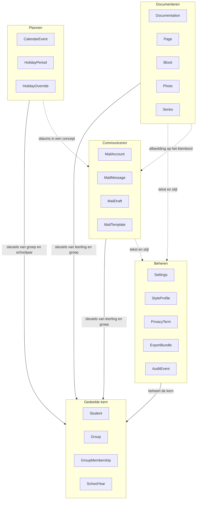

#### 9.3.1 Documenteren

Entiteiten: `Documentation`, `Page`, `Block` met zijn vier varianten, `Photo`, `PhotoVariant`, `Series`.

De taal die hier geldt is de taal van het blad. Een documentatie *bestaat uit* pagina's, een pagina *heeft* een layout, een layout *heeft* sloten, een blok *staat in* een slot, inhoud die niet past *loopt door*. Het woord "opslaan" komt in dit gebied nauwelijks voor omdat alles vanzelf wordt bewaard; het woord "exporteren" is hier het belangrijkste werkwoord, want daarmee verlaat het werk de app.

Over de grens gaat: sleutels van leerlingen en groepen naar binnen, een geëxporteerd bestand naar buiten, en tekst plus stijlprofiel naar de AI-route via de privacypoort. Naar binnen komt niets uit Plannen of Communiceren. Een documentatie weet niet dat er een ouderavond is.

#### 9.3.2 Plannen

Entiteiten: `CalendarEvent`, `WeekPattern` met zijn `WeekPatternLine`s, `WeekPatternOverride`, `HolidayPeriod`, `HolidayOverride`, plus `SchoolYear` uit de kern.

De taal is die van de kalender: een dag, een week, een jaar, een periode, een hele dag, een vakantie die vastligt of een advies is. Hier bestaat geen concept van "af" en geen concept van "gedeeld". Een agenda-item is er of is er niet. En wat de basisweek oplevert bestaat alleen zolang je ernaar kijkt: het wordt berekend en nergens bewaard (B-100).

Over de grens gaat: ICS-bestanden in beide richtingen, en datums die je in een mailconcept overneemt. Er gaat vanuit Plannen nooit iets naar de AI-route; de agenda is de enige module die volledig zonder netwerk werkt.

#### 9.3.3 Communiceren

Entiteiten: `MailAccount`, `MailMessage`, `MailDraft`, `MailTemplate`.

De taal is die van de postbus: lezen, samenvatten, opstellen, overdragen, kopiëren. Twee woorden zijn hier verboden omdat de handeling niet bestaat: **versturen** en **verzenden**. Wat de app doet heet *overdragen*, en de eindhandeling heet "Als concept in je mailprogramma" of "Kopieer".

Over de grens gaat: een deelbare afbeelding uit Documenteren die je in een concept plakt, datums uit Plannen, en tekst naar de AI-route via de privacypoort. Wat er nadrukkelijk niet over de grens gaat, is de inhoud van een documentatie: wil je die in een mail, dan plak je de afbeelding, niet de tekst.

#### 9.3.4 Beheren

Entiteiten: `Settings`, `User`, `StyleProfile`, `StyleExample`, `PrivacyTerm`, `Feedback`, `AIRequest`, `AIInteraction`, `ExportBundle`, `AuditEvent`, `ChangeLogEntry`.

De taal is die van het gereedschap: instellen, aanzetten, bekijken, wissen, terugzetten, bewijzen. Dit is het enige gebied waar de gebruiker naar de app zelf kijkt in plaats van naar zijn werk. Het is ook het gebied dat Karin en Maarten gebruiken: het logboek moet aantoonbaar maken wat er de deur uit ging.

Over de grens gaat vrijwel alles, maar in één richting: Beheren levert instellingen, stijl en privacyregels aan de andere drie gebieden en ontvangt van hen gebeurtenissen om te loggen. Beheren wijzigt nooit inhoud in een ander gebied. De enige uitzondering is terugzetten uit een back-up, en dat is een expliciete handeling met een eigen bevestigingsscherm.

#### 9.3.5 De gedeelde kern

`Student`, `Group`, `GroupMembership` en `SchoolYear` horen bij geen van de vier gebieden en dat is opzettelijk. Ze horen bij alle vier tegelijk, met dezelfde betekenis. Een documentatie hangt aan leerlingen, een mailconcept gaat over een leerling, een agenda-item hangt aan een groep, en het schooljaar begrenst zowel de groepen als de vakanties.

Zou je de kern in één gebied leggen, dan gebeurt er onvermijdelijk één van twee dingen. Of het begrip krijgt daar eigenschappen die alleen dat gebied nodig heeft en die de andere gebieden vervolgens moeten negeren, en dan bestaat er in de praktijk toch een tweede definitie. Of de andere gebieden bouwen hun eigen kopietje, en dan is U-02 weg.

De regel voor de kern is streng en kort: **de kern heeft geen kennis van de vier gebieden.** `StudentService` en `GroupService` weten niet dat er documentaties bestaan. Verwijder je een leerling, dan vraagt de kern niet aan Documenteren of dat mag; Documenteren bewaakt zijn eigen verwijzingen (INV-13). De kern kent alleen zichzelf, en dat is precies waarom hij door alle vier gedeeld kan worden.

### 9.4 Aggregaten en hun grenzen

Een aggregaat is een groepje entiteiten dat je alleen als geheel mag wijzigen, met één entiteit als wortel waarlangs alle wijzigingen lopen. De grens van een aggregaat is de grens van een consistente toestand: binnen de grens gelden de invarianten uit paragraaf 9.5 op elk moment, buiten de grens gelden ze uiteindelijk.

Drie regels gelden voor elk aggregaat in EduFlow.

**Regel A — je slaat een aggregaat in één keer op.** Eén transactie, alle betrokken tabellen tegelijk, één ophoging van `rev` op de wortel, één `ChangeLogEntry`. Een pagina toevoegen en de documentatie bijwerken zijn niet twee schrijfacties die toevallig na elkaar komen; het is één schrijfactie. Mislukt hij, dan is er niets veranderd. Dit is de reden dat er geen enkele service is die rechtstreeks in `pages` of `blocks` schrijft: dat doet `DocumentationService`, via `PageService` binnen dezelfde transactie.

**Regel B — buiten de grens verwijs je met een sleutel, nooit met een object.** Een `PhotoBlock` bevat een `photoId`, geen `Photo`. Een `Documentation` bevat een lijst van `studentId`s, geen leerlingen. Dat maakt het onmogelijk om per ongeluk twee aggregaten in één transactie te wijzigen, en het houdt de aggregaten klein genoeg om in één keer te laden.

**Regel C — één aggregaat per gebruikershandeling.** Wijzigt een handeling twee aggregaten, dan is er precies één de hoofdzaak en volgt de tweede via een gebeurtenis (paragraaf 9.6). "Foto toevoegen" wijzigt het `Photo`-aggregaat en daarna, op `PhotoAdded`, het `Documentation`-aggregaat. Niet andersom en niet allebei tegelijk.

| Aggregaat (wortel) | Binnen de grens | Verwijzingen naar buiten | Bijzonderheid |
|---|---|---|---|
| `Documentation` | `Page`, `Block` en alle varianten, exportregistraties, `PseudonymMap` | `photoId`, `studentId`, `groupId`, `seriesId` | Het grootste aggregaat; laadt volledig in het schrijfscherm |
| `Photo` | `PhotoVariant` (drie stuks) | geen | Kent zijn gebruikers niet; wordt gevonden, niet gezocht |
| `Group` | `GroupMembership` | `studentId`, `schoolYearId` | Lidmaatschap hoort bij de groep, niet bij de leerling |
| `Student` | geen | geen | Bewust leeg: een naam en niets meer |
| `Series` | geen | geen | Documentaties verwijzen naar de reeks, niet omgekeerd |
| `SchoolYear` | `HolidayPeriod`, `HolidayOverride` | geen | Regio en versie van het vakantiebestand horen erbij |
| `CalendarEvent` | geen | `groupId` (optioneel) | Het schooljaar volgt uit de datum, zie §9.8 |
| `WeekPattern` | `WeekPatternLine` | `schoolYearId`, `groupId` per onderdeel | Eén record per geldigheidsperiode; oude periodes blijven staan, want zij dragen de geschiedenis (B-99) |
| `WeekPatternOverride` | geen | `lineId`, `groupId` | Staat los, zodat twee apparaten op verschillende dagen kunnen afwijken zonder elkaar te overschrijven (§8.10) |
| `MailAccount` | gecachete `MailMessage`s | geen | Loskoppelen wist de cache in dezelfde transactie |
| `MailDraft` | `PseudonymMap`, overdrachtsregistraties | `mailMessageId`, `mailTemplateId`, `studentId` | Staat op zichzelf; overleeft het loskoppelen van het account |
| `MailTemplate` | geen | geen | Alleen door de gebruiker gemaakt en gewijzigd |
| `StyleProfile` | `StyleExample` | `documentationId` per voorbeeld | Precies één record; volledig leesbaar en wisbaar |
| `AIInteraction` | `AIRequest`, het antwoord, de afhandeling | `documentationId` of `mailDraftId` | Alleen-toevoegen na afronding |
| `Feedback` | geen | `aiInteractionId` | Los aggregaat omdat terugkoppeling later kan komen |
| `PrivacyTerm` | geen | geen | De eigen woordenlijst naast de leerlingennamen |
| `Settings` | geen | geen | Precies één record, altijd aanwezig |
| `User` | — | — | Bestaat niet in versie 1.0 (T-50). Naam, rol, school en standaardtoon hebben elk elders een plek |
| `ExportBundle` | de volledige inhoud van alle andere aggregaten | geen | Bestaat alleen als bestand, niet in de opslag |
| `AuditEvent` | geen | vrije verwijzing als tekst | Alleen-toevoegen, nooit wijzigen, nooit verwijderen |
| `ChangeLogEntry` | geen | wortelsleutel van het gewijzigde aggregaat | Alleen-toevoegen; voedt `SyncService` in fase 2 |

#### 9.4.1 Documentation met zijn pagina's en blokken

De wortel is `Documentation`. Binnen de grens vallen alle `Page`s met hun volgnummers en layouts, alle `Block`s met hun sloten en volgorde, de registratie van geslaagde exports, en de pseudoniemkaart die bij deze documentatie hoort.

Dit is één aggregaat omdat de belangrijkste regels van het product over de combinatie gaan en niet over de delen. Of er een vervolgpagina nodig is, hangt af van hoeveel blokken er zijn en welke layout de pagina heeft. Of de titel herhaald moet worden, hangt af van het volgnummer. Of de status `gedeeld` is, hangt af van de exportregistraties. Geen van die vragen is te beantwoorden met alleen een pagina in de hand.

Naar buiten gaan vier soorten verwijzingen: `photoId` per fotoblok, `studentId` per gekoppelde leerling en per citaat, `groupId` per expliciet gekoppelde groep, en hoogstens één `seriesId`. Alle vier zijn sleutels. Het schrijfscherm laadt de bijbehorende namen en miniaturen erbij, maar het aggregaat bezit ze niet.

#### 9.4.2 Photo staat buiten de documentatie

`Photo` is een eigen aggregaat met zijn drie `PhotoVariant`s erin. Hij staat bewust buiten `Documentation`, om drie redenen. Een foto kan in meer dan één documentatie voorkomen. Een foto is groot: de drukversie alleen al is enkele megabytes, en die wil je niet laden als je een titel wijzigt. En een foto heeft een eigen levensloop die niet gelijkloopt met die van een documentatie: hij wordt gekozen, verwerkt, geweigerd of opgeruimd (zie §9.7.3).

De prijs daarvan is dat de verwijzing tijdelijk kan wijzen naar iets wat er niet meer is. Dat is aanvaard en afgevangen: een fotoblok waarvan de foto ontbreekt toont een lege plek met een melding, en de opruimronde bij het opstarten repareert de administratie (INV-13, INV-17).

#### 9.4.3 Group met zijn lidmaatschappen

De wortel is `Group`, en `GroupMembership` valt binnen die grens. Dat is een keuze met gevolgen, want je zou het lidmaatschap net zo goed bij de leerling kunnen leggen. Het ligt bij de groep omdat de regels die je moet bewaken over de groep gaan: overlappende periodes binnen dezelfde groep, het afsluiten van alle lidmaatschappen bij een jaarovergang, en het aantal leerlingen op een peildatum. `Student` blijft daardoor leeg, en dat is de beste bescherming tegen de terugkeer van `groupId` op een leerling.

Naar buiten gaan twee verwijzingen: `studentId` per lidmaatschap en `schoolYearId` op de groep zelf.

#### 9.4.4 MailDraft staat alleen

Een mailconcept is zijn eigen aggregaat en bevat niets anders dan zichzelf: onderwerp, tekst, ontvangergegevens zoals jij ze hebt ingevuld, de pseudoniemkaart van dit concept en de registratie van overdrachten. Het verwijst naar het bericht waarop je antwoordt, naar een eventueel sjabloon en naar leerlingen waar het over gaat, alle drie met een sleutel.

Het staat alleen omdat het de enige entiteit in Communiceren is die volledig van jou is. Berichten zijn van de postbus en verdwijnen als de cache vervalt of als je het account loskoppelt; het concept blijft. Koppel je je postbus los, dan houd je je concepten. Dat is geen bijkomstigheid maar de kern van B-19: wat je schrijft is van jou, waar je het heen stuurt is jouw handeling.

### 9.5 Invarianten

Een invariant is een uitspraak die op elk moment waar is over een aggregaat in rust. Niet "meestal", niet "als de gebruiker het goed doet", maar altijd. Elke invariant hieronder heeft één plek waar hij wordt afgedwongen. Dat is de enige plek waar de regel als regel is opgeschreven; alle andere plekken tonen hem hooguit.

De vier soorten handhaving in de kolom *Afgedwongen in* betekenen het volgende. **Type** betekent dat het TypeScript-type de fout onmogelijk maakt en dat er dus geen controle nodig is. **Zod** betekent dat het schema de fout tegenhoudt bij lezen en schrijven, aan elke grens. **Service** betekent dat de regel in de servicelaag zit en dat de schrijfactie faalt. **Scherm** betekent dat het scherm de handeling niet aanbiedt; die vorm komt alleen voor als aanvulling op een van de andere drie, nooit als enige waarborg.

#### 9.5.1 Algemene invarianten

| ID | Regel | Waarom | Afgedwongen in | Bij schending |
|---|---|---|---|---|
| INV-01 | Elk record heeft een sleutel die een UUIDv7 is en die nergens anders voorkomt. | Sleutels moeten op twee apparaten los van elkaar kunnen ontstaan zonder te botsen (B-24). | Zod, `StorageService` | Schrijven faalt; het record wordt geweigerd en gelogd. |
| INV-02 | Verwijderen zet `deletedAt` en wist niets. Een record met `deletedAt` komt in geen enkele lijst voor. | Zonder dit kan een verwijdering in fase 2 niet gesynchroniseerd worden, en is terugzetten na een misklik onmogelijk. | `StorageService` | Fysiek wissen is niet aan te roepen: de service kent geen `delete`. |
| INV-03 | `rev` neemt bij elke wijziging van een aggregaat met precies één toe, op de wortel. | Het is de enige manier om te zien of twee kopieën van hetzelfde record uit elkaar lopen. | `StorageService` | Een schrijfactie met een lagere of gelijke `rev` wordt geweigerd. |
| INV-04 | `createdAt` ligt nooit na `updatedAt`, en beide liggen niet in de toekomst. | Sorteren op tijd is de basis van elke lijst in de app. | Zod | Het record wordt bij het lezen afgekeurd en apart gezet. |
| INV-05 | Geen enkel persoonsgegeven staat in `localStorage`. | `localStorage` is leesbaar voor elk script en overleeft geen enkele privacytoets (T-01). | `SettingsService`, controle in de test | De schrijfactie is er niet; een test faalt bij elke poging een nieuw veld toe te voegen. |
| INV-06 | Elk record draagt de `schemaVersion` waarmee het geschreven is. | Zonder versienummer is een back-up van vorig jaar niet terug te zetten. | Zod | Een record zonder versienummer wordt behandeld als versie 1 en gemigreerd. |

#### 9.5.2 Documentatie, pagina en blok

| ID | Regel | Waarom | Afgedwongen in | Bij schending |
|---|---|---|---|---|
| INV-07 | Een documentatie bestaat pas zodra er inhoud is: tekst, een foto, een titel of een koppeling. | Leeg openen en weggaan mag niets achterlaten (B-34). | `DocumentationService` | Er wordt niets geschreven; het scherm sluit zonder record. |
| INV-08 | Zodra een documentatie bestaat, heeft hij minstens één pagina. | Een documentatie zonder pagina is niet te tonen, niet te exporteren en niet te tellen. | `DocumentationService` bij aanmaken, Zod bij lezen | Aanmaken faalt; bij lezen maakt de reparatieronde een lege eerste pagina aan en logt dat. |
| INV-09 | Een pagina hoort bij precies één documentatie. | Een gedeelde pagina zou twee eigenaren geven aan dezelfde inhoud en U-02 breken. | Type, Zod | Een pagina zonder of met een onbekende `documentationId` wordt niet geladen en apart gezet. |
| INV-10 | Een blok hoort bij precies één pagina. | Zelfde reden; bovendien bepaalt de pagina de layout waarin het blok wordt geplaatst. | Type, Zod | Het blok wordt niet geplaatst en verschijnt in het reparatieoverzicht. |
| INV-11 | De volgnummers van de pagina's van één documentatie lopen aaneengesloten vanaf 1, zonder gaten en zonder doublures. | Het volgnummer bepaalt de exportvolgorde en of de titel herhaald wordt (B-07). | `PageService` | Bij invoegen en verwijderen worden de nummers in dezelfde transactie hernummerd. |
| INV-12 | Twee blokken op dezelfde pagina staan nooit in hetzelfde slot, en een blok staat in hoogstens één slot. | Anders tekenen twee blokken over elkaar heen in de PDF. | `LayoutService` | De toewijzing wordt geweigerd; `PageService` maakt een vervolgpagina. |
| INV-13 | Een `PhotoBlock` verwijst naar een `Photo` die bestaat en niet verwijderd is. | Een fotoblok zonder foto levert een lege plek in een geëxporteerde PDF, en dat merk je pas bij de ouder. | `DocumentationService` bij schrijven, `PhotoService` bij de opruimronde | Het blok toont een melding in het scherm; exporteren is geblokkeerd tot je het blok verwijdert of vervangt. |
| INV-14 | Een `QuoteBlock` verwijst naar hoogstens één leerling. | Een citaat is één uitspraak van één kind, of van niemand in het bijzonder (B-37). | Type | Meer dan één verwijzing is niet uit te drukken; het type laat het niet toe. |
| INV-15 | Een documentatie met status `gedeeld` heeft `firstExportedAt` gevuld met het moment van de eerste geslaagde export. | De status is afgeleid en wordt niet door de gebruiker gezet (B-13, T-41). Zonder deze regel kan hij liegen. | `DocumentationService` is de enige schrijver van het veld; hij leidt de waarde af uit `firstExportedAt` | Het veld is opgeslagen en geïndexeerd, maar geen enkel scherm en geen enkele andere service schrijft eraan; een afwijking tussen `status` en `firstExportedAt` wordt bij het lezen gecorrigeerd en gelogd. |
| INV-16 | De datum van een documentatie ligt niet vóór 2015-08-01, niet meer dan zeven dagen in de toekomst (B-70), en niet vóór het begin van het oudste schooljaar in de opslag. | Je documenteert wat gebeurd is. Een datum ver in de toekomst breekt sortering, filters en de reeksvolgorde, en is bijna altijd een typefout. | Zod voor de ondergrens 2015-08-01, want die is absoluut. `DocumentationService` met de geïnjecteerde klok voor de zevendagengrens, en `DocumentationService` voor de schooljaargrens: die twee vragen om de huidige tijd respectievelijk om andere records, en geen van beide hoort daarom in een schema (§10.3). | Opslaan faalt met de melding dat de datum niet klopt; het veld krijgt de nadruk. |
| INV-17 | Een foto waarnaar geen enkel `PhotoBlock` verwijst, bestaat hoogstens tot en met de eerstvolgende start van de app. | Losse blobs vullen de opslag met materiaal dat niemand meer kan zien en dat er wel toe doet (T-09). | `PhotoService`, opruimronde bij starten | De opruimronde verwijdert de foto en zijn varianten en schrijft één `AuditEvent`. |
| INV-18 | Van elke beschikbare foto bestaan precies drie varianten: 480, 1280 en 3300 pixels op de lange zijde. | Zonder de drukversie is 300 dpi op een A4 liggend niet haalbaar (T-02). | `PhotoService` | De foto komt niet in de toestand `beschikbaar` en is niet te kiezen. |
| INV-19 | Een documentatie hoort bij hoogstens één reeks. | Meerdere reeksen maken de reekscontext bij een AI-aanroep dubbelzinnig en de volgorde onbepaald. | Type, Zod | Niet uit te drukken; het veld is één optionele sleutel. |
| INV-20 | Het verwijderen van een reeks laat de documentaties bestaan; hun verwijzing wordt leeg. | Een reeks is een ordening, geen eigenaar. Werk mag nooit verdwijnen door het opruimen van een label (B-35). | `SeriesService` | Kan niet anders: het verwijderen loopt over de reeks en raakt de documentaties alleen in hun verwijzing. |
| INV-21 | De opgeslagen titel van een documentatie bevat de naam van de reeks niet. | De reeks is een verwijzing; staat hij ook in de titel, dan staat hij er in de lijst dubbel (B-35). | `DocumentationService` bij het koppelen | Bij het koppelen wordt een reeds getypt voorvoegsel niet automatisch verwijderd, maar het scherm meldt de dubbeling. |
| INV-22 | Een pagina met layout `E-vervolg` is nooit de eerste pagina van een documentatie. | Een vervolgpagina zonder voorganger heeft geen inhoud om op te volgen. | `PageService` | De layout wordt geweigerd; de eerste pagina krijgt `B-verhaal`. |

#### 9.5.3 Leerling, groep en schooljaar

| ID | Regel | Waarom | Afgedwongen in | Bij schending |
|---|---|---|---|---|
| INV-23 | Een leerling heeft geen groep. Hij heeft nul of meer lidmaatschappen. | Dit is het hele punt van U-07 en B-16. Eén veld `groupId` maakt tien functies onmogelijk. | Type (`Student` heeft het veld niet), Zod (`strict`, onbekende velden worden geweigerd) | Het veld is niet toe te voegen zonder dit hoofdstuk te wijzigen; het schema weigert het. |
| INV-24 | Een lidmaatschap heeft altijd een begindatum. De einddatum is optioneel en ligt nooit vóór de begindatum. | Een lidmaatschap zonder begin is niet te plaatsen in de tijd; een einde vóór het begin is geen periode. | Zod (verfijning op het paar), `GroupService` | Opslaan faalt; de datumkiezer in het scherm begrenst het veld bovendien vooraf. |
| INV-25 | Twee lidmaatschappen van dezelfde leerling in dezelfde groep overlappen elkaar niet in de tijd. | Overlap maakt "in welke groep zat dit kind op deze datum" dubbelzinnig, en dat is precies de vraag die de app moet beantwoorden. | `GroupService` binnen de transactie van het `Group`-aggregaat | Opslaan faalt met een melding die de botsende periode toont en aanbiedt de vorige af te sluiten. |
| INV-26 | Een lidmaatschap verwijst naar een leerling en een groep die beide bestaan. | Een lidmaatschap zonder leden is administratie zonder betekenis. | Zod, `GroupService` | Opslaan faalt; bij het lezen wordt het lidmaatschap overgeslagen en gelogd. |
| INV-27 | Een groep hoort bij precies één schooljaar. | Groep 4 – De Regenboog van dit jaar is een andere groep dan die van volgend jaar. | Type, Zod | Niet uit te drukken. |
| INV-28 | Een schooljaar heeft een begindatum die vóór de einddatum ligt, en overlapt geen ander schooljaar. | Overlappende schooljaren maken de jaarovergang en de agenda onbepaald. | `AgendaService` | Aanmaken faalt met de overlappende periode in de melding. |
| INV-29 | Een leerling heeft een weergavenaam die binnen de opslag uniek is. | Twee kinderen die Noa heten moeten uit elkaar te houden zijn, in de lijst én in de pseudonimisering (T-04). | `StudentService` | Bij een botsing stelt de app een onderscheidende toevoeging voor; opslaan zonder onderscheid faalt. |

#### 9.5.4 Agenda

| ID | Regel | Waarom | Afgedwongen in | Bij schending |
|---|---|---|---|---|
| INV-30 | Een agenda-item heeft een begin en een einde, en het einde ligt niet vóór het begin. | Een item met een negatieve duur is niet te tekenen in week-, maand- en jaarweergave. | Zod | Opslaan faalt; de tijdkiezer schuift het einde mee. |
| INV-31 | Een agenda-item dat een hele dag beslaat, heeft geen tijden. | Een studiedag van 00:00 tot 00:00 vult de weekweergave met een blok dat niets betekent. | Type (twee varianten in één unie), Zod | Niet uit te drukken: de variant met tijden en de variant zonder sluiten elkaar uit. |
| INV-32 | Kerstvakantie en zomervakantie zijn niet te wijzigen; alleen herfst-, voorjaars- en meivakantie kennen een aanpassing. | Landelijk vastgestelde periodes zijn geen schoolkeuze (B-29). | `HolidayService` | De knop ontbreekt en de service weigert een aanpassing op een vaste periode. |
| INV-33 | Een `HolidayOverride` verwijst naar een bestaande `HolidayPeriod` in hetzelfde schooljaar en dezelfde regio. | Anders overleeft je eigen aanpassing een update van het vakantiebestand niet (B-50). | `HolidayService` | De aanpassing wordt niet toegepast en de app meldt dat het vakantiebestand is vernieuwd. |
| INV-54 | De geldigheidsperiodes van de basisweken binnen één schooljaar overlappen elkaar niet. | Anders is "welke week gold op deze datum" dubbelzinnig, en dat is precies de vraag die het model moet beantwoorden. | `AgendaService` | Opslaan faalt met de botsende periode in de melding. |
| INV-55 | Een weekonderdeel heeft een begintijd en een eindtijd op dezelfde dag, en de eindtijd ligt ná de begintijd. | Een onderdeel met een nul- of negatieve duur is niet te tekenen in de dag- en weekweergave. | Zod | Opslaan faalt; de tijdkiezer schuift de eindtijd mee. |
| INV-56 | Wat de basisweek oplevert staat in geen enkele tabel. | Dit is de grendel onder B-100. Zonder toets verwatert hij bij de eerste keer dat iemand "even" een berekende dag wil bewaren. | Toets, naar het model van INV-05 | De toets faalt bij elke poging een weekonderdeel als record weg te schrijven. |

Eén regel die je hier zou verwachten staat er niet: dat een aangepaste dag verwijst naar een weekonderdeel dat op die datum bestaat. Die kan niet altijd waar zijn. Wijzigt de leerkracht de basisweek vanaf een datum die vóór een bestaande aanpassing ligt, dan kan die aanpassing naar een verdwenen onderdeel wijzen. Dat wordt behandeld zoals INV-13 een ontbrekende foto behandelt: de aanpassing heeft geen effect, en de opruimronde verwijdert hem met één regel in het logboek. Een invariant belooft dat iets altijd waar is, en dit is het niet; het hoort dus in `AgendaService` en in FR-AGE-28, niet hier.

#### 9.5.5 Mail

| ID | Regel | Waarom | Afgedwongen in | Bij schending |
|---|---|---|---|---|
| INV-34 | Een mailconcept heeft altijd een onderwerp van minstens één zichtbaar teken. | Zonder onderwerp is er niets te tonen in twee lijsten en in het dashboard (B-36). | Zod, `MailService` | Opslaan faalt; het scherm zet de nadruk op het onderwerpveld en slaat de rest van het concept wel op in het geheugen. |
| INV-35 | De rechten van een `MailAccount` bevatten nooit een verzendrecht. | Dit is de technische garantie achter U-01 en B-20, en het is de eerste vraag die Karin stelt. | `MailService` bij het afronden van de koppeling | De koppeling wordt geweigerd, het token wordt weggegooid, en het scherm legt uit waarom. |
| INV-36 | Een gecachet `MailMessage` is niet ouder dan zeven dagen. | Berichten van ouders zijn het gevoeligste materiaal in de app en horen niet langer te blijven staan dan nodig. | `MailService`, opruimronde bij starten en bij het openen van het postvak | Het bericht wordt verwijderd en opnieuw opgehaald als je het weer opent. |
| INV-37 | Een mailconcept overleeft het loskoppelen van het account waaruit het voortkwam. | Wat jij geschreven hebt is van jou; de postbus is dat niet. | `MailService` | Kan niet anders: het loskoppelen raakt alleen `MailAccount` en zijn cache. |

#### 9.5.6 Privacy en AI

| ID | Regel | Waarom | Afgedwongen in | Bij schending |
|---|---|---|---|---|
| INV-38 | De tekst van een uitgaande AI-aanroep bevat geen enkele naam uit de leerlingenlijst, in geen enkele verbuiging of hoofdlettervorm. | Dit is de belofte waar het hele product op rust. | `PrivacyService`, plus een tweede controle in `AIService` vlak vóór verzending | De aanroep wordt niet gedaan. De gebruiker krijgt te zien welk woord het betreft. Er volgt één `AuditEvent`. |
| INV-39 | Een uitgaande AI-aanroep bevat nooit beeldgegevens: geen blob, geen base64, geen bestandsnaam, geen verwijzing naar een foto. | Foto's verlaten het apparaat niet. Nooit (B-03). | `PromptService` (het opdrachttype kent geen beeldveld), `AIService` (controle op inhoud en omvang) | De aanroep wordt geweigerd vóór het netwerk. Type, controle en logregel wijzen alle drie dezelfde kant op. |
| INV-40 | Het aantal codes in de pseudoniemkaart is gelijk aan het aantal namen dat bij het terugvertalen wordt teruggezet. | Ongelijkheid betekent dat er een code in het antwoord is blijven staan of dat er een naam is verzonnen. Beide moet je zien. | `PrivacyService.restore()` | Het antwoord wordt niet getoond als voorstel; de gebruiker krijgt de melding dat het terugvertalen niet klopte, met de codes die overbleven. |
| INV-41 | Binnen één documentatie of één mailconcept wijst een eenmaal toegekende code altijd naar dezelfde naam, ook bij een volgende aanroep. | Zonder stabiele nummering betekent `[LEERLING-2]` bij de tweede aanroep iemand anders dan bij de eerste, en klopt de reekscontext niet meer. | `PrivacyService`, kaart binnen het aggregaat | Een poging een bestaande code te hergebruiken voor een andere naam faalt; er wordt een nieuwe code toegekend. |
| INV-42 | Bij een lege leerlingenlijst wordt er geen AI-aanroep gedaan zonder een eenmalige, uitdrukkelijke bevestiging. | Anders werkt de bescherming stilzwijgend niet, en dat is het ergste dat een privacyfunctie kan doen (T-08). | `AIService` | De aanroep wordt geblokkeerd en het bevestigingsscherm verschijnt. |
| INV-43 | Wat het controlescherm toont, is exact wat er verstuurd wordt: systeeminstructie, stijlprofiel, gekozen voorbeelden, reekscontext en je eigen tekst. | Een controle die niet compleet is, is geen controle (B-11). | `PromptService` levert één object dat zowel het scherm als de verzending gebruikt | Er is geen tweede opbouwroute; een verschil kan alleen ontstaan door een wijziging die de test op de gouden testset laat vallen. |
| INV-44 | Een stijlvoorbeeld gaat door dezelfde privacypoort als alle andere tekst. | Voorbeelden bevatten namen van kinderen uit vorige jaren die niet in je huidige lijst staan. | `StyleService` levert alleen gepseudonimiseerde voorbeelden aan `PromptService` | Een voorbeeld dat niet door de poort is geweest, wordt niet meegestuurd. |
| INV-45 | Het stijlprofiel bevat geen namen, geen citaten en geen letterlijke zinnen uit documentaties. | Het profiel gaat bij elke aanroep mee; alles wat erin staat gaat dus vaak de deur uit (B-22, B-23). | `StyleService` bij het bijwerken | Een kandidaat-kenmerk dat een naam bevat, wordt niet opgenomen; de gebruiker ziet dat in het profielscherm. |
| INV-46 | Een AI-resultaat wijzigt nooit iets zonder een handeling van de gebruiker. | Elk resultaat is een voorstel (U-10). Dit is de regel die de app onderscheidt van een tekstverwerker met een mening. | `DocumentationService` en `MailService` kennen geen schrijfpad vanuit `AIService` | Bestaat niet: `AIService` levert een voorstel terug en schrijft nergens. |
| INV-47 | Na "Overnemen" is er altijd precies één stap ongedaan te maken die de vorige tekst volledig terugzet. | Autosave overschrijft de vorige versie direct; zonder deze regel wist één tik je werk (T-07, B-39). | `DocumentationService` en `MailService` | Overnemen zonder bewaarde vorige versie is niet aan te roepen: de vorige tekst is een verplicht argument. |
| INV-48 | De eis aan zinslengte en alinealengte geldt alleen voor AI-uitvoer. | Wat jij zelf schrijft is jouw tekst; de app corrigeert je niet (B-41). | `AIService` bij het beoordelen van een antwoord | Op eigen tekst wordt de controle niet uitgevoerd; er is geen scherm dat hem toont. |

#### 9.5.7 Beheer en back-up

| ID | Regel | Waarom | Afgedwongen in | Bij schending |
|---|---|---|---|---|
| INV-49 | Er is precies één `Settings`-record, altijd aanwezig. Een `User`-record bestaat in versie 1.0 niet (T-50). | Twee instellingenrecords betekenen twee waarheden over dezelfde voorkeur. | `SettingsService` bij het opstarten | Ontbreekt het record, dan wordt het met standaardwaarden aangemaakt; zijn er meer, dan wint het oudste en wordt de rest gelogd. |
| INV-50 | Een `ExportBundle` draagt een `schemaVersion` en is alleen terug te zetten door dezelfde of een hogere versie van de app. | Een nieuwere back-up terugzetten met een oudere app levert stille gegevensverlies op. | `BackupService` bij het inlezen | Terugzetten wordt geweigerd met de melding welke versie nodig is. |
| INV-51 | Terugzetten uit een back-up overschrijft nooit stilzwijgend: de gebruiker kiest tussen samenvoegen en vervangen, en ziet vooraf de aantallen. | Dit is de enige handeling in de app die in één keer alles kan wissen. | `BackupService`, met een bevestigingsscherm dat de aantallen toont | Terugzetten zonder keuze is niet aan te roepen; de keuze is een verplicht argument. |
| INV-52 | Een `AuditEvent` wordt alleen toegevoegd. Hij is niet te wijzigen en niet te verwijderen. | Karin moet kunnen aantonen wat er de deur uit ging. Een aanpasbaar logboek bewijst niets. | `AuditService` (alleen een `append`-functie) | Er is geen schrijfpad; de tabel is voor de rest van de app alleen-lezen. |
| INV-53 | Bij 80 procent van de beschikbare opslag verschijnt de waarschuwing, en een mislukte schrijfactie laat het werk in het scherm staan. | Safari meldt niets meer bij een volle opslag; je krijgt alleen een fout (T-09). | `StorageService` | De waarschuwing verschijnt met een knop naar back-up maken en opruimen; het scherm behoudt de niet-opgeslagen tekst. |

### 9.6 Domeingebeurtenissen

Een app zonder server heeft op het eerste gezicht geen gebeurtenissen nodig: alles gebeurt in hetzelfde proces, dus je kunt de ene functie de andere gewoon laten aanroepen. Dat gaat drie keer goed en daarna niet meer. Het exporteren van een documentatie moet de zoekindex bijwerken, het stijlprofiel voeden, het logboek vullen en de changeLog aanvullen. Laat je `DocumentationService` die vier zelf aanroepen, dan kent de kernservice van het product ineens vier andere services, en is de afhankelijkheidsrichting omgekeerd: het domein weet van de randvoorzieningen af.

Gebeurtenissen draaien dat om. Een service doet zijn eigen werk en meldt wat er gebeurd is. Wie daarop wil reageren, meldt zich aan. Daarmee blijft de aanroeprichting één kant op en blijft U-03 overeind: de regel over wanneer een documentatie `gedeeld` is, staat in `DocumentationService`, en de zoekindex leest die alleen af.

Er zijn vier bestemmingen waar gebeurtenissen op uitkomen.

- **De zoekindex.** `SearchService` houdt een index in het geheugen bij (T-16) en werkt die bij op elke gebeurtenis die tekst raakt. Zonder gebeurtenissen zou de index of bij elke toetsaanslag herbouwd worden, of achterlopen.
- **Het stijlprofiel.** `StyleService` luistert naar wat je overneemt, weggooit en wijzigt. Dat is de enige voeding van het profiel; er wordt niets getraind (B-22).
- **Het logboek.** `AuditService` schrijft één `AuditEvent` per gebeurtenis die er voor de verantwoording toe doet: alles wat het apparaat verlaat, alles wat geblokkeerd is, en alles wat gegevens wist.
- **De changeLog.** `StorageService` schrijft één `ChangeLogEntry` per gewijzigd aggregaat, met wortelsleutel, `rev` en `origin`. In versie 1.0 wordt die lijst alleen geschreven en niet gelezen. In fase 2 is hij de invoer van `SyncService` (B-24). Dat is de reden dat hij er nu al is.

Gebeurtenissen worden synchroon binnen het proces afgehandeld, direct na de transactie waarin het aggregaat is opgeslagen, en zelf niet opgeslagen. Faalt een luisteraar, dan is de oorspronkelijke wijziging niet ongedaan gemaakt: de documentatie is opgeslagen, alleen de zoekindex loopt tot de volgende start achter. Dat is de goede volgorde. De omgekeerde volgorde zou betekenen dat een fout in de zoekindex je werk kan weggooien.

| Nr | Gebeurtenis | Wanneer | Draagt mee | Reageert erop |
|---|---|---|---|---|
| DE-01 | `DocumentationCreated` | Bij de eerste inhoud in een leeg schrijfscherm (INV-07). | Sleutel, datum, bron (schrijfmodus of gespreksmodus). | `SearchService`, `AuditService`, `StorageService` |
| DE-02 | `DocumentationContentChanged` | Na elke opgeslagen wijziging van tekst, titel, citaat of koppeling. | Sleutel, gewijzigde velden, nieuwe `rev`. | `SearchService`, `StyleService`, `StorageService` |
| DE-03 | `DocumentationDateChanged` | Als de datum wijzigt. | Sleutel, oude en nieuwe datum. | `SearchService`, dashboard |
| DE-04 | `PageAdded` | Bij het handmatig toevoegen van een pagina of bij overloop. | Sleutel documentatie, sleutel pagina, volgnummer, layout, reden. | `LayoutService`, exportpaneel |
| DE-05 | `PageRemoved` | Bij het verwijderen van een pagina. | Sleutel documentatie, sleutel pagina, aantal verplaatste blokken. | `LayoutService`, `SearchService` |
| DE-06 | `PageOverflowed` | Als de blokken van een pagina niet in de sloten van de layout passen. | Sleutel pagina, layout, aantal blokken dat niet past. | `PageService` (maakt de vervolgpagina), exportpaneel |
| DE-07 | `PageLayoutChanged` | Bij het kiezen van een andere layout voor een pagina. | Sleutel pagina, oude en nieuwe layout. | `LayoutService`, exportpaneel |
| DE-08 | `PhotoAdded` | Zodra een foto verwerkt is en beschikbaar komt. | Sleutel foto, afmetingen, omvang van de drie varianten. | `DocumentationService`, `StorageService` |
| DE-09 | `PhotoRejected` | Als een gekozen bestand niet verwerkt kan worden. | Bestandsnaam, reden (formaat, omvang, leesfout), of het een herkansing was. | Scherm, `AuditService` |
| DE-10 | `PhotoOrphaned` | Als het laatste `PhotoBlock` dat naar een foto verwees verdwijnt. | Sleutel foto, moment. | `PhotoService` (opruimronde) |
| DE-11 | `PhotoPurged` | Als de opruimronde een verweesde foto verwijdert. | Sleutel foto, vrijgekomen omvang. | `AuditService`, `StorageService` |
| DE-12 | `AISuggestionRequested` | Zodra je in het controlescherm op verzenden drukt. | Sleutel aanroep, taak, aantal voorbeelden, aantal codes, omvang in tekens. | `AuditService`, scherm (wachttoestand) |
| DE-13 | `AISuggestionReceived` | Als er een antwoord binnen is en het terugvertalen geslaagd is. | Sleutel aanroep, duur, aantal tekens, uitkomst van de kwaliteitscontrole. | Scherm, `AuditService` |
| DE-14 | `AISuggestionAccepted` | Na "Overnemen", met de keuze aanvullen of vervangen. | Sleutel aanroep, keuze, tekst vóór en na. | `StyleService`, `FeedbackService`, `SearchService` |
| DE-15 | `AISuggestionDiscarded` | Na "Weggooien". | Sleutel aanroep, of er eerst bewerkt was. | `StyleService`, `FeedbackService` |
| DE-16 | `AISuggestionRetried` | Na "Opnieuw". | Sleutel oude en nieuwe aanroep, poging. | `AuditService` |
| DE-17 | `AISuggestionFailed` | Bij een time-out, netwerkfout of foutmelding van de provider. | Sleutel aanroep, soort fout, of er opnieuw geprobeerd is. | Scherm, `AuditService` |
| DE-18 | `PrivacyGateBlocked` | Als de privacypoort een aanroep tegenhoudt. | Reden (naam gevonden, beeldgegevens, lege leerlingenlijst), het betrokken woord of veld. | Scherm, `AuditService` |
| DE-19 | `StyleProfileUpdated` | Als een kenmerk, voorbeeld of vermijdregel in het profiel verandert. | Gewijzigd kenmerk, oude en nieuwe waarde, aanleiding. | Instellingenscherm, `AuditService` |
| DE-20 | `StyleRuleProposed` | Als je een woord of wending voor de derde keer weghaalt. | Het woord, aantal keren, voorbeeldzinnen. | Scherm (vraagt bevestiging), `StyleService` |
| DE-21 | `DocumentationExported` | Bij elke geslaagde export naar PDF of afbeelding. | Sleutel documentatie, soort, aantal pagina's, of initialen gebruikt zijn. | `DocumentationService` (status), `AuditService` |
| DE-22 | `DocumentationShared` | Bij de eerste geslaagde export van een documentatie: de overgang naar `gedeeld`. | Sleutel documentatie, soort export, moment. | Overzichtslijst, dashboard, `AuditService` |
| DE-23 | `ImageConsentConfirmed` | Bij de eerste deelbare afbeelding van een documentatie (B-08). | Sleutel documentatie, moment, aantal foto's. | `DocumentationService`, `AuditService` |
| DE-24 | `StudentEnrolled` | Als een lidmaatschap begint. | Sleutel leerling, sleutel groep, begindatum. | `GroupService`, dashboard, `SearchService` |
| DE-25 | `StudentUnenrolled` | Als een lidmaatschap een einddatum krijgt. | Sleutel leerling, sleutel groep, einddatum, reden. | `GroupService`, dashboard |
| DE-26 | `StudentRenamed` | Als de weergavenaam van een leerling wijzigt. | Sleutel, oude en nieuwe naam. | `PrivacyService` (namenlijst), `SearchService` |
| DE-27 | `SchoolYearRolledOver` | Bij de jaarovergang: alle lopende lidmaatschappen krijgen een einddatum en de nieuwe groepen ontstaan. | Oud en nieuw schooljaar, aantal afgesloten lidmaatschappen, aantal nieuwe groepen. | `GroupService`, `AgendaService`, `AuditService` |
| DE-28 | `HolidayFileUpdated` | Als het vakantiebestand een nieuwe versie krijgt. | Oude en nieuwe versie, einddatum, aantal behouden aanpassingen. | `HolidayService`, agenda, dashboard |
| DE-29 | `CalendarImported` | Na een geslaagde ICS-import. | Aantal items, aantal overgeslagen items, bestandsnaam. | Agenda, `AuditService` |
| DE-30 | `MailAccountConnected` | Als een postbuskoppeling voltooid is en de rechten gecontroleerd zijn. | Aanbieder, adres, toegekende rechten. | Postvak, `AuditService` |
| DE-31 | `MailAccountRejected` | Als de koppeling wordt geweigerd omdat er een verzendrecht in de toegekende rechten zit (INV-35). | Aanbieder, het aangetroffen recht. | Scherm, `AuditService` |
| DE-32 | `MailAccountDisconnected` | Bij loskoppelen, handmatig of doordat het token definitief verlopen is. | Aanbieder, reden, aantal gewiste berichten. | Postvak, `AuditService` |
| DE-33 | `MailMessageSummarised` | Als er een samenvatting van een ontvangen bericht klaar is. | Sleutel bericht, aantal codes, lengte van de samenvatting. | Scherm, `AuditService` |
| DE-34 | `MailDraftHandedOff` | Bij "Als concept in je mailprogramma" of "Kopieer". | Sleutel concept, route, onderwerp, moment. | Overzichtslijst, dashboard, `AuditService` |
| DE-35 | `BackupCreated` | Als het back-upbestand is weggeschreven. | Omvang, aantallen per soort, versie, moment. | Dashboard, herinnering, `AuditService` |
| DE-36 | `BackupRestored` | Na een geslaagde terugzetting. | Keuze (samenvoegen of vervangen), aantallen per soort, versie van het bestand. | Alle lijsten, `SearchService`, `AuditService` |
| DE-37 | `StorageThresholdReached` | Als het gebruik boven 80 procent van de beschikbare opslag komt. | Gebruikt, beschikbaar, grootste verbruikers. | Waarschuwing, dashboard, `AuditService` |
| DE-38 | `AccessCodeAccepted` | Als een apparaat een geldige toegangscode invoert. | Vingerafdruk van het apparaat, moment, dagbudget. | Server, `AuditService` |
| DE-39 | `AccessCodeRejected` | Bij een ongeldige of geblokkeerde code, of bij overschrijding van de snelheidslimiet. | Reden, aantal pogingen, wachttijd. | Scherm, server, `AuditService` |

**Twee dingen die hier bewust ontbreken.** Er is geen gebeurtenis voor het aanmaken, wijzigen of verwijderen van een agenda-item, en er is er ook geen voor de basisweek. Dat is geen omissie: geen van de vier bestemmingen hierboven heeft er iets te halen. Er is geen tekst voor de zoekindex, geen stijl om van te leren, en er verlaat niets het apparaat, dus is er niets te verantwoorden. `StorageService` schrijft zijn `ChangeLogEntry` toch al per gewijzigd aggregaat. Een gebeurtenis toevoegen zou het patroon van dit hoofdstuk doorbreken in plaats van volgen.

Wat `AgendaService` bij **DE-27** doet, staat er wel bij, want dat stond nergens: bij een jaarovergang biedt hij aan de basisweek van het vorige schooljaar over te nemen. Hij neemt hem niet automatisch mee (B-102, FR-AGE-31).

### 9.7 Toestandsmachines

Vijf begrippen hebben een toestand die het gedrag van de app bepaalt. Voor die vijf staat hieronder wat de toestanden zijn, hoe je van de ene in de andere komt, welke voorwaarde daarvoor geldt, en welke overgangen uitdrukkelijk niet bestaan. Die laatste lijst is even belangrijk als de eerste: een overgang die je niet benoemt, bouwt iemand een keer per ongeluk.

#### 9.7.1 Documentation

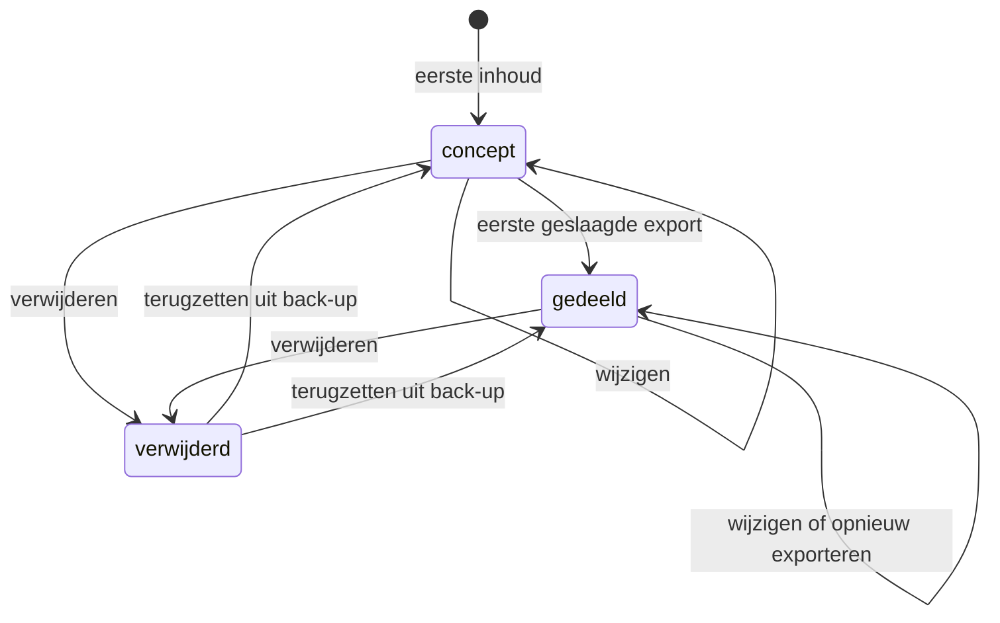

| Van | Naar | Voorwaarde |
|---|---|---|
| — | `concept` | Er is tekst, een foto, een titel of een koppeling (INV-07). |
| `concept` | `gedeeld` | Een export naar PDF of afbeelding is geslaagd en geregistreerd (B-13). |
| `gedeeld` | `gedeeld` | Elke verdere wijziging of export. De status is een feit over het verleden en verandert niet terug. |
| `concept` of `gedeeld` | `verwijderd` | Handeling van de gebruiker; `deletedAt` wordt gezet, niets wordt gewist (INV-02). |
| `verwijderd` | vorige status | Alleen via terugzetten uit een back-up; de status wordt opnieuw berekend uit de exportregistraties. |

Onmogelijke overgangen: van `gedeeld` terug naar `concept`. Wijzigen na een export maakt het gedeelde niet ongedaan; de lijst toont "gedeeld op 14 november, sindsdien gewijzigd". Ook onmogelijk: van niets rechtstreeks naar `gedeeld` (exporteren kan alleen wat bestaat), en van `verwijderd` naar `verwijderd` (een tweede verwijdering doet niets en wijzigt `deletedAt` niet).

#### 9.7.2 MailDraft

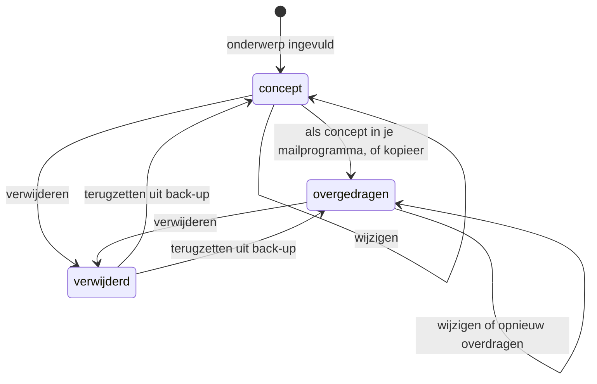

| Van | Naar | Voorwaarde |
|---|---|---|
| — | `concept` | Er is een onderwerp met minstens één zichtbaar teken (INV-34). |
| `concept` | `overgedragen` | Een overdracht naar het mailprogramma of naar het klembord is geslaagd en geregistreerd. |
| `overgedragen` | `overgedragen` | Elke verdere wijziging of overdracht; het scherm toont sinds wanneer het concept gewijzigd is. |
| beide | `verwijderd` | Handeling van de gebruiker. |

Onmogelijke overgangen: van `overgedragen` terug naar `concept`, om dezelfde reden als bij een documentatie. Onmogelijk is ook een toestand `verstuurd`: die bestaat niet en zal niet bestaan, want de app vraagt geen verzendrecht aan (B-20). En het loskoppelen van het postvak verandert de toestand van een concept niet (INV-37).

#### 9.7.3 Photo

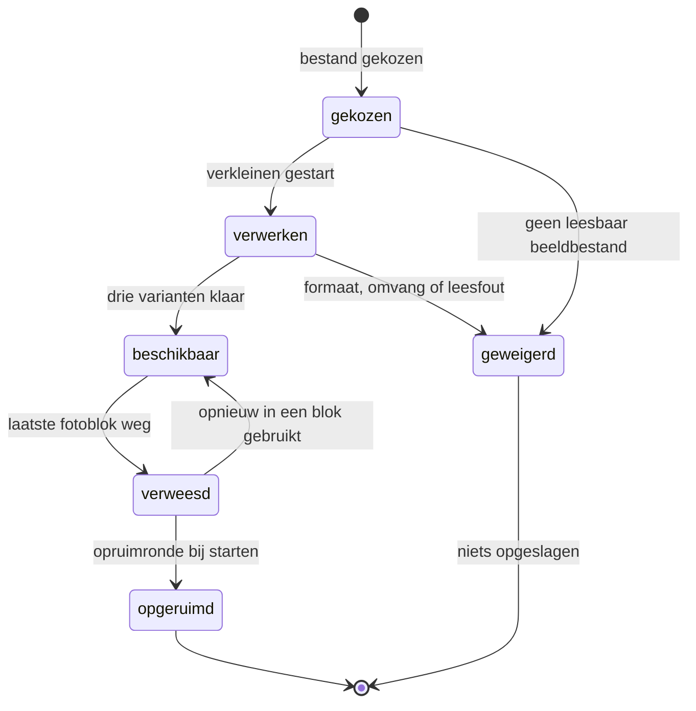

| Van | Naar | Voorwaarde |
|---|---|---|
| `gekozen` | `verwerken` | Het bestand is leesbaar en van een ondersteund type. |
| `verwerken` | `beschikbaar` | Alle drie de varianten zijn geschreven (INV-18). |
| `verwerken` of `gekozen` | `geweigerd` | Onleesbaar, verkeerd type, of de omvang past niet in de beschikbare opslag. |
| `beschikbaar` | `verweesd` | Het laatste `PhotoBlock` dat ernaar verwees is verdwenen (DE-10). |
| `verweesd` | `beschikbaar` | De foto wordt opnieuw in een blok gebruikt vóór de opruimronde. |
| `verweesd` | `opgeruimd` | De opruimronde bij de eerstvolgende start (INV-17). |

Onmogelijke overgangen: van `gekozen` of `verwerken` rechtstreeks naar `beschikbaar` zonder alle drie de varianten. Van `geweigerd` naar welke toestand dan ook: een geweigerd bestand levert geen record op en je kiest hem opnieuw als je het opnieuw wilt proberen. Van `opgeruimd` terug: de blobs zijn weg en alleen een back-up brengt ze terug, en dan als nieuw record.

#### 9.7.4 MailAccount

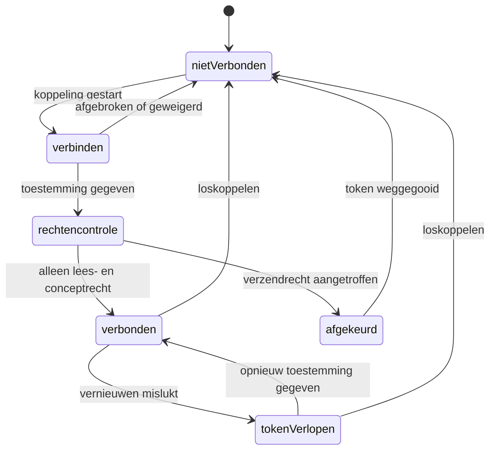

| Van | Naar | Voorwaarde |
|---|---|---|
| `nietVerbonden` | `verbinden` | De gebruiker start de koppeling; OAuth 2.0 met PKCE (T-15). |
| `verbinden` | `rechtencontrole` | De aanbieder heeft toestemming teruggegeven. |
| `rechtencontrole` | `verbonden` | De toegekende rechten bevatten lezen en concept schrijven, en niets anders. |
| `rechtencontrole` | `afgekeurd` | Er zit een verzendrecht bij (INV-35, DE-31). |
| `verbonden` | `tokenVerlopen` | Vernieuwen is mislukt of het token is ingetrokken. |
| elke verbonden toestand | `nietVerbonden` | Loskoppelen; de berichtencache wordt in dezelfde transactie gewist. |

Onmogelijke overgangen: van `verbinden` rechtstreeks naar `verbonden` zonder rechtencontrole. Van `afgekeurd` naar `verbonden`: een afgekeurde koppeling begint helemaal opnieuw, met een nieuw token. En er is geen toestand `mag verzenden`, in geen enkele vorm.

#### 9.7.5 AIRequest

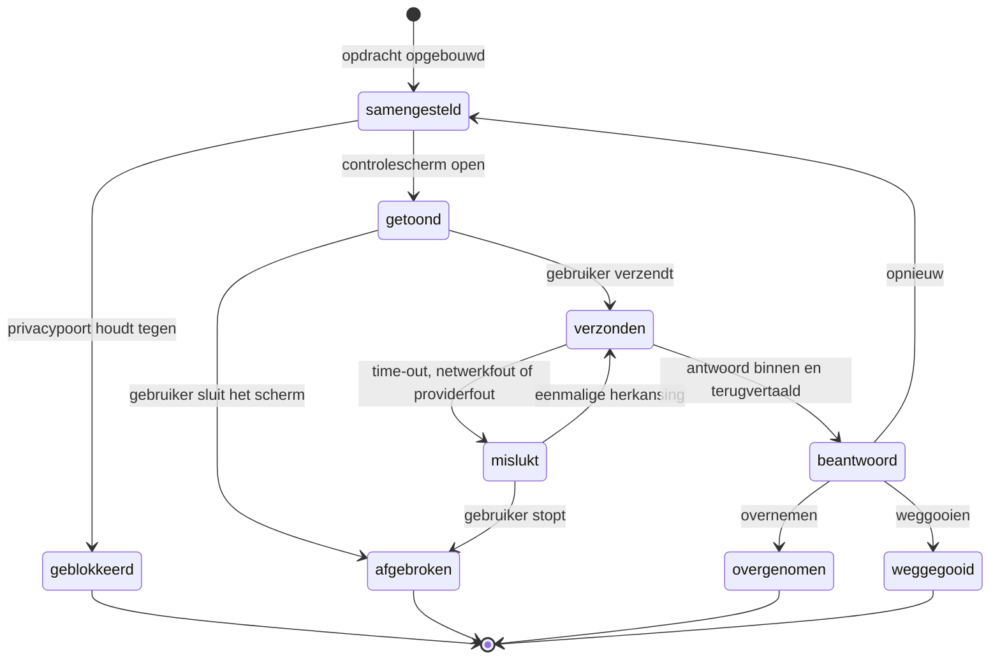

| Van | Naar | Voorwaarde |
|---|---|---|
| — | `samengesteld` | `PrivacyService` en `PromptService` hebben de volledige opdracht opgebouwd. |
| `samengesteld` | `geblokkeerd` | Er is een naam gevonden, er zijn beeldgegevens aangetroffen, of de leerlingenlijst is leeg zonder bevestiging (INV-38, INV-39, INV-42). |
| `samengesteld` | `getoond` | Het controlescherm toont exact wat er verstuurd wordt (INV-43). |
| `getoond` | `verzonden` | Uitdrukkelijke handeling van de gebruiker. Er is geen automatische verzending. |
| `verzonden` | `mislukt` | Time-out, netwerkfout of foutmelding van de provider. |
| `mislukt` | `verzonden` | Eén herkansing, alleen bij een netwerkfout of time-out. |
| `verzonden` | `beantwoord` | Antwoord ontvangen én terugvertaald met kloppende telling (INV-40). |
| `beantwoord` | `overgenomen` | De gebruiker kiest aanvullen of vervangen (B-39). |

Onmogelijke overgangen: van `samengesteld` rechtstreeks naar `verzonden`. Het controlescherm is geen optie die je kunt uitzetten en geen instelling; het staat tussen opbouwen en verzenden in. Ook onmogelijk: van `beantwoord` naar `verzonden` zonder een nieuwe aanroep, van `geblokkeerd` naar `getoond`, en meer dan één herkansing na een mislukking. Een aanroep die op een fout van de provider zelf stuit, wordt niet herhaald.

### 9.8 Afgeleide waarden

Alles in deze paragraaf wordt berekend en nergens opgeslagen. Dat is de praktische invulling van U-02: staat een waarde op twee plekken, dan lopen die twee vroeg of laat uiteen, en dan is er niemand die weet welke van de twee klopt. De prijs is rekenwerk bij het tonen. Die prijs is meetbaar en aanvaardbaar: bij 1.000 documentaties, 20 leerlingen en 5 groepen kost geen enkele berekening hieronder meer dan 30 milliseconden op de referentiemachine uit hoofdstuk 18.

| Waarde | Formule | Berekend in |
|---|---|---|
| Groepen van een documentatie | De expliciet gekoppelde groepen, aangevuld met de groepen waarin een gekoppelde leerling lid was op de datum van de documentatie. Expliciet gaat boven afgeleid; afgeleide groepen worden getoond als suggestie, niet als feit (B-17). | `DocumentationService.groupsOf()` |
| Groep van een leerling op een datum | De groepen waarvoor geldt: `van <= datum` en (`tot` leeg of `tot >= datum`). Nul, één of meer. | `GroupService.groupsAt()` |
| Aantal pagina's | Het aantal `Page`s van de documentatie dat niet verwijderd is. Nooit een teller op de documentatie. | `DocumentationService`, getoond in de lijst en in het exportpaneel |
| Status van een documentatie | `gedeeld` als er minstens één geslaagde exportregistratie is, anders `concept`. Geen veld, een functie (B-13, INV-15). | `DocumentationService.statusOf()` |
| Gewijzigd sinds delen | `updatedAt > tijdstip van de eerste geslaagde export`. Bepaalt de toevoeging "sindsdien gewijzigd" in de lijst. | `DocumentationService` |
| Dagen sinds de laatste back-up | Het aantal hele dagen tussen de opgeslagen back-updatum en vandaag. De datum zelf staat in `localStorage`, want hij is geen persoonsgegeven (T-01). Boven 30 verschijnt de herinnering (B-02). | `BackupService.daysSinceLastBackup()` |
| Leerlingen die lang niet voorkwamen | Per leerling met een lopend lidmaatschap: de datum van de nieuwste documentatie waaraan hij gekoppeld is. Ontbreekt die, of ligt hij meer dan 42 dagen terug, dan komt de leerling in de lijst. Zes weken is een periode tussen twee vakanties. | `StudentService.silentStudents()`, getoond op het dashboard |
| Reeksvolgorde | De documentaties van een reeks, gesorteerd op datum oplopend, bij gelijke datum op `createdAt`. Het volgnummer is de positie in die lijst en staat nergens opgeslagen. | `SeriesService.orderOf()` |
| Reekscontext voor de AI | De laatste drie documentaties in de reeksvolgorde die vóór de huidige liggen, elk ingekort tot de eerste 600 tekens van hun teksblokken, na pseudonimisering. | `SeriesService` levert, `PromptService` gebruikt |
| Aantal foto's van een documentatie | Het aantal unieke `photoId`s in de fotoblokken van alle pagina's. Dezelfde foto twee keer telt één keer. | `DocumentationService` |
| Aantal pagina's in de export | De uitkomst van het plaatsen van alle blokken in de sloten van de gekozen layouts, inclusief de vervolgpagina's die daaruit volgen. Vooraf getoond in het exportpaneel (B-07). | `LayoutService.paginate()` |
| Weergavenaam bij export met initialen | De eerste letter van de weergavenaam, met een punt. Botsen twee leerlingen, dan krijgt de tweede en volgende een oplopend cijfer: K., K2., K3. De legenda onder de export toont de toewijzing (B-40). | `RenderService` |
| Huidig schooljaar | Het schooljaar waarvan de periode de datum van vandaag bevat. Valt vandaag in geen enkel schooljaar, dan het eerstvolgende. | `AgendaService.currentSchoolYear()` |
| Standaardweergave van de agenda | Jaarweergave op de laptop tussen 1 juli en 15 september, daarbuiten de week (B-31). Op de telefoon altijd de lijst. | `AgendaService`, gelezen door het agendascherm |
| Werkdag of vrije dag | Een dag is vrij als hij in een vakantieperiode valt, met de aanpassing van de school erop toegepast, of als er een agenda-item van het type studiedag of margedag op staat. | `HolidayService.isFreeDay()` |
| Wat er op een dag staat | De weekonderdelen van de basisweek die op die datum gold, met dezelfde weekdag, minus wat een aangepaste dag onderdrukt of vervangt. Is de dag vrij volgens `isFreeDay()`, dan levert de basisweek niets (FR-AGE-30). De begin- en eindtijd worden bij het tekenen omgerekend uit de kalenderdag plus de wandkloktijd; alleen daar vindt zomertijdconversie plaats. | `AgendaService.dayOf()` |
| Verjaardagen in een periode | De leerlingen met een geboortedag en -maand die in de getoonde periode vallen. Er staat geen verjaardagsitem in de opslag (FR-AGE-05). | `AgendaService` |
| Opslaggebruik | De som van de omvang van alle blobs plus een schatting voor de records, gedeeld door de beschikbare ruimte die de browser opgeeft. Boven 0,8 volgt DE-37. | `StorageService.usage()` |
| Zoekindex | Opgebouwd uit titel, tekstblokken, citaten, reeksnaam en de namen van gekoppelde leerlingen (B-32), met trigrammen als terugval bij typefouten (T-16). Volledig in het geheugen, herbouwd bij elke start. | `SearchService` |
| Leeftijd van de berichtencache | Het aantal dagen sinds `fetchedAt` van een gecachet bericht. Boven 7 wordt het bericht verwijderd (INV-36). | `MailService` |
| Aantal openstaande mailconcepten | Het aantal `MailDraft`s met status `concept` dat niet verwijderd is. | `MailService`, getoond op het dashboard |

Twee waarden staan hier bewust niet bij, hoewel je ze zou kunnen berekenen. Het aantal documentaties per leerling wordt niet getoond, want dat leest als een prestatiemaat over een kind. En de gemiddelde tijd tussen documentaties per groep wordt niet getoond, want dat leest als een prestatiemaat over een collega. Beide zijn technisch triviaal en pedagogisch verkeerd.

### 9.9 Ubiquitaire taal

Dit is het woordenboek waar de schermen, de code, de tests en de rest van dit document zich aan houden. De linkerkolom is wat de gebruiker leest. De middelste is wat er in de code staat. De rechterkolom is wat nergens voorkomt: niet in een variabelenaam, niet in een schermtekst, niet in een commentaarregel, niet in een gesprek. Een verboden alternatief is niet fout omdat het lelijk is, maar omdat het een tweede naam is voor iets wat al een naam heeft.

| Schermtaal | Code | Verboden alternatief |
|---|---|---|
| Documentatie | `Documentation` | observatie, verslag, rapport, `Doc`, `Post` |
| Pagina | `Page` | vel, blad, `Sheet`, `Slide` |
| Blok | `Block` | element, component, veld, `Item` |
| Tekstblok | `TextBlock` | alinea, paragraaf, `Paragraph` |
| Fotoblok | `PhotoBlock` | afbeeldingsveld, `Image`, `ImageBlock` |
| Citaat | `QuoteBlock` | uitspraak, `Quote` los, `Testimonial` |
| Kop | `HeadingBlock` | titelveld, `Header`, `Title` |
| Foto | `Photo` | afbeelding, plaatje, `Image`, `Picture`, `Media` |
| Fotoformaat | `PhotoVariant` | resolutie, `Size`, `Rendition` |
| Layout | `layoutId` | template, sjabloon, opmaakprofiel, `Theme` |
| Slot | `slot` | vak, cel, plaatshouder, `Placeholder` |
| Vervolgpagina | layout `E-vervolg` | overloop, doorloop, `Spillover` |
| Reeks | `Series` | project, thema, map, `Collection`, `Album`, `Tag` |
| Leerling | `Student` | kind in code, `Pupil`, `Child`, `Kid` |
| Kind | `Student` met taalinstelling `opvang` | een tweede entiteit, `Toddler` |
| Groep | `Group` | klas, `Class`, `Classroom` |
| Groepslidmaatschap | `GroupMembership` | koppeling, inschrijving, `groupId` op `Student` |
| Groepstype | `groupType` | soort klas, categorie |
| Schooljaar | `SchoolYear` | jaar, cursusjaar, `Year` |
| Vakantie | `HolidayPeriod` | vrije week, `Vacation`, `Recess` |
| Aangepaste vakantie | `HolidayOverride` | eigen vakantie, uitzondering, `CustomHoliday` |
| Agenda-item | `CalendarEvent` | afspraak, activiteit, `Event` los, `Appointment` |
| Basisweek | `WeekPattern` | rooster, basisrooster, lesrooster, weekschema, dagritme, `Schedule`, `Timetable` |
| Weekonderdeel | `WeekPatternLine` | les, lesuur, lesblok, dagdeel, `Lesson` |
| Aangepaste dag | `WeekPatternOverride` | uitzondering, afwijking, losgemaakt item, `Exception` |
| Studiedag | `CalendarEvent` met type `studiedag` | vrije dag, `PD-day` |
| Postvak | `MailAccount` | inbox, account, `Mailbox` |
| Mailbericht | `MailMessage` | mailtje, bericht, `Email` |
| Mailconcept | `MailDraft` | antwoord, concept-mail, `Draft` los, `Reply` |
| Onderwerp | `subject` | titel, kop, `Header` |
| Sjabloon | `MailTemplate` | template, standaardmail, `Snippet` |
| Privacyterm | `PrivacyTerm` | filterwoord, blokkeerwoord, `Blocklist` |
| Pseudoniem | `PseudonymMap` | anonimisering, masker, `Hash`, `Token` |
| Stijlprofiel | `StyleProfile` | model, getraind model, persona, `Fine-tune` |
| Stijlvoorbeeld | `StyleExample` | prompt, voorbeeldprompt, `Few-shot`, `Shot` |
| AI-aanroep | `AIRequest` | prompt, `Call`, `Query`, `Completion` |
| AI-gesprek | `AIInteraction` | chat, sessie, `Conversation`, `Thread` |
| Terugkoppeling | `Feedback` | beoordeling, score, duim, `Rating` |
| Instellingen | `Settings` | voorkeuren, `Config`, `Preferences`, `Options` |
| Logboek | `AuditEvent` | audit trail, geschiedenis, `Log` |
| Wijzigingslijst | `ChangeLogEntry` | versiegeschiedenis, `History`, `Revision` |
| Back-up | `ExportBundle` | export, dump, archief, `Snapshot` |
| Toegangscode | `accessCode` | wachtwoord, pincode, licentie, `Token`, `ApiKey` |
| Schrijfmodus | `writingMode` | editor, handmatige modus, `Manual` |
| Gespreksmodus | `conversationMode` | chat, dialoog, wizard, `Interview` |
| Laat AI meeschrijven | `requestSuggestion` | genereren, schrijf voor mij, `Generate`, `Autowrite` |
| Overnemen | `acceptSuggestion` | accepteren, toepassen, invoegen, `Apply`, `Insert` |
| Opnieuw | `retrySuggestion` | herkansing, `Regenerate`, `Reroll` |
| Weggooien | `discardSuggestion` | annuleren, verwijderen, `Cancel`, `Reject` |
| Bekijk wat er verstuurd wordt | `previewOutgoingRequest` | preview prompt, debugweergave, `Inspect` |
| Print-PDF | `printPdf` | afdruk, `Export PDF`, `Download` |
| Deelbare afbeelding | `shareableImage` | JPG, plaatje, `Social image`, `Card` |
| Concept | `draft` | klad, onafgerond, nieuw, `Unfinished` |
| Gedeeld | `shared` | afgerond, klaar, definitief, `Done`, `Published` |
| Als concept in je mailprogramma | `handOffDraft` | versturen, verzenden, mailen, `Send` |
| Kopieer | `copyToClipboard` | delen, plakken, `Share` in deze betekenis |
| Back-up maken | `createBackup` | exporteren, opslaan als, `Export all` |
| Terugzetten | `restoreBackup` | importeren, herstellen, `Import`, `Recover` |
| Samenvoegen | `mergeRestore` | bijwerken, `Sync`, `Update` |
| Vervangen | `replaceRestore` | overschrijven, `Overwrite`, `Reset` |

Twee woorden verdienen aparte aandacht omdat ze in bijna elk vergelijkbaar product wél voorkomen. **Versturen** komt in EduFlow nergens voor, in geen enkel scherm en in geen enkele functienaam, want de handeling bestaat niet (B-19, B-20). En **anonimiseren** komt nergens voor, want dat is niet wat er gebeurt: er wordt gepseudonimiseerd, en het verschil is juridisch beslissend (zie hoofdstuk 15).

### 9.10 Wat bewust buiten het domein blijft

Zeven begrippen liggen dicht tegen dit domein aan, zijn technisch eenvoudig toe te voegen, en horen er niet in. Ze staan hier opgeschreven zodat de vraag "waarom zit dat er eigenlijk niet in" één keer beantwoord is en niet elk kwartaal opnieuw gesteld hoeft te worden. Bij elk begrip staat ook wat er zou moeten gebeuren voordat het er ooit in mag. Dat is geen belofte dat het ooit gebeurt; het is de drempel.

**Beoordeling.** Een cijfer, een score, een oordeel over hoe goed iets ging. EduFlow beoordeelt niet (B-25). De reden is deels juridisch: het beoordelen van leerresultaten is in bijlage III van de AI-verordening een hoog-risicotoepassing, met alle verplichtingen van dien (zie hoofdstuk 15). De reden is vooral inhoudelijk: pedagogische documentatie beschrijft wat een kind deed, en zodra er een oordeel bij staat leest de ouder alleen nog het oordeel. Voorwaarde vooraf: een volledige conformiteitsbeoordeling als hoog-risicosysteem, een FRIA langs het SIVON-kader, en een aanbieder die de verantwoordelijkheid daarvoor draagt. Dat is geen uitbreiding maar een ander product.

**Niveau.** Waar een kind staat ten opzichte van een norm: A tot E, hoog en laag, boven en onder het gemiddelde. Het bepalen van onderwijsniveau is eveneens hoog risico. Bovendien is een niveau alleen betekenisvol binnen een genormeerd instrument, en EduFlow heeft er geen. Een niveau dat uit vrije tekst wordt afgeleid is een gok met een cijfer erachter. Voorwaarde vooraf: dezelfde als bij beoordeling, plus een genormeerd instrument met een verantwoording van de normering.

**Voortgang.** De ontwikkeling over de tijd, als lijn of als percentage. Dit is de meest verleidelijke van de zeven, omdat de gegevens er al liggen: documentaties hebben datums en zijn aan leerlingen gekoppeld. Precies daarom staat het er niet. Een grafiek van documentaties over de tijd meet niet de ontwikkeling van het kind maar de schrijfactiviteit van de leerkracht, en iedereen die hem ziet leest hem als het eerste. De lijst "leerlingen die lang niet voorkwamen" (§9.8) is bewust het maximum: hij zegt iets over jouw aandacht, niet over het kind. Voorwaarde vooraf: een onderbouwd model van wat je meet, getoetst door iemand die geen belang heeft bij de uitkomst.

**Doelen.** Wat een kind moet bereiken, met een deadline. Doelen zijn geen documentatie maar planning, en ze veranderen de aard van het schrijven: zodra er een doel bij staat, schrijf je naar het doel toe in plaats van op te schrijven wat er gebeurde. Dat is precies het verschil tussen pedagogische documentatie en een handelingsplan, en dat verschil is de bestaansreden van dit product. Voorwaarde vooraf: een aantoonbare vraag uit de praktijk die niet met een agenda-item en een documentatie op te lossen is.

**Leerlijnen.** De vaste opeenvolging van tussendoelen per vakgebied. Leerlijnen horen bij een methode of een leerlingvolgsysteem, en die zijn er al. Ze inbouwen betekent ze bijhouden: per methode, per versie, per herziening van het curriculum. Dat is een redactionele last die niet bij een product van één maker past. Voorwaarde vooraf: een officiële programmeerkoppeling met een leerlijnenbron die de actualiteit garandeert, plus een partij die de redactie draagt.

**Aanwezigheid.** Wie er is en wie er niet is. Aanwezigheid is administratie met een wettelijke grondslag en een wettelijke bewaartermijn, en die administratie voert de school al ergens anders. Een tweede plek waar aanwezigheid staat is per definitie een tweede waarheid, en bij verzuim is dat geen ongemak maar een risico. Voorwaarde vooraf: een koppeling die leest uit de bestaande administratie in plaats van ernaast te schrijven, en een verwerkersovereenkomst die dat dekt.

**Incidenten.** Wat er misging: een ruzie, een ongeluk, een melding. Incidentregistratie kent eigen bewaartermijnen, eigen toegangsrechten en eigen meldplichten, en de gegevens erin zijn gevoeliger dan al het andere in de app. Ze in dezelfde opslag zetten als foto's van een knutselmiddag betekent dat de zwaarste eisen op alles gaan gelden. Bovendien: een incident hoort niet in een AI-aanroep, ook niet gepseudonimiseerd. Voorwaarde vooraf: een gescheiden opslag met eigen toegangsbeheer, een eigen bewaarregime, en een uitdrukkelijk akkoord van de functionaris gegevensbescherming voor dat aparte deel.

De rode draad door de zeven is één zin: **EduFlow beschrijft, hij oordeelt niet.** Zodra een begrip een oordeel, een norm of een verplichting in het domein binnenbrengt, verandert het product van karakter, van risicoklasse en van doelgroep. Dat kan een goed besluit zijn, maar het is dan een besluit over een ander product, en het hoort met die woorden genomen te worden.

---

## 10. Service-architectuur

### 10.1 De vorm van het systeem

EduFlow heeft drie lagen en één regel die ze uit elkaar houdt.

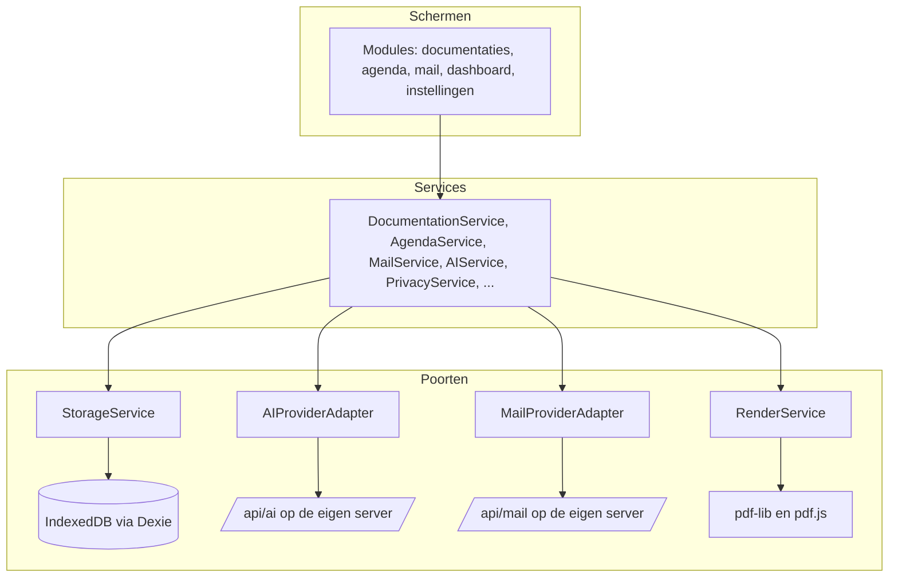

De regel: **een scherm bevat geen regel die twee keer waar moet zijn.** Een scherm mag weten hoe iets eruitziet en wanneer iets zichtbaar is. Het mag niet weten wanneer een documentatie de status `gedeeld` krijgt, hoeveel eerdere delen van een reeks meegaan naar de AI, of hoe een naam wordt vervangen. Dat is U-03, en het is de belangrijkste architectuurregel van dit document.

De omgekeerde regel geldt ook: **een service weet niets van React.** Geen enkele service importeert een hook, een component of iets uit `next/`. Ze zijn te draaien in Vitest zonder browser en zonder scherm. Dat is niet netheid maar de voorwaarde om ze te kunnen toetsen.

### 10.2 Mappenstructuur

Dit lost B11v uit de review op: services stonden zowel op topniveau als in elke module, en voor `DocumentationService` en `AgendaService` — die het dashboard óók nodig heeft — was er geen regel. Het besluit is B-48: **services staan op topniveau, modules bevatten alleen schermen.**

```
src/
  app/                        Next.js App Router: routes en route handlers
    (app)/
      dashboard/page.tsx
      documentaties/…
      agenda/…
      mail/…
      instellingen/…
    api/
      ai/route.ts
      mail/[...path]/route.ts
      health/route.ts
  modules/                    alleen schermen en schermcomponenten
    documentaties/
      DocumentationList.tsx
      DocumentationEditor.tsx
      ConversationMode.tsx
      ExportPanel.tsx
      hooks/useDocumentationEditor.ts
    agenda/
    mail/
    dashboard/
    instellingen/
  services/                   alle regels, geen React
    storage/StorageService.ts
    documentation/DocumentationService.ts
    documentation/PageService.ts
    documentation/LayoutService.ts
    render/RenderService.ts
    photo/PhotoService.ts
    agenda/AgendaService.ts
    agenda/HolidayService.ts
    mail/MailService.ts
    ai/AIService.ts
    ai/PromptService.ts
    privacy/PrivacyService.ts
    style/StyleService.ts
    feedback/FeedbackService.ts
    search/SearchService.ts
    backup/BackupService.ts
    settings/SettingsService.ts
    audit/AuditService.ts
    sync/SyncService.ts        interface plus een lege implementatie
  domain/                      typen, schema's, invarianten, gebeurtenissen
    types/…
    schemas/…
    events/…
  ui/                          ontwerpsysteem uit hoofdstuk 5
    Button.tsx, Field.tsx, Panel.tsx, …
    tokens.css
  lib/                         gereedschap zonder domeinkennis
    uuid.ts, dates.ts, text.ts, result.ts
  data/
    schoolvakanties.json
```

**De importregels, afdwingbaar met een lintregel (DR-11):**

| Van | Mag importeren uit |
|---|---|
| `modules/` | `services/`, `domain/`, `ui/`, `lib/` |
| `services/` | `domain/`, `lib/`, andere `services/` |
| `domain/` | `lib/` |
| `ui/` | `lib/` |
| `lib/` | niets uit dit project |

`modules/` importeert nooit uit een andere `modules/`-map. Heeft het dashboard iets van documentaties nodig, dan komt dat uit `DocumentationService`, niet uit `modules/documentaties/`.

### 10.3 Het patroon van een service

Elke service is een object met functies, geen klasse en geen singleton met verborgen toestand. Afhankelijkheden komen binnen bij het maken, zodat een test een andere opslag of een andere provider kan meegeven.

```typescript
export function createDocumentationService(deps: {
  storage: StorageService;
  layout: LayoutService;
  photos: PhotoService;
  events: EventBus;
  clock: Clock;
}) {
  async function create(input: NewDocumentation): Promise<Result<Documentation>> { … }
  async function addPhoto(id: Uuid, file: File): Promise<Result<Photo>> { … }
  async function markExported(id: Uuid): Promise<Result<Documentation>> { … }
  return { create, addPhoto, markExported, … };
}

export type DocumentationService = ReturnType<typeof createDocumentationService>;
```

`clock` staat er niet voor de sier: zonder injecteerbare klok is "een documentatie mag hoogstens zeven dagen in de toekomst liggen" (B-70) niet te toetsen zonder de systeemtijd te verzetten.

**Fouten zijn waarden, geen uitzonderingen.** Elke service geeft een `Result` terug:

```typescript
type Result<T> =
  | { ok: true; value: T }
  | { ok: false; error: AppError };

interface AppError {
  code: ErrorCode;              // "STORAGE_FULL", "AI_UNREACHABLE", "PRIVACY_GATE", …
  message: string;              // Nederlandse tekst voor de gebruiker
  detail?: string;              // technisch, alleen voor het logboek
  recoverable: boolean;
  action?: { label: string; kind: "retry" | "navigate" | "dismiss"; target?: string };
}
```

Dat `message` in het Nederlands staat en niet in het Engels, is bewust: er is precies één plek waar een fouttekst wordt bedacht, en dat is de service die de fout kent. Een scherm dat foutcodes vertaalt is een tweede plek waar dezelfde kennis staat (U-03). De teksten volgen de regels uit §4.7.

### 10.4 De diensten, één voor één

| Service | Verantwoordelijk voor | Kent niet |
|---|---|---|
| `StorageService` | lezen, schrijven, transacties, migraties, grafstenen, `rev` en `origin`, `changeLog` | wat een documentatie betekent |
| `DocumentationService` | levenscyclus, koppelingen, status, archiveren, dupliceren | opmaak, opslagdetails |
| `PageService` | pagina's aanmaken, ordenen, vervolgpagina's, blokken plaatsen | hoe een pagina eruitziet in millimeters |
| `LayoutService` | layoutdefinities, sloten, overloopberekening | hoe je tekent |
| `RenderService` | PDF genereren, rasteren naar JPEG, voorbeeld op het scherm | wanneer je exporteert |
| `PhotoService` | inlezen, EXIF strippen, verkleinen naar drie varianten, hash, `refCount`, opruimen | waar een foto in een pagina staat |
| `SeriesService` | reeksen, volgorde, context voor de vervolgzin | AI |
| `StudentService` | leerlingen, dubbele voornamen, samenvoegen, uit dienst | groepen |
| `GroupService` | groepen, lidmaatschappen, overlapcontrole, jaarovergang | documentaties |
| `AgendaService` | items, weergaven, de basisweek, ICS | vakantiegegevens, behalve de vraag `isFreeDay()` aan `HolidayService` |
| `HolidayService` | vakantiebestand, regio's, overrides, verlooptermijn | agenda-items |
| `MailService` | postbus, cache, concepten, overdracht | hoe een mail geschreven wordt |
| `AIService` | aanroepen, streaming, nieuwe pogingen, budget, logboek | wat er in de opdracht staat |
| `PromptService` | opdrachten samenstellen uit instructie, stijl, voorbeelden, context | netwerk |
| `PrivacyService` | pseudonimiseren, terugvertalen, detectoren, de poort bij een lege lijst | AI |
| `StyleService` | kenmerken meten, voorbeelden kiezen, correctieregels voorstellen | opdrachten samenstellen |
| `FeedbackService` | uitkomsten vastleggen, overeenkomst berekenen, signalen bundelen | stijl aanpassen |
| `SearchService` | index bouwen en doorzoeken, filters combineren | wat een treffer betekent |
| `BackupService` | bundelen, versleutelen, terugzetten, samenvoegen | wat er in een tabel staat |
| `SettingsService` | instellingen lezen en schrijven, verdeling over IndexedDB en `localStorage` | wie ze gebruikt |
| `AuditService` | verantwoordingswaardige handelingen vastleggen | de rest |
| `SyncService` | niets, in versie 1.0 | — |

**Waarom `PromptService` los staat van `AIService`.** Omdat het samenstellen van een opdracht de plek is waar bijna alle kwaliteit zit, en de plek waar de gouden testset op aangrijpt (§12.9). Zit dat verweven met netwerkcode, dan is het niet te toetsen zonder een provider aan te roepen. Nu draait de hele testset zonder netwerk: hij vergelijkt de samengestelde opdracht met de verwachte opdracht, en pas de kleine laatste stap gaat echt naar buiten.

**Waarom `LayoutService` los staat van `RenderService`.** Omdat layout data is en tekenen code (B-26). `LayoutService` beantwoordt "past dit, en waar komt het" met getallen. `RenderService` beantwoordt "hoe ziet dat eruit" op twee doelen: een canvas op het scherm en een PDF. Twee renderers, één bron. Zonder die scheiding krijg je twee layoutimplementaties die uit de pas lopen, precies wat U-03 verbiedt.

### 10.5 Samenwerking tussen services

Services roepen elkaar rechtstreeks aan waar de afhankelijkheid vast is, en gebruiken gebeurtenissen waar hij dat niet is.

**Rechtstreeks** als de ene service de andere nodig heeft om zijn werk af te maken. `DocumentationService.addPhoto()` roept `PhotoService.ingest()` aan; zonder foto is er niets toe te voegen.

**Via gebeurtenissen** als iets anders wíl weten dat er iets gebeurd is, maar de handeling zonder die ander gewoon slaagt. `DocumentationService` weet niet dat `SearchService` de index wil bijwerken, dat `StyleService` een tekst wil meten, en dat `AuditService` iets wil vastleggen. Het stuurt `DocumentationContentChanged` en gaat verder.

```typescript
interface EventBus {
  publish<E extends DomainEvent>(event: E): void;
  subscribe<K extends DomainEventKind>(kind: K, handler: (e: DomainEventOf<K>) => void): () => void;
}
```

De bus is synchroon en in het geheugen; er is geen wachtrij, geen herhaling en geen volgorde-garantie tussen abonnees. Een abonnee die faalt, faalt alleen voor zichzelf en logt dat; de publicerende service merkt er niets van. Dat is precies de bedoeling: het bijwerken van de zoekindex mag nooit een documentatie kunnen laten mislukken.

De gebeurtenissen zelf staan in §9.6.

### 10.6 De serverkant

Er draaien precies drie route handlers. Elke andere functionaliteit draait in de browser.

**`POST /api/ai`.** De reden dat deze bestaat is de sleutel: een AI-sleutel in de browser is een sleutel die iedereen heeft. De handler:

1. Controleert de toegangscode-cookie (T-05).
2. Past de snelheidslimiet toe per toegangscode én per IP-adres, met een dagbudget (T-17).
3. Valideert het verzoek met Zod: taak, opdracht, provider, maximale lengte.
4. **Weigert elk verzoek waarin een beeldgegeven zit** — geen `image`-veld, geen base64-blok, geen bijlage. Dit is een controle op de server en niet alleen in de browser, want een grens die alleen in de browser bestaat, is geen grens.
5. Roept de provider aan met de sleutel uit de omgeving, en streamt het antwoord terug.
6. Legt tellingen vast: taak, provider, aantal tekens, duur. Geen inhoud.

**`GET|POST /api/mail/[...path]`.** Een doorgeefluik naar Microsoft Graph of Gmail. Bestaat om drie redenen: de tokens mogen niet in de browser (T-15), de autorisatiecode moet met een geheim worden ingewisseld, en er is één plek nodig die afdwingt dat er nooit een verzendaanroep vertrekt. De handler heeft een lijst met toegestane paden; alles wat er niet op staat, wordt geweigerd. `/sendMail` en `/messages/send` staan er niet op en kunnen er niet op komen zonder dat iemand die lijst wijzigt (B-20).

**`GET /api/health`.** Antwoordt met de versie, de gekozen standaardprovider en de regio. Geen gegevens.

**Wat er niet op de server staat:** geen documentaties, geen foto's, geen leerlingen, geen concepten, geen zoekindex, geen sessies met inhoud. De server is een sluis, geen opslag. Dat is de zin die in het gesprek met de functionaris gegevensbescherming het meeste werk doet (hoofdstuk 15).

### 10.7 Transacties en autosave

Alle schrijfacties die meer dan één record raken, lopen in één Dexie-transactie. Een documentatie met drie pagina's opslaan is één transactie; slaagt hij half, dan slaagt hij niet.

Autosave (T-09, C10 uit de review):

1. Bij elke wijziging wordt de schermtoestand bijgewerkt en een timer van 1.000 ms opnieuw gestart.
2. Loopt de timer af, dan schrijft `DocumentationService.save()` in één transactie.
3. Bij `visibilitychange` naar verborgen en bij `pagehide` wordt onmiddellijk geschreven, zonder te wachten.
4. Mislukt de schrijfactie door ruimtegebrek, dan blijft de toestand in het geheugen, blijft het scherm bewerkbaar, en probeert de app elke tien seconden opnieuw (F-24.E2).
5. De opslagindicator kent drie standen: "Opgeslagen", "Wijzigingen worden bewaard", "Niet opgeslagen — er is een probleem". Nooit een draaiend rondje zonder tekst.

**Ongedaan maken** (T-07, B-39) kent twee vormen, en het verschil zit in wat er op het spel staat.

Gewone bewerkingen — typen, herordenen, een foto verwijderen — hebben een stapel in het geheugen van hoogstens vijftig stappen, per documentatie, per sessie. Die overleeft een herlaadactie niet, en dat is een bewuste beperking: een volledige ongedaan-maken-geschiedenis die de opslag in gaat, is een tweede geschiedenis naast `changeLog`.

**Het terugdraaien van een AI-bewerking is de uitzondering en wordt wél bewaard** (T-43). Vóór **Overnemen** legt `DocumentationService` de vorige inhoud vast in `aiUndoSnapshot` op de documentatie: één stap, met de vorige tekst, het tijdstip en de gebruikte opdracht. Die momentopname overleeft een herlaadactie en het sluiten van het tabblad. De reden is U-10: een AI-bewerking is de enige handeling waarbij een machine je woorden vervangt, en dan is "je had het tabblad niet moeten sluiten" geen aanvaardbaar antwoord.

`changeLog` speelt hierin geen rol. Die tabel bevat uitsluitend `table`, `recordId`, `rev`, `op`, `at` en `origin` en **nooit veldwaarden** (§8.3.13); hij kan een tekst dus niet teruggeven.

### 10.8 Gelijktijdigheid en twee tabbladen

Twee tabbladen met dezelfde documentatie is een reëel geval (F-04, B11c). De afspraak:

- Elk tabblad neemt bij het openen van een documentatie een lichte claim via `BroadcastChannel`.
- Ziet het tweede tabblad een bestaande claim, dan opent het in leesstand met de balk "Deze documentatie is elders geopend" en de knop "Toch bewerken".
- Wordt er toch in beide bewerkt, dan wint bij het opslaan de hoogste `rev`; het verliezende tabblad krijgt "Dit is elders gewijzigd. Vernieuwen." en verliest niets, want zijn tekst staat nog op het scherm.
- Er is geen samenvoeging op tekenniveau. Dat hoort bij samenwerken, en samenwerken is fase 2 (§7.27).

### 10.9 Beschikbaarheid en offline

De app werkt volledig offline behalve AI en mail (B-47). Dat wordt zichtbaar gemaakt en niet verzwegen — de review wees terecht op de slordige formulering in doc 03 (B11u).

| Onderdeel | Offline |
|---|---|
| Documentaties schrijven, foto's, pagina's | ja |
| Exporteren naar PDF en afbeelding | ja |
| Agenda, vakanties, ICS-export | ja |
| Zoeken | ja |
| Back-up en terugzetten | ja |
| Instellingen | ja |
| Laat AI meeschrijven, titelvoorstel, vervolgzin, gespreksmodus afronden | nee |
| Postvak, samenvatten, concept overdragen | nee |

Er is een servicewerker, maar hij doet één ding: de app-schil en de statische bestanden in de cache zetten zodat de app zonder netwerk start. Hij cachet geen gegevens en onderschept geen `/api`-verzoeken; die falen gewoon en `AIService` vertaalt dat naar de melding uit §4.7.

Bij verlies van netwerk verandert de AI-knop van "Laat AI meeschrijven" in "Laat AI meeschrijven (geen internet)" en is hij uitgeschakeld met een verklarende hulptekst. Niets anders in het scherm verandert.

### 10.10 Toetsbaarheid als architectuureis

De indeling hierboven is niet gekozen om netjes te zijn maar om drie vragen beantwoordbaar te maken zonder browser en zonder netwerk:

1. **Vervangt `PrivacyService` alle namen?** `PrivacyService` krijgt een lijst en een tekst, en geeft een tekst en een afbeelding terug. De testset uit C2 draait in milliseconden.
2. **Klopt de opdracht die weggaat?** `PromptService` krijgt toestand en geeft een tekenreeks. De gouden testset vergelijkt die met de verwachte opdracht.
3. **Past de inhoud op de pagina?** `LayoutService` krijgt blokken en een layout, en geeft een paginaverdeling. Geen canvas nodig.

Elke service die deze eigenschap verliest — die een `window`, een `document` of een netwerkaanroep nodig heeft om zijn regel uit te voeren — is verkeerd ingedeeld. Dat is de toets bij elke uitbreiding (DR-12).

---

## 11. UI-architectuur

### 11.1 Renderstrategie

EduFlow is een clienttoepassing met een dunne serverschil. Concreet:

- De routes onder `app/(app)/` zijn serveronderdelen die niets doen behalve de schil en de metagegevens leveren.
- Alles wat gegevens toont, is een cliëntonderdeel. Dat kan niet anders: de gegevens staan in IndexedDB en die bestaat alleen in de browser.
- Er is geen serverweergave van gebruikersgegevens, geen serveractie die gegevens schrijft, en geen datalaag op de server. De route handlers uit §10.6 zijn de enige serverlogica.

Dat is een bewuste beperking van het framework: Next.js wordt hier gebruikt voor de routering, de bundeling en de route handlers, niet voor het weergeven op de server. Wie later toch serverweergave wil, moet eerst de server een bron van waarheid maken, en dat is fase 2 (§8.10).

### 11.2 Toestand: vier soorten, vier plekken

De veelgemaakte fout is alles in één store stoppen. Er zijn vier soorten toestand en ze horen niet bij elkaar.

| Soort | Voorbeeld | Waar hij hoort | Waarom |
|---|---|---|---|
| Servergegevens | documentaties, agenda-items | `useLiveQuery` op Dexie via de service | de opslag is de bron; een kopie in een store is een tweede waarheid (U-02) |
| Schermtoestand | geopende panelen, geselecteerde pagina, filters | Zustand, per module | verdwijnt bij herladen en dat is goed |
| Formuliertoestand | het tekstvlak terwijl je typt | lokale component-toestand | moet zo dicht mogelijk bij de toetsaanslag zitten |
| URL-toestand | welke documentatie, welke weergave, welke datum | de route | deelbaar, terug-knop werkt |

`useLiveQuery` van Dexie is hier het gereedschap dat het meeste werk uit handen neemt: een component dat een documentatie toont, wordt automatisch opnieuw getekend als die documentatie in IndexedDB verandert, ook als de wijziging uit een ander tabblad kwam. Er is geen handmatige ongeldigverklaring en geen cache die kan verlopen.

**De regel:** een component vraagt gegevens op via een hook die een service aanroept. Nooit rechtstreeks via Dexie (DR-13).

```typescript
export function useDocumentation(id: Uuid) {
  const svc = useServices().documentation;
  return useLiveQuery(() => svc.get(id), [id]);
}
```

### 11.3 De schil

| Breekpunt | Navigatie | Inhoud |
|---|---|---|
| ≥ 1280 px | vaste zijbalk 240 px met vijf bestemmingen en labels | tot 1200 px inhoudsbreedte, gecentreerd |
| 1024-1279 px | zijbalk 64 px, alleen iconen met toegankelijke naam | volle breedte min zijbalk |
| 768-1023 px | zijbalk ingeklapt, uitschuifbaar | volle breedte |
| < 768 px | onderbalk met vijf bestemmingen | volle breedte |

Er is geen hamburgermenu, op geen enkel breekpunt. Dat is de UX-regel uit §4.2 en het is de reden dat er precies vijf bestemmingen zijn: meer past niet in een onderbalk, en dat is een gezonde beperking.

De onderbalk op de telefoon is 56 px hoog plus de veilige zone van het apparaat. Hij verdwijnt niet bij het schuiven; verdwijnende navigatie kost meer aandacht dan hij ruimte oplevert.

### 11.4 Schermenregister

| ID | Scherm | Route | Module |
|---|---|---|---|
| S-01 | Dashboard | `/` | DAS |
| S-02 | Overzicht documentaties | `/documentaties` | DOC |
| S-03 | Schrijfscherm | `/documentaties/[id]` | DOC |
| S-04 | Gespreksmodus | `/documentaties/[id]/gesprek` | DOC |
| S-05 | Reeksweergave | `/documentaties/reeks/[id]` | DOC |
| S-06 | Prullenbak | `/documentaties/prullenbak` | DOC |
| S-07 | Agenda | `/agenda` | AGE |
| S-08 | Postvak | `/mail` | MAI |
| S-09 | Bericht | `/mail/[id]` | MAI |
| S-10 | Mailconcept | `/mail/concept/[id]` | MAI |
| S-11 | Instellingen | `/instellingen/[sectie]` | INS |
| S-12 | Eerste keer | `/welkom` | INS |
| S-13 | Toegangscode | `/toegang` | — |

Panelen zijn geen schermen en hebben geen route, met één uitzondering: het exportpaneel krijgt `?export=1` in de URL zodat de terug-knop hem sluit in plaats van het scherm te verlaten. Dat geldt ook voor het controlescherm (`?controle=1`).

| Paneel | Waar | Sluit met |
|---|---|---|
| Exportpaneel | S-03 | Esc, terug-knop, kruisje |
| Controlescherm | S-03, S-04, S-09, S-10 | Esc, terug-knop, Annuleren |
| Paginanavigator | S-03 | Esc |
| Filters | S-02, S-07 | Esc, buiten klikken |
| Fotobijsnijder | S-03 | Esc, Annuleren |

### 11.5 Componenthiërarchie van het schrijfscherm

Het schrijfscherm is het zwaarste scherm van de app en de plek waar prestatieproblemen het eerst zichtbaar worden.

```
DocumentationEditor
├─ EditorHeader          titel, datum, reeks, koppelingen, status
├─ EditorBody
│  ├─ TextArea           ongecontroleerd, met eigen toestand
│  ├─ QuoteList
│  ├─ PhotoGrid
│  │  └─ PhotoTile ×n    miniatuur uit de thumb-variant
│  └─ AiSuggestion       verschijnt onder de tekst, niet in een paneel
├─ PageNavigator         strook met paginaminiaturen
├─ EditorFooter          opslagindicator, Print-PDF, Deelbare afbeelding
├─ ExportPanel           lui geladen
└─ ReviewPanel           lui geladen
```

**Vier prestatieregels voor dit scherm:**

1. `TextArea` is een ongecontroleerd veld met eigen toestand. Elke toetsaanslag door een store laten lopen kost bij 20.000 tekens meer dan de 50 ms uit NFR-03.
2. `PhotoTile` toont uitsluitend de `thumb`-variant. De `screen`-variant wordt pas geladen bij het bijsnijden, de `print`-variant alleen bij het exporteren.
3. `ExportPanel` en `ReviewPanel` worden lui geladen. Ze bevatten `pdf-lib` en `pdf.js`, samen ruim 400 kB; die horen niet in de eerste lading van een scherm waarin je begint met typen.
4. Streamende AI-tekst wordt in een eigen component getekend, zodat elke binnenkomende brok alleen dat component opnieuw tekent en niet het tekstvlak waarin je aan het werk bent. Tekst mag nooit onder de cursor wegschuiven (§4.5).

### 11.6 Toegankelijkheid in de bouw

WCAG 2.2 AA is de vloer (§4.9). Wat dat in de bouw betekent:

- Elk interactief element is een echt element: `button`, `a`, `input`. Geen `div` met een klikafhandelaar.
- Panelen en dialoogvensters komen uit Base UI (T-39), met focusopsluiting, `aria-modal`, Esc en het herstellen van de focus op het element dat het paneel opende. Zelf bouwen is hier een bekende bron van fouten.
- Focus is altijd zichtbaar: een omtrek van 2 px in de accentkleur met 2 px afstand, ook op donkere achtergronden.
- Elke wijziging die niet op de plek van de focus zichtbaar is, wordt gemeld in een `aria-live="polite"`-gebied: "Opgeslagen", "Voorstel klaar", "Foto toegevoegd", "3 van 11 treffers".
- Iconen zonder tekst hebben een `aria-label` in het Nederlands.
- Doelgrootte minimaal 24 × 24 CSS-px, op aanraakschermen 44 × 44.
- Slepen heeft altijd een toetsenbordtegenhanger (B-38).
- `prefers-reduced-motion` schakelt alle overgangen uit behalve het verschijnen en verdwijnen van focus.

**In de bouwstraat** draait `axe-core` op elk scherm in de Playwright-tests, en faalt de bouw bij een overtreding van niveau AA (DR-38).

### 11.7 Foutgrenzen en herstel

Er zijn drie niveaus van foutafhandeling:

| Niveau | Waar | Gedrag |
|---|---|---|
| Verwacht | een service geeft `Result` met `ok: false` | het scherm toont de melding uit `AppError.message` met de aangeboden actie; niets breekt |
| Onverwacht in een onderdeel | foutgrens rond elk hoofdgebied | dat gebied toont "Er ging hier iets mis" met "Opnieuw proberen"; de rest van het scherm blijft werken |
| Onverwacht in de schil | foutgrens op de wortel | volledig scherm met de melding, een knop "Herlaad", en de zin "Je werk staat op dit apparaat en is niet verdwenen" |

De foutgrens rond het schrijfscherm slaat vóór het tonen van de melding de huidige tekst weg in `sessionStorage` onder een sleutel met de documentatie-id, en biedt hem bij de volgende opening aan als herstelversie. Dat is de laatste vangrail onder "werk gaat nooit verloren".

### 11.8 Bundelomvang als eis

| Bundel | Grens | Inhoud |
|---|---|---|
| Eerste lading (schil plus dashboard) | 180 kB gecomprimeerd | React, router, ontwerpsysteem, Dexie, dashboardschermen |
| Documentaties | 90 kB | schrijfscherm, overzicht, gespreksmodus |
| Export | 420 kB | `pdf-lib`, `pdf.js`, layoutdefinities |
| Agenda | 60 kB | weergaven, ICS |
| Mail | 70 kB | postvak, concepten |
| Instellingen | 80 kB | dertien secties |

De bouwstraat faalt bij overschrijding van meer dan 10 procent (DR-39). De reden dat dit een harde eis is en geen streven: een leerkracht opent de app op een schoolnetwerk dat op een dinsdagochtend door dertig klassen wordt gedeeld.

### 11.9 De weg van een gegeven door de lagen

Ter afsluiting, één handeling helemaal uitgeschreven — een citaat toevoegen — omdat daaruit blijkt waar elke laag ophoudt.

1. **Scherm.** `QuoteList` toont een leeg veld; de gebruiker typt en kiest een leerling. Het component weet niets van opslag.
2. **Hook.** `useDocumentationEditor.addQuote(text, studentId)` roept de service aan. De hook weet niets van regels.
3. **Service.** `PageService.addBlock(pageId, { kind: "quote", text, studentId })` valideert met Zod, controleert INV-14 (hoogstens één leerling), bepaalt het slot via `LayoutService`, en schrijft in één transactie de pagina weg met een verhoogde `rev`.
4. **Opslag.** `StorageService` zet `updatedAt`, `rev` en `origin`, schrijft een regel in `changeLog`, en voert de transactie uit.
5. **Gebeurtenis.** `DocumentationContentChanged` gaat de bus op.
6. **Abonnees.** `SearchService` werkt de index bij, `StyleService` neemt de tekst mee in de volgende meting, `LayoutService` herberekent of er een vervolgpagina nodig is.
7. **Terug naar het scherm.** `useLiveQuery` merkt de wijziging in Dexie op en tekent `QuoteList` opnieuw. Het scherm heeft nooit iets teruggekregen van de service behalve `Result.ok`.

Op geen enkel punt in deze keten weet een component wat een citaat betekent, en op geen enkel punt weet een service hoe een citaat eruitziet. Dat is waar U-02 en U-03 samen op neerkomen.

---

## 12. AI-architectuur

Hoofdstuk 3 beschrijft de houding: wat AI mag doen en waarom. Dit hoofdstuk beschrijft het apparaat: welke onderdelen er zijn, wat er precies over de lijn gaat, hoe de kwaliteit gemeten wordt en wat er gebeurt als het misgaat.

### 12.1 De keten in één beeld

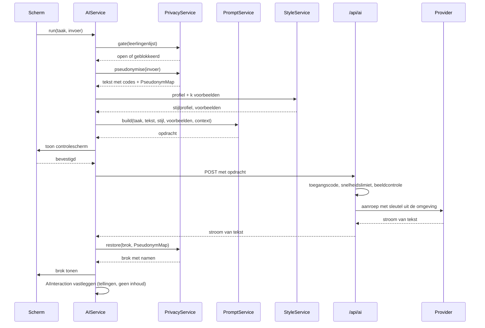

De volgorde is vast en er is geen enkele route die hem overslaat. `AIService` is de enige plek in de app die `/api/ai` aanroept; geen enkel scherm, geen enkele andere service doet dat (DR-16).

### 12.2 Taken

Een taak is de eenheid waarop alles is ingericht: de systeeminstructie, de keuze van voorbeelden, de temperatuur, de maximale lengte, het budget en de gouden testgevallen.

| Taak | Module | In v1.0 | Invoer | Uitvoer |
|---|---|---|---|---|
| `doc.write` | DOC | ja | losse observaties | lopende tekst |
| `doc.title` | DOC | ja | tekst van de documentatie | drie titels van ≤ 6 woorden |
| `doc.followup` | DOC | ja | reekscontext + begin | 1-3 openingszinnen |
| `doc.spelling` | DOC | ja | tekst | dezelfde tekst met correcties |
| `talk.build` | DOC | ja | antwoorden uit gespreksmodus | lopende tekst |
| `mail.summarise` | MAI | ja | ontvangen bericht | vijf punten |
| `mail.write` | MAI | ja | sjabloon, toon, aanleiding | conceptmail |
| `mail.tone` | MAI | 1.1 | bestaande tekst + doeltoon | herschreven tekst |
| `mail.shorten` | MAI | 1.1 | bestaande tekst | kortere tekst |
| `mail.expand` | MAI | 1.1 | bestaande tekst | uitgebreidere tekst |

De vijf taken die B-04 naar later zette, staan hier al benoemd met hun versie. Dat is bewust: een taak die pas in 1.1 komt maar nu al een plek in het register heeft, wordt later toegevoegd zonder dat de architectuur verandert.

```typescript
interface TaskDefinition {
  id: TaskId;
  systemPrompt: string;
  temperature: number;
  maxOutputTokens: number;
  exampleCount: number;          // hoeveel stijlvoorbeelden meegaan
  includeStyleProfile: boolean;
  includeSeriesContext: boolean;
  maxInputChars: number;
  reviewRequired: "always" | "default-on" | "never";
  goldenCases: GoldenCase[];
}
```

`reviewRequired` codeert de regel uit FR-MAI-12: bij `mail.*` staat hij op `always` en is het controlescherm niet overslaanbaar; bij `doc.*` op `default-on`.

### 12.3 De opdracht

Een opdracht bestaat uit vijf blokken, altijd in deze volgorde, altijd zichtbaar in het controlescherm (B-11).

```
1. SYSTEEMINSTRUCTIE   wat de assistent is en wat hij niet doet
2. SCHRIJFSTIJL         het stijlprofiel in leesbare regels
3. VOORBEELDEN          k paren van invoer en gewenste uitkomst
4. CONTEXT              reeksdelen, sjabloon, toon — afhankelijk van de taak
5. INVOER               de gepseudonimiseerde tekst van de gebruiker
```

De systeeminstructie voor `doc.write`, letterlijk zoals hij verstuurd wordt:

```
Je bent een schrijfhulp voor een leerkracht in het Nederlandse funderend onderwijs.
Je maakt van losse observaties één lopende tekst voor pedagogische documentatie
die naar ouders gaat.

Wat je doet:
- Je gebruikt uitsluitend wat er in de invoer staat.
- Je maakt van losse zinnen lopende zinnen en zet ze in een logische volgorde.
- Je corrigeert spelling en interpunctie.
- Je behoudt citaten woordelijk, inclusief kindertaal en grammaticafouten.

Wat je niet doet:
- Je voegt geen gebeurtenissen, personen, plaatsen, tijden of gevoelens toe die er niet staan.
- Je schrijft niet wat een kind kan, is, of leert. Je schrijft wat er gebeurde en wat er gezegd is.
- Je gebruikt geen oordelen: niet knap, niet goed, niet trots, niet prachtig.
- Je verandert de codes tussen blokhaken niet. [LEERLING-1] blijft [LEERLING-1].
- Je schrijft geen inleiding, geen titel, geen afsluiting en geen opmerking over jezelf.

Vorm:
- Nederlands.
- Volg de schrijfstijl hieronder. Wijkt die af van wat je zelf zou kiezen, dan volg je de stijl.
- Geef alleen de tekst terug, zonder aanhalingstekens eromheen en zonder toelichting.
```

De regel over de codes staat er omdat een model dat `[LEERLING-1]` netjes vervangt door "de leerling" het terugvertalen onmogelijk maakt. De regel over oordelen is de vertaling van B-25 naar de opdracht zelf: EduFlow beoordeelt niet, ook niet per ongeluk in een bijzin.

Het blok SCHRIJFSTIJL wordt door `StyleService` samengesteld uit het profiel (§8.3.11) en ziet er zo uit:

```
Zinnen: gemiddeld 14 woorden. Langer dan 22 woorden komt bij deze schrijver niet voor.
Alinea's: 3 tot 4 zinnen.
Tijd: tegenwoordige tijd.
Aanspreekvorm: wij.
Citaten: gebruik minstens één letterlijk citaat als de invoer er een bevat.
Verhouding: beschrijven, niet duiden. Ongeveer 4 op de 5 zinnen beschrijft waarneembaar gedrag.
Vermijd deze woorden: prachtig, geweldig, enorm trots, ontzettend, super.
Gebruik gerust: samen, opnieuw, ontdekte, probeerde, merkte.
```

### 12.4 Voorbeeldselectie

De `k` voorbeelden zijn het krachtigste stuurmiddel, sterker dan welke instructie ook. `StyleService.selectExamples(task, input, k)` kiest ze zo:

1. **Grondslag.** De stijlvoorbeelden uit Instellingen (FR-INS-16) staan altijd vooraan; dat zijn de paren die de gebruiker zelf heeft gemaakt en die de norm bepalen.
2. **Aanvulling.** Daarna de geaccepteerde documentaties met de hoogste overeenkomst met de huidige invoer. Overeenkomst wordt bepaald met een goedkope lokale maat: cosinusgelijkenis over woordfrequenties na verwijdering van stopwoorden. Er komt geen inbeddingsmodel aan te pas — dat zou een tweede AI-aanroep betekenen voor elke aanroep.
3. **Spreiding.** Van twee voorbeelden die meer dan 0,85 op elkaar lijken, gaat er één mee. Drie bijna identieke voorbeelden leren het model niets extra's.
4. **Grens.** `k` is 2 voor `doc.write` en `talk.build`, 1 voor `mail.write`, 0 voor `doc.title` en `doc.spelling`.
5. **Afkapping.** Elk voorbeeld wordt afgekapt op 1.200 tekens per kant.

Elk voorbeeld gaat door `PrivacyService`, ook de zelfgemaakte stijlvoorbeelden. Dat lost B6 uit de review op: de stijlrichtlijn is zelf een documentatie met echte namen, en die namen zitten mogelijk in een vorige groep en dus niet in de huidige leerlingenlijst (FR-INS-17).

### 12.5 Pseudonimisatie in detail

`PrivacyService` is een zuivere functie over tekst. Hij kent geen netwerk, geen opslag en geen React, en hij is daarom volledig te toetsen (§10.10).

**De vervangingsvolgorde**, die T-04 concreet maakt:

1. **Termenlijst opbouwen** uit leerlingnamen, extra termen (FR-INS-19) en, bij mail, de detectorpatronen.
2. **Langste eerst sorteren.** Zonder dit wordt "Jan-Peter" gevonden als "Jan" en blijft "-Peter" staan.
3. **Woordgrenzen.** Het patroon is `(?<![\p{L}\p{N}])term(?![\p{L}\p{N}])` met de unicode-vlag. Daarmee blijft "roos" in "rozenstruik" staan en wordt "Roos" in "Roos plukte" wel gevonden.
4. **Hoofdletterongevoelig zoeken, hoofdletters herstellen.** Wordt "sam" gevonden waar de originele tekst "Sam" had, dan onthoudt de afbeelding dat, zodat het terugvertalen "Sam" oplevert en niet "sam".
5. **Nederlandse verbuigingen.** Achtervoegsels `s`, `'s`, `je`, `tje`, `pje`, `ke` worden meegenomen: "Kjelds idee" wordt `[LEERLING-3]s idee`, "Kjeldje" wordt `[LEERLING-3]je`.
6. **Diakrieten.** Zoeken gebeurt op de genormaliseerde vorm (NFD, diakrieten weggelaten), zodat "Hanaë" ook "Hanae" vindt; de vervanging gebeurt op de oorspronkelijke tekenreeks.
7. **Dubbele voornamen.** Twee leerlingen die Noa heten krijgen elk hun eigen `pseudonymSeed` en dus een eigen code. Kan de app niet bepalen welke Noa bedoeld is — de tekst zegt alleen "Noa" — dan krijgt het voorkomen de code van de leerling die aan de documentatie gekoppeld is. Zijn beide gekoppeld, dan krijgt het voorkomen `[LEERLING-AMBIGU-1]` en meldt het controlescherm: "Er staan twee kinderen met de naam Noa in deze documentatie. De app kan niet zien welke bedoeld is."
8. **Terugvertalen op de code.** `restore()` werkt uitsluitend op de codes, nooit op namen. Daardoor blijft het correct ook als het model de tekst herschikt.

**De poort** (T-08). Vóór stap 1 controleert `gate()`:

```typescript
if (students.length === 0 && !settings.emptyListConfirmedAt) {
  return blocked({
    code: "PRIVACY_GATE",
    message: "Je leerlingenlijst is leeg. De afscherming doet dan niets.",
    action: { label: "Leerlingen toevoegen", kind: "navigate", target: "/instellingen/leerlingen" },
  });
}
```

De bevestiging "Toch doorgaan" zet `emptyListConfirmedAt` en schrijft een `AuditEvent` (hoofdstuk 16). Zij vervalt zodra er wél leerlingen zijn en wordt opnieuw gevraagd als de lijst later weer leeg raakt.

**De toetsset.** `PrivacyService` heeft een eigen testset van minimaal 120 gevallen, met de namen uit bijlage A. Verplichte gevallen:

| Geval | Invoer | Verwachte uitkomst |
|---|---|---|
| Gewoon woord | "De rozen in de schooltuin" | ongewijzigd |
| Naam die ook woord is | "Roos plukte een roos" | `[LEERLING-19]` plukte een roos |
| Deelwoord | "samenwerken" met leerling Sam | ongewijzigd |
| Bezitsvorm | "Kjelds idee" | `[LEERLING-11]s idee` |
| Verkleinwoord | "Kjeldje" | `[LEERLING-11]je` |
| Hoofdletters | "KJELD riep" | `[LEERLING-11]` riep, hersteld bij terugvertalen |
| Samenstelling met streepje | "Jan-Peter" met leerlingen Jan en Jan-Peter | `[LEERLING-x]` voor Jan-Peter, niet voor Jan |
| Diakriet | "Hanaë" met leerling Hanae | gevonden |
| Twee gelijke namen | "Noa deed het" met beide Noa's gekoppeld | `[LEERLING-AMBIGU-1]` plus melding |
| Rondgang | pseudonimiseren en terugvertalen | exact de oorspronkelijke tekst |

De laatste is de belangrijkste: `restore(pseudonymise(t)) === t` moet gelden voor elke tekst in de set. Dat is NFR-25.

### 12.6 De serverroute

```typescript
export async function POST(request: Request) {
  const gate = await checkAccessCode(request);        // T-05
  if (!gate.ok) return json(401, gate.error);

  const limit = await rateLimit(gate.deviceId, ipOf(request));  // T-17
  if (!limit.ok) return json(429, limit.error);

  const body = aiRequestSchema.safeParse(await request.json());
  if (!body.success) return json(400, invalid(body.error));

  if (containsBinaryOrImage(body.data)) return json(422, imageRefused());  // T-29

  const adapter = adapterFor(body.data.provider);
  return adapter.stream(body.data, { signal: request.signal });
}
```

`containsBinaryOrImage` controleert op een `image`-veld, op een `data:`-URI, op een base64-blok langer dan 512 tekens en op een MIME-aanduiding van een beeldtype. Dat is grover dan nodig en dat is de bedoeling: dit is een grens die eerder te vroeg dan te laat moet dichtklappen.

**Snelheidslimiet** (T-17), per toegangscode en per IP-adres:

| Venster | Grens |
|---|---|
| 10 seconden | 3 aanroepen |
| 1 uur | 60 aanroepen |
| 1 dag | 300 aanroepen |
| 1 dag, tekens uit | 400.000 |

Bij overschrijding: `429` met de melding uit F-08.E5 en het tijdstip waarop de grens weer opengaat.

### 12.7 Providers

```typescript
interface AIProviderAdapter {
  id: "openai-eu" | "vertex-eu" | "bedrock-eu";
  displayName: string;
  region: string;
  stream(request: AIRequest, opts: { signal: AbortSignal }): Response;
  estimateCost(charsIn: number, charsOut: number): number;
  capabilities: { streaming: boolean; systemPrompt: boolean; maxContextChars: number };
}
```

| Adapter | Verwerkingsregio | Standaard |
|---|---|---|
| `openai-eu` | EU | ja (T-06) |
| `vertex-eu` | EU, waaronder een regio in Nederland | nee |
| `bedrock-eu` | EU | nee |

De regel voor het standaard maken van een provider (§3.10): verwerking binnen de EU, geen training op verstuurde gegevens, en een verwerkersovereenkomst die via het schoolbestuur gesloten kan worden. Voldoet een aanbieder daar niet aan, dan mag hij in de lijst staan maar niet als standaard, en krijgt hij bij het kiezen een waarschuwing plus een regel in het logboek (FR-INS-23).

Modelkeuze is een eigenschap van de adapter, niet van de app. De app vraagt om een taak en een kwaliteitsniveau (`snel` of `zorgvuldig`); de adapter kiest het model. Daardoor verandert er in de app niets als een aanbieder een model uitfaseert.

| Taak | Niveau | Reden |
|---|---|---|
| `doc.spelling`, `doc.title` | snel | mechanisch werk, korte uitvoer |
| `doc.write`, `talk.build`, `doc.followup` | zorgvuldig | dit is waar het product op beoordeeld wordt |
| `mail.summarise` | snel | begrijpend lezen, korte uitvoer |
| `mail.write` | zorgvuldig | gaat naar ouders |

### 12.8 Leren zonder trainen

Dit is de uitwerking van U-09, B-22 en B-23. Drie mechanismen, alle drie lokaal, alle drie zichtbaar en terug te draaien.

**Mechanisme 1 — kenmerken meten.** Na elke geaccepteerde of zelfgeschreven tekst berekent `StyleService` de kenmerken uit §8.3.11 opnieuw, als voortschrijdend gemiddelde over de laatste 30 documentaties. Meten begint pas bij 3 documentaties; daarvoor gelden de waarden uit de stijlvoorbeelden.

**Mechanisme 2 — voorbeelden kiezen.** Beschreven in §12.4.

**Mechanisme 3 — correctieregels.** `FeedbackService` houdt bij welke woorden en wendingen de gebruiker structureel weghaalt. De regel: is een woord in drie verschillende documentaties door de AI aangeboden en door de gebruiker verwijderd, dan verschijnt na de derde keer één vraag:

> "Je hebt 'prachtig' nu drie keer weggehaald. Zal ik dat woord voortaan vermijden?"
> **Ja, vermijd het** · **Nee, laat maar**

Bij ja komt het op de vermijdlijst en in de opdracht (§12.3). Bij nee wordt het woord voor drie maanden niet meer voorgesteld als regel. De gebruiker bevestigt altijd; de app besluit nooit zelf (U-10).

**Wat er nadrukkelijk niet gebeurt:**

- Er wordt geen model getraind, bijgesteld of verfijnd.
- Er gaat geen enkel gegeven naar een provider met het doel te leren.
- Er is geen inbedding, geen vectoropslag en geen externe kennisbank.
- Er wordt niets over de gebruiker afgeleid dat niet over schrijfstijl gaat.

Dat is voor de privacybeoordeling belangrijk (hoofdstuk 15) en het is ook eerlijker: wat de app "geleerd" heeft, is een leesbaar bestand van ongeveer twintig regels, dat je in Instellingen kunt openen, wijzigen en wissen.

**Meetbaarheid.** Werkt het leren, dan stijgt het aandeel overgenomen voorstellen in de eerste weken en blijft daarna stabiel. Daalt het, dan is er iets mis met het profiel en niet met het model. `FeedbackService` berekent dit per week en toont het in Instellingen → Schrijfstijl als één regel: "Je nam de afgelopen maand 78 procent van de voorstellen over (vorige maand 71 procent)."

### 12.9 De gouden testset

Dit is het antwoord op D8 uit de review en op B4: zonder toetsbare grens is niet vast te stellen of AI het goed of fout doet, en dan is de Definition of Done niet vast te stellen.

Een gouden testgeval bestaat uit vier delen:

```typescript
interface GoldenCase {
  id: string;
  task: TaskId;
  input: string;              // ruwe notitie, met de namen uit bijlage A
  acceptable: string;         // een goede uitkomst
  overshot: string;           // een te ver doorgeschoten uitkomst
  checks: Check[];            // machinaal toetsbaar
}

type Check =
  | { kind: "maxSentenceWords"; value: number }
  | { kind: "maxSentences"; value: number }
  | { kind: "mustContainQuote" }
  | { kind: "mustNotContain"; words: string[] }
  | { kind: "mustPreserveCodes" }
  | { kind: "noNewNamedEntities" }
  | { kind: "noJudgementWords" }
  | { kind: "tense"; value: "tegenwoordig" | "verleden" };

```

De testset draait in twee standen:

**Zonder netwerk, bij elke wijziging.** Getoetst wordt de samengestelde opdracht: bevat hij de systeeminstructie, het profiel, de juiste voorbeelden, de juiste context, en de gepseudonimiseerde invoer? Dit vangt de meeste fouten, want de meeste fouten zitten in het samenstellen en niet in het model.

**Met netwerk, vóór elke release en wekelijks.** De uitvoer van de provider wordt langs de `checks` gelegd. De drempels:

| Controle | Eis |
|---|---|
| `mustPreserveCodes` | 100 procent — een enkele fout hier maakt terugvertalen onmogelijk |
| `noNewNamedEntities` | 100 procent — de AI mag geen personen, plaatsen of gebeurtenissen toevoegen (§3.8) |
| `noJudgementWords` | 100 procent — volgt uit B-25 |
| `maxSentenceWords` | ≥ 95 procent van de zinnen |
| `mustContainQuote` | ≥ 90 procent van de gevallen waarin de invoer een citaat bevat |
| `tense` | ≥ 90 procent |

`noNewNamedEntities` wordt gecontroleerd door de uitvoer te ontleden op hoofdletters midden in een zin en die te vergelijken met de invoer. Alles wat nieuw is en geen gewoon Nederlands woord is, is een treffer. Dat is grof, maar het vangt precies het geval dat het meeste schaadt: een AI die een kind verzint.

**De minimale set.** Vier gevallen per taak, aangeleverd door de maker (D8 uit de review), plus de vier randgevallen die de app zelf moet aankunnen: een invoer van drie woorden, een invoer van 8.000 tekens, een invoer die alleen uit citaten bestaat, en een invoer met twee kinderen die dezelfde naam hebben.

**Wanneer de set faalt, faalt de release.** Dat is niet onderhandelbaar en het staat in de Definition of Done (§18.6).

### 12.10 Streaming en waargenomen tempo

De eerste tekens moeten binnen 2 seconden staan (NFR-06). Wat daarvoor nodig is:

1. De route handler streamt door in plaats van het hele antwoord af te wachten.
2. `PrivacyService.restore()` werkt op brokken, niet op de volledige tekst. Dat kan omdat codes de vorm `[LEERLING-1]` hebben en een brok een code kan doorsnijden: de service houdt een buffer aan van de langst mogelijke code en geeft pas vrij wat zeker compleet is.
3. Het scherm tekent de binnenkomende tekst in een eigen component (§11.5), zodat het tekstvlak waarin de gebruiker werkt niet opnieuw getekend wordt.
4. Tijdens het streamen is Overnemen uitgeschakeld en Weggooien beschikbaar. Overnemen op een half antwoord levert een halve zin op.

Duurt het langer dan 2 seconden voordat het eerste teken komt, dan verschijnt onder de knop "De AI denkt na" en na 6 seconden "Het duurt langer dan gewoonlijk. Je kunt dit afbreken." Er is geen voortgangsbalk, want er is geen voortgang die je eerlijk kunt tonen (§4.5).

### 12.11 Fouten en nieuwe pogingen

| Situatie | Gedrag |
|---|---|
| Netwerkfout of `5xx` | eenmaal opnieuw na 2 seconden, stil |
| Time-out na 30 seconden | afbreken, melding met "Opnieuw" |
| `429` van de provider | opnieuw na de aangegeven wachttijd, hoogstens één keer |
| `429` van de eigen limiet | geen nieuwe poging; melding met het tijdstip waarop de grens opengaat |
| Leeg antwoord | eenmaal opnieuw met dezelfde opdracht |
| Antwoord met beschadigde codes | niet tonen; melding "De AI gaf een antwoord dat de app niet veilig kan terugvertalen." en één nieuwe poging |
| Antwoord dat de `checks` faalt in de streng-modus | alleen in tests; in productie wordt het getoond, want de gebruiker beslist (U-10) |
| Provider onbereikbaar | melding met de mogelijkheid in Instellingen een andere provider te kiezen |

Er is nooit meer dan één automatische nieuwe poging. Twee stille pogingen maken een trage aanroep drie keer zo traag en verdubbelen de kosten zonder dat de gebruiker weet waarom (§3.7).

**Nooit stil falen.** Elke mislukte aanroep leidt tot een zichtbare melding en een regel in `aiInteractions` met `outcome: "failed"`. Een AI die stil niets doet is erger dan een AI die niet werkt: bij de eerste denkt de gebruiker dat haar tekst goedgekeurd is.

### 12.12 Kosten

| Taak | Tekens in (gem.) | Tekens uit (gem.) | Aanroepen per week (gem.) |
|---|---|---|---|
| `doc.write` | 4.200 | 1.100 | 10 |
| `doc.followup` | 6.500 | 250 | 3 |
| `doc.title` | 1.400 | 80 | 6 |
| `doc.spelling` | 1.400 | 1.400 | 4 |
| `talk.build` | 2.800 | 1.100 | 5 |
| `mail.summarise` | 3.500 | 400 | 6 |
| `mail.write` | 2.600 | 900 | 5 |

Bij benadering 250.000 tekens in en 60.000 uit per gebruiker per week. Bij een tarief in de orde van enkele euro's per miljoen tokens komt dat op enkele tientallen eurocenten per gebruiker per week — enkele tientallen euro's per jaar voor één leerkracht. Dat is de reden dat het dagbudget uit T-17 bestaat: niet omdat de kosten hoog zijn, maar omdat een open `/api/ai` zonder slot een gratis AI-dienst is op rekening van de maker (C7 uit de review).

`AIService` telt het verbruik lokaal en toont het in Instellingen (FR-INS-24). Bij 80 procent van het maandbudget verschijnt een melding; bij 100 procent worden alleen de taken op niveau `zorgvuldig` geblokkeerd, zodat spelling en titels blijven werken.

### 12.13 Wat er nooit naar een provider gaat

Deze lijst is bindend en wordt op drie plekken afgedwongen: in `PromptService` bij het samenstellen, in `AIService` vóór het versturen, en in de route handler op de server (T-29).

| Gegeven | Waarom niet |
|---|---|
| Foto's, in welke vorm dan ook | B-03; de belofte waar het hele ontwerp van gespreksmodus op rust |
| Bestandsnamen en hashes van foto's | kunnen een naam bevatten |
| Achternamen en initialen uit de leerlingenlijst | worden vervangen |
| Geboortedatums | staan nergens in een opdracht |
| De persoonlijke notitie bij een documentatie | is voor de gebruiker zelf (`privateNote`) |
| Notities bij een leerling | idem |
| E-mailadressen, telefoonnummers, adressen, IBAN, BSN | worden vervangen (§6.3.10) |
| Bijlagen van een mail | worden niet eens opgehaald (FR-MAI-11) |
| De inhoud van het logboek | bevat geen inhoud (§8.3.12) |
| De `PseudonymMap` | bestaat alleen in het geheugen (T-23) |

### 12.14 Wat de gebruiker ziet van dit alles

De hele architectuur van dit hoofdstuk komt op één scherm samen: "Bekijk wat er verstuurd wordt". Het toont, uitklapbaar, precies wat er over de lijn gaat:

```
┌────────────────────────────────────────────────────────────┐
│  Dit gaat naar de AI                          7 afgeschermd│
├────────────────────────────────────────────────────────────┤
│ ▸ Instructie aan de AI                            412 woorden│
│ ▸ Jouw schrijfstijl                                 8 regels│
│ ▸ Voorbeelden uit je instellingen                        2  │
│ ▾ Je eigen tekst                                          │
│                                                            │
│   [LEERLING-11] bouwde met [LEERLING-13] aan de brug.      │
│   "Kijk, hij staat!" zei [LEERLING-11].                    │
│                                                            │
│ ▸ Wat er niet meegaat                            4 foto's  │
├────────────────────────────────────────────────────────────┤
│  Verwerking: EU · Deze tekst wordt niet gebruikt om te     │
│  trainen.                                                  │
│                        [ Annuleren ]      [ Verstuur ]     │
└────────────────────────────────────────────────────────────┘
```

Het blok "Wat er niet meegaat" is er bewust. Een controlescherm dat alleen toont wat weggaat, laat de belangrijkste eigenschap van dit product onbenoemd: dat de foto's blijven waar ze zijn.

---

## 13. Integraties

### 13.1 De houding tegenover koppelingen

Elke koppeling is een belofte die je jarenlang moet nakomen: aan de leverancier aan de andere kant, aan de gebruiker die erop gaat leunen, en aan de functionaris gegevensbescherming die wil weten welke gegevens waarheen gaan. Een koppeling die je bouwt omdat het kan, is een koppeling die je onderhoudt omdat het moet.

Daarom drie toelatingseisen. Een koppeling komt er alleen als alle drie waar zijn:

1. **Er is een officiële, gedocumenteerde programmeerkoppeling.** Geen scraping, geen browserautomatisering, geen ongedocumenteerde eindpunten. Dat is een absolute grens (§13.1).
2. **Hij neemt werk weg dat de gebruiker anders elke week doet.** Een koppeling die één keer per jaar tijd bespaart, verliest het van een export.
3. **De gegevensstroom is uit te leggen in twee zinnen.** Kan dat niet, dan is de koppeling te ingewikkeld voor een product dat op eenvoud is gebouwd (U-05).

### 13.2 Integraties in versie 1.0

| Integratie | Richting | Waarvoor | Toestemming |
|---|---|---|---|
| Microsoft Graph (Microsoft 365) | lezen, plus concept schrijven | de module Mail (§6.3) | OAuth 2.0 met PKCE door de gebruiker, soms met beheerdersgoedkeuring |
| Gmail API (Google Workspace) | lezen, plus concept schrijven | idem | idem |
| `schoolvakanties.json` | lezen, meegeleverd bestand | de agenda (§6.2.4) | geen |
| ICS-bestand | in- en uitvoer, handmatig | agenda overzetten (B-30) | geen |
| CSV-bestand | invoer, handmatig | leerlingen invoeren (FR-INS-03) | geen |
| Klembord en deelmenu van het apparaat | uitvoer | delen (B-09) | de gebruiker per handeling |
| AI-provider | uitgaand, via de eigen server | hoofdstuk 12 | verwerkersovereenkomst via het bestuur |

Meer niet. Dat is een korte lijst voor een product met drie modules, en dat is de bedoeling.

### 13.3 Microsoft Graph en Gmail in detail

**Wat er over de lijn gaat, in twee zinnen.** EduFlow vraagt aan Microsoft of Google een lijst met berichtkoppen op en, als je een bericht opent, de tekst van dat bericht; dat verlaat je eigen omgeving niet, want de aanroep loopt via de server van EduFlow rechtstreeks naar je eigen postbus. Als je een antwoord af hebt, schrijft EduFlow dat als concept terug in diezelfde postbus, zonder ontvanger en zonder het te versturen.

**Rechten.** De tabel staat in §6.3.2. De kern van het ontwerp is wat er níét in staat: `Mail.Send` en `gmail.send` worden niet aangevraagd (B-20). De afdwinging zit op drie plekken:

1. De aanvraaglijst in de omgevingsvariabelen van de server bevat ze niet.
2. De route handler `/api/mail/[...path]` werkt met een lijst toegestane paden waarop geen verzendpad staat (T-30).
3. De bouwstraat faalt bij een verwijzing naar een verzendeindpunt in de broncode (DR-42).

Drie sloten voor één belofte lijkt overdreven. Het is de belofte waarop dit hele product staat of valt bij de functionaris gegevensbescherming, en een belofte met één slot is een belofte die iemand per ongeluk opent.

**Token-omgang** (T-15). De autorisatiecode wordt op de server ingewisseld tegen een toegangs- en een vernieuwingstoken. Beide worden versleuteld met een sleutel uit de omgeving en in één `httpOnly`-cookie gezet met `Secure`, `SameSite=Lax` en een looptijd van 90 dagen. Ze staan niet in `localStorage`, niet in IndexedDB, en niet in de opslag van de server. Bij ontkoppelen wordt het vernieuwingstoken bij de aanbieder ingetrokken en de cookie gewist (FR-MAI-05).

**Snelheidsgrenzen.** Beide aanbieders begrenzen het aantal aanroepen. EduFlow houdt daar rekening mee door koppen te bundelen (één aanroep voor 50 koppen), berichten alleen op te halen als je ze opent (FR-MAI-09), en bij een `429` de aangegeven wachttijd te respecteren zonder opnieuw te proberen binnen dat venster.

**Wat er misgaat en hoe vaak.** De meest voorkomende storing is niet technisch maar organisatorisch: een schoolbestuur dat toestemming door gebruikers heeft uitgeschakeld. Daarom is FR-MAI-04 er, met een kant-en-klaar blok gegevens voor de ICT-beheerder.

### 13.4 Het vakantiebestand

Een meegeleverd JSON-bestand met een versienummer, drie regio's en meerdere schooljaren (§6.2.4). Het is geen koppeling maar een gegevensbron, en dat is een bewuste keuze: een koppeling met een externe dienst voor gegevens die één keer per jaar veranderen, is een afhankelijkheid zonder opbrengst.

De verversing loopt via een app-update. Bij het openen vergelijkt `HolidayService` de versie in het bestand met die in de opslag; is hij nieuwer, dan wordt `holidayPeriods` opnieuw gevuld en blijven `holidayOverrides` staan (FR-AGE-11). Loopt `validUntil` af, dan meldt de app dat (FR-AGE-12, B-50).

### 13.5 Integraties die overwogen en afgewezen zijn

| Integratie | Waarom overwogen | Waarom niet |
|---|---|---|
| **ParnasSys** (leerlingadministratie) | leerlingen en groepen zouden niet handmatig hoeven | Een leerlingenlijst invoeren kost tien minuten per jaar. De koppeling vereist een overeenkomst per bestuur, doorlopend onderhoud en een uitbreiding van de verwerkingsgrondslag. De verhouding klopt niet (eis 2 uit §13.1). Zie §13.6 voor wanneer dit verandert. |
| **Momento** | genoemd in de oorspronkelijke documenten als toekomstige koppeling | Er is geen officiële programmeerkoppeling. De enige route zou browserautomatisering zijn, en die is verboden (B-43, eis 1). |
| **Agenda-synchronisatie via Graph of Google Calendar** | de agenda zou vanzelf kloppen | Tweerichtingssynchronisatie vraagt conflictafhandeling, verwijderdetectie en een tweede toestemmingsstroom, voor een agenda die één persoon bijhoudt. ICS-import lost 90 procent op tegen 5 procent van de kosten (B-30). |
| **Basispoort of Entree Federatie** (eenmalig aanmelden) | leerkrachten kennen het | EduFlow kent geen accounts (B-21). Eenmalig aanmelden zou accounts introduceren om een toegangscode te vervangen die één keer per jaar wordt ingevoerd. |
| **Teams of Parro** (oudercommunicatie) | de documentatie moet daar toch heen | Zou betekenen dat EduFlow zelf naar ouders verstuurt, en dat is precies wat U-01 verbiedt. Delen via het deelmenu van het apparaat levert hetzelfde resultaat met de gebruiker aan de knop (B-09). |
| **Cloudopslag** (OneDrive, Google Drive) voor back-ups | een back-up in de cloud gaat niet verloren | De back-up bevat alle foto's van alle kinderen. Die in een cloudmap zetten is een verwerking die om een eigen grondslag en een eigen overeenkomst vraagt. De gebruiker mag het bestand zelf ergens neerzetten; de app doet het niet voor haar. |
| **Spraakherkenning** | dicteren in gespreksmodus | Het toetsenbord van het apparaat doet dit al, gratis en in elke taal. Zelf bouwen zou audio naar een dienst sturen — een nieuwe gegevensstroom voor iets wat al werkt (§3.11, D3 uit de review). |

### 13.6 Wanneer een afgewezen integratie terugkomt

De afwijzingen hierboven zijn niet definitief; ze horen bij versie 1.0 en bij één gebruiker. De voorwaarden waaronder ze opnieuw op tafel komen:

| Integratie | Voorwaarde |
|---|---|
| ParnasSys of een ander leerlingadministratiesysteem | Meer dan tien gebruikers binnen één bestuur, én een verwerkersovereenkomst die het bestuur toch al heeft. Dan verandert de rekensom: tien keer tien minuten per jaar plus foutgevoeligheid weegt op tegen het onderhoud. |
| Agenda-synchronisatie | Gebruikers melden dat de ICS-import in de praktijk te vaak herhaald moet worden. |
| Momento | Er komt een officiële programmeerkoppeling. |
| Eenmalig aanmelden | Fase 2 introduceert accounts; dan wordt Entree Federatie de logische keuze in plaats van een eigen wachtwoord. |

### 13.7 Standaarden in het Nederlandse funderend onderwijs

Voor de volledigheid, en omdat het gesprek met een bestuur hier vroeg of laat op komt: het onderwijsveld kent afspraken die op termijn relevant worden.

| Standaard | Waarvoor | Relevantie voor EduFlow |
|---|---|---|
| **ECK iD** | een pseudonieme identificatie van een leerling over leveranciers heen | Zou in fase 3 de sleutel kunnen zijn waarmee een leerling herkenbaar is zonder naam. Nu niet: EduFlow deelt met niemand. |
| **UWLR** | uitwisseling van leerlinggegevens en resultaten tussen administratie en leermiddelen | Alleen relevant als er ooit een koppeling met een leerlingadministratiesysteem komt. Resultaten zijn buiten scope (B-25). |
| **OSO** | overdracht van een leerlingdossier bij schoolwissel | Niet relevant: EduFlow is geen dossier. |
| **Edukoppeling** | de transportafspraak voor uitwisseling in de sector | Relevant zodra er systeem-tot-systeemverkeer komt, dus in fase 3. |
| **Edu-V** | het nieuwere afsprakenstelsel voor het funderend onderwijs | Het kader waarbinnen een leverancier zich in dit veld beweegt. Aansluiting wordt beoordeeld op het moment dat EduFlow buiten één bestuur wordt aangeboden. |
| **Normenkader IBP funderend onderwijs** | informatiebeveiliging en privacy | Nu al het kader waaraan de maatregelen in hoofdstuk 16 gespiegeld worden. |

De conclusie voor versie 1.0: EduFlow sluit op geen van deze standaarden aan, en dat is juist, omdat hij met geen enkel ander systeem gegevens uitwisselt. Zodra dat verandert, verandert dit hoofdstuk mee — en dan vóór de bouw, niet erna.

### 13.8 De koppelvlakken die er wél zijn: bestanden

Bestanden zijn de onderschatte integratie. Ze vragen geen overeenkomst, geen token en geen onderhoud, en de gebruiker houdt de regie omdat zij het bestand zelf verplaatst.

| Bestand | Formaat | Richting | Beschreven in |
|---|---|---|---|
| Back-up | `.efb`: archief met JSON per tabel en JPEG's, optioneel versleuteld | beide | §8.7 |
| Print-PDF | PDF/A-compatibel, A4 liggend | uit | §6.1.12 |
| Deelbare afbeelding | JPEG 2480 × 1754 | uit | §5.12 |
| Agenda | ICS | beide | §6.2.7 |
| Leerlingen | CSV met kopregel | in | §6.5.1 |
| Inzageoverzicht | Markdown of JSON | uit | FR-INS-41 |

Elk van deze formaten is open, leesbaar en niet aan EduFlow gebonden. Dat is de uitweg als de gebruiker ooit met dit product stopt, en die uitweg hoort er vanaf versie 1.0 te zijn (C6 uit de review).

---

## 14. Rollen en rechten

Dit hoofdstuk gaat over twee soorten rollen die makkelijk door elkaar lopen: de rollen in het **project** (wie beslist wat er gebouwd wordt) en de rollen in de **applicatie** (wie mag wat zien en doen). De review wees erop dat het eerste in de oorspronkelijke documenten scheef stond (B11r): er waren drie projectrollen met code review en een producttest, terwijl er één persoon is.

### 14.1 Projectrollen

**Er is één persoon met drie petten** (B-44). Dat is geen probleem zolang het expliciet is; het wordt een probleem zodra de kwaliteitspoorten doen alsof er drie mensen zijn.

| Pet | Beslist over | Vraagt zich af |
|---|---|---|
| **Producteigenaar** | wat er gebouwd wordt en in welke volgorde; scope; wanneer iets af is voor de gebruiker | "Zou ik dit zelf gebruiken op een donderdagmiddag?" |
| **Architect** | hoe het gebouwd wordt; datamodel; welke afhankelijkheden erin komen; wat er niet in mag | "Kan ik dit over twee jaar nog uitleggen en vervangen?" |
| **Ontwikkelaar** | de uitvoering; wanneer iets technisch af is | "Is dit getoetst, en werkt het ook als er iets misgaat?" |

De overlap die de review aanwees — prioriteiten bij de producteigenaar, roadmap bij de architect — wordt opgelost door één regel: **de roadmap is een productbesluit.** De architect bepaalt wat er technisch eerst moet (bijvoorbeeld: `StorageService` vóór alles), maar de volgorde van functionaliteit is aan de producteigenaar.

**De zelfcontrolepoorten** (B-44). Omdat er niemand is die meeleest, worden de poorten expliciet en gedateerd. Ze staan in een checklijst per opgeleverde functionaliteit:

| Poort | Wat er gebeurt | Bewijs |
|---|---|---|
| Ontwerp | De functionaliteit staat in dit document met een eisnummer | verwijzing naar `FR-…` |
| Bouw | Alle geautomatiseerde toetsen slagen, inclusief de gouden testset | uitvoer van de bouwstraat |
| Zelfreview | Minimaal 24 uur na het schrijven, met verse blik; drie vragen: klopt het met de eis, is er dubbele logica ontstaan, wat gebeurt er bij een fout | aantekening met datum |
| Producttest | De functionaliteit is één werkdag echt gebruikt met de verzonnen groep | aantekening met datum en bevinding |
| Privacy | Als er een nieuwe gegevensstroom is: opgenomen in het overzicht van hoofdstuk 15 | verwijzing |

De regel achter de derde poort is de belangrijkste: **niet dezelfde dag reviewen als bouwen.** Dat is de goedkoopste manier om een tweede paar ogen te benaderen als je er maar één hebt.

### 14.2 Applicatierollen in versie 1.0

Versie 1.0 heeft **één gebruiker per apparaat en geen accounts** (B-21). Er is dus feitelijk één rol. Dat is geen reden om het rechtenmodel over te slaan, wel om het niet te bouwen: het model staat hier beschreven, en `SettingsService` kent één rol met alle rechten. De rest komt in fase 2 (§18.4).

| Rol | Bestaat in | Kort |
|---|---|---|
| `professional` | 1.0 | de leerkracht of pedagogisch medewerker; ziet en doet alles op haar eigen apparaat |
| `meelezer` | fase 2 | een duo-collega die documentaties van dezelfde groep mag lezen en becommentariëren |
| `ib` | fase 2 | intern begeleider; leest over groepen heen, maakt zelf niets |
| `beheerder` | fase 2 | ICT of directie; beheert toegangscodes, providerkeuze en apparaten; ziet geen inhoud |
| `functionaris` | fase 2 | functionaris gegevensbescherming; ziet uitsluitend het logboek en de gegevensstromen, nooit inhoud |

Twee ontwerpbesluiten die de moeite waard zijn om nu al vast te leggen, omdat ze later niet meer om te draaien zijn:

**De beheerder ziet geen inhoud.** Een beheerder die documentaties kan lezen, is een beheerder die de vertrouwelijkheid van het instrument breekt. Wat hij nodig heeft — wie heeft toegang, welke provider staat er, is er iets misgegaan — staat allemaal in het logboek en in de instellingen, niet in de inhoud.

**De functionaris ziet nooit inhoud, ook niet op verzoek.** Zijn werk is toetsen of de stromen kloppen, niet meelezen. Het logboek uit hoofdstuk 16 is daarvoor ingericht: het bevat handelingen, tellingen en bestemmingen, en geen enkele zin uit een documentatie.

### 14.3 Rechtenmatrix

De matrix voor fase 2, zoals hij ontworpen wordt. In versie 1.0 heeft `professional` alle rechten uit de eerste kolom en bestaan de andere kolommen niet.

| Handeling | professional | meelezer | ib | beheerder | functionaris |
|---|---|---|---|---|---|
| Documentatie lezen (eigen) | ja | — | — | nee | nee |
| Documentatie lezen (gedeeld met haar) | ja | ja | ja | nee | nee |
| Documentatie maken en wijzigen | ja | nee | nee | nee | nee |
| Documentatie exporteren | ja | nee | nee | nee | nee |
| Opmerking plaatsen bij een documentatie | ja | ja | ja | nee | nee |
| Leerlingen en groepen beheren | ja | nee | nee | nee | nee |
| Leerling over groepen heen bekijken | ja | nee | ja | nee | nee |
| Agenda beheren | ja | nee | nee | nee | nee |
| Postbus koppelen en lezen | ja | nee | nee | nee | nee |
| Mailconcept maken | ja | nee | nee | nee | nee |
| Stijlprofiel bekijken en wijzigen | ja | nee | nee | nee | nee |
| AI-provider kiezen | ja | nee | nee | ja | nee |
| Toegangscodes en apparaten beheren | ja | nee | nee | ja | nee |
| Back-up maken en terugzetten | ja | nee | nee | nee | nee |
| Logboek inzien | ja | nee | nee | ja | ja |
| Gegevensstromen inzien | ja | ja | ja | ja | ja |
| Alles wissen | ja | nee | nee | nee | nee |

De regel die uit deze matrix volgt en die in code komt te staan: **niemand behalve de professional zelf schrijft ooit aan haar documentaties.** Delen is lezen plus opmerkingen, nooit meeschrijven. Dat sluit de hele klasse van samenwerkingsproblemen uit die in §7.27 als "bewust niet" staat.

### 14.4 Delen in fase 2

Delen wordt per documentatie, expliciet, en met een einddatum:

```typescript
interface Share {
  documentationId: Uuid;
  withUserId: Uuid;
  permission: "read" | "read-comment";
  grantedAt: IsoDateTime;
  expiresAt: IsoDateTime;      // standaard einde schooljaar
  revokedAt: IsoDateTime | null;
}
```

Drie regels die nu al vastliggen omdat ze het ontwerp raken:

1. **Delen heeft altijd een einddatum**, standaard de laatste schooldag van het lopende schooljaar. Een toegang zonder einde is een toegang die niemand ooit intrekt.
2. **Delen is per documentatie, niet per groep.** "Iedereen die bij groep 4 hoort mag alles zien" is een regel die een jaar later niet meer klopt en die niemand herziet.
3. **Intrekken werkt met terugwerkende kracht op toegang, niet op wat al gelezen is.** De app zegt dat eerlijk: "Toegang ingetrokken. Wat al gelezen of gedownload is, kan niet worden teruggehaald."

### 14.5 De toegangscode

In versie 1.0 is de toegangscode het enige slot (T-05). Wat hij is en wat hij niet is:

**Wat hij is.** Een gedeeld geheim dat voorkomt dat een willekeurige bezoeker van het webadres de AI-route kan gebruiken op rekening van de maker, en dat een terloopse bezoeker geen documentaties ziet als een laptop openstaat.

**Wat hij niet is.** Geen authenticatie van een persoon, geen bescherming tegen iemand die fysiek toegang tot het apparaat heeft, en geen scheiding tussen gebruikers. Dat moet in de communicatie eerlijk staan, want een toegangscode die als "beveiligd" wordt gepresenteerd, wekt een verwachting die hij niet waarmaakt.

| Eigenschap | Waarde |
|---|---|
| Lengte | 12 tekens, willekeurig uit een alfabet zonder verwarrende tekens |
| Opslag op de server | alleen als hash (Argon2id) |
| Opslag op het apparaat | een ondertekende cookie, `httpOnly`, `Secure`, `SameSite=Lax`, 365 dagen |
| Wijzigen | door de beheerder; alle apparaten moeten daarna opnieuw invoeren |
| Intrekken per apparaat | ja, via de apparatenlijst (FR-INS-38) |
| Pogingen | 5 per uur per IP-adres, daarna een uur wachten |

De echte bescherming van de gegevens in versie 1.0 is niet de toegangscode maar het feit dat de gegevens het apparaat niet verlaten. Dat hoort zo in het gesprek met de functionaris te staan (hoofdstuk 15).

### 14.6 Rollen en de AI-verordening

Twee begrippen uit de AI-verordening zijn hier van belang omdat ze rollen toewijzen die niets met inloggen te maken hebben.

**Aanbieder en gebruiksverantwoordelijke.** EduFlow als product heeft een aanbieder: de maker, en op termijn de organisatie die het uitgeeft. De school die het gebruikt is gebruiksverantwoordelijke. Het SIVON-kader wijst erop dat een school die een AI-toepassing wezenlijk aanpast, zélf aanbieder wordt — met alle verplichtingen van dien.

Daarom een ontwerpbesluit dat in dit hoofdstuk thuishoort: **de school past EduFlow niet aan op systeemniveau.** Wat een school kan instellen — provider, toon, stijlprofiel, sjablonen — zijn invoerparameters binnen een vastgesteld systeem, geen wijziging van het systeem zelf. Er is geen mogelijkheid om systeeminstructies te bewerken, geen mogelijkheid om een eigen model aan te sluiten, en geen mogelijkheid om de veiligheidsgrenzen uit §12.13 te verzetten. Dat is een beperking van de vrijheid van de school, en hij is er om te voorkomen dat de school ongemerkt aanbieder wordt.

**AI-geletterdheid.** De verordening verplicht organisaties ervoor te zorgen dat wie met AI werkt daar voldoende van begrijpt. Voor EduFlow betekent dat een concrete verplichting aan het product zelf: de eerste-keer-ervaring legt in vier schermen uit wat AI hier doet, wat er weggaat, wat er blijft, en waar je het terugziet (§7.1, B-49). Dat is geen marketing maar het invullen van een verplichting die anders bij de school alleen komt te liggen.

---

## 15. Privacy en AVG

Dit is het hoofdstuk waarop het project kan stranden, en dat is geen reden om het kort te houden maar om het scherp te maken. Alles wat hier staat is bedoeld om één gesprek te kunnen voeren: dat met de functionaris gegevensbescherming van het schoolbestuur, vóórdat er gegevens van echte kinderen in de app komen.

### 15.1 Wie is waarvoor verantwoordelijk

**De verwerkingsverantwoordelijke is het schoolbestuur.** Niet de leerkracht, ook niet als zij de app zelf heeft gebouwd. Het bestuur bepaalt doel en middelen van de verwerking van leerlinggegevens; een leerkracht die daar een instrument bij kiest, handelt binnen die verantwoordelijkheid.

Dat heeft twee harde gevolgen:

1. **Een leerkracht kan niet zelf een verwerkersovereenkomst sluiten met een AI-aanbieder.** Dat moet via het bestuur. Zolang die er niet is, mogen er geen gegevens van echte kinderen naar een provider.
2. **De maker is in deze opzet verwerker**, ook al is hij dezelfde persoon als de gebruiker. Zodra EduFlow buiten de eigen klas wordt gebruikt, hoort daar een verwerkersovereenkomst bij met het bestuur, met de AI-aanbieder als subverwerker.

| Partij | Rol onder de AVG |
|---|---|
| Schoolbestuur | verwerkingsverantwoordelijke |
| EduFlow (de maker of de uitgevende organisatie) | verwerker |
| AI-aanbieder | subverwerker |
| Microsoft of Google (mail) | verwerker van het bestuur, op basis van de bestaande overeenkomst |

Die laatste regel is gunstig en het is de moeite waard hem te benoemen: de postbus die EduFlow leest, valt al onder een overeenkomst die het bestuur heeft. EduFlow voegt daar geen nieuwe partij aan toe; het leest wat er al is, via de bestaande omgeving.

### 15.2 Welke persoonsgegevens er verwerkt worden

| Gegeven | Van wie | Waar | Grondslag | Bewaartermijn |
|---|---|---|---|---|
| Roepnaam, achternaam-initiaal | leerling | apparaat | gerechtvaardigd belang van het bestuur, uitvoering onderwijstaak | tot de gebruiker verwijdert |
| Geboortedag en -maand (optioneel) | leerling | apparaat | idem | idem |
| Foto's | leerling | apparaat | toestemming beeldgebruik, geregeld door de school | idem |
| Beschrijvingen van gedrag en uitspraken | leerling | apparaat | idem als de naam | idem |
| Citaten | leerling | apparaat | idem | idem |
| Groepslidmaatschap met looptijd | leerling | apparaat | idem | idem |
| Naam, adres, telefoonnummer in een ontvangen mail | ouder | apparaat, cache 7 dagen | uitvoering van de onderwijstaak | 7 dagen |
| E-mailadres van de gebruiker | professional | cookie op de server | uitvoering | tot ontkoppelen |
| Gepseudonimiseerde tekst | leerling | onderweg naar de AI-provider | zie §15.4 | zie §15.4 |

**Wat er niet verwerkt wordt.** Geen BSN, geen ECK iD, geen adresgegevens van leerlingen, geen medische gegevens, geen cijfers, geen niveaus, geen aanwezigheid, geen gedragsincidenten als categorie. Wat een leerkracht in vrije tekst schrijft kan uiteraard gevoelig zijn; daarover gaat §15.7.

### 15.3 Dataminimalisatie in het ontwerp

De AVG vraagt niet om zo min mogelijk gegevens in het algemeen, maar om niet meer dan nodig voor het doel. In EduFlow zijn dat concrete ontwerpkeuzes, geen intenties:

| Keuze | Effect |
|---|---|
| Geen achternaam, alleen een initiaal | een lek levert geen herleidbare namenlijst op |
| Geboortedatum mag zonder jaar (T-21) | leeftijd wordt niet vastgelegd als hij niet nodig is |
| Verjaardagen uit te zetten (FR-AGE-23) | wie ze niet gebruikt, slaat ze niet op |
| De `PseudonymMap` wordt nooit opgeslagen (T-23) | de sleutel die codes weer namen maakt, bestaat alleen in het geheugen |
| Het AI-logboek bevat geen tekst (FR-PRV-08) | verantwoording zonder een tweede kopie van de inhoud |
| Bijlagen van mail worden niet opgehaald (FR-MAI-11) | de gevoeligste bestanden komen de app niet in |
| Mailcache vervalt na zeven dagen (FR-MAI-10) | geen schaduwarchief van de postbus |
| Het origineel van een foto wordt niet bewaard | minder gegevens en minder ruimte, tegelijk |
| EXIF-locatie wordt verwijderd bij het toevoegen | een foto zegt niet meer waar een kind was |

### 15.4 De AI-verwerking

Dit is de stroom waar het gesprek over gaat.

**Wat er weggaat.** Tekst die de gebruiker heeft geschreven of gedicteerd, waarin de namen uit de leerlingenlijst en de extra termen zijn vervangen door codes, samen met de systeeminstructie, het stijlprofiel en gekozen voorbeelden (§12.3). Bij de vervolgzin gaan er ook eerdere documentaties uit dezelfde reeks mee (B-04), en dat is meer tekst over kinderen dan bij gewoon meeschrijven. Dat staat expliciet in het controlescherm (FR-DOC-95).

**Wat er niet weggaat.** De lijst uit §12.13, met bovenaan: foto's, in geen enkele vorm.

**Waarom pseudonimiseren niet genoeg is.** Het Hof van Justitie heeft in september 2025 (EDPS/SRB, C-413/23 P) bevestigd wat de AVG al zei: gepseudonimiseerde gegevens blijven persoonsgegevens voor de partij die over de sleutel beschikt. Voor EduFlow, waar de gebruiker de sleutel is, blijft `[LEERLING-1]` dus een persoonsgegeven. Dat is geen reden om niet te pseudonimiseren — het verkleint het risico aanzienlijk — maar wel om het niet als vrijbrief te presenteren.

**De belofte die daarom eerlijk moet worden gemaakt.** De oorspronkelijke documenten zeiden "er wordt niets opgeslagen buiten het eigen apparaat" en "alles blijft lokaal". Dat is onwaar zodra er tekst naar een provider gaat, en de review wees daar terecht op (B8). De formulering die in de app en in de privacyverklaring staat:

> Je documentaties, foto's en leerlinggegevens staan op dit apparaat. Als je AI gebruikt, gaat de tekst waarin namen zijn vervangen door codes naar de AI-aanbieder. Foto's gaan nooit weg. Wat er precies weggaat, zie je vóór elke aanroep.

**Eisen aan de aanbieder.** Een aanbieder mag pas standaard zijn als hij aan alle vier voldoet (§12.7):

1. Verwerking binnen de EU, aantoonbaar en contractueel.
2. Geen training op verstuurde gegevens.
3. Een bewaartermijn van hoogstens dertig dagen voor misbruikdetectie, en bij voorkeur nul.
4. Een verwerkersovereenkomst die het schoolbestuur kan sluiten.

De situatie per augustus 2026, zoals vastgelegd in de review en hier overgenomen als uitgangspunt voor het gesprek:

| | Traint op je gegevens | Nul-bewaring | Verwerking binnen de EU |
|---|---|---|---|
| OpenAI (programmeerkoppeling) | nee | op aanvraag | ja, eigen EU-eindpunt |
| Google (betaald) | nee | op aanvraag | ja, via Vertex AI, waaronder een regio in Nederland |
| Anthropic | nee | op aanvraag, via verkoop | niet rechtstreeks; wel via Google of AWS in een EU-regio |

### 15.5 De AI-verordening

**EduFlow is geen hoog-risicosysteem, en dat is een ontwerpbesluit.** Bijlage III van de AI-verordening noemt vier toepassingen in het onderwijs als hoog risico: toelating en plaatsing, het beoordelen van leerresultaten, het bepalen van het passende onderwijsniveau, en het bewaken van leerlingen tijdens toetsen. Het SIVON-toetsingskader voor het funderend onderwijs (versie 1.0, 1 april 2026) leidt schoolbesturen langs precies die vier.

EduFlow doet geen van de vier. Sterker: hij kan ze niet doen, en dat is met opzet zo gebouwd (B-25). Er is geen veld voor een cijfer, geen berekening die een niveau afleidt, geen voorspelling en geen bewaking. De systeeminstructie verbiedt oordelende taal (§12.3), de gouden testset toetst daarop (§12.9), en zelfs het dashboardblok Aandacht draagt de zin "Dit gaat over jouw documentatie, niet over dit kind" (FR-DAS-06).

Die grens is daarmee niet alleen een juridisch standpunt maar een toetsbare producteigenschap. Dat is precies wat een functionaris nodig heeft: niet de bewering dat er niet beoordeeld wordt, maar de plek in het systeem waar dat wordt afgedwongen.

**Wat er wel geldt.**

| Verplichting | Sinds | Wat EduFlow doet |
|---|---|---|
| AI-geletterdheid (artikel 4) | februari 2025 | de eerste-keer-ervaring legt in vier schermen uit wat AI doet, wat weggaat en wat blijft (§14.6, B-49) |
| Transparantie bij interactie met AI (artikel 50) | 2 augustus 2026 | elke AI-uitvoer is als voorstel gemarkeerd, nooit als eigen tekst gepresenteerd; het controlescherm toont de hele opdracht |
| Markering van door AI gegenereerde uitvoer | uitgesteld tot 2 december 2026 | de tekst die de gebruiker overneemt is haar tekst, door haar goedgekeurd; EduFlow markeert het voorstel in de app en niet het eindresultaat |
| Verplichtingen voor hoog-risicosystemen (bijlage III) | uitgesteld tot 2 december 2027 | niet van toepassing, zolang B-25 geldt |

De uitstelregeling volgt uit de digitale omnibus over AI, verordening (EU) 2026/1744. Voor EduFlow verandert dat weinig, juist omdat het product bewust buiten de hoog-risicocategorie is ontworpen: het uitstel is geen ademruimte waarop het ontwerp leunt.

**De valkuil van het aanbiederschap.** Het SIVON-kader wijst erop dat een school die een AI-toepassing wezenlijk aanpast, zelf aanbieder wordt. Daarom kan de school in EduFlow geen systeeminstructies bewerken, geen eigen model aansluiten en geen veiligheidsgrenzen verzetten (B-84). Wat zij wel instelt — provider, toon, stijlprofiel, sjablonen — is invoer binnen een vastgesteld systeem.

### 15.6 DPIA en FRIA

**Wanneer een DPIA verplicht is.** Bij grootschalige verwerking van gegevens van kwetsbare personen, en leerlingen zijn kwetsbare personen. Voor één leerkracht met twintig kinderen is "grootschalig" discutabel; zodra EduFlow bestuursbreed wordt gebruikt, is het dat niet meer. De praktische lijn: **er komt een DPIA vóór de eerste gebruiker buiten de eigen klas**, en de opzet ervan wordt nu al gemaakt zodat het gesprek met de functionaris erop kan steunen.

**FRIA.** Het SIVON-kader legt bovenop de DPIA een toets op grondrechten. Ook die is opgezet vanuit de vier vragen die er in dit geval toe doen:

| Grondrecht | Risico | Maatregel |
|---|---|---|
| Bescherming van persoonsgegevens | tekst over kinderen gaat naar een derde partij | pseudonimisatie, controlescherm, EU-verwerking, geen training, foto's blijven |
| Recht op onderwijs zonder ongelijke behandeling | een AI die kinderen verschillend beschrijft op grond van naam of achtergrond | geen beoordeling (B-25); de gouden testset toetst op oordelende taal; namen zijn vervangen op het moment dat de AI schrijft |
| Recht van het kind om gehoord te worden | de documentatie gaat over het kind maar wordt zonder het kind gemaakt | citaten zijn eerste-klas onderdelen (B-37); de app moedigt letterlijke uitspraken aan boven interpretaties |
| Menselijke autonomie van de professional | de AI bepaalt hoe er over kinderen geschreven wordt | elk resultaat is een voorstel (U-10); het stijlprofiel is van de gebruiker en te wissen (B-23) |

**De volgorde waarin dit gebeurt** — dit is het advies uit sectie E van de review, hier vastgelegd als werkwijze:

1. **Bouwen en toetsen met verzonnen kinderen.** De groep uit bijlage A en de stijlvoorbeelden zijn testmateriaal én demonstratiemateriaal. Er gaat geen enkel echt kind de deur uit tot het geregeld is.
2. **De functionaris een werkende app laten zien in plaats van een plan.** Met het controlescherm erbij: dit is precies wat er weggaat, dit blijft op het apparaat. Dat gesprek verloopt anders dan een gesprek over een idee.
3. **Provider kiezen op wat er kan, niet op wat het beste schrijft.**
4. **DPIA en FRIA afronden, verwerkersovereenkomst via het bestuur, akkoord van de functionaris.**
5. **Pas dan echte gegevens.**

**Dit staat in de Definition of Done** (B-45). Het is geen aparte voorwaarde naast het proces maar een criterium erin, zodat "af" niet kan betekenen "af behalve de privacy".

### 15.7 Rechten van betrokkenen

De betrokkenen zijn de kinderen, vertegenwoordigd door hun ouders. Hun rechten worden uitgeoefend bij het schoolbestuur; EduFlow moet het bestuur in staat stellen ze na te komen.

| Recht | Hoe EduFlow het bedient |
|---|---|
| Inzage | FR-INS-41 levert een leesbaar overzicht van alles wat er over een leerling is vastgelegd, met een filter per kind |
| Rectificatie | elke documentatie is te wijzigen; er is geen bevroren versie |
| Wissen | een leerling verwijderen en de documentaties waarin hij voorkomt verwijderen; de app toont vooraf welke dat zijn |
| Beperking | archiveren haalt uit beeld zonder te verwijderen (FR-DOC-120) |
| Overdraagbaarheid | de back-up en het inzageoverzicht zijn open formaten (§13.8) |
| Bezwaar tegen geautomatiseerde besluitvorming | niet van toepassing: er worden geen besluiten genomen (B-25) |

**Het praktische geval dat het vaakst voorkomt.** Een ouder vraagt of zijn kind van de foto's af kan. De app moet dan kunnen tonen in welke documentaties dat kind voorkomt, en die documentaties moeten te wijzigen of te verwijderen zijn zonder dat de rest sneuvelt. Dat is precies waarom `studentIds` een geïndexeerde meerwaardige koppeling is (§8.5) en waarom foto's een `refCount` hebben (§8.3.7).

### 15.8 Toestemming voor beeldgebruik

Toestemming voor het gebruik van beeldmateriaal regelt de school, niet EduFlow. Wat EduFlow doet, is de gebruiker eraan herinneren op het enige moment waarop het ertoe doet: als er materiaal met foto's de school verlaat.

De bevestiging verschijnt bij de eerste deelbare afbeelding van een documentatie, en daarna niet meer voor diezelfde documentatie (B-08). Dat is een bewuste tussenweg: elke keer vragen leidt tot wegklikken zonder lezen, en één keer ooit is als controle waardeloos. De vraag gaat over deze fotoset, en fotosets verschillen per documentatie.

Het moment van bevestigen wordt vastgelegd in `imageConsentAt` (§8.3.5) en is zichtbaar in het logboek. Dat is geen bewijs van toestemming van de ouders — dat ligt bij de school — maar wel een aantoonbaar moment van bewuste afweging door de professional.

### 15.9 Beveiliging als privacymaatregel

De maatregelen staan in hoofdstuk 16. Wat hier telt, is welke ervan een privacyfunctie hebben:

| Maatregel | Privacyfunctie |
|---|---|
| Gegevens verlaten het apparaat niet | het aanvalsoppervlak is één laptop, niet een server met duizenden kinderen |
| Geen accounts, geen centrale opslag | er valt centraal niets te lekken |
| Versleutelde back-up | het enige bestand dat het apparaat verlaat, is beschermd |
| Tokens in `httpOnly`-cookies | geen postbustoegang via een script in de browser |
| Toegangscode | een openstaande laptop toont niet meteen documentaties |
| Snelheidslimiet | voorkomt dat een gestolen adres een gegevensstroom wordt |
| Geen inhoud in het logboek | verantwoording zonder tweede kopie |

En de eerlijke keerzijde, die ook in het gesprek hoort: **op één apparaat staan alle gegevens onversleuteld in IndexedDB.** Wie de laptop in handen heeft en hem ontgrendeld krijgt, heeft de documentaties. De maatregel daartegen is niet in de app te bouwen; hij heet schijfversleuteling en een schermvergrendeling, en die horen in het beleid van het bestuur. De app zegt dat in het scherm Over.

### 15.10 De privacyverklaring in de app

Eén scherm, geschreven voor een leerkracht en niet voor een jurist. Zes koppen:

1. **Wat er van kinderen wordt vastgelegd** — met de tabel uit §15.2 in gewone taal.
2. **Waar het staat** — op dit apparaat, in de opslag van je browser.
3. **Wat er weggaat als je AI gebruikt** — met de zin uit §15.4 en de verwijzing naar het controlescherm.
4. **Wat er nooit weggaat** — foto's, bijlagen, notities.
5. **Wat je zelf kunt doen** — inzien, wijzigen, wissen, back-up maken, alles wissen.
6. **Wie waarvoor verantwoordelijk is** — de tabel uit §15.1, in twee zinnen.

Deze tekst is onderdeel van het product en wordt bijgewerkt in dezelfde beweging als de code die de stromen verandert. Een privacyverklaring die achterloopt op de app is erger dan geen.

---

## 16. Logging en security

### 16.1 Drie soorten registratie, drie doelen

Ze worden vaak op één hoop gegooid en dat is precies waardoor logboeken vollopen met dingen die niemand leest en tegelijk missen wat iemand nodig heeft.

| Soort | Doel | Waar | Bevat persoonsgegevens |
|---|---|---|---|
| **Verantwoording** (`auditEvents`) | kunnen laten zien wat er is gebeurd met gegevensstromen | IndexedDB, 5 jaar | nee |
| **Kwaliteit** (`aiInteractions`) | meten of AI goed werkt | IndexedDB, 1 jaar | nee |
| **Diagnose** (console en serverlog) | een fout kunnen begrijpen | vluchtig | nee, afgedwongen |

De gemene deler: **geen van de drie bevat persoonsgegevens.** Dat is geen toevalligheid maar een ontwerpeis, en er is een lintregel die hem afdwingt (DR-44): het is verboden om een `Documentation`, `Student`, `Page`, `Block`, `MailMessage` of `MailDraft` als geheel aan een logfunctie mee te geven.

### 16.2 Het verantwoordingslogboek

Wat erin komt, is precies datgene waarvan je een jaar later wilt kunnen zeggen dat het gebeurd is, en wanneer.

| Gebeurtenis | Waarom vastgelegd |
|---|---|
| Postbus gekoppeld of ontkoppeld, met provider en de verleende rechten | de rechten zijn de kern van B-20 |
| AI-provider gewijzigd, met de oude en de nieuwe regio | een wisseling naar een aanbieder buiten de EU moet zichtbaar zijn |
| Doorgegaan met een lege leerlingenlijst (T-08) | dit is de bewuste afwijking van de eigen afscherming |
| Detector uitgezet (FR-INS-24) | idem |
| Controlescherm uitgezet voor documentatie (FR-INS-21) | idem |
| Toestemming beeldgebruik bevestigd, per documentatie | §15.8 |
| Export uitgevoerd, met soort en aantal pagina's | materiaal dat de school verlaat |
| Back-up gemaakt of teruggezet | grote gegevensbewegingen |
| Leerlingen samengevoegd | onomkeerbaar |
| Alles gewist | onomkeerbaar |
| Toegangscode gewijzigd of apparaat ingetrokken | toegangsbeheer |
| Migratie uitgevoerd, met versies | herleidbaarheid bij gegevensverlies |

Elke regel bevat: soort, tijdstip, apparaatnaam, en een feitelijke beschrijving zonder namen. Dus "Export: deelbare afbeelding, 3 pagina's, initialen aan" en niet "Export van 'Kjeld bouwt een brug'".

**Inzien en uitvoeren.** Het logboek is te openen in Instellingen → Over → Logboek, is doorzoekbaar op soort en periode, en is te exporteren als CSV. Dat laatste is het bestand dat een functionaris meeneemt.

**Niet te wissen, wel te exporteren.** Er is geen knop om het logboek leeg te maken; een verantwoordingslogboek dat de gebruiker kan wissen, is geen verantwoording. Alleen "Alles wissen" (FR-INS-39) verwijdert het, samen met alle andere gegevens, en dat is dan zelf de laatste regel in de export.

### 16.3 Diagnoseregistratie

Op de client: in ontwikkeling naar de console, in productie uit. Er is geen foutrapportagedienst van een derde partij. De reden is streng maar juist: elke dienst die stapeltraces ontvangt, ontvangt vroeg of laat een variabele met de tekst van een documentatie erin, en dat is een gegevensstroom die niemand heeft goedgekeurd.

In plaats daarvan houdt de app een ringbuffer van de laatste 200 gebeurtenissen in het geheugen, met tijdstip, soort en foutcode. Loopt de gebruiker tegen een probleem aan, dan kan zij in het scherm Over op "Maak een probleemrapport" klikken; dat levert een tekstbestand met die 200 regels, de versienummers, de opslagcijfers en de laatste tien foutcodes. Zij ziet het bestand vóór ze het deelt, en er staat geen inhoud in.

Op de server: één regel per aanroep met tijdstip, route, statuscode, duur, provider en de gehashte apparaat-id. Geen opdracht, geen antwoord, geen IP-adres na verwerking van de snelheidslimiet. Bewaartermijn dertig dagen.

### 16.4 Wat er nooit in een logboek komt

| Verboden | Waarom |
|---|---|
| Tekst uit een documentatie of mail | dat is de inhoud zelf |
| Namen van leerlingen of ouders | persoonsgegevens |
| De opdracht die naar de AI ging | bevat gepseudonimiseerde maar herleidbare tekst |
| Het antwoord van de AI | idem |
| De `PseudonymMap` | de sleutel (T-23) |
| Tokens, koppen met autorisatie, cookies | toegangsmiddelen |
| Volledige bestandspaden van foto's | kunnen een naam bevatten |
| IP-adressen na verwerking | niet nodig voor het doel |

### 16.5 Dreigingsmodel

Wie zou wat kunnen willen, en wat is de maatregel.

| # | Dreiging | Kans | Gevolg | Maatregel |
|---|---|---|---|---|
| R-01 | Iemand vindt het webadres en gebruikt de AI-route | hoog zonder maatregel | kosten, misbruik | toegangscode (T-05), snelheidslimiet en dagbudget (T-17), adres niet indexeerbaar |
| R-02 | Laptop wordt gestolen | laag | alle documentaties | schijfversleuteling en schermvergrendeling door het bestuur; toegangscode als drempel; eerlijk benoemd in §15.9 |
| R-03 | Kwaadaardig script in de app (XSS) leest IndexedDB | laag | alle gegevens | Content Security Policy zonder `unsafe-inline` (T-18), geen scripts van derden, geen `dangerouslySetInnerHTML`, HTML uit mail wordt ontdaan van opmaak vóór weergave |
| R-04 | Tokens gestolen uit de browser | zeer laag | toegang tot de postbus | tokens uitsluitend in `httpOnly`-cookies (T-15), niet leesbaar voor scripts |
| R-05 | Provider bewaart of traint op verstuurde tekst | middel | gegevens bij een derde | eisen uit §15.4, keuze op regio en contract, aantoonbaar in het logboek |
| R-06 | Verkeerde naam blijft staan en gaat naar de AI | middel | gegeven over een kind bij een derde | pseudonimisatieregels (§12.5), extra termen, controlescherm als vangnet (B-11) |
| R-07 | Onbedoeld versturen van een mail door de app | zeer laag | bericht naar ouders zonder controle | geen verzendrecht aangevraagd, lijst met toegestane paden, bouwcontrole (drie sloten, §13.3) |
| R-08 | Back-upbestand raakt zoek | middel | alle gegevens bij een derde | versleuteling met wachtwoord (T-25), waarschuwing bij het aanmaken |
| R-09 | Opslag loopt vol en werk gaat verloren | middel | verlies van een documentatie | drempels bij 80, 90 en 95 procent, tekst blijft altijd opslaanbaar, herstel uit `sessionStorage` (§11.7) |
| R-10 | Safari wist de opslag na zeven dagen | hoog zonder maatregel | verlies van alles op de telefoon | app op het beginscherm (B-02), back-upherinnering na dertig dagen |
| R-11 | Afhankelijkheid met een achterdeur | laag | alles | vaste versies, `lockfile` in het versiebeheer, geen automatische bijwerking, wekelijkse controle op bekende kwetsbaarheden |
| R-12 | Iemand met toegang tot het apparaat leest mee | middel | documentaties | toegangscode, automatische vergrendeling na dertig minuten inactiviteit |

### 16.6 Maatregelen op de client

**Content Security Policy** (T-18). Geen `unsafe-inline`, geen `unsafe-eval`, `default-src 'self'`, `img-src 'self' blob: data:`, `connect-src 'self'`, `frame-ancestors 'none'`. Er zijn geen scripts van derden, geen lettertypen van een netwerk (ze worden meegeleverd), geen analysecode en geen advertentiecode. Dat is meteen de reden dat de lijst kort kan zijn.

**HTML uit mail.** Een ontvangen bericht wordt nooit als HTML weergegeven. `MailService` haalt de tekst eruit en toont die als platte tekst met behoud van alinea's. Beelden worden niet geladen, ook niet als verwijzing; dat voorkomt zowel scriptrisico als het meten van leesgedrag door de afzender.

**Automatische vergrendeling.** Na dertig minuten zonder handeling wordt het scherm afgedekt en is de toegangscode opnieuw nodig. De gegevens blijven in de opslag; er wordt niets gewist. In te stellen tussen vijf minuten en nooit.

**Geen gegevens in de URL.** Geen documentatie-inhoud, geen namen, geen zoektermen in een route die in de geschiedenis van de browser belandt. Alleen id's.

### 16.7 Maatregelen op de server

| Maatregel | Uitwerking |
|---|---|
| Toegangscode | Argon2id-hash in de omgeving; vergelijking in constante tijd; 5 pogingen per uur per IP-adres |
| Snelheidslimiet | per apparaat-id én per IP-adres, vier vensters (§12.6) |
| Invoervalidatie | Zod op elk verzoek; onbekende velden geweigerd, niet genegeerd |
| Beeldcontrole | elk AI-verzoek met een beeldgegeven wordt geweigerd met `422` (T-29) |
| Lijst toegestane paden voor mail | verzendpaden ontbreken en kunnen niet worden toegevoegd zonder codewijziging (T-30) |
| Geheimen | uitsluitend uit de omgeving; nooit in de broncode; een bouwcontrole faalt bij een patroon dat op een sleutel lijkt |
| Kopregels | `Strict-Transport-Security`, `X-Content-Type-Options`, `Referrer-Policy: no-referrer`, `Permissions-Policy` met alles uit |
| Geen opslag | de server heeft geen database en geen bestandsopslag |
| Uitgaand verkeer | alleen naar de geconfigureerde providereindpunten |

### 16.8 Afhankelijkheden

De regel: **elke afhankelijkheid is een besluit dat je opschrijft.** Voor versie 1.0 is de lijst kort en elk onderdeel heeft een reden die niet "handig" is.

De volledige toegestane lijst voor versie 1.0 is vastgelegd in T-45. Een pakket dat er niet op staat, komt er niet in zonder een nieuw `T-`besluit (DR-18).

| Pakket | Waarvoor | Waarom niet zelf |
|---|---|---|
| `next`, `react` | framework en weergave | — |
| `dexie` | IndexedDB | de ruwe koppeling is foutgevoelig bij transacties en migraties |
| `dexie-react-hooks` | `useLiveQuery` (§11.2) | de opslag is de bron; handmatige ongeldigverklaring is een tweede waarheid |
| `zod` | validatie | één schema voor typen en controle |
| `zustand` | schermtoestand | 3 kB, geen aanbieder om de app heen |
| `@base-ui/react` | dialoogvensters, panelen, keuzelijsten | toegankelijkheid die je zelf niet betrouwbaar bouwt (§11.6, T-39) |
| `pdf-lib` | PDF genereren | T-14 |
| `pdfjs-dist` | rasteren naar JPEG | B-27 |
| `tailwindcss` | opmaak | tokens uit hoofdstuk 5 |
| `lucide-react` | iconen | een icoonset tekenen is werk zonder opbrengst |
| `clsx`, `tailwind-merge`, `cva` | klassenamen samenstellen | kleine hulpmiddelen, geen componentbibliotheek |
| `sonner` | de meldbalk onderin uit §4.7 | zes seconden, met **Ongedaan maken**, zonder eigen toestandsbeheer |
| `tw-animate-css` | de in- en uitschuifanimaties van panelen en dialoogvensters | levert `animate-in`, `fade-in-0`, `zoom-in-95` en `slide-in-from-*`, die Tailwind v4 zelf niet heeft; zonder dit pakket verschijnen panelen zonder overgang |
| `vitest`, `@playwright/test`, `axe-core` | toetsen | T-19 |

Er is geen pakket voor datums (de standaardfuncties van de browser volstaan voor één tijdzone), geen pakket voor toestandsmachines, geen pakket voor formulieren en geen tweede componentbibliotheek naast Base UI. `lucide-react`, `clsx`, `tailwind-merge` en `cva` zijn hulpmiddelen en geen componentbibliotheek; ze leveren geen enkel bedienbaar element.

**Beleid.** Versies staan vast in het `lockfile`, dat in het versiebeheer staat. Er is geen automatische bijwerking. Eén keer per week draait een controle op bekende kwetsbaarheden; een kritieke melding wordt binnen 48 uur behandeld, een hoge binnen twee weken. Een nieuwe afhankelijkheid komt er alleen met een regel in het besluitenregister.

### 16.9 Beveiligingstoetsen in de bouwstraat

| Toets | Wanneer | Faalt bij |
|---|---|---|
| Lintregel: geen persoonsgegevens naar een logfunctie | elke wijziging | een verboden type als argument (DR-44) |
| Lintregel: geen rechtstreekse toegang tot Dexie buiten `StorageService` | elke wijziging | elke import van `db` buiten die map (DR-13) |
| Lintregel: geen import uit een andere `modules/`-map | elke wijziging | overtreding van §10.2 |
| Zoekopdracht naar verzendeindpunten | elke wijziging | een verwijzing naar `sendMail` of `messages/send` (DR-42) |
| Zoekopdracht naar geheimpatronen | elke wijziging | een tekenreeks die op een sleutel lijkt |
| Controle op afhankelijkheden | wekelijks en bij elke wijziging | een kwetsbaarheid met status kritiek |
| `axe-core` op elk scherm | elke wijziging | een overtreding van WCAG 2.2 AA |
| Controle op bundelomvang | elke wijziging | overschrijding van meer dan 10 procent (T-31) |
| Rondgangtoets pseudonimisatie | elke wijziging | `restore(pseudonymise(t)) !== t` voor enige tekst in de set (NFR-25) |
| Gouden testset zonder netwerk | elke wijziging | een afwijking in de samengestelde opdracht |
| Gouden testset met netwerk | wekelijks en vóór elke release | onder de drempels uit §12.9 |

### 16.10 Wat te doen bij een incident

Er is één persoon, dus het draaiboek is kort en daarom uitvoerbaar.

1. **Vaststellen wat er is gebeurd** uit het verantwoordingslogboek en het serverlog. Niet raden.
2. **De stroom stoppen.** Bij een verdenking op de AI-route: de toegangscode wijzigen, wat alle apparaten uitsluit. Bij een verdenking op mail: ontkoppelen, wat het vernieuwingstoken intrekt.
3. **Beoordelen of er persoonsgegevens betrokken zijn.** Zo ja, dan is het schoolbestuur aan zet, want dat is de verwerkingsverantwoordelijke: melding aan de Autoriteit Persoonsgegevens binnen 72 uur is hun plicht, en de maker levert de feiten.
4. **Vastleggen** in het besluitenregister met datum, oorzaak en maatregel.
5. **De maatregel toetsbaar maken.** Elk incident levert minstens één geautomatiseerde toets op die hetzelfde geval de volgende keer vangt. Een incident zonder nieuwe toets is een incident dat terugkomt.

---

## 17. Niet-functionele eisen

De review wees erop dat "snel reageren" de enige prestatie-eis was en dat "een documentatie sneller klaar is dan nu" geen nulmeting had (B11t). Zonder getal is de Definition of Done op dit punt niet vast te stellen. Dit hoofdstuk vervangt die formuleringen door eisen die je kunt meten en die de bouwstraat kan afdwingen (B-46).

### 17.1 De referentieapparaten

Meten zonder referentie levert getallen op die niets betekenen. Alle eisen in dit hoofdstuk gelden op deze twee apparaten, en de bouwstraat meet op de eerste.

| | Referentielaptop | Referentietelefoon |
|---|---|---|
| Toestel | vier kernen, 8 GB geheugen, SSD | middenklassetoestel van drie jaar oud |
| Browser | Chrome, laatste versie | Safari op iOS, laatste versie |
| Scherm | 1440 × 900 | 390 × 844 |
| Netwerk | 20 Mbit, 40 ms vertraging | 4G, 80 ms vertraging |
| Gegevens | 500 documentaties, 3.000 foto's, 1.500 agenda-items | idem |

De gegevensomvang is bewust groot: eisen die alleen halen op een lege database, halen ze in maart niet meer.

### 17.2 Snelheid

| ID | Eis | Grens | Gemeten als |
|---|---|---|---|
| NFR-01 | De app start tot een bruikbaar dashboard | ≤ 1,5 s laptop, ≤ 2,5 s telefoon | van navigatie tot het moment dat het blok Deze week gevuld is en de invoer reageert |
| NFR-02 | Wisselen tussen modules | ≤ 300 ms | van klik tot eerste inhoud |
| NFR-03 | Invoervertraging in het tekstvlak bij 20.000 tekens | ≤ 50 ms, 99e percentiel | van toetsaanslag tot teken op het scherm |
| NFR-04 | Dashboard vult alle blokken behalve Postvak | ≤ 500 ms | zie §6.4.5 |
| NFR-05 | Zoeken bij 1.000 documentaties | ≤ 150 ms | van laatste toetsaanslag tot getoonde treffers |
| NFR-06 | Eerste teken van een AI-antwoord | ≤ 2 s, 90e percentiel | van bevestiging in het controlescherm tot eerste teken |
| NFR-07 | Volledig AI-antwoord van 1.100 tekens | ≤ 12 s, 95e percentiel | idem tot laatste teken |
| NFR-08 | Foto toevoegen tot zichtbaar als miniatuur | ≤ 1,5 s per foto van 12 megapixel, 95e percentiel | van keuze tot getoonde miniatuur |
| NFR-09 | Zes foto's tegelijk toevoegen blokkeert het typen niet | invoervertraging blijft binnen NFR-03 | gemeten tijdens de verwerking |
| NFR-10 | PDF van vier pagina's met 20 foto's | ≤ 4 s | van klik tot aangeboden bestand |
| NFR-11 | Deelbare afbeelding, één pagina | ≤ 2,5 s | idem |
| NFR-12 | Opbouw van de zoekindex bij 1.000 documentaties | ≤ 800 ms, na het eerste schilderen | §8.5 |
| NFR-13 | Agenda-weergave wisselen | ≤ 200 ms | van klik tot getekende weergave |
| NFR-14 | Jaarweergave opbouwen | ≤ 400 ms | idem |
| NFR-15 | Back-up van 200 documentaties | ≤ 3 min | van klik tot aangeboden bestand |
| NFR-16 | Terugzetten van datzelfde bestand | ≤ 5 min | tot bruikbare app |
| NFR-17 | Postvak laden, 50 koppen | ≤ 2 s bij een normaal werkende aanbieder | van openen tot lijst |

### 17.3 Betrouwbaarheid

| ID | Eis |
|---|---|
| NFR-18 | Verlies bij een onverwacht afsluiten is hoogstens één seconde werk. Autosave schrijft binnen 1.000 ms na de laatste toetsaanslag en onmiddellijk bij `visibilitychange` en `pagehide` (§10.7). |
| NFR-19 | Een mislukte schrijfactie gooit geen werk weg. De toestand blijft in het geheugen, het scherm blijft bewerkbaar, en de app probeert elke tien seconden opnieuw. |
| NFR-20 | Een fout in één schermgebied laat de rest van het scherm werken (§11.7). |
| NFR-21 | Een fout in een gebeurtenisabonnee laat de publicerende handeling slagen (§10.5). |
| NFR-22 | Terugzetten van een back-up op een leeg apparaat levert een werkende installatie op met alle foto's zichtbaar. Wordt bij elke release getoetst. |
| NFR-23 | De app opent niet op een database met een hogere schemaversie, en wijzigt daarbij niets (T-24). |
| NFR-24 | Er gaat nooit een AI-aanroep uit zonder dat `PrivacyService` heeft gedraaid. Afgedwongen in `AIService` en getoetst. |
| NFR-25 | `restore(pseudonymise(t)) === t` voor elke tekst in de toetsset. |

### 17.4 Beschikbaarheid

| ID | Eis |
|---|---|
| NFR-26 | De app werkt volledig offline behalve AI en mail (B-47), en toont dat zichtbaar. |
| NFR-27 | De AI-route is beschikbaar op 99,5 procent van de schooldagen tussen 07:00 en 18:00, gemeten per maand. Buiten die uren geldt geen norm. |
| NFR-28 | Bij het uitvallen van de AI-route blijft alles werken behalve de AI-knoppen. Er verschijnt geen foutscherm. |
| NFR-29 | Bij het uitvallen van de mailaanbieder blijven bestaande concepten bewerkbaar en werkt "Kopieer". |

De 99,5 procent is bewust bescheiden. Een hogere norm zou vragen om een tweede omgeving, en de gevolgen van een half uur uitval zijn hier: je schrijft die documentatie zelf. Dat is te overzien.

### 17.5 Toegankelijkheid

| ID | Eis |
|---|---|
| NFR-30 | WCAG 2.2 niveau AA op elk scherm, gemeten met `axe-core` in de bouwstraat en handmatig gecontroleerd op de punten die een automatische controle niet vangt. |
| NFR-31 | Elke handeling is uitvoerbaar met alleen het toetsenbord (§6.1.14). |
| NFR-32 | Contrast van tekst minimaal 4,5 op 1; van interface-elementen en focusrand minimaal 3 op 1. |
| NFR-33 | Doelgrootte minimaal 24 × 24 CSS-px, op aanraakschermen 44 × 44. |
| NFR-34 | De app blijft bruikbaar bij 200 procent tekstvergroting en bij 400 procent inzoomen zonder horizontaal schuiven. |
| NFR-35 | Slepen is nooit de enige manier om iets te doen (B-38). |
| NFR-36 | `prefers-reduced-motion` schakelt alle overgangen uit behalve focus. |
| NFR-37 | Wijzigingen buiten de focuspositie worden gemeld in een `aria-live`-gebied (§11.6). |
| NFR-38 | Kleur draagt nooit als enige betekenis; er staat altijd tekst of een vorm bij. |

### 17.6 Compatibiliteit

| ID | Eis |
|---|---|
| NFR-39 | De laatste twee versies van Chrome, Edge, Safari en Firefox op de laptop. |
| NFR-40 | Safari op iOS 17 en hoger; Chrome op Android 13 en hoger. |
| NFR-41 | Op de telefoon vraagt de app zichzelf op het beginscherm te zetten (B-02), met uitleg, en herhaalt die vraag als hij is overgeslagen. |
| NFR-42 | Bij een niet-ondersteunde browser verschijnt één scherm met de reden en de ondersteunde browsers, in plaats van een app die half werkt. |
| NFR-43 | Schermbreedtes van 320 px tot 3840 px worden ondersteund, met de breekpunten uit §11.3. |

### 17.7 Onderhoudbaarheid

| ID | Eis |
|---|---|
| NFR-44 | Geen bestand boven 400 regels; geen functie boven 60 regels. Overschrijding is een lintwaarschuwing, niet een fout, maar wel een verplichte overweging. |
| NFR-45 | Geen `any` in de broncode; geen `@ts-ignore` zonder een regel toelichting. |
| NFR-46 | Elke service is te toetsen zonder browser, netwerk of scherm (§10.10). |
| NFR-47 | Dekking van de servicelaag minimaal 80 procent op regels en 90 procent op vertakkingen in `PrivacyService`, `LayoutService` en `PromptService`. |
| NFR-48 | Elke functionele eis uit hoofdstuk 6 met een `FR-`nummer heeft minstens één geautomatiseerde toets die naar dat nummer verwijst. |
| NFR-49 | De volledige toetsset draait binnen 5 minuten; de eenheidstoetsen binnen 30 seconden. |
| NFR-50 | Een nieuwe ontwikkelaar heeft de app draaiend binnen 15 minuten na het klonen, met alleen de stappen uit het leesmij-bestand. |

### 17.8 Opslag

| ID | Eis |
|---|---|
| NFR-51 | Waarschuwing bij 80 procent van de geschatte opslagruimte, eenmalig per sessie (T-09). |
| NFR-52 | Waarschuwing bij elke start boven 90 procent, met een voorstel tot opruimen. |
| NFR-53 | Boven 95 procent worden nieuwe foto's geweigerd; tekst opslaan blijft werken. |
| NFR-54 | Een documentatie met zes foto's neemt hoogstens 15 MB in beslag (§8.9). |
| NFR-55 | De zoekindex neemt bij 1.000 documentaties hoogstens 25 MB geheugen in. |

### 17.9 Bundelomvang

De grenzen staan in §11.8 en worden hier als eis vastgelegd: NFR-56 tot en met NFR-61, één per bundel. De bouwstraat faalt bij overschrijding van meer dan 10 procent (T-31).

### 17.10 De nulmeting

Dit is het antwoord op B11t en de basis onder de belofte uit §1.6.

**Wat er gemeten wordt.** Twaalf documentaties, gemaakt zoals de maker ze nu maakt: foto's van de telefoon halen, in een tekstverwerker schrijven, opmaken, exporteren, versturen. Per documentatie wordt met een stopwatch bijgehouden: totale tijd, aantal keren wisselen tussen programma's, en of hij dezelfde dag af kwam.

**Wanneer.** In de eerste vier schoolweken van 2026-2027, van 24 augustus tot en met 18 september. De meting loopt parallel aan de bouwstappen 0 tot en met 9 en houdt sprint 1 niet tegen (T-44, §1.6.1); die stappen leveren geen documentatiescherm op, dus de maker werkt in die weken nog volledig op de oude manier. Compleet en vastgelegd vóór stap 11. Niet later, want dan weet je al hoe het beter kan en meet je jezelf te snel.

**Waarmee vergeleken wordt.** Twaalf documentaties in EduFlow, gemaakt in dezelfde periode van het volgende trimester, met dezelfde stopwatch.

**Het doel.** Veertig procent minder tijd per documentatie, en het aandeel dat dezelfde dag af komt van minder dan de helft naar meer dan driekwart.

**De eerlijkheidsmaatregel.** De metingen worden vastgelegd vóór het bouwen en niet achteraf gereconstrueerd, en de nulmeting wordt niet bijgesteld. Een nulmeting die je aanpast nadat je het resultaat kent, is geen meting.

**Wat het niet meet.** Kwaliteit. Of een documentatie beter is geworden, is geen kwestie van tijd en wordt apart beoordeeld: door de maker zelf op de gouden testset (§12.9), en door drie collega's die na een half jaar drie documentaties van vóór en drie van na krijgen voorgelegd zonder te weten welke welke is.

### 17.11 Meten in de praktijk

| Wat | Hoe | Hoe vaak |
|---|---|---|
| NFR-01 t/m NFR-17 | Playwright-scenario's met een vaste gegevensset op de referentielaptop | elke wijziging |
| NFR-06 en NFR-07 | uit `aiInteractions` (§8.3.12), percentielen over de laatste 100 aanroepen | doorlopend, zichtbaar in Instellingen |
| NFR-18 t/m NFR-25 | eenheidstoetsen en scenario's met opzettelijke fouten | elke wijziging |
| NFR-27 | een controleaanroep op `/api/health` elke vijf minuten tijdens schooluren | doorlopend |
| NFR-30 t/m NFR-38 | `axe-core` plus een handmatige controlelijst per scherm | elke wijziging, handmatig per release |
| NFR-44 t/m NFR-49 | lintregels en dekkingsrapport | elke wijziging |
| NFR-51 t/m NFR-55 | scenario's met een gevulde opslag | wekelijks |
| Nulmeting | stopwatch, met de hand | twee keer, zie §17.10 |

**Geen telemetrie.** Er wordt niets naar buiten gemeten. Alle prestatiecijfers komen uit de bouwstraat of uit de lokale opslag, en de gebruiker ziet ze in Instellingen. Een product dat zichzelf meet door gegevens te versturen, ondermijnt precies datgene waarop het gebouwd is (§4.11).

---

## 18. Roadmap

### 18.1 Uitgangspunten van de planning

Er is één persoon die dit naast een baan bouwt. Dat is de belangrijkste planningsvariabele en het is eerlijker om daarop te plannen dan om een tempo te veronderstellen dat niet gehaald wordt.

Drie regels:

1. **Elke fase eindigt met iets bruikbaars.** Niet met een laag, niet met een fundament, maar met iets waarmee de maker de dag erna kan werken. Dat is de enige manier om vroeg te merken of het idee klopt.
2. **De volgorde volgt de afhankelijkheid, niet het enthousiasme.** Instellingen vóór documentatie (A7 uit de review), back-up vóór de eerste echte gegevens (C6), en `PrivacyService` vóór de eerste AI-aanroep.
3. **De privacytoets staat vóór de eerste echte gegevens, niet vóór de eerste code** (B-45, §15.6). Bouwen met verzonnen kinderen mag meteen.

### 18.2 Fasen

| Fase | Versie | Periode | Resultaat |
|---|---|---|---|
| Sprint 0 | — | afgerond 4 augustus 2026 | besluiten genomen, documenten bijgewerkt, dit handboek |
| Sprint 1 | 0.1 | 11 augustus - 14 september 2026 | fundament plus schrijfmodus |
| Sprint 2 | 0.2 | 15 september - 19 oktober 2026 | pagina's, layouts, export |
| Sprint 3 | 0.9 | 20 oktober - 30 november 2026 | gespreksmodus, reeksen, stijlleren |
| **Poort** | — | 1 - 14 december 2026 | gesprek met de functionaris gegevensbescherming, DPIA en FRIA |
| Sprint 4 | 0.95 | 15 december 2026 - 25 januari 2027 | agenda |
| Sprint 5 | 0.98 | 26 januari - 15 maart 2027 | mail |
| Sprint 6 | **1.0** | 16 maart - 26 april 2027 | dashboard, eerste-keer-ervaring, toegankelijkheid, afwerking |
| — | 1.1 | zomer 2027 | donkere modus, de vijf uitgestelde AI-functies, verfijning |
| Fase 2 | 2.0 | schooljaar 2027-2028 | server, meerdere gebruikers, delen binnen een team |
| Fase 3 | 3.0 | 2028-2029 | bestuursbrede uitrol, koppeling met leerlingadministratie, meertaligheid |

### 18.3 Wat er in elke sprint zit

**Sprint 1 — fundament plus schrijfmodus.**
Next.js-project met de mappenstructuur uit §10.2 en de navigatie uit §11.3. `StorageService` en `DocumentationService` op IndexedDB met `BaseRecord` (T-11), foto's als blob met de drie varianten. Instellingen, maar alleen wat documentatie nodig heeft: leerlingen, groepen met lidmaatschappen, stijlvoorbeelden, standaardleerlingen. `PrivacyService` met de regels uit §12.5 en de volledige toetsset. `AIService`, `PromptService` en `/api/ai` met de beveiliging uit §12.6, met één EU-provider. Documentatie maken in schrijfmodus met autosave, foto's, citaten, "Laat AI meeschrijven" met Overnemen / Opnieuw / Weggooien, en het volledige controlescherm. Het overzicht met zoeken. Back-up maken en terugzetten.

**Wat er bewust niet in zit:** gespreksmodus, pagina's, layouts, PDF, agenda, mail, dashboard.

**Waarom in deze volgorde.** Na sprint 1 kan de maker met verzonnen namen uitproberen of AI schrijft zoals hij schrijft. Dat is de vraag waar het hele project op staat of valt, en die wil je beantwoord hebben voordat er vijf modules omheen staan.

**Sprint 2 — pagina's, layouts, export.**
`PageService` en `LayoutService` met de vijf layouts uit §5.10 en de overloopregels. `RenderService` met `pdf-lib` en het rasteren met `pdf.js`. Het exportpaneel met miniaturen, voorbeeld, paginatelling, initialen met legenda, en de toestemmingsbevestiging. Print-PDF en deelbare afbeelding, delen via het deelmenu. De statusovergang naar gedeeld. Prullenbak en archiveren.

**Sprint 3 — gespreksmodus, reeksen, stijlleren.**
Gespreksmodus op telefoon en laptop met de fotovragen. Reeksen met de reeksweergave en de vervolgzin op basis van eerdere delen. `StyleService` met de drie leermechanismen, en Instellingen → Schrijfstijl. `FeedbackService` met de redenen bij afwijzen en de correctieregels. De gouden testset, volledig, met netwerk.

**De poort in december.** Aan het eind van sprint 3 is er een werkende app met alles wat de gegevensstromen bepaalt. Dat is het moment voor het gesprek met de functionaris: met het controlescherm erbij, met het logboek, met de verzonnen groep. Niet eerder, want dan is er alleen een plan; niet later, want dan staat er een agenda en een mailmodule omheen die opnieuw beoordeeld moeten worden.

**Sprint 4 — agenda.**
`AgendaService` en `HolidayService`, het vakantiebestand met versienummer en overrides, de vier weergaven inclusief de jaarweergave, itemsoorten, het snelveld met lokale ontleding, koppelingen naar documentaties, ICS-import en -export. En de basisweek (B-98): het invulscherm in Instellingen → Agenda, het berekenen van wat er op een dag staat, het afwijken per dag, en het overnemen bij een jaarovergang.

**Waarom de basisweek in sprint 4 hoort en niet eerder.** Hij leunt op drie dingen die pas dan bestaan: `HolidayService.isFreeDay()` om vrije dagen over te slaan (FR-AGE-30), de dag- en weekweergave om hem in te tekenen, en het schooljaar om hem aan te hangen. De twee tabellen zelf — `weekPatterns` en `weekPatternOverrides` — moeten wel eerder bestaan, want `StorageService` in sprint 1 declareert alle 26 stores in één keer (§8.2). Een tabel zonder scherm is geen halve functie maar een lege lade.

**Sprint 5 — mail.**
`MailService` met de twee adapters, OAuth met PKCE en de tokenafhandeling, het postvak met cache en vervaltermijn, de extra detectoren, het verplichte controlescherm, samenvatten, sjablonen, concepten, en de overdracht naar de eigen postbus.

**Sprint 6 — versie 1.0.**
Dashboard met de vijf blokken. De samenhangende eerste-keer-ervaring (B-49). Toegankelijkheidsronde over alle schermen met `axe-core` en handmatig. Opslagbeheer met drempels en opruimen. Het scherm Over met de gegevensstromen en het logboek. Prestatieronde tegen alle eisen uit hoofdstuk 17. De tweede meting tegen de nulmeting.

### 18.4 Wat er in versie 1.1 en later komt

**Versie 1.1 (zomer 2027).** Donkere modus (B-42). De vijf AI-functies die B-04 uitstelde: mail inkorten, uitbreiden, toon aanpassen achteraf, samenvatten van het eigen concept, en spelling als losse handeling. Verfijning op basis van een jaar gebruik.

**Fase 2 (schooljaar 2027-2028).** De server als bron van waarheid, met de migratie uit §8.10. Accounts, en daarmee eenmalig aanmelden via de federatie van het onderwijs in plaats van een toegangscode. Meerdere gebruikers per bestuur. Delen per documentatie met een einddatum (§14.4), lezen en opmerkingen, nooit meeschrijven. De rollen `meelezer`, `ib`, `beheerder` en `functionaris` uit §14.2. Synchronisatie tussen apparaten, waarmee B-01 vervalt.

**Fase 3 (2028-2029).** Koppeling met een leerlingadministratiesysteem, onder de voorwaarden uit §13.6. Aansluiting op de afsprakenstelsels uit §13.7 zodra er systeem-tot-systeemverkeer is. Meertaligheid, te beginnen met Engels voor internationale scholen.

### 18.5 Wat er nooit in komt

Deze lijst is even belangrijk als de rest van de roadmap, want een roadmap zonder grens groeit vanzelf.

| Nooit | Waarom |
|---|---|
| Beoordelen van kinderen: cijfers, niveaus, voorspellingen, signalering | B-25; het is de grens die EduFlow buiten de hoog-risicocategorie houdt en die het instrument onschuldig maakt in de klas |
| Versturen naar ouders vanuit EduFlow | U-01; de app vraagt technisch geen verzendrecht aan |
| Foto's naar een AI-dienst | B-03; het is de belofte waar het ontwerp van gespreksmodus op rust |
| Toetsbewaking of aanwezigheidsregistratie | hoog risico onder de AI-verordening, en het is een ander product |
| Browserautomatisering of scraping | §13.1; het is fragiel en het is oneigenlijk gebruik van andermans dienst |
| Advertenties of gegevensverkoop | vanzelfsprekend, en het staat er omdat het opschrijven ervan iets waard is |
| Een chatvenster met een algemene assistent | er zijn losse chatbots; wat EduFlow toevoegt is precies de context die een chatbot niet heeft |

### 18.6 Definition of Done

Een functionaliteit is af als alle acht waar zijn. De vijfde en de achtste zijn nieuw ten opzichte van de oorspronkelijke documenten en volgen uit B-45 en B-44.

1. De functionaliteit staat in dit handboek met een `FR-`nummer, en wat er gebouwd is komt daarmee overeen.
2. Alle geautomatiseerde toetsen slagen, inclusief de gouden testset zonder netwerk.
3. De toegankelijkheidscontrole op de betrokken schermen slaagt.
4. De prestatie-eisen uit hoofdstuk 17 die deze functionaliteit raken, zijn gehaald op de referentielaptop.
5. **Is er een nieuwe gegevensstroom, dan staat die in hoofdstuk 15 en is hij besproken met de functionaris gegevensbescherming** — en vóór de eerste echte gegevens is dat gesprek afgerond.
6. De zelfreview is gedaan, minstens 24 uur na het bouwen (B-80).
7. De functionaliteit is één werkdag echt gebruikt met de verzonnen groep.
8. **Nieuwe besluiten staan in het besluitenregister** (hoofdstuk 19), met datum en reden.

### 18.7 Risico's in de planning

| # | Risico | Vroeg signaal | Maatregel |
|---|---|---|---|
| R-13 | AI schrijft niet zoals de maker schrijft | na sprint 1 wordt minder dan de helft van de voorstellen overgenomen | dit is de reden dat sprint 1 eindigt bij schrijfmodus: het antwoord komt vóór er vijf modules staan. Blijft het slecht, dan verandert de scope: de app wordt een goede documentatiemaker zonder AI-schrijfhulp, en dat is nog steeds waardevol |
| R-14 | Het privacygesprek loopt vast | de functionaris vraagt om een verwerkersovereenkomst die het bestuur niet wil sluiten | de poort staat vóór sprint 4, dus vóór de helft van het werk. Terugvalpad: alleen lokale functies, AI uitgeschakeld, en het product blijft bruikbaar |
| R-15 | De sprints lopen uit | sprint 1 duurt meer dan zes weken | de sprints daarna worden ingekort door functionaliteit naar 1.1 te schuiven, nooit door de Definition of Done te versoepelen |
| R-16 | De app wordt een tweede administratielast | de maker gebruikt hem na een maand minder dan in week één | dat is het meetpunt uit §1.7; bij dat signaal wordt er geschrapt en niet toegevoegd |
| R-17 | Een aanbieder verandert zijn voorwaarden | een aankondiging over training of bewaring | de provider-abstractie (§12.7) maakt wisselen een instelling, geen verbouwing |
| R-18 | Er komt geen tweede gebruiker | niemand vraagt erom na de demonstratie | dat is geen mislukking: het product is voor één praktijk gebouwd en werkt daar. Fase 2 wordt dan niet gestart |

---

## 19. Besluitenregister

### 19.1 Hoe dit register werkt

Elk besluit dat het product of de bouw verandert, staat hier met een nummer, een datum en een reden. Nieuwste onderwerp bovenaan, oplopend nummer binnen een onderwerp.

**Vier soorten nummers:**

| Voorvoegsel | Waarvoor | Wie beslist |
|---|---|---|
| `B-` | productbesluit: raakt wat de gebruiker ziet of kan | producteigenaar |
| `T-` | technisch besluit: raakt hoe het gebouwd is, niet wat het doet | architect |
| `DR-` | ontwikkelregel: bindend voor iedereen die code schrijft (hoofdstuk 20) | architect |
| `INV-` | invariant: een regel die altijd waar is (hoofdstuk 9) | architect |

**Vier regels voor het register:**

1. **Een nummer wordt nooit hergebruikt.** Vervalt een besluit, dan blijft het staan met de aantekening *vervallen* en een verwijzing naar wat ervoor in de plaats kwam.
2. **Een fout besluit wordt vervangen, niet verwijderd.** Het oude blijft leesbaar met de reden waarom het verviel. Wie over twee jaar wil begrijpen waarom iets is zoals het is, heeft meer aan een spoor dan aan een schone lijst.
3. **Elk besluit onder onzekerheid krijgt een herzieningsmoment**, in de vorm van een datum of een gebeurtenis. Nooit "later". Een herziening vereist nieuwe informatie, geen nieuwe stemming.
4. **Verwijzingen gaan naar hoofdstukken en secties, nooit naar regelnummers.** Regelnummers verschuiven bij elke bewerking.

### 19.2 Nummerbotsingen, opgelost op 7 augustus 2026

Tijdens het schrijven van dit handboek zijn enkele nummers dubbel toegekend doordat hoofdstukken naast elkaar zijn opgesteld. Dat is hier eenmalig rechtgezet. De hertoekenning staat erbij zodat een verwijzing in een eerder concept terug te vinden is.

| Oorspronkelijk | Onderwerp | Definitief |
|---|---|---|
| B-51 (hoofdstuk 9) | status `gedeeld` is onomkeerbaar | **B-94** |
| B-52 (hoofdstuk 9) | toegangscode is geen entiteit in het domein | **B-95** |
| B-53 (hoofdstuk 9) | export is een waarde binnen het aggregaat | **B-96** |
| B-54 (hoofdstuk 9) | een overgedragen mailconcept blijft overgedragen | **B-97** |
| T-21 (hoofdstuk 9) | samenvoegregel bij import | **T-36** |
| T-21 (hoofdstuk 9, tweede) | domeingebeurtenissen synchroon | **T-37** |
| T-22 (hoofdstuk 9) | opruimen van verweesde foto's | **T-38** |

Daarnaast krijgen domeingebeurtenissen het voorvoegsel `DE-`, omdat `E-` binnen een flow al in gebruik is voor foutpaden (`F-07.E2`).

### 19.3 Besluiten van 4 augustus 2026 — review voor sprint 1

Deze twaalf zijn overgenomen uit `05 - Besluiten.md` en blijven ongewijzigd geldig, met de aanvullingen die in §19.4 staan.

| ID | Besluit | Reden in het kort | Herziening |
|---|---|---|---|
| B-01 | Een documentatie leeft op één apparaat; overzetten via een exportbestand | IndexedDB is per apparaat; serveropslag breekt de fotobelofte en kan pas na akkoord van de functionaris | vervalt bij fase 2 (§18.4) |
| B-02 | Op de telefoon vraagt de app zichzelf op het beginscherm te zetten, plus een back-upherinnering na een maand | Safari wist opslag na zeven dagen zonder gebruik | bij een wijziging in WebKit |
| B-03 | Gespreksmodus: de foto's stellen de vragen; de foto blijft op het apparaat | maakt van een beperking een ontwerp | geen |
| B-04 | De vervolgzin op basis van de reeks komt in versie 1; vijf andere AI-functies later | dit is het enige dat een losse chatbot niet kan | de vijf komen in 1.1 (§18.4) |
| B-05 | Status volgt uit export | nul extra handelingen | label vervangen door B-13 |
| B-06 | Het exportscherm is een paneel over het schrijfscherm | geen extra scherm, werkt op een smal scherm | geen |
| B-07 | Wat niet past loopt door naar een volgende pagina, met de titel herhaald | anders is een los tweede blad niet thuis te brengen | verruimd door B-15 |
| B-08 | Toestemming beeldgebruik: één keer per documentatie | elke keer vragen leidt tot wegklikken; één keer ooit is waardeloos | geen |
| B-09 | Delen in één tik via het deelmenu; op de laptop ook kopiëren | vier handelingen worden er één | geen |
| B-10 | Jaarweergave in de agenda op de laptop | anders is het succescriterium onhaalbaar | uitgewerkt in B-31 |
| B-11 | Geen automatische templatekeuze en geen naamherkenning | het controlescherm is het vangnet en moet compleet zijn | bij vijftig gebruikers opnieuw wegen |
| T-01 t/m T-10 | technische besluiten uit de review | zie `05 - Besluiten.md` | T-02 uitgewerkt in §5.11 |

### 19.4 Besluiten van 7 augustus 2026 — de Product Bible

Aanleiding: het vastleggen van het volledige product in één handboek, op basis van tien vaste uitgangspunten waarvan er vier nieuw zijn ten opzichte van augustus 2026 (desktop first, documentaties bestaan uit pagina's, meerdere groepen per leerling, AI leert van feedback), en twee keuzes die in dit traject zijn gemaakt: lokaal-eerst met een server-klaar datamodel, en een mailmodule die de postbus leest maar nooit verstuurt.

#### Fundament en scope

| ID | Besluit | Reden | Herziening |
|---|---|---|---|
| B-13 | De statussen heten **concept** en **gedeeld**; de overgang is de eerste geslaagde export | "gedeeld" zegt wat er feitelijk gebeurd is; "afgerond" zegt iets over intentie | geen |
| B-14 | **Desktop first**: het ontwerp begint op 1280 px, de telefoon is afgeleid | vervangt "telefoon en laptop even belangrijk"; schrijven, exporteren, mail en jaarweergave zijn laptoptaken | na een half jaar gebruik meten welk apparaat werkelijk gebruikt wordt |
| B-15 | Een documentatie **bestaat uit pagina's**; `Page` is een eigen record | autosave per pagina, en later synchronisatie per pagina in plaats van per documentatie | geen |
| B-16 | Een leerling zit in **meerdere groepen** via `GroupMembership` met een looptijd | een kind zit in een stamgroep én een projectgroep; en oude documentaties moeten kloppen blijven | geen |
| B-17 | Een documentatie hangt aan **meerdere groepen**; expliciet gaat boven afgeleid | afgeleide koppeling verandert mee met lidmaatschappen en zou oude documentaties laten verschuiven | geen |
| B-18 | Versie 1.0 = Documentaties + Agenda + Mail, met Dashboard en Instellingen dienend | vervangt de sprintafbakening uit de review | geen |
| B-52 | Bij botsende uitgangspunten geldt de rangorde U-01/U-10 > U-02/U-03 > U-06/U-07 > U-08 > U-09 > U-04 > U-05 | zonder rangorde wint bij elke botsing het uitgangspunt waar de bouwer op dat moment het meest voor voelt | geen |
| B-53 | Een idee buiten scope gaat met datum naar het ideeënregister en wordt niet gebouwd; drie keer terugkomen uit de praktijk geeft voorrang | "wat niet beschreven staat wordt niet gebouwd" heeft een uitgang nodig, anders wordt de regel omzeild | bij elke versie-afbakening |
| B-54 | Een functie komt pas in scope als vijf kostenassen zijn ingevuld: bouw, onderhoud (25 procent van de bouwtijd per jaar), uitleg, testwerk, privacyverantwoording | zonder model is elke afwijzing een mening | geen |
| B-57 | Elk besluit krijgt een herzieningsmoment als datum of gebeurtenis, nooit "later" | zonder herzieningsmoment wordt een besluit onder onzekerheid stilzwijgend permanent | geen |
| B-70 | Een **documentatiedatum** meer dan zeven dagen in de toekomst wordt geweigerd. Voor een agenda-item geldt geen bovengrens | het is bijna altijd een typefout; de agenda plant per definitie een heel schooljaar vooruit | geen |

#### Mail

| ID | Besluit | Reden |
|---|---|---|
| B-19 | Mail **leest** de postbus en stelt op; versturen doet de gebruiker | het uitgangspunt dat AI nooit zelfstandig naar derden verstuurt |
| B-20 | EduFlow vraagt **geen enkel verzendrecht** aan bij Microsoft of Google | maakt van een belofte een controleerbare technische eigenschap; afgedwongen op drie plekken (§13.3) |
| B-56 | Samenvatten start nooit automatisch; het is een handeling per bericht | de afzender van een oudermail is geen gebruiker van EduFlow en heeft nergens mee ingestemd |
| B-59 | Het concept in de postbus heeft **geen ontvanger** ingevuld | het invullen van de ontvanger is de laatste menselijke controle vóór verzending |
| B-60 | Het controlescherm is bij mail **niet overslaanbaar** | een ontvangen oudermail zit vol gegevens die niet in de leerlingenlijst staan |
| B-61 | BSN, IBAN, e-mailadres en telefoonnummer zijn **niet uit te zetten** als detector | dit zijn de gegevens waarvan één keer weglekken al te veel is |
| B-87 | Ontvangen mail wordt nooit als HTML weergegeven; beelden worden niet geladen | voorkomt scriptrisico en het meten van leesgedrag door de afzender |
| B-97 | Een overgedragen mailconcept blijft `overgedragen`, ook na verdere bewerking | anders suggereert de lijst dat er niets in de postbus staat terwijl er wel iets staat |

#### AI

| ID | Besluit | Reden |
|---|---|---|
| B-21 | Geen eigen accounts in versie 1.0; toegangscode per apparaat | een account toevoegen om een code te vervangen die je één keer per jaar invoert, is complexiteit zonder opbrengst |
| B-22 | AI leert **lokaal en zonder modeltraining**: kenmerken, voorbeelden, correctieregels | maakt "AI leert van feedback" waar zonder een nieuwe gegevensstroom te openen |
| B-23 | Het stijlprofiel is **zichtbaar en bewerkbaar** | wat een systeem over je geleerd heeft en je niet kunt lezen, is geen hulp maar een black box |
| B-25 | EduFlow **beoordeelt niet**: geen cijfers, niveaus, voorspellingen of toetsbewaking | houdt het product buiten de hoog-risicocategorie van de AI-verordening, en houdt het instrument onschuldig in de klas |
| B-68 | Hoogstens drie eerdere reeksdelen als context, elk afgekapt op 1.500 tekens | meer context maakt het antwoord niet beter en verstuurt wel meer tekst over kinderen |
| B-69 | De vragen in gespreksmodus komen uit een vaste lokale set | er is niets te versturen om een vraag te bedenken, want de foto gaat nooit weg |
| B-71 | Boven 20.000 tekens krijgt de AI alleen het eerste deel, zichtbaar gemeld | stil afkappen is de ergste variant |
| B-72 | Drie afwijzingen achtereen leidt tot een voorstel het stijlprofiel te bekijken | dan is er iets mis met het profiel, niet met het model |
| B-73 | De reden bij "Opnieuw" komt uit drie vaste keuzes plus een vrij veld | dit is het signaal waaruit correctieregels groeien |
| B-76 | Twee gelijknamige kinderen aan één documentatie leidt tot `[LEERLING-AMBIGU-n]` plus melding | raden welk kind bedoeld is, is erger dan het niet weten |
| B-77 | Een correctieregel wordt voorgesteld na drie verwijderingen in drie documentaties, en altijd bevestigd | de app besluit nooit zelf iets over hoe jij schrijft |
| B-78 | Het controlescherm toont ook expliciet **wat er niet meegaat** | anders blijft de belangrijkste eigenschap van het product onbenoemd |

#### Vormgeving, opmaak en export

| ID | Besluit | Reden |
|---|---|---|
| B-26 | **Layout is data, geen code**: één set definities in millimeters voedt scherm en PDF | de enige manier om U-03 in de renderlaag waar te maken |
| B-27 | De deelbare afbeelding wordt **uit de PDF gerasterd** | garandeert dat papier en scherm identiek zijn |
| B-28 | Layout D met tekst levert een **vervolgpagina** in plaats van tekstverlies | stil weglaten van tekst is de fout die je pas ontdekt als de ouder hem al heeft |
| B-38 | Foto's herorden je met **pijlknoppen én slepen** | slepen mag nooit de enige weg zijn |
| B-40 | Botsende initialen krijgen een oplopende letter, met een legenda | twee K's zonder uitleg maken een documentatie onleesbaar |
| B-64 | Opruimen kan door alleen de **afdrukvariant** van foto's weg te gooien | bespaart 84 procent en houdt de documentatie leesbaar |
| B-65 | Het bijsnijdvenster hoort bij het `PhotoBlock`, niet bij de `Photo` | dezelfde foto kan in twee documentaties anders bijgesneden zijn |
| B-66 | "Gemaakt met EduFlow" staat standaard wel op de PDF, niet op de deelbare afbeelding, en is uit te zetten | een documentatie gaat over hun kind; daar hoort geen leverancierslogo op |
| B-67 | De legenda bij initialen verschijnt alleen bij een botsing | anders is het ruis |
| B-42 | Donkere modus komt in versie 1.1 | de tokens liggen klaar; twee schema's testen is werk zonder nieuwe functionaliteit |

#### Interactie

| ID | Besluit | Reden |
|---|---|---|
| B-33 | Rij-acties zitten achter een zichtbare **knop met drie punten** | lang indrukken bestaat niet op een laptop |
| B-34 | Een documentatie ontstaat **pas bij de eerste inhoud** | anders staan er lege regels in de lijst met niets om te tonen |
| B-35 | De reeks is een **verwijzing**, geen voorvoegsel in de titel | anders staat de reeks dubbel in de lijst |
| B-36 | Een mailconcept heeft een **verplicht onderwerp** | anders is er niets om in twee lijsten te tonen |
| B-37 | Citaten zijn **blokken** met een optionele leerlingverwijzing, en gaan door `PrivacyService` | citaten zijn het krachtigste en tegelijk het meest herkenbare onderdeel |
| B-39 | "Overnemen" vraagt **aanvullen of vervangen** en is ongedaan te maken | één tik mag nooit je tekst wissen |
| B-41 | De zinslengte-eis geldt **alleen voor AI-uitvoer** | wat de gebruiker zelf schrijft is haar tekst |
| B-49 | Eén samenhangende **eerste-keer-ervaring** | zonder leerlingenlijst werkt de bescherming stilzwijgend niet |
| B-55 | Bevestigingen bestaan alleen bij onomkeerbare handelingen of bij informatie die het apparaat verlaat | zonder regel groeit het aantal bevestigingen vanzelf |
| B-62 | Geen pushmeldingen in versie 1.0; het dashboard is de meldingsplek | pushmeldingen vragen een servicewerker, sleutels en een beginschermafhankelijkheid, voor iets wat de agenda van het apparaat al doet |
| B-75 | Panelen krijgen een URL-parameter zodat de terug-knop ze sluit | anders verlaat de terug-knop het hele scherm |
| B-88 | Automatische vergrendeling na dertig minuten, instelbaar | een openstaande laptop in een lerarenkamer |

#### Agenda, leerlingen en groepen

| ID | Besluit | Reden |
|---|---|---|
| B-29 | Kerst- en zomervakantie liggen vast; herfst, voorjaar en mei zijn adviesdata en aanpasbaar | dit was het onderscheid dat nergens als regel stond |
| B-30 | Geen externe agendasynchronisatie in 1.0; wel ICS-import en -export | tweerichtingssynchronisatie kost tienmaal zoveel als het oplevert voor één persoon |
| B-31 | De jaarweergave is standaard tussen 1 juli en 15 september | dat is precies het moment waarop je hem nodig hebt |
| B-32 | Zoeken doorzoekt titel, tekst, citaten, reeksnaam en namen; vijf filters | zoeken en filteren waren niet gedefinieerd |
| B-50 | Het vakantiebestand heeft een versienummer en een einddatum, en meldt zichzelf | een statisch bestand zonder actualisatiepad loopt stilzwijgend af |
| B-58 | Het snelveld ontleedt lokaal, zonder AI | de invoer bevat vrijwel altijd een naam, en een agendaregel heeft geen stijl nodig |
| B-63 | Er bestaat **geen hoofdgroep**; alle lidmaatschappen zijn gelijkwaardig | een hoofdgroep is een aanname die na één projectgroep niet meer klopt |
| B-74 | Een handmatige pagina blijft bestaan als hij leeg is; een automatische vervolgpagina niet | de gebruiker heeft hem met een reden gemaakt |
| B-98 | EduFlow kent een **basisweek**: de leerkracht vult zijn normale week in en de app zet die door naar zijn schooldagen | het invullen van dezelfde week is de enige agendahandeling die wekelijks terugkomt |
| B-99 | Een wijziging aan de basisweek werkt **vanaf een datum**; het verleden verandert niet | wat er in september in je agenda stond, is een feit over september |
| B-100 | Wat de basisweek oplevert wordt **berekend en nooit opgeslagen** | staat een waarde op twee plekken, dan lopen die uiteen; verjaardagen doen het al zo (FR-AGE-05, U-02) |
| B-101 | `recurrence` op een agenda-item **vervalt**; de basisweek neemt de enige echte toepassing over | twee mechanismen voor "dit keer anders" is dubbele logica (U-03) |
| B-102 | Een nieuw schooljaar neemt de basisweek **niet automatisch** over; de app biedt het aan | een nieuw jaar is een nieuwe groep en meestal een nieuwe week |

#### Proces, rollen en verantwoording

| ID | Besluit | Reden |
|---|---|---|
| B-24 | **Lokaal-eerst, server-klaar**: het datamodel is vanaf 1.0 synchronisatiebestendig | drie eigenschappen nu toevoegen is goedkoop; ze later inbouwen is een verbouwing |
| B-44 | Eén persoon, drie petten, met expliciete gedateerde zelfcontroles | alle kwaliteitspoorten zijn zelfgoedkeuring; dat mag, mits het expliciet is |
| B-45 | De privacytoets door de functionaris staat **in** de Definition of Done | anders kan "af" betekenen "af behalve de privacy" |
| B-46 | Prestatie-eisen zijn meetbaar, met een nulmeting vóór sprint 1 | "snel reageren" is niet vast te stellen |
| B-47 | De app werkt volledig offline behalve AI en mail, en toont dat | de oorspronkelijke formulering leidde tot verkeerde aannames |
| B-48 | **Services op topniveau**, modules bevatten alleen schermen | er was geen regel voor services die twee modules nodig hebben |
| B-51 | De nulmeting: twaalf handmatig getimede documentaties over vijf fasen, 24 augustus tot 18 september 2026; doel is een mediaan van hoogstens 60 procent | B-46 eiste een nulmeting maar legde protocol, periode en doelwaarde niet vast |
| B-79 | De roadmap is een **productbesluit**; de architect bepaalt alleen technische voorwaardelijkheid | dit was één beslissing met twee eigenaren |
| B-80 | Zelfreview minimaal 24 uur na het bouwen | de goedkoopste manier om een tweede paar ogen te benaderen als je er één hebt |
| B-81 | De beheerder ziet nooit inhoud; de functionaris ook niet, ook niet op verzoek | een beheerder die kan meelezen breekt de vertrouwelijkheid van het instrument |
| B-82 | Delen is lezen plus opmerkingen; niemand schrijft aan andermans documentatie | sluit de hele klasse van samenwerkingsproblemen uit |
| B-83 | Delen heeft altijd een einddatum, standaard einde schooljaar | een toegang zonder einde trekt niemand ooit in |
| B-84 | De school kan systeeminstructies, model en veiligheidsgrenzen niet wijzigen | anders wordt de school ongemerkt aanbieder onder de AI-verordening |
| B-85 | Geen externe foutrapportagedienst; een probleemrapport dat de gebruiker vóór het delen ziet | elke dienst die stapeltraces ontvangt, ontvangt vroeg of laat een documentatie |
| B-86 | Het verantwoordingslogboek is niet te wissen, alleen te exporteren | een logboek dat de gebruiker kan wissen is geen verantwoording |
| B-89 | Elk incident levert minstens één geautomatiseerde toets op | een incident zonder nieuwe toets komt terug |
| B-90 | De privacypoort staat aan het eind van sprint 3, met een werkende app | een gesprek over een werkend controlescherm verloopt anders dan een gesprek over een idee |
| B-91 | Geen telemetrie; alle cijfers uit de bouwstraat of de lokale opslag | een product dat zichzelf meet door te versturen, ondermijnt waar het op gebouwd is |
| B-92 | Bij uitloop schuift functionaliteit; de Definition of Done wordt nooit versoepeld | de enige knop die je bij tijdsdruk niet mag indrukken |
| B-93 | Terugvalpad bij een vastgelopen privacygesprek: AI uit, lokale functies blijven | het product blijft dan bruikbaar en dat maakt het gesprek minder gespannen |
| B-94 | De status `gedeeld` is **onomkeerbaar**; verdere wijzigingen tonen "gedeeld op <datum>, sindsdien gewijzigd" | de status beschrijft een feit over het verleden, niet de bewerkingstoestand |
| B-95 | De toegangscode is geen entiteit in het lokale domein en staat niet in de back-up | hij hoort bij het apparaat en de serverroute, niet bij de gegevens van de gebruiker |
| B-96 | Een geslaagde export is een waarde binnen het `Documentation`-aggregaat, geen eigen entiteit | een eigen entiteit zou een tweede plek zijn waar de status kan wonen |
| B-43 | Geen koppeling met Momento zolang er geen officiële programmeerkoppeling is | de enige route zou browserautomatisering zijn, en die is verboden |

#### Technische besluiten

| ID | Besluit |
|---|---|
| T-11 | UUIDv7 als sleutel; elk record met `createdAt`, `updatedAt`, `deletedAt`, `rev`, `origin`, `schemaVersion`; verwijderen is markeren |
| T-12 | Dexie als IndexedDB-laag, met Zod-validatie bij lezen en schrijven |
| T-13 | Layoutdefinities in millimeters op A4 liggend, 297 × 210 mm, 10 mm marge |
| T-14 | `pdf-lib` genereert, `pdf.js` rastert |
| T-15 | OAuth 2.0 met PKCE; tokens uitsluitend in versleutelde `httpOnly`-cookies |
| T-16 | Zoekindex in het geheugen, met trigram-terugval voor typefouten |
| T-17 | Snelheidslimiet per toegangscode én per IP-adres, met een dagbudget |
| T-18 | Content Security Policy zonder `unsafe-inline`; geen scripts van derden |
| T-19 | Vitest, Playwright en een gouden testset voor AI-kwaliteit |
| T-20 | Functieschakelaars per module |
| T-21 | Geboortedatum mag als dag-maand zonder jaar worden opgeslagen |
| T-22 | De deelbare afbeelding is 2480 × 1754 px JPEG op kwaliteit 88, gerasterd uit de PDF |
| T-23 | De `PseudonymMap` wordt nooit opgeslagen |
| T-24 | De app weigert te openen op een database met een hogere schemaversie |
| T-25 | Back-upversleuteling: PBKDF2-SHA256, 600.000 rondes, AES-GCM per bestand; geen herstel |
| T-26 | Bij gelijke `rev` beslist `origin` alfabetisch, niet de klok |
| T-27 | Fouten zijn waarden (`Result`), geen uitzonderingen; de Nederlandse tekst ontstaat in de service |
| T-28 | De `EventBus` is synchroon en in het geheugen; een falende abonnee raakt de publicerende service niet |
| T-29 | De server weigert elk AI-verzoek met een beeldgegeven |
| T-30 | `/api/mail` werkt met een lijst toegestane paden; verzendpaden staan er niet op |
| T-31 | Harde grenzen aan bundelomvang, afgedwongen in de bouwstraat |
| T-32 | De app vraagt om een taak en een kwaliteitsniveau; de adapter kiest het model |
| T-33 | Nooit meer dan één automatische nieuwe poging |
| T-34 | Bij het bereiken van het maandbudget blijven de taken op niveau `snel` werken |
| T-35 | Geen automatische bijwerking van afhankelijkheden; `lockfile` in het versiebeheer |
| T-36 | Samenvoegregel bij import: hoogste `rev`, dan hoogste `updatedAt`, dan het `origin` van het importerende apparaat; de verliezer blijft als conflictkopie |
| T-37 | Domeingebeurtenissen worden synchroon afgehandeld na de transactie en zelf niet opgeslagen |
| T-38 | Verweesde foto's worden opgeruimd bij het verwijderen van het laatste verwijzende blok, met een opruimronde bij elke start als vangnet |

### 19.5 Besluiten van 8 augustus 2026 — architectuurreview

Op 8 augustus 2026 is de bestaande codebase volledig getoetst aan deze Bible. Daaruit kwamen zevenentwintig dragende afwijkingen, eenentwintig interne tegenstrijdigheden in dit document, en zeven punten waarop een besluit ontbrak. Die zeven zijn hieronder genomen. Ze zijn genummerd T-39 tot en met T-45; die nummers zijn niet eerder gebruikt.

| # | Besluit in één zin |
|---|---|
| T-39 | De componentlaag is Base UI (`@base-ui/react`); Radix wordt niet geïnstalleerd |
| T-40 | Versie 1.0 begint op de database `eduflow-v1`; er komt geen migratieketen vanaf de ontwikkelversie |
| T-41 | `status` is een opgeslagen veld dat uitsluitend door `DocumentationService` wordt afgeleid uit `firstExportedAt` |
| T-42 | Het back-upbestand heeft de extensie `.efb` en de interne structuur uit §8.7 |
| T-43 | Het terugdraaien van een AI-bewerking loopt via `aiUndoSnapshot` en overleeft een herlaadactie |
| T-44 | De nulmeting loopt parallel aan de bouwstappen 0 tot en met 9 en houdt sprint 1 niet tegen |
| T-45 | De toegestane afhankelijkheden voor versie 1.0 liggen vast; `idb` en `jspdf` verdwijnen bij respectievelijk stap 4 en stap 13 |

**T-39 — Base UI als componentlaag.** *Probleem:* §11.6 en §16.8 schreven Radix voor, terwijl de bestaande code op `@base-ui/react` staat en daar negentien primitieven en vijf gedeelde patronen op gebouwd zijn. *Reden:* het productdoel is een toegankelijke primitievenlaag, niet een merk. Base UI komt van hetzelfde team als Radix, biedt dezelfde focusopsluiting, `aria-modal`, Esc-afhandeling en focusherstel, en is de opvolger in dezelfde lijn. Overstappen zou een week kosten aan werk dat aan het doel niets toevoegt. *Gevolg:* §5.7, §11.6 en §16.8 noemen Base UI. Radix wordt niet geïnstalleerd en er komt geen tweede componentbibliotheek naast. Bestaande Base UI-componenten blijven waar ze aan hoofdstuk 5 voldoen. *Herziening:* zodra Base UI geen ondersteuning meer krijgt of een WCAG 2.2 AA-tekort vertoont dat `axe-core` in de bouwstraat aantoont.

**T-40 — Nieuwe database, geen migratieketen.** *Probleem:* de ontwikkelversie draait op de database `eduflow` met een recordmodel dat op zes dragende punten afwijkt van hoofdstuk 8: UUIDv4 in plaats van UUIDv7, geen `deletedAt`, `rev`, `origin` of `schemaVersion`, één tekstveld in plaats van pagina's met blokken, en één groep per leerling. *Reden:* er zijn nul echte records. §15.6 verbiedt gegevens van echte kinderen tot DPIA, FRIA en verwerkersovereenkomst rond zijn, en dat is niet zo. Een migratieketen zou enkele honderden regels code zijn die precies één keer draait, op nul records, en daarna jarenlang onderhouden en getoetst moet worden. Dat is U-05 en DR-02 tegelijk geschonden. *Gevolg:* versie 1.0 opent `eduflow-v1` en telt vanaf schemaversie 1 van dat schema. De oude database wordt niet gelezen, niet gewijzigd en niet verwijderd. Er komt één eenmalige uitleesroute die een bestaande `eduflow`-database als `.efb`-bestand wegschrijft. *Herziening:* niet van toepassing; dit besluit vervalt zodra stap 4 is opgeleverd.

**T-41 — `status` opgeslagen, betekenis afgeleid.** *Probleem:* §8.3.5 maakte `status` een opgeslagen en geïndexeerd veld, terwijl §2.1.2 en INV-15 stelden dat de status geen veld is maar een functie. Beide konden niet waar zijn. *Reden:* het overzicht, de filters en `SearchService` hebben een index op status nodig; een berekende waarde is niet te indexeren in IndexedDB. Tegelijk is het gevaar dat §2.1.2 benoemt reëel: een veld dat iedereen kan zetten, gaat liegen. *Gevolg:* het veld bestaat en is geïndexeerd, maar `DocumentationService` is de enige schrijver en leidt de waarde af uit `firstExportedAt`. Geen scherm en geen andere service raakt het aan. De gebruiker zet de status nooit. De eerste geslaagde export maakt hem `gedeeld`, en `gedeeld` is onomkeerbaar (B-94). Een afwijking tussen `status` en `firstExportedAt` wordt bij het lezen gecorrigeerd en gelogd. *Herziening:* bij het ontwerp van fase 2, wanneer een tweede schrijver denkbaar wordt.

**T-42 — `.efb` met de structuur uit §8.7.** *Probleem:* §8.7 beschreef een zip met `data/<tabel>.json` en `blobs/`, terwijl F-03 en F-23 spraken van een `.efb` met `records.ndjson`. *Reden:* de extensie komt uit de flows, want die staat in drie schermteksten en in foutpad F-03.E6 dat de gebruiker letterlijk vertelt een bestand op `.efb` te kiezen. De interne structuur komt uit §8.7, want één bestand per tabel maakt terugzetten in stappen mogelijk en dat is precies waarom §8.7 elk bestand afzonderlijk versleutelt. *Gevolg:* `eduflow-backup-<datum>-<apparaat>.efb`, met `manifest.json`, `data/<tabel>.json` per tabel en `blobs/<hash>`. Het archief is een zip; de eigen extensie bestaat voor de bestandskiezer en de foutmeldingen. *Herziening:* niet voorzien.

**T-43 — `aiUndoSnapshot` voor het terugdraaien van AI.** *Probleem:* drie plaatsen beschreven drie verschillende mechanismen — §4.8 en F-04 een `ChangeLogEntry`, §6.1.1 een veld `aiUndoSnapshot`, §10.7 een stapel in het geheugen die een herlaadactie niet overleeft. De eerste kan niet, want §8.3.13 verbiedt veldwaarden in `changeLog`. *Reden:* een AI-bewerking is de enige handeling waarbij een machine je woorden vervangt. U-10 eist dat dat terug te draaien is, en "je had het tabblad niet moeten sluiten" is dan geen aanvaardbaar antwoord. *Gevolg:* `aiUndoSnapshot` op de documentatie bevat één stap met de vorige tekst, het tijdstip en de gebruikte opdracht, en overleeft herladen en het sluiten van het tabblad. De in-geheugenstapel van vijftig stappen blijft bestaan voor gewone bewerkingen. `changeLog` speelt geen rol en blijft zonder veldwaarden. *Herziening:* niet voorzien.

**T-44 — Nulmeting parallel aan stap 0 tot en met 9.** *Probleem:* §1.6.1 en §17.10 eisten dat de twaalf metingen compleet waren vóór sprint 1, met een meetperiode van 24 augustus tot 18 september 2026, terwijl §18.2 sprint 1 op 11 augustus 2026 liet beginnen. Die drie data konden niet alle drie kloppen. *Reden:* de stappen 0 tot en met 9 — governance, bouwstraat, `lib/`, domeintypen, `StorageService`, de gebeurtenissenbus, `AuditService`, `SettingsService`, de leerlingen- en groepenservices, `PrivacyService` en `BackupService` — leveren geen enkel bruikbaar documentatiescherm op. De maker documenteert in die weken nog volledig op de oude manier, dus de meting wordt niet beïnvloed. *Gevolg:* sprint 1 wacht niet. De twaalf metingen moeten compleet en vastgelegd zijn vóór stap 11, waar `DocumentationService` en `PageService` een werkend schrijfscherm mogelijk maken. De doelwaarde van veertig procent blijft ongewijzigd, en de nulmeting wordt niet bijgesteld nadat het resultaat bekend is. *Herziening:* niet van toepassing.

**T-45 — De toegestane afhankelijkheden.** *Probleem:* zeven pakketten waren in gebruik zonder besluit (DR-18), en §16.8 noemde Radix terwijl de code op Base UI staat. *Reden:* elke afhankelijkheid is een besluit dat je opschrijft; een lijst die niet klopt met de werkelijkheid dwingt niets af. *Gevolg:* de tabel in §16.8 is de volledige lijst. `lucide-react`, `clsx`, `tailwind-merge` en `cva` zijn toegestane kleine hulpmiddelen en geen componentbibliotheek: ze leveren geen bedienbaar element. `sonner` is toegestaan voor de meldbalk uit §4.7. `tw-animate-css` blijft omdat de UI-laag aantoonbaar niet zonder kan: `animate-in`, `fade-in-0`, `zoom-in-95` en `slide-in-from-*` worden gebruikt door het inschuifpaneel, het keuzemenu en het dialoogvenster, en Tailwind v4 levert die zelf niet. `idb` verdwijnt bij stap 4, wanneer `StorageService` op Dexie draait; `jspdf` verdwijnt bij stap 13, wanneer `RenderService` op `pdf-lib` en `pdf.js` staat. Tot die stappen blijven ze staan, en er wordt geen enkele nieuwe regel functionaliteit op gebouwd. *Herziening:* bij elke aanvraag voor een nieuw pakket; die vraagt een eigen `T-`nummer.

### 19.6 Openstaand

Deze punten zijn bekend, niet vergeten, en hebben een eigenaar en een moment.

| # | Onderwerp | Wat er nodig is | Wanneer |
|---|---|---|---|
| O-01 | Stijlvoorbeelden | Drie of vier paren van "zo maak ik de notitie" en "zo hoort de documentatie te worden", met verzonnen namen, plus per paar een te ver doorgeschoten versie | vóór sprint 1 |
| O-02 | De verzonnen groep | Vastgelegd in bijlage A; de twintig namen staan, de drie reeksen staan | gereed |
| O-03 | Gesprek met de functionaris gegevensbescherming | DPIA-opzet, FRIA-opzet, demonstratie met werkende app | 1-14 december 2026 (§18.2) |
| O-04 | Verwerkersovereenkomst met de AI-aanbieder, via het bestuur | Bestuur aan zet; de maker levert de gegevensstroomtabel uit §15.2 | vóór de eerste echte gegevens |
| O-05 | Nulmeting | Twaalf documentaties handmatig geklokt volgens B-51; loopt parallel aan de bouwstappen 0 tot en met 9 (T-44) | 24 augustus - 18 september 2026, compleet vóór stap 11 |
| O-06 | Vakantiebestand vullen | Schooljaren 2026-2027 tot en met 2028-2029, drie regio's | vóór sprint 4 |
| O-07 | Beoordeling door collega's | Drie collega's, drie documentaties van vóór en drie van na, blind | juni 2027 |
| O-08 | Veldtabel voor `holidayPeriods` | **Beslecht met T-49** (§19.8). | *(gereed)* |
| O-09 | Veldtabel voor `settings`, en het ontbrekende `User` | **Beslecht met T-50** (§19.8). | *(gereed)* |
| O-10 | De vorm van een agenda-item | **Beslecht met T-48** (§19.8). | *(gereed)* |
| O-11 | Botsingsregel bij samenvoegen, voor alle tabellen | §8.1.4 zegt "bij het samenvoegen van twee versies is `rev` leidend en `updatedAt` de tiebreaker" en §8.10 zegt "per record de hoogste `rev` wint, met `origin` als beslisser bij gelijkstand". De tabel in §8.7 zegt het omgekeerde voor `documentations`, `pages`, `calendarEvents` en `mailDrafts`: "hoogste `updatedAt` wint". Dat raakt dus vier bestaande tabellen en niet alleen `weekPatterns` en `weekPatternOverrides`. Daarbij verwijst §8.1.4 naar §8.7.5 en §8.10.3, en die paragrafen bestaan niet: §8.7 en §8.10 hebben geen subparagrafen. Nodig: één regel voor alle tabellen, en de twee verwijzingen repareren | vóór stap 4 voor het terugzetten van een back-up; vóór fase 2 voor synchronisatie |
| O-12 | De typen `ConversationAnswer` en `AiUndoSnapshot` | §6.1.1 geeft ze als veldtype op `Documentation`, maar geen van beide wordt ergens uitgeschreven; T-43 noemt voor de tweede drie bestanddelen in proza | vóór de gespreksmodus en vóór "Laat AI meeschrijven" |
| O-13 | Waar de schemaversie begint | **Beslecht met T-47** (§19.8). | *(gereed)* |

### 19.7 Besluiten van 10 augustus 2026 — de basisweek

Bij het typeren van de tabellen uit hoofdstuk 8 bleek `calendarEvents` niet te bouwen: het veld `recurrence` had nergens een typebeschrijving, en §6.2.1 sloot terugkerende reeksen met uitzonderingen uit terwijl §6.2.5 ze uitgebreid beschreef. Tegelijk lag er een productwens: de leerkracht wil zijn normale week één keer invullen en die terugzien op zijn schooldagen. Die twee zijn hier in één keer opgelost. De besluiten zijn genummerd B-98 tot en met B-102 en T-46; die nummers zijn niet eerder gebruikt.

| # | Besluit in één zin |
|---|---|
| B-98 | EduFlow kent een basisweek: de leerkracht vult zijn normale week in en de app zet die door naar zijn schooldagen |
| B-99 | Een wijziging aan de basisweek werkt vanaf een datum; het verleden verandert niet |
| B-100 | Wat de basisweek oplevert wordt berekend en nooit opgeslagen |
| B-101 | `recurrence` op een agenda-item vervalt; de basisweek neemt de enige echte toepassing over |
| B-102 | Een nieuw schooljaar neemt de basisweek niet automatisch over; de app biedt het aan |
| T-46 | `LocalTime` is een derde scalair tijdtype naast `IsoDate` en `IsoDateTime` |

**B-98 — de basisweek.** *Probleem:* een schoolweek lijkt op de vorige, maar de agenda kende geen enkele manier om dat één keer vast te leggen. Elke week opnieuw dezelfde vijfentwintig blokken invoeren doet niemand, dus deed niemand het en bleef de agenda leeg. Tegelijk zeiden §6.2.1 ("hij is geen roostersysteem") en §9.2 ("EduFlow kent geen rooster en geen lesuren") dat dit er niet hoorde. *Reden:* die twee zinnen waren bedoeld tegen een schoolroostersysteem — lokalen, collega's, beschikbaarheid, schoolbrede planning — en dat blijft uitgesloten. Wat er nu bijkomt is één persoonlijke weekindeling zonder een van die vier. De vijf kostenassen van B-54: bouw laag, onderhoud laag, uitleg middel (één nieuw begrip en één datumvraag), testwerk middel, privacyverantwoording **nul**, want vanuit Plannen gaat nooit iets naar de AI-route (§9.3.2). *Gevolg:* §6.2.11 met FR-AGE-27 tot en met FR-AGE-34, twee tabellen in §8.3, twee aggregaten in §9.4, drie invarianten in §9.5.4, drie lemma's in §9.9, een instellingenscherm in §6.5.7 met FR-INS-46 en FR-INS-47, en een regel in sprint 4 van §18.3. De zin "hij is geen roostersysteem" blijft ongewijzigd staan; de zin in §9.2 over lesuren is vervangen. De twee tabellen komen wel eerder dan sprint 4, want `StorageService` declareert in sprint 1 alle 26 stores in één keer. *Herziening:* na één schooljaar gebruik, met de vraag of de basisweek daadwerkelijk is ingevuld en of A- en B-weken gemist worden.

**B-99 — vanaf een datum, niet met terugwerkende kracht.** *Probleem:* wijzigt de leerkracht in november zijn week, dan mag wat er in september stond niet mee veranderen. Anders liegt de agenda over het verleden, en dat is precies waar een documentatie-app niet mee weg komt. *Reden:* de structuur moet dit dragen, niet de discipline van de programmeur. Een basisweek met een geldigheidsperiode geeft per datum precies één antwoord, en oude periodes blijven staan. Dat is dezelfde vorm als `GroupMembership` met `from` en `to` (B-16, INV-24) en om exact dezelfde reden: oude documentaties moeten blijven kloppen. *Gevolg:* `weekPatterns` heeft `validFrom` en `validTo`; elke wijziging sluit de lopende periode af en opent een nieuwe, standaard vanaf vandaag. Er is daarmee geen reikwijdtevraag meer nodig, en FR-AGE-15 vervalt. INV-54 verbiedt overlappende periodes. *Herziening:* niet voorzien.

**B-100 — berekend, niet opgeslagen.** *Probleem:* je kunt de dagen die uit de basisweek volgen vooraf wegschrijven als agenda-items, of ze berekenen op het moment dat iemand kijkt. Het handboek koos nergens. *Reden:* vier plaatsen wijzen dezelfde kant op. FR-AGE-05 laat verjaardagen al berekenen en niet opslaan, met een beroep op U-02. §6.2.10 zei bij herhalingen "worden berekend". §9.8 zegt "alles in deze paragraaf wordt berekend en nergens opgeslagen". En U-02 staat op rang twee in de rangorde van B-52. Materialiseren zou bovendien vijf uitzonderingen vragen: op `changeLog` (één pas vult een vijfde van de ringbuffer), op §8.7 (een teruggezette back-up laat de verliezende versie als kopie staan en levert dus duizenden dubbelen), op §8.8 (`calendarEvents` wordt nooit automatisch opgeruimd), op `purge()` en op de bewaartermijnen. Berekenen vraagt er nul. *Gevolg:* er bestaat geen opgeslagen agenda-item dat door de basisweek is gemaakt. INV-56 en FR-AGE-32 leggen dat vast, en §8.9 legt uit dat dit de reden is dat de basisweek niet in de opslagbegroting voorkomt. De prijs is dat een weekonderdeel geen eigen sleutel heeft en dus niet in de prullenbak komt (FR-AGE-16) en niet in de ICS-export (FR-AGE-20, FR-AGE-34); dat volgt dezelfde regel als de afgeleide verjaardagen. *Herziening:* bij de eerste meting die boven de 1.500 agenda-items van §17.1 uitkomt, en voor de ICS-export bij versie 1.1.

**B-101 — `recurrence` vervalt.** *Probleem:* §6.2.1 sloot "terugkerende reeksen met uitzonderingen" uit; §6.2.5 beschreef ze vier alinea's later met drie regels, een losgemaakt item en een gat in de reeks; FR-AGE-15 bouwde daar een dialoog op. Vier plaatsen tegen één. Bovendien had het veld `recurrence` type "regel" en verder niets: geen veldvorm, geen Zod, geen index, geen entiteit in §8.4, en geen anker waaraan een losgemaakt item of een gat kon hangen. De functie was niet te bouwen zoals hij stond. *Reden:* met de basisweek erbij zouden er twee mechanismen bestaan voor "dit keer anders", en dat is de dubbele logica die U-03 verbiedt en fout twee uit §20.6. Van de twee is de basisweek de enige die volledig is gespecificeerd, en hij dekt de enige echte toepassing: mijn normale week. Dit besluit verkleint de scope. *Gevolg:* de rij `recurrence` verdwijnt uit de veldtabel van §6.2.2, de kolom "Herhaalt" staat bij alle acht soorten op `nee`, de alinea "Herhalen" in §6.2.5 is vervangen, FR-AGE-15 vervalt met de aantekening dat het nummer niet wordt hergebruikt (§19.1 regel 1), en randgeval 9 in §6.2.10 gaat niet meer over eindeloze herhalingen. *Herziening:* bij versie 1.1, als blijkt dat een losse afspraak toch wekelijks moet kunnen terugkomen.

**B-102 — een nieuw schooljaar begint leeg.** *Probleem:* DE-27 noemt `AgendaService` als luisteraar bij de jaarovergang, maar nergens stond wat die dan doet. Voor de basisweek is dat de eerste vraag die een gebruiker stelt. *Reden:* een nieuw schooljaar is meestal een andere groep en een andere week; automatisch overnemen zou een week neerzetten die niet klopt, en die stilzwijgend fout is erger dan een lege. Maar opnieuw intypen wat vorig jaar al klopte is precies wat B-98 wil voorkomen. *Gevolg:* de app biedt het aan met "Wil je je basisweek van 2026-2027 overnemen?" en neemt hem niet automatisch mee (FR-AGE-31). Neem je hem niet over, dan blijven de schooldagen leeg tot je hem invult. *Herziening:* niet voorzien.

**T-46 — `LocalTime`.** *Probleem:* een weekonderdeel begint om half negen, maar op welke dag is bij het invullen niet bekend. §8.1.4 kent alleen `IsoDateTime` (een tijdstip in UTC) en `IsoDate` (een kalenderdag). Een tijd zonder dag paste in geen van beide. *Reden:* de tijd van het weekonderdeel is een wandkloktijd: half negen blijft half negen aan beide kanten van de zomertijdgrens. Zou je hem als `IsoDateTime` bewaren, dan verschuift hij twee keer per jaar. Zou je hem als minuten sinds middernacht bewaren, dan is hij niet leesbaar in de opslag en in een back-up. *Gevolg:* `LocalTime` is een tekenreeks `"08:30"` in de vorm `HH:MM`, wandkloktijd Europe/Amsterdam, en hij komt naast `IsoDate` en `IsoDateTime` in §8.1.4 te staan. Omrekenen naar UTC gebeurt op precies één plek: bij het berekenen van wat er op een dag staat (§9.8). Dat is de enige plek waar zomertijd een rol speelt, en dus de enige plek die daarop getoetst hoeft te worden. *Herziening:* niet voorzien.

#### Drie correcties in dezelfde ronde

Bij dit werk zijn drie fouten in dit document gevonden die niets met de basisweek te maken hebben en die stap 4 zouden hebben geblokkeerd. Ze zijn hier meteen rechtgezet.

**INV-30 had twee betekenissen.** In §9.5.4 is INV-30 de agenda-invariant over begin en einde. Op drie andere plaatsen — in hoofdstuk 12, in de toetsentabel van §16.9 en in NFR-25 zelf — verwees "INV-30" naar de rondgangeis van de pseudonimisering. Dat is geen nummerbotsing die om een hertoekenning vraagt, want de rondgangeis had al een nummer: NFR-25. De drie verwijzingen waren simpelweg fout en zijn gecorrigeerd. INV-30 betekent vanaf nu uitsluitend de agenda-invariant.

**Het bereik van B-70 stond niet in het besluit.** B-70 gaat over een documentatiedatum: §8.3.5 citeert hem bij het veld `date` van `documentations`, §10.3 zegt "een documentatie mag hoogstens zeven dagen in de toekomst liggen (B-70)", en het voorbeeldcommentaar bij DR-57 gaat over precies die grens. Maar de rij stond onder het kopje "Agenda, leerlingen en groepen", waardoor hij las als een grens op agenda-items — en dan zou hij de jaarweergave (B-10, B-31) en elke vooruitkijkende agenda blokkeren. De rij is verplaatst naar "Fundament en scope" en de tekst noemt nu het veld. Daarmee is ook de driedubbele grens op `Documentation.date` opgelost: §6.1.1 zei "vandaag plus 365 dagen", INV-16 zei "niet in de toekomst", §8.3.5 zei "vandaag plus zeven dagen". Zeven dagen wint, want dat is wat het besluit zegt. De ondergrens blijft op twee lagen: Zod bewaakt 2015-08-01, `DocumentationService` bewaakt de grens van het oudste schooljaar.

**§6.5 had geen Agenda-scherm.** FR-AGE-23 verwees naar "Instellingen → Agenda" en FR-AGE-25 naar hetzelfde scherm, maar §6.5 kende dertien subsecties waarvan geen enkele Agenda heette. §6.5.7 heette "Regio en schooljaar" en is nu "Agenda", met de regio en het schooljaar erin en de basisweek erbij. Dat kostte geen renummering van de subsecties erna.

### 19.8 Besluiten van 11 augustus 2026 — de vier blokkades voor `StorageService`

Vier openstaande punten uit §19.6 hielden `StorageService` tegen: O-08, O-09, O-10 en O-13. Geen van de vier vroeg een nieuwe productkeuze; alle vier zijn beslecht met wat er al in dit handboek stond. Ze zijn genummerd T-47 tot en met T-50; die nummers zijn niet eerder gebruikt.

| # | Besluit in één zin |
|---|---|
| T-47 | Versie 1.0 begint op schemaversie 1, niet op 7 |
| T-48 | `allDay` bepaalt het type van `start` en `end`: kalenderdagen bij een hele dag, tijdstippen anders |
| T-49 | `holidayPeriods` draagt de velden van één periode uit het vakantiebestand, plus schooljaar, regio en bestandsversie |
| T-50 | Er is één `settings`-record met zes velden, en geen `users`-tabel |

**T-47 — schemaversie 1.** *Probleem:* §8.1.5 zette `CURRENT_SCHEMA_VERSION` op 7 en begrensde `schemaVersion` daarmee op 7, terwijl T-40 en §8.6 zeggen dat versie 1.0 op `eduflow-v1` begint en "telt vanaf schemaversie 1 van dat schema". Het back-upmanifest in §8.7 noemde `dbVersion: 7`. `StorageService` moet met één getal beginnen. *Reden:* T-40 is een besluit in het register en is genomen ná de datamodelhoofdstukken, precies om de migratievraag te beslechten; §19.1 maakt het register de plek waar besluiten wonen. Inhoudelijk klopt 1 ook: er zijn nooit versies 1 tot en met 6 van `eduflow-v1` geweest, er staat nergens wat die zes zouden betekenen, en §8.6 eist dat elke migratie omkeerbaar wordt beschreven. Beginnen op 7 zou zes migraties veronderstellen die niet bestaan. *Gevolg:* `CURRENT_SCHEMA_VERSION = 1`, `dbVersion: 1` in het manifest, en het Zod-schema begrenst `schemaVersion` op 1. Bij de eerste echte migratie wordt het 2, met de omkering in woorden erbij. *Herziening:* niet voorzien; het getal loopt mee met de migraties.

**T-48 — één agenda-item in twee vormen.** *Probleem:* INV-30 eist onvoorwaardelijk een begin en een einde, INV-31 eist handhaving in het type met "twee varianten in één unie" waarvan de hele-dag-variant géén tijden heeft, en de veldtabel van §6.2.2 gaf één vorm met `start` en `end` als datumtijd plus een losse boolean, met `end` alleen verplicht bij een niet-hele-dag-item. Die drie waren niet te verenigen, en daarom kon `calendarEvents` niet getypeerd worden. *Reden:* §8.1.4 geeft het antwoord al voor het hele datamodel: "Kalenderdagen zonder tijd zijn een apart type `IsoDate` van tien tekens en worden nooit als tijdstip opgeslagen, want dan verschuift 1 januari op de helft van de apparaten naar 31 december." Een studiedag, een margedag en een vakantie zijn kalenderdagen. Daarmee is de hele-dag-variant vanzelf tijdloos, zoals INV-31 wil, en houden beide varianten een begin en een einde, zoals INV-30 wil. De veldnamen blijven `start` en `end`, zodat de index `[start+end]` uit §8.3.8 en de zoekvraag uit §8.5 ongewijzigd blijven; een kalenderdag sorteert daarin vóór een tijdstip op diezelfde dag, wat precies de gewenste volgorde is. *Gevolg:* `end` is in beide vormen verplicht — de tekst "ja bij niet-hele-dag" in §6.2.2 vervalt. Bij een hele-dag-item is het einde de laatste dag, zodat een vakantie van negen dagen één item is in plaats van negen. *Herziening:* niet voorzien.

**T-49 — `holidayPeriods` als leescache.** *Probleem:* §8.3.8 beschreef de tabel in proza zonder veldtabel, en §13.4 eist dat `HolidayService` de versie in het bestand vergelijkt met die in de opslag zonder te zeggen waar die opgeslagen versie staat. *Reden:* de tabel is een cache van `schoolvakanties.json`, dus de velden van één periode uit dat bestand (§6.2.4) zijn de velden van één rij. Wat in het bestand in de omhullende structuur staat — schooljaar en regio — moet mee, want anders is een rij niet op zichzelf te lezen en niet te koppelen aan een `HolidayOverride`, die juist op die drie sleutelt. De bestandsversie staat op elke rij en niet in `settings`: de tabel wordt in één keer geleegd en opnieuw gevuld, dus elke rij draagt dezelfde versie, en een tweede plek zou kunnen afwijken van de inhoud waar hij bij hoort. *Gevolg:* acht velden, en de sleutel heet `holidayKey` en niet `key`, zodat hij hetzelfde heet als in `holidayOverrides`. *Herziening:* niet voorzien.

**T-50 — één `settings`-record, geen `users`-tabel.** *Probleem:* §8.3.14 somde zes onderwerpen op in gewone taal zonder veldnamen of typen, en INV-49 eiste "precies één `Settings`-record **en precies één `User`-record**" terwijl §8.3 geen `users`-tabel had en B-21 zegt dat versie 1.0 geen accounts kent. *Reden:* §8.2.2 blijkt drie van de gezochte waarden al te bezitten — de regio, de standaardtoon en de providerkeuze — met de uitdrukkelijke regel dat die zes waarden **alleen** in `localStorage` staan en niet ook in `settings`. Datzelfde geldt voor de bevestiging bij een lege leerlingenlijst, die in `eduflow.onboardingFlags` woont. Wat er dan overblijft voor `settings` zijn vier van de zes onderwerpen, plus de schakelaar uit FR-INS-21 die nergens een plek had terwijl §16.2 eist dat het uitzetten ervan in het logboek komt. Voor `User` geldt hetzelfde: de standaardtoon staat in `localStorage`, de rol is in 1.0 één vaste waarde die volgens §14.2 beschreven maar niet gebouwd wordt, de schoolnaam is een `PrivacyTerm` met soort `school`, en voor de naam van de gebruiker is er geen enkel gebruik — het logboek en de back-upnaam gebruiken de apparaatnaam. *Gevolg:* `settings` heeft zes velden, INV-49 noemt alleen `Settings`, de rij `User` in §9.4 zegt dat hij in 1.0 niet bestaat, en het aantal tabellen blijft 26. Ook opgelost: "detectoren aan of uit" is een lijst van uitzonderingen en geen schakelaar, want FR-MAI-24 zegt dat vier van de negen detectoren niet uit te zetten zijn. *Herziening:* bij fase 2, wanneer accounts ontstaan en `User` een echte entiteit wordt.

---

## 20. Ontwikkelregels voor AI-programmeurs

Dit hoofdstuk is geschreven voor Claude Code en voor elke andere programmeur, mens of model, die code toevoegt aan EduFlow. Het is bindend. Waar een regel botst met een gewoonte uit een ander project, wint deze regel.

### 20.1 Lees dit eerst

Voor je één regel code schrijft:

1. **Zoek de eis.** Elke wijziging hoort bij een `FR-`nummer uit hoofdstuk 6, een `NFR-`nummer uit hoofdstuk 17, of een `B-`/`T-`nummer uit hoofdstuk 19. Vind je die niet, dan is de wijziging niet besloten en schrijf je geen code (DR-01).
2. **Lees het besluit erachter.** Bijna elke merkwaardige regel in dit product heeft een reden die in hoofdstuk 19 staat. Wie de reden niet kent, bouwt hem er per ongeluk uit.
3. **Controleer de laag.** Hoort dit in een scherm, een service of het domein? Zie §10.2.

### 20.2 De regels

#### Grondregels

| ID | Regel |
|---|---|
| DR-01 | Schrijf geen code voor iets wat niet in dit handboek staat. Ontbreekt het, meld dat en stel een besluit voor; bouw niet vooruit. |
| DR-02 | Bij twijfel tussen twee oplossingen kies je de kleinste die de eis haalt (U-05). |
| DR-03 | Voeg nooit een functie toe "omdat het toch makkelijk is". Elke functie kost onderhoud, uitleg, testwerk en privacyverantwoording (B-54). |
| DR-04 | Verwijder geen bestaande controle, waarschuwing of grens zonder een besluit met nummer. |
| DR-05 | Raad nooit naar de bedoeling van een eis. Staat er iets dubbelzinnigs, meld dat met de sectieverwijzing. |

#### Lagen en afhankelijkheden

| ID | Regel |
|---|---|
| DR-11 | Houd je aan de importtabel in §10.2. Een overtreding faalt de bouwstraat. |
| DR-12 | Elke service moet te toetsen zijn zonder browser, netwerk of scherm. Heeft je service `window`, `document` of `fetch` nodig voor een regel, dan zit de regel op de verkeerde plek. |
| DR-13 | Niemand buiten `services/storage/` importeert Dexie of raakt `db` aan. Ook geen enkel scherm, ook niet "even snel". |
| DR-14 | Niemand buiten `PageService` schrijft aan `Documentation.pageIds` of `Page.documentationId`. |
| DR-15 | Schermen bevatten geen bedrijfsregel. Een `if` over zichtbaarheid mag; een `if` over geldigheid, status of privacy niet. |
| DR-16 | Alleen `AIService` roept `/api/ai` aan. Alleen `MailService` roept `/api/mail` aan. |
| DR-17 | Geen enkele service importeert React, Next of iets uit `modules/`. |
| DR-18 | Nieuwe afhankelijkheden komen er alleen met een `T-`besluit in hoofdstuk 19. |

#### Typen en validatie

| ID | Regel |
|---|---|
| DR-21 | Geen `any`. Geen `as` behalve bij een echt onvermijdelijke grens, met een regel toelichting. |
| DR-22 | Geen `@ts-ignore` of `@ts-expect-error` zonder toelichting op de regel erboven. |
| DR-23 | Elk record dat de opslag in of uit gaat, gaat door zijn Zod-schema. Ook bij lezen: een database van een half jaar oud kan gegevens bevatten die je typen niet meer beschrijven. |
| DR-24 | Elk verzoek dat de server binnenkomt, gaat door een Zod-schema met `strict`. Onbekende velden worden geweigerd, niet genegeerd. |
| DR-25 | Elke nieuwe entiteit erft van `BaseRecord` en vult `rev`, `origin` en `schemaVersion` (T-11). Ook als er nog niets synchroniseert. |
| DR-26 | Verwijderen is `deletedAt` zetten. Er staat nergens een `delete` op een record, behalve in de opruimronde. |
| DR-27 | Elk schema krijgt een migratie zodra het in gebruik is, met een omkering in woorden beschreven (§8.6). |

#### Privacy en veiligheid

| ID | Regel |
|---|---|
| DR-31 | Er vertrekt geen AI-aanroep die niet door `PrivacyService.pseudonymise()` is gegaan. Er is geen uitzondering, ook niet voor een test met verzonnen namen. |
| DR-32 | Er gaat nooit een beeldgegeven naar `/api/ai`. Niet als bestand, niet als base64, niet als naam, niet als hash. |
| DR-33 | Persoonsgegevens gaan nooit naar `localStorage`, `sessionStorage` (behalve de herstelversie uit §11.7), een URL, een logregel of een foutmelding. |
| DR-34 | Vraag nooit een nieuw recht aan bij Microsoft of Google zonder een besluit. Verzendrechten zijn verboden (B-20). |
| DR-35 | Voeg nooit een script van een derde partij toe. Geen analyse, geen lettertype van een netwerk, geen widget. |
| DR-36 | Geheimen komen uitsluitend uit de omgeving. Een sleutel in de broncode faalt de bouwstraat. |
| DR-37 | Gebruik nooit `dangerouslySetInnerHTML`. HTML uit mail wordt ontdaan van opmaak vóór weergave. |

#### Kwaliteit

| ID | Regel |
|---|---|
| DR-38 | Elk scherm dat je toevoegt of wijzigt, doorstaat `axe-core` op niveau AA. |
| DR-39 | Blijf binnen de bundelgrenzen uit §11.8. Zwaar gereedschap wordt lui geladen. |
| DR-40 | Elke `FR-`eis krijgt minstens één toets die naar dat nummer verwijst in de naam (NFR-48). |
| DR-41 | Wijzig je `PrivacyService`, `PromptService` of `LayoutService`, dan draai je hun volledige toetsset vóór je oplevert. |
| DR-42 | Verwijs nergens naar een verzendeindpunt. De bouwstraat zoekt op `sendMail` en `messages/send`. |
| DR-43 | Elke fout die een gebruiker kan zien, heeft een Nederlandse tekst die zegt wat er aan de hand is en wat de volgende stap is (§4.7). |
| DR-44 | Geef nooit een `Documentation`, `Student`, `Page`, `Block`, `MailMessage` of `MailDraft` als geheel aan een logfunctie. |
| DR-45 | Los een fout niet op door een toets te versoepelen. Faalt een toets, dan is dat informatie. |

#### Vorm

| ID | Regel |
|---|---|
| DR-51 | Nederlandse schermteksten, Engelse code (§9.9 en §20.2). Nooit half. |
| DR-52 | Namen uit §5.1 en §5.2 zijn bindend. Verzin geen `DocService` naast `DocumentationService`. |
| DR-53 | Geen bestand boven 400 regels, geen functie boven 60 regels (NFR-44). |
| DR-54 | Geen magische getallen. Een drempel, een grens of een duur staat als benoemde constante, met een verwijzing naar de eis. |
| DR-55 | Geen vaste waarden in componenten: kleuren, ruimtes, straal en duur komen uit de tokens (§5.6). |
| DR-56 | Commentaar legt uit *waarom*, niet *wat*. Een regel die uitlegt wat de code doet, is een regel die de code niet duidelijk genoeg maakt. |
| DR-57 | Bij een merkwaardige keuze zet je het besluitnummer erbij: `// B-70: meer dan zeven dagen vooruit is bijna altijd een typefout`. |

### 20.3 Commits en oplevering

Eén commit per samenhangende wijziging. De boodschap:

```
<gebied>: <wat er verandert in één zin>

Waarom: <de reden, of het besluitnummer>
Eis: FR-DOC-93
Toetsen: <wat er is toegevoegd of gewijzigd>
```

Gebieden: `doc`, `agenda`, `mail`, `dashboard`, `instellingen`, `services`, `ui`, `domain`, `infra`, `docs`.

Vóór opleveren draai je: typecontrole, lint, eenheidstoetsen, de gouden testset zonder netwerk, en de schermtoetsen van de gebieden die je hebt geraakt. Alles moet slagen. Dat is DR-45 in de praktijk.

### 20.4 Werken met dit handboek als AI-programmeur

Deze paragraaf is specifiek voor een model dat aan dit project werkt.

**Wat je wel doet.**

- Je leest de betrokken hoofdstukken vóór je begint, niet tijdens.
- Je noemt in je eerste antwoord welke eisnummers je gaat raken. Klopt dat niet, dan corrigeert de opdrachtgever je voordat er code is.
- Je stelt één vraag tegelijk als iets ontbreekt, en je stelt er een besluit bij voor met een reden. Dat is sneller dan een open vraag.
- Je schrijft de toets vóór of tegelijk met de code, nooit erna als sluitpost.
- Je meldt aan het eind wat je hebt gedaan, welke besluiten nieuw zijn, en wat je bewust niet hebt gedaan.

**Wat je niet doet.**

- Je verzint geen functionaliteit die niet in dit handboek staat, ook niet als hij voor de hand ligt (DR-01).
- Je "verbetert" geen bestaande keuze zonder de reden ervan te kennen. Bijna elke vreemde regel hier is een besluit uit hoofdstuk 19.
- Je vervangt geen bestaande afhankelijkheid door een alternatief dat je beter kent.
- Je genereert geen voorbeeldgegevens met echte namen. Gebruik de groep uit bijlage A.
- Je laat geen `TODO` achter. Wat niet af is, is niet opgeleverd; wat besloten moet worden, gaat naar hoofdstuk 19.
- Je verzwakt geen privacycontrole om een test te laten slagen. Dat is de enige regel in dit hoofdstuk waarvan overtreding het project schaadt op een manier die je niet meer terugdraait.

**Als je vastloopt.** Meld precies drie dingen: welke eis je probeerde te halen, welke twee mogelijkheden je zag, en welke informatie je mist om te kiezen. Dat is genoeg om je in één antwoord verder te helpen.

### 20.5 Het `CLAUDE.md`-bestand

In de wortel van het project staat een kort bestand dat bij elke sessie meekomt. Het herhaalt dit hoofdstuk niet maar wijst ernaar.

```markdown
# EduFlow

AI-assistent voor pedagogische professionals. Documentaties, agenda, mail.
Volledige specificatie: `docs/EduFlow - Product Bible v1.0.md`. Dat document is bindend.

## Lees dit vóór je code schrijft
- Hoofdstuk 2: de tien uitgangspunten, met de rangorde uit B-52
- Hoofdstuk 20: de ontwikkelregels (DR-01 t/m DR-57)
- Hoofdstuk 19: het besluitenregister — bijna elke vreemde regel staat daar uitgelegd

## De vijf regels die je nooit overtreedt
1. Geen AI-aanroep zonder PrivacyService (DR-31)
2. Geen beeldgegeven naar /api/ai (DR-32)
3. Geen verzendrecht bij Microsoft of Google (DR-34, B-20)
4. Geen persoonsgegevens in localStorage, een URL of een logregel (DR-33)
5. Geen code voor iets wat niet in het handboek staat (DR-01)

## Structuur
- `modules/` alleen schermen · `services/` alle regels · `domain/` typen en invarianten
- Importregels: hoofdstuk 10.2. Overtreding faalt de bouwstraat.
- Nederlandse schermtaal, Engelse code.

## Commando's
pnpm dev · pnpm test · pnpm test:golden · pnpm lint · pnpm typecheck · pnpm e2e

## Testgegevens
Groep 4 - De Regenboog, twintig verzonnen namen: zie bijlage A van het handboek.
Gebruik nooit namen van echte kinderen, ook niet in een voorbeeld.
```

### 20.6 De vijf fouten die dit project het meest zouden schaden

Ter afsluiting, en met opzet als laatste woord van dit handboek: dit zijn de vijf manieren waarop deze code stuk gaat op een manier die je niet meer repareert.

1. **Een AI-aanroep die `PrivacyService` overslaat.** De tekst is weg en komt niet terug. Elke nieuwe route naar de AI begint met de vraag of hij door de poort gaat.
2. **Een tweede plek waar een regel staat.** Een statusberekening in een scherm, een layout in de renderer, een zinslengte in twee bestanden. Ze lopen uit elkaar en niemand merkt wanneer.
3. **Een `delete` op een record.** Bij de eerste synchronisatie in fase 2 keert het terug vanaf de server, en dan weet niemand meer waarom.
4. **Een functie die er "even bij" komt.** Hij vraagt uitleg, hij vraagt onderhoud, hij vraagt een privacyparagraaf, en over een jaar is het product een tweede administratielast. Dat is scenario drie uit §1.7.
5. **Een versoepelde toets.** Een gouden testgeval dat te streng leek en wat losser is gezet, is de dag waarop niemand meer weet of de AI nog schrijft zoals de gebruiker schrijft.

Alles in dit handboek is uiteindelijk bedoeld om die vijf te voorkomen.

---

## Bijlage A — Testgegevens

Alle voorbeelden, toetsen en demonstraties in dit handboek gebruiken deze verzonnen
gegevens. Er komt nooit de naam van een echt kind in een voorbeeld, een test, een
schermafbeelding of een commit-boodschap (DR-33, §15.6).

### A.1 De groep

**Groep 4 — De Regenboog**, schooljaar 2026-2027, stamgroep, twintig leerlingen:

| | | | |
|---|---|---|---|
| Aya | Bram | Cato | Dani |
| Elin | Fenna | Guus | Hanae |
| Imre | Jasper | Kjeld | Lieve |
| Mees | Noa B. | Noa V. | Otis |
| Pippa | Quinten | Roos | Sam |

Deze twintig namen zijn niet willekeurig gekozen. Elke naam dekt een geval dat
`PrivacyService` moet aankunnen (§12.5):

| Naam | Waarom hij in de lijst staat |
|---|---|
| **Noa B.** en **Noa V.** | dubbele voornaam; elk een eigen code, en het geval waarin de app niet kan zien welke bedoeld is (B-76) |
| **Roos** | is ook een gewoon Nederlands woord; "de rozen in de schooltuin" mag niet worden vervangen |
| **Sam** | zit als deelwoord in "samenwerken" en "samen"; de woordgrenzen moeten kloppen |
| **Kjeld** | Nederlandse verbuigingen: "Kjelds idee", "Kjeldje", "KJELD" |
| **Hanae** | wordt soms als "Hanaë" geschreven; diakrieten moeten matchen |
| **Cato**, **Imre**, **Otis** | korte namen die als lettergreep in andere woorden voorkomen |
| **Bram**, **Guus**, **Mees** | gewone namen zonder bijzonderheden, als vergelijkingsmateriaal |

### A.2 De reeksen

| Reeks | Delen | Waarvoor in de toetsen |
|---|---|---|
| **Kunstwerk Dok** | 4 | de vervolgzin op basis van eerdere delen (B-04, §6.1.9); meer dan drie delen, dus de afkapregel uit B-68 |
| **ONDERZOEK Natuur** | 3 | reeksweergave, volgorde, een reeks verwijderen |
| **Start van het jaar** | 2 | het kleinste geval waarin de vervolgzin bestaat |

### A.3 Groepen naast de stamgroep

Om meerdere groepen per leerling te toetsen (U-07, B-16, B-63):

| Groep | Type | Leden | Periode |
|---|---|---|---|
| Groep 4 — De Regenboog | stamgroep | alle twintig | 24 augustus 2026 - 17 juli 2027 |
| Techniekclub | projectgroep | Kjeld, Mees, Noa V., Quinten, Aya | 3 november 2026 - 12 februari 2027 |
| Leesgroepje dinsdag | zorggroep | Dani, Otis, Pippa | 8 september 2026 - open |

Noa V. begint pas op 3 november en zit dan meteen in twee groepen. Dat is het geval
uit flow F-22.

### A.4 Wat er nog aangeleverd moet worden

De stijlvoorbeelden (O-01 in §19.6) zijn geen technisch testmateriaal maar de norm
waaraan de AI wordt gemeten. Ze bestaan uit drie of vier paren, elk met een ruwe
notitie zoals de maker die maakt, de documentatie zoals die zou moeten worden, en een
te ver doorgeschoten versie met de reden waarom die fout is (§12.9, FR-INS-16).
Zonder deze voorbeelden is niet vast te stellen of de AI het goed doet, en dan is de
Definition of Done op dit punt niet in te vullen.

---

*EduFlow Product Bible, versie 1.0. Vastgesteld op 7 augustus 2026.
Wijzigingen op dit document lopen via het besluitenregister in hoofdstuk 19.*
